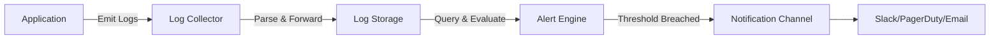
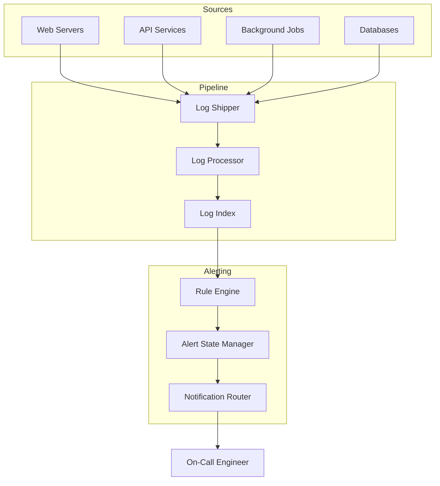
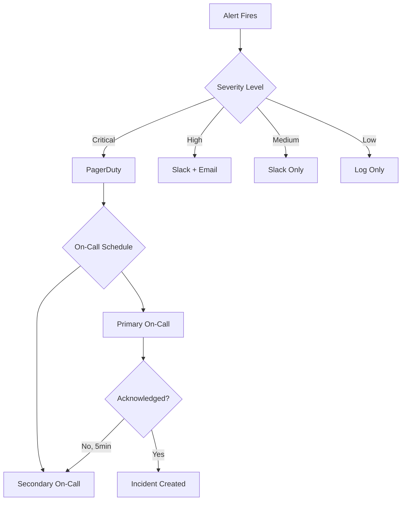

# How to Implement Log Alerting

Author: [nawazdhandala](https://github.com/nawazdhandala)

Tags: Logging, Alerting, Monitoring, Observability

Description: Learn to implement log alerting for automated detection of errors and anomalies.

---

Your application logs thousands of events every minute. Somewhere in that stream, a database connection timeout just happened. Three seconds later, a payment failed. Without log alerting, you will not know until customers start complaining on Twitter.

Log alerting transforms passive log storage into an active defense system. Instead of manually searching through gigabytes of logs after an incident, you get notified the moment something breaks. This guide covers the architecture, implementation patterns, and practical code to build effective log alerting from scratch.

## What is Log Alerting?

Log alerting is the process of automatically scanning log data for specific patterns, thresholds, or anomalies and triggering notifications when those conditions are met. It sits between your log ingestion pipeline and your incident response workflow.

The basic flow looks like this:



Unlike metric-based alerting, log alerting operates on unstructured or semi-structured text data. This makes it more flexible for catching unexpected errors but also requires careful design to avoid false positives.

## Why Log Alerting Matters

Metrics tell you that error rates increased. Logs tell you exactly which errors occurred, with full context. Log alerting bridges this gap by surfacing the specific problems that need attention.

Consider these scenarios where log alerting excels:

- **Security incidents**: Failed login attempts, unauthorized API access, suspicious query patterns
- **Application errors**: Unhandled exceptions, stack traces, deprecation warnings
- **Infrastructure issues**: Connection pool exhaustion, disk space warnings, certificate expiration notices
- **Business events**: Failed transactions, order processing errors, webhook delivery failures

Metrics aggregate. Logs narrate. Log alerting automates the narration.

## Architecture of a Log Alerting System

A production log alerting system has five core components that work together.



The **Log Shipper** collects logs from various sources and forwards them. Tools like Fluentd, Fluent Bit, or the OpenTelemetry Collector handle this layer.

The **Log Processor** parses, enriches, and transforms raw log lines into structured data. This is where you extract fields, add metadata, and normalize formats.

The **Log Index** stores processed logs and enables fast queries. This could be Elasticsearch, ClickHouse, or a managed service like OneUptime.

The **Rule Engine** evaluates alert conditions against incoming or stored logs. It runs queries on a schedule or processes logs in real-time.

The **Alert State Manager** tracks alert status to prevent duplicate notifications and handles alert lifecycle (firing, resolved, silenced).

## Designing Effective Alert Rules

Good alert rules have three properties: they are specific, actionable, and tuned. A vague alert like "errors detected" creates noise. A specific alert like "payment gateway timeout exceeded 5 occurrences in 2 minutes" drives action.

### Pattern-Based Alerts

Pattern alerts trigger when a log message matches a specific text pattern or regex.

Here is an example configuration for a pattern-based alert rule.

```yaml
# Alert rule: Detect database connection failures
name: database-connection-failure
description: Triggers when database connection errors occur
enabled: true

# Match condition
query:
  type: pattern
  pattern: "FATAL.*could not connect to server|connection refused|Connection timed out"
  case_sensitive: false

# Trigger threshold
threshold:
  count: 3
  window: 5m

# Notification settings
notifications:
  - channel: slack
    target: "#database-alerts"
  - channel: pagerduty
    severity: high
```

### Threshold-Based Alerts

Threshold alerts trigger when the count of matching logs exceeds a limit within a time window.

This Python example demonstrates a threshold alert evaluator.

```python
from dataclasses import dataclass
from datetime import datetime, timedelta
from collections import deque
import re

@dataclass
class AlertRule:
    name: str
    pattern: str
    threshold_count: int
    window_seconds: int

class ThresholdAlertEvaluator:
    def __init__(self, rule: AlertRule):
        self.rule = rule
        self.compiled_pattern = re.compile(rule.pattern, re.IGNORECASE)
        # Store timestamps of matching events
        self.matches: deque = deque()
        self.is_firing = False

    def evaluate(self, log_line: str, timestamp: datetime) -> bool:
        """
        Process a log line and return True if alert should fire.
        """
        # Check if log matches the pattern
        if not self.compiled_pattern.search(log_line):
            return False

        # Add match timestamp
        self.matches.append(timestamp)

        # Remove matches outside the time window
        cutoff = timestamp - timedelta(seconds=self.rule.window_seconds)
        while self.matches and self.matches[0] < cutoff:
            self.matches.popleft()

        # Check if threshold is exceeded
        match_count = len(self.matches)
        should_fire = match_count >= self.rule.threshold_count

        # Only fire once per incident (avoid spam)
        if should_fire and not self.is_firing:
            self.is_firing = True
            return True

        # Reset firing state when count drops below threshold
        if match_count < self.rule.threshold_count:
            self.is_firing = False

        return False

# Usage example
rule = AlertRule(
    name="high-error-rate",
    pattern=r"ERROR.*database.*timeout",
    threshold_count=5,
    window_seconds=300  # 5 minutes
)

evaluator = ThresholdAlertEvaluator(rule)
```

### Rate-of-Change Alerts

Rate alerts detect sudden spikes in log volume, useful for catching incidents that produce error floods.

```python
from collections import deque
from datetime import datetime, timedelta
from statistics import mean, stdev

class RateAnomalyDetector:
    def __init__(
        self,
        baseline_window_minutes: int = 60,
        evaluation_window_seconds: int = 60,
        std_dev_threshold: float = 3.0
    ):
        self.baseline_window = timedelta(minutes=baseline_window_minutes)
        self.eval_window = timedelta(seconds=evaluation_window_seconds)
        self.std_dev_threshold = std_dev_threshold
        # Store (timestamp, count) tuples for baseline calculation
        self.minute_counts: deque = deque()
        self.current_minute_count = 0
        self.current_minute_start: datetime = None

    def record_event(self, timestamp: datetime) -> dict:
        """
        Record a log event and check for anomalous rate.
        Returns alert info if anomaly detected.
        """
        # Initialize or roll over minute bucket
        minute_start = timestamp.replace(second=0, microsecond=0)

        if self.current_minute_start != minute_start:
            # Save previous minute count
            if self.current_minute_start is not None:
                self.minute_counts.append(
                    (self.current_minute_start, self.current_minute_count)
                )
            self.current_minute_start = minute_start
            self.current_minute_count = 0

            # Prune old data outside baseline window
            cutoff = timestamp - self.baseline_window
            while self.minute_counts and self.minute_counts[0][0] < cutoff:
                self.minute_counts.popleft()

        self.current_minute_count += 1

        # Need at least 10 minutes of baseline data
        if len(self.minute_counts) < 10:
            return None

        # Calculate baseline statistics
        baseline_counts = [c for _, c in self.minute_counts]
        baseline_mean = mean(baseline_counts)
        baseline_std = stdev(baseline_counts) if len(baseline_counts) > 1 else 0

        # Avoid division by zero for flat baselines
        if baseline_std == 0:
            baseline_std = baseline_mean * 0.1

        # Check if current rate is anomalous
        z_score = (self.current_minute_count - baseline_mean) / baseline_std

        if z_score > self.std_dev_threshold:
            return {
                "alert_type": "rate_anomaly",
                "current_rate": self.current_minute_count,
                "baseline_mean": round(baseline_mean, 2),
                "z_score": round(z_score, 2),
                "timestamp": timestamp.isoformat()
            }

        return None
```

## Structured Logging for Better Alerts

Unstructured logs make alerting harder. When you emit structured logs with consistent fields, alert rules become simpler and more reliable.

Here is a Node.js example using structured logging with correlation IDs.

```javascript
const pino = require('pino');
const { context, trace } = require('@opentelemetry/api');

// Create a structured logger instance
const logger = pino({
  level: process.env.LOG_LEVEL || 'info',
  formatters: {
    level: (label) => ({ level: label })
  },
  base: {
    service: process.env.SERVICE_NAME || 'api-service',
    environment: process.env.NODE_ENV || 'development'
  }
});

// Log helper that injects trace context
function log(level, message, fields = {}) {
  const span = trace.getSpan(context.active());
  const spanContext = span?.spanContext();

  logger[level]({
    ...fields,
    trace_id: spanContext?.traceId,
    span_id: spanContext?.spanId,
    timestamp: new Date().toISOString()
  }, message);
}

// Application usage examples
function processPayment(orderId, amount) {
  log('info', 'Payment processing started', {
    event: 'payment.started',
    order_id: orderId,
    amount: amount,
    currency: 'USD'
  });

  try {
    // Payment logic here
    log('info', 'Payment completed successfully', {
      event: 'payment.success',
      order_id: orderId
    });
  } catch (error) {
    // Structured error logging makes alerting precise
    log('error', 'Payment processing failed', {
      event: 'payment.failed',
      order_id: orderId,
      error_type: error.name,
      error_message: error.message,
      retry_count: 0
    });
    throw error;
  }
}
```

With structured logs, your alert rule can target specific fields.

```yaml
# Alert on payment failures with high amounts
name: high-value-payment-failure
query:
  type: structured
  filters:
    - field: event
      operator: equals
      value: "payment.failed"
    - field: amount
      operator: greater_than
      value: 1000

threshold:
  count: 1
  window: 1m

notifications:
  - channel: pagerduty
    severity: critical
```

## Integration with OpenTelemetry

OpenTelemetry provides a vendor-neutral way to collect and export logs. Here is how to set up the OpenTelemetry Collector with log alerting capabilities.

```yaml
# otel-collector-config.yaml
receivers:
  otlp:
    protocols:
      grpc:
        endpoint: 0.0.0.0:4317
      http:
        endpoint: 0.0.0.0:4318

processors:
  batch:
    send_batch_size: 1000
    timeout: 10s

  # Filter processor to route error logs to alerting
  filter/errors:
    logs:
      include:
        match_type: regexp
        bodies:
          - ".*ERROR.*"
          - ".*FATAL.*"
          - ".*Exception.*"

exporters:
  # Primary log storage
  otlphttp:
    endpoint: "https://oneuptime.com/otlp"
    headers:
      x-oneuptime-token: "${ONEUPTIME_TOKEN}"

  # Debug output for local development
  logging:
    verbosity: basic

service:
  pipelines:
    logs:
      receivers: [otlp]
      processors: [batch]
      exporters: [otlphttp]

    logs/alerts:
      receivers: [otlp]
      processors: [filter/errors, batch]
      exporters: [otlphttp, logging]
```

## Alert Notification Flow

When an alert fires, the notification system needs to route it to the right people through the right channels. This flow diagram shows a typical routing setup.



## Common Pitfalls to Avoid

**Alert fatigue**: Too many alerts desensitize the team. If an alert fires more than once a day and is ignored, either tune it or delete it.

**Missing context**: An alert that says "error occurred" is useless. Include the service name, affected endpoint, error count, and a link to the relevant logs.

**No deduplication**: Without state tracking, the same incident can trigger hundreds of notifications. Implement proper alert grouping and suppression.

**Static thresholds only**: A threshold of 10 errors per minute might be normal during peak hours but a disaster at 3 AM. Consider time-based thresholds or anomaly detection.

**Ignoring resolution**: Knowing when an issue is resolved is as important as knowing when it started. Implement auto-resolution alerts when conditions return to normal.

## Summary

Log alerting converts your logs from a passive archive into an active monitoring system. The key components are:

1. Structured log emission with consistent fields
2. A reliable pipeline from source to storage
3. A rule engine that evaluates patterns, thresholds, and anomalies
4. State management to prevent alert spam
5. Notification routing based on severity and on-call schedules

Start simple with pattern-based alerts for critical errors. Add threshold-based rules as you understand your baseline. Graduate to anomaly detection when you have enough historical data.

The goal is not to alert on everything. The goal is to alert on the things that matter, with enough context to act immediately.

---

**Related Reading:**

- [Logs, Metrics & Traces: Turning Three Noisy Streams into One Story](https://oneuptime.com/blog/post/2025-08-20-three-pillars-of-observability-logs-metrics-traces/view)
- [How to Reduce Noise in OpenTelemetry](https://oneuptime.com/blog/post/2025-08-25-how-to-reduce-noise-in-opentelemetry/view)
- [How to Structure Logs Properly in OpenTelemetry](https://oneuptime.com/blog/post/2025-08-28-how-to-structure-logs-properly-in-opentelemetry/view)
