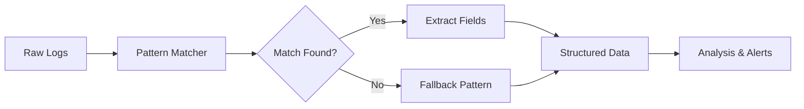
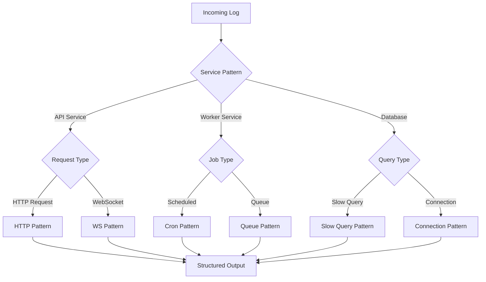
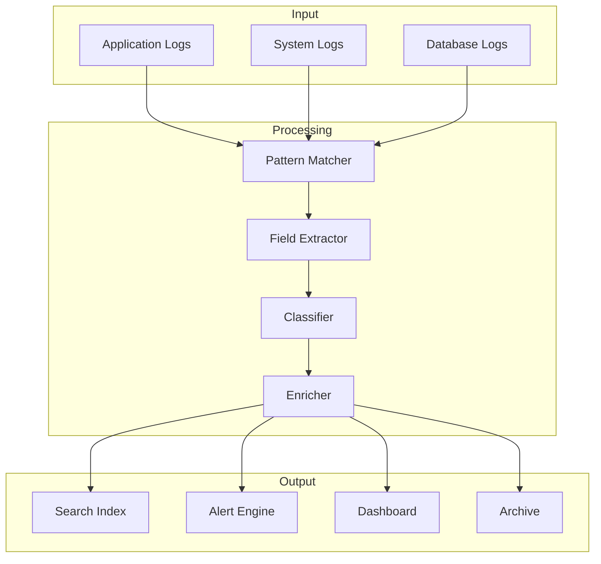

# How to Create Log Analysis Patterns

Author: [nawazdhandala](https://github.com/nawazdhandala)

Tags: Logging, Analysis, Patterns, Debugging

Description: Learn to create log analysis patterns for effective troubleshooting and insights.

---

Log analysis patterns are the building blocks of effective debugging. When your application produces thousands of log entries per minute, you need structured ways to extract meaning from the noise. This guide walks through practical techniques for creating patterns that help you identify issues faster and gain deeper insights into your system behavior.

---

## What Are Log Analysis Patterns?

Log analysis patterns are predefined rules or templates that match specific log formats, extract relevant fields, and categorize events. Think of them as filters that transform raw text into structured, queryable data.

The following diagram shows how raw logs flow through pattern matching to become actionable insights.



Without patterns, you are stuck with string searches and manual parsing. With patterns, you get instant field extraction, anomaly detection, and meaningful aggregations.

---

## Anatomy of a Log Analysis Pattern

Every effective pattern has three components: the matcher, the extractor, and the classifier. The matcher identifies which logs the pattern applies to. The extractor pulls out specific fields. The classifier assigns meaning to the event.

Here is a basic pattern structure in a configuration format that many log analysis tools support.

```yaml
# Pattern definition for HTTP request logs
# Each pattern needs a unique name for reference in alerts and dashboards
patterns:
  - name: "http_request"
    # Regex matcher - identifies logs this pattern handles
    # Uses named capture groups for field extraction
    matcher: '(?P<timestamp>\d{4}-\d{2}-\d{2}T\d{2}:\d{2}:\d{2}\.\d{3}Z) \[(?P<level>\w+)\] (?P<method>GET|POST|PUT|DELETE) (?P<path>/\S+) (?P<status>\d{3}) (?P<duration>\d+)ms'
    # Field type definitions for proper indexing and querying
    fields:
      timestamp: datetime
      level: string
      method: string
      path: string
      status: integer
      duration: integer
    # Classification rules based on extracted values
    classify:
      - condition: "status >= 500"
        category: "server_error"
        severity: "high"
      - condition: "status >= 400"
        category: "client_error"
        severity: "medium"
      - condition: "duration > 1000"
        category: "slow_request"
        severity: "medium"
```

---

## Building Patterns for Common Log Formats

### Application Error Logs

Error logs often contain stack traces and exception details. Your pattern needs to capture the error type, message, and location while handling multiline content.

This pattern handles typical Node.js error output with stack traces.

```javascript
// Pattern configuration for Node.js error logs
// Handles both single-line errors and multiline stack traces
const errorPattern = {
  name: 'nodejs_error',
  // Primary regex matches the error header line
  regex: /^(?<timestamp>\d{4}-\d{2}-\d{2}T[\d:.]+Z)\s+ERROR\s+(?<errorType>\w+):\s+(?<message>.+)$/m,

  // Multiline handler captures subsequent stack trace lines
  multiline: {
    // Stack trace lines start with whitespace and 'at'
    continuation: /^\s+at\s+/,
    // Combine into a single 'stack' field
    field: 'stack'
  },

  // Post-processing to extract additional context
  transform: (match) => {
    return {
      ...match,
      // Extract the module name from the first stack frame
      module: extractModule(match.stack),
      // Generate a fingerprint for grouping similar errors
      fingerprint: generateFingerprint(match.errorType, match.message)
    };
  }
};

// Helper to extract module name from stack trace
function extractModule(stack) {
  if (!stack) return 'unknown';
  // Match the file path in the first stack frame
  const match = stack.match(/at\s+\S+\s+\(([^:]+)/);
  return match ? match[1].split('/').pop() : 'unknown';
}

// Generate a stable fingerprint for error grouping
function generateFingerprint(errorType, message) {
  // Remove variable parts like IDs and timestamps
  const normalized = message
    .replace(/\b[0-9a-f]{8,}\b/gi, '{id}')
    .replace(/\d+/g, '{n}');
  return `${errorType}:${normalized}`;
}
```

### Database Query Logs

Database logs reveal performance bottlenecks and query patterns. Extract the query type, table, duration, and any slow query indicators.

```python
# Pattern for PostgreSQL slow query logs
# Captures query details and performance metrics
import re
from dataclasses import dataclass
from typing import Optional

@dataclass
class QueryLogPattern:
    name: str = "postgresql_query"

    # Regex pattern for PostgreSQL log format
    pattern: str = r'''
        (?P<timestamp>\d{4}-\d{2}-\d{2}\s\d{2}:\d{2}:\d{2}\.\d{3})\s
        \[(?P<pid>\d+)\]\s
        LOG:\s+duration:\s+(?P<duration>[\d.]+)\s+ms\s+
        statement:\s+(?P<query>.+)
    '''

    def parse(self, log_line: str) -> Optional[dict]:
        # Compile with VERBOSE flag for readable multiline regex
        match = re.match(self.pattern, log_line, re.VERBOSE)
        if not match:
            return None

        data = match.groupdict()

        # Extract query type from the SQL statement
        query_upper = data['query'].upper().strip()
        if query_upper.startswith('SELECT'):
            data['query_type'] = 'SELECT'
        elif query_upper.startswith('INSERT'):
            data['query_type'] = 'INSERT'
        elif query_upper.startswith('UPDATE'):
            data['query_type'] = 'UPDATE'
        elif query_upper.startswith('DELETE'):
            data['query_type'] = 'DELETE'
        else:
            data['query_type'] = 'OTHER'

        # Convert duration to float for numeric comparisons
        data['duration_ms'] = float(data['duration'])

        # Flag slow queries based on threshold
        data['is_slow'] = data['duration_ms'] > 100

        return data
```

---

## Pattern Composition and Hierarchy

Complex systems need layered patterns. Start with broad categories, then refine with specific matchers. This approach prevents pattern conflicts and makes maintenance easier.

The following diagram illustrates how patterns form a hierarchy from general to specific.



Here is how to implement a pattern hierarchy in practice.

```typescript
// Pattern hierarchy implementation
// Patterns are evaluated in order - first match wins
interface LogPattern {
  name: string;
  priority: number;
  match: (line: string) => boolean;
  extract: (line: string) => Record<string, any>;
}

class PatternMatcher {
  private patterns: LogPattern[] = [];

  // Register a pattern with its priority
  // Lower priority number = evaluated first
  register(pattern: LogPattern): void {
    this.patterns.push(pattern);
    // Sort by priority after each registration
    this.patterns.sort((a, b) => a.priority - b.priority);
  }

  // Process a log line through the pattern hierarchy
  process(line: string): { pattern: string; data: Record<string, any> } {
    for (const pattern of this.patterns) {
      if (pattern.match(line)) {
        return {
          pattern: pattern.name,
          data: pattern.extract(line)
        };
      }
    }
    // Fallback for unmatched logs
    return {
      pattern: 'unmatched',
      data: { raw: line }
    };
  }
}

// Example pattern definitions
const httpErrorPattern: LogPattern = {
  name: 'http_error',
  priority: 10,  // High priority - check first
  match: (line) => /\[ERROR\].*HTTP/.test(line),
  extract: (line) => {
    const match = line.match(
      /\[ERROR\]\s+HTTP\s+(\d+)\s+(\w+)\s+(\S+)\s+-\s+(.+)/
    );
    return match ? {
      status: parseInt(match[1]),
      method: match[2],
      path: match[3],
      message: match[4]
    } : { raw: line };
  }
};

const httpRequestPattern: LogPattern = {
  name: 'http_request',
  priority: 20,  // Lower priority - general HTTP logs
  match: (line) => /HTTP\/\d\.\d/.test(line),
  extract: (line) => {
    const match = line.match(
      /(\w+)\s+(\S+)\s+HTTP\/[\d.]+"\s+(\d+)\s+(\d+)/
    );
    return match ? {
      method: match[1],
      path: match[2],
      status: parseInt(match[3]),
      bytes: parseInt(match[4])
    } : { raw: line };
  }
};
```

---

## Putting It All Together

The following diagram shows how all these components work together in a complete log analysis pipeline.



Start with simple patterns for your most common log formats. Add complexity as you identify gaps. Test patterns regularly against production samples to catch format changes early. With well-designed patterns, your logs become a powerful debugging tool rather than an overwhelming stream of text.

---

## Key Takeaways

- Patterns transform raw logs into structured, queryable data
- Use a hierarchy of patterns from general to specific
- Test patterns thoroughly before production deployment
- Good patterns extract fields, classify events, and enable aggregation
- Start simple and add complexity as needed

---

**Related Reading:**

- [How to Structure Logs Properly in OpenTelemetry](https://oneuptime.com/blog/post/2025-08-28-how-to-structure-logs-properly-in-opentelemetry/view)
- [How to Reduce Noise in OpenTelemetry](https://oneuptime.com/blog/post/2025-08-25-how-to-reduce-noise-in-opentelemetry/view)
- [Three Pillars of Observability: Logs, Metrics, Traces](https://oneuptime.com/blog/post/2025-08-20-three-pillars-of-observability-logs-metrics-traces/view)
