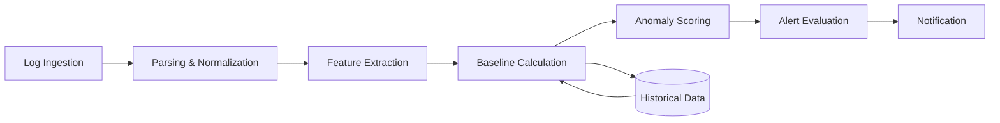
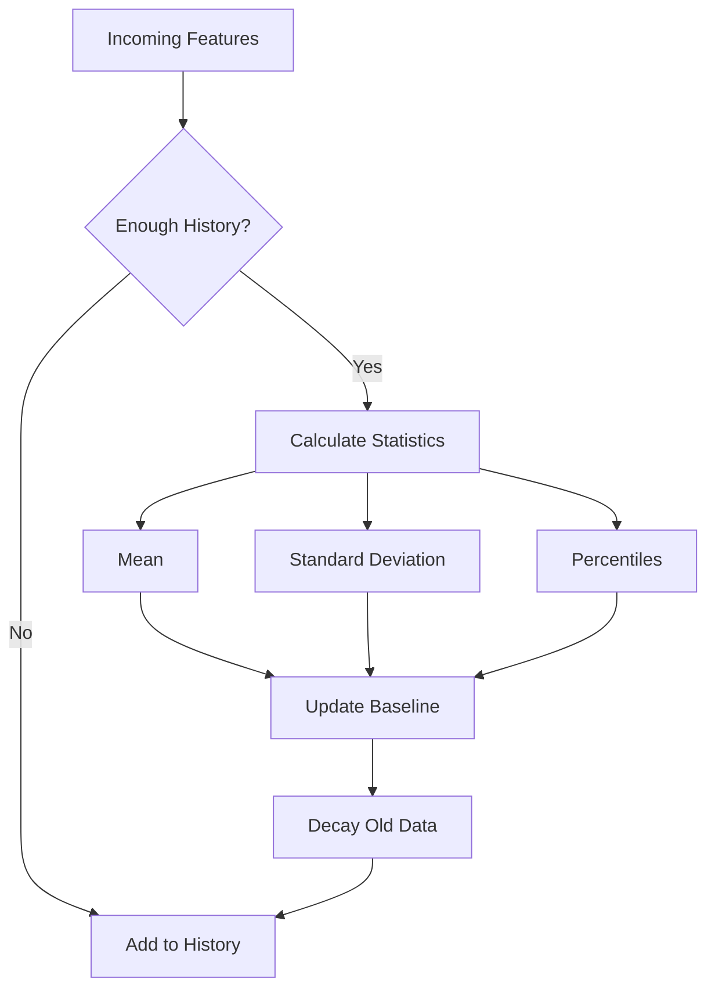
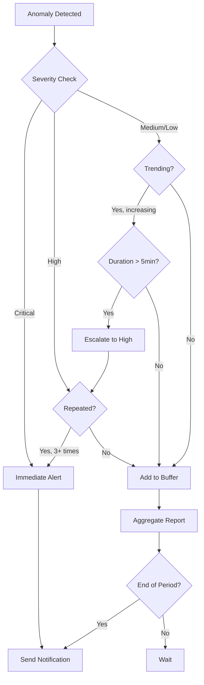

# How to Build Log Anomaly Detection

Author: [nawazdhandala](https://github.com/nawazdhandala)

Tags: Logging, Anomaly Detection, Machine Learning, Observability

Description: A practical guide to building log anomaly detection systems using statistical methods, pattern recognition, and smart alerting strategies.

---

Your logs tell a story. Most of the time, it is a boring story about successful requests and routine operations. But hidden in the noise are signals that something is about to go wrong. A sudden spike in error rates, an unusual pattern in authentication failures, a gradual increase in response times. These are the anomalies that matter.

The challenge is not collecting logs. You probably have millions of them. The challenge is finding the needles in the haystack before they become outages.

This guide walks you through building a practical log anomaly detection system, from basic statistical methods to pattern recognition and intelligent alerting.

---

## What Makes a Log Anomalous?

Before writing code, you need to understand what you are looking for. Log anomalies fall into three categories:

**Point Anomalies**: Single log entries that are unusual on their own. An error message that has never appeared before. A request from an unexpected IP range. A user action that does not fit normal behavior.

**Contextual Anomalies**: Log entries that are normal in some contexts but abnormal in others. A spike in login attempts is normal during business hours but suspicious at 3 AM. High CPU usage is expected during batch processing but concerning during idle periods.

**Collective Anomalies**: Groups of log entries that are anomalous as a sequence. Each individual log might look fine, but the pattern they form is unusual. A sequence of failed database connections followed by retries followed by timeouts tells a story of cascading failure.

---

## The Detection Pipeline

A log anomaly detection system processes logs through several stages. Each stage filters and enriches the data, narrowing down to actionable alerts.



Let me break down each stage.

---

## Stage 1: Log Parsing and Normalization

Raw logs come in many formats. Before you can detect anomalies, you need consistent structure.

```typescript
// log-parser.ts - Parse raw logs into structured format

interface ParsedLog {
  timestamp: Date;
  level: 'debug' | 'info' | 'warn' | 'error' | 'fatal';
  service: string;
  message: string;
  attributes: Record<string, any>;
  fingerprint: string;  // Hash of the log template
}

export class LogParser {
  private templatePatterns: Map<string, RegExp> = new Map();

  /**
   * Parse a raw log line into structured format.
   * Extracts timestamp, level, and normalizes the message.
   */
  parse(rawLog: string): ParsedLog {
    // Extract timestamp (supports ISO 8601 and common formats)
    const timestampMatch = rawLog.match(
      /(\d{4}-\d{2}-\d{2}[T ]\d{2}:\d{2}:\d{2}(?:\.\d{3})?(?:Z|[+-]\d{2}:?\d{2})?)/
    );
    const timestamp = timestampMatch
      ? new Date(timestampMatch[1])
      : new Date();

    // Extract log level
    const levelMatch = rawLog.match(/\b(DEBUG|INFO|WARN|ERROR|FATAL)\b/i);
    const level = (levelMatch?.[1]?.toLowerCase() || 'info') as ParsedLog['level'];

    // Extract service name from common patterns
    const serviceMatch = rawLog.match(/\[([^\]]+)\]/) ||
                         rawLog.match(/service=(\S+)/);
    const service = serviceMatch?.[1] || 'unknown';

    // Normalize message by replacing variables with placeholders
    const normalizedMessage = this.normalizeMessage(rawLog);
    const fingerprint = this.generateFingerprint(normalizedMessage);

    // Extract key-value attributes
    const attributes = this.extractAttributes(rawLog);

    return {
      timestamp,
      level,
      service,
      message: rawLog,
      attributes,
      fingerprint,
    };
  }

  /**
   * Replace variable parts of the message with placeholders.
   * This groups similar logs together for pattern analysis.
   */
  private normalizeMessage(message: string): string {
    return message
      // Replace UUIDs
      .replace(/[0-9a-f]{8}-[0-9a-f]{4}-[0-9a-f]{4}-[0-9a-f]{4}-[0-9a-f]{12}/gi, '<UUID>')
      // Replace IP addresses
      .replace(/\d{1,3}\.\d{1,3}\.\d{1,3}\.\d{1,3}/g, '<IP>')
      // Replace numbers
      .replace(/\b\d+\b/g, '<NUM>')
      // Replace email addresses
      .replace(/[^\s@]+@[^\s@]+\.[^\s@]+/g, '<EMAIL>')
      // Replace file paths
      .replace(/\/[\w\-./]+/g, '<PATH>')
      // Replace quoted strings
      .replace(/"[^"]*"/g, '"<STRING>"')
      .replace(/'[^']*'/g, "'<STRING>'");
  }

  /**
   * Generate a hash fingerprint for the normalized message.
   * Logs with the same fingerprint are considered the same "type".
   */
  private generateFingerprint(normalizedMessage: string): string {
    let hash = 0;
    for (let i = 0; i < normalizedMessage.length; i++) {
      const char = normalizedMessage.charCodeAt(i);
      hash = ((hash << 5) - hash) + char;
      hash = hash & hash;  // Convert to 32-bit integer
    }
    return hash.toString(16);
  }

  /**
   * Extract key=value pairs from the log message.
   */
  private extractAttributes(message: string): Record<string, any> {
    const attributes: Record<string, any> = {};
    const kvPattern = /(\w+)=("[^"]*"|\S+)/g;
    let match;

    while ((match = kvPattern.exec(message)) !== null) {
      const key = match[1];
      let value: any = match[2].replace(/^"|"$/g, '');

      // Try to parse as number
      if (/^\d+$/.test(value)) {
        value = parseInt(value, 10);
      } else if (/^\d+\.\d+$/.test(value)) {
        value = parseFloat(value);
      }

      attributes[key] = value;
    }

    return attributes;
  }
}
```

---

## Stage 2: Feature Extraction

Raw parsed logs need to be converted into numerical features that statistical methods can work with. This is where domain knowledge matters.

```typescript
// feature-extractor.ts - Convert logs into numerical features

interface LogFeatures {
  timestamp: number;
  fingerprint: string;
  service: string;
  features: {
    errorRate: number;           // Errors per minute
    logVolume: number;           // Logs per minute
    uniqueMessages: number;      // Distinct message types
    avgMessageLength: number;    // Character length
    numericValues: number[];     // Extracted numbers (latency, counts, etc.)
    timeOfDay: number;           // Hour (0-23) for contextual analysis
    dayOfWeek: number;           // Day (0-6) for weekly patterns
  };
}

export class FeatureExtractor {
  private windowMs: number;
  private logBuffer: ParsedLog[] = [];

  constructor(windowMs: number = 60000) {  // 1 minute default
    this.windowMs = windowMs;
  }

  /**
   * Add a log to the buffer and extract features when window is complete.
   */
  addLog(log: ParsedLog): LogFeatures | null {
    this.logBuffer.push(log);
    this.pruneOldLogs(log.timestamp);

    // Only emit features at window boundaries
    if (this.logBuffer.length > 0 && this.isWindowComplete(log.timestamp)) {
      return this.extractFeatures();
    }
    return null;
  }

  /**
   * Extract numerical features from the current log window.
   */
  private extractFeatures(): LogFeatures {
    const logs = this.logBuffer;
    const now = logs[logs.length - 1].timestamp;

    // Count errors
    const errorCount = logs.filter(
      l => l.level === 'error' || l.level === 'fatal'
    ).length;

    // Count unique message fingerprints
    const uniqueFingerprints = new Set(logs.map(l => l.fingerprint));

    // Calculate average message length
    const avgLength = logs.reduce(
      (sum, l) => sum + l.message.length, 0
    ) / logs.length;

    // Extract numeric values from attributes (latency, counts, etc.)
    const numericValues: number[] = [];
    for (const log of logs) {
      for (const value of Object.values(log.attributes)) {
        if (typeof value === 'number') {
          numericValues.push(value);
        }
      }
    }

    return {
      timestamp: now.getTime(),
      fingerprint: logs[0].fingerprint,
      service: logs[0].service,
      features: {
        errorRate: errorCount / (this.windowMs / 60000),
        logVolume: logs.length / (this.windowMs / 60000),
        uniqueMessages: uniqueFingerprints.size,
        avgMessageLength: avgLength,
        numericValues,
        timeOfDay: now.getHours(),
        dayOfWeek: now.getDay(),
      },
    };
  }

  private pruneOldLogs(now: Date): void {
    const cutoff = now.getTime() - this.windowMs;
    this.logBuffer = this.logBuffer.filter(
      l => l.timestamp.getTime() > cutoff
    );
  }

  private isWindowComplete(now: Date): boolean {
    if (this.logBuffer.length === 0) return false;
    const oldest = this.logBuffer[0].timestamp.getTime();
    return now.getTime() - oldest >= this.windowMs;
  }
}
```

---

## Stage 3: Statistical Baseline Calculation

To detect anomalies, you need to know what "normal" looks like. This requires building a baseline from historical data.



```typescript
// baseline-calculator.ts - Calculate statistical baselines

interface BaselineStats {
  mean: number;
  stdDev: number;
  p50: number;
  p90: number;
  p99: number;
  sampleCount: number;
  lastUpdated: Date;
}

export class BaselineCalculator {
  private history: Map<string, number[]> = new Map();
  private baselines: Map<string, BaselineStats> = new Map();
  private maxHistorySize: number;
  private decayFactor: number;

  constructor(maxHistorySize: number = 10000, decayFactor: number = 0.95) {
    this.maxHistorySize = maxHistorySize;
    this.decayFactor = decayFactor;  // Weight recent data more heavily
  }

  /**
   * Add a new observation and update the baseline.
   * Returns the current baseline stats for comparison.
   */
  addObservation(key: string, value: number): BaselineStats {
    // Initialize history if needed
    if (!this.history.has(key)) {
      this.history.set(key, []);
    }

    const history = this.history.get(key)!;
    history.push(value);

    // Prune old values if history is too large
    if (history.length > this.maxHistorySize) {
      history.shift();
    }

    // Recalculate baseline
    const baseline = this.calculateStats(history);
    this.baselines.set(key, baseline);

    return baseline;
  }

  /**
   * Get the current baseline for a metric.
   */
  getBaseline(key: string): BaselineStats | undefined {
    return this.baselines.get(key);
  }

  /**
   * Calculate statistical measures from history.
   */
  private calculateStats(values: number[]): BaselineStats {
    if (values.length === 0) {
      return {
        mean: 0,
        stdDev: 0,
        p50: 0,
        p90: 0,
        p99: 0,
        sampleCount: 0,
        lastUpdated: new Date(),
      };
    }

    // Calculate mean with exponential decay weighting
    let weightedSum = 0;
    let weightSum = 0;
    for (let i = 0; i < values.length; i++) {
      const weight = Math.pow(this.decayFactor, values.length - 1 - i);
      weightedSum += values[i] * weight;
      weightSum += weight;
    }
    const mean = weightedSum / weightSum;

    // Calculate standard deviation
    let varianceSum = 0;
    for (let i = 0; i < values.length; i++) {
      const weight = Math.pow(this.decayFactor, values.length - 1 - i);
      varianceSum += weight * Math.pow(values[i] - mean, 2);
    }
    const stdDev = Math.sqrt(varianceSum / weightSum);

    // Calculate percentiles
    const sorted = [...values].sort((a, b) => a - b);
    const p50 = this.percentile(sorted, 0.50);
    const p90 = this.percentile(sorted, 0.90);
    const p99 = this.percentile(sorted, 0.99);

    return {
      mean,
      stdDev,
      p50,
      p90,
      p99,
      sampleCount: values.length,
      lastUpdated: new Date(),
    };
  }

  private percentile(sortedValues: number[], p: number): number {
    const index = Math.ceil(p * sortedValues.length) - 1;
    return sortedValues[Math.max(0, index)];
  }
}
```

---

## Stage 4: Anomaly Scoring

With baselines established, you can score each observation for how anomalous it is. The Z-score is a simple and effective starting point.

```typescript
// anomaly-scorer.ts - Score observations against baselines

interface AnomalyScore {
  value: number;
  baseline: BaselineStats;
  zScore: number;           // Standard deviations from mean
  percentileRank: number;   // Where this value falls in history
  isAnomaly: boolean;
  severity: 'low' | 'medium' | 'high' | 'critical';
  reason: string;
}

export class AnomalyScorer {
  private baselineCalculator: BaselineCalculator;
  private thresholds: {
    low: number;
    medium: number;
    high: number;
    critical: number;
  };

  constructor(baselineCalculator: BaselineCalculator) {
    this.baselineCalculator = baselineCalculator;
    // Default thresholds in standard deviations
    this.thresholds = {
      low: 2,
      medium: 3,
      high: 4,
      critical: 5,
    };
  }

  /**
   * Score an observation against its baseline.
   */
  score(key: string, value: number): AnomalyScore {
    const baseline = this.baselineCalculator.addObservation(key, value);

    // Calculate Z-score
    const zScore = baseline.stdDev > 0
      ? (value - baseline.mean) / baseline.stdDev
      : 0;

    // Calculate percentile rank
    const percentileRank = this.calculatePercentileRank(value, baseline);

    // Determine if anomalous and severity
    const absZScore = Math.abs(zScore);
    let severity: AnomalyScore['severity'] = 'low';
    let isAnomaly = false;
    let reason = 'Within normal range';

    if (absZScore >= this.thresholds.critical) {
      severity = 'critical';
      isAnomaly = true;
      reason = `Value is ${absZScore.toFixed(1)} standard deviations from mean`;
    } else if (absZScore >= this.thresholds.high) {
      severity = 'high';
      isAnomaly = true;
      reason = `Value is ${absZScore.toFixed(1)} standard deviations from mean`;
    } else if (absZScore >= this.thresholds.medium) {
      severity = 'medium';
      isAnomaly = true;
      reason = `Value is ${absZScore.toFixed(1)} standard deviations from mean`;
    } else if (absZScore >= this.thresholds.low) {
      severity = 'low';
      isAnomaly = true;
      reason = `Value is ${absZScore.toFixed(1)} standard deviations from mean`;
    }

    // Also check for "never seen before" values
    if (baseline.sampleCount < 100) {
      // Not enough data for reliable anomaly detection
      isAnomaly = false;
      reason = 'Insufficient baseline data';
    }

    return {
      value,
      baseline,
      zScore,
      percentileRank,
      isAnomaly,
      severity,
      reason,
    };
  }

  private calculatePercentileRank(value: number, baseline: BaselineStats): number {
    // Approximate percentile using normal distribution
    if (baseline.stdDev === 0) return 50;

    const zScore = (value - baseline.mean) / baseline.stdDev;
    // Standard normal CDF approximation
    const t = 1 / (1 + 0.2316419 * Math.abs(zScore));
    const d = 0.3989423 * Math.exp(-zScore * zScore / 2);
    const p = d * t * (0.3193815 + t * (-0.3565638 + t * (1.781478 + t * (-1.821256 + t * 1.330274))));

    return zScore > 0 ? (1 - p) * 100 : p * 100;
  }
}
```

---

## Stage 5: Pattern Recognition

Statistical methods catch numerical anomalies, but many log anomalies are about patterns. A new error message that has never appeared before. A sequence of events that indicates a problem.

```typescript
// pattern-detector.ts - Detect anomalous patterns in logs

interface PatternAnomaly {
  type: 'new_message' | 'frequency_change' | 'sequence' | 'correlation';
  description: string;
  severity: 'low' | 'medium' | 'high' | 'critical';
  evidence: string[];
  timestamp: Date;
}

export class PatternDetector {
  private knownFingerprints: Set<string> = new Set();
  private fingerprintCounts: Map<string, number> = new Map();
  private recentSequence: string[] = [];
  private knownSequences: Set<string> = new Set();
  private maxSequenceLength: number = 5;

  /**
   * Analyze a log for pattern anomalies.
   * Returns detected anomalies (may be empty if log is normal).
   */
  analyze(log: ParsedLog): PatternAnomaly[] {
    const anomalies: PatternAnomaly[] = [];

    // Check for new message types
    const newMessageAnomaly = this.checkNewMessage(log);
    if (newMessageAnomaly) {
      anomalies.push(newMessageAnomaly);
    }

    // Check for frequency changes
    const frequencyAnomaly = this.checkFrequencyChange(log);
    if (frequencyAnomaly) {
      anomalies.push(frequencyAnomaly);
    }

    // Check for unusual sequences
    const sequenceAnomaly = this.checkSequence(log);
    if (sequenceAnomaly) {
      anomalies.push(sequenceAnomaly);
    }

    return anomalies;
  }

  /**
   * Detect log messages that have never been seen before.
   * New error messages are especially important to flag.
   */
  private checkNewMessage(log: ParsedLog): PatternAnomaly | null {
    const isNew = !this.knownFingerprints.has(log.fingerprint);
    this.knownFingerprints.add(log.fingerprint);

    if (isNew && (log.level === 'error' || log.level === 'fatal')) {
      return {
        type: 'new_message',
        description: 'New error message type detected',
        severity: 'high',
        evidence: [
          `Message: ${log.message.substring(0, 200)}`,
          `Service: ${log.service}`,
          `Level: ${log.level}`,
        ],
        timestamp: log.timestamp,
      };
    }

    if (isNew && this.knownFingerprints.size > 1000) {
      // Only flag new info/warn messages if we have substantial history
      return {
        type: 'new_message',
        description: 'New log message type detected',
        severity: 'low',
        evidence: [
          `Message: ${log.message.substring(0, 200)}`,
          `Service: ${log.service}`,
        ],
        timestamp: log.timestamp,
      };
    }

    return null;
  }

  /**
   * Detect sudden changes in message frequency.
   * A message that suddenly appears 10x more often is suspicious.
   */
  private checkFrequencyChange(log: ParsedLog): PatternAnomaly | null {
    const currentCount = (this.fingerprintCounts.get(log.fingerprint) || 0) + 1;
    this.fingerprintCounts.set(log.fingerprint, currentCount);

    // Check if this fingerprint is suddenly very frequent
    const totalMessages = Array.from(this.fingerprintCounts.values())
      .reduce((a, b) => a + b, 0);
    const expectedFrequency = totalMessages / this.fingerprintCounts.size;
    const actualFrequency = currentCount;

    if (currentCount > 100 && actualFrequency > expectedFrequency * 10) {
      return {
        type: 'frequency_change',
        description: 'Log message frequency spike detected',
        severity: 'medium',
        evidence: [
          `Message appears ${actualFrequency.toFixed(0)}x more than average`,
          `Count: ${currentCount}`,
          `Expected: ${expectedFrequency.toFixed(0)}`,
        ],
        timestamp: log.timestamp,
      };
    }

    return null;
  }

  /**
   * Detect unusual sequences of log messages.
   * Some problems manifest as specific patterns of events.
   */
  private checkSequence(log: ParsedLog): PatternAnomaly | null {
    // Add to recent sequence
    this.recentSequence.push(log.fingerprint);
    if (this.recentSequence.length > this.maxSequenceLength) {
      this.recentSequence.shift();
    }

    // Check if current sequence is known
    const sequenceKey = this.recentSequence.join('->');

    if (this.recentSequence.length >= this.maxSequenceLength) {
      if (!this.knownSequences.has(sequenceKey)) {
        // Check if this sequence contains errors
        const hasError = log.level === 'error' || log.level === 'fatal';

        if (hasError && this.knownSequences.size > 100) {
          this.knownSequences.add(sequenceKey);
          return {
            type: 'sequence',
            description: 'New error sequence pattern detected',
            severity: 'medium',
            evidence: [
              `Sequence: ${this.recentSequence.length} messages`,
              `Ends with: ${log.message.substring(0, 100)}`,
            ],
            timestamp: log.timestamp,
          };
        }

        this.knownSequences.add(sequenceKey);
      }
    }

    return null;
  }

  /**
   * Learn from historical logs to build pattern knowledge.
   */
  learnFromHistory(logs: ParsedLog[]): void {
    for (const log of logs) {
      this.knownFingerprints.add(log.fingerprint);
      const count = (this.fingerprintCounts.get(log.fingerprint) || 0) + 1;
      this.fingerprintCounts.set(log.fingerprint, count);
    }
    console.log(`Learned ${this.knownFingerprints.size} unique message patterns`);
  }
}
```

---

## Stage 6: Alert Evaluation and Notification

Not every anomaly deserves an alert. Alert fatigue is real. You need intelligent filtering to surface only actionable anomalies.



```typescript
// alert-evaluator.ts - Filter and prioritize anomalies for alerting

interface Alert {
  id: string;
  title: string;
  description: string;
  severity: 'low' | 'medium' | 'high' | 'critical';
  anomalies: AnomalyScore[];
  patterns: PatternAnomaly[];
  service: string;
  timestamp: Date;
  suppressed: boolean;
  suppressionReason?: string;
}

interface AlertRule {
  name: string;
  condition: (anomaly: AnomalyScore, patterns: PatternAnomaly[]) => boolean;
  severity: Alert['severity'];
  cooldownMs: number;  // Minimum time between alerts for same rule
}

export class AlertEvaluator {
  private rules: AlertRule[] = [];
  private alertHistory: Map<string, Date> = new Map();
  private anomalyBuffer: Map<string, AnomalyScore[]> = new Map();
  private bufferWindowMs: number = 300000;  // 5 minutes

  constructor() {
    this.initializeDefaultRules();
  }

  /**
   * Evaluate anomalies and patterns to determine if an alert should fire.
   */
  evaluate(
    service: string,
    anomalyScores: AnomalyScore[],
    patternAnomalies: PatternAnomaly[]
  ): Alert | null {
    // Buffer anomalies for trend analysis
    this.bufferAnomalies(service, anomalyScores);

    // Check each rule
    for (const rule of this.rules) {
      for (const anomaly of anomalyScores) {
        if (rule.condition(anomaly, patternAnomalies)) {
          // Check cooldown
          const ruleKey = `${service}:${rule.name}`;
          const lastAlert = this.alertHistory.get(ruleKey);

          if (lastAlert && Date.now() - lastAlert.getTime() < rule.cooldownMs) {
            continue;  // Skip due to cooldown
          }

          // Check if this is a sustained anomaly (not just a blip)
          const buffered = this.anomalyBuffer.get(service) || [];
          const recentAnomalies = buffered.filter(a => a.isAnomaly);

          if (rule.severity !== 'critical' && recentAnomalies.length < 3) {
            continue;  // Wait for more evidence
          }

          // Create alert
          const alert = this.createAlert(
            service,
            rule,
            anomalyScores,
            patternAnomalies
          );

          // Record alert time
          this.alertHistory.set(ruleKey, new Date());

          return alert;
        }
      }
    }

    // Check pattern anomalies independently
    for (const pattern of patternAnomalies) {
      if (pattern.severity === 'critical' || pattern.severity === 'high') {
        const ruleKey = `${service}:pattern:${pattern.type}`;
        const lastAlert = this.alertHistory.get(ruleKey);

        if (lastAlert && Date.now() - lastAlert.getTime() < 300000) {
          continue;
        }

        const alert: Alert = {
          id: this.generateAlertId(),
          title: pattern.description,
          description: pattern.evidence.join('\n'),
          severity: pattern.severity,
          anomalies: [],
          patterns: [pattern],
          service,
          timestamp: new Date(),
          suppressed: false,
        };

        this.alertHistory.set(ruleKey, new Date());
        return alert;
      }
    }

    return null;
  }

  private initializeDefaultRules(): void {
    this.rules = [
      {
        name: 'critical_error_rate',
        condition: (anomaly) =>
          anomaly.isAnomaly &&
          anomaly.severity === 'critical' &&
          anomaly.value > 0,  // Must have actual errors
        severity: 'critical',
        cooldownMs: 60000,  // 1 minute
      },
      {
        name: 'high_error_spike',
        condition: (anomaly) =>
          anomaly.isAnomaly &&
          anomaly.zScore > 4 &&
          anomaly.value > anomaly.baseline.p99,
        severity: 'high',
        cooldownMs: 300000,  // 5 minutes
      },
      {
        name: 'sustained_anomaly',
        condition: (anomaly) =>
          anomaly.isAnomaly &&
          anomaly.severity === 'medium',
        severity: 'medium',
        cooldownMs: 900000,  // 15 minutes
      },
    ];
  }

  private bufferAnomalies(service: string, anomalies: AnomalyScore[]): void {
    if (!this.anomalyBuffer.has(service)) {
      this.anomalyBuffer.set(service, []);
    }

    const buffer = this.anomalyBuffer.get(service)!;
    buffer.push(...anomalies);

    // Prune old entries
    const cutoff = Date.now() - this.bufferWindowMs;
    const pruned = buffer.filter(a => a.baseline.lastUpdated.getTime() > cutoff);
    this.anomalyBuffer.set(service, pruned);
  }

  private createAlert(
    service: string,
    rule: AlertRule,
    anomalies: AnomalyScore[],
    patterns: PatternAnomaly[]
  ): Alert {
    const relevantAnomalies = anomalies.filter(a => a.isAnomaly);

    return {
      id: this.generateAlertId(),
      title: `${rule.name.replace(/_/g, ' ')} detected in ${service}`,
      description: this.formatAlertDescription(relevantAnomalies, patterns),
      severity: rule.severity,
      anomalies: relevantAnomalies,
      patterns,
      service,
      timestamp: new Date(),
      suppressed: false,
    };
  }

  private formatAlertDescription(
    anomalies: AnomalyScore[],
    patterns: PatternAnomaly[]
  ): string {
    const lines: string[] = [];

    if (anomalies.length > 0) {
      lines.push('Statistical Anomalies:');
      for (const a of anomalies.slice(0, 5)) {
        lines.push(`  - ${a.reason} (value: ${a.value.toFixed(2)}, z-score: ${a.zScore.toFixed(2)})`);
      }
    }

    if (patterns.length > 0) {
      lines.push('Pattern Anomalies:');
      for (const p of patterns.slice(0, 5)) {
        lines.push(`  - ${p.description}`);
      }
    }

    return lines.join('\n');
  }

  private generateAlertId(): string {
    return `alert_${Date.now()}_${Math.random().toString(36).substr(2, 9)}`;
  }
}
```

---

## Putting It All Together

Here is a complete anomaly detection pipeline that processes logs in real-time:

```typescript
// anomaly-detection-pipeline.ts - Complete pipeline

import { LogParser, ParsedLog } from './log-parser';
import { FeatureExtractor, LogFeatures } from './feature-extractor';
import { BaselineCalculator } from './baseline-calculator';
import { AnomalyScorer, AnomalyScore } from './anomaly-scorer';
import { PatternDetector, PatternAnomaly } from './pattern-detector';
import { AlertEvaluator, Alert } from './alert-evaluator';

interface PipelineResult {
  log: ParsedLog;
  features: LogFeatures | null;
  anomalyScores: AnomalyScore[];
  patternAnomalies: PatternAnomaly[];
  alert: Alert | null;
}

export class AnomalyDetectionPipeline {
  private parser: LogParser;
  private featureExtractor: FeatureExtractor;
  private baselineCalculator: BaselineCalculator;
  private anomalyScorer: AnomalyScorer;
  private patternDetector: PatternDetector;
  private alertEvaluator: AlertEvaluator;

  constructor() {
    this.parser = new LogParser();
    this.featureExtractor = new FeatureExtractor(60000);  // 1 minute windows
    this.baselineCalculator = new BaselineCalculator(10000, 0.95);
    this.anomalyScorer = new AnomalyScorer(this.baselineCalculator);
    this.patternDetector = new PatternDetector();
    this.alertEvaluator = new AlertEvaluator();
  }

  /**
   * Process a single log line through the pipeline.
   */
  process(rawLog: string): PipelineResult {
    // Stage 1: Parse
    const log = this.parser.parse(rawLog);

    // Stage 2: Extract features
    const features = this.featureExtractor.addLog(log);

    // Stage 3 & 4: Score anomalies (if we have features)
    const anomalyScores: AnomalyScore[] = [];
    if (features) {
      // Score each feature dimension
      anomalyScores.push(
        this.anomalyScorer.score(
          `${log.service}:errorRate`,
          features.features.errorRate
        )
      );
      anomalyScores.push(
        this.anomalyScorer.score(
          `${log.service}:logVolume`,
          features.features.logVolume
        )
      );
      anomalyScores.push(
        this.anomalyScorer.score(
          `${log.service}:uniqueMessages`,
          features.features.uniqueMessages
        )
      );
    }

    // Stage 5: Pattern detection
    const patternAnomalies = this.patternDetector.analyze(log);

    // Stage 6: Alert evaluation
    const alert = this.alertEvaluator.evaluate(
      log.service,
      anomalyScores,
      patternAnomalies
    );

    return {
      log,
      features,
      anomalyScores,
      patternAnomalies,
      alert,
    };
  }

  /**
   * Train the detector on historical logs.
   */
  train(historicalLogs: string[]): void {
    console.log(`Training on ${historicalLogs.length} historical logs...`);

    const parsedLogs: ParsedLog[] = [];
    for (const raw of historicalLogs) {
      const log = this.parser.parse(raw);
      parsedLogs.push(log);

      // Build baseline
      const features = this.featureExtractor.addLog(log);
      if (features) {
        this.anomalyScorer.score(
          `${log.service}:errorRate`,
          features.features.errorRate
        );
        this.anomalyScorer.score(
          `${log.service}:logVolume`,
          features.features.logVolume
        );
      }
    }

    // Train pattern detector
    this.patternDetector.learnFromHistory(parsedLogs);

    console.log('Training complete');
  }
}

// Usage example
const pipeline = new AnomalyDetectionPipeline();

// Train on historical data
const historicalLogs = [
  '2026-01-30T10:00:00Z [api-server] INFO Request completed status=200 duration=45ms',
  '2026-01-30T10:00:01Z [api-server] INFO Request completed status=200 duration=52ms',
  // ... more historical logs
];
pipeline.train(historicalLogs);

// Process incoming logs
const result = pipeline.process(
  '2026-01-30T14:00:00Z [api-server] ERROR Database connection timeout after 30000ms'
);

if (result.alert) {
  console.log('ALERT:', result.alert.title);
  console.log('Severity:', result.alert.severity);
  console.log('Description:', result.alert.description);
}
```

---

## Tuning Your Detection System

Building the system is step one. Making it useful requires tuning.

### Reducing False Positives

False positives erode trust. Here are strategies to reduce them:

1. **Increase baseline sample size**: Require at least 1000 observations before flagging anomalies
2. **Use longer cooldown periods**: Prevent alert storms from the same issue
3. **Require sustained anomalies**: A single spike is noise; three in a row is signal
4. **Adjust thresholds per service**: Some services are naturally more variable

### Reducing False Negatives

Missing real problems is worse than false alarms. To catch more:

1. **Lower thresholds for critical services**: A 2-sigma deviation in your payment service matters more than in your logging service
2. **Add service-specific rules**: Some patterns are anomalous only in specific contexts
3. **Use multiple detection methods**: Statistical, pattern, and rule-based together catch more than any alone

### Seasonal Adjustments

Many systems have predictable patterns:

```typescript
// Time-aware baseline that accounts for daily/weekly patterns
class SeasonalBaselineCalculator extends BaselineCalculator {
  private hourlyBaselines: Map<string, Map<number, number[]>> = new Map();

  addSeasonalObservation(key: string, value: number, timestamp: Date): BaselineStats {
    const hour = timestamp.getHours();
    const seasonalKey = `${key}:hour:${hour}`;

    // Store in hourly bucket
    if (!this.hourlyBaselines.has(key)) {
      this.hourlyBaselines.set(key, new Map());
    }
    const hourMap = this.hourlyBaselines.get(key)!;
    if (!hourMap.has(hour)) {
      hourMap.set(hour, []);
    }
    hourMap.get(hour)!.push(value);

    // Calculate baseline using same-hour historical data
    return this.addObservation(seasonalKey, value);
  }
}
```

---

## Integration with OneUptime

Once you have anomaly detection working, you need somewhere to send alerts. OneUptime provides native log ingestion with OpenTelemetry support, making integration straightforward.

```typescript
// oneuptime-integration.ts - Send alerts to OneUptime

import { Alert } from './alert-evaluator';

export class OneUptimeIntegration {
  private apiUrl: string;
  private apiToken: string;

  constructor(apiUrl: string, apiToken: string) {
    this.apiUrl = apiUrl;
    this.apiToken = apiToken;
  }

  /**
   * Create an incident in OneUptime from an anomaly alert.
   */
  async createIncident(alert: Alert): Promise<void> {
    const incidentData = {
      title: alert.title,
      description: alert.description,
      severity: this.mapSeverity(alert.severity),
      monitors: [alert.service],
      customFields: {
        anomaly_count: alert.anomalies.length,
        pattern_count: alert.patterns.length,
        detection_method: 'log_anomaly_detection',
      },
    };

    const response = await fetch(`${this.apiUrl}/api/incidents`, {
      method: 'POST',
      headers: {
        'Content-Type': 'application/json',
        'Authorization': `Bearer ${this.apiToken}`,
      },
      body: JSON.stringify(incidentData),
    });

    if (!response.ok) {
      throw new Error(`Failed to create incident: ${response.statusText}`);
    }
  }

  private mapSeverity(severity: Alert['severity']): string {
    const mapping = {
      critical: 'Critical',
      high: 'High',
      medium: 'Medium',
      low: 'Low',
    };
    return mapping[severity];
  }
}
```

---

## Key Takeaways

Building log anomaly detection is not about fancy algorithms. It is about:

1. **Structure your logs consistently**: You cannot detect anomalies in chaos
2. **Build baselines from real data**: Theoretical thresholds fail in production
3. **Combine multiple detection methods**: Statistics catch numbers, patterns catch sequences
4. **Filter aggressively**: Alert fatigue kills detection systems
5. **Tune continuously**: What is anomalous changes as your system evolves

Start simple. A basic Z-score detector on error rates catches more problems than no detection at all. Add complexity only when you have specific problems that simpler methods miss.

The goal is not to catch every anomaly. The goal is to catch the ones that matter, before they become outages.

---

**Related Reading:**

- [How to Structure Logs Properly in OpenTelemetry](https://oneuptime.com/blog/post/2025-08-28-how-to-structure-logs-properly-in-opentelemetry/view)
- [Logs, Metrics & Traces: Turning Three Noisy Streams into One Story](https://oneuptime.com/blog/post/2025-08-20-three-pillars-of-observability-logs-metrics-traces/view)
- [What is OpenTelemetry Collector and Why Use One](https://oneuptime.com/blog/post/2025-09-18-what-is-opentelemetry-collector-and-why-use-one/view)
