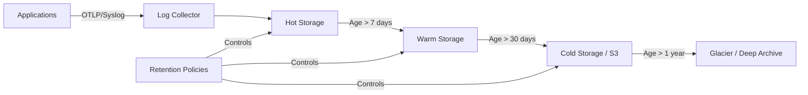
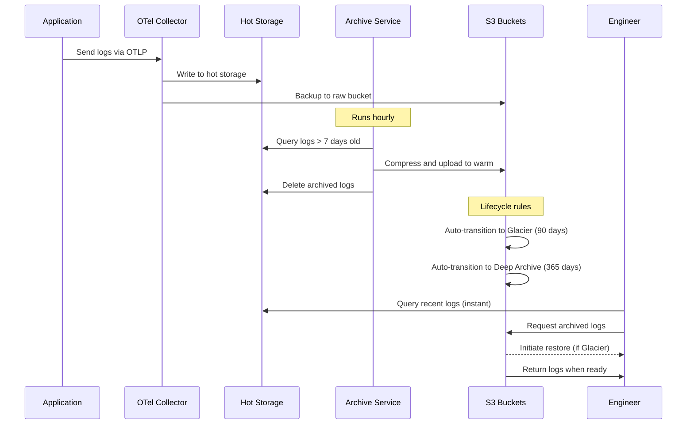

# How to Build Log Archival Strategies

Author: [nawazdhandala](https://github.com/nawazdhandala)

Tags: Logging, Archival, S3, Cold Storage

Description: Learn to build log archival strategies for long-term storage and compliance.

---

Logs pile up fast. A medium-sized application can generate gigabytes of log data per day. At scale, that becomes terabytes per month. Most teams keep logs in hot storage far longer than needed, paying premium prices for data they rarely query. The solution is a well-designed archival strategy that moves logs through storage tiers based on age and access patterns.

This guide walks through building a log archival pipeline that balances cost, compliance requirements, and operational needs.

---

## Why Log Archival Matters

Keeping all logs in hot storage is expensive and unnecessary. Consider the access patterns for most log data:

- **Last 24 hours:** Frequent queries during active debugging
- **Last 7 days:** Occasional queries for incident investigation
- **Last 30 days:** Rare queries, mostly for audits
- **Beyond 30 days:** Almost never accessed, but required for compliance

A tiered storage approach matches storage costs to actual usage. Hot storage (fast SSDs, indexed databases) handles recent logs. Warm storage (slower disks, reduced indexing) holds intermediate data. Cold storage (object storage like S3) archives everything else at a fraction of the cost.

---

## The Archival Pipeline Architecture

A log archival system needs three core components: ingestion, tiering logic, and storage backends. Here is how these pieces connect.



The collector receives logs from all sources and writes to hot storage. Background jobs evaluate retention policies and migrate logs through the tiers. Each tier has different characteristics.

| Tier | Retention | Query Speed | Cost | Use Case |
|------|-----------|-------------|------|----------|
| Hot | 1-7 days | < 1 second | $$$ | Active debugging |
| Warm | 7-30 days | 5-30 seconds | $$ | Incident investigation |
| Cold | 30-365 days | Minutes | $ | Compliance, audits |
| Archive | 1-7 years | Hours | Cents | Legal holds |

---

## Implementing the Collector Layer

The OpenTelemetry Collector serves as the foundation for log ingestion and routing. This configuration accepts logs from multiple sources and routes them to appropriate backends.

```yaml
# otel-collector-config.yaml
# OpenTelemetry Collector configuration for log archival pipeline

receivers:
  # Accept OTLP logs from instrumented applications
  otlp:
    protocols:
      grpc:
        endpoint: 0.0.0.0:4317
      http:
        endpoint: 0.0.0.0:4318

  # Accept syslog from legacy systems
  syslog:
    tcp:
      listen_address: 0.0.0.0:54526
    protocol: rfc5424

processors:
  # Add timestamps and metadata for archival tracking
  attributes:
    actions:
      - key: archive.ingested_at
        value: ${timestamp}
        action: insert
      - key: archive.retention_tier
        value: hot
        action: insert

  # Batch logs to improve write efficiency
  batch:
    timeout: 5s
    send_batch_size: 1000

exporters:
  # Primary destination for hot storage
  otlphttp/hot:
    endpoint: https://oneuptime.com/otlp
    headers:
      x-oneuptime-token: ${ONEUPTIME_TOKEN}

  # Secondary destination for immediate S3 backup
  awss3:
    s3uploader:
      region: us-east-1
      bucket: logs-archive-raw
      partition: minute

service:
  pipelines:
    logs:
      receivers: [otlp, syslog]
      processors: [attributes, batch]
      exporters: [otlphttp/hot, awss3]
```

This configuration sends logs to both hot storage (OneUptime) and raw S3 backup simultaneously. The S3 backup ensures you never lose data even if the primary system has issues.

---

## Building the Tiering Service

A background service handles moving logs between storage tiers. This Node.js implementation queries for aged logs and migrates them to the appropriate tier.

```typescript
// archive-service.ts
// Service that moves logs through storage tiers based on age

import { S3Client, PutObjectCommand } from '@aws-sdk/client-s3';
import { createGzip } from 'zlib';
import { pipeline } from 'stream/promises';

interface ArchiveConfig {
  hotRetentionDays: number;      // Days to keep in hot storage
  warmRetentionDays: number;     // Days to keep in warm storage
  coldRetentionDays: number;     // Days to keep in cold storage
  compressionLevel: number;       // Gzip compression level (1-9)
}

interface LogBatch {
  logs: LogRecord[];
  startTime: Date;
  endTime: Date;
  service: string;
}

interface LogRecord {
  timestamp: Date;
  severity: string;
  body: string;
  attributes: Record<string, unknown>;
  traceId?: string;
  spanId?: string;
}

export class LogArchiveService {
  private s3Client: S3Client;
  private config: ArchiveConfig;

  constructor(config: ArchiveConfig) {
    this.config = config;
    this.s3Client = new S3Client({ region: process.env.AWS_REGION });
  }

  // Main entry point: run the archive cycle
  async runArchiveCycle(): Promise<void> {
    console.log('Starting archive cycle', { timestamp: new Date().toISOString() });

    // Move logs from hot to warm storage
    await this.migrateToWarm();

    // Move logs from warm to cold storage
    await this.migrateToCold();

    // Move logs from cold to deep archive
    await this.migrateToArchive();

    console.log('Archive cycle complete', { timestamp: new Date().toISOString() });
  }

  // Migrate logs older than hotRetentionDays to warm storage
  private async migrateToWarm(): Promise<void> {
    const cutoffDate = this.getCutoffDate(this.config.hotRetentionDays);
    const batches = await this.queryLogsOlderThan(cutoffDate, 'hot');

    for (const batch of batches) {
      // Compress and upload to warm tier bucket
      await this.uploadToS3(batch, 'logs-archive-warm');
      // Delete from hot storage after successful upload
      await this.deleteFromHotStorage(batch);
    }
  }

  // Migrate logs older than warmRetentionDays to cold storage
  private async migrateToCold(): Promise<void> {
    const cutoffDate = this.getCutoffDate(this.config.warmRetentionDays);
    const batches = await this.queryLogsFromS3('logs-archive-warm', cutoffDate);

    for (const batch of batches) {
      // Re-compress with higher ratio for cold storage
      await this.uploadToS3(batch, 'logs-archive-cold', 9);
      await this.deleteFromS3('logs-archive-warm', batch);
    }
  }

  // Migrate logs older than coldRetentionDays to Glacier
  private async migrateToArchive(): Promise<void> {
    const cutoffDate = this.getCutoffDate(this.config.coldRetentionDays);
    // Glacier transition handled by S3 lifecycle rules
    console.log('Deep archive migration handled by S3 lifecycle policies');
  }

  // Upload a batch of logs to S3 with compression
  private async uploadToS3(
    batch: LogBatch,
    bucket: string,
    compressionLevel?: number
  ): Promise<void> {
    const key = this.generateS3Key(batch);
    const compressedData = await this.compressLogs(
      batch.logs,
      compressionLevel || this.config.compressionLevel
    );

    await this.s3Client.send(new PutObjectCommand({
      Bucket: bucket,
      Key: key,
      Body: compressedData,
      ContentType: 'application/gzip',
      Metadata: {
        'log-start-time': batch.startTime.toISOString(),
        'log-end-time': batch.endTime.toISOString(),
        'log-count': batch.logs.length.toString(),
        'service': batch.service,
      },
    }));

    console.log('Uploaded batch to S3', { bucket, key, logCount: batch.logs.length });
  }

  // Generate a hierarchical S3 key for efficient retrieval
  private generateS3Key(batch: LogBatch): string {
    const date = batch.startTime;
    // Partition by service/year/month/day/hour for efficient queries
    return [
      batch.service,
      date.getUTCFullYear(),
      String(date.getUTCMonth() + 1).padStart(2, '0'),
      String(date.getUTCDate()).padStart(2, '0'),
      String(date.getUTCHours()).padStart(2, '0'),
      `${date.getTime()}.json.gz`,
    ].join('/');
  }

  // Compress logs using gzip
  private async compressLogs(
    logs: LogRecord[],
    level: number
  ): Promise<Buffer> {
    const jsonData = JSON.stringify(logs);
    const gzip = createGzip({ level });

    const chunks: Buffer[] = [];
    gzip.on('data', (chunk) => chunks.push(chunk));
    gzip.write(jsonData);
    gzip.end();

    return new Promise((resolve) => {
      gzip.on('end', () => resolve(Buffer.concat(chunks)));
    });
  }

  private getCutoffDate(days: number): Date {
    const date = new Date();
    date.setDate(date.getDate() - days);
    return date;
  }

  // Placeholder methods for storage operations
  private async queryLogsOlderThan(date: Date, tier: string): Promise<LogBatch[]> {
    // Implementation depends on your hot storage system
    return [];
  }

  private async queryLogsFromS3(bucket: string, olderThan: Date): Promise<LogBatch[]> {
    // List and filter S3 objects by date
    return [];
  }

  private async deleteFromHotStorage(batch: LogBatch): Promise<void> {
    // Delete from primary log storage
  }

  private async deleteFromS3(bucket: string, batch: LogBatch): Promise<void> {
    // Delete S3 object
  }
}
```

Run this service on a schedule (hourly or daily) to continuously move logs through the tiers.

---

## Setting Up S3 Lifecycle Policies

S3 lifecycle rules automate transitions between storage classes. This Terraform configuration sets up a complete tiering policy.

```hcl
# s3-lifecycle.tf
# S3 bucket with lifecycle rules for log archival

resource "aws_s3_bucket" "logs_archive" {
  bucket = "company-logs-archive"
}

resource "aws_s3_bucket_lifecycle_configuration" "logs_lifecycle" {
  bucket = aws_s3_bucket.logs_archive.id

  # Rule for application logs: aggressive tiering
  rule {
    id     = "application-logs"
    status = "Enabled"

    filter {
      prefix = "app-logs/"
    }

    # Move to Infrequent Access after 30 days
    transition {
      days          = 30
      storage_class = "STANDARD_IA"
    }

    # Move to Glacier after 90 days
    transition {
      days          = 90
      storage_class = "GLACIER"
    }

    # Move to Deep Archive after 1 year
    transition {
      days          = 365
      storage_class = "DEEP_ARCHIVE"
    }

    # Delete after 7 years (compliance requirement)
    expiration {
      days = 2555
    }
  }

  # Rule for security logs: longer retention
  rule {
    id     = "security-logs"
    status = "Enabled"

    filter {
      prefix = "security-logs/"
    }

    transition {
      days          = 90
      storage_class = "STANDARD_IA"
    }

    transition {
      days          = 180
      storage_class = "GLACIER"
    }

    # Security logs kept for 10 years
    expiration {
      days = 3650
    }
  }
}

# Enable versioning for compliance
resource "aws_s3_bucket_versioning" "logs_versioning" {
  bucket = aws_s3_bucket.logs_archive.id
  versioning_configuration {
    status = "Enabled"
  }
}

# Block public access
resource "aws_s3_bucket_public_access_block" "logs_public_access" {
  bucket = aws_s3_bucket.logs_archive.id

  block_public_acls       = true
  block_public_policy     = true
  ignore_public_acls      = true
  restrict_public_buckets = true
}
```

These lifecycle rules automatically handle storage class transitions. You pay for Glacier retrieval only when you actually need the data.

---

## Retrieval Patterns for Archived Logs

Retrieving logs from cold storage requires different patterns than hot queries. This utility handles the async nature of Glacier retrievals.

```typescript
// archive-retrieval.ts
// Utility for retrieving logs from archive storage

import {
  S3Client,
  RestoreObjectCommand,
  GetObjectCommand,
  HeadObjectCommand
} from '@aws-sdk/client-s3';

interface RetrievalRequest {
  service: string;
  startTime: Date;
  endTime: Date;
  tier: 'warm' | 'cold' | 'archive';
}

interface RetrievalResult {
  status: 'available' | 'restoring' | 'not_found';
  logs?: LogRecord[];
  estimatedWaitMinutes?: number;
}

export class ArchiveRetrieval {
  private s3Client: S3Client;

  constructor() {
    this.s3Client = new S3Client({ region: process.env.AWS_REGION });
  }

  // Main retrieval method with tier-aware logic
  async retrieveLogs(request: RetrievalRequest): Promise<RetrievalResult> {
    const keys = this.generateKeysForTimeRange(request);

    if (request.tier === 'warm') {
      // Warm tier: direct retrieval
      return this.retrieveFromStandard(keys, 'logs-archive-warm');
    }

    if (request.tier === 'cold') {
      // Cold tier: check if restore needed
      return this.retrieveFromGlacier(keys, 'logs-archive-cold', 'Expedited');
    }

    // Archive tier: standard restore (cheaper but slower)
    return this.retrieveFromGlacier(keys, 'logs-archive-cold', 'Bulk');
  }

  // Direct retrieval from standard storage
  private async retrieveFromStandard(
    keys: string[],
    bucket: string
  ): Promise<RetrievalResult> {
    const logs: LogRecord[] = [];

    for (const key of keys) {
      try {
        const response = await this.s3Client.send(new GetObjectCommand({
          Bucket: bucket,
          Key: key,
        }));

        const body = await response.Body?.transformToString();
        if (body) {
          const decompressed = await this.decompressLogs(body);
          logs.push(...decompressed);
        }
      } catch (error) {
        // Key not found, continue to next
        console.log('Key not found', { key });
      }
    }

    return { status: 'available', logs };
  }

  // Glacier retrieval with restore initiation
  private async retrieveFromGlacier(
    keys: string[],
    bucket: string,
    tier: 'Expedited' | 'Standard' | 'Bulk'
  ): Promise<RetrievalResult> {
    let restoringCount = 0;
    const logs: LogRecord[] = [];

    for (const key of keys) {
      // Check current restore status
      const status = await this.checkRestoreStatus(bucket, key);

      if (status === 'available') {
        // Object already restored, download it
        const response = await this.s3Client.send(new GetObjectCommand({
          Bucket: bucket,
          Key: key,
        }));
        const body = await response.Body?.transformToString();
        if (body) {
          logs.push(...await this.decompressLogs(body));
        }
      } else if (status === 'archived') {
        // Initiate restore
        await this.s3Client.send(new RestoreObjectCommand({
          Bucket: bucket,
          Key: key,
          RestoreRequest: {
            Days: 7,  // Keep restored copy for 7 days
            GlacierJobParameters: { Tier: tier },
          },
        }));
        restoringCount++;
      } else {
        // Already restoring
        restoringCount++;
      }
    }

    if (restoringCount > 0) {
      const waitTime = tier === 'Expedited' ? 5 : tier === 'Standard' ? 180 : 720;
      return {
        status: 'restoring',
        estimatedWaitMinutes: waitTime,
        logs: logs.length > 0 ? logs : undefined,
      };
    }

    return { status: 'available', logs };
  }

  // Check if object needs restore
  private async checkRestoreStatus(
    bucket: string,
    key: string
  ): Promise<'available' | 'restoring' | 'archived'> {
    try {
      const response = await this.s3Client.send(new HeadObjectCommand({
        Bucket: bucket,
        Key: key,
      }));

      if (response.StorageClass === 'GLACIER' || response.StorageClass === 'DEEP_ARCHIVE') {
        if (response.Restore?.includes('ongoing-request="true"')) {
          return 'restoring';
        }
        if (response.Restore?.includes('ongoing-request="false"')) {
          return 'available';
        }
        return 'archived';
      }

      return 'available';
    } catch {
      return 'archived';
    }
  }

  // Generate S3 keys for a time range
  private generateKeysForTimeRange(request: RetrievalRequest): string[] {
    const keys: string[] = [];
    const current = new Date(request.startTime);

    while (current <= request.endTime) {
      keys.push([
        request.service,
        current.getUTCFullYear(),
        String(current.getUTCMonth() + 1).padStart(2, '0'),
        String(current.getUTCDate()).padStart(2, '0'),
        String(current.getUTCHours()).padStart(2, '0'),
      ].join('/'));

      current.setHours(current.getHours() + 1);
    }

    return keys;
  }

  private async decompressLogs(data: string): Promise<LogRecord[]> {
    // Decompress gzip data and parse JSON
    return JSON.parse(data);
  }
}
```

---

## The Complete Archival Flow

Here is how all the components work together in a production environment.



---

## Cost Comparison

The savings from proper tiering are substantial. Here is a comparison for 10 TB of monthly log ingestion.

| Strategy | Monthly Cost | Annual Cost |
|----------|--------------|-------------|
| All hot storage | $2,300 | $27,600 |
| Tiered (hot/warm/cold) | $450 | $5,400 |
| Tiered with Glacier | $180 | $2,160 |

The tiered approach with Glacier reduces costs by over 90% compared to keeping everything in hot storage.

---

## Key Takeaways

Building a log archival strategy is about matching storage costs to access patterns:

1. **Tier aggressively**: Move logs to cheaper storage as they age
2. **Compress everything**: Gzip reduces storage costs by 80-90%
3. **Use lifecycle rules**: Automate transitions with S3 lifecycle policies
4. **Plan for retrieval**: Build async retrieval patterns for archived data
5. **Keep raw backups**: Always have a raw copy in case you need to reprocess

Start with simple tiering rules and adjust based on your actual access patterns. Most teams find they query logs older than 7 days less than 1% of the time. That 1% does not justify paying premium prices for the other 99% sitting in hot storage.

---

*Need help with log archival and long-term storage? [OneUptime](https://oneuptime.com) provides native OpenTelemetry log ingestion with built-in retention policies and seamless integration with object storage for cost-effective archival.*

**Related Reading:**

- [How to Structure Logs Properly in OpenTelemetry](https://oneuptime.com/blog/post/2025-08-28-how-to-structure-logs-properly-in-opentelemetry/view)
- [Logs, Metrics & Traces: Turning Three Noisy Streams into One Story](https://oneuptime.com/blog/post/2025-08-20-three-pillars-of-observability-logs-metrics-traces/view)
- [What is OpenTelemetry Collector and Why Use One](https://oneuptime.com/blog/post/2025-09-18-what-is-opentelemetry-collector-and-why-use-one/view)
