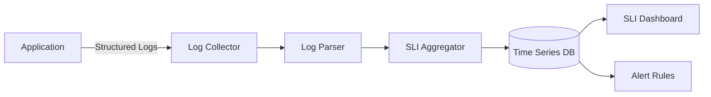
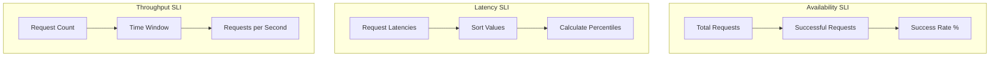
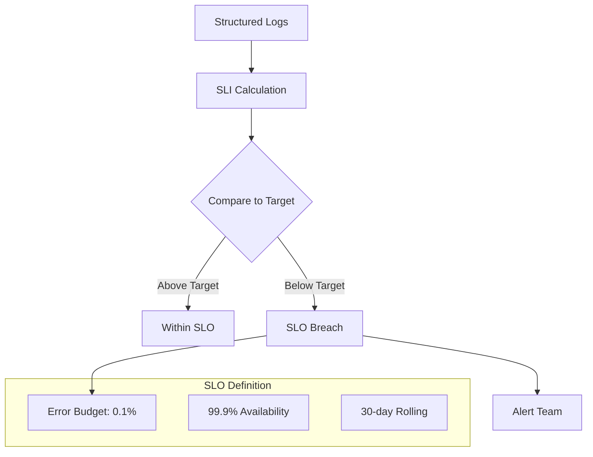

# How to Build Log-Based SLIs

Author: [nawazdhandala](https://github.com/nawazdhandala)

Tags: Logging, SLIs, SRE, Observability

Description: Learn to build log-based SLIs for measuring service level indicators from logs.

---

Service Level Indicators (SLIs) are the quantitative measures of your service reliability. While metrics and traces are often the first choice for SLI data sources, logs provide a powerful alternative when metrics are unavailable or when you need richer context. This guide walks through building SLIs directly from structured logs.

## Why Use Logs for SLIs?

Logs already capture detailed information about every request: status codes, latency, user IDs, error messages, and business context. Instead of adding new instrumentation, you can extract SLI signals from existing log data.

Common scenarios where log-based SLIs shine:

- Legacy systems without metric instrumentation
- Applications where adding metrics requires significant code changes
- Business-level SLIs that need transaction context
- Compliance scenarios requiring audit trail correlation

## The Log-Based SLI Pipeline

The following diagram shows how logs flow from your application through processing into SLI calculations.



## Step 1: Structure Your Logs

Raw unstructured logs are difficult to parse reliably. Structured JSON logs make SLI extraction straightforward.

Here is an example of a well-structured log entry that contains all the fields needed for SLI calculation.

```json
{
  "timestamp": "2026-01-30T14:23:45.123Z",
  "level": "INFO",
  "service": "checkout-api",
  "trace_id": "abc123def456",
  "span_id": "789xyz",
  "http_method": "POST",
  "http_path": "/api/v1/checkout",
  "http_status": 200,
  "latency_ms": 234,
  "user_id": "user_12345",
  "cart_items": 3,
  "payment_method": "credit_card",
  "success": true
}
```

Key fields for SLI extraction:

| Field | Purpose |
|-------|---------|
| http_status | Availability and error rate SLIs |
| latency_ms | Latency SLIs (p50, p95, p99) |
| success | Business outcome SLIs |
| service | Service-level grouping |
| http_path | Endpoint-level SLIs |

## Step 2: Define Your SLI Specifications

Before writing queries, define what you want to measure. Common log-based SLI types include availability, latency, and throughput.



### Availability SLI

The availability SLI measures what percentage of requests succeed. This query filters logs to count successful versus total requests.

```sql
-- Availability SLI: Percentage of successful requests
SELECT
    date_trunc('minute', timestamp) as time_bucket,
    service,
    COUNT(*) as total_requests,
    COUNT(*) FILTER (WHERE http_status >= 200 AND http_status < 500) as good_requests,
    ROUND(
        COUNT(*) FILTER (WHERE http_status >= 200 AND http_status < 500)::numeric
        / COUNT(*)::numeric * 100,
        2
    ) as availability_percent
FROM logs
WHERE timestamp >= NOW() - INTERVAL '1 hour'
GROUP BY time_bucket, service
ORDER BY time_bucket DESC;
```

### Latency SLI

Latency percentiles help you understand the experience of different user cohorts. The p50 represents the typical user, while p99 captures the worst experiences.

```sql
-- Latency SLI: p50, p95, p99 response times
SELECT
    date_trunc('minute', timestamp) as time_bucket,
    service,
    http_path,
    PERCENTILE_CONT(0.50) WITHIN GROUP (ORDER BY latency_ms) as p50_ms,
    PERCENTILE_CONT(0.95) WITHIN GROUP (ORDER BY latency_ms) as p95_ms,
    PERCENTILE_CONT(0.99) WITHIN GROUP (ORDER BY latency_ms) as p99_ms
FROM logs
WHERE timestamp >= NOW() - INTERVAL '1 hour'
    AND http_status < 500  -- Only measure latency for non-error responses
GROUP BY time_bucket, service, http_path
ORDER BY time_bucket DESC;
```

## Step 3: Build the Processing Pipeline

A Python script can process logs in real-time and emit SLI metrics. This example reads from a log stream and calculates rolling SLIs.

```python
import json
from collections import defaultdict
from datetime import datetime, timedelta
import statistics

class LogBasedSLICalculator:
    """
    Processes structured logs and calculates SLIs in rolling windows.
    Emits metrics compatible with Prometheus or OpenTelemetry.
    """

    def __init__(self, window_seconds=60):
        self.window_seconds = window_seconds
        self.request_buffer = defaultdict(list)

    def process_log(self, log_line: str) -> dict:
        """Parse a JSON log line and extract SLI-relevant fields."""
        try:
            log = json.loads(log_line)
            return {
                'timestamp': datetime.fromisoformat(log['timestamp'].replace('Z', '+00:00')),
                'service': log.get('service', 'unknown'),
                'path': log.get('http_path', '/'),
                'status': log.get('http_status', 0),
                'latency_ms': log.get('latency_ms', 0),
                'success': log.get('success', False)
            }
        except (json.JSONDecodeError, KeyError) as e:
            # Log parsing errors should not break the pipeline
            return None

    def add_request(self, parsed_log: dict):
        """Add a parsed log entry to the rolling window buffer."""
        if parsed_log is None:
            return

        service = parsed_log['service']
        self.request_buffer[service].append(parsed_log)

        # Prune old entries outside the window
        cutoff = datetime.now(parsed_log['timestamp'].tzinfo) - timedelta(seconds=self.window_seconds)
        self.request_buffer[service] = [
            r for r in self.request_buffer[service]
            if r['timestamp'] > cutoff
        ]

    def calculate_slis(self, service: str) -> dict:
        """Calculate current SLIs for a service from the rolling window."""
        requests = self.request_buffer.get(service, [])

        if not requests:
            return {'availability': 0, 'p50_ms': 0, 'p95_ms': 0, 'p99_ms': 0}

        # Availability: non-5xx responses / total
        total = len(requests)
        good = sum(1 for r in requests if r['status'] < 500)
        availability = (good / total) * 100

        # Latency percentiles from successful requests only
        latencies = sorted([r['latency_ms'] for r in requests if r['status'] < 500])

        if latencies:
            p50 = self._percentile(latencies, 0.50)
            p95 = self._percentile(latencies, 0.95)
            p99 = self._percentile(latencies, 0.99)
        else:
            p50 = p95 = p99 = 0

        return {
            'availability': round(availability, 2),
            'total_requests': total,
            'good_requests': good,
            'p50_ms': round(p50, 2),
            'p95_ms': round(p95, 2),
            'p99_ms': round(p99, 2)
        }

    def _percentile(self, sorted_data: list, percentile: float) -> float:
        """Calculate percentile from sorted data."""
        if not sorted_data:
            return 0
        index = int(len(sorted_data) * percentile)
        index = min(index, len(sorted_data) - 1)
        return sorted_data[index]
```

## Step 4: Set Up the OpenTelemetry Collector

The OpenTelemetry Collector can parse logs and extract metrics. This configuration file shows how to process logs and derive SLI metrics.

```yaml
# otel-collector-config.yaml
receivers:
  filelog:
    include:
      - /var/log/myapp/*.json
    operators:
      - type: json_parser
        timestamp:
          parse_from: attributes.timestamp
          layout: '%Y-%m-%dT%H:%M:%S.%LZ'

processors:
  # Extract metrics from log attributes
  transform:
    log_statements:
      - context: log
        statements:
          - set(attributes["sli.service"], attributes["service"])
          - set(attributes["sli.status"], attributes["http_status"])
          - set(attributes["sli.latency"], attributes["latency_ms"])

  # Batch for efficiency
  batch:
    timeout: 10s
    send_batch_size: 1000

exporters:
  # Send logs to OneUptime
  otlp:
    endpoint: "https://oneuptime.com/otlp"
    headers:
      x-oneuptime-token: "${ONEUPTIME_TOKEN}"

service:
  pipelines:
    logs:
      receivers: [filelog]
      processors: [transform, batch]
      exporters: [otlp]
```

## Step 5: Create SLI Queries in OneUptime

Once logs are flowing into OneUptime, you can create SLI queries. The following query calculates availability over the past hour.

```sql
-- OneUptime Log Analytics Query
-- Calculate availability SLI from checkout-api logs

SELECT
    toStartOfMinute(timestamp) as minute,
    countIf(http_status >= 200 AND http_status < 500) as good,
    count(*) as total,
    round(good / total * 100, 2) as availability
FROM logs
WHERE
    service = 'checkout-api'
    AND timestamp >= now() - interval 1 hour
GROUP BY minute
ORDER BY minute
```

## SLI to SLO: Setting Targets

Once you have SLIs, define SLOs (Service Level Objectives) as targets. The relationship between logs, SLIs, and SLOs is shown below.



Example SLO definitions based on log-derived SLIs:

| SLI | SLO Target | Error Budget (30 days) |
|-----|------------|------------------------|
| Availability | 99.9% | 43.2 minutes downtime |
| p95 Latency | < 500ms | 5% of requests can exceed |
| p99 Latency | < 1000ms | 1% of requests can exceed |

## Handling Edge Cases

Log-based SLIs require careful handling of several edge cases.

**Missing logs**: If your log pipeline drops messages, your SLI will be inaccurate. Add pipeline health monitoring.

```python
# Track log pipeline health
def check_log_volume(expected_rps: float, actual_count: int, window_seconds: int):
    """
    Alert if log volume is significantly lower than expected.
    This could indicate pipeline issues or service problems.
    """
    expected = expected_rps * window_seconds
    if actual_count < expected * 0.8:  # 20% tolerance
        return {
            'healthy': False,
            'message': f'Log volume {actual_count} below expected {expected}'
        }
    return {'healthy': True}
```

**Clock skew**: Distributed systems may have clock drift. Use server-side timestamps consistently.

**High cardinality**: Avoid creating SLIs per user_id or request_id. Group by service, endpoint, and region instead.

## Best Practices

1. **Use structured logging from the start**. Retrofitting structure onto unstructured logs is error-prone.

2. **Include trace_id and span_id** in logs. This lets you correlate SLI breaches with specific traces.

3. **Sample high-volume logs** but keep 100% of error logs. Errors are rare and critical for SLI accuracy.

4. **Version your log schema**. Breaking changes will break your SLI queries.

5. **Test your queries** against historical data before relying on them for alerting.

## Conclusion

Log-based SLIs provide a practical path to reliability measurement when metrics instrumentation is not available. By structuring your logs properly, building a processing pipeline, and defining clear SLO targets, you can measure and improve service reliability using data you already collect.

Start with one critical service, define a single availability SLI, and expand from there. The combination of structured logs flowing through OpenTelemetry to OneUptime gives you the foundation for comprehensive observability without vendor lock-in.

---

**Related Reading:**

- [What is SLA, SLI and SLO's?](https://oneuptime.com/blog/post/2023-06-12-sli-sla-slo/view)
- [Logs, Metrics & Traces: Turning Three Noisy Streams into One Story](https://oneuptime.com/blog/post/2025-08-20-three-pillars-of-observability-logs-metrics-traces/view)
- [How to Structure Logs Properly in OpenTelemetry](https://oneuptime.com/blog/post/2025-08-28-how-to-structure-logs-properly-in-opentelemetry/view)
