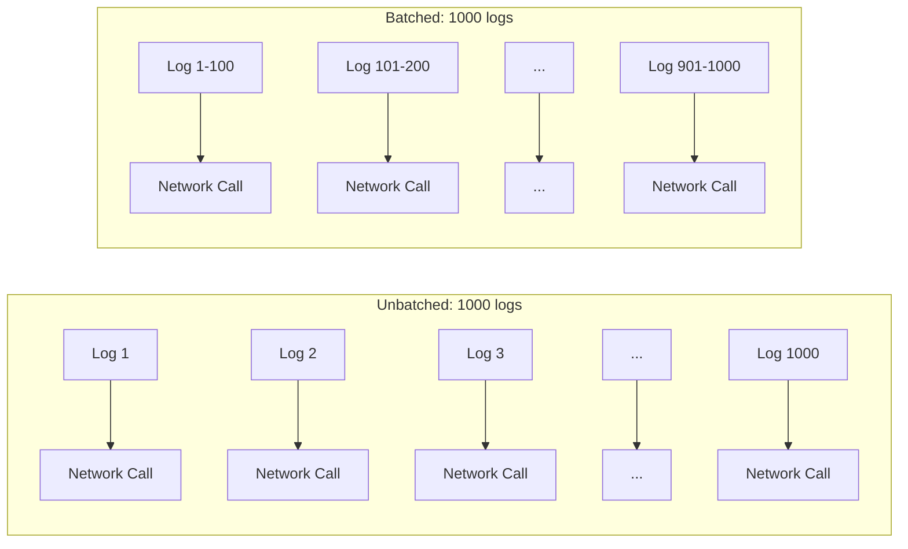
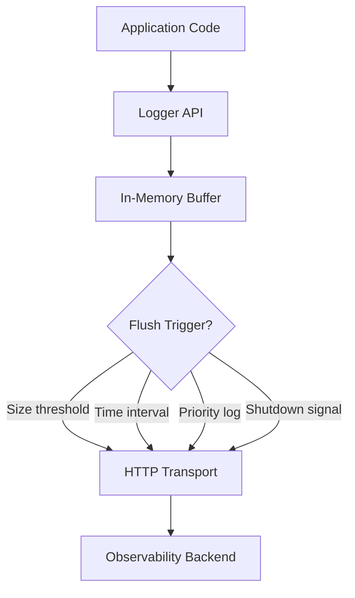
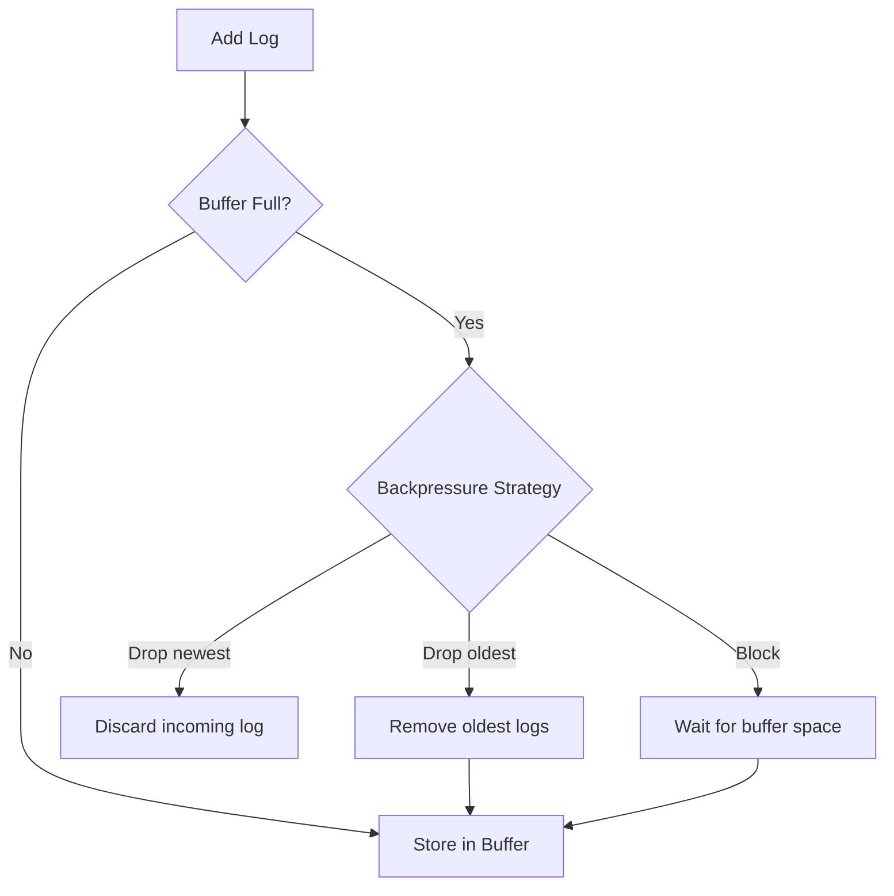

# How to Create Log Batching

Author: [nawazdhandala](https://github.com/nawazdhandala)

Tags: Logging, Batching, Performance, Throughput

Description: Learn to create log batching for efficient bulk log shipping to reduce network overhead.

---

Shipping logs one at a time is expensive. Every log entry triggers a network call, consumes a connection, waits for acknowledgment, and burns CPU cycles on serialization. At scale, this adds up fast. A service handling 10,000 requests per second might generate 50,000 log entries. Without batching, that means 50,000 HTTP requests to your observability backend every second.

Log batching solves this by collecting multiple log entries into a single payload before transmission. Instead of 50,000 requests, you send 500 batches of 100 logs each. Network overhead drops by orders of magnitude. Your application spends less time waiting on I/O. Your observability backend ingests data more efficiently.

This guide walks through building a production-ready log batching system from scratch, covering buffer management, flush strategies, backpressure handling, and graceful shutdown.

---

## Why Batching Matters

The difference between unbatched and batched logging becomes clear when you look at the numbers.



| Metric | Unbatched | Batched (100 per batch) |
|--------|-----------|-------------------------|
| Network calls per 1000 logs | 1000 | 10 |
| TCP handshakes (new connections) | 1000 | 10 |
| Serialization overhead | High | Low |
| Backend ingestion efficiency | Poor | Excellent |

The tradeoff is latency. Batching introduces a delay between when a log is generated and when it reaches your backend. For most observability use cases, a few seconds of delay is acceptable. For real-time alerting on critical errors, you need strategies to flush high-priority logs immediately.

---

## Core Architecture

A log batcher sits between your application code and the network transport layer. It accumulates logs in a buffer and flushes them based on configurable triggers.



The batcher needs to handle several concerns.

- **Buffer management**: Store logs efficiently without unbounded memory growth
- **Flush triggers**: Decide when to send accumulated logs
- **Backpressure**: Handle slow backends without losing data
- **Graceful shutdown**: Flush remaining logs before process exit

---

## Building the Log Batcher

Start with a simple buffer that accumulates log entries and flushes on size or time thresholds.

```typescript
// log-batcher.ts - Core batching implementation
interface LogEntry {
  timestamp: string;
  level: string;
  message: string;
  attributes: Record<string, unknown>;
}

interface BatcherConfig {
  maxBatchSize: number;      // Flush when buffer reaches this size
  flushIntervalMs: number;   // Flush at this interval regardless of size
  maxRetries: number;        // Retry failed flushes this many times
  endpoint: string;          // Backend URL
  headers: Record<string, string>;
}

class LogBatcher {
  private buffer: LogEntry[] = [];
  private flushTimer: NodeJS.Timeout | null = null;
  private isFlushing = false;
  private config: BatcherConfig;

  constructor(config: BatcherConfig) {
    this.config = config;
    // Start the interval timer for time-based flushing
    this.startFlushTimer();
  }

  // Add a log entry to the buffer
  add(entry: LogEntry): void {
    this.buffer.push(entry);

    // Check if we hit the size threshold
    if (this.buffer.length >= this.config.maxBatchSize) {
      this.flush();
    }
  }

  // Start the periodic flush timer
  private startFlushTimer(): void {
    this.flushTimer = setInterval(() => {
      if (this.buffer.length > 0) {
        this.flush();
      }
    }, this.config.flushIntervalMs);
  }

  // Flush the current buffer to the backend
  async flush(): Promise<void> {
    // Prevent concurrent flushes
    if (this.isFlushing || this.buffer.length === 0) {
      return;
    }

    this.isFlushing = true;

    // Swap buffer to allow new logs during flush
    const batch = this.buffer;
    this.buffer = [];

    try {
      await this.sendBatch(batch);
    } catch (error) {
      // On failure, prepend failed batch back to buffer
      this.buffer = [...batch, ...this.buffer];
      console.error('Batch flush failed:', error);
    } finally {
      this.isFlushing = false;
    }
  }

  // Send a batch to the backend with retries
  private async sendBatch(batch: LogEntry[]): Promise<void> {
    let lastError: Error | null = null;

    for (let attempt = 0; attempt < this.config.maxRetries; attempt++) {
      try {
        const response = await fetch(this.config.endpoint, {
          method: 'POST',
          headers: {
            'Content-Type': 'application/json',
            ...this.config.headers,
          },
          body: JSON.stringify({ logs: batch }),
        });

        if (response.ok) {
          return; // Success
        }

        // Server error - retry with backoff
        if (response.status >= 500) {
          lastError = new Error(`Server error: ${response.status}`);
          await this.backoff(attempt);
          continue;
        }

        // Client error - do not retry
        throw new Error(`Client error: ${response.status}`);
      } catch (error) {
        lastError = error as Error;
        await this.backoff(attempt);
      }
    }

    throw lastError;
  }

  // Exponential backoff between retries
  private backoff(attempt: number): Promise<void> {
    const delay = Math.min(1000 * Math.pow(2, attempt), 30000);
    return new Promise(resolve => setTimeout(resolve, delay));
  }

  // Graceful shutdown - flush remaining logs
  async shutdown(): Promise<void> {
    if (this.flushTimer) {
      clearInterval(this.flushTimer);
      this.flushTimer = null;
    }

    // Final flush with extended timeout
    await this.flush();
  }
}
```

---

## Priority-Based Flushing

Not all logs are equal. Error logs often need immediate attention while debug logs can wait. Implement priority levels that trigger immediate flushes for critical entries.

```typescript
// priority-batcher.ts - Batching with priority support
type LogLevel = 'debug' | 'info' | 'warn' | 'error' | 'fatal';

interface PriorityConfig extends BatcherConfig {
  immediateFlushLevels: LogLevel[];  // Levels that trigger immediate flush
}

class PriorityLogBatcher extends LogBatcher {
  private priorityConfig: PriorityConfig;

  constructor(config: PriorityConfig) {
    super(config);
    this.priorityConfig = config;
  }

  add(entry: LogEntry): void {
    super.add(entry);

    // Check if this log level requires immediate flush
    const level = entry.level as LogLevel;
    if (this.priorityConfig.immediateFlushLevels.includes(level)) {
      this.flush();
    }
  }
}

// Usage: flush immediately on errors and fatal logs
const batcher = new PriorityLogBatcher({
  maxBatchSize: 100,
  flushIntervalMs: 5000,
  maxRetries: 3,
  endpoint: 'https://oneuptime.com/otlp/v1/logs',
  headers: { 'x-oneuptime-token': process.env.ONEUPTIME_TOKEN || '' },
  immediateFlushLevels: ['error', 'fatal'],
});
```

---

## Handling Backpressure

When your backend slows down or becomes unavailable, logs accumulate. Without limits, your application runs out of memory. Implement backpressure to handle this gracefully.



The code below implements a bounded buffer with configurable overflow behavior.

```typescript
// bounded-batcher.ts - Backpressure handling
type OverflowStrategy = 'drop-oldest' | 'drop-newest' | 'block';

interface BoundedConfig extends BatcherConfig {
  maxBufferSize: number;           // Hard limit on buffer size
  overflowStrategy: OverflowStrategy;
}

class BoundedLogBatcher {
  private buffer: LogEntry[] = [];
  private config: BoundedConfig;
  private droppedCount = 0;

  constructor(config: BoundedConfig) {
    this.config = config;
  }

  async add(entry: LogEntry): Promise<boolean> {
    // Check if buffer is at capacity
    if (this.buffer.length >= this.config.maxBufferSize) {
      switch (this.config.overflowStrategy) {
        case 'drop-oldest':
          // Remove oldest entry to make room
          this.buffer.shift();
          this.droppedCount++;
          break;

        case 'drop-newest':
          // Discard the incoming entry
          this.droppedCount++;
          return false;

        case 'block':
          // Wait for buffer space (with timeout)
          const hasSpace = await this.waitForSpace(5000);
          if (!hasSpace) {
            this.droppedCount++;
            return false;
          }
          break;
      }
    }

    this.buffer.push(entry);
    return true;
  }

  private waitForSpace(timeoutMs: number): Promise<boolean> {
    return new Promise(resolve => {
      const start = Date.now();
      const check = () => {
        if (this.buffer.length < this.config.maxBufferSize) {
          resolve(true);
        } else if (Date.now() - start > timeoutMs) {
          resolve(false);
        } else {
          setTimeout(check, 100);
        }
      };
      check();
    });
  }

  // Expose dropped count for monitoring
  getDroppedCount(): number {
    return this.droppedCount;
  }
}
```

---

## Graceful Shutdown

When your application shuts down, you need to flush any remaining logs. Hook into process signals to ensure clean shutdown.

```typescript
// shutdown-handler.ts - Process signal handling
class GracefulBatcher {
  private batcher: LogBatcher;
  private isShuttingDown = false;

  constructor(batcher: LogBatcher) {
    this.batcher = batcher;
    this.registerShutdownHandlers();
  }

  private registerShutdownHandlers(): void {
    // Handle various termination signals
    const signals: NodeJS.Signals[] = ['SIGTERM', 'SIGINT', 'SIGHUP'];

    signals.forEach(signal => {
      process.on(signal, async () => {
        if (this.isShuttingDown) return;
        this.isShuttingDown = true;

        console.log(`Received ${signal}, flushing logs...`);

        try {
          // Flush with a timeout to prevent hanging
          await Promise.race([
            this.batcher.shutdown(),
            new Promise((_, reject) =>
              setTimeout(() => reject(new Error('Shutdown timeout')), 10000)
            ),
          ]);
          console.log('Logs flushed successfully');
        } catch (error) {
          console.error('Failed to flush logs during shutdown:', error);
        }

        process.exit(0);
      });
    });
  }
}
```

---

## Complete Implementation Example

Putting it all together, here is a production-ready log batcher with all features combined.

```typescript
// production-batcher.ts - Full implementation
import { EventEmitter } from 'events';

interface ProductionConfig {
  maxBatchSize: number;
  maxBufferSize: number;
  flushIntervalMs: number;
  maxRetries: number;
  endpoint: string;
  headers: Record<string, string>;
  immediateFlushLevels: string[];
  overflowStrategy: 'drop-oldest' | 'drop-newest';
}

class ProductionLogBatcher extends EventEmitter {
  private buffer: LogEntry[] = [];
  private config: ProductionConfig;
  private flushTimer: NodeJS.Timeout | null = null;
  private isFlushing = false;
  private stats = { sent: 0, dropped: 0, failed: 0 };

  constructor(config: ProductionConfig) {
    super();
    this.config = config;
    this.startFlushTimer();
    this.registerShutdownHandlers();
  }

  log(level: string, message: string, attributes: Record<string, unknown> = {}): void {
    const entry: LogEntry = {
      timestamp: new Date().toISOString(),
      level,
      message,
      attributes,
    };

    // Handle buffer overflow
    if (this.buffer.length >= this.config.maxBufferSize) {
      if (this.config.overflowStrategy === 'drop-oldest') {
        this.buffer.shift();
      } else {
        this.stats.dropped++;
        return;
      }
    }

    this.buffer.push(entry);

    // Immediate flush for priority levels
    if (this.config.immediateFlushLevels.includes(level)) {
      this.flush();
    } else if (this.buffer.length >= this.config.maxBatchSize) {
      this.flush();
    }
  }

  // Convenience methods
  debug(message: string, attrs?: Record<string, unknown>): void {
    this.log('debug', message, attrs);
  }

  info(message: string, attrs?: Record<string, unknown>): void {
    this.log('info', message, attrs);
  }

  warn(message: string, attrs?: Record<string, unknown>): void {
    this.log('warn', message, attrs);
  }

  error(message: string, attrs?: Record<string, unknown>): void {
    this.log('error', message, attrs);
  }

  getStats(): typeof this.stats {
    return { ...this.stats };
  }

  private startFlushTimer(): void {
    this.flushTimer = setInterval(() => {
      if (this.buffer.length > 0 && !this.isFlushing) {
        this.flush();
      }
    }, this.config.flushIntervalMs);
  }

  private async flush(): Promise<void> {
    if (this.isFlushing || this.buffer.length === 0) return;

    this.isFlushing = true;
    const batch = this.buffer;
    this.buffer = [];

    try {
      await this.sendWithRetry(batch);
      this.stats.sent += batch.length;
      this.emit('flush', { count: batch.length });
    } catch (error) {
      this.stats.failed += batch.length;
      this.emit('error', error);
    } finally {
      this.isFlushing = false;
    }
  }

  private async sendWithRetry(batch: LogEntry[]): Promise<void> {
    for (let i = 0; i < this.config.maxRetries; i++) {
      try {
        const res = await fetch(this.config.endpoint, {
          method: 'POST',
          headers: { 'Content-Type': 'application/json', ...this.config.headers },
          body: JSON.stringify({ logs: batch }),
        });
        if (res.ok) return;
        if (res.status < 500) throw new Error(`Client error: ${res.status}`);
      } catch (e) {
        if (i === this.config.maxRetries - 1) throw e;
        await new Promise(r => setTimeout(r, 1000 * Math.pow(2, i)));
      }
    }
  }

  private registerShutdownHandlers(): void {
    const shutdown = async () => {
      if (this.flushTimer) clearInterval(this.flushTimer);
      await this.flush();
    };
    process.on('SIGTERM', shutdown);
    process.on('SIGINT', shutdown);
  }
}

// Usage
const logger = new ProductionLogBatcher({
  maxBatchSize: 100,
  maxBufferSize: 10000,
  flushIntervalMs: 5000,
  maxRetries: 3,
  endpoint: 'https://oneuptime.com/otlp/v1/logs',
  headers: { 'x-oneuptime-token': process.env.ONEUPTIME_TOKEN || '' },
  immediateFlushLevels: ['error', 'fatal'],
  overflowStrategy: 'drop-oldest',
});

logger.info('Application started', { version: '1.0.0' });
logger.error('Database connection failed', { host: 'db.example.com', code: 'ECONNREFUSED' });
```

---

## Tuning Guidelines

The right configuration depends on your workload.

| Parameter | Low Volume (<100 logs/sec) | Medium (100-1000/sec) | High (>1000/sec) |
|-----------|----------------------------|----------------------|------------------|
| maxBatchSize | 50 | 100 | 500 |
| flushIntervalMs | 10000 | 5000 | 1000 |
| maxBufferSize | 1000 | 10000 | 50000 |

Monitor these metrics to tune your batcher.

- **Buffer size over time**: Should stay well below maxBufferSize
- **Flush frequency**: Should match your configured interval under normal load
- **Dropped count**: Should be zero or near zero
- **Flush latency**: Time from flush trigger to completion

---

## Key Takeaways

Log batching is a fundamental optimization for any application shipping telemetry data.

- **Batch by size and time**: Use both triggers to balance latency and efficiency
- **Handle backpressure**: Bounded buffers prevent memory exhaustion
- **Prioritize critical logs**: Error logs should flush immediately
- **Plan for shutdown**: Always flush remaining logs before exit
- **Monitor your batcher**: Track buffer size, dropped logs, and flush latency

The patterns shown here apply to any telemetry type: traces, metrics, and logs all benefit from batching. Most observability SDKs, including OpenTelemetry, implement these patterns internally. Understanding how batching works helps you configure these tools effectively and debug issues when they arise.

---

**Related Reading:**

- [How to Structure Logs Properly in OpenTelemetry](https://oneuptime.com/blog/post/2025-08-28-how-to-structure-logs-properly-in-opentelemetry/view)
- [How to Reduce Noise in OpenTelemetry](https://oneuptime.com/blog/post/2025-08-25-how-to-reduce-noise-in-opentelemetry/view)
- [What is the OpenTelemetry Collector and Why Use One?](https://oneuptime.com/blog/post/2025-09-18-what-is-opentelemetry-collector-and-why-use-one/view)
