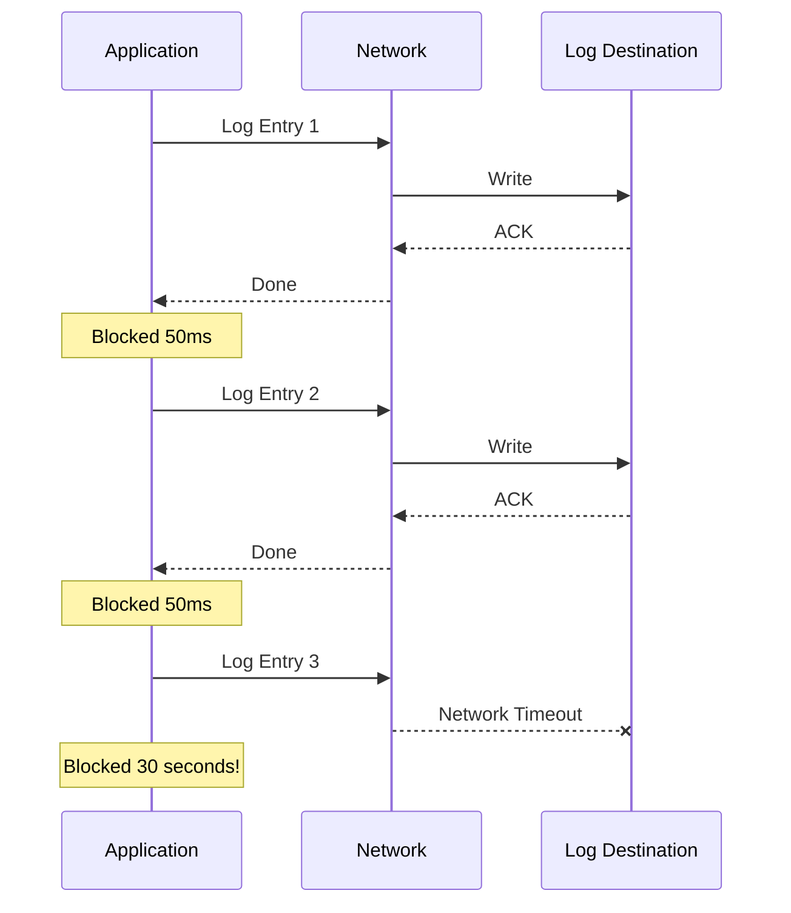
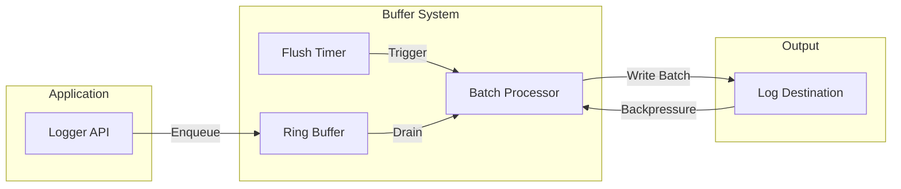
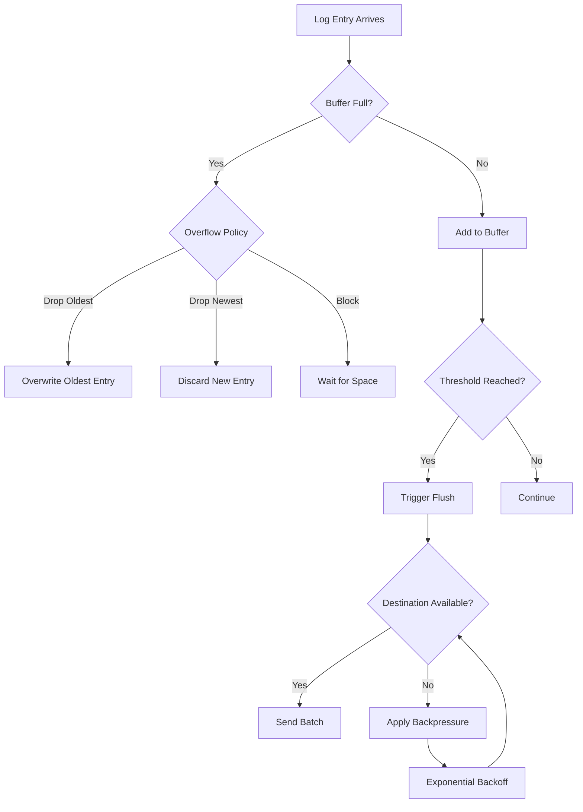

# How to Implement Log Buffering

Author: [nawazdhandala](https://github.com/nawazdhandala)

Tags: Logging, Buffering, Performance, Reliability

Description: Learn to implement log buffering for efficient log collection and backpressure handling.

---

> Log buffering sits at the heart of every production logging system. Without it, your application either blocks on every log write or loses data when downstream systems slow down.

High-throughput applications can generate thousands of log entries per second. Writing each log synchronously to a file, network, or database would cripple performance. Log buffering solves this by collecting log entries in memory and flushing them in batches, reducing I/O overhead and providing resilience against temporary downstream failures.

---

## Why Log Buffering Matters

Direct logging creates a tight coupling between your application and the logging destination. When the destination slows down or becomes unavailable, your application suffers. Log buffering provides several benefits:

- **Reduced I/O overhead**: Batching multiple logs into single write operations dramatically improves throughput
- **Backpressure handling**: When downstream systems slow down, buffering provides time to recover
- **Smoothed latency**: Application code does not block waiting for log writes
- **Failure resilience**: Temporary network issues do not cause immediate log loss

### The Problem Without Buffering

Consider what happens when you log directly to a network destination.



Each log entry blocks the application thread. Network latency adds up. When the destination becomes slow or unreachable, your application grinds to a halt.

---

## Core Components of a Log Buffer

A robust log buffering system consists of several interconnected components that work together to provide reliable, efficient log delivery.



The logger API accepts log entries from application code and places them in a ring buffer. A flush timer periodically triggers the batch processor, which drains entries from the buffer and writes them to the destination in batches. When the destination signals backpressure, the batch processor adjusts its behavior accordingly.

---

## Implementing a Basic Log Buffer

Let us build a log buffer from scratch. We start with a simple ring buffer that holds log entries in memory.

This implementation uses a fixed-size array as a circular buffer. The `head` index tracks where new entries go, while `tail` tracks where we read from. When the buffer fills up, new entries overwrite the oldest ones.

```typescript
// log-buffer.ts - A ring buffer implementation for log entries

interface LogEntry {
  timestamp: number;
  level: string;
  message: string;
  attributes: Record<string, unknown>;
}

interface BufferConfig {
  maxSize: number;           // Maximum entries before overflow
  flushIntervalMs: number;   // Time between automatic flushes
  flushThreshold: number;    // Flush when buffer reaches this size
  onOverflow: 'drop-oldest' | 'drop-newest' | 'block';
}

export class LogBuffer {
  private buffer: LogEntry[];
  private head: number = 0;      // Write position
  private tail: number = 0;      // Read position
  private count: number = 0;     // Current entry count
  private config: BufferConfig;
  private flushTimer: NodeJS.Timeout | null = null;
  private flushCallback: (entries: LogEntry[]) => Promise<void>;
  private isFlushing: boolean = false;

  constructor(
    config: BufferConfig,
    flushCallback: (entries: LogEntry[]) => Promise<void>
  ) {
    this.config = config;
    this.buffer = new Array(config.maxSize);
    this.flushCallback = flushCallback;
    this.startFlushTimer();
  }

  // Add a log entry to the buffer
  enqueue(entry: LogEntry): boolean {
    // Check if buffer is full
    if (this.count >= this.config.maxSize) {
      return this.handleOverflow(entry);
    }

    // Add entry at head position
    this.buffer[this.head] = entry;
    this.head = (this.head + 1) % this.config.maxSize;
    this.count++;

    // Trigger flush if threshold reached
    if (this.count >= this.config.flushThreshold) {
      this.flush();
    }

    return true;
  }

  // Handle buffer overflow based on configured policy
  private handleOverflow(entry: LogEntry): boolean {
    switch (this.config.onOverflow) {
      case 'drop-oldest':
        // Overwrite oldest entry
        this.buffer[this.head] = entry;
        this.head = (this.head + 1) % this.config.maxSize;
        this.tail = (this.tail + 1) % this.config.maxSize;
        return true;

      case 'drop-newest':
        // Discard the new entry
        return false;

      case 'block':
        // In real implementation, this would use a condition variable
        // For simplicity, we trigger an immediate flush and retry
        this.flushSync();
        return this.enqueue(entry);
    }
  }

  // Drain all entries from the buffer
  private drain(): LogEntry[] {
    const entries: LogEntry[] = [];

    while (this.count > 0) {
      entries.push(this.buffer[this.tail]);
      this.tail = (this.tail + 1) % this.config.maxSize;
      this.count--;
    }

    return entries;
  }

  // Asynchronous flush operation
  async flush(): Promise<void> {
    if (this.isFlushing || this.count === 0) {
      return;
    }

    this.isFlushing = true;
    const entries = this.drain();

    try {
      await this.flushCallback(entries);
    } catch (error) {
      // Re-enqueue entries on failure (best effort)
      for (const entry of entries) {
        this.enqueue(entry);
      }
      console.error('Flush failed, re-enqueued entries:', error);
    } finally {
      this.isFlushing = false;
    }
  }

  // Synchronous flush for shutdown scenarios
  private flushSync(): void {
    if (this.count === 0) return;

    const entries = this.drain();
    // In production, use synchronous write here
    this.flushCallback(entries).catch(console.error);
  }

  // Start the periodic flush timer
  private startFlushTimer(): void {
    this.flushTimer = setInterval(() => {
      this.flush();
    }, this.config.flushIntervalMs);
  }

  // Clean shutdown
  async shutdown(): Promise<void> {
    if (this.flushTimer) {
      clearInterval(this.flushTimer);
    }
    await this.flush();
  }
}
```

---

## Handling Backpressure

Backpressure occurs when the log destination cannot keep up with the rate of incoming logs. A well-designed buffer system detects backpressure and responds appropriately.

The following diagram shows how backpressure propagates through the system.



Here is an enhanced buffer implementation with backpressure handling. It tracks the destination's health and adjusts flush behavior dynamically. When flushes fail repeatedly, it backs off exponentially to avoid overwhelming a struggling system.

```typescript
// backpressure-buffer.ts - Buffer with adaptive backpressure handling

interface BackpressureConfig {
  initialBackoffMs: number;     // Starting backoff duration
  maxBackoffMs: number;         // Maximum backoff duration
  backoffMultiplier: number;    // Multiplier for exponential backoff
  healthyFlushStreak: number;   // Successful flushes to reset backoff
}

export class BackpressureBuffer extends LogBuffer {
  private backpressureConfig: BackpressureConfig;
  private currentBackoffMs: number;
  private consecutiveFailures: number = 0;
  private consecutiveSuccesses: number = 0;
  private isBackingOff: boolean = false;
  private droppedCount: number = 0;

  constructor(
    bufferConfig: BufferConfig,
    backpressureConfig: BackpressureConfig,
    flushCallback: (entries: LogEntry[]) => Promise<void>
  ) {
    super(bufferConfig, flushCallback);
    this.backpressureConfig = backpressureConfig;
    this.currentBackoffMs = backpressureConfig.initialBackoffMs;
  }

  // Override flush with backpressure awareness
  async flush(): Promise<void> {
    if (this.isBackingOff) {
      return; // Skip flush during backoff period
    }

    try {
      await super.flush();
      this.onFlushSuccess();
    } catch (error) {
      this.onFlushFailure(error);
    }
  }

  // Handle successful flush
  private onFlushSuccess(): void {
    this.consecutiveSuccesses++;
    this.consecutiveFailures = 0;

    // Reset backoff after sustained success
    if (this.consecutiveSuccesses >= this.backpressureConfig.healthyFlushStreak) {
      this.currentBackoffMs = this.backpressureConfig.initialBackoffMs;
    }
  }

  // Handle failed flush with exponential backoff
  private onFlushFailure(error: unknown): void {
    this.consecutiveFailures++;
    this.consecutiveSuccesses = 0;

    // Calculate new backoff duration
    this.currentBackoffMs = Math.min(
      this.currentBackoffMs * this.backpressureConfig.backoffMultiplier,
      this.backpressureConfig.maxBackoffMs
    );

    console.warn(
      `Flush failed (attempt ${this.consecutiveFailures}), ` +
      `backing off for ${this.currentBackoffMs}ms:`,
      error
    );

    // Enter backoff period
    this.isBackingOff = true;
    setTimeout(() => {
      this.isBackingOff = false;
    }, this.currentBackoffMs);
  }

  // Track dropped logs for monitoring
  protected onDrop(): void {
    this.droppedCount++;
  }

  // Expose metrics for monitoring
  getMetrics(): Record<string, number> {
    return {
      droppedCount: this.droppedCount,
      consecutiveFailures: this.consecutiveFailures,
      currentBackoffMs: this.currentBackoffMs,
    };
  }
}
```

---

## Batch Processing Strategies

Efficient batch processing is critical for throughput. The batch processor should balance latency (how quickly logs reach the destination) against efficiency (how many logs per write operation).

This batch processor supports multiple flushing triggers: time-based intervals, size thresholds, and manual triggers. It also handles partial failures by tracking which entries succeeded.

```typescript
// batch-processor.ts - Configurable batch processing for logs

interface BatchConfig {
  maxBatchSize: number;        // Maximum entries per batch
  maxBatchBytes: number;       // Maximum bytes per batch
  lingerMs: number;            // Time to wait for more entries
}

export class BatchProcessor {
  private config: BatchConfig;
  private pendingBatch: LogEntry[] = [];
  private pendingBytes: number = 0;
  private lingerTimer: NodeJS.Timeout | null = null;
  private sendBatch: (batch: LogEntry[]) => Promise<void>;

  constructor(
    config: BatchConfig,
    sendBatch: (batch: LogEntry[]) => Promise<void>
  ) {
    this.config = config;
    this.sendBatch = sendBatch;
  }

  // Add entry to current batch
  async add(entry: LogEntry): Promise<void> {
    const entryBytes = this.estimateBytes(entry);

    // Check if this entry would exceed batch limits
    if (this.shouldFlush(entryBytes)) {
      await this.flush();
    }

    this.pendingBatch.push(entry);
    this.pendingBytes += entryBytes;

    // Start linger timer if this is the first entry
    if (this.pendingBatch.length === 1) {
      this.startLingerTimer();
    }
  }

  // Determine if batch should be flushed
  private shouldFlush(additionalBytes: number): boolean {
    // Flush if adding this entry would exceed size limits
    if (this.pendingBatch.length >= this.config.maxBatchSize) {
      return true;
    }
    if (this.pendingBytes + additionalBytes > this.config.maxBatchBytes) {
      return true;
    }
    return false;
  }

  // Estimate serialized size of an entry
  private estimateBytes(entry: LogEntry): number {
    return JSON.stringify(entry).length;
  }

  // Start timer to flush after linger period
  private startLingerTimer(): void {
    this.lingerTimer = setTimeout(() => {
      this.flush();
    }, this.config.lingerMs);
  }

  // Flush the current batch
  async flush(): Promise<void> {
    if (this.lingerTimer) {
      clearTimeout(this.lingerTimer);
      this.lingerTimer = null;
    }

    if (this.pendingBatch.length === 0) {
      return;
    }

    const batch = this.pendingBatch;
    this.pendingBatch = [];
    this.pendingBytes = 0;

    await this.sendBatch(batch);
  }
}
```

---

## Putting It All Together

Here is a complete logging system that combines buffering, backpressure handling, and batch processing. This implementation provides a clean API for application code while handling all the complexity internally.

```typescript
// buffered-logger.ts - Production-ready buffered logging system

interface LoggerConfig {
  serviceName: string;
  bufferSize: number;
  flushIntervalMs: number;
  batchSize: number;
  endpoint: string;
}

export class BufferedLogger {
  private buffer: BackpressureBuffer;
  private batchProcessor: BatchProcessor;
  private config: LoggerConfig;

  constructor(config: LoggerConfig) {
    this.config = config;

    // Initialize batch processor with HTTP sender
    this.batchProcessor = new BatchProcessor(
      {
        maxBatchSize: config.batchSize,
        maxBatchBytes: 1024 * 1024, // 1MB max batch
        lingerMs: 100,              // Wait 100ms for more entries
      },
      this.sendToEndpoint.bind(this)
    );

    // Initialize buffer with backpressure handling
    this.buffer = new BackpressureBuffer(
      {
        maxSize: config.bufferSize,
        flushIntervalMs: config.flushIntervalMs,
        flushThreshold: config.batchSize,
        onOverflow: 'drop-oldest',
      },
      {
        initialBackoffMs: 100,
        maxBackoffMs: 30000,
        backoffMultiplier: 2,
        healthyFlushStreak: 5,
      },
      (entries) => this.processBatch(entries)
    );
  }

  // Public logging API
  log(level: string, message: string, attributes: Record<string, unknown> = {}): void {
    const entry: LogEntry = {
      timestamp: Date.now(),
      level,
      message,
      attributes: {
        ...attributes,
        service: this.config.serviceName,
      },
    };

    this.buffer.enqueue(entry);
  }

  // Convenience methods
  info(message: string, attributes?: Record<string, unknown>): void {
    this.log('info', message, attributes);
  }

  warn(message: string, attributes?: Record<string, unknown>): void {
    this.log('warn', message, attributes);
  }

  error(message: string, attributes?: Record<string, unknown>): void {
    this.log('error', message, attributes);
  }

  debug(message: string, attributes?: Record<string, unknown>): void {
    this.log('debug', message, attributes);
  }

  // Process a batch of entries
  private async processBatch(entries: LogEntry[]): Promise<void> {
    for (const entry of entries) {
      await this.batchProcessor.add(entry);
    }
    await this.batchProcessor.flush();
  }

  // Send batch to logging endpoint
  private async sendToEndpoint(batch: LogEntry[]): Promise<void> {
    const response = await fetch(this.config.endpoint, {
      method: 'POST',
      headers: {
        'Content-Type': 'application/json',
      },
      body: JSON.stringify({ logs: batch }),
    });

    if (!response.ok) {
      throw new Error(`HTTP ${response.status}: ${response.statusText}`);
    }
  }

  // Graceful shutdown
  async shutdown(): Promise<void> {
    await this.buffer.shutdown();
    await this.batchProcessor.flush();
  }
}
```

---

## Monitoring Your Buffer

A logging system that fails silently defeats its purpose. Monitor these key metrics to ensure your buffer operates correctly:

- **Buffer utilization**: Percentage of buffer capacity in use
- **Drop rate**: Number of logs dropped due to overflow
- **Flush latency**: Time taken for each flush operation
- **Backpressure events**: Frequency and duration of backoff periods

```typescript
// Example: Exposing buffer metrics for Prometheus
function exposeMetrics(logger: BufferedLogger): void {
  const metrics = logger.getMetrics();

  // Register with your metrics system
  gauge('log_buffer_dropped_total', metrics.droppedCount);
  gauge('log_buffer_backoff_ms', metrics.currentBackoffMs);
  gauge('log_buffer_consecutive_failures', metrics.consecutiveFailures);
}
```

---

## Final Thoughts

Log buffering transforms logging from a performance liability into a reliable, efficient system. The key principles are:

1. **Decouple production from consumption**: Use a ring buffer to separate log generation from log delivery
2. **Handle backpressure gracefully**: Implement exponential backoff and clear overflow policies
3. **Batch for efficiency**: Group logs into batches to reduce I/O overhead
4. **Monitor everything**: Track buffer health to catch problems before you lose data

Start with a simple ring buffer and add sophistication as your needs grow. The implementations shown here provide a solid foundation that you can adapt to your specific requirements.

---

*Need reliable log collection with built-in buffering and backpressure handling? [OneUptime](https://oneuptime.com) provides production-ready log ingestion with automatic batching, retry logic, and seamless integration with OpenTelemetry.*
