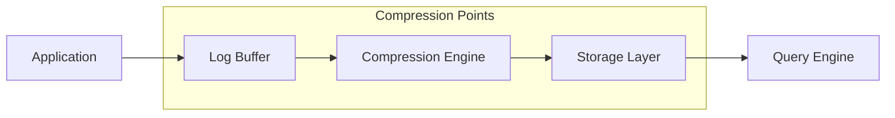
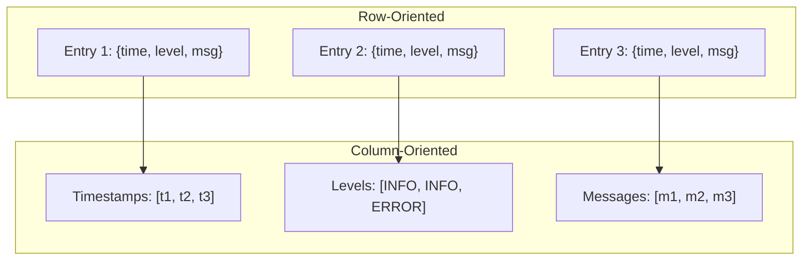
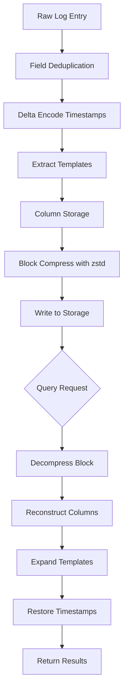

# How to Build Log Compression

Author: [nawazdhandala](https://github.com/nawazdhandala)

Tags: Logging, Compression, Storage, Cost

Description: Learn to build log compression strategies for reducing storage and transfer costs.

---

Logs are essential for debugging, auditing, and understanding system behavior. But they come with a cost. A moderately active application can generate gigabytes of logs per day. At scale, this becomes terabytes per week. Storage bills climb, network transfers slow down, and querying becomes painful.

Log compression solves this problem by reducing the size of log data without losing the information you need. This guide walks through practical strategies to build log compression into your systems, from simple text compression to custom encoding schemes.

---

## Why Log Compression Matters

Consider these numbers from a typical production environment:

| Scenario | Daily Log Volume | Monthly Storage Cost (uncompressed) | Monthly Storage Cost (compressed) |
|----------|-----------------|-------------------------------------|-----------------------------------|
| Small API | 5 GB | $0.50 | $0.05 |
| Mid-size Platform | 100 GB | $10 | $1 |
| High-traffic Service | 2 TB | $200 | $20 |

Compression ratios of 10:1 or better are common for log data because logs contain highly repetitive patterns. The same timestamps, log levels, service names, and message formats appear thousands of times per minute.

---

## Compression Architecture Overview

A log compression pipeline has several stages where you can apply different techniques.



Each stage offers different tradeoffs between compression ratio, latency, and CPU usage.

---

## Strategy 1: Field-Based Deduplication

Structured logs repeat the same field names in every entry. Instead of storing `{"timestamp": "2026-01-30T10:00:00Z", "level": "INFO", "service": "api"}` for every log line, you can store field names once and reference them by index.

Here is a simple implementation using a field dictionary.

```typescript
// log-compressor.ts
// Store field names in a dictionary and reference by index

interface CompressedLog {
  d: string[];      // Dictionary of unique values
  e: number[][];    // Entries as arrays of dictionary indices
}

class LogCompressor {
  private dictionary: Map<string, number> = new Map();
  private entries: number[][] = [];

  // Add a log entry to the compressor
  addEntry(log: Record<string, string>): void {
    const entry: number[] = [];

    // Convert each field value to a dictionary index
    for (const [key, value] of Object.entries(log)) {
      const combined = `${key}:${value}`;

      if (!this.dictionary.has(combined)) {
        // New value: add to dictionary
        this.dictionary.set(combined, this.dictionary.size);
      }

      entry.push(this.dictionary.get(combined)!);
    }

    this.entries.push(entry);
  }

  // Export compressed format
  toCompressed(): CompressedLog {
    // Convert Map to array, sorted by index
    const dictArray = Array.from(this.dictionary.entries())
      .sort((a, b) => a[1] - b[1])
      .map(([value]) => value);

    return {
      d: dictArray,
      e: this.entries
    };
  }
}
```

This approach reduces storage because common values like `level:INFO` or `service:api-gateway` are stored once regardless of how many log entries contain them.

---

## Strategy 2: Delta Encoding for Timestamps

Timestamps in logs are sequential and predictable. Instead of storing full timestamps, store the difference from the previous entry.

```typescript
// delta-timestamp.ts
// Encode timestamps as deltas from previous entry

interface DeltaEncodedLogs {
  baseTime: number;    // First timestamp (Unix ms)
  deltas: number[];    // Milliseconds since previous entry
  entries: string[];   // Log content without timestamps
}

function deltaEncode(logs: Array<{timestamp: number; message: string}>): DeltaEncodedLogs {
  if (logs.length === 0) {
    return { baseTime: 0, deltas: [], entries: [] };
  }

  const baseTime = logs[0].timestamp;
  const deltas: number[] = [0];  // First entry has delta of 0
  const entries: string[] = [];

  let prevTime = baseTime;

  for (let i = 0; i < logs.length; i++) {
    const log = logs[i];

    // Store delta instead of absolute timestamp
    if (i > 0) {
      deltas.push(log.timestamp - prevTime);
      prevTime = log.timestamp;
    }

    entries.push(log.message);
  }

  return { baseTime, deltas, entries };
}

// Decode back to original format
function deltaDecode(encoded: DeltaEncodedLogs): Array<{timestamp: number; message: string}> {
  const logs: Array<{timestamp: number; message: string}> = [];
  let currentTime = encoded.baseTime;

  for (let i = 0; i < encoded.entries.length; i++) {
    currentTime += encoded.deltas[i];
    logs.push({
      timestamp: currentTime,
      message: encoded.entries[i]
    });
  }

  return logs;
}
```

A full timestamp like `1706612400000` (13 digits) becomes a small delta like `15` or `100`. For high-frequency logs, deltas are often single-digit numbers that compress further with standard algorithms.

---

## Strategy 3: Template Extraction

Many log messages follow patterns. An error message like `"Failed to connect to database: timeout after 30s"` might appear thousands of times with only the timeout value changing.

Template extraction identifies these patterns and stores them separately from variable values.

```typescript
// template-extractor.ts
// Extract common templates and store variable parts separately

interface TemplateStorage {
  templates: string[];           // Unique message templates
  instances: Array<{
    templateId: number;          // Reference to template
    variables: string[];         // Variable parts for this instance
  }>;
}

class TemplateExtractor {
  private templates: Map<string, number> = new Map();
  private instances: Array<{templateId: number; variables: string[]}> = [];

  // Pattern to identify variable parts (numbers, IPs, UUIDs, etc.)
  private variablePattern = /\b(\d+\.?\d*|\d{1,3}\.\d{1,3}\.\d{1,3}\.\d{1,3}|[a-f0-9-]{36})\b/gi;

  // Add a log message and extract its template
  addMessage(message: string): void {
    const variables: string[] = [];

    // Replace variable parts with placeholders
    const template = message.replace(this.variablePattern, (match) => {
      variables.push(match);
      return `{${variables.length - 1}}`;
    });

    // Get or create template ID
    if (!this.templates.has(template)) {
      this.templates.set(template, this.templates.size);
    }

    this.instances.push({
      templateId: this.templates.get(template)!,
      variables
    });
  }

  // Export compressed format
  toStorage(): TemplateStorage {
    const templateArray = Array.from(this.templates.entries())
      .sort((a, b) => a[1] - b[1])
      .map(([template]) => template);

    return {
      templates: templateArray,
      instances: this.instances
    };
  }

  // Reconstruct original message
  static reconstruct(storage: TemplateStorage, index: number): string {
    const instance = storage.instances[index];
    let message = storage.templates[instance.templateId];

    // Replace placeholders with actual values
    instance.variables.forEach((value, i) => {
      message = message.replace(`{${i}}`, value);
    });

    return message;
  }
}
```

This technique works well for application logs where the code generates messages from a limited set of format strings.

---

## Strategy 4: Column-Oriented Storage

Instead of storing complete log entries, store each field as a separate column. This improves compression because similar values are grouped together.



The column approach groups all timestamps together, all log levels together, and so on. A column of log levels with 90% INFO entries compresses extremely well.

```typescript
// column-store.ts
// Store logs in columnar format for better compression

interface ColumnStore {
  columns: Record<string, any[]>;
  rowCount: number;
}

class ColumnarLogStore {
  private columns: Record<string, any[]> = {};
  private rowCount = 0;

  // Add a log entry, spreading fields across columns
  addEntry(log: Record<string, any>): void {
    for (const [key, value] of Object.entries(log)) {
      // Initialize column if needed
      if (!this.columns[key]) {
        // Backfill with nulls for previous rows
        this.columns[key] = new Array(this.rowCount).fill(null);
      }

      this.columns[key].push(value);
    }

    // Fill missing columns with null for this row
    for (const key of Object.keys(this.columns)) {
      if (this.columns[key].length <= this.rowCount) {
        this.columns[key].push(null);
      }
    }

    this.rowCount++;
  }

  // Get a specific row back as an object
  getRow(index: number): Record<string, any> {
    const row: Record<string, any> = {};

    for (const [key, values] of Object.entries(this.columns)) {
      if (values[index] !== null) {
        row[key] = values[index];
      }
    }

    return row;
  }

  // Compress a specific column with run-length encoding
  compressColumn(key: string): Array<{value: any; count: number}> {
    const column = this.columns[key];
    if (!column || column.length === 0) return [];

    const compressed: Array<{value: any; count: number}> = [];
    let current = column[0];
    let count = 1;

    for (let i = 1; i < column.length; i++) {
      if (column[i] === current) {
        count++;
      } else {
        compressed.push({ value: current, count });
        current = column[i];
        count = 1;
      }
    }

    compressed.push({ value: current, count });
    return compressed;
  }
}
```

---

## Strategy 5: Block Compression with Standard Algorithms

After applying the techniques above, run the result through a standard compression algorithm. Different algorithms offer different tradeoffs.

| Algorithm | Compression Ratio | Speed | Best For |
|-----------|------------------|-------|----------|
| gzip | Good (5-8x) | Fast | Real-time streaming |
| zstd | Excellent (8-15x) | Fast | General purpose |
| lz4 | Moderate (3-5x) | Very Fast | Low latency requirements |
| brotli | Excellent (10-20x) | Slow | Archival storage |

Here is how to apply zstd compression to your processed logs in Node.js.

```typescript
// block-compression.ts
// Apply zstd compression to log blocks

import { compress, decompress } from '@mongodb-js/zstd';

interface CompressedBlock {
  algorithm: string;
  originalSize: number;
  compressedSize: number;
  data: Buffer;
}

async function compressLogBlock(logs: any[]): Promise<CompressedBlock> {
  // Serialize logs to JSON
  const serialized = JSON.stringify(logs);
  const originalBuffer = Buffer.from(serialized, 'utf-8');

  // Compress with zstd (level 3 is a good balance)
  const compressed = await compress(originalBuffer, 3);

  return {
    algorithm: 'zstd',
    originalSize: originalBuffer.length,
    compressedSize: compressed.length,
    data: compressed
  };
}

async function decompressLogBlock(block: CompressedBlock): Promise<any[]> {
  const decompressed = await decompress(block.data);
  return JSON.parse(decompressed.toString('utf-8'));
}

// Example usage showing compression ratio
async function demonstrateCompression() {
  const logs = [];

  // Generate sample logs
  for (let i = 0; i < 10000; i++) {
    logs.push({
      timestamp: Date.now() + i,
      level: Math.random() > 0.1 ? 'INFO' : 'ERROR',
      service: 'api-gateway',
      message: `Request processed in ${Math.floor(Math.random() * 100)}ms`
    });
  }

  const block = await compressLogBlock(logs);
  const ratio = (block.originalSize / block.compressedSize).toFixed(2);

  console.log(`Original: ${block.originalSize} bytes`);
  console.log(`Compressed: ${block.compressedSize} bytes`);
  console.log(`Ratio: ${ratio}x`);
}
```

---

## Putting It All Together

A production log compression pipeline combines multiple strategies in sequence.



The order matters. Apply semantic compression (deduplication, delta encoding, templates) before general-purpose compression. This gives the block compressor more patterns to exploit.

---

## Performance Considerations

When building log compression, watch these metrics:

**Compression Latency**: Time added to log ingestion. Keep this under 10ms per batch for real-time systems.

**Memory Usage**: Dictionary-based approaches accumulate state. Implement periodic dictionary resets or size limits.

**Query Performance**: Compressed logs take longer to query. Consider keeping recent logs uncompressed or using index structures.

**CPU Cost**: Compression consumes CPU cycles. Profile your compression level choices against your infrastructure capacity.

---

## Key Takeaways

1. Log data compresses well because of repetitive patterns in timestamps, field names, and message templates.

2. Semantic compression (deduplication, delta encoding, templates) applied before block compression yields the best results.

3. Column-oriented storage groups similar values together, improving compression ratios significantly.

4. Choose compression algorithms based on your latency and storage requirements. zstd offers a good balance for most use cases.

5. Measure compression ratio, latency, and CPU usage in your specific environment. The optimal configuration depends on your log characteristics and infrastructure.

Start with block compression using zstd for quick wins. Add semantic compression incrementally as you identify the patterns in your log data that offer the best returns.

---

*Looking for a complete observability solution? [OneUptime](https://oneuptime.com) handles log collection, compression, and analysis out of the box. Send your logs via OpenTelemetry OTLP and let OneUptime handle the storage optimization while you focus on debugging.*
