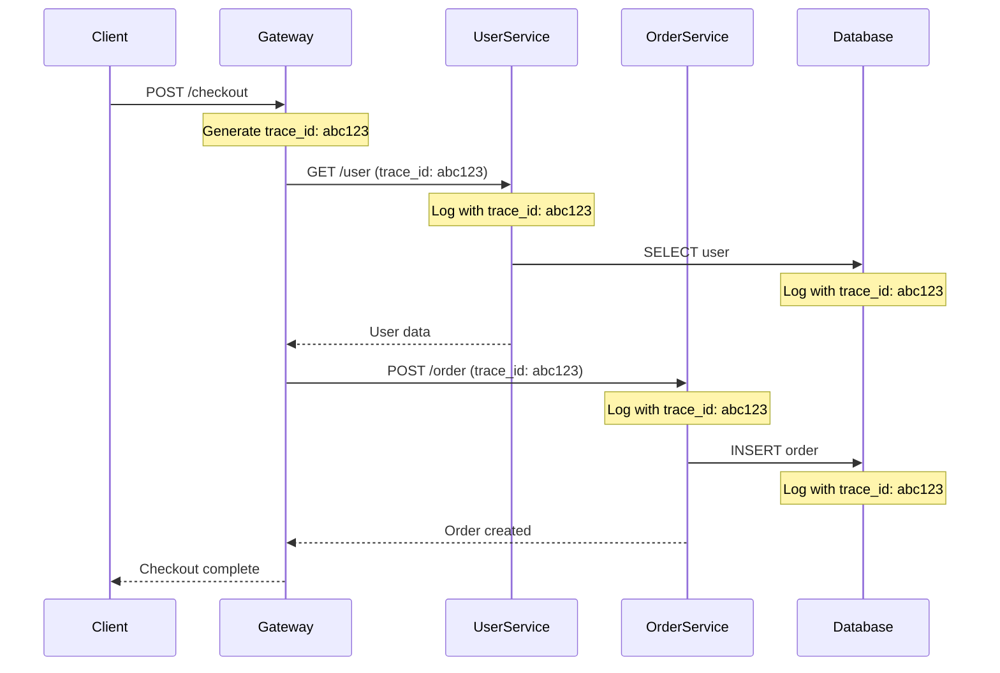
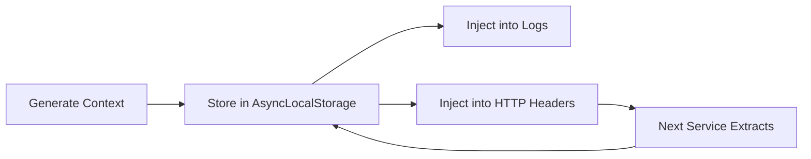
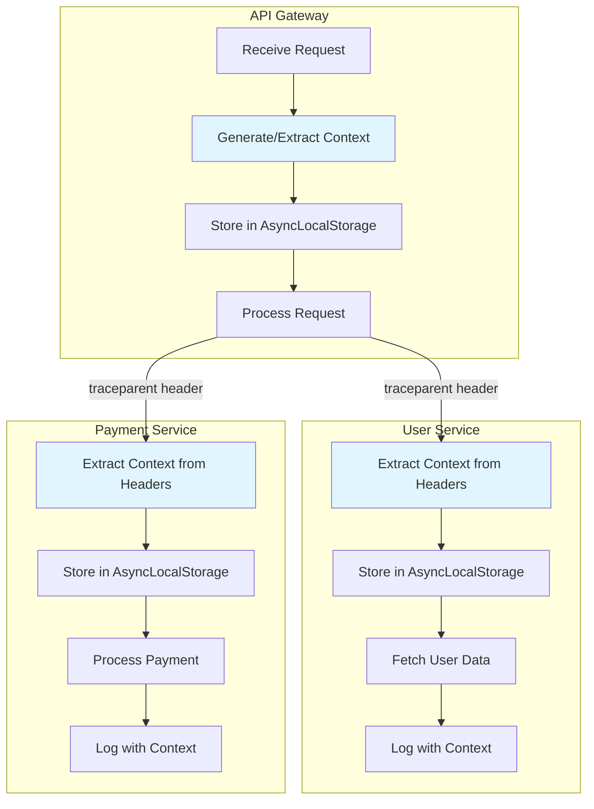

# How to Implement Log Context Propagation

Author: [nawazdhandala](https://github.com/nawazdhandala)

Tags: Logging, Context, Distributed Systems, Tracing

Description: Learn to implement log context propagation for cross-service log correlation.

---

When a request flows through multiple services in a distributed system, understanding what happened becomes difficult. Each service generates its own logs, but without context propagation, these logs remain isolated islands of information. Log context propagation solves this by carrying identifiers across service boundaries, allowing you to trace a single request through your entire system.

This guide walks through practical implementation patterns for log context propagation in Node.js applications, with examples you can adapt to your own services.

---

## What is Log Context Propagation?

Log context propagation is the practice of passing correlation identifiers (like trace IDs and request IDs) through every service that handles a request. When all services include the same identifier in their logs, you can search for that ID and see the complete journey of a request.

The following diagram shows how context flows through a distributed system.



Without context propagation, each service would log independently and you would need to correlate logs manually using timestamps and guesswork.

---

## The Core Components

Context propagation requires three components working together: context generation at the entry point, context extraction from incoming requests, and context injection into outgoing requests.



---

## Setting Up the Context Store

Node.js provides `AsyncLocalStorage` for maintaining request-scoped data across async operations. This is the foundation of context propagation.

The following module creates a singleton store that maintains context throughout a request lifecycle. AsyncLocalStorage automatically preserves context across callbacks, promises, and event emitters.

```typescript
// context-store.ts
import { AsyncLocalStorage } from 'async_hooks';

// Define the shape of our propagated context
interface PropagatedContext {
  traceId: string;
  spanId: string;
  parentSpanId?: string;
  requestId: string;
  userId?: string;
  tenantId?: string;
}

// Create a singleton storage instance
const contextStorage = new AsyncLocalStorage<PropagatedContext>();

export function runWithContext<T>(
  context: PropagatedContext,
  fn: () => T
): T {
  // Execute function with context available to all nested calls
  return contextStorage.run(context, fn);
}

export function getContext(): PropagatedContext | undefined {
  return contextStorage.getStore();
}

export function generateTraceId(): string {
  // Generate a 32-character hex string matching W3C trace context format
  return Array.from({ length: 32 }, () =>
    Math.floor(Math.random() * 16).toString(16)
  ).join('');
}

export function generateSpanId(): string {
  // Generate a 16-character hex string for span identification
  return Array.from({ length: 16 }, () =>
    Math.floor(Math.random() * 16).toString(16)
  ).join('');
}
```

---

## Creating a Context-Aware Logger

The logger must automatically include context from the current execution scope. This wrapper around your logging library injects trace IDs without requiring manual passing of context through every function call.

```typescript
// context-logger.ts
import { getContext } from './context-store';

type LogLevel = 'debug' | 'info' | 'warn' | 'error';

interface LogEntry {
  timestamp: string;
  level: LogLevel;
  message: string;
  traceId?: string;
  spanId?: string;
  requestId?: string;
  userId?: string;
  [key: string]: unknown;
}

export function log(
  level: LogLevel,
  message: string,
  attributes: Record<string, unknown> = {}
): void {
  const context = getContext();

  const entry: LogEntry = {
    timestamp: new Date().toISOString(),
    level,
    message,
    // Context fields are automatically injected
    traceId: context?.traceId,
    spanId: context?.spanId,
    requestId: context?.requestId,
    userId: context?.userId,
    // Merge any additional attributes
    ...attributes,
  };

  // Output as JSON for structured log aggregation
  console.log(JSON.stringify(entry));
}

// Convenience methods for each log level
export const logger = {
  debug: (msg: string, attrs?: Record<string, unknown>) => log('debug', msg, attrs),
  info: (msg: string, attrs?: Record<string, unknown>) => log('info', msg, attrs),
  warn: (msg: string, attrs?: Record<string, unknown>) => log('warn', msg, attrs),
  error: (msg: string, attrs?: Record<string, unknown>) => log('error', msg, attrs),
};
```

---

## Middleware for Context Extraction and Injection

Express middleware handles the entry point of requests, extracting context from incoming headers or generating new context for fresh requests.

```typescript
// context-middleware.ts
import { Request, Response, NextFunction } from 'express';
import {
  runWithContext,
  getContext,
  generateTraceId,
  generateSpanId,
} from './context-store';
import { logger } from './context-logger';

// W3C Trace Context header names
const TRACEPARENT_HEADER = 'traceparent';
const REQUEST_ID_HEADER = 'x-request-id';

interface ParsedTraceParent {
  traceId: string;
  parentSpanId: string;
}

function parseTraceParent(header: string): ParsedTraceParent | null {
  // W3C traceparent format: version-traceId-parentId-flags
  // Example: 00-abc123...def456-1234567890abcdef-01
  const parts = header.split('-');
  if (parts.length !== 4) return null;

  return {
    traceId: parts[1],
    parentSpanId: parts[2],
  };
}

export function contextMiddleware(
  req: Request,
  res: Response,
  next: NextFunction
): void {
  // Extract existing context from headers or generate new
  const traceparent = req.headers[TRACEPARENT_HEADER] as string | undefined;
  const requestId = (req.headers[REQUEST_ID_HEADER] as string) || generateSpanId();

  let traceId: string;
  let parentSpanId: string | undefined;

  if (traceparent) {
    // Continue existing trace from upstream service
    const parsed = parseTraceParent(traceparent);
    if (parsed) {
      traceId = parsed.traceId;
      parentSpanId = parsed.parentSpanId;
    } else {
      traceId = generateTraceId();
    }
  } else {
    // Start new trace at this service
    traceId = generateTraceId();
  }

  const spanId = generateSpanId();

  const context = {
    traceId,
    spanId,
    parentSpanId,
    requestId,
    userId: req.headers['x-user-id'] as string | undefined,
    tenantId: req.headers['x-tenant-id'] as string | undefined,
  };

  // Add trace ID to response headers for client debugging
  res.setHeader('x-trace-id', traceId);

  // Run the rest of the request with context available
  runWithContext(context, () => {
    logger.info('Request received', {
      method: req.method,
      path: req.path,
      userAgent: req.headers['user-agent'],
    });
    next();
  });
}
```

---

## Propagating Context to Downstream Services

When making HTTP calls to other services, you must inject the current context into request headers. This HTTP client wrapper handles propagation automatically.

```typescript
// context-http-client.ts
import { getContext } from './context-store';
import { logger } from './context-logger';

interface RequestOptions {
  method?: string;
  headers?: Record<string, string>;
  body?: unknown;
}

export async function fetchWithContext(
  url: string,
  options: RequestOptions = {}
): Promise<Response> {
  const context = getContext();

  // Build traceparent header in W3C format
  const traceparent = context
    ? `00-${context.traceId}-${context.spanId}-01`
    : undefined;

  const headers: Record<string, string> = {
    ...options.headers,
    'Content-Type': 'application/json',
  };

  // Inject context headers for downstream services
  if (traceparent) {
    headers['traceparent'] = traceparent;
  }
  if (context?.requestId) {
    headers['x-request-id'] = context.requestId;
  }
  if (context?.userId) {
    headers['x-user-id'] = context.userId;
  }
  if (context?.tenantId) {
    headers['x-tenant-id'] = context.tenantId;
  }

  logger.debug('Outgoing HTTP request', {
    url,
    method: options.method || 'GET',
  });

  const response = await fetch(url, {
    ...options,
    headers,
    body: options.body ? JSON.stringify(options.body) : undefined,
  });

  logger.debug('HTTP response received', {
    url,
    status: response.status,
  });

  return response;
}
```

---

## Putting It All Together

Here is a complete Express application demonstrating context propagation across service calls.

```typescript
// app.ts
import express from 'express';
import { contextMiddleware } from './context-middleware';
import { fetchWithContext } from './context-http-client';
import { logger } from './context-logger';

const app = express();
app.use(express.json());
app.use(contextMiddleware);

app.post('/checkout', async (req, res) => {
  logger.info('Starting checkout process', {
    cartId: req.body.cartId,
    itemCount: req.body.items?.length,
  });

  try {
    // Call user service - context is automatically propagated
    logger.info('Fetching user details');
    const userResponse = await fetchWithContext(
      'http://user-service:3001/users/current'
    );
    const user = await userResponse.json();

    // Call inventory service
    logger.info('Checking inventory availability');
    const inventoryResponse = await fetchWithContext(
      'http://inventory-service:3002/check',
      {
        method: 'POST',
        body: { items: req.body.items },
      }
    );
    const inventory = await inventoryResponse.json();

    if (!inventory.available) {
      logger.warn('Inventory check failed', {
        unavailableItems: inventory.unavailableItems,
      });
      return res.status(400).json({ error: 'Items unavailable' });
    }

    // Call payment service
    logger.info('Processing payment', {
      amount: req.body.total,
      currency: 'USD',
    });
    const paymentResponse = await fetchWithContext(
      'http://payment-service:3003/charge',
      {
        method: 'POST',
        body: {
          userId: user.id,
          amount: req.body.total,
        },
      }
    );

    if (!paymentResponse.ok) {
      logger.error('Payment processing failed', {
        status: paymentResponse.status,
      });
      return res.status(402).json({ error: 'Payment failed' });
    }

    logger.info('Checkout completed successfully');
    res.json({ status: 'success', orderId: `order-${Date.now()}` });

  } catch (error) {
    logger.error('Checkout failed with exception', {
      errorMessage: (error as Error).message,
      errorStack: (error as Error).stack,
    });
    res.status(500).json({ error: 'Internal error' });
  }
});

app.listen(3000, () => {
  console.log('Server running on port 3000');
});
```

---

## Context Flow Visualization

The following diagram shows how context flows through a checkout request.



---

## Querying Correlated Logs

With context propagation in place, you can now query logs across all services using a single trace ID. Here is what the log output looks like.

```json
{"timestamp":"2026-01-30T10:00:00.000Z","level":"info","message":"Request received","traceId":"abc123def456...","spanId":"1234abcd","requestId":"req-789","method":"POST","path":"/checkout"}
{"timestamp":"2026-01-30T10:00:00.050Z","level":"info","message":"Fetching user details","traceId":"abc123def456...","spanId":"1234abcd","requestId":"req-789"}
{"timestamp":"2026-01-30T10:00:00.100Z","level":"info","message":"Request received","traceId":"abc123def456...","spanId":"5678efgh","parentSpanId":"1234abcd","requestId":"req-789","method":"GET","path":"/users/current"}
{"timestamp":"2026-01-30T10:00:00.150Z","level":"info","message":"Processing payment","traceId":"abc123def456...","spanId":"1234abcd","requestId":"req-789","amount":99.99,"currency":"USD"}
{"timestamp":"2026-01-30T10:00:00.300Z","level":"info","message":"Checkout completed successfully","traceId":"abc123def456...","spanId":"1234abcd","requestId":"req-789"}
```

Searching for `traceId: abc123def456...` in your log aggregation system returns all logs from every service that participated in this request.

---

## Best Practices

**Generate context at the edge.** The first service to receive a request should generate the trace ID. All downstream services inherit and propagate this ID.

**Use standard header formats.** The W3C Trace Context specification defines `traceparent` and `tracestate` headers. Using standards means your services work with other OpenTelemetry-instrumented systems.

**Include context in error logs.** When exceptions occur, the trace ID in error logs lets you find the exact request that failed and see everything that happened before the failure.

**Propagate through message queues.** When publishing messages to queues like Kafka or RabbitMQ, include context in message headers. Consumers extract this context to continue the trace.

**Keep context lightweight.** Only propagate IDs and essential metadata. Large context payloads add latency to every service call.

---

## Summary

Log context propagation transforms isolated service logs into a connected story of request execution. By generating correlation IDs at the entry point and propagating them through HTTP headers, you can trace any request through your entire distributed system.

The key components are:

- AsyncLocalStorage for maintaining request-scoped context
- Middleware for extracting and injecting context
- A context-aware logger that automatically includes trace IDs
- An HTTP client wrapper that propagates context to downstream services

With these pieces in place, debugging distributed systems becomes manageable. When something goes wrong, you search for one trace ID and see the complete picture.

---

*Looking for a complete observability solution with built-in log correlation? [OneUptime](https://oneuptime.com) provides native support for OpenTelemetry logs, traces, and metrics with automatic correlation across all your services.*

**Related Reading:**

- [How to Structure Logs Properly in OpenTelemetry](https://oneuptime.com/blog/post/2025-08-28-how-to-structure-logs-properly-in-opentelemetry/view)
- [What are Traces and Spans in OpenTelemetry](https://oneuptime.com/blog/post/2025-08-27-traces-and-spans-in-opentelemetry/view)
- [Three Pillars of Observability: Logs, Metrics, Traces](https://oneuptime.com/blog/post/2025-08-20-three-pillars-of-observability-logs-metrics-traces/view)
