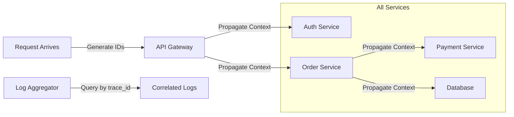
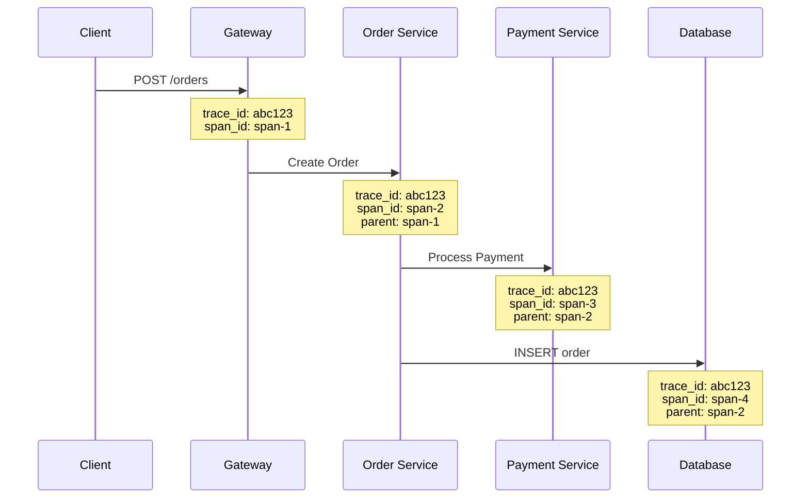
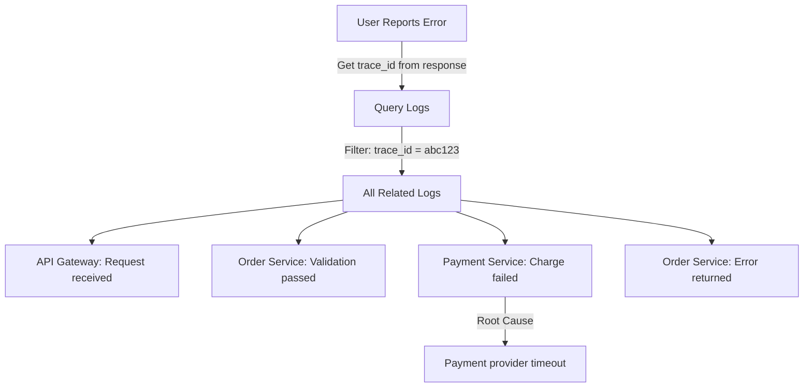

# How to Create Log Correlation Implementation

Author: [nawazdhandala](https://github.com/nawazdhandala)

Tags: Logging, Correlation, Tracing, Observability

Description: Learn to create log correlation using trace IDs and request IDs across services.

---

Log correlation transforms isolated log lines into connected narratives. Without it, debugging distributed systems becomes a guessing game. With it, you can follow a single request from entry to exit across dozens of services, databases, and queues.

## What Is Log Correlation?

Log correlation links related log entries using shared identifiers. When a request enters your system, it gets a unique ID that travels with it through every service, database call, and background job. Every log line includes this ID, making it possible to filter thousands of logs down to the exact sequence of events for one request.

The correlation flow looks like this.



## The Two Essential IDs

You need two identifiers for effective correlation.

**Trace ID**: A globally unique identifier generated at the system boundary. It stays constant across all services for a single request. Use this to find every log related to one user action.

**Span ID**: Identifies a specific operation within the trace. Each service call, database query, or function execution gets its own span ID. Parent-child relationships between spans show causality.

Here is how these IDs relate in a typical request flow.



## Setting Up Context Propagation

Context propagation passes correlation IDs between services automatically. The W3C Trace Context standard defines how to encode these IDs in HTTP headers.

Start by creating a context manager that handles ID generation and storage. This class generates trace IDs when needed and provides access throughout your application.

```typescript
// context.ts
import { randomUUID } from 'crypto';
import { AsyncLocalStorage } from 'async_hooks';

// Define the shape of our correlation context
interface CorrelationContext {
  traceId: string;
  spanId: string;
  parentSpanId?: string;
}

// AsyncLocalStorage maintains context across async operations
const storage = new AsyncLocalStorage<CorrelationContext>();

export function generateSpanId(): string {
  // 16-character hex string for span IDs
  return randomUUID().replace(/-/g, '').substring(0, 16);
}

export function generateTraceId(): string {
  // 32-character hex string for trace IDs
  return randomUUID().replace(/-/g, '');
}

export function getContext(): CorrelationContext | undefined {
  return storage.getStore();
}

export function runWithContext<T>(
  context: CorrelationContext,
  fn: () => T
): T {
  return storage.run(context, fn);
}
```

## Middleware for HTTP Services

Every incoming request needs correlation context. If the request includes trace headers, use them. Otherwise, generate new IDs. This middleware handles both cases for Express applications.

```typescript
// middleware.ts
import { Request, Response, NextFunction } from 'express';
import {
  generateTraceId,
  generateSpanId,
  runWithContext,
  CorrelationContext
} from './context';

// W3C Trace Context header name
const TRACEPARENT_HEADER = 'traceparent';

export function correlationMiddleware(
  req: Request,
  res: Response,
  next: NextFunction
): void {
  // Parse incoming trace context or generate new one
  const context = parseOrCreateContext(req);

  // Add trace ID to response headers for debugging
  res.setHeader('x-trace-id', context.traceId);

  // Run the rest of the request within this context
  runWithContext(context, () => {
    next();
  });
}

function parseOrCreateContext(req: Request): CorrelationContext {
  const traceparent = req.headers[TRACEPARENT_HEADER] as string;

  if (traceparent) {
    // Parse W3C traceparent: version-traceId-parentSpanId-flags
    const parts = traceparent.split('-');
    if (parts.length === 4) {
      return {
        traceId: parts[1],
        spanId: generateSpanId(),
        parentSpanId: parts[2]
      };
    }
  }

  // No valid incoming context, start a new trace
  return {
    traceId: generateTraceId(),
    spanId: generateSpanId()
  };
}
```

## Creating a Correlated Logger

Your logger must automatically include correlation IDs in every log entry. Wrap your preferred logging library to inject context automatically.

```typescript
// logger.ts
import { getContext } from './context';

// Log levels as numeric values for filtering
enum LogLevel {
  DEBUG = 10,
  INFO = 20,
  WARN = 30,
  ERROR = 40
}

interface LogEntry {
  timestamp: string;
  level: string;
  message: string;
  traceId?: string;
  spanId?: string;
  parentSpanId?: string;
  service: string;
  [key: string]: unknown;
}

const SERVICE_NAME = process.env.SERVICE_NAME || 'unknown';

function createLogEntry(
  level: string,
  message: string,
  extra: Record<string, unknown> = {}
): LogEntry {
  const context = getContext();

  return {
    timestamp: new Date().toISOString(),
    level,
    message,
    // Include correlation IDs from context
    traceId: context?.traceId,
    spanId: context?.spanId,
    parentSpanId: context?.parentSpanId,
    service: SERVICE_NAME,
    ...extra
  };
}

export const logger = {
  debug(message: string, extra?: Record<string, unknown>): void {
    const entry = createLogEntry('DEBUG', message, extra);
    console.log(JSON.stringify(entry));
  },

  info(message: string, extra?: Record<string, unknown>): void {
    const entry = createLogEntry('INFO', message, extra);
    console.log(JSON.stringify(entry));
  },

  warn(message: string, extra?: Record<string, unknown>): void {
    const entry = createLogEntry('WARN', message, extra);
    console.warn(JSON.stringify(entry));
  },

  error(message: string, extra?: Record<string, unknown>): void {
    const entry = createLogEntry('ERROR', message, extra);
    console.error(JSON.stringify(entry));
  }
};
```

## Propagating Context to Downstream Services

When calling other services, you must forward the correlation context. Create an HTTP client wrapper that handles this automatically.

```typescript
// http-client.ts
import { getContext, generateSpanId } from './context';

const TRACEPARENT_HEADER = 'traceparent';

export async function fetchWithContext(
  url: string,
  options: RequestInit = {}
): Promise<Response> {
  const context = getContext();
  const headers = new Headers(options.headers);

  if (context) {
    // Create new span for this outbound call
    const childSpanId = generateSpanId();

    // Format: version-traceId-spanId-flags
    // Version 00 is current, flags 01 means sampled
    const traceparent = `00-${context.traceId}-${childSpanId}-01`;
    headers.set(TRACEPARENT_HEADER, traceparent);
  }

  return fetch(url, {
    ...options,
    headers
  });
}
```

## Database Query Correlation

Database queries should also carry correlation context. Most database drivers support query comments, which pass through to slow query logs.

```typescript
// database.ts
import { getContext } from './context';
import { logger } from './logger';

export async function query(sql: string, params: unknown[] = []) {
  const context = getContext();
  const startTime = Date.now();

  // Add trace context as SQL comment for debugging
  const commentedSql = context
    ? `/* trace_id=${context.traceId} span_id=${context.spanId} */ ${sql}`
    : sql;

  try {
    const result = await executeQuery(commentedSql, params);
    logger.debug('Query completed', {
      durationMs: Date.now() - startTime
    });
    return result;
  } catch (error) {
    logger.error('Query failed', { error: (error as Error).message });
    throw error;
  }
}
```

## Putting It All Together

Here is a complete example showing correlation across an order creation flow.

```typescript
// order-service.ts
import express from 'express';
import { correlationMiddleware } from './middleware';
import { logger } from './logger';
import { fetchWithContext } from './http-client';
import { query } from './database';

const app = express();
app.use(express.json());
app.use(correlationMiddleware);

app.post('/orders', async (req, res) => {
  logger.info('Order creation started', { userId: req.body.userId });

  try {
    // Validate inventory with external service
    const inventoryCheck = await fetchWithContext(
      'http://inventory-service/check',
      { method: 'POST', body: JSON.stringify({ items: req.body.items }) }
    );

    if (!inventoryCheck.ok) {
      logger.warn('Inventory check failed');
      return res.status(400).json({ error: 'Items not available' });
    }

    // Process payment
    const paymentResult = await fetchWithContext(
      'http://payment-service/charge',
      { method: 'POST', body: JSON.stringify({ amount: req.body.total }) }
    );

    if (!paymentResult.ok) {
      logger.error('Payment failed');
      return res.status(402).json({ error: 'Payment failed' });
    }

    // Persist the order
    const result = await query(
      'INSERT INTO orders (user_id, total) VALUES ($1, $2) RETURNING id',
      [req.body.userId, req.body.total]
    );

    logger.info('Order completed', { orderId: result.rows[0] });
    res.json({ orderId: result.rows[0], status: 'confirmed' });

  } catch (error) {
    logger.error('Order failed', { error: (error as Error).message });
    res.status(500).json({ error: 'Internal server error' });
  }
});
```

## Querying Correlated Logs

Once your logs include trace IDs, debugging becomes straightforward. Here is what a correlated log query looks like in practice.



Filter by trace ID to see the complete request journey.

```bash
# Example log query in your aggregator
trace_id:abc123 | sort timestamp asc
```

The results show every log entry for that request in chronological order, across all services.

## Best Practices

**Generate IDs at the edge**: Create trace IDs at your API gateway or load balancer before requests touch application code.

**Use structured logging**: JSON logs are easier to query than plain text. Include the trace ID as a dedicated field.

**Propagate context through queues**: Message queues need trace context too. Include correlation IDs in message headers.

**Add context to errors**: Exception handlers should include correlation IDs for faster debugging.

**Monitor cardinality**: Trace IDs are high cardinality by design. Make sure your log aggregator handles this efficiently.

---

Log correlation is the foundation of effective distributed system debugging. Start with trace ID propagation, add structured logging, and extend to database queries and message queues. The investment pays off the first time you debug a production issue in minutes instead of hours.
