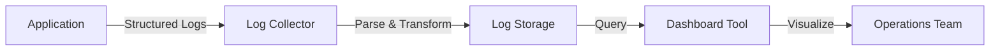
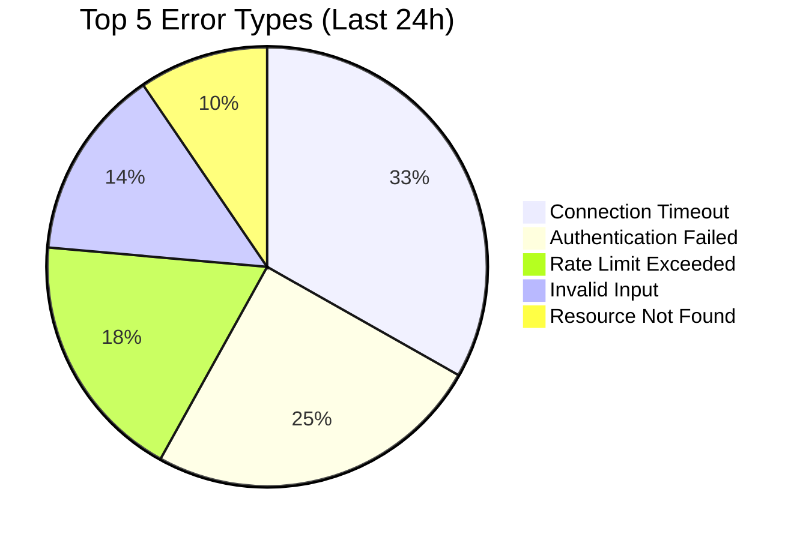
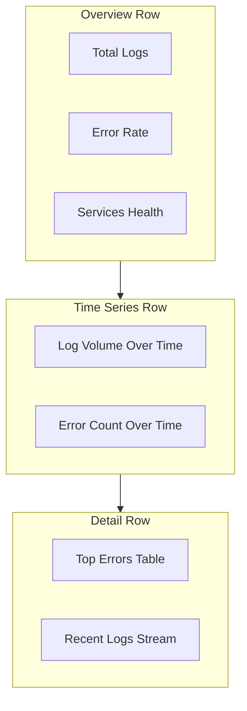

# How to Create Log Dashboards

Author: [nawazdhandala](https://github.com/nawazdhandala)

Tags: Logging, Dashboards, Grafana, Visualization

Description: Learn to create log dashboards for visualizing log data and patterns.

---

Your application generates thousands of log lines every minute. Error messages, debug statements, access logs, audit trails. Without proper visualization, this data stream becomes noise. Log dashboards transform that noise into actionable insights.

This guide walks you through building log dashboards that surface problems before they become outages.

---

## Why Log Dashboards Matter

Raw logs are hard to scan. Scrolling through text files or terminal output works fine when you have ten log lines. It falls apart at scale. Log dashboards solve three problems:

1. **Pattern Recognition**: Spot trends across thousands of entries
2. **Correlation**: See how different log sources relate to each other
3. **Alerting Foundation**: Build monitors on top of visualized data

The goal is not to replace log search. You still need to grep and filter when debugging specific issues. Dashboards give you the high-level view that tells you where to look.

---

## Architecture Overview

Before building dashboards, you need logs flowing through a pipeline. Here is the typical architecture.



Each component has options. Your application can emit JSON logs directly. The collector might be Fluentd, Logstash, or the OpenTelemetry Collector. Storage could be Elasticsearch, Loki, or ClickHouse. Dashboard tools include Grafana, Kibana, or OneUptime.

The key point: dashboards sit at the end of the pipeline. Get your log collection and storage right first.

---

## Structuring Logs for Dashboards

Dashboards work best with structured logs. Unstructured text requires parsing and regex. Structured JSON gives you queryable fields out of the box.

Here is the difference between unstructured and structured approaches.

```javascript
// Unstructured logging - hard to query and visualize
console.log("User john@example.com logged in from 192.168.1.100");
console.log("Order #12345 completed in 2.5 seconds");
console.log("Database connection failed after 3 retries");
```

These log lines contain useful information buried in text. Extracting user email, order ID, or duration requires parsing.

Structured logging separates data into discrete fields.

```javascript
// Structured logging - dashboard-ready
const logger = require('pino')();

// Each field becomes a queryable dimension in your dashboard
logger.info({
  event: 'user_login',
  user_email: 'john@example.com',
  source_ip: '192.168.1.100',
  auth_method: 'password',
  session_duration_ms: 0
});

logger.info({
  event: 'order_completed',
  order_id: '12345',
  duration_seconds: 2.5,
  item_count: 3,
  total_amount_usd: 149.99
});

logger.error({
  event: 'database_connection_failed',
  retry_count: 3,
  database_host: 'primary.db.internal',
  error_code: 'ETIMEDOUT'
});
```

With structured logs, you can build dashboard panels that show:
- Login events per hour grouped by auth method
- Order completion time as a histogram
- Database failures filtered by error code

---

## Essential Dashboard Panels

Every log dashboard needs a core set of panels. Start with these and expand based on your application.

### 1. Log Volume Over Time

The simplest panel shows log count over time. Spikes indicate unusual activity. Drops might mean a service went down.

```mermaid
xychart-beta
    title "Log Volume Per Hour"
    x-axis [00:00, 04:00, 08:00, 12:00, 16:00, 20:00]
    y-axis "Log Count" 0 --> 50000
    bar [12000, 8000, 25000, 45000, 38000, 15000]
```

### 2. Error Rate Panel

Track error logs as a percentage of total logs. This normalizes for traffic patterns.

The following query calculates error rate in a Loki/LogQL style.

```promql
# Calculate error percentage over 5 minute windows
# Count of error-level logs divided by total logs
sum(count_over_time({job="myapp"} | level="error" [5m]))
/
sum(count_over_time({job="myapp"} [5m]))
* 100
```

### 3. Top Errors Table

A table panel showing the most frequent error messages helps prioritize fixes.



### 4. Latency Distribution

If your logs include timing information, visualize the distribution.

```javascript
// Log with timing data for latency dashboards
logger.info({
  event: 'http_request',
  method: 'GET',
  path: '/api/users',
  status_code: 200,
  duration_ms: 145,        // This field powers latency panels
  response_size_bytes: 2048
});
```

---

## Building a Grafana Dashboard

Grafana is the most common tool for log visualization. Here is how to create a dashboard from scratch.

### Step 1: Add Data Source

Connect Grafana to your log storage. This example uses Loki.

```yaml
# grafana/provisioning/datasources/loki.yaml
apiVersion: 1
datasources:
  - name: Loki
    type: loki
    access: proxy
    url: http://loki:3100
    isDefault: true
    jsonData:
      maxLines: 1000
```

### Step 2: Create Log Volume Panel

Add a time series panel with this query.

```logql
# Count all logs per minute, grouped by level
sum by (level) (
  count_over_time({job="myapp"}[1m])
)
```

### Step 3: Add Log Stream Panel

The Logs panel type shows actual log content. Use it for drilling down after spotting anomalies in charts.

```logql
# Show error logs from the payment service
{service="payment"} | level="error" | json | line_format "{{.timestamp}} {{.message}}"
```

### Step 4: Create Variables for Filtering

Dashboard variables let users filter without editing queries.

```yaml
# Variable definition for service filter
name: service
type: query
query: label_values(service)
refresh: on_time_range_change
```

Then reference it in panels.

```logql
# Query using the service variable
{service="$service"} | json
```

---

## Dashboard Design Principles

Good log dashboards follow consistent patterns.

### Layout Structure

Organize panels in a logical flow. Start broad, then narrow down.



### Color Coding

Use consistent colors for log levels across all panels.

```javascript
// Standard color mapping for log levels
const LOG_LEVEL_COLORS = {
  debug: '#73BF69',    // Green - routine information
  info: '#5794F2',     // Blue - normal operations
  warn: '#FF9830',     // Orange - potential issues
  error: '#F2495C',    // Red - failures
  fatal: '#8B0000'     // Dark red - critical failures
};
```

### Time Range Alignment

All panels should respect the dashboard time range. Avoid hardcoded time windows unless you have a specific reason.

---

## Real-World Dashboard Example

Here is a complete dashboard configuration for an e-commerce application.

```json
{
  "title": "Application Logs Overview",
  "panels": [
    {
      "title": "Log Volume by Service",
      "type": "timeseries",
      "gridPos": { "x": 0, "y": 0, "w": 12, "h": 8 },
      "targets": [
        {
          "expr": "sum by (service) (count_over_time({job=\"ecommerce\"}[1m]))",
          "legendFormat": "{{service}}"
        }
      ]
    },
    {
      "title": "Error Rate %",
      "type": "stat",
      "gridPos": { "x": 12, "y": 0, "w": 6, "h": 4 },
      "targets": [
        {
          "expr": "sum(count_over_time({job=\"ecommerce\"} | level=\"error\" [5m])) / sum(count_over_time({job=\"ecommerce\"}[5m])) * 100"
        }
      ],
      "fieldConfig": {
        "defaults": {
          "thresholds": {
            "steps": [
              { "value": 0, "color": "green" },
              { "value": 1, "color": "yellow" },
              { "value": 5, "color": "red" }
            ]
          }
        }
      }
    },
    {
      "title": "Recent Errors",
      "type": "logs",
      "gridPos": { "x": 0, "y": 8, "w": 24, "h": 10 },
      "targets": [
        {
          "expr": "{job=\"ecommerce\"} | level=\"error\" | json"
        }
      ]
    }
  ]
}
```

---

## Alerting from Log Dashboards

Dashboards become powerful when connected to alerts. Configure alerts based on log patterns.

```yaml
# Alert rule for error spike detection
apiVersion: 1
groups:
  - name: log-alerts
    rules:
      - alert: HighErrorRate
        expr: |
          sum(count_over_time({job="myapp"} | level="error" [5m]))
          /
          sum(count_over_time({job="myapp"} [5m]))
          > 0.05
        for: 2m
        labels:
          severity: warning
        annotations:
          summary: "Error rate exceeded 5%"
          description: "Error rate is {{ $value | printf \"%.2f\" }}%"
```

The alert fires when errors exceed 5% of total logs for 2 minutes. Link back to your dashboard in the alert notification so responders can investigate immediately.

---

## Performance Considerations

Log dashboards can become slow with high data volumes. Apply these optimizations.

**Use Time-Based Queries**: Always include time range filters. Scanning all historical data kills performance.

**Aggregate at Ingestion**: Pre-calculate metrics where possible. Counting at query time is expensive.

**Limit Result Sets**: Cap the number of log lines returned to panels. Users rarely need more than 1000 lines.

```logql
# Limit log results to prevent slow queries
{job="myapp"} | json | limit 500
```

**Use Log Sampling**: For high-volume services, sample logs before storage. Keep 100% of errors, sample info/debug at 10%.

---

## Next Steps

Start with a basic dashboard showing log volume and error rate. Add panels as you learn what questions your team asks during incidents.

Common additions include:
- Response time percentiles (p50, p95, p99)
- Geographic distribution of requests
- User journey funnel visualization
- Deployment markers overlaid on log charts

Log dashboards are living documents. Review them monthly. Remove panels nobody uses. Add panels that answer recurring questions.

---

**Related Reading:**

- [How to Structure Logs Properly in OpenTelemetry](https://oneuptime.com/blog/post/2025-08-28-how-to-structure-logs-properly-in-opentelemetry/view)
- [Logs, Metrics & Traces: Turning Three Noisy Streams into One Story](https://oneuptime.com/blog/post/2025-08-20-three-pillars-of-observability-logs-metrics-traces/view)
- [The Three Pillars of Observability](https://oneuptime.com/blog/post/2025-08-20-three-pillars-of-observability-logs-metrics-traces/view)
