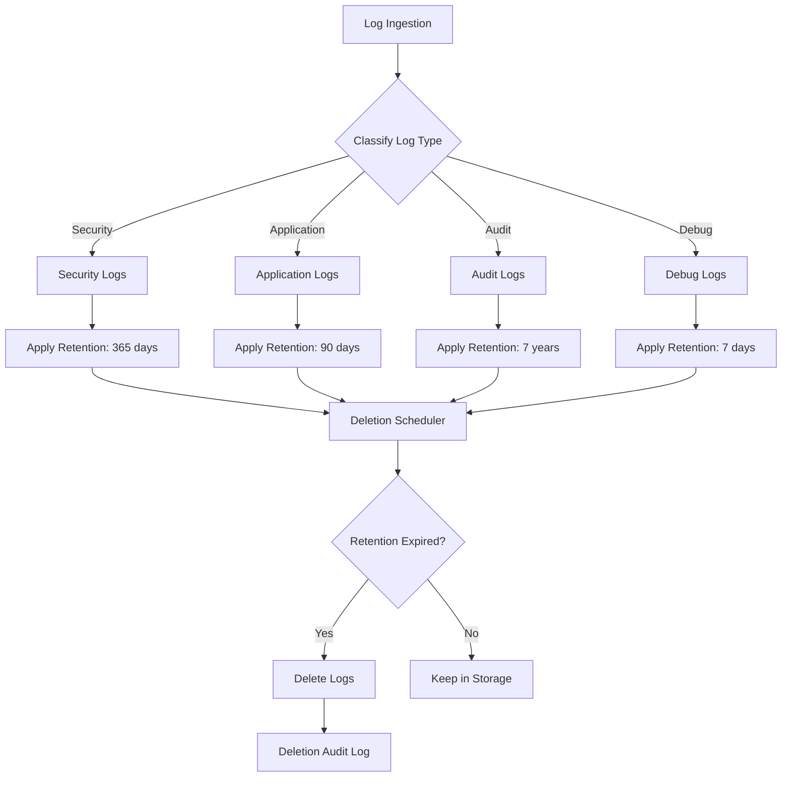
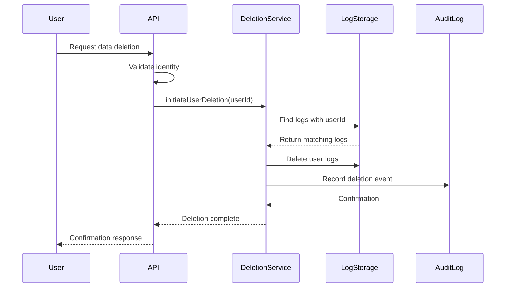
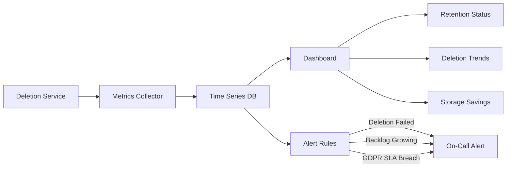

# How to Implement Log Deletion Policies

Author: [nawazdhandala](https://github.com/nawazdhandala)

Tags: Logging, Deletion, GDPR, Compliance

Description: Learn to implement log deletion policies for data lifecycle and compliance management.

---

Log data grows fast. Without a deletion policy, you end up with terabytes of stale logs, ballooning storage costs, and potential compliance violations. A well-designed log deletion policy balances retention needs with storage economics and regulatory requirements like GDPR, HIPAA, and SOC 2.

This guide walks through implementing log deletion policies from architecture to automation.

---

## Why Log Deletion Policies Matter

Organizations collect logs for debugging, security auditing, and compliance. But keeping logs forever creates problems:

- **Storage costs climb** as log volumes grow 20-50% annually
- **Query performance degrades** when searching through years of data
- **Compliance violations occur** when personal data lingers beyond retention periods
- **Security risks increase** as old logs become attack targets

A deletion policy solves these by defining how long each log type lives and automating the cleanup.

---

## Policy Architecture Overview

A log deletion system has three main components: classification, retention rules, and execution. The following diagram shows how logs flow through this system.



---

## Step 1: Classify Your Logs

Not all logs deserve the same retention period. Start by categorizing logs based on their purpose and compliance requirements.

This configuration defines log categories with their retention periods and compliance drivers. Each category maps to specific log patterns that your deletion system will use for matching.

```yaml
# log-retention-config.yaml
# Defines retention rules by log category

log_categories:
  security:
    description: "Authentication, authorization, and security events"
    retention_days: 365
    compliance_driver: "SOC 2, PCI-DSS"
    patterns:
      - "auth.*"
      - "security.*"
      - "access.*"

  audit:
    description: "User actions and data changes for compliance"
    retention_days: 2555  # 7 years for financial compliance
    compliance_driver: "SOX, GDPR Article 17"
    patterns:
      - "audit.*"
      - "data_change.*"
      - "user_action.*"

  application:
    description: "Application errors, warnings, and info logs"
    retention_days: 90
    compliance_driver: "Operational"
    patterns:
      - "app.*"
      - "service.*"
      - "api.*"

  debug:
    description: "Verbose debugging information"
    retention_days: 7
    compliance_driver: "None"
    patterns:
      - "debug.*"
      - "trace.*"
      - "verbose.*"

  pii_containing:
    description: "Logs containing personal identifiable information"
    retention_days: 30
    compliance_driver: "GDPR Article 5, CCPA"
    patterns:
      - "*.pii"
      - "user_data.*"
```

---

## Step 2: Implement the Deletion Service

The deletion service runs on a schedule, queries for expired logs, and removes them in batches. This TypeScript implementation handles the core deletion logic with proper error handling and audit logging.

```typescript
// log-deletion-service.ts
// Service for automated log deletion based on retention policies

import { LogStorage } from './log-storage';
import { AuditLogger } from './audit-logger';

interface RetentionPolicy {
  category: string;
  retentionDays: number;
  patterns: string[];
}

interface DeletionResult {
  category: string;
  deletedCount: number;
  oldestDeleted: Date;
  newestDeleted: Date;
  durationMs: number;
}

export class LogDeletionService {
  private storage: LogStorage;
  private auditLogger: AuditLogger;
  private policies: RetentionPolicy[];

  // Batch size limits memory usage during large deletions
  private readonly BATCH_SIZE = 10000;

  // Maximum time for a single deletion run to prevent blocking
  private readonly MAX_DELETION_TIME_MS = 300000; // 5 minutes

  constructor(
    storage: LogStorage,
    auditLogger: AuditLogger,
    policies: RetentionPolicy[]
  ) {
    this.storage = storage;
    this.auditLogger = auditLogger;
    this.policies = policies;
  }

  /**
   * Execute deletion for all configured policies.
   * Called by the scheduler on a regular interval.
   */
  async runDeletionCycle(): Promise<DeletionResult[]> {
    const results: DeletionResult[] = [];
    const cycleStartTime = Date.now();

    // Log the start of deletion cycle for monitoring
    await this.auditLogger.log('deletion_cycle_started', {
      policyCount: this.policies.length,
      timestamp: new Date().toISOString()
    });

    for (const policy of this.policies) {
      try {
        const result = await this.deleteExpiredLogs(policy);
        results.push(result);

        // Check if we have exceeded the maximum deletion time
        if (Date.now() - cycleStartTime > this.MAX_DELETION_TIME_MS) {
          await this.auditLogger.log('deletion_cycle_timeout', {
            completedPolicies: results.length,
            totalPolicies: this.policies.length
          });
          break;
        }
      } catch (error) {
        // Log error but continue with other policies
        await this.auditLogger.log('deletion_policy_error', {
          category: policy.category,
          error: (error as Error).message
        });
      }
    }

    // Log completion with summary statistics
    await this.auditLogger.log('deletion_cycle_completed', {
      totalDeleted: results.reduce((sum, r) => sum + r.deletedCount, 0),
      durationMs: Date.now() - cycleStartTime,
      results: results.map(r => ({
        category: r.category,
        count: r.deletedCount
      }))
    });

    return results;
  }

  /**
   * Delete logs that have exceeded their retention period for a policy.
   * Processes deletions in batches to manage memory and database load.
   */
  private async deleteExpiredLogs(policy: RetentionPolicy): Promise<DeletionResult> {
    const startTime = Date.now();
    const cutoffDate = this.calculateCutoffDate(policy.retentionDays);

    let totalDeleted = 0;
    let oldestDeleted: Date | null = null;
    let newestDeleted: Date | null = null;
    let hasMore = true;

    // Process in batches until no more expired logs exist
    while (hasMore) {
      const batch = await this.storage.findExpiredLogs({
        patterns: policy.patterns,
        olderThan: cutoffDate,
        limit: this.BATCH_SIZE
      });

      if (batch.length === 0) {
        hasMore = false;
        continue;
      }

      // Track date range of deleted logs for audit
      for (const log of batch) {
        if (!oldestDeleted || log.timestamp < oldestDeleted) {
          oldestDeleted = log.timestamp;
        }
        if (!newestDeleted || log.timestamp > newestDeleted) {
          newestDeleted = log.timestamp;
        }
      }

      // Perform the actual deletion
      const logIds = batch.map(log => log.id);
      await this.storage.deleteLogs(logIds);
      totalDeleted += batch.length;

      // Check batch count to prevent runaway deletions
      if (totalDeleted >= this.BATCH_SIZE * 100) {
        await this.auditLogger.log('deletion_batch_limit_reached', {
          category: policy.category,
          deletedCount: totalDeleted
        });
        break;
      }
    }

    return {
      category: policy.category,
      deletedCount: totalDeleted,
      oldestDeleted: oldestDeleted || new Date(),
      newestDeleted: newestDeleted || new Date(),
      durationMs: Date.now() - startTime
    };
  }

  /**
   * Calculate the cutoff date for log deletion.
   * Logs older than this date should be deleted.
   */
  private calculateCutoffDate(retentionDays: number): Date {
    const cutoff = new Date();
    cutoff.setDate(cutoff.getDate() - retentionDays);
    return cutoff;
  }
}
```

---

## Step 3: Handle GDPR Right to Erasure

GDPR Article 17 gives users the right to request deletion of their personal data. This requires a separate deletion path that targets specific user data across all log categories.

The following diagram shows the user-initiated deletion flow, which differs from time-based retention deletion.



This implementation handles GDPR deletion requests. It searches for user identifiers across all log fields and removes matching entries while maintaining an audit trail of the deletion itself.

```typescript
// gdpr-deletion-handler.ts
// Handles GDPR Article 17 right to erasure requests

import { LogStorage } from './log-storage';
import { AuditLogger } from './audit-logger';

interface DeletionRequest {
  requestId: string;
  userId: string;
  userEmail: string;
  requestedAt: Date;
  requestedBy: string;  // Could be user or admin
}

interface GdprDeletionResult {
  requestId: string;
  logsDeleted: number;
  categoriesAffected: string[];
  completedAt: Date;
}

export class GdprDeletionHandler {
  private storage: LogStorage;
  private auditLogger: AuditLogger;

  constructor(storage: LogStorage, auditLogger: AuditLogger) {
    this.storage = storage;
    this.auditLogger = auditLogger;
  }

  /**
   * Process a GDPR deletion request for a specific user.
   * Searches all log categories for user identifiers.
   */
  async processErasureRequest(request: DeletionRequest): Promise<GdprDeletionResult> {
    // Log the erasure request for compliance audit trail
    await this.auditLogger.log('gdpr_erasure_requested', {
      requestId: request.requestId,
      userId: request.userId,
      requestedBy: request.requestedBy,
      timestamp: new Date().toISOString()
    });

    // Build search criteria for user identification fields
    const searchCriteria = this.buildUserSearchCriteria(request);

    let totalDeleted = 0;
    const categoriesAffected: Set<string> = new Set();

    // Search and delete across all log indices
    const matchingLogs = await this.storage.searchByUserIdentifiers(searchCriteria);

    for (const logBatch of this.batchLogs(matchingLogs, 1000)) {
      // Track which categories contain user data
      for (const log of logBatch) {
        categoriesAffected.add(log.category);
      }

      // Delete the batch
      const logIds = logBatch.map(log => log.id);
      await this.storage.deleteLogs(logIds);
      totalDeleted += logBatch.length;
    }

    // Record completion for compliance documentation
    const result: GdprDeletionResult = {
      requestId: request.requestId,
      logsDeleted: totalDeleted,
      categoriesAffected: Array.from(categoriesAffected),
      completedAt: new Date()
    };

    await this.auditLogger.log('gdpr_erasure_completed', {
      ...result,
      userId: request.userId  // Keep user ID in audit for verification
    });

    return result;
  }

  /**
   * Build search criteria that finds logs containing user identifiers.
   * Checks common fields where PII appears in logs.
   */
  private buildUserSearchCriteria(request: DeletionRequest): object {
    return {
      $or: [
        { 'user_id': request.userId },
        { 'user.id': request.userId },
        { 'userId': request.userId },
        { 'email': request.userEmail },
        { 'user.email': request.userEmail },
        { 'userEmail': request.userEmail },
        // Check message content for embedded identifiers
        { 'message': { $regex: request.userEmail, $options: 'i' } }
      ]
    };
  }

  /**
   * Batch logs into chunks for processing.
   * Prevents memory issues with large result sets.
   */
  private *batchLogs(logs: any[], batchSize: number): Generator<any[]> {
    for (let i = 0; i < logs.length; i += batchSize) {
      yield logs.slice(i, i + batchSize);
    }
  }
}
```

---

## Step 4: Schedule Automated Deletion

The deletion service needs to run regularly without manual intervention. This cron-based scheduler runs deletion during low-traffic hours and handles failures gracefully.

```typescript
// deletion-scheduler.ts
// Schedules and manages automated log deletion runs

import { CronJob } from 'cron';
import { LogDeletionService } from './log-deletion-service';
import { MetricsCollector } from './metrics';

interface SchedulerConfig {
  // Cron expression for when to run deletion
  cronExpression: string;

  // Timezone for the cron schedule
  timezone: string;

  // Whether to run on startup
  runOnStartup: boolean;
}

export class DeletionScheduler {
  private deletionService: LogDeletionService;
  private metrics: MetricsCollector;
  private cronJob: CronJob | null = null;
  private isRunning: boolean = false;

  constructor(
    deletionService: LogDeletionService,
    metrics: MetricsCollector
  ) {
    this.deletionService = deletionService;
    this.metrics = metrics;
  }

  /**
   * Start the deletion scheduler with the given configuration.
   * Typical schedule: daily at 3 AM during low traffic.
   */
  start(config: SchedulerConfig): void {
    // Prevent duplicate schedulers
    if (this.cronJob) {
      throw new Error('Scheduler already running');
    }

    this.cronJob = new CronJob(
      config.cronExpression,
      () => this.executeDeletion(),
      null,  // onComplete callback
      true,  // start immediately
      config.timezone
    );

    console.log(`Deletion scheduler started: ${config.cronExpression}`);

    // Optionally run immediately on startup
    if (config.runOnStartup) {
      this.executeDeletion();
    }
  }

  /**
   * Execute the deletion cycle with proper locking.
   * Prevents concurrent runs that could cause issues.
   */
  private async executeDeletion(): Promise<void> {
    // Skip if already running to prevent overlapping executions
    if (this.isRunning) {
      console.log('Deletion already in progress, skipping');
      this.metrics.increment('deletion.skipped.concurrent');
      return;
    }

    this.isRunning = true;
    const startTime = Date.now();

    try {
      console.log('Starting scheduled deletion cycle');
      const results = await this.deletionService.runDeletionCycle();

      // Record metrics for monitoring
      const totalDeleted = results.reduce((sum, r) => sum + r.deletedCount, 0);
      this.metrics.gauge('deletion.logs_deleted', totalDeleted);
      this.metrics.timing('deletion.duration_ms', Date.now() - startTime);
      this.metrics.increment('deletion.cycles.success');

      console.log(`Deletion cycle complete: ${totalDeleted} logs deleted`);
    } catch (error) {
      this.metrics.increment('deletion.cycles.error');
      console.error('Deletion cycle failed:', error);
    } finally {
      this.isRunning = false;
    }
  }

  /**
   * Stop the scheduler gracefully.
   * Waits for any running deletion to complete.
   */
  async stop(): Promise<void> {
    if (this.cronJob) {
      this.cronJob.stop();
      this.cronJob = null;
    }

    // Wait for running deletion to complete
    while (this.isRunning) {
      await new Promise(resolve => setTimeout(resolve, 1000));
    }

    console.log('Deletion scheduler stopped');
  }
}
```

---

## Step 5: Monitor and Alert

Deletion policies need monitoring to confirm they run successfully and catch issues before they become compliance problems.



Key metrics to track include deletion success rate, logs deleted per cycle, deletion duration, storage reclaimed, and GDPR request completion time. Set alerts for any failures and for GDPR requests approaching their 30-day SLA.

---

## Retention Period Guidelines

Different regulations require different retention periods. Here is a reference table for common compliance frameworks.

| Log Type | GDPR | HIPAA | SOX | PCI-DSS | Recommended |
|----------|------|-------|-----|---------|-------------|
| Security/Auth | 90 days min | 6 years | 7 years | 1 year | 1 year |
| Audit Trail | Minimize | 6 years | 7 years | 1 year | 7 years |
| Application | 30 days | 6 years | N/A | 90 days | 90 days |
| Debug | 7 days | N/A | N/A | N/A | 7 days |
| PII-containing | Minimize | 6 years | N/A | N/A | 30 days |

When requirements conflict, the longer retention period usually wins. However, for PII under GDPR, you must justify any retention beyond the minimum needed for your stated purpose.

---

## Common Pitfalls to Avoid

**1. Deleting audit logs of deletions**: You need to keep records of what you deleted and when. This is your compliance evidence.

**2. No backup before deletion**: For the first few runs, archive logs before deletion until you trust the system.

**3. Ignoring cold storage**: Logs in archives and backups also need deletion policies.

**4. Missing log categories**: New services may create logs that do not match existing patterns. Review patterns quarterly.

**5. No dry-run mode**: Always implement a preview mode that shows what would be deleted without actually deleting.

---

## Key Takeaways

- Classify logs by purpose and compliance requirements before defining retention
- Automate deletion with proper scheduling and failure handling
- GDPR erasure requests need a separate code path from time-based retention
- Monitor deletion jobs like any other critical system component
- Keep audit logs of all deletions for compliance verification
- Review and update retention policies as regulations and business needs change

Log deletion is not glamorous work, but it is essential infrastructure. A well-implemented policy saves storage costs, improves query performance, and keeps you on the right side of data protection regulations.

---

**Related Reading:**

- [How to Structure Logs Properly in OpenTelemetry](https://oneuptime.com/blog/post/2025-08-28-how-to-structure-logs-properly-in-opentelemetry/view)
- [How to Reduce Noise in OpenTelemetry](https://oneuptime.com/blog/post/2025-08-25-how-to-reduce-noise-in-opentelemetry/view)
- [Keep PII Out of Observability Telemetry](https://oneuptime.com/blog/post/2025-11-13-keep-pii-out-of-observability-telemetry/view)
