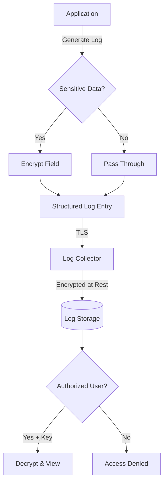
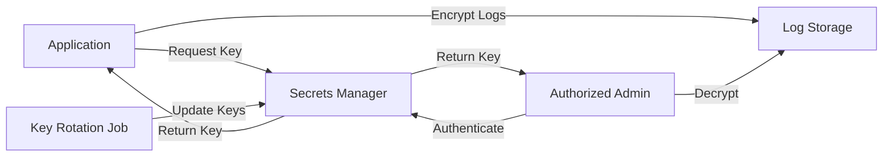

# How to Implement Log Encryption

Author: [nawazdhandala](https://github.com/nawazdhandala)

Tags: Logging, Encryption, Security, Compliance

Description: Learn to implement log encryption for protecting sensitive data in logs.

---

> Logs contain the story of your application. When that story includes sensitive data, encryption transforms logs from a security liability into a protected asset that satisfies compliance requirements while preserving debugging capability.

Modern applications generate logs containing user IDs, IP addresses, request payloads, and error details. Without encryption, this data sits exposed in log files, storage systems, and monitoring platforms. Regulations like GDPR, HIPAA, and PCI-DSS increasingly require protection of log data at rest and in transit. This guide walks through practical encryption strategies you can implement today.

---

## Why Encrypt Logs?

Log encryption serves three primary purposes:

- **Compliance**: Regulations mandate protection of personal and financial data, including data stored in logs
- **Breach containment**: If attackers access log storage, encrypted data remains unreadable without keys
- **Access control**: Encryption enables fine-grained access where only authorized personnel can read sensitive fields

The challenge is balancing security with usability. Over-encrypted logs become impossible to debug. Under-encrypted logs expose your users and organization to risk.

---

## Encryption Architecture Overview

Before writing code, understand where encryption fits in your logging pipeline. This diagram shows the key decision points.



You have three layers to consider:

1. **Field-level encryption**: Encrypt specific sensitive values before logging
2. **Transport encryption**: TLS between application and log collector
3. **Storage encryption**: Encrypt log files at rest in your storage system

Each layer protects against different threats. Field-level encryption protects data even from administrators with storage access. Transport encryption prevents network interception. Storage encryption protects against physical theft or cloud provider access.

---

## Field-Level Encryption Implementation

Field-level encryption gives you the most control. You decide exactly which data gets encrypted and who can decrypt it. This approach uses AES-256-GCM, which provides both confidentiality and integrity verification.

```typescript
// encryption/log-encryptor.ts - Field-level encryption for log entries
import { createCipheriv, createDecipheriv, randomBytes, scryptSync } from 'crypto';

// Configuration for encryption
const ALGORITHM = 'aes-256-gcm';    // AES in GCM mode for authenticated encryption
const IV_LENGTH = 16;                // 128-bit initialization vector
const AUTH_TAG_LENGTH = 16;          // GCM authentication tag
const SALT_LENGTH = 32;              // Salt for key derivation

export class LogEncryptor {
  private key: Buffer;

  constructor(password: string) {
    // Derive a 256-bit key from password using scrypt
    // In production, load this from a secrets manager
    const salt = process.env.ENCRYPTION_SALT || 'default-salt-change-me';
    this.key = scryptSync(password, salt, 32);
  }

  /**
   * Encrypt a single field value
   * Returns base64 string containing: IV + encrypted data + auth tag
   */
  encrypt(plaintext: string): string {
    // Generate random IV for each encryption operation
    const iv = randomBytes(IV_LENGTH);

    // Create cipher with key and IV
    const cipher = createCipheriv(ALGORITHM, this.key, iv, {
      authTagLength: AUTH_TAG_LENGTH
    });

    // Encrypt the plaintext
    const encrypted = Buffer.concat([
      cipher.update(plaintext, 'utf8'),
      cipher.final()
    ]);

    // Get authentication tag for integrity verification
    const authTag = cipher.getAuthTag();

    // Combine IV + encrypted data + auth tag into single buffer
    const combined = Buffer.concat([iv, encrypted, authTag]);

    // Return as base64 for safe storage in logs
    return combined.toString('base64');
  }

  /**
   * Decrypt a previously encrypted field
   * Verifies integrity via GCM auth tag before returning plaintext
   */
  decrypt(encryptedBase64: string): string {
    const combined = Buffer.from(encryptedBase64, 'base64');

    // Extract components from combined buffer
    const iv = combined.subarray(0, IV_LENGTH);
    const authTag = combined.subarray(combined.length - AUTH_TAG_LENGTH);
    const encrypted = combined.subarray(IV_LENGTH, combined.length - AUTH_TAG_LENGTH);

    // Create decipher with extracted IV
    const decipher = createDecipheriv(ALGORITHM, this.key, iv, {
      authTagLength: AUTH_TAG_LENGTH
    });

    // Set auth tag for integrity verification
    decipher.setAuthTag(authTag);

    // Decrypt and return plaintext
    const decrypted = Buffer.concat([
      decipher.update(encrypted),
      decipher.final()
    ]);

    return decrypted.toString('utf8');
  }
}
```

This encryptor handles individual field values. Next, integrate it with your logging framework to automatically encrypt sensitive fields.

```typescript
// encryption/secure-logger.ts - Logger wrapper with automatic field encryption
import winston from 'winston';
import { LogEncryptor } from './log-encryptor';

// Fields that should always be encrypted in logs
const SENSITIVE_FIELDS = [
  'email',
  'ssn',
  'credit_card',
  'password',
  'api_key',
  'ip_address',
  'phone_number'
];

export class SecureLogger {
  private logger: winston.Logger;
  private encryptor: LogEncryptor;

  constructor(encryptionKey: string) {
    this.encryptor = new LogEncryptor(encryptionKey);

    this.logger = winston.createLogger({
      level: process.env.LOG_LEVEL || 'info',
      format: winston.format.combine(
        winston.format.timestamp(),
        winston.format.json()
      ),
      transports: [
        new winston.transports.Console(),
        new winston.transports.File({ filename: 'app.log' })
      ]
    });
  }

  /**
   * Recursively encrypt sensitive fields in an object
   * Preserves structure while protecting values
   */
  private encryptSensitiveFields(obj: Record<string, any>): Record<string, any> {
    const result: Record<string, any> = {};

    for (const [key, value] of Object.entries(obj)) {
      if (value === null || value === undefined) {
        result[key] = value;
        continue;
      }

      // Check if this field name matches a sensitive pattern
      const isSensitive = SENSITIVE_FIELDS.some(field =>
        key.toLowerCase().includes(field.toLowerCase())
      );

      if (isSensitive && typeof value === 'string') {
        // Encrypt sensitive string values
        result[key] = `ENC:${this.encryptor.encrypt(value)}`;
      } else if (typeof value === 'object' && !Array.isArray(value)) {
        // Recursively process nested objects
        result[key] = this.encryptSensitiveFields(value);
      } else if (Array.isArray(value)) {
        // Process arrays, encrypting sensitive items
        result[key] = value.map(item =>
          typeof item === 'object' ? this.encryptSensitiveFields(item) : item
        );
      } else {
        // Pass through non-sensitive values unchanged
        result[key] = value;
      }
    }

    return result;
  }

  /**
   * Log with automatic encryption of sensitive fields
   */
  info(message: string, metadata: Record<string, any> = {}): void {
    const encryptedMetadata = this.encryptSensitiveFields(metadata);
    this.logger.info(message, encryptedMetadata);
  }

  warn(message: string, metadata: Record<string, any> = {}): void {
    const encryptedMetadata = this.encryptSensitiveFields(metadata);
    this.logger.warn(message, encryptedMetadata);
  }

  error(message: string, metadata: Record<string, any> = {}): void {
    const encryptedMetadata = this.encryptSensitiveFields(metadata);
    this.logger.error(message, encryptedMetadata);
  }
}
```

Usage in your application code becomes straightforward.

```typescript
// Example usage in application code
const logger = new SecureLogger(process.env.LOG_ENCRYPTION_KEY!);

// Sensitive fields are automatically encrypted
logger.info('User login successful', {
  user_id: 'usr_12345',           // Not encrypted - not in sensitive list
  email: 'user@example.com',      // Encrypted automatically
  ip_address: '192.168.1.100',    // Encrypted automatically
  login_method: 'password'        // Not encrypted
});

// Output in logs:
// {
//   "message": "User login successful",
//   "user_id": "usr_12345",
//   "email": "ENC:base64encodedencrypteddata...",
//   "ip_address": "ENC:base64encodedencrypteddata...",
//   "login_method": "password",
//   "timestamp": "2026-01-30T10:30:00.000Z"
// }
```

---

## Key Management Strategies

Encryption is only as strong as your key management. Poor key handling undermines the entire system.



Never hardcode encryption keys. Use a secrets manager like AWS Secrets Manager, HashiCorp Vault, or Azure Key Vault.

```typescript
// encryption/key-manager.ts - Key management with rotation support
import { SecretsManagerClient, GetSecretValueCommand } from '@aws-sdk/client-secrets-manager';

export class KeyManager {
  private client: SecretsManagerClient;
  private keyCache: Map<string, { key: string; expires: number }> = new Map();
  private cacheTTL = 5 * 60 * 1000; // Cache keys for 5 minutes

  constructor(region: string = 'us-east-1') {
    this.client = new SecretsManagerClient({ region });
  }

  /**
   * Retrieve encryption key from secrets manager with caching
   * Caching reduces API calls while rotation support ensures security
   */
  async getKey(secretName: string): Promise<string> {
    // Check cache first
    const cached = this.keyCache.get(secretName);
    if (cached && cached.expires > Date.now()) {
      return cached.key;
    }

    // Fetch from secrets manager
    const command = new GetSecretValueCommand({ SecretId: secretName });
    const response = await this.client.send(command);

    if (!response.SecretString) {
      throw new Error(`Secret ${secretName} not found or empty`);
    }

    // Parse the secret (assuming JSON format with 'key' field)
    const secret = JSON.parse(response.SecretString);
    const key = secret.key;

    // Cache the key
    this.keyCache.set(secretName, {
      key,
      expires: Date.now() + this.cacheTTL
    });

    return key;
  }

  /**
   * Clear cache to force key refresh (call after rotation)
   */
  clearCache(): void {
    this.keyCache.clear();
  }
}
```

For key rotation, maintain multiple key versions. Tag encrypted data with the key version used.

```typescript
// Modified encrypt method with key versioning
encrypt(plaintext: string, keyVersion: number = 1): string {
  const iv = randomBytes(IV_LENGTH);
  const cipher = createCipheriv(ALGORITHM, this.key, iv, {
    authTagLength: AUTH_TAG_LENGTH
  });

  const encrypted = Buffer.concat([
    cipher.update(plaintext, 'utf8'),
    cipher.final()
  ]);

  const authTag = cipher.getAuthTag();

  // Prepend version byte to enable key rotation
  const versionByte = Buffer.from([keyVersion]);
  const combined = Buffer.concat([versionByte, iv, encrypted, authTag]);

  return combined.toString('base64');
}
```

---

## Transport Layer Security

Field encryption protects data content. Transport encryption protects data in transit. Configure your log shipper to use TLS when sending logs to collectors.

```yaml
# fluent-bit configuration with TLS
[OUTPUT]
    Name          forward
    Match         *
    Host          log-collector.internal
    Port          24224
    tls           on
    tls.verify    on
    tls.ca_file   /etc/ssl/certs/ca-certificates.crt
    tls.crt_file  /etc/ssl/certs/client.crt
    tls.key_file  /etc/ssl/private/client.key
```

For OpenTelemetry collectors, configure TLS in your exporter settings.

```yaml
# OpenTelemetry Collector config with TLS
exporters:
  otlp:
    endpoint: "logs.example.com:4317"
    tls:
      cert_file: /etc/otel/client.crt
      key_file: /etc/otel/client.key
      ca_file: /etc/otel/ca.crt
      insecure: false
```

---

## Storage Encryption at Rest

Your cloud provider likely offers storage encryption. Enable it as a baseline, but remember it only protects against physical theft or provider-level access.

For S3-based log storage, enable server-side encryption.

```typescript
// AWS S3 configuration for encrypted log storage
import { S3Client, PutObjectCommand } from '@aws-sdk/client-s3';

const s3Client = new S3Client({ region: 'us-east-1' });

async function uploadEncryptedLogs(logData: string, key: string): Promise<void> {
  const command = new PutObjectCommand({
    Bucket: 'secure-logs-bucket',
    Key: key,
    Body: logData,
    // Enable server-side encryption with AWS managed keys
    ServerSideEncryption: 'aws:kms',
    // Optionally specify your own KMS key
    SSEKMSKeyId: process.env.KMS_KEY_ID
  });

  await s3Client.send(command);
}
```

---

## Building a Decryption Tool

Encrypted logs need a way to decrypt them for debugging. Build a controlled access tool.

```typescript
// tools/log-decryptor.ts - CLI tool for authorized log decryption
import { LogEncryptor } from '../encryption/log-encryptor';
import { KeyManager } from '../encryption/key-manager';
import readline from 'readline';

async function decryptLogEntry(encryptedLog: string): Promise<void> {
  const keyManager = new KeyManager();

  // Require authentication before providing decryption key
  const key = await keyManager.getKey('log-encryption-key');
  const encryptor = new LogEncryptor(key);

  // Parse the log entry as JSON
  const logEntry = JSON.parse(encryptedLog);

  // Find and decrypt all encrypted fields
  const decrypted = decryptFields(logEntry, encryptor);

  console.log(JSON.stringify(decrypted, null, 2));
}

function decryptFields(obj: any, encryptor: LogEncryptor): any {
  if (typeof obj === 'string' && obj.startsWith('ENC:')) {
    // Decrypt the field value
    return encryptor.decrypt(obj.slice(4));
  }

  if (typeof obj === 'object' && obj !== null) {
    const result: any = Array.isArray(obj) ? [] : {};
    for (const [key, value] of Object.entries(obj)) {
      result[key] = decryptFields(value, encryptor);
    }
    return result;
  }

  return obj;
}

// CLI entry point
const rl = readline.createInterface({
  input: process.stdin,
  output: process.stdout
});

rl.question('Paste encrypted log entry: ', async (input) => {
  await decryptLogEntry(input);
  rl.close();
});
```

Wrap this tool with proper access controls. Audit every decryption request to maintain accountability.

---

## Best Practices Checklist

Before deploying log encryption, verify these items:

- [ ] Sensitive field list documented and reviewed by security team
- [ ] Encryption keys stored in secrets manager, never in code
- [ ] Key rotation procedure tested and documented
- [ ] TLS enabled for all log transport paths
- [ ] Storage encryption enabled at rest
- [ ] Decryption access limited to authorized personnel
- [ ] Decryption events logged for audit trail
- [ ] Recovery procedure documented for key loss scenarios
- [ ] Performance impact measured and acceptable

---

## Conclusion

Log encryption protects sensitive data throughout its lifecycle. Field-level encryption gives you precise control over what gets protected. Transport encryption secures data in motion. Storage encryption adds a final layer of defense at rest.

Start with identifying your sensitive fields and implementing field-level encryption. Add transport and storage encryption as additional layers. Build controlled decryption tools with audit logging. Together, these layers transform your logging system from a potential vulnerability into a security asset.

The investment pays off during security audits, compliance reviews, and the inevitable day when you need to prove that a data breach did not expose user information stored in your logs.

---

*Need help implementing secure logging with encryption? [OneUptime](https://oneuptime.com) provides enterprise-grade log management with built-in security controls, helping you maintain compliance while keeping full observability into your systems.*

**Related Reading:**

- [Keep PII Out of Your Telemetry: Sanitizing Logs, Traces, and Metrics](https://oneuptime.com/blog/post/2025-11-13-keep-pii-out-of-observability-telemetry/view)
- [How to Structure Logs Properly in OpenTelemetry](https://oneuptime.com/blog/post/2025-08-28-how-to-structure-logs-properly-in-opentelemetry/view)
