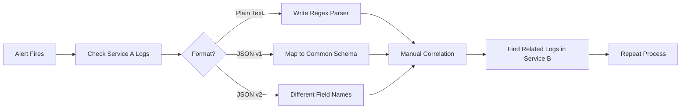
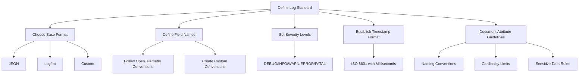
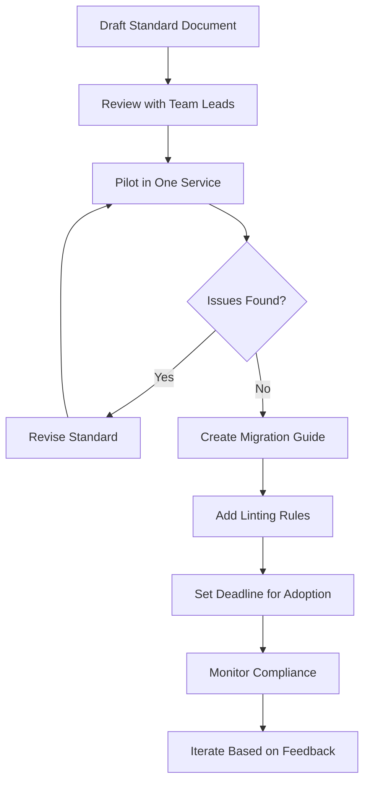

# How to Build Log Format Standards

Author: [nawazdhandala](https://github.com/nawazdhandala)

Tags: Logging, Standards, JSON, Observability

Description: Learn to build log format standards for consistent and parseable log output.

---

Every engineering team eventually faces the same problem: logs that look different depending on who wrote the code. One service outputs plain text. Another uses JSON but with inconsistent field names. A third timestamps everything in a format no parser understands. When an incident strikes, you spend precious minutes translating between formats instead of finding the root cause.

Log format standards solve this. They give your team a shared contract for how logs should look, what fields to include, and how to structure data. This guide walks you through building standards that work in practice.

---

## Why Log Format Standards Matter

Without standards, your logs become a tower of Babel. Consider what happens during a typical incident investigation.

The flow below shows how inconsistent logging creates friction when you need answers fast.



With standards, every log entry follows the same structure. You write one parser, build one dashboard, create one alert rule. Investigation time drops from hours to minutes.

---

## The Anatomy of a Good Log Format

A well-designed log format balances human readability with machine parseability. JSON has become the standard for structured logging because it handles both requirements.

Here is a baseline schema that covers most use cases.

```json
{
  "timestamp": "2026-01-30T14:23:45.123Z",
  "level": "ERROR",
  "service": "payment-api",
  "version": "2.4.1",
  "environment": "production",
  "message": "Payment processing failed",
  "trace_id": "abc123def456",
  "span_id": "789xyz",
  "attributes": {
    "user_id": "user_12345",
    "payment_id": "pay_67890",
    "amount_cents": 9999,
    "error_code": "CARD_DECLINED"
  }
}
```

Let's break down each field and why it matters.

**Required fields** should appear in every log entry.

```typescript
// required-fields.ts
// These fields must be present in every log entry for consistent querying

interface RequiredLogFields {
  // ISO 8601 format with milliseconds and timezone
  // Enables precise ordering and time-range queries
  timestamp: string;

  // Uppercase severity: DEBUG, INFO, WARN, ERROR, FATAL
  // Allows filtering by importance during incidents
  level: string;

  // Service name matching your deployment identifier
  // Groups logs by application in multi-service environments
  service: string;

  // Human-readable description of the event
  // Should be static text, not interpolated with variables
  message: string;
}
```

**Recommended fields** add context that accelerates debugging.

```typescript
// recommended-fields.ts
// Optional but highly valuable fields for production systems

interface RecommendedLogFields {
  // Semantic version of your deployed code
  // Correlates issues with specific releases
  version: string;

  // Deployment environment: development, staging, production
  // Prevents mixing test and production data
  environment: string;

  // OpenTelemetry trace and span identifiers
  // Links logs to distributed traces for request flow visibility
  trace_id?: string;
  span_id?: string;

  // Flexible key-value pairs for domain-specific data
  // Keep attribute names consistent across services
  attributes: Record<string, unknown>;
}
```

---

## Designing Your Standard

Start by documenting the decisions your team needs to make. The following diagram outlines the key choices.



### Naming Conventions for Attributes

Consistent naming prevents the "same data, different names" problem. Adopt these patterns.

```typescript
// naming-conventions.ts
// Examples of consistent attribute naming across services

// Use dot notation for hierarchical namespacing
const goodAttributeNames = {
  "user.id": "user_12345",           // User identifier
  "user.email": "user@example.com",  // User email (be careful with PII)
  "http.method": "POST",             // HTTP request method
  "http.status_code": 200,           // HTTP response status
  "http.url": "/api/v1/payments",    // Request path
  "db.system": "postgresql",         // Database type
  "db.operation": "SELECT",          // Query operation
  "db.duration_ms": 45,              // Query execution time
  "error.type": "ValidationError",   // Error class name
  "error.message": "Invalid input",  // Error description
};

// Avoid these anti-patterns
const badAttributeNames = {
  "userId": "user_12345",        // Inconsistent: use user.id
  "UserID": "user_12345",        // Inconsistent casing
  "user-id": "user_12345",       // Hyphens break some parsers
  "u_id": "user_12345",          // Unclear abbreviation
  "userIdentifier": "user_12345" // Verbose and inconsistent
};
```

### Severity Level Guidelines

Define what each level means for your organization. Ambiguity here leads to alert fatigue or missed issues.

```typescript
// severity-guidelines.ts
// Clear definitions prevent over-logging and under-logging

enum LogLevel {
  // Detailed information for development and troubleshooting
  // Never enable in production by default
  DEBUG = "DEBUG",

  // Normal operational messages
  // User actions, request completions, job starts
  INFO = "INFO",

  // Unexpected situations that don't break functionality
  // Deprecated API usage, retry attempts, slow queries
  WARN = "WARN",

  // Failures that affect a single request or operation
  // Payment declined, validation failed, external API error
  ERROR = "ERROR",

  // System-wide failures requiring immediate attention
  // Database unreachable, out of memory, disk full
  FATAL = "FATAL",
}
```

---

## Implementing the Standard

Theory becomes practice through code. Here is a TypeScript logger that enforces your standard.

```typescript
// standard-logger.ts
// A logger implementation that enforces format standards

import { createLogger, format, transports } from "winston";

interface LogAttributes {
  [key: string]: string | number | boolean | null;
}

interface StandardLogEntry {
  timestamp: string;
  level: string;
  service: string;
  version: string;
  environment: string;
  message: string;
  trace_id?: string;
  span_id?: string;
  attributes: LogAttributes;
}

// Configuration loaded from environment variables
const SERVICE_NAME = process.env.SERVICE_NAME || "unknown-service";
const SERVICE_VERSION = process.env.SERVICE_VERSION || "0.0.0";
const ENVIRONMENT = process.env.NODE_ENV || "development";

// Custom format that structures every log entry consistently
const standardFormat = format.printf((info) => {
  const entry: StandardLogEntry = {
    timestamp: new Date().toISOString(),
    level: info.level.toUpperCase(),
    service: SERVICE_NAME,
    version: SERVICE_VERSION,
    environment: ENVIRONMENT,
    message: info.message,
    trace_id: info.trace_id,
    span_id: info.span_id,
    attributes: info.attributes || {},
  };

  return JSON.stringify(entry);
});

// Create the logger with standard formatting
export const logger = createLogger({
  level: process.env.LOG_LEVEL || "info",
  format: standardFormat,
  transports: [new transports.Console()],
});

// Convenience methods that encourage proper attribute usage
export function logInfo(message: string, attributes: LogAttributes = {}) {
  logger.info({ message, attributes });
}

export function logError(
  message: string,
  error: Error,
  attributes: LogAttributes = {}
) {
  logger.error({
    message,
    attributes: {
      ...attributes,
      "error.type": error.name,
      "error.message": error.message,
      "error.stack": error.stack,
    },
  });
}
```

### Validation and Enforcement

Standards only work if they're enforced. Add validation to catch mistakes before they reach production.

```typescript
// log-validator.ts
// Runtime validation ensures logs meet the standard

interface ValidationResult {
  valid: boolean;
  errors: string[];
}

const REQUIRED_FIELDS = ["timestamp", "level", "service", "message"];
const VALID_LEVELS = ["DEBUG", "INFO", "WARN", "ERROR", "FATAL"];
const ISO_8601_REGEX = /^\d{4}-\d{2}-\d{2}T\d{2}:\d{2}:\d{2}.\d{3}Z$/;

export function validateLogEntry(entry: unknown): ValidationResult {
  const errors: string[] = [];

  if (typeof entry !== "object" || entry === null) {
    return { valid: false, errors: ["Log entry must be an object"] };
  }

  const log = entry as Record<string, unknown>;

  // Check required fields exist
  for (const field of REQUIRED_FIELDS) {
    if (!(field in log)) {
      errors.push(`Missing required field: ${field}`);
    }
  }

  // Validate timestamp format
  if (log.timestamp && !ISO_8601_REGEX.test(log.timestamp as string)) {
    errors.push("Timestamp must be ISO 8601 format with milliseconds");
  }

  // Validate severity level
  if (log.level && !VALID_LEVELS.includes(log.level as string)) {
    errors.push(`Invalid level: ${log.level}. Must be one of: ${VALID_LEVELS.join(", ")}`);
  }

  // Check attribute naming conventions
  if (log.attributes && typeof log.attributes === "object") {
    const attrs = log.attributes as Record<string, unknown>;
    for (const key of Object.keys(attrs)) {
      if (key.includes("-")) {
        errors.push(`Attribute "${key}" uses hyphens. Use dots or underscores.`);
      }
      if (key !== key.toLowerCase()) {
        errors.push(`Attribute "${key}" uses mixed case. Use lowercase.`);
      }
    }
  }

  return { valid: errors.length === 0, errors };
}
```

---

## Rolling Out Standards to Your Team

Adoption requires more than documentation. Follow this rollout process.



### Migration Example

When updating existing services, wrap the old logger with a compliant interface.

```typescript
// migration-wrapper.ts
// Wrap legacy loggers to comply with standards during migration

import { logger as legacyLogger } from "./old-logger";
import { logInfo, logError } from "./standard-logger";

// Deprecation wrapper that logs in both formats during transition
export function migratedLog(
  level: string,
  message: string,
  data: Record<string, unknown> = {}
) {
  // Log to new standard format
  if (level === "error") {
    logError(message, data.error as Error, data as Record<string, string | number | boolean | null>);
  } else {
    logInfo(message, data as Record<string, string | number | boolean | null>);
  }

  // Also log to legacy format during transition period
  // Remove this after full migration
  legacyLogger[level](message, data);
}
```

---

## Common Pitfalls and How to Avoid Them

**Pitfall 1: Message interpolation**

Don't embed variables in log messages. This creates thousands of unique strings that defeat log grouping.

```typescript
// Bad: interpolated message
logger.info(`User ${userId} logged in from ${ip}`);

// Good: static message with attributes
logger.info("User logged in", {
  attributes: { "user.id": userId, "client.ip": ip }
});
```

**Pitfall 2: Unbounded cardinality**

Avoid attributes with unlimited possible values like request IDs or timestamps in attribute names.

```typescript
// Bad: high cardinality attribute
{ "request_abc123_status": "success" }

// Good: bounded attribute with ID as value
{ "request.id": "abc123", "request.status": "success" }
```

**Pitfall 3: Sensitive data in logs**

Never log passwords, tokens, or unmasked PII. Add scrubbing to your logger.

```typescript
// scrub-sensitive.ts
// Remove sensitive data before logging

const SENSITIVE_PATTERNS = [
  /password/i,
  /secret/i,
  /token/i,
  /authorization/i,
  /credit.?card/i,
];

export function scrubAttributes(
  attrs: Record<string, unknown>
): Record<string, unknown> {
  const scrubbed: Record<string, unknown> = {};

  for (const [key, value] of Object.entries(attrs)) {
    const isSensitive = SENSITIVE_PATTERNS.some((pattern) => pattern.test(key));
    scrubbed[key] = isSensitive ? "[REDACTED]" : value;
  }

  return scrubbed;
}
```

---

## Measuring Success

Track these metrics to evaluate your logging standards.

- **Schema compliance rate**: Percentage of logs matching the standard (aim for 99%+)
- **Mean time to correlate**: How long it takes to link related logs during incidents
- **Query success rate**: Percentage of log queries that return useful results
- **Storage efficiency**: Bytes per log entry before and after standardization

---

## Conclusion

Log format standards transform debugging from archaeology into science. Start with a simple schema covering timestamp, level, service, message, and attributes. Enforce it through validation and linting. Roll it out gradually with migration wrappers. Monitor compliance and iterate.

The investment pays dividends every time you investigate an incident. Instead of wrestling with format differences, you focus on finding the root cause.

Your future self, paged at 3 AM, will thank you.

---

*OneUptime provides native support for structured logs with OpenTelemetry integration. Ingest logs in any format, query with consistent schemas, and correlate with traces and metrics. Start building better observability at [oneuptime.com](https://oneuptime.com).*

**Related Reading:**

- [How to Structure Logs Properly in OpenTelemetry](https://oneuptime.com/blog/post/2025-08-28-how-to-structure-logs-properly-in-opentelemetry/view)
- [Logs, Metrics & Traces: Turning Three Noisy Streams into One Story](https://oneuptime.com/blog/post/2025-08-20-three-pillars-of-observability-logs-metrics-traces/view)
- [Keep PII Out of Observability Telemetry](https://oneuptime.com/blog/post/2025-11-13-keep-pii-out-of-observability-telemetry/view)
