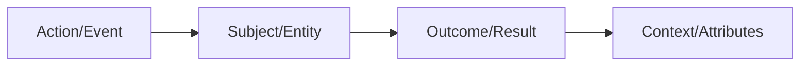
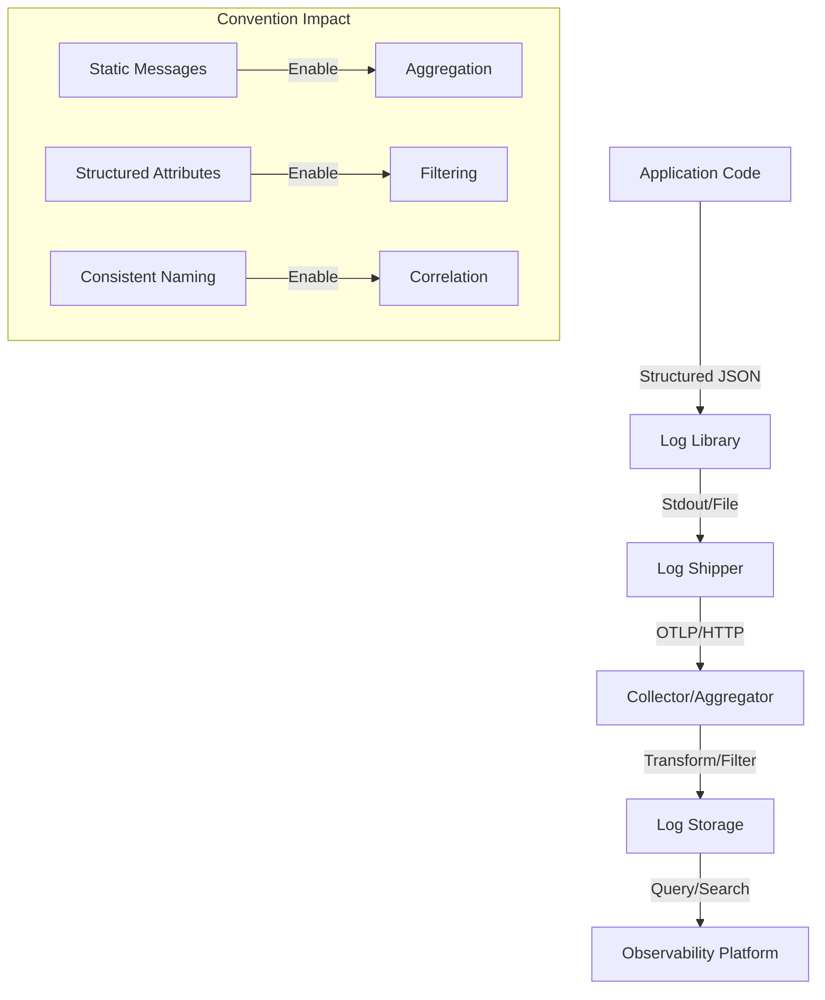

# How to Build Log Message Conventions

Author: [nawazdhandala](https://github.com/nawazdhandala)

Tags: Logging, Conventions, Observability, Best Practices

Description: A practical guide to building log message conventions that make debugging faster, alerting smarter, and your codebase more maintainable.

---

> Your logs are only as useful as the conventions behind them. Without standards, you get noise. With standards, you get answers.

Every team has experienced the 3 AM incident where you're grepping through gigabytes of logs trying to find the needle in the haystack. The log you need exists somewhere, but the message says "Error occurred" with no context about what failed, why it failed, or what you should do about it.

Log message conventions solve this. They transform logs from random debug statements into a structured, searchable, actionable knowledge base about your system's behavior.

---

## Why Log Conventions Matter

Without conventions, logs become a liability:

- Different developers write messages in different styles
- Critical context is missing when you need it most
- Searching for patterns requires knowing every variation of how something was logged
- Alert rules break because message formats change unexpectedly
- Onboarding new team members takes longer because there's no consistency to learn

With conventions, logs become an asset:

- Every team member writes logs that follow the same patterns
- Context is always present, always in the same place
- Searching and alerting becomes predictable
- New developers can read any log and understand it immediately

---

## The Anatomy of a Good Log Message

A well-structured log message has four components:



**Action**: What operation was attempted (created, updated, deleted, fetched, validated, processed)

**Subject**: What entity or resource was involved (user, order, payment, file, request)

**Outcome**: What happened (succeeded, failed, skipped, retried)

**Context**: Structured attributes that provide the "why" and "who" (IDs, durations, error codes)

---

## Message Structure Conventions

### Convention 1: Lead with the Action

Start every log message with the verb describing what happened. This makes logs scannable and filterable.

```typescript
// Bad: Passive, unclear what happened
logger.info("User data");
logger.error("Something went wrong");
logger.info("Payment");

// Good: Active voice, clear action
logger.info("Created user account", { userId: "usr_123" });
logger.error("Failed to process payment", { orderId: "ord_456", reason: "insufficient_funds" });
logger.info("Validated payment method", { paymentMethodId: "pm_789" });
```

### Convention 2: Use Consistent Verb Tenses

Pick past tense for completed actions. Stay consistent across your entire codebase.

```typescript
// Bad: Mixed tenses
logger.info("Creating user...");
logger.info("User created");
logger.info("Will send email");

// Good: Consistent past tense for completed actions
logger.info("Started user creation", { email: user.email });
logger.info("Created user", { userId: user.id });
logger.info("Sent welcome email", { userId: user.id, emailType: "welcome" });
```

### Convention 3: Keep Messages Static, Put Variables in Attributes

Never interpolate variables into the message string. This breaks log aggregation and makes searching harder.

```typescript
// Bad: Dynamic messages
logger.info(`User ${userId} logged in from ${ipAddress}`);
logger.error(`Failed to charge $${amount} to card ending in ${lastFour}`);

// Good: Static message, structured attributes
logger.info("User logged in", {
  userId: userId,
  ipAddress: ipAddress,
  loginMethod: "password"
});

logger.error("Failed to charge payment", {
  amount: amount,
  currency: "USD",
  cardLastFour: lastFour,
  errorCode: "card_declined"
});
```

Why does this matter? With static messages, you can:

- Group all "User logged in" events regardless of which user
- Create alerts on message patterns without regex
- Build dashboards that count occurrences of specific events
- Search for the exact message string

---

## Including Context: The Right Attributes

Context turns a log from "something happened" into "here's exactly what happened and why."

### Required Context for Every Log

```typescript
interface BaseLogContext {
  // Correlation IDs for tracing
  traceId?: string;
  spanId?: string;
  requestId?: string;

  // Service identification
  service: string;
  environment: string;
  version: string;

  // Timing
  timestamp: string;
  durationMs?: number;
}
```

### Domain-Specific Context

Add context relevant to the operation being logged:

```typescript
// User operations
logger.info("Created user account", {
  userId: user.id,
  email: user.email,
  registrationSource: "organic",
  hasReferralCode: !!referralCode
});

// Payment operations
logger.info("Processed payment", {
  paymentId: payment.id,
  orderId: order.id,
  amount: payment.amount,
  currency: payment.currency,
  paymentMethod: "credit_card",
  processorResponseCode: response.code,
  durationMs: endTime - startTime
});

// API requests
logger.info("Handled API request", {
  method: req.method,
  path: req.path,
  statusCode: res.statusCode,
  durationMs: responseTime,
  userAgent: req.headers["user-agent"],
  clientIp: req.ip
});
```

---

## Writing Actionable Error Messages

Error logs need to answer three questions:

1. What failed?
2. Why did it fail?
3. What should I do about it?

### Bad Error Messages

```typescript
// Tells you nothing useful
logger.error("Error");
logger.error("Failed");
logger.error("Something went wrong");
logger.error("null");
logger.error(error.message); // Often just "undefined"
```

### Good Error Messages

```typescript
// What failed: Database connection
// Why: Connection timeout after 30 seconds
// What to do: Check if database is running, network connectivity
logger.error("Failed to connect to database", {
  host: dbConfig.host,
  port: dbConfig.port,
  timeoutMs: 30000,
  errorCode: "ETIMEDOUT",
  errorMessage: error.message,
  retryAttempt: 3,
  maxRetries: 5,
  suggestion: "Verify database is running and network allows connection"
});

// What failed: User authentication
// Why: Invalid credentials
// What to do: Normal user error, no action needed
logger.warn("Authentication failed", {
  email: attemptedEmail,
  failureReason: "invalid_password",
  attemptCount: loginAttempts,
  ipAddress: clientIp,
  suggestion: "Expected user error, monitor for brute force patterns"
});

// What failed: External API call
// Why: Rate limited by provider
// What to do: Back off and retry
logger.error("External API rate limited", {
  provider: "stripe",
  endpoint: "/v1/charges",
  retryAfterSeconds: response.headers["retry-after"],
  requestId: response.headers["x-request-id"],
  suggestion: "Implement exponential backoff, consider request batching"
});
```

---

## Log Processing Pipeline

Understanding how logs flow from your application to analysis helps you design better conventions:



At each stage, good conventions help:

- **Log Library**: Consistent format means consistent parsing
- **Shipper**: Known structure enables efficient compression
- **Collector**: Predictable attributes enable routing rules
- **Storage**: Indexed fields enable fast queries
- **Platform**: Standard conventions enable cross-service analysis

---

## Naming Conventions for Attributes

### Use Dot Notation for Namespacing

```typescript
// Bad: Flat, ambiguous names
{
  id: "123",
  name: "John",
  type: "premium",
  time: 1500
}

// Good: Namespaced, clear hierarchy
{
  "user.id": "usr_123",
  "user.name": "John",
  "subscription.type": "premium",
  "request.durationMs": 1500
}
```

### Follow Semantic Conventions

OpenTelemetry defines semantic conventions for common attributes. Use them:

```typescript
// HTTP attributes
{
  "http.method": "POST",
  "http.url": "/api/users",
  "http.status_code": 201,
  "http.request.body.size": 1024
}

// Database attributes
{
  "db.system": "postgresql",
  "db.name": "users",
  "db.operation": "INSERT",
  "db.statement": "INSERT INTO users...",
}

// Error attributes
{
  "error.type": "ValidationError",
  "error.message": "Email format invalid",
  "error.stack": "...",
}
```

### Maintain a Team Attribute Dictionary

Document your custom attributes so everyone uses the same names:

| Attribute | Type | Description | Example |
|-----------|------|-------------|---------|
| `user.id` | string | User identifier | `"usr_123abc"` |
| `order.id` | string | Order identifier | `"ord_456def"` |
| `payment.amount` | number | Amount in smallest unit | `9999` |
| `payment.currency` | string | ISO 4217 code | `"USD"` |
| `feature.flag` | string | Feature flag name | `"new_checkout"` |
| `experiment.variant` | string | A/B test variant | `"control"` |

---

## Log Levels: When to Use What

Define clear guidelines for when to use each level:

```typescript
// FATAL: System is unusable, immediate human intervention required
logger.fatal("Database connection pool exhausted", {
  activeConnections: pool.active,
  maxConnections: pool.max,
  queuedRequests: pool.queued
});

// ERROR: Operation failed, requires investigation
logger.error("Payment processing failed", {
  orderId: order.id,
  errorCode: "processor_declined",
  processorMessage: response.message
});

// WARN: Unexpected condition, system recovered but worth noting
logger.warn("Retry succeeded after temporary failure", {
  operation: "send_email",
  retryCount: 2,
  totalDurationMs: 3500
});

// INFO: Normal business operations, audit trail
logger.info("User completed checkout", {
  userId: user.id,
  orderId: order.id,
  orderTotal: order.total
});

// DEBUG: Detailed information for troubleshooting
logger.debug("Cache lookup result", {
  cacheKey: key,
  hit: !!value,
  ttlRemaining: ttl
});

// TRACE: Very detailed, usually disabled in production
logger.trace("Entering function", {
  functionName: "processOrder",
  arguments: { orderId }
});
```

---

## Implementing Conventions in Code

### Create a Wrapper Logger

Enforce conventions by wrapping your logging library:

```typescript
// logger.ts
import pino from 'pino';
import { trace, context } from '@opentelemetry/api';

const baseLogger = pino({
  level: process.env.LOG_LEVEL || 'info',
  formatters: {
    level: (label) => ({ level: label })
  }
});

interface LogContext {
  [key: string]: string | number | boolean | undefined;
}

function enrichWithTraceContext(ctx: LogContext): LogContext {
  const span = trace.getSpan(context.active());
  const spanContext = span?.spanContext();

  return {
    ...ctx,
    traceId: spanContext?.traceId,
    spanId: spanContext?.spanId,
    service: process.env.SERVICE_NAME,
    environment: process.env.NODE_ENV,
    version: process.env.APP_VERSION
  };
}

export const logger = {
  info: (message: string, ctx: LogContext = {}) => {
    baseLogger.info(enrichWithTraceContext(ctx), message);
  },

  warn: (message: string, ctx: LogContext = {}) => {
    baseLogger.warn(enrichWithTraceContext(ctx), message);
  },

  error: (message: string, ctx: LogContext = {}) => {
    baseLogger.error(enrichWithTraceContext(ctx), message);
  },

  debug: (message: string, ctx: LogContext = {}) => {
    baseLogger.debug(enrichWithTraceContext(ctx), message);
  }
};
```

### Create Domain-Specific Loggers

Build loggers for common operations in your domain:

```typescript
// loggers/payment.ts
import { logger } from './logger';

export const paymentLogger = {
  initiated: (payment: Payment) => {
    logger.info("Initiated payment processing", {
      "payment.id": payment.id,
      "payment.amount": payment.amount,
      "payment.currency": payment.currency,
      "payment.method": payment.method,
      "order.id": payment.orderId
    });
  },

  succeeded: (payment: Payment, durationMs: number) => {
    logger.info("Completed payment processing", {
      "payment.id": payment.id,
      "payment.amount": payment.amount,
      "payment.processorTransactionId": payment.transactionId,
      "payment.durationMs": durationMs
    });
  },

  failed: (payment: Payment, error: PaymentError) => {
    logger.error("Failed payment processing", {
      "payment.id": payment.id,
      "payment.amount": payment.amount,
      "error.code": error.code,
      "error.message": error.message,
      "error.processorCode": error.processorCode,
      "suggestion": getSuggestionForError(error.code)
    });
  }
};
```

---

## Common Anti-Patterns to Avoid

### 1. Log Spam in Loops

```typescript
// Bad: Logs for every item
for (const item of items) {
  logger.info("Processing item", { itemId: item.id });
  await processItem(item);
  logger.info("Processed item", { itemId: item.id });
}

// Good: Log batch summary
logger.info("Started batch processing", { itemCount: items.length });
const results = await Promise.all(items.map(processItem));
const failures = results.filter(r => !r.success);
logger.info("Completed batch processing", {
  total: items.length,
  succeeded: items.length - failures.length,
  failed: failures.length,
  failedIds: failures.map(f => f.id)
});
```

### 2. Logging Sensitive Data

```typescript
// Bad: Exposes PII and secrets
logger.info("User login", {
  email: user.email,
  password: user.password,  // Never log passwords
  ssn: user.ssn,           // Never log PII
  apiKey: config.apiKey    // Never log secrets
});

// Good: Log identifiers and safe metadata only
logger.info("User login", {
  userId: user.id,
  loginMethod: "password",
  hasMfa: user.mfaEnabled,
  ipCountry: geoip.country
});
```

### 3. Inconsistent Message Formats

```typescript
// Bad: Every developer writes differently
logger.info("user created successfully!");
logger.info("USER_CREATED");
logger.info("[UserService] A new user was created");
logger.info("Created: user 123");

// Good: Consistent format everywhere
logger.info("Created user", { userId: "123" });
```

### 4. Missing Error Context

```typescript
// Bad: Just the error message
try {
  await saveUser(user);
} catch (error) {
  logger.error(error.message);
}

// Good: Full context for debugging
try {
  await saveUser(user);
} catch (error) {
  logger.error("Failed to save user", {
    userId: user.id,
    email: user.email,
    errorType: error.constructor.name,
    errorMessage: error.message,
    errorStack: error.stack,
    dbOperation: "INSERT",
    dbTable: "users"
  });
}
```

---

## Enforcing Conventions

### Linting Rules

Add ESLint rules to catch common violations:

```javascript
// .eslintrc.js
module.exports = {
  rules: {
    // Ban console.log in favor of structured logger
    'no-console': 'error',

    // Custom rule: require static log messages
    'no-template-literals-in-logs': 'error'
  }
};
```

### Code Review Checklist

When reviewing PRs, check logs for:

- [ ] Static message strings (no interpolation)
- [ ] Appropriate log level for the event
- [ ] Required context attributes present
- [ ] No sensitive data in attributes
- [ ] Consistent with existing naming conventions
- [ ] Error logs include error type, message, and suggestion

### Documentation

Maintain a logging guide in your team wiki:

1. Message format standards
2. Attribute naming dictionary
3. Log level definitions with examples
4. Common patterns for your domain
5. Anti-patterns to avoid

---

## Summary

Building log message conventions is about making your future debugging self's life easier. The principles are straightforward:

1. **Static messages**: Keep the message string constant, put variables in attributes
2. **Consistent structure**: Action + Subject + Outcome + Context
3. **Rich attributes**: Include everything needed to understand the event
4. **Actionable errors**: Answer what failed, why, and what to do
5. **Team alignment**: Document conventions and enforce through tooling

Start simple. Pick one service, define five core conventions, and enforce them. Expand from there. In a few months, you'll have a codebase where any developer can read any log and understand exactly what happened.

> The best log is one you never have to read twice to understand.

---

**Related Reading:**

- [How to Structure Logs Properly in OpenTelemetry](https://oneuptime.com/blog/post/2025-08-28-how-to-structure-logs-properly-in-opentelemetry/view)
- [Logs, Metrics & Traces: Turning Three Noisy Streams into One Story](https://oneuptime.com/blog/post/2025-08-20-three-pillars-of-observability-logs-metrics-traces/view)
- [How to Reduce Noise in OpenTelemetry](https://oneuptime.com/blog/post/2025-08-25-how-to-reduce-noise-in-opentelemetry/view)
