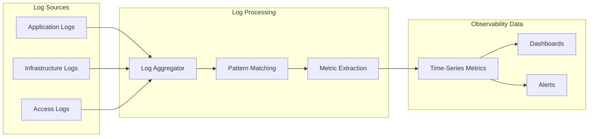
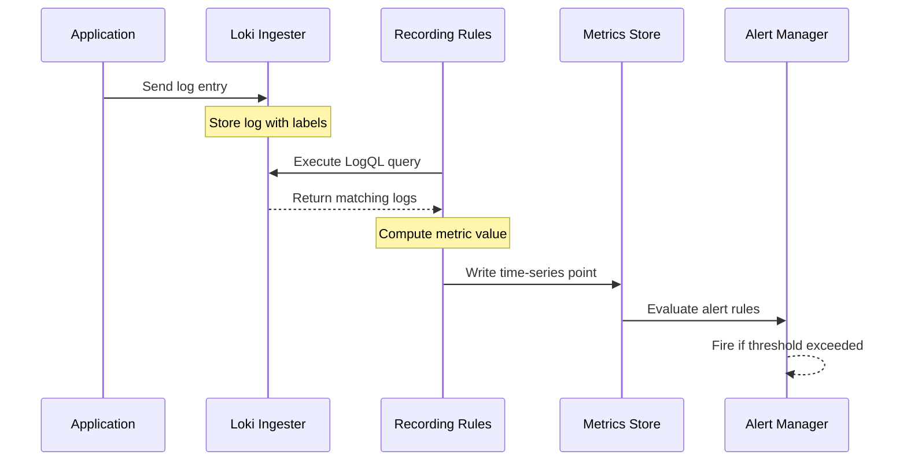
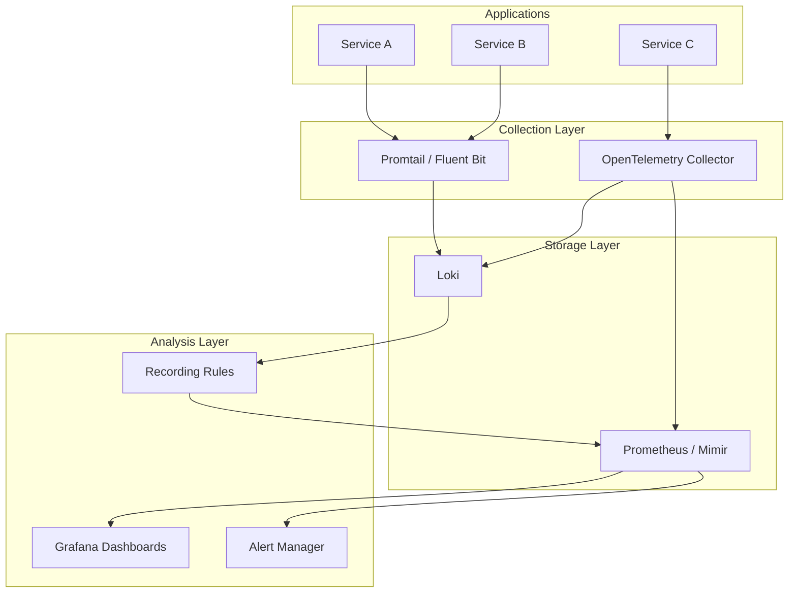

# How to Create Log Metrics Generation

Author: [nawazdhandala](https://github.com/nawazdhandala)

Tags: Logging, Metrics, Observability, Loki

Description: Learn to create log metrics generation for deriving metrics from log data.

---

Logs contain a wealth of information that often goes untapped. Every error message, status code, and response time recorded in your logs can become a metric you track over time. Log metrics generation bridges this gap by extracting structured numerical data from your log streams, giving you time-series insights without deploying additional instrumentation.

This guide walks through implementing log metrics generation using Grafana Loki and the OpenTelemetry Collector, with practical examples you can adapt to your infrastructure.

---

## Why Generate Metrics from Logs

Traditional metrics instrumentation requires adding code to your application. You define counters, histograms, and gauges, then update them at runtime. This approach works well for planned metrics but falls short when you need insights from data already flowing through your logs.

The following diagram shows how log metrics generation fits into your observability pipeline.



Log metrics generation enables you to derive counters from error frequencies, histograms from response times embedded in log messages, and gauges from status indicators. All without touching application code.

---

## Core Concepts

Before implementing log metrics generation, understanding these foundational concepts helps you design effective extraction rules.

| Concept | Description | Example |
|---------|-------------|---------|
| Log Pattern | A regular expression or structured query that matches specific log entries | `level="error" service="api"` |
| Metric Type | The kind of metric to generate: counter, gauge, or histogram | Counter for error counts |
| Label Extraction | Pulling dimensional data from log fields to create metric labels | `method`, `status_code`, `endpoint` |
| Aggregation Window | The time period over which log entries are grouped for metric calculation | 1 minute, 5 minutes |

The key insight is that logs already contain the raw data. Log metrics generation simply transforms that data into a format suitable for time-series analysis.

---

## Setting Up Loki Recording Rules

Grafana Loki provides recording rules that evaluate LogQL queries at regular intervals and store the results as metrics. This is one of the most efficient approaches for log metrics generation.

Start by defining a recording rule configuration file. Recording rules run on a schedule and persist their results to a Prometheus-compatible metrics store.

```yaml
# loki-rules.yaml
# Recording rules for generating metrics from logs

groups:
  - name: application_metrics
    interval: 1m
    rules:
      # Count errors per service over 5-minute windows
      - record: log:errors:rate5m
        expr: |
          sum by (service, level) (
            rate({job="application"} | logfmt | level="error" [5m])
          )
        labels:
          source: "log_metrics"

      # Track request duration from structured logs
      - record: log:request_duration:p99
        expr: |
          quantile_over_time(0.99,
            {job="application"}
            | json
            | unwrap duration_ms [5m]
          ) by (service, endpoint)
        labels:
          source: "log_metrics"

      # Count HTTP status codes from access logs
      - record: log:http_requests:rate5m
        expr: |
          sum by (status_code, method) (
            rate(
              {job="nginx"}
              | pattern `<ip> - - [<timestamp>] "<method> <path> <_>" <status_code> <_>`
              [5m]
            )
          )
        labels:
          source: "log_metrics"
```

Each rule specifies an expression that queries your logs, extracts relevant fields, and computes a metric value. The `record` field names the resulting metric, which you can then query in Grafana or use for alerting.

---

## Processing Flow for Log Metrics

The following diagram illustrates how a log entry transforms into a metric data point.



Recording rules evaluate at configured intervals, transforming batches of log entries into single metric data points. This aggregation reduces storage requirements while preserving the insights you need.

---

## OpenTelemetry Collector Approach

The OpenTelemetry Collector offers another path for log metrics generation. Using the transform processor and metrics connector, you can convert log entries into metrics as they flow through your pipeline.

This configuration demonstrates extracting metrics from JSON-formatted application logs.

```yaml
# otel-collector-config.yaml
# OpenTelemetry Collector configuration for log metrics generation

receivers:
  filelog:
    include:
      - /var/log/app/*.log
    operators:
      # Parse JSON log entries
      - type: json_parser
        parse_from: body
        timestamp:
          parse_from: attributes.timestamp
          layout: '%Y-%m-%dT%H:%M:%S.%LZ'

processors:
  # Transform logs to prepare for metric extraction
  transform/logs:
    log_statements:
      - context: log
        statements:
          # Extract duration as a numeric attribute
          - set(attributes["duration_ms"], Double(attributes["duration"]))
          # Normalize service names
          - set(attributes["service"], attributes["service_name"])

connectors:
  # Convert logs to metrics
  count:
    logs:
      # Count log entries by level and service
      error_logs_total:
        description: "Total error logs by service"
        conditions:
          - attributes["level"] == "error"
        attributes:
          - key: service
          - key: error_type

      # Count requests by endpoint and status
      http_requests_total:
        description: "HTTP requests from logs"
        attributes:
          - key: method
          - key: endpoint
          - key: status_code

exporters:
  prometheus:
    endpoint: "0.0.0.0:8889"
    namespace: "log_metrics"

  otlp:
    endpoint: "https://oneuptime.com/otlp"
    headers:
      x-oneuptime-token: ${ONEUPTIME_TOKEN}

service:
  pipelines:
    logs:
      receivers: [filelog]
      processors: [transform/logs]
      exporters: [count]

    metrics:
      receivers: [count]
      exporters: [prometheus, otlp]
```

The connector bridges the logs and metrics pipelines. Log entries matching specified conditions increment counters, and dimensional attributes become metric labels.

---

## Extracting Histograms from Log Data

Response times and other duration values logged as fields can become histogram metrics. This provides percentile calculations without instrumenting your application.

The following LogQL query extracts duration values and computes percentiles.

```logql
# Extract p50, p90, p99 response times from JSON logs
# Run as a recording rule or ad-hoc query

# P50 response time by endpoint
quantile_over_time(0.50,
  {job="api-gateway"}
  | json
  | __error__=""
  | unwrap response_time_ms [5m]
) by (endpoint)

# P99 response time by endpoint
quantile_over_time(0.99,
  {job="api-gateway"}
  | json
  | __error__=""
  | unwrap response_time_ms [5m]
) by (endpoint)
```

The `unwrap` operation converts a log field into a sample value, enabling mathematical operations like percentile calculations.

---

## Log Metrics Architecture

A complete log metrics generation setup typically involves multiple components working together. The following diagram shows a production-ready architecture.



Logs flow from applications through collectors into Loki. Recording rules evaluate queries against Loki and write the resulting metrics to Prometheus or Mimir. Dashboards and alerts then consume these derived metrics alongside your direct instrumentation.

---

## Practical Example: Error Rate Dashboard

Here is a complete example that generates an error rate metric from application logs and creates an alert when errors spike.

First, configure the recording rule to track error rates.

```yaml
# rules/error-metrics.yaml
groups:
  - name: error_tracking
    interval: 30s
    rules:
      # Error rate per service (errors per second)
      - record: log:error_rate:1m
        expr: |
          sum by (service, error_type) (
            rate(
              {job="application"}
              | json
              | level="error"
              [1m]
            )
          )

      # Error ratio compared to total logs
      - record: log:error_ratio:5m
        expr: |
          sum by (service) (
            rate({job="application"} | json | level="error" [5m])
          )
          /
          sum by (service) (
            rate({job="application"} | json [5m])
          )
```

Next, create an alerting rule that fires when the error ratio exceeds a threshold.

```yaml
# alerts/error-alerts.yaml
groups:
  - name: log_metric_alerts
    rules:
      - alert: HighErrorRate
        expr: log:error_ratio:5m > 0.05
        for: 5m
        labels:
          severity: warning
        annotations:
          summary: "High error rate detected for {{ $labels.service }}"
          description: "Error ratio is {{ $value | humanizePercentage }} over the last 5 minutes"

      - alert: ErrorSpike
        expr: |
          log:error_rate:1m > 10
          and
          log:error_rate:1m > 3 * avg_over_time(log:error_rate:1m[1h])
        for: 2m
        labels:
          severity: critical
        annotations:
          summary: "Error spike in {{ $labels.service }}"
          description: "Current error rate {{ $value }}/s is 3x above hourly average"
```

---

## Best Practices

When implementing log metrics generation, keep these guidelines in mind.

**Control cardinality carefully.** Extracting high-cardinality fields like user IDs or request IDs as metric labels will explode your metrics storage. Stick to bounded dimensions like service names, endpoints, and status codes.

**Use appropriate aggregation windows.** Short windows (30 seconds to 1 minute) provide responsiveness but increase compute load. Longer windows (5 minutes) smooth out noise but delay detection.

**Validate log formats.** Log metrics generation depends on consistent log structure. Enforce schemas at the application level and use parsing operators that handle malformed entries gracefully.

**Monitor the metrics pipeline.** Track recording rule evaluation time, error rates, and lag. A broken recording rule silently stops producing metrics, leaving gaps in your observability.

---

## Summary

Log metrics generation transforms your existing log data into actionable time-series metrics. The key implementation approaches are:

1. Loki recording rules for LogQL-based metric extraction
2. OpenTelemetry Collector connectors for inline transformation
3. Pattern matching and field unwrapping for structured data extraction
4. Careful label selection to control cardinality

By deriving metrics from logs, you gain insights into system behavior without additional application instrumentation. Errors that were buried in log files become visible trends on dashboards. Response times scattered across log entries become percentile histograms you can alert on.

Start with a single high-value metric, validate the extraction logic, and expand your recording rules as you identify additional insights hiding in your logs.

---

**Related Reading:**

- [Logs, Metrics and Traces: The Three Pillars of Observability](https://oneuptime.com/blog/post/2025-08-20-three-pillars-of-observability-logs-metrics-traces/view)
- [How to Structure Logs Properly in OpenTelemetry](https://oneuptime.com/blog/post/2025-08-28-how-to-structure-logs-properly-in-opentelemetry/view)
- [What is the OpenTelemetry Collector and Why Use One](https://oneuptime.com/blog/post/2025-09-18-what-is-opentelemetry-collector-and-why-use-one/view)
