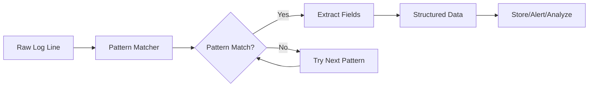
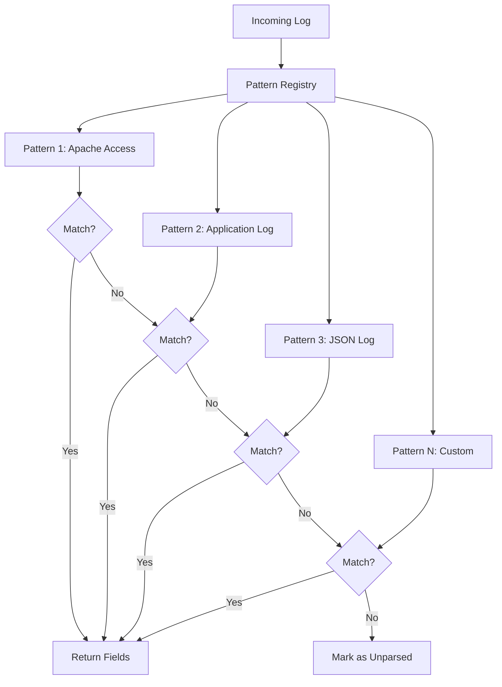
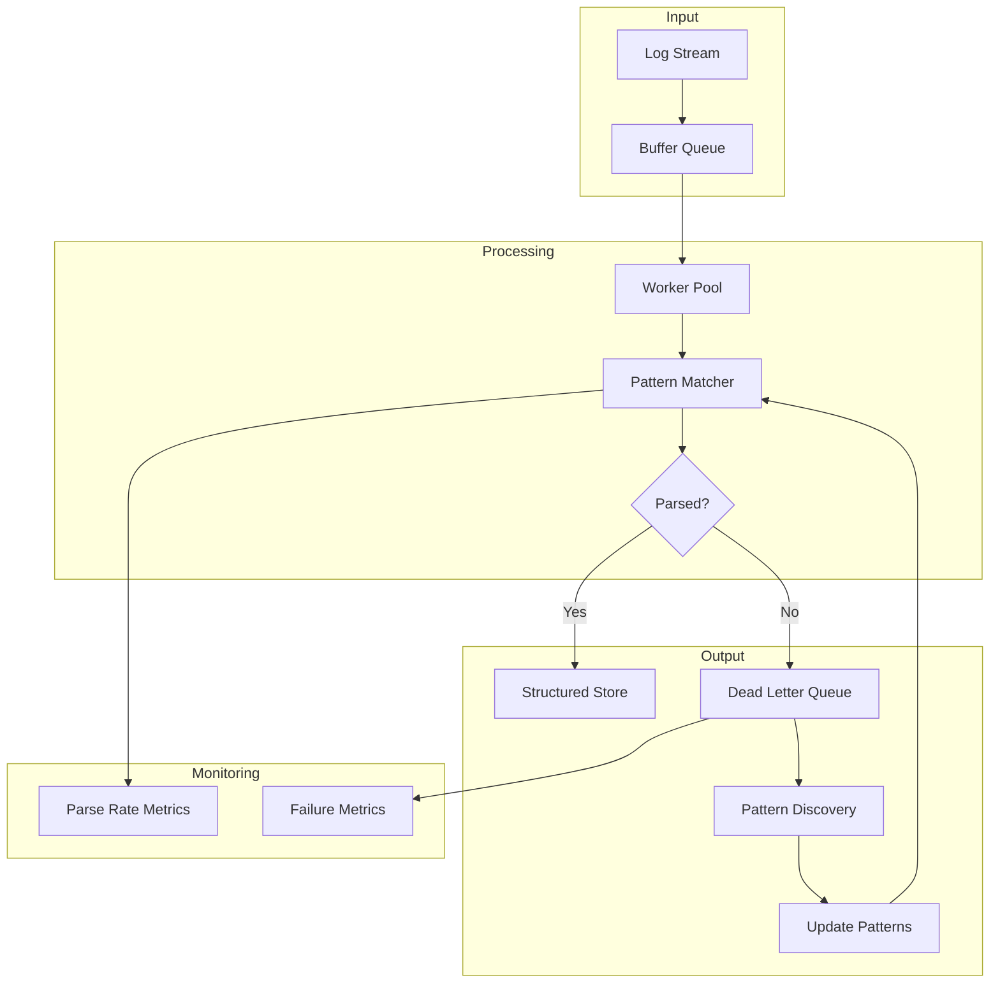

# How to Implement Log Pattern Matching

Author: [nawazdhandala](https://github.com/nawazdhandala)

Tags: Logging, Pattern Matching, Regex, Parsing

Description: Learn to implement log pattern matching for extracting structured data from logs.

---

> Log pattern matching transforms unstructured log data into actionable insights. By defining patterns that match specific log formats, you can extract timestamps, severity levels, error codes, and custom fields from any log source.

Whether you are processing application logs, system events, or security audit trails, pattern matching provides the foundation for log analysis, alerting, and troubleshooting. This guide walks you through implementing pattern matching from basic regex patterns to production-ready parsing systems.

---

## Understanding Log Pattern Matching

Log pattern matching works by defining templates that describe the structure of your log lines. When a log entry arrives, the pattern matcher attempts to match it against known patterns and extracts named fields from the match.

Here is how the pattern matching flow works at a high level:



The process involves three main components: a pattern library containing your log formats, a matching engine that tests logs against patterns, and a field extractor that pulls named values from successful matches.

---

## Basic Pattern Matching with Regex

Regular expressions form the foundation of most log pattern matching systems. Start with a simple example that matches a standard log format.

This pattern matches a typical application log with timestamp, level, and message:

```python
import re
from datetime import datetime
from typing import Optional, Dict, Any

# Define a pattern for standard log format
# Example: "2026-01-30 14:23:45 INFO User login successful"
LOG_PATTERN = re.compile(
    r"(?P<timestamp>\d{4}-\d{2}-\d{2}\s\d{2}:\d{2}:\d{2})\s+"  # Capture timestamp
    r"(?P<level>DEBUG|INFO|WARN|ERROR|FATAL)\s+"                # Capture log level
    r"(?P<message>.*)"                                          # Capture everything else
)

def parse_log_line(line: str) -> Optional[Dict[str, Any]]:
    """Parse a single log line and extract fields.

    Args:
        line: Raw log line string

    Returns:
        Dictionary with extracted fields or None if no match
    """
    # Attempt to match the pattern against the input
    match = LOG_PATTERN.match(line.strip())

    if not match:
        return None

    # Extract named groups from the match
    result = match.groupdict()

    # Convert timestamp string to datetime object
    result["timestamp"] = datetime.strptime(
        result["timestamp"],
        "%Y-%m-%d %H:%M:%S"
    )

    return result

# Example usage
log_line = "2026-01-30 14:23:45 ERROR Database connection timeout"
parsed = parse_log_line(log_line)
# Returns: {'timestamp': datetime(2026, 1, 30, 14, 23, 45),
#           'level': 'ERROR',
#           'message': 'Database connection timeout'}
```

---

## Building a Multi-Pattern Matcher

Real applications generate logs in multiple formats. A pattern matcher should support multiple patterns and try them in order until one matches.

The following diagram shows how the multi-pattern matching process works:



Here is an implementation of a pattern registry that handles multiple log formats:

```python
import re
from dataclasses import dataclass
from typing import Optional, Dict, Any, List, Callable

@dataclass
class LogPattern:
    """Represents a named log pattern with optional post-processing."""
    name: str
    pattern: re.Pattern
    # Optional function to transform extracted fields
    transformer: Optional[Callable[[Dict], Dict]] = None

class PatternMatcher:
    """Match logs against multiple patterns in priority order."""

    def __init__(self):
        # Store patterns in order of priority
        self.patterns: List[LogPattern] = []

    def add_pattern(
        self,
        name: str,
        regex: str,
        transformer: Optional[Callable] = None
    ) -> None:
        """Register a new pattern with the matcher.

        Args:
            name: Identifier for this pattern type
            regex: Regular expression with named capture groups
            transformer: Optional function to post-process fields
        """
        compiled = re.compile(regex)
        self.patterns.append(LogPattern(name, compiled, transformer))

    def match(self, line: str) -> Optional[Dict[str, Any]]:
        """Try to match a log line against registered patterns.

        Args:
            line: Raw log line to parse

        Returns:
            Dictionary with pattern name and extracted fields,
            or None if no pattern matches
        """
        stripped = line.strip()

        # Try each pattern in registration order
        for log_pattern in self.patterns:
            match = log_pattern.pattern.match(stripped)

            if match:
                fields = match.groupdict()

                # Apply transformer if provided
                if log_pattern.transformer:
                    fields = log_pattern.transformer(fields)

                return {
                    "pattern": log_pattern.name,
                    "fields": fields
                }

        return None
```

---

## Common Log Format Patterns

Here are patterns for common log formats you will encounter. Each pattern uses named capture groups to extract specific fields.

```python
# Initialize the matcher
matcher = PatternMatcher()

# Apache/Nginx combined log format
# Example: 192.168.1.1 - - [30/Jan/2026:14:23:45 +0000] "GET /api/users HTTP/1.1" 200 1234
matcher.add_pattern(
    "apache_combined",
    r'(?P<ip>[\d.]+)\s+'
    r'(?P<identity>\S+)\s+'
    r'(?P<user>\S+)\s+'
    r'\[(?P<timestamp>[^\]]+)\]\s+'
    r'"(?P<method>\w+)\s+(?P<path>\S+)\s+(?P<protocol>[^"]+)"\s+'
    r'(?P<status>\d+)\s+'
    r'(?P<bytes>\d+)'
)

# Syslog format
# Example: Jan 30 14:23:45 webserver01 nginx[1234]: Connection closed
matcher.add_pattern(
    "syslog",
    r'(?P<timestamp>\w+\s+\d+\s+\d+:\d+:\d+)\s+'
    r'(?P<hostname>\S+)\s+'
    r'(?P<service>\w+)\[(?P<pid>\d+)\]:\s+'
    r'(?P<message>.*)'
)

# JSON structured logs
# These need special handling since regex alone is not ideal
matcher.add_pattern(
    "json_log",
    r'(?P<json>\{.*\})',
    transformer=lambda f: json.loads(f["json"])
)

# Application error with stack trace indicator
# Example: 2026-01-30 14:23:45 ERROR [UserService] NullPointerException: user is null
matcher.add_pattern(
    "app_error",
    r'(?P<timestamp>\d{4}-\d{2}-\d{2}\s+\d{2}:\d{2}:\d{2})\s+'
    r'(?P<level>ERROR|FATAL)\s+'
    r'\[(?P<component>\w+)\]\s+'
    r'(?P<exception>\w+):\s+'
    r'(?P<message>.*)'
)
```

---

## Handling Complex Patterns with Grok

For complex log parsing scenarios, Grok patterns provide a higher-level abstraction. Grok uses named pattern aliases that make regex more readable and reusable.

```python
from typing import Dict
import re

class GrokParser:
    """Grok-style pattern matching using named pattern aliases."""

    # Built-in pattern definitions
    BASE_PATTERNS: Dict[str, str] = {
        "INT": r"\d+",
        "NUMBER": r"[\d.]+",
        "WORD": r"\w+",
        "IP": r"\d{1,3}\.\d{1,3}\.\d{1,3}\.\d{1,3}",
        "TIMESTAMP_ISO": r"\d{4}-\d{2}-\d{2}T\d{2}:\d{2}:\d{2}",
        "LOGLEVEL": r"DEBUG|INFO|WARN|ERROR|FATAL",
        "GREEDYDATA": r".*",
        "NOTSPACE": r"\S+",
        "QUOTEDSTRING": r'"[^"]*"',
        "UUID": r"[a-fA-F0-9]{8}-[a-fA-F0-9]{4}-[a-fA-F0-9]{4}-[a-fA-F0-9]{4}-[a-fA-F0-9]{12}"
    }

    def __init__(self):
        self.patterns = self.BASE_PATTERNS.copy()

    def add_pattern(self, name: str, pattern: str) -> None:
        """Add a custom pattern alias."""
        self.patterns[name] = pattern

    def compile(self, grok_pattern: str) -> re.Pattern:
        """Convert Grok pattern to compiled regex.

        Grok syntax: %{PATTERN_NAME:field_name}
        Example: %{IP:client_ip} %{WORD:method}
        """
        # Replace each %{PATTERN:name} with named capture group
        def replace_grok(match):
            pattern_name = match.group(1)
            field_name = match.group(2) if match.group(2) else pattern_name.lower()

            if pattern_name not in self.patterns:
                raise ValueError(f"Unknown pattern: {pattern_name}")

            return f"(?P<{field_name}>{self.patterns[pattern_name]})"

        # Match %{PATTERN} or %{PATTERN:name} syntax
        regex = re.sub(
            r"%\{(\w+)(?::(\w+))?\}",
            replace_grok,
            grok_pattern
        )

        return re.compile(regex)

# Example usage
parser = GrokParser()

# Define pattern using Grok syntax
pattern = parser.compile(
    "%{TIMESTAMP_ISO:timestamp} %{LOGLEVEL:level} \[%{WORD:service}\] %{GREEDYDATA:message}"
)

log = "2026-01-30T14:23:45 ERROR [PaymentService] Transaction failed: insufficient funds"
match = pattern.match(log)
# Extracts: timestamp, level, service, message
```

---

## Architecture for Production Log Parsing

A production log pattern matching system needs to handle high throughput and gracefully manage unparseable logs. Here is the recommended architecture:



Here is a production-ready implementation with batching and metrics:

```python
import time
from collections import defaultdict
from concurrent.futures import ThreadPoolExecutor
from typing import List, Dict, Any, Optional
from dataclasses import dataclass, field

@dataclass
class ParseMetrics:
    """Track parsing performance and success rates."""
    total_lines: int = 0
    parsed_lines: int = 0
    failed_lines: int = 0
    pattern_hits: Dict[str, int] = field(default_factory=lambda: defaultdict(int))
    parse_time_ms: float = 0.0

class ProductionLogParser:
    """High-throughput log parser with batching and metrics."""

    def __init__(
        self,
        matcher: PatternMatcher,
        batch_size: int = 1000,
        workers: int = 4
    ):
        self.matcher = matcher
        self.batch_size = batch_size
        self.executor = ThreadPoolExecutor(max_workers=workers)
        self.metrics = ParseMetrics()

    def parse_batch(self, lines: List[str]) -> List[Dict[str, Any]]:
        """Parse a batch of log lines in parallel.

        Args:
            lines: List of raw log lines

        Returns:
            List of parsed results with metadata
        """
        start_time = time.time()
        results = []

        # Submit all lines for parallel processing
        futures = [
            self.executor.submit(self._parse_single, line)
            for line in lines
        ]

        # Collect results
        for future, original_line in zip(futures, lines):
            result = future.result()

            if result:
                results.append(result)
                self.metrics.parsed_lines += 1
                self.metrics.pattern_hits[result["pattern"]] += 1
            else:
                # Store unparsed lines for later analysis
                results.append({
                    "pattern": "_unparsed",
                    "fields": {"raw": original_line}
                })
                self.metrics.failed_lines += 1

        self.metrics.total_lines += len(lines)
        self.metrics.parse_time_ms += (time.time() - start_time) * 1000

        return results

    def _parse_single(self, line: str) -> Optional[Dict[str, Any]]:
        """Parse a single line with error handling."""
        try:
            return self.matcher.match(line)
        except Exception:
            return None

    def get_metrics(self) -> Dict[str, Any]:
        """Return current parsing metrics."""
        success_rate = (
            self.metrics.parsed_lines / self.metrics.total_lines * 100
            if self.metrics.total_lines > 0 else 0
        )

        return {
            "total_lines": self.metrics.total_lines,
            "success_rate": f"{success_rate:.2f}%",
            "avg_parse_time_ms": (
                self.metrics.parse_time_ms / self.metrics.total_lines
                if self.metrics.total_lines > 0 else 0
            ),
            "pattern_distribution": dict(self.metrics.pattern_hits)
        }
```

---

## Testing Your Patterns

Always test patterns against real log samples before deploying. Create a test suite that validates extraction accuracy.

```python
import unittest

class TestLogPatterns(unittest.TestCase):
    """Test suite for log pattern validation."""

    def setUp(self):
        self.matcher = PatternMatcher()
        # Register patterns here

    def test_apache_log_parsing(self):
        """Verify Apache combined format extraction."""
        log = '192.168.1.100 - admin [30/Jan/2026:14:23:45 +0000] "POST /api/login HTTP/1.1" 200 512'
        result = self.matcher.match(log)

        self.assertIsNotNone(result)
        self.assertEqual(result["fields"]["ip"], "192.168.1.100")
        self.assertEqual(result["fields"]["method"], "POST")
        self.assertEqual(result["fields"]["status"], "200")

    def test_handles_malformed_logs(self):
        """Verify graceful handling of unparseable input."""
        result = self.matcher.match("not a valid log line")
        self.assertIsNone(result)
```

---

## Conclusion

Log pattern matching transforms raw text into structured, queryable data. Start with simple regex patterns for your most common log formats, then expand to multi-pattern matching as your needs grow. For complex scenarios, consider Grok-style abstractions that make patterns more maintainable.

Key takeaways:

- Use named capture groups to extract fields directly into dictionaries
- Implement a pattern registry to handle multiple log formats
- Track parse metrics to identify gaps in your pattern coverage
- Test patterns against real log samples before production deployment

With a solid pattern matching foundation, you can build alerting rules, search interfaces, and analytics dashboards that turn log data into actionable insights.

---

*Need powerful log management with built-in pattern matching? [OneUptime](https://oneuptime.com) provides log aggregation, search, and alerting with automatic field extraction. Start your free trial today.*

**Related Reading:**
- [How to Instrument Python Applications with OpenTelemetry](https://oneuptime.com/blog/post/2025-01-06-instrument-python-opentelemetry/view)
- [Three Pillars of Observability: Logs, Metrics, Traces](https://oneuptime.com/blog/post/2025-08-20-three-pillars-of-observability-logs-metrics-traces/view)
