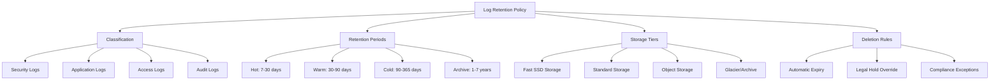
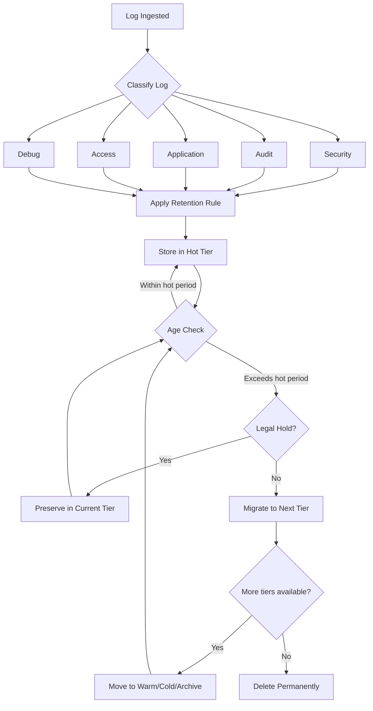

# How to Create Log Retention Policies Details

Author: [nawazdhandala](https://github.com/nawazdhandala)

Tags: Logging, Retention, Compliance, Storage

Description: Learn to create log retention policies for compliance and cost-effective storage management.

---

Log retention policies determine how long your organization keeps log data before archiving or deleting it. Without a clear strategy, you either drown in storage costs or lose critical data needed for incident investigations and compliance audits.

This guide walks through building log retention policies that balance regulatory requirements, operational needs, and infrastructure costs.

---

## Why Log Retention Policies Matter

Organizations often fall into two traps with log management.

The first trap is keeping everything forever. Storage costs grow linearly while the value of old logs declines exponentially. A log from three years ago rarely helps debug today's production incident.

The second trap is deleting too aggressively. When a security audit or legal hold arrives, missing logs create compliance violations and legal exposure.

A well-designed retention policy navigates between these extremes by matching retention periods to actual business and regulatory needs.

---

## Core Components of a Log Retention Policy

Every retention policy should address these four elements.



**Classification** groups logs by type and sensitivity. Security logs need different handling than debug logs.

**Retention Periods** define how long each class stays active. These periods should align with both operational needs and compliance requirements.

**Storage Tiers** move data from expensive fast storage to cheaper archival storage as it ages.

**Deletion Rules** automate cleanup while respecting legal holds and compliance exceptions.

---

## Compliance Requirements by Industry

Different regulations mandate specific retention periods. Here is a reference table for common frameworks.

| Regulation | Log Type | Minimum Retention | Notes |
|------------|----------|-------------------|-------|
| HIPAA | Access logs | 6 years | PHI access must be auditable |
| PCI-DSS | Security logs | 1 year | 3 months immediately available |
| SOX | Financial system logs | 7 years | Audit trail required |
| GDPR | Processing logs | Varies | Balance with data minimization |
| SOC 2 | Security events | 1 year | Access and change logs |

Your policy should meet the strictest applicable requirement. If you handle payment data (PCI-DSS) and health data (HIPAA), apply the 6-year HIPAA requirement to relevant logs.

---

## Designing Your Retention Tiers

The tiered approach below balances query performance against storage costs.

```mermaid
flowchart LR
    subgraph Hot["Hot Tier (7-30 days)"]
        H1[Fast queries]
        H2[Full indexing]
        H3[Real-time alerts]
    end

    subgraph Warm["Warm Tier (30-90 days)"]
        W1[Slower queries]
        W2[Partial indexing]
        W3[Investigation support]
    end

    subgraph Cold["Cold Tier (90-365 days)"]
        C1[Batch queries only]
        C2[Compressed storage]
        C3[Compliance retention]
    end

    subgraph Archive["Archive (1-7 years)"]
        A1[Restore on request]
        A2[Maximum compression]
        A3[Legal/regulatory hold]
    end

    Hot --> Warm --> Cold --> Archive
```



Each tier serves a different purpose. Hot storage handles active debugging and alerting. Warm storage supports incident post-mortems and trend analysis. Cold storage satisfies compliance queries. Archive storage addresses legal discovery and long-term audit requirements.

---

## Implementation Example: Python Log Manager

This Python class demonstrates automated log lifecycle management. It classifies incoming logs, applies retention rules, and manages tier transitions.

```python
from datetime import datetime, timedelta
from enum import Enum
from dataclasses import dataclass
from typing import Optional
import json

class LogCategory(Enum):
    """Classification categories for log retention."""
    SECURITY = "security"      # Auth, access control, threats
    AUDIT = "audit"            # User actions, data changes
    APPLICATION = "application" # App errors, debugging
    ACCESS = "access"          # HTTP requests, API calls
    DEBUG = "debug"            # Verbose debugging output

class StorageTier(Enum):
    """Storage tiers with decreasing cost and performance."""
    HOT = "hot"       # SSD, full indexing
    WARM = "warm"     # Standard disk, partial index
    COLD = "cold"     # Object storage, compressed
    ARCHIVE = "archive" # Glacier-class, restore delay

@dataclass
class RetentionRule:
    """Defines retention behavior for a log category."""
    category: LogCategory
    hot_days: int
    warm_days: int
    cold_days: int
    archive_years: int
    compress_after_days: int

class LogRetentionManager:
    """Manages log lifecycle based on retention policies."""

    def __init__(self):
        # Define retention rules per category
        self.rules = {
            LogCategory.SECURITY: RetentionRule(
                category=LogCategory.SECURITY,
                hot_days=30,
                warm_days=90,
                cold_days=365,
                archive_years=7,  # SOX compliance
                compress_after_days=7
            ),
            LogCategory.AUDIT: RetentionRule(
                category=LogCategory.AUDIT,
                hot_days=30,
                warm_days=90,
                cold_days=365,
                archive_years=6,  # HIPAA compliance
                compress_after_days=14
            ),
            LogCategory.APPLICATION: RetentionRule(
                category=LogCategory.APPLICATION,
                hot_days=7,
                warm_days=30,
                cold_days=90,
                archive_years=1,
                compress_after_days=3
            ),
            LogCategory.ACCESS: RetentionRule(
                category=LogCategory.ACCESS,
                hot_days=14,
                warm_days=60,
                cold_days=365,
                archive_years=1,  # PCI-DSS compliance
                compress_after_days=7
            ),
            LogCategory.DEBUG: RetentionRule(
                category=LogCategory.DEBUG,
                hot_days=3,
                warm_days=7,
                cold_days=0,  # No cold storage
                archive_years=0, # No archive
                compress_after_days=1
            )
        }
        # Track active legal holds
        self.legal_holds: set = set()

    def get_current_tier(
        self,
        category: LogCategory,
        log_timestamp: datetime
    ) -> Optional[StorageTier]:
        """Determine which storage tier a log belongs in."""
        rule = self.rules[category]
        age_days = (datetime.utcnow() - log_timestamp).days

        # Calculate tier boundaries
        hot_boundary = rule.hot_days
        warm_boundary = hot_boundary + rule.warm_days
        cold_boundary = warm_boundary + rule.cold_days
        archive_boundary = cold_boundary + (rule.archive_years * 365)

        if age_days <= hot_boundary:
            return StorageTier.HOT
        elif age_days <= warm_boundary:
            return StorageTier.WARM
        elif age_days <= cold_boundary:
            return StorageTier.COLD
        elif age_days <= archive_boundary:
            return StorageTier.ARCHIVE
        else:
            return None  # Eligible for deletion

    def should_delete(
        self,
        category: LogCategory,
        log_id: str,
        log_timestamp: datetime
    ) -> bool:
        """Check if a log should be deleted."""
        # Legal holds override retention rules
        if log_id in self.legal_holds:
            return False

        tier = self.get_current_tier(category, log_timestamp)
        return tier is None

    def add_legal_hold(self, log_ids: list[str]) -> None:
        """Place logs under legal hold to prevent deletion."""
        self.legal_holds.update(log_ids)

    def remove_legal_hold(self, log_ids: list[str]) -> None:
        """Release logs from legal hold."""
        self.legal_holds.difference_update(log_ids)

    def get_retention_summary(self) -> dict:
        """Generate a summary of retention policies."""
        summary = {}
        for category, rule in self.rules.items():
            total_days = (
                rule.hot_days +
                rule.warm_days +
                rule.cold_days +
                (rule.archive_years * 365)
            )
            summary[category.value] = {
                "total_retention_days": total_days,
                "hot_days": rule.hot_days,
                "warm_days": rule.warm_days,
                "cold_days": rule.cold_days,
                "archive_years": rule.archive_years
            }
        return summary
```

---

## Automated Tier Migration Script

This script handles the actual movement of logs between storage tiers. Run it as a daily cron job or scheduled task.

```python
from datetime import datetime
import logging

# Configure logging for the migration process
logging.basicConfig(
    level=logging.INFO,
    format='%(asctime)s - %(levelname)s - %(message)s'
)
logger = logging.getLogger(__name__)

class TierMigrationService:
    """Handles automated log migration between storage tiers."""

    def __init__(self, retention_manager: LogRetentionManager):
        self.retention_manager = retention_manager
        # Storage backend connections would be initialized here
        self.hot_storage = None   # Fast query storage
        self.warm_storage = None  # Standard storage
        self.cold_storage = None  # Object storage
        self.archive_storage = None  # Glacier-class storage

    def migrate_logs(self, dry_run: bool = False) -> dict:
        """Execute tier migration for all log categories."""
        results = {
            "migrated": 0,
            "deleted": 0,
            "errors": 0,
            "held": 0
        }

        for category in LogCategory:
            category_results = self._migrate_category(category, dry_run)
            for key in results:
                results[key] += category_results[key]

        logger.info(f"Migration complete: {results}")
        return results

    def _migrate_category(
        self,
        category: LogCategory,
        dry_run: bool
    ) -> dict:
        """Migrate logs for a single category."""
        results = {"migrated": 0, "deleted": 0, "errors": 0, "held": 0}

        # Query logs that may need migration
        # In production, this queries your actual log storage
        logs_to_process = self._get_logs_for_category(category)

        for log_entry in logs_to_process:
            log_id = log_entry["id"]
            log_timestamp = log_entry["timestamp"]
            current_tier = log_entry["tier"]

            # Determine target tier
            target_tier = self.retention_manager.get_current_tier(
                category,
                log_timestamp
            )

            # Check for deletion
            if self.retention_manager.should_delete(
                category,
                log_id,
                log_timestamp
            ):
                if not dry_run:
                    self._delete_log(log_id, current_tier)
                results["deleted"] += 1
                logger.debug(f"Deleted log {log_id}")
                continue

            # Check for legal hold
            if log_id in self.retention_manager.legal_holds:
                results["held"] += 1
                continue

            # Migrate if tier changed
            if target_tier and target_tier.value != current_tier:
                if not dry_run:
                    success = self._move_log(
                        log_id,
                        current_tier,
                        target_tier.value
                    )
                    if success:
                        results["migrated"] += 1
                    else:
                        results["errors"] += 1
                else:
                    results["migrated"] += 1

        return results

    def _get_logs_for_category(self, category: LogCategory) -> list:
        """Retrieve logs that may need migration."""
        # Placeholder for actual storage query
        # Returns list of {"id": str, "timestamp": datetime, "tier": str}
        return []

    def _delete_log(self, log_id: str, tier: str) -> bool:
        """Delete a log from its current tier."""
        # Implement deletion for each storage backend
        logger.info(f"Deleting log {log_id} from {tier}")
        return True

    def _move_log(
        self,
        log_id: str,
        source_tier: str,
        target_tier: str
    ) -> bool:
        """Move a log between storage tiers."""
        logger.info(f"Moving log {log_id}: {source_tier} -> {target_tier}")
        # Copy to target tier
        # Delete from source tier
        # Update metadata
        return True
```

---

## Policy Workflow Visualization

The following diagram shows how logs flow through the retention system from ingestion to deletion.



---

## Cost Optimization Strategies

Effective retention policies reduce storage costs significantly. Here are three strategies to implement.

**Compress aggressively after the hot tier.** Application logs compress at 10:1 ratios. A terabyte of raw logs becomes 100GB compressed.

**Use lifecycle rules in object storage.** Cloud providers offer automatic transitions. Configure S3 Lifecycle or GCS Object Lifecycle to move data automatically.

**Sample high-volume debug logs.** Keep 10% of debug logs rather than 100%. For most debugging scenarios, a statistical sample provides sufficient context.

The table below shows typical cost savings by tier.

| Tier | Storage Cost | Query Cost | Typical Savings |
|------|--------------|------------|-----------------|
| Hot | $0.10/GB/mo | Low | Baseline |
| Warm | $0.03/GB/mo | Medium | 70% reduction |
| Cold | $0.01/GB/mo | Higher | 90% reduction |
| Archive | $0.004/GB/mo | Restore fee | 96% reduction |

---

## Implementing in Your Environment

Follow these steps to deploy log retention policies in production.

**Step 1: Inventory your logs.** Catalog all log sources, their volume, and current storage locations.

**Step 2: Map compliance requirements.** Identify which regulations apply to your organization and which logs they affect.

**Step 3: Define retention periods.** Set periods that satisfy compliance while minimizing unnecessary storage.

**Step 4: Configure storage tiers.** Set up hot, warm, cold, and archive storage backends.

**Step 5: Deploy automation.** Implement scripts like the examples above to handle tier migration automatically.

**Step 6: Monitor and adjust.** Track storage costs and query patterns. Adjust retention periods based on actual usage.

---

## Common Mistakes to Avoid

**Treating all logs equally.** Debug logs and security logs have vastly different value and compliance requirements. Classify them accordingly.

**Ignoring legal holds.** A deletion job that ignores active legal holds creates serious liability. Always check for holds before deleting.

**Setting periods too short.** Post-incident investigations often need logs from weeks before the incident. Keep operational logs long enough to support root cause analysis.

**Manual processes.** Manual tier migration does not scale. Automate from day one.

---

## Summary

Log retention policies balance three competing concerns: operational needs, compliance requirements, and infrastructure costs. By classifying logs into categories, defining appropriate retention periods, implementing storage tiers, and automating lifecycle management, you build a system that keeps the right data for the right amount of time.

Start with compliance requirements as your baseline. Layer operational needs on top. Then optimize for cost through tiered storage and compression. The result is a log management strategy that supports debugging, satisfies auditors, and controls expenses.

---

*Need help implementing log retention policies? [OneUptime](https://oneuptime.com) provides built-in log management with configurable retention policies, automatic tiering, and compliance-ready storage options.*

**Related Reading:**

- [How to Structure Logs Properly in OpenTelemetry](https://oneuptime.com/blog/post/2025-08-28-how-to-structure-logs-properly-in-opentelemetry/view)
- [How to Reduce Noise in OpenTelemetry](https://oneuptime.com/blog/post/2025-08-25-how-to-reduce-noise-in-opentelemetry/view)
- [Three Pillars of Observability: Logs, Metrics, Traces](https://oneuptime.com/blog/post/2025-08-20-three-pillars-of-observability-logs-metrics-traces/view)
