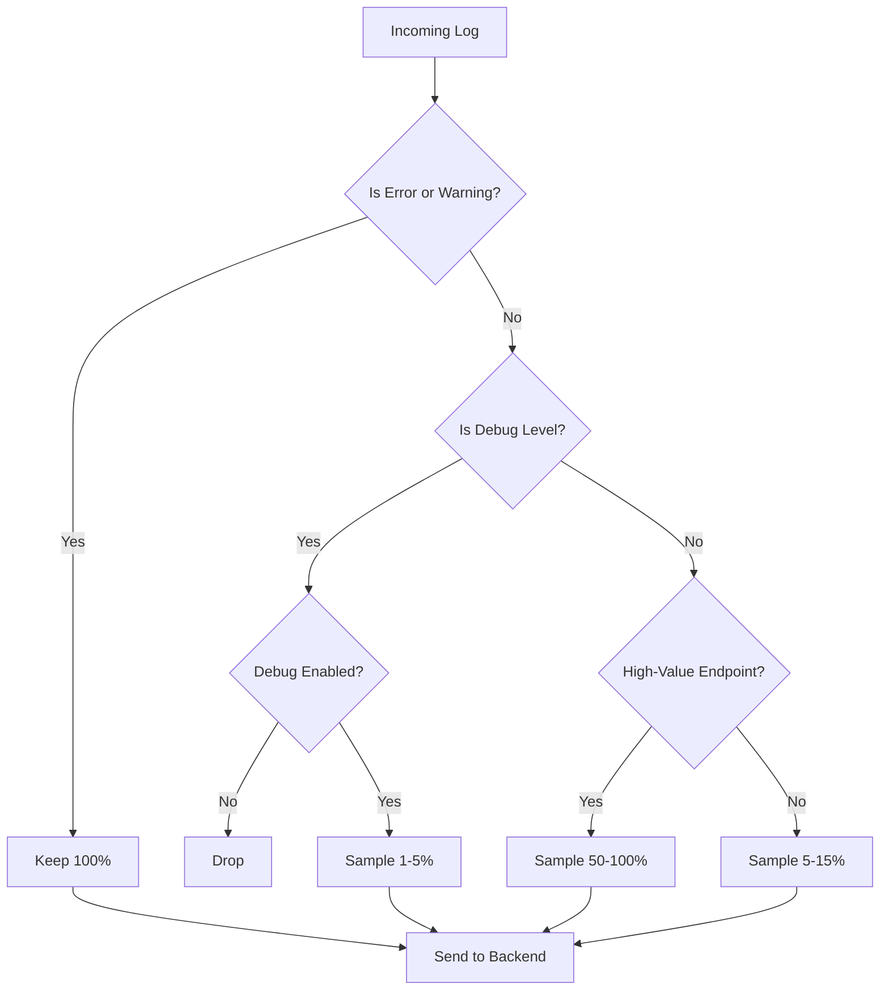
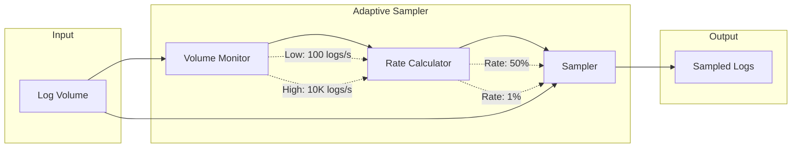

# How to Create Log Sampling Strategies

Author: [nawazdhandala](https://github.com/nawazdhandala)

Tags: Logging, Sampling, Cost, Performance

Description: Learn to create log sampling strategies for reducing log volume while maintaining visibility.

---

Log storage costs can spiral out of control quickly. A single microservice generating 10,000 requests per minute produces millions of log lines daily. Most of these logs are routine, repetitive, and never queried. The challenge is reducing volume without losing the critical data you need for debugging and incident response.

Log sampling lets you keep a representative subset of logs while ensuring important events are always captured. This guide walks through practical sampling strategies you can implement today.

---

## Why Sample Logs?

Before diving into strategies, consider what uncontrolled logging costs:

| Volume | Daily Storage | Monthly Cost (typical) |
|--------|---------------|------------------------|
| 10 GB/day | 10 GB | $50-150 |
| 100 GB/day | 100 GB | $500-1,500 |
| 1 TB/day | 1 TB | $5,000-15,000 |

Beyond cost, high log volume creates noise. Finding a needle in a haystack becomes harder when the haystack grows every second.

---

## Sampling Strategy Decision Flow

The following diagram shows how to route logs through different sampling policies based on their characteristics. Error logs bypass sampling entirely, while routine logs are sampled aggressively.



---

## Strategy 1: Level-Based Sampling

The simplest approach samples logs differently based on severity level. Errors and warnings are too valuable to lose, while debug and info logs can be sampled heavily.

This configuration demonstrates level-based sampling in an OpenTelemetry Collector. The filter processor drops debug logs entirely unless explicitly enabled, while the probabilistic sampler reduces info log volume.

```yaml
# otel-collector-config.yaml
processors:
  # Filter out debug logs in production
  filter/logs:
    logs:
      # Drop debug logs unless DEBUG_MODE is enabled
      exclude:
        match_type: strict
        severity_texts:
          - DEBUG
          - TRACE

  # Probabilistic sampling for remaining logs
  probabilistic_sampler:
    hash_seed: 42
    sampling_percentage: 10  # Keep 10% of info logs

service:
  pipelines:
    logs:
      receivers: [otlp]
      processors: [filter/logs, probabilistic_sampler]
      exporters: [otlphttp]
```

---

## Strategy 2: Content-Based Sampling

Some logs matter more than others regardless of level. A successful health check is noise; a failed payment is critical. Content-based sampling uses log attributes to make smarter decisions.

The following TypeScript implementation shows a sampler that makes decisions based on log content. It hashes the trace ID for consistent sampling and includes override rules for specific log types.

```typescript
// content-sampler.ts
import crypto from 'crypto';

interface LogRecord {
  level: string;
  message: string;
  attributes: Record<string, any>;
  traceId?: string;
}

interface SamplingRule {
  match: (log: LogRecord) => boolean;
  rate: number;  // 0.0 to 1.0
}

const samplingRules: SamplingRule[] = [
  // Always keep errors and warnings
  {
    match: (log) => ['error', 'warn'].includes(log.level.toLowerCase()),
    rate: 1.0
  },
  // Always keep payment-related logs
  {
    match: (log) => log.attributes['domain'] === 'payment',
    rate: 1.0
  },
  // Sample health checks aggressively
  {
    match: (log) => log.attributes['http.route'] === '/health',
    rate: 0.01  // Keep 1%
  },
  // Sample successful auth at 10%
  {
    match: (log) =>
      log.attributes['domain'] === 'auth' &&
      log.attributes['status'] === 'success',
    rate: 0.10
  },
  // Default: keep 15%
  {
    match: () => true,
    rate: 0.15
  }
];

export function shouldSampleLog(log: LogRecord): boolean {
  // Find first matching rule
  const rule = samplingRules.find(r => r.match(log));
  if (!rule) return true;

  // Use trace ID for consistent sampling within a trace
  // This ensures all logs from the same request are kept or dropped together
  const hashInput = log.traceId || `${log.message}-${Date.now()}`;
  const hash = crypto.createHash('md5').update(hashInput).digest();
  const hashValue = hash.readUInt32BE(0) / 0xffffffff;

  return hashValue < rule.rate;
}
```

---

## Strategy 3: Rate-Limited Sampling

When a system generates thousands of identical logs per second (think retry storms or cascading failures), you want to capture the pattern without storing every instance. Rate limiting caps logs per time window.

This implementation uses a sliding window to track log counts by message pattern. Once a pattern exceeds its limit, additional logs are dropped until the window resets.

```typescript
// rate-limiter.ts

interface RateBucket {
  count: number;
  windowStart: number;
}

class LogRateLimiter {
  private buckets: Map<string, RateBucket> = new Map();
  private windowMs: number;
  private maxPerWindow: number;

  constructor(windowMs = 60000, maxPerWindow = 100) {
    this.windowMs = windowMs;
    this.maxPerWindow = maxPerWindow;
  }

  // Generate a key that groups similar logs together
  private getKey(log: LogRecord): string {
    // Group by level, message template, and error type
    const template = log.message.replace(/\d+/g, 'N');  // Normalize numbers
    return `${log.level}:${template}:${log.attributes['error.type'] || ''}`;
  }

  shouldAllow(log: LogRecord): boolean {
    const key = this.getKey(log);
    const now = Date.now();

    let bucket = this.buckets.get(key);

    // Reset bucket if window expired
    if (!bucket || now - bucket.windowStart > this.windowMs) {
      bucket = { count: 0, windowStart: now };
      this.buckets.set(key, bucket);
    }

    bucket.count++;

    // Allow if under limit
    if (bucket.count <= this.maxPerWindow) {
      return true;
    }

    // Log suppression notice at threshold
    if (bucket.count === this.maxPerWindow + 1) {
      console.warn(`Rate limiting logs for pattern: ${key}`);
    }

    return false;
  }
}

// Usage with OpenTelemetry log processor
const rateLimiter = new LogRateLimiter(60000, 50);  // 50 per minute per pattern

export function processLog(log: LogRecord): LogRecord | null {
  if (!rateLimiter.shouldAllow(log)) {
    return null;  // Drop the log
  }
  return log;
}
```

---

## Strategy 4: Adaptive Sampling

Static sampling rates work until traffic patterns change. Adaptive sampling adjusts rates based on current volume, increasing sampling during quiet periods and reducing it during spikes.

The diagram below illustrates how adaptive sampling responds to traffic changes. During normal load, sampling stays high. As volume increases, the sampling rate decreases to maintain a stable output rate.



This adaptive sampler implementation tracks the incoming log rate and adjusts the sampling percentage to maintain a target throughput.

```typescript
// adaptive-sampler.ts

class AdaptiveSampler {
  private targetLogsPerSecond: number;
  private windowMs: number;
  private currentCount: number = 0;
  private windowStart: number = Date.now();
  private currentRate: number = 1.0;

  constructor(targetLogsPerSecond = 1000, windowMs = 5000) {
    this.targetLogsPerSecond = targetLogsPerSecond;
    this.windowMs = windowMs;
  }

  private updateRate(): void {
    const now = Date.now();
    const elapsed = now - this.windowStart;

    if (elapsed >= this.windowMs) {
      // Calculate actual rate
      const actualRate = (this.currentCount / elapsed) * 1000;

      // Adjust sampling rate to hit target
      // If getting 10K/s and target is 1K/s, rate should be 0.1
      if (actualRate > 0) {
        const desiredRate = this.targetLogsPerSecond / actualRate;
        // Smooth the adjustment to avoid oscillation
        this.currentRate = this.currentRate * 0.7 + desiredRate * 0.3;
        // Clamp between 1% and 100%
        this.currentRate = Math.max(0.01, Math.min(1.0, this.currentRate));
      }

      // Reset window
      this.currentCount = 0;
      this.windowStart = now;
    }
  }

  shouldSample(log: LogRecord): boolean {
    this.currentCount++;
    this.updateRate();

    // Always keep errors regardless of rate
    if (log.level.toLowerCase() === 'error') {
      return true;
    }

    // Apply adaptive rate
    return Math.random() < this.currentRate;
  }

  getCurrentRate(): number {
    return this.currentRate;
  }
}
```

---

## Strategy 5: Head and Tail Sampling Combined

Head sampling makes decisions at log creation time. Tail sampling waits until a request completes to decide. Combining both gives you efficiency with the ability to keep interesting traces.

The OpenTelemetry Collector configuration below demonstrates a combined approach. The head sampler reduces initial volume, while the tail sampler ensures errors and slow requests are captured.

```yaml
# Combined head and tail sampling
processors:
  # Head sampling: quick probabilistic decision
  probabilistic_sampler:
    sampling_percentage: 20

  # Tail sampling: keep interesting complete traces
  tail_sampling:
    decision_wait: 10s
    num_traces: 50000
    policies:
      # Always keep errors
      - name: errors-policy
        type: status_code
        status_code:
          status_codes: [ERROR]
      # Keep slow requests
      - name: latency-policy
        type: latency
        latency:
          threshold_ms: 1000
      # Keep specific endpoints
      - name: critical-endpoints
        type: string_attribute
        string_attribute:
          key: http.route
          values: ["/checkout", "/payment", "/signup"]
      # Probabilistic fallback
      - name: baseline
        type: probabilistic
        probabilistic:
          sampling_percentage: 5

service:
  pipelines:
    logs:
      receivers: [otlp]
      processors: [probabilistic_sampler, tail_sampling]
      exporters: [otlphttp]
```

---

## Implementation Checklist

Before deploying a sampling strategy, validate these requirements:

| Requirement | Check |
|-------------|-------|
| Errors are never dropped | Test with error injection |
| Sampling is trace-consistent | Verify all logs from one request are kept or dropped |
| Rate limits prevent storms | Simulate high-volume scenarios |
| Metrics track drop rates | Monitor sampling effectiveness |
| Configuration is tunable | No code changes to adjust rates |

---

## Measuring Sampling Effectiveness

Track these metrics to ensure your sampling strategy works:

```typescript
// sampling-metrics.ts
import { Counter, Gauge } from '@opentelemetry/api-metrics';

const logsReceived = meter.createCounter('logs.received.total', {
  description: 'Total logs received before sampling'
});

const logsSampled = meter.createCounter('logs.sampled.total', {
  description: 'Total logs kept after sampling'
});

const logsDropped = meter.createCounter('logs.dropped.total', {
  description: 'Total logs dropped by sampling'
});

const samplingRate = meter.createGauge('logs.sampling.rate', {
  description: 'Current effective sampling rate'
});

// Use in your sampler
function recordSamplingDecision(kept: boolean, log: LogRecord): void {
  logsReceived.add(1, { level: log.level });

  if (kept) {
    logsSampled.add(1, { level: log.level });
  } else {
    logsDropped.add(1, { level: log.level });
  }
}
```

---

## Common Pitfalls

Avoid these mistakes when implementing log sampling:

1. **Sampling errors** - Never drop error logs. They are the most valuable during incidents.

2. **Breaking trace correlation** - When sampling, keep all logs from a trace together. Partial traces are hard to debug.

3. **Static rates during incidents** - Consider disabling sampling during active incidents when you need full visibility.

4. **No visibility into drops** - Always track how many logs are being dropped and why.

5. **Over-aggressive initial rates** - Start conservative (keep more) and tune down based on data.

---

## Summary

Effective log sampling balances cost reduction with observability needs. The key principles are:

- **Keep all errors and warnings** - These are too valuable to sample
- **Sample aggressively on noise** - Health checks, successful auth, routine operations
- **Use trace IDs for consistency** - Keep or drop entire traces together
- **Adapt to traffic patterns** - Static rates fail during traffic spikes
- **Monitor your sampling** - Track drop rates and adjust based on data

Start with level-based sampling, add content rules for your domain, and consider adaptive sampling if you have variable traffic patterns. The goal is not to minimize logs but to maximize the signal-to-noise ratio in what you keep.

---

**Related Reading:**

- [How to reduce noise in OpenTelemetry](https://oneuptime.com/blog/post/2025-08-25-how-to-reduce-noise-in-opentelemetry/view)
- [How to Structure Logs Properly in OpenTelemetry](https://oneuptime.com/blog/post/2025-08-28-how-to-structure-logs-properly-in-opentelemetry/view)
- [What is OpenTelemetry Collector and Why Use One](https://oneuptime.com/blog/post/2025-09-18-what-is-opentelemetry-collector-and-why-use-one/view)
