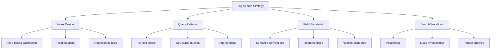
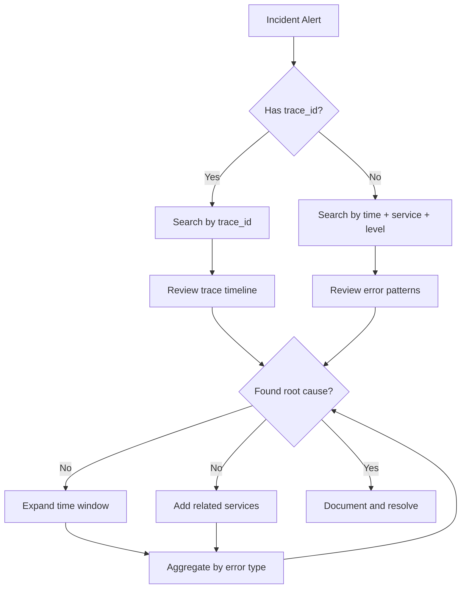
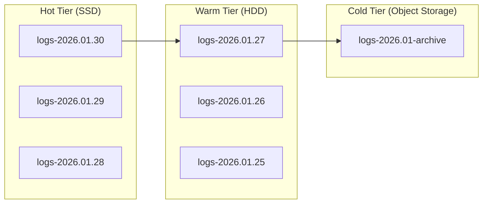

# How to Build Log Search Strategies

Author: [nawazdhandala](https://github.com/nawazdhandala)

Tags: Logging, Search, Elasticsearch, Queries

Description: Learn to build log search strategies for fast and accurate log querying.

---

Finding the right log entry in millions of records is like searching for a specific grain of sand on a beach. Without a solid search strategy, you waste precious minutes during incidents scrolling through irrelevant data while your system burns.

This guide covers practical techniques to build log search strategies that get you to the root cause faster. We will explore query patterns, index design, and search workflows that work across Elasticsearch, OpenSearch, and similar log management systems.

---

## The Problem With Ad-Hoc Searching

Most engineers approach log searching reactively. Something breaks, they open the log viewer, type in an error message, and hope for the best. This approach fails for several reasons.

First, you are fighting time pressure during incidents. Second, unstructured searches return thousands of results that require manual filtering. Third, without knowing what fields exist in your logs, you cannot write precise queries.

A search strategy solves these problems by establishing patterns before incidents occur. When the 3 AM page arrives, you already know how to find what you need.

---

## Core Components of a Log Search Strategy

A complete log search strategy includes four components that work together.



Each component builds on the others. Good field standards make query patterns simpler. Proper index design makes queries faster. Search workflows tie everything together into repeatable processes.

---

## Step 1: Establish Field Standards

Before writing a single query, define what fields your logs must contain. Without standard fields, every search requires guessing field names.

These required fields should appear in every log entry across all services.

```json
{
  "timestamp": "2026-01-30T14:23:45.123Z",
  "level": "error",
  "service": "payment-service",
  "trace_id": "abc123def456",
  "span_id": "789ghi",
  "message": "Payment processing failed",
  "error.type": "PaymentDeclinedException",
  "error.message": "Card declined by issuer",
  "user.id": "user_12345",
  "request.id": "req_67890",
  "environment": "production"
}
```

The naming follows OpenTelemetry semantic conventions. Using dot notation creates a hierarchy that log systems can parse into nested objects. This structure enables precise filtering.

Define a validation layer that rejects logs missing required fields.

```typescript
// log-validator.ts - Validates logs before shipping to storage
interface RequiredLogFields {
  timestamp: string;
  level: string;
  service: string;
  message: string;
}

// Validates that logs contain required fields before shipping
function validateLogEntry(log: Record<string, unknown>): boolean {
  const required: (keyof RequiredLogFields)[] = [
    'timestamp',
    'level',
    'service',
    'message'
  ];

  // Check each required field exists and is not empty
  for (const field of required) {
    if (!log[field] || log[field] === '') {
      console.warn(`Log missing required field: ${field}`);
      return false;
    }
  }

  return true;
}

// Enrich logs with standard fields before shipping
function enrichLog(
  log: Record<string, unknown>,
  context: { service: string; environment: string }
): Record<string, unknown> {
  return {
    timestamp: new Date().toISOString(),
    service: context.service,
    environment: context.environment,
    ...log
  };
}
```

---

## Step 2: Design Your Query Patterns

Different investigation scenarios require different query types. Build a library of query patterns that your team can reuse.

### Pattern 1: Time-Bounded Error Search

The most common search pattern looks for errors within a specific time window. Start with broad time ranges and narrow down.

```bash
# Elasticsearch query: Find all errors in payment-service in the last hour
# Uses bool query to combine multiple conditions
curl -X POST "localhost:9200/logs-*/_search" -H 'Content-Type: application/json' -d'
{
  "query": {
    "bool": {
      "must": [
        { "match": { "level": "error" } },
        { "match": { "service": "payment-service" } }
      ],
      "filter": [
        {
          "range": {
            "timestamp": {
              "gte": "now-1h",
              "lte": "now"
            }
          }
        }
      ]
    }
  },
  "sort": [{ "timestamp": "desc" }],
  "size": 100
}'
```

### Pattern 2: Trace Correlation Search

When you have a trace ID from an alert or another log, pull all related logs across services.

```bash
# Find all logs for a specific distributed trace
# This shows the complete request flow across microservices
curl -X POST "localhost:9200/logs-*/_search" -H 'Content-Type: application/json' -d'
{
  "query": {
    "term": {
      "trace_id": "abc123def456"
    }
  },
  "sort": [{ "timestamp": "asc" }],
  "size": 500
}'
```

### Pattern 3: Aggregation for Pattern Detection

Aggregations reveal patterns that individual log searches miss. Use them to find error clusters or anomalous behavior.

```bash
# Count errors by service and error type over the last 24 hours
# Reveals which services are failing and why
curl -X POST "localhost:9200/logs-*/_search" -H 'Content-Type: application/json' -d'
{
  "size": 0,
  "query": {
    "bool": {
      "must": [{ "match": { "level": "error" } }],
      "filter": [{ "range": { "timestamp": { "gte": "now-24h" } } }]
    }
  },
  "aggs": {
    "by_service": {
      "terms": { "field": "service", "size": 20 },
      "aggs": {
        "by_error_type": {
          "terms": { "field": "error.type", "size": 10 }
        }
      }
    }
  }
}'
```

---

## Step 3: Build Search Workflows

Query patterns become powerful when combined into workflows. A search workflow is a decision tree that guides investigation.



### Workflow 1: Initial Triage

When an alert fires, start with the triage workflow. The goal is not to find the root cause immediately but to understand the scope and impact.

```typescript
// triage-workflow.ts - Automated initial triage queries
interface TriageResult {
  errorCount: number;
  affectedServices: string[];
  firstOccurrence: string;
  lastOccurrence: string;
  topErrorTypes: Array<{ type: string; count: number }>;
}

// Runs initial triage queries to assess incident scope
async function runTriageWorkflow(
  client: ElasticsearchClient,
  timeWindow: string = '1h'
): Promise<TriageResult> {
  // Query 1: Get error counts and affected services
  const scopeQuery = await client.search({
    index: 'logs-*',
    body: {
      size: 0,
      query: {
        bool: {
          must: [{ match: { level: 'error' } }],
          filter: [{ range: { timestamp: { gte: `now-${timeWindow}` } } }]
        }
      },
      aggs: {
        affected_services: {
          terms: { field: 'service', size: 50 }
        },
        error_types: {
          terms: { field: 'error.type', size: 20 }
        },
        time_range: {
          stats: { field: 'timestamp' }
        }
      }
    }
  });

  // Parse aggregation results into structured triage report
  const aggs = scopeQuery.aggregations;
  return {
    errorCount: scopeQuery.hits.total.value,
    affectedServices: aggs.affected_services.buckets.map(b => b.key),
    firstOccurrence: aggs.time_range.min_as_string,
    lastOccurrence: aggs.time_range.max_as_string,
    topErrorTypes: aggs.error_types.buckets.map(b => ({
      type: b.key,
      count: b.doc_count
    }))
  };
}
```

### Workflow 2: Deep Investigation

After triage identifies the scope, deep investigation finds the root cause. This workflow focuses on a specific service and error type.

```typescript
// deep-investigation.ts - Detailed error analysis
interface InvestigationContext {
  service: string;
  errorType: string;
  timeStart: string;
  timeEnd: string;
}

// Retrieves detailed logs for root cause analysis
async function deepInvestigation(
  client: ElasticsearchClient,
  ctx: InvestigationContext
): Promise<LogEntry[]> {
  // Get full log entries with all fields for analysis
  const results = await client.search({
    index: 'logs-*',
    body: {
      query: {
        bool: {
          must: [
            { match: { service: ctx.service } },
            { match: { 'error.type': ctx.errorType } }
          ],
          filter: [{
            range: {
              timestamp: {
                gte: ctx.timeStart,
                lte: ctx.timeEnd
              }
            }
          }]
        }
      },
      sort: [{ timestamp: 'asc' }],
      size: 200,
      // Include all fields for detailed analysis
      _source: true
    }
  });

  return results.hits.hits.map(hit => hit._source);
}

// Find related logs from upstream/downstream services
async function findRelatedLogs(
  client: ElasticsearchClient,
  traceIds: string[]
): Promise<LogEntry[]> {
  const results = await client.search({
    index: 'logs-*',
    body: {
      query: {
        terms: { trace_id: traceIds }
      },
      sort: [{ timestamp: 'asc' }],
      size: 1000
    }
  });

  return results.hits.hits.map(hit => hit._source);
}
```

---

## Step 4: Optimize Index Design

Query patterns only work well if your index design supports them. Poor index design leads to slow queries and timeouts during incidents.

### Time-Based Partitioning

Partition logs by time to enable efficient time-range queries. Most searches look at recent data, so keep recent indices on faster storage.



### Field Mapping Configuration

Define explicit mappings for fields you search frequently. This prevents Elasticsearch from guessing wrong data types.

```json
{
  "mappings": {
    "properties": {
      "timestamp": { "type": "date" },
      "level": { "type": "keyword" },
      "service": { "type": "keyword" },
      "trace_id": { "type": "keyword" },
      "span_id": { "type": "keyword" },
      "message": { "type": "text" },
      "error": {
        "properties": {
          "type": { "type": "keyword" },
          "message": { "type": "text" },
          "stack": { "type": "text" }
        }
      },
      "user": {
        "properties": {
          "id": { "type": "keyword" }
        }
      },
      "request": {
        "properties": {
          "id": { "type": "keyword" },
          "method": { "type": "keyword" },
          "path": { "type": "keyword" }
        }
      }
    }
  }
}
```

Use `keyword` type for fields you filter or aggregate on. Use `text` type for fields you full-text search. Getting this wrong causes poor query performance.

---

## Step 5: Document and Train

A search strategy only works if your team knows how to use it. Create runbooks that document common search scenarios.

Each runbook should include the scenario description, the queries to run, how to interpret results, and next steps based on findings.

Store runbooks alongside your alert definitions. When an alert fires, the runbook link should be in the alert notification. This reduces time-to-diagnosis by eliminating the guesswork phase.

Run quarterly training sessions where team members practice search workflows using historical incidents. Repetition builds muscle memory that pays off during real incidents.

---

## Common Search Anti-Patterns

Avoid these patterns that slow down investigations.

**Searching without time bounds** scans entire indices. Always add time filters, even generous ones.

**Using wildcards at the start of terms** like `*Exception` prevents index usage. Restructure queries to avoid leading wildcards.

**Searching across too many indices** slows queries. Use index patterns that target relevant time ranges.

**Ignoring aggregations** means missing patterns. A single aggregation often reveals more than hundreds of individual log entries.

---

## Measuring Search Strategy Effectiveness

Track metrics to improve your search strategy over time.

Measure mean time from alert to root cause identification. This is your primary metric. Everything else supports reducing this number.

Track which query patterns your team uses most frequently. Optimize these patterns first.

Monitor query latency in your log system. Slow queries indicate index design problems or missing optimizations.

Review incident postmortems for search-related friction. If engineers report difficulty finding logs, investigate and fix the underlying issue.

---

## Final Thoughts

Building a log search strategy requires upfront investment that pays dividends during every incident. The time to develop these patterns is before the production fire, not during it.

Start with field standards. Add query patterns for common scenarios. Build workflows that connect patterns into investigation processes. Optimize your index design to support fast queries. Document everything and train your team.

When the next incident arrives, your prepared search strategy transforms a chaotic scramble into a systematic investigation.

---

*Need a log management platform that supports these search strategies out of the box? [OneUptime](https://oneuptime.com) provides powerful log search with full-text queries, field filtering, trace correlation, and aggregations. Combined with metrics and traces, you get complete observability for faster incident resolution.*

**Related Reading:**

- [How to Structure Logs Properly in OpenTelemetry](https://oneuptime.com/blog/post/2025-08-28-how-to-structure-logs-properly-in-opentelemetry/view)
- [How to Reduce Noise in OpenTelemetry](https://oneuptime.com/blog/post/2025-08-25-how-to-reduce-noise-in-opentelemetry/view)
- [Logs, Metrics and Traces: The Three Pillars of Observability](https://oneuptime.com/blog/post/2025-08-20-three-pillars-of-observability-logs-metrics-traces/view)
