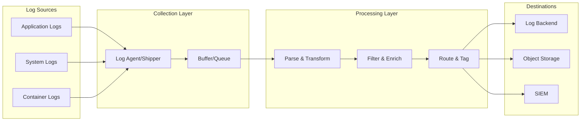
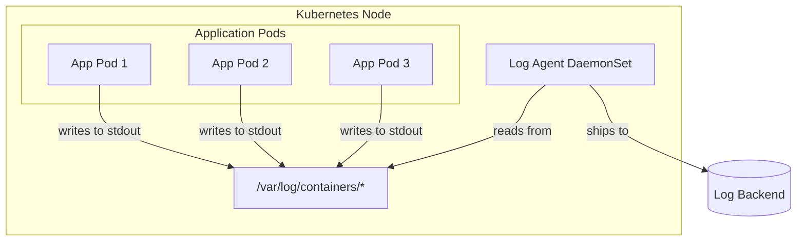
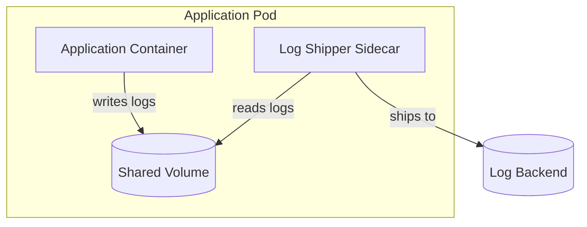
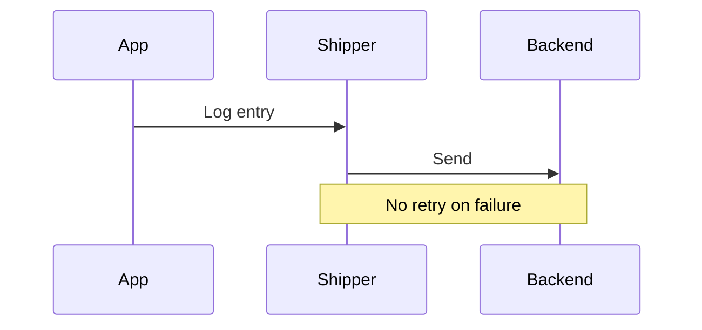
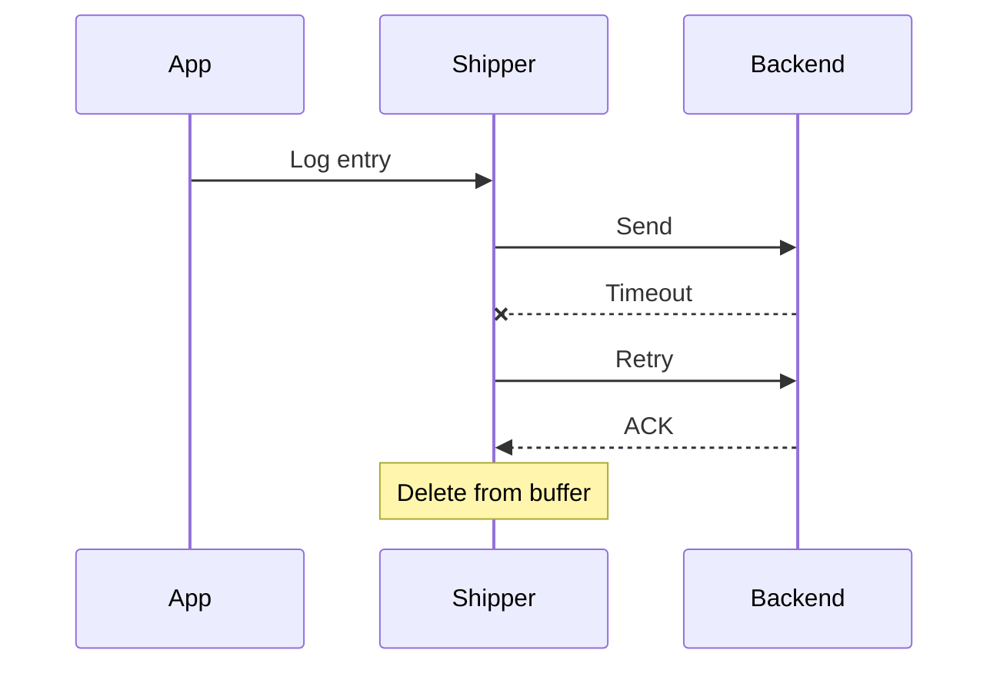
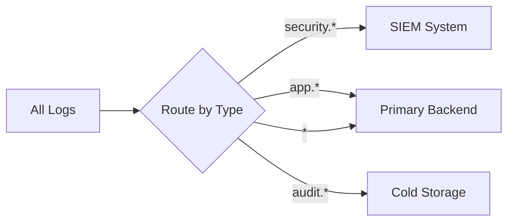
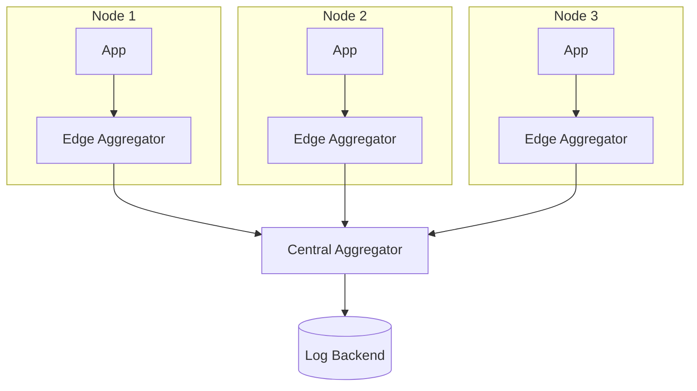

# How to Build Log Shipping Strategies

Author: [nawazdhandala](https://github.com/nawazdhandala)

Tags: Logging, Log Shipping, Observability, Infrastructure

Description: A practical guide to designing reliable log shipping pipelines using Fluentd, Filebeat, and Vector with production-tested patterns for buffering, delivery guarantees, and deployment architectures.

---

> Your logs are only useful if they reach their destination. A single dropped log during an outage could be the one that explains what went wrong.

Log shipping is the plumbing of observability. It connects your applications to your analysis tools, and like all plumbing, you only notice it when it breaks. This post covers how to build log shipping strategies that survive network partitions, handle backpressure gracefully, and scale with your infrastructure.

---

## What is Log Shipping?

Log shipping is the process of collecting logs from where they are generated and delivering them to a centralized destination for storage, analysis, and alerting. It sounds simple, but production systems introduce complexity:

- Applications crash mid-write
- Networks partition during peak traffic
- Destinations become unavailable
- Log volumes spike 10x during incidents (exactly when you need them most)

A robust log shipping strategy handles all of these scenarios without losing data or overwhelming your infrastructure.

---

## Architecture Overview

Before diving into tools, let's understand the core components of a log shipping pipeline:



The key insight is that buffering happens at multiple stages. You need buffers at the collection layer (to handle application bursts), at the processing layer (to absorb backpressure from destinations), and sometimes at the destination itself.

---

## Deployment Patterns: Agents vs Sidecars

The first architectural decision is where to run your log shippers. There are two primary patterns:

### Pattern 1: Node-Level Agents (DaemonSet)

A single log shipper runs on each node and collects logs from all containers or applications on that node.



**Advantages:**
- Lower resource overhead (one agent per node, not per pod)
- Simpler deployment (single DaemonSet)
- No changes needed to application deployments

**Disadvantages:**
- Shared buffer for all pods (noisy neighbor issues)
- Less isolation between applications
- Node failure loses buffer for all pods on that node

**Best for:** Standard Kubernetes deployments where applications write to stdout/stderr.

### Pattern 2: Sidecar Containers

Each application pod includes its own log shipper as a sidecar container.



**Advantages:**
- Isolated buffers per application
- Application-specific configuration
- Failed sidecar only affects one pod

**Disadvantages:**
- Higher resource overhead
- More complex deployment (modify every pod spec)
- Potential for sidecar to consume application resources

**Best for:** Applications with strict isolation requirements, custom log formats, or high-volume logging that would overwhelm shared agents.

### Hybrid Approach

Many production systems use a hybrid: sidecars for high-value or high-volume applications, and a DaemonSet for everything else.

---

## Buffering Strategies

Buffering is the single most important aspect of reliable log shipping. Without proper buffering, any downstream hiccup means lost logs.

### Memory Buffers

Fast but volatile. Logs in memory buffers are lost on process restart or crash.

```yaml
# Fluentd memory buffer example
<buffer>
  @type memory
  flush_mode interval
  flush_interval 5s
  chunk_limit_size 8MB
  total_limit_size 512MB
  overflow_action drop_oldest_chunk
</buffer>
```

**Use when:** Low latency is critical and some data loss is acceptable.

### Disk Buffers

Slower but persistent. Logs survive process restarts and can handle longer outages.

```yaml
# Fluentd file buffer example
<buffer>
  @type file
  path /var/log/fluentd-buffers/
  flush_mode interval
  flush_interval 30s
  chunk_limit_size 16MB
  total_limit_size 8GB
  overflow_action block
  retry_type exponential_backoff
  retry_wait 1s
  retry_max_interval 60s
  retry_forever true
</buffer>
```

**Use when:** Data loss is unacceptable and you can tolerate slightly higher latency.

### Buffer Overflow Strategies

What happens when your buffer fills up? You have three options:

| Strategy | Behavior | Use Case |
|----------|----------|----------|
| `drop_oldest_chunk` | Discard oldest buffered data | When recent logs are more valuable |
| `throw_exception` | Fail loudly, stop processing | When you need to detect buffer issues |
| `block` | Apply backpressure to sources | When all data must be preserved |

---

## Delivery Guarantees

Log shipping systems offer different delivery guarantees:

### At-Most-Once Delivery

Logs are sent once and never retried. Fast but lossy.



### At-Least-Once Delivery

Logs are retried until acknowledged. May result in duplicates.



### Exactly-Once Delivery

Logs are delivered exactly once using deduplication. Requires more infrastructure.

Most production systems use **at-least-once delivery** with idempotent backends or deduplication keys. Exactly-once is expensive and often unnecessary for observability use cases.

---

## Tool Comparison: Fluentd, Filebeat, and Vector

### Fluentd

Fluentd is a CNCF graduated project with a large plugin ecosystem. It uses Ruby for plugins, which makes it flexible but can impact performance at high volumes.

```yaml
# fluentd.conf - Production configuration example
<source>
  @type tail
  path /var/log/containers/*.log
  pos_file /var/log/fluentd-pos/containers.pos
  tag kubernetes.*
  read_from_head true
  <parse>
    @type json
    time_key time
    time_format %Y-%m-%dT%H:%M:%S.%NZ
  </parse>
</source>

# Add Kubernetes metadata
<filter kubernetes.**>
  @type kubernetes_metadata
  skip_labels true
  skip_container_metadata true
  skip_master_url true
</filter>

# Remove noisy fields to reduce volume
<filter kubernetes.**>
  @type record_transformer
  remove_keys $.kubernetes.pod_id,$.kubernetes.master_url
</filter>

# Buffer and ship to OneUptime
<match kubernetes.**>
  @type http
  endpoint https://oneuptime.com/fluentd/v1/logs
  headers {"x-oneuptime-token":"${ONEUPTIME_TOKEN}"}
  json_array true

  <buffer>
    @type file
    path /var/log/fluentd-buffers/oneuptime
    flush_mode interval
    flush_interval 10s
    flush_thread_count 4
    chunk_limit_size 8MB
    total_limit_size 4GB
    overflow_action block
    retry_type exponential_backoff
    retry_wait 1s
    retry_max_interval 300s
    retry_forever true
  </buffer>

  <format>
    @type json
  </format>
</match>
```

**Strengths:**
- Massive plugin ecosystem (800+ plugins)
- Battle-tested in large deployments
- Strong Kubernetes integration

**Weaknesses:**
- Higher memory footprint than alternatives
- Ruby GC can cause latency spikes
- Plugin quality varies

### Filebeat

Filebeat is part of the Elastic Stack. It is lightweight, written in Go, and focuses on reliability over flexibility.

```yaml
# filebeat.yml - Production configuration example
filebeat.inputs:
  - type: container
    paths:
      - /var/log/containers/*.log
    processors:
      - add_kubernetes_metadata:
          host: ${NODE_NAME}
          matchers:
            - logs_path:
                logs_path: "/var/log/containers/"

# Parse JSON logs
processors:
  - decode_json_fields:
      fields: ["message"]
      process_array: false
      max_depth: 2
      target: ""
      overwrite_keys: true
      add_error_key: true

  # Drop debug logs in production
  - drop_event:
      when:
        equals:
          level: "debug"

  # Remove high-cardinality fields
  - drop_fields:
      fields: ["agent.ephemeral_id", "host.ip"]

# Queue configuration for reliability
queue.mem:
  events: 4096
  flush.min_events: 512
  flush.timeout: 5s

# Disk queue for persistence during outages
queue.disk:
  max_size: 10GB
  path: /var/lib/filebeat/diskqueue

# Output to OTLP endpoint
output.otlp:
  hosts: ["https://oneuptime.com"]
  headers:
    x-oneuptime-token: "${ONEUPTIME_TOKEN}"

  # Retry configuration
  backoff.init: 1s
  backoff.max: 60s

  # Bulk settings
  bulk_max_size: 1024
  compression_level: 5
```

**Strengths:**
- Very low resource usage
- Simple configuration
- Built-in disk queue for reliability

**Weaknesses:**
- Limited transformation capabilities
- Smaller plugin ecosystem
- Tightly coupled to Elastic formats

### Vector

Vector is a newer entrant from Datadog, written in Rust. It combines high performance with a flexible pipeline model.

```toml
# vector.toml - Production configuration example

# Collect container logs
[sources.kubernetes_logs]
type = "kubernetes_logs"
auto_partial_merge = true
exclude_paths_glob_patterns = ["*_kube-system_*"]

# Parse JSON and add structure
[transforms.parse_logs]
type = "remap"
inputs = ["kubernetes_logs"]
source = '''
# Parse JSON message if present
if is_string(.message) {
  parsed, err = parse_json(.message)
  if err == null {
    . = merge(., parsed)
    del(.message)
  }
}

# Add processing timestamp
.processed_at = now()

# Normalize log level
.level = downcase(.level) ?? "info"

# Remove noisy fields
del(.kubernetes.pod_uid)
del(.source_type)
'''

# Filter out health checks and noise
[transforms.filter_noise]
type = "filter"
inputs = ["parse_logs"]
condition = '''
!match(.message, r'GET /health') &&
!match(.message, r'GET /ready') &&
.level != "debug"
'''

# Sample high-volume debug logs (keep 10%)
[transforms.sample_debug]
type = "sample"
inputs = ["filter_noise"]
rate = 10
exclude = '.level != "debug"'

# Buffer to disk for reliability
[sinks.oneuptime]
type = "http"
inputs = ["sample_debug"]
uri = "https://oneuptime.com/vector/v1/logs"
encoding.codec = "json"
compression = "gzip"
method = "post"

[sinks.oneuptime.request]
headers.x-oneuptime-token = "${ONEUPTIME_TOKEN}"
timeout_secs = 30
retry_initial_backoff_secs = 1
retry_max_duration_secs = 300

[sinks.oneuptime.buffer]
type = "disk"
max_size = 5368709120  # 5GB
when_full = "block"

[sinks.oneuptime.batch]
max_bytes = 10485760  # 10MB
timeout_secs = 10
```

**Strengths:**
- Excellent performance (Rust)
- Powerful VRL transformation language
- Unified pipeline for logs, metrics, and traces

**Weaknesses:**
- Younger project (less battle-tested)
- Smaller community than Fluentd
- VRL learning curve

### Quick Comparison

| Feature | Fluentd | Filebeat | Vector |
|---------|---------|----------|--------|
| Language | Ruby/C | Go | Rust |
| Memory Usage | High | Low | Low |
| Throughput | Medium | High | Very High |
| Plugin Ecosystem | Huge | Medium | Growing |
| Configuration | Complex | Simple | Medium |
| Transformation | Good | Limited | Excellent |
| Best For | Flexibility | Simplicity | Performance |

---

## Production Patterns

### Pattern: Multi-Destination Routing

Send different log types to different destinations based on content.



Vector configuration for multi-destination:

```toml
[transforms.route_logs]
type = "route"
inputs = ["parse_logs"]

[transforms.route_logs.route]
security = '.kubernetes.namespace == "security" || contains(.tags, "security")'
audit = '.type == "audit" || .kubernetes.labels."app.type" == "audit"'
debug = '.level == "debug"'

[sinks.siem]
type = "http"
inputs = ["route_logs.security"]
uri = "https://siem.example.com/api/logs"

[sinks.primary]
type = "http"
inputs = ["route_logs._unmatched", "route_logs.audit"]
uri = "https://oneuptime.com/vector/v1/logs"

[sinks.cold_storage]
type = "aws_s3"
inputs = ["route_logs.audit", "route_logs.debug"]
bucket = "logs-archive"
compression = "gzip"
```

### Pattern: Edge Aggregation

For large clusters, aggregate logs at the node level before shipping to reduce connection overhead.



This reduces the number of outbound connections and allows central aggregators to do heavy processing while edge agents stay lightweight.

### Pattern: Graceful Degradation

When your primary destination is down, automatically route to a backup.

```toml
# Vector configuration for failover
[sinks.primary]
type = "http"
inputs = ["logs"]
uri = "https://oneuptime.com/vector/v1/logs"
healthcheck.enabled = true

[sinks.backup]
type = "aws_s3"
inputs = ["logs"]
bucket = "logs-backup"
# Only activate when primary is unhealthy
healthcheck.enabled = true
```

---

## Reliability Checklist

Before shipping logs to production, verify these items:

### Buffer Configuration
- [ ] Disk buffers enabled for persistence
- [ ] Buffer size can handle 4+ hours of destination downtime
- [ ] Overflow policy is appropriate (block vs drop)
- [ ] Buffer path has sufficient disk space

### Retry Logic
- [ ] Exponential backoff configured
- [ ] Maximum retry interval is reasonable (5-10 minutes)
- [ ] Retry forever is enabled for critical logs
- [ ] Circuit breaker prevents resource exhaustion

### Monitoring
- [ ] Buffer utilization metrics exported
- [ ] Dropped log counter tracked
- [ ] Destination latency monitored
- [ ] Alert on buffer approaching capacity

### Security
- [ ] TLS enabled for all destinations
- [ ] Authentication tokens stored securely (secrets, not configmaps)
- [ ] PII filtering applied before shipping
- [ ] Network policies restrict shipper egress

### Resource Limits
- [ ] Memory limits set on shipper pods
- [ ] CPU limits allow burst processing
- [ ] Disk space monitored for buffer directories
- [ ] Pod disruption budgets configured

---

## Common Pitfalls

### Pitfall 1: Unbounded Memory Buffers

Memory buffers without limits will eventually crash your shipper during an outage.

```yaml
# Bad: No limit
<buffer>
  @type memory
</buffer>

# Good: Bounded with overflow handling
<buffer>
  @type memory
  total_limit_size 512MB
  overflow_action drop_oldest_chunk
</buffer>
```

### Pitfall 2: Missing Position Files

Without position tracking, shippers re-read entire log files on restart.

```yaml
# Fluentd: Always configure pos_file
<source>
  @type tail
  path /var/log/*.log
  pos_file /var/log/fluentd-pos/app.pos  # Critical
</source>
```

### Pitfall 3: Synchronous Flushing

Blocking on every log write destroys throughput.

```yaml
# Bad: Flush after every event
flush_interval 0s

# Good: Batch writes
flush_interval 5s
flush_mode interval
```

### Pitfall 4: No Backpressure Handling

When destinations slow down, you need to slow down sources.

```toml
# Vector: Block when buffer is full to create backpressure
[sinks.output.buffer]
type = "disk"
when_full = "block"  # Not "drop_newest"
```

---

## Performance Tuning

### Compression

Always compress before shipping over the network. The CPU cost is usually worth the bandwidth savings.

```toml
# Vector
compression = "gzip"

# Filebeat
compression_level: 5
```

### Batch Sizing

Larger batches are more efficient but increase latency. Find the right balance.

| Batch Size | Throughput | Latency | Use Case |
|------------|------------|---------|----------|
| 1 KB | Low | Very Low | Real-time alerting |
| 100 KB | Medium | Low | General logging |
| 1 MB | High | Medium | High-volume batch |
| 10 MB | Very High | High | Bulk archival |

### Connection Pooling

Reuse connections instead of opening new ones for each request.

```yaml
# Fluentd
<match **>
  @type http
  open_timeout 10
  read_timeout 60
  # Keep connections alive
  keepalive true
  keepalive_timeout 60
</match>
```

---

## Final Thoughts

Log shipping is not glamorous, but it is foundational. A well-designed log shipping strategy:

1. **Survives failures** with disk buffers and retry logic
2. **Handles scale** through batching and compression
3. **Provides visibility** with metrics on the pipeline itself
4. **Degrades gracefully** with fallback destinations

Start simple with a DaemonSet agent and disk buffers. Add complexity (sidecars, edge aggregation, multi-destination routing) only when you have specific requirements that demand it.

The goal is not to build the most sophisticated pipeline. The goal is to ensure that when something breaks at 3 AM, the logs that explain why are waiting for you in your observability platform.

---

**Related Reading:**

- [Logs, Metrics & Traces: Turning Three Noisy Streams into One Story](https://oneuptime.com/blog/post/2025-08-20-three-pillars-of-observability-logs-metrics-traces/view)
- [OpenTelemetry Collector: What It Is, When You Need It, and When You Don't](https://oneuptime.com/blog/post/2025-09-18-what-is-opentelemetry-collector-and-why-use-one/view)
- [How to Structure Logs Properly in OpenTelemetry](https://oneuptime.com/blog/post/2025-08-28-how-to-structure-logs-properly-in-opentelemetry/view)
