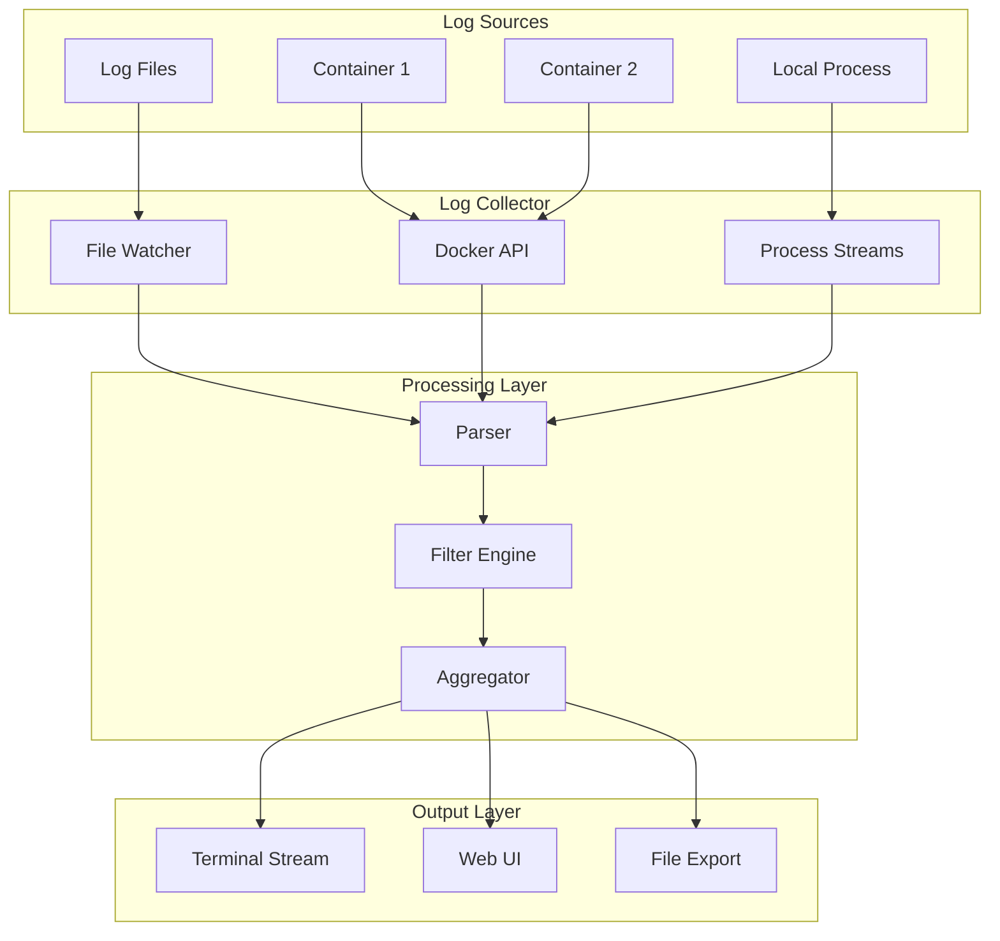
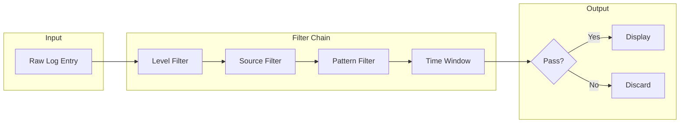
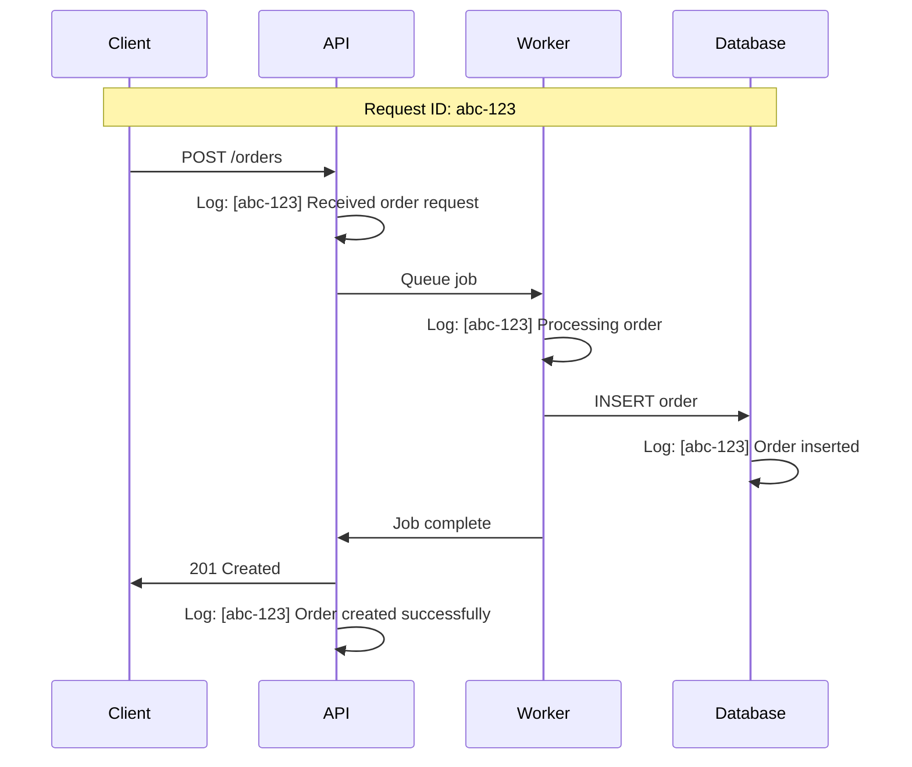
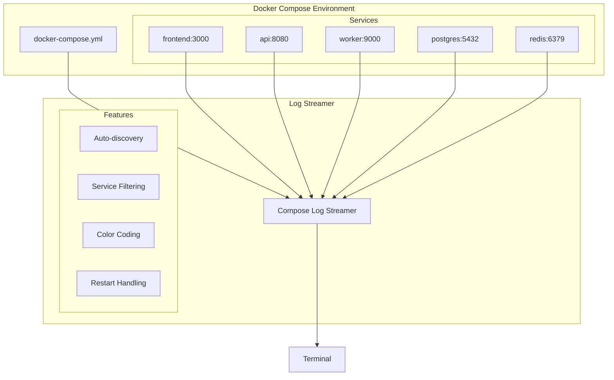

# How to Build Log Streaming

Author: [nawazdhandala](https://github.com/nawazdhandala)

Tags: Developer Experience, Log Streaming, Debugging, Observability

Description: Learn to implement log streaming for development with real-time tailing, filtering, and aggregation for efficient debugging workflows.

---

Log streaming is essential for modern development workflows. When you are debugging a distributed application or monitoring microservices locally, having real-time access to logs from multiple sources can dramatically improve your productivity. This guide walks through building a complete log streaming solution for development environments.

## Why Log Streaming Matters in Development

Traditional log files require manual inspection - you open a file, scroll to the end, and refresh periodically. Log streaming transforms this into a real-time experience where logs flow to your terminal as they are generated. This is particularly valuable when:

- Debugging timing-sensitive issues across multiple services
- Monitoring application startup sequences
- Tracking request flows through microservices
- Identifying intermittent errors that appear briefly

## Architecture Overview

A development log streaming system consists of several key components working together.



## Streaming Protocols and Approaches

### 1. File-Based Streaming with Tail

The simplest approach uses file system events to stream log files as they grow.

```python
import os
import time
from watchdog.observers import Observer
from watchdog.events import FileSystemEventHandler

class LogStreamHandler(FileSystemEventHandler):
    def __init__(self, callback):
        self.callback = callback
        self.file_positions = {}

    def on_modified(self, event):
        if event.is_directory:
            return

        filepath = event.src_path

        # Track position to only read new content
        if filepath not in self.file_positions:
            self.file_positions[filepath] = 0

        with open(filepath, 'r') as f:
            f.seek(self.file_positions[filepath])
            new_lines = f.readlines()
            self.file_positions[filepath] = f.tell()

            for line in new_lines:
                self.callback(filepath, line.strip())

def stream_logs(log_directory, on_log):
    """
    Stream all log files from a directory.

    Args:
        log_directory: Path to watch for log files
        on_log: Callback function(filepath, line) called for each new line
    """
    handler = LogStreamHandler(on_log)
    observer = Observer()
    observer.schedule(handler, log_directory, recursive=True)
    observer.start()

    try:
        while True:
            time.sleep(0.1)
    except KeyboardInterrupt:
        observer.stop()
    observer.join()

# Usage
def print_log(filepath, line):
    filename = os.path.basename(filepath)
    print(f"[{filename}] {line}")

stream_logs("/var/log/myapp", print_log)
```

This approach works well for traditional applications that write to log files. The `watchdog` library handles cross-platform file system events efficiently.

### 2. Docker Container Log Streaming

For containerized development environments, the Docker API provides direct access to container logs.

```python
import docker
import threading
from datetime import datetime

class DockerLogStreamer:
    def __init__(self):
        self.client = docker.from_env()
        self.streams = {}
        self.running = True

    def stream_container(self, container_name, callback):
        """
        Stream logs from a specific container.

        Args:
            container_name: Name or ID of the container
            callback: Function(container, timestamp, line) for each log line
        """
        try:
            container = self.client.containers.get(container_name)

            # Stream with timestamps, following new output
            for log in container.logs(
                stream=True,
                follow=True,
                timestamps=True,
                since=datetime.now()
            ):
                if not self.running:
                    break

                line = log.decode('utf-8').strip()
                # Parse timestamp from Docker log format
                if ' ' in line:
                    timestamp, message = line.split(' ', 1)
                    callback(container_name, timestamp, message)
                else:
                    callback(container_name, None, line)

        except docker.errors.NotFound:
            print(f"Container {container_name} not found")
        except Exception as e:
            print(f"Error streaming {container_name}: {e}")

    def stream_all_containers(self, callback, label_filter=None):
        """
        Stream logs from all matching containers.

        Args:
            callback: Function for each log line
            label_filter: Optional dict of labels to filter containers
        """
        filters = {}
        if label_filter:
            filters['label'] = [f"{k}={v}" for k, v in label_filter.items()]

        containers = self.client.containers.list(filters=filters)

        for container in containers:
            thread = threading.Thread(
                target=self.stream_container,
                args=(container.name, callback)
            )
            thread.daemon = True
            thread.start()
            self.streams[container.name] = thread

    def stop(self):
        self.running = False

# Usage for development environment
streamer = DockerLogStreamer()

def handle_log(container, timestamp, message):
    # Color-code by container for terminal output
    colors = {
        'api': '\033[32m',      # Green
        'worker': '\033[33m',   # Yellow
        'database': '\033[34m', # Blue
    }
    reset = '\033[0m'

    color = colors.get(container, '\033[37m')
    print(f"{color}[{container}]{reset} {message}")

# Stream all containers with the "dev" label
streamer.stream_all_containers(
    handle_log,
    label_filter={'environment': 'development'}
)
```

### 3. WebSocket-Based Streaming

For browser-based log viewers or remote development setups, WebSocket provides efficient bidirectional streaming.

```python
import asyncio
import json
from aiohttp import web
import aiohttp

class WebSocketLogServer:
    def __init__(self):
        self.clients = set()
        self.filters = {}  # client -> filter config

    async def websocket_handler(self, request):
        ws = web.WebSocketResponse()
        await ws.prepare(request)

        self.clients.add(ws)
        self.filters[ws] = {'level': 'debug', 'sources': []}

        try:
            async for msg in ws:
                if msg.type == aiohttp.WSMsgType.TEXT:
                    data = json.loads(msg.data)

                    # Handle filter updates from client
                    if data.get('type') == 'set_filter':
                        self.filters[ws] = data.get('filter', {})

                elif msg.type == aiohttp.WSMsgType.ERROR:
                    print(f'WebSocket error: {ws.exception()}')
        finally:
            self.clients.discard(ws)
            self.filters.pop(ws, None)

        return ws

    async def broadcast_log(self, log_entry):
        """
        Send a log entry to all connected clients that match filters.

        Args:
            log_entry: Dict with keys: source, level, message, timestamp
        """
        if not self.clients:
            return

        level_priority = {'debug': 0, 'info': 1, 'warn': 2, 'error': 3}

        for client in list(self.clients):
            try:
                filter_config = self.filters.get(client, {})

                # Check level filter
                min_level = filter_config.get('level', 'debug')
                if level_priority.get(log_entry['level'], 0) < level_priority.get(min_level, 0):
                    continue

                # Check source filter
                allowed_sources = filter_config.get('sources', [])
                if allowed_sources and log_entry['source'] not in allowed_sources:
                    continue

                await client.send_json(log_entry)

            except Exception:
                self.clients.discard(client)

    def create_app(self):
        app = web.Application()
        app.router.add_get('/ws/logs', self.websocket_handler)
        return app

# Example: Integrating with Docker streamer
async def main():
    server = WebSocketLogServer()

    async def forward_to_websocket(container, timestamp, message):
        # Parse log level from message if present
        level = 'info'
        for lvl in ['ERROR', 'WARN', 'DEBUG']:
            if lvl in message.upper():
                level = lvl.lower()
                break

        await server.broadcast_log({
            'source': container,
            'level': level,
            'message': message,
            'timestamp': timestamp or datetime.now().isoformat()
        })

    app = server.create_app()
    runner = web.AppRunner(app)
    await runner.setup()
    site = web.TCPSite(runner, 'localhost', 8080)
    await site.start()

    print("Log streaming server running on ws://localhost:8080/ws/logs")
    await asyncio.Event().wait()

asyncio.run(main())
```

## Implementing Log Filtering

Effective filtering is critical when dealing with verbose development logs. Here is a flexible filtering system.



```python
import re
from dataclasses import dataclass
from typing import List, Optional, Callable
from datetime import datetime, timedelta

@dataclass
class LogEntry:
    source: str
    level: str
    message: str
    timestamp: datetime
    metadata: dict = None

class FilterChain:
    def __init__(self):
        self.filters: List[Callable[[LogEntry], bool]] = []

    def add_filter(self, filter_func: Callable[[LogEntry], bool]):
        self.filters.append(filter_func)
        return self

    def matches(self, entry: LogEntry) -> bool:
        return all(f(entry) for f in self.filters)

class LogFilter:
    """Factory for common filter types."""

    @staticmethod
    def by_level(min_level: str) -> Callable[[LogEntry], bool]:
        """Filter logs by minimum severity level."""
        levels = {'debug': 0, 'info': 1, 'warn': 2, 'error': 3, 'fatal': 4}
        min_priority = levels.get(min_level.lower(), 0)

        def filter_func(entry: LogEntry) -> bool:
            entry_priority = levels.get(entry.level.lower(), 0)
            return entry_priority >= min_priority

        return filter_func

    @staticmethod
    def by_source(sources: List[str], exclude: bool = False) -> Callable[[LogEntry], bool]:
        """Filter logs by source name."""
        source_set = set(sources)

        def filter_func(entry: LogEntry) -> bool:
            matches = entry.source in source_set
            return not matches if exclude else matches

        return filter_func

    @staticmethod
    def by_pattern(pattern: str, field: str = 'message') -> Callable[[LogEntry], bool]:
        """Filter logs by regex pattern."""
        compiled = re.compile(pattern, re.IGNORECASE)

        def filter_func(entry: LogEntry) -> bool:
            value = getattr(entry, field, '') or ''
            return bool(compiled.search(value))

        return filter_func

    @staticmethod
    def by_time_window(window: timedelta) -> Callable[[LogEntry], bool]:
        """Filter logs within a time window from now."""
        def filter_func(entry: LogEntry) -> bool:
            cutoff = datetime.now() - window
            return entry.timestamp >= cutoff

        return filter_func

    @staticmethod
    def exclude_pattern(pattern: str) -> Callable[[LogEntry], bool]:
        """Exclude logs matching a pattern - useful for noise reduction."""
        compiled = re.compile(pattern, re.IGNORECASE)

        def filter_func(entry: LogEntry) -> bool:
            return not bool(compiled.search(entry.message))

        return filter_func

# Usage example: Build a filter chain for development
def create_dev_filter():
    chain = FilterChain()

    # Show info and above
    chain.add_filter(LogFilter.by_level('info'))

    # Only from specific services
    chain.add_filter(LogFilter.by_source(['api', 'worker', 'scheduler']))

    # Exclude health check noise
    chain.add_filter(LogFilter.exclude_pattern(r'GET /health'))
    chain.add_filter(LogFilter.exclude_pattern(r'GET /ready'))

    # Only recent logs (last 5 minutes)
    chain.add_filter(LogFilter.by_time_window(timedelta(minutes=5)))

    return chain

# Interactive filter for debugging specific issues
def create_debug_filter(search_term: str):
    chain = FilterChain()
    chain.add_filter(LogFilter.by_pattern(search_term))
    return chain
```

## Log Aggregation and Correlation

When debugging distributed systems, correlating logs across services is invaluable. Here is an aggregation system that groups related logs.



```python
import threading
from collections import defaultdict
from datetime import datetime, timedelta
from typing import Dict, List, Optional
import re

class LogAggregator:
    """
    Aggregates logs by correlation ID for distributed tracing.
    """

    def __init__(self, correlation_patterns: List[str] = None):
        # Patterns to extract correlation IDs from log messages
        self.patterns = correlation_patterns or [
            r'request[_-]?id[=:\s]+([a-zA-Z0-9-]+)',
            r'correlation[_-]?id[=:\s]+([a-zA-Z0-9-]+)',
            r'trace[_-]?id[=:\s]+([a-zA-Z0-9-]+)',
            r'\[([a-f0-9]{8}-[a-f0-9]{4}-[a-f0-9]{4}-[a-f0-9]{4}-[a-f0-9]{12})\]',
        ]
        self.compiled_patterns = [re.compile(p, re.IGNORECASE) for p in self.patterns]

        # Storage for correlated logs
        self.correlation_groups: Dict[str, List[LogEntry]] = defaultdict(list)
        self.lock = threading.Lock()

        # TTL for correlation groups (cleanup old entries)
        self.ttl = timedelta(minutes=10)

    def extract_correlation_id(self, message: str) -> Optional[str]:
        """Extract correlation ID from a log message."""
        for pattern in self.compiled_patterns:
            match = pattern.search(message)
            if match:
                return match.group(1)
        return None

    def add_log(self, entry: LogEntry):
        """Add a log entry, grouping by correlation ID if found."""
        correlation_id = self.extract_correlation_id(entry.message)

        if correlation_id:
            with self.lock:
                self.correlation_groups[correlation_id].append(entry)
                entry.metadata = entry.metadata or {}
                entry.metadata['correlation_id'] = correlation_id

        return correlation_id

    def get_correlated_logs(self, correlation_id: str) -> List[LogEntry]:
        """Get all logs for a correlation ID, sorted by timestamp."""
        with self.lock:
            logs = self.correlation_groups.get(correlation_id, [])
            return sorted(logs, key=lambda e: e.timestamp)

    def get_request_timeline(self, correlation_id: str) -> str:
        """Generate a human-readable timeline for a request."""
        logs = self.get_correlated_logs(correlation_id)
        if not logs:
            return f"No logs found for {correlation_id}"

        lines = [f"Timeline for request {correlation_id}:", "=" * 50]

        start_time = logs[0].timestamp
        for entry in logs:
            elapsed = (entry.timestamp - start_time).total_seconds()
            lines.append(
                f"[+{elapsed:>6.3f}s] [{entry.source:>12}] [{entry.level:>5}] {entry.message[:80]}"
            )

        total_time = (logs[-1].timestamp - start_time).total_seconds()
        lines.append("=" * 50)
        lines.append(f"Total time: {total_time:.3f}s across {len(logs)} log entries")

        return "\n".join(lines)

    def cleanup_old_entries(self):
        """Remove correlation groups older than TTL."""
        cutoff = datetime.now() - self.ttl

        with self.lock:
            expired = [
                cid for cid, logs in self.correlation_groups.items()
                if logs and logs[-1].timestamp < cutoff
            ]
            for cid in expired:
                del self.correlation_groups[cid]

# Usage example
aggregator = LogAggregator()

# Simulate logs from different services
logs = [
    LogEntry('api', 'info', '[req-abc-123] Received POST /orders', datetime.now()),
    LogEntry('api', 'debug', '[req-abc-123] Validating order payload', datetime.now()),
    LogEntry('worker', 'info', '[req-abc-123] Processing order job', datetime.now()),
    LogEntry('database', 'debug', '[req-abc-123] Executing INSERT', datetime.now()),
    LogEntry('worker', 'info', '[req-abc-123] Order processing complete', datetime.now()),
    LogEntry('api', 'info', '[req-abc-123] Returning 201 Created', datetime.now()),
]

for log in logs:
    aggregator.add_log(log)

# Get the full request timeline
print(aggregator.get_request_timeline('req-abc-123'))
```

## Terminal Integration

A polished terminal experience makes log streaming pleasant to use. Here is a terminal UI with color coding and interactive features.

```python
import sys
import threading
from datetime import datetime
from typing import Optional

class TerminalLogViewer:
    """
    Terminal-based log viewer with colors and formatting.
    """

    # ANSI color codes
    COLORS = {
        'reset': '\033[0m',
        'bold': '\033[1m',
        'dim': '\033[2m',

        # Log levels
        'debug': '\033[36m',    # Cyan
        'info': '\033[32m',     # Green
        'warn': '\033[33m',     # Yellow
        'error': '\033[31m',    # Red
        'fatal': '\033[35m',    # Magenta

        # Sources - cycle through colors
        'source_colors': [
            '\033[34m',  # Blue
            '\033[35m',  # Magenta
            '\033[36m',  # Cyan
            '\033[92m',  # Light green
            '\033[93m',  # Light yellow
            '\033[94m',  # Light blue
        ]
    }

    def __init__(self, show_timestamp: bool = True, show_source: bool = True):
        self.show_timestamp = show_timestamp
        self.show_source = show_source
        self.source_color_map = {}
        self.color_index = 0
        self.lock = threading.Lock()
        self.paused = False
        self.buffer = []  # Buffer logs while paused

    def get_source_color(self, source: str) -> str:
        """Get a consistent color for each source."""
        if source not in self.source_color_map:
            colors = self.COLORS['source_colors']
            self.source_color_map[source] = colors[self.color_index % len(colors)]
            self.color_index += 1
        return self.source_color_map[source]

    def format_log(self, entry: LogEntry) -> str:
        """Format a log entry for terminal display."""
        parts = []
        reset = self.COLORS['reset']
        dim = self.COLORS['dim']

        # Timestamp
        if self.show_timestamp:
            ts = entry.timestamp.strftime('%H:%M:%S.%f')[:-3]
            parts.append(f"{dim}{ts}{reset}")

        # Source with consistent color
        if self.show_source:
            source_color = self.get_source_color(entry.source)
            parts.append(f"{source_color}[{entry.source:>12}]{reset}")

        # Level with appropriate color
        level_color = self.COLORS.get(entry.level.lower(), self.COLORS['info'])
        level_str = entry.level.upper()[:5]
        parts.append(f"{level_color}{level_str:>5}{reset}")

        # Message - highlight errors
        message = entry.message
        if entry.level.lower() in ('error', 'fatal'):
            message = f"{self.COLORS['bold']}{message}{reset}"

        parts.append(message)

        return ' '.join(parts)

    def display(self, entry: LogEntry):
        """Display a log entry to the terminal."""
        with self.lock:
            if self.paused:
                self.buffer.append(entry)
                return

            formatted = self.format_log(entry)
            print(formatted, flush=True)

    def pause(self):
        """Pause log display - useful for reading."""
        self.paused = True
        print(f"\n{self.COLORS['bold']}--- PAUSED (buffering logs) ---{self.COLORS['reset']}\n")

    def resume(self):
        """Resume log display and flush buffer."""
        with self.lock:
            self.paused = False
            if self.buffer:
                print(f"\n{self.COLORS['dim']}--- Showing {len(self.buffer)} buffered logs ---{self.COLORS['reset']}")
                for entry in self.buffer:
                    formatted = self.format_log(entry)
                    print(formatted)
                self.buffer.clear()
                print(f"{self.COLORS['dim']}--- End of buffer ---{self.COLORS['reset']}\n")

    def clear_screen(self):
        """Clear the terminal screen."""
        print('\033[2J\033[H', end='', flush=True)

    def print_status_bar(self, sources: list, filter_info: str = ''):
        """Print a status bar showing active sources and filters."""
        reset = self.COLORS['reset']
        dim = self.COLORS['dim']

        source_list = ' '.join([
            f"{self.get_source_color(s)}{s}{reset}"
            for s in sources
        ])

        status = f"{dim}Sources: {source_list}"
        if filter_info:
            status += f" | Filter: {filter_info}"
        status += reset

        # Print at bottom of terminal
        print(f"\033[s\033[999;0H{status}\033[u", end='', flush=True)

# Complete example: Putting it all together
class DevLogStreamer:
    """
    Complete development log streaming solution.
    """

    def __init__(self):
        self.viewer = TerminalLogViewer()
        self.filter_chain = FilterChain()
        self.aggregator = LogAggregator()
        self.running = True

    def process_log(self, source: str, level: str, message: str,
                    timestamp: Optional[datetime] = None):
        """Process and display a log entry."""
        entry = LogEntry(
            source=source,
            level=level,
            message=message,
            timestamp=timestamp or datetime.now()
        )

        # Add to aggregator for correlation
        self.aggregator.add_log(entry)

        # Apply filters
        if self.filter_chain.matches(entry):
            self.viewer.display(entry)

    def set_filter(self, min_level: str = 'debug',
                   sources: List[str] = None,
                   pattern: str = None):
        """Update the active filter."""
        self.filter_chain = FilterChain()
        self.filter_chain.add_filter(LogFilter.by_level(min_level))

        if sources:
            self.filter_chain.add_filter(LogFilter.by_source(sources))

        if pattern:
            self.filter_chain.add_filter(LogFilter.by_pattern(pattern))

    def show_request(self, correlation_id: str):
        """Display the timeline for a specific request."""
        print(self.aggregator.get_request_timeline(correlation_id))
```

## Multi-Container Support with Docker Compose

For development environments using Docker Compose, here is a specialized streamer that handles multiple containers elegantly.



```python
import subprocess
import threading
import signal
import sys
from typing import List, Dict, Optional
import docker
from datetime import datetime
import yaml

class ComposeLogStreamer:
    """
    Stream logs from all services in a Docker Compose project.
    """

    def __init__(self, compose_file: str = 'docker-compose.yml'):
        self.compose_file = compose_file
        self.client = docker.from_env()
        self.project_name = self._get_project_name()
        self.viewer = TerminalLogViewer()
        self.threads: Dict[str, threading.Thread] = {}
        self.running = True

        # Handle graceful shutdown
        signal.signal(signal.SIGINT, self._signal_handler)
        signal.signal(signal.SIGTERM, self._signal_handler)

    def _get_project_name(self) -> str:
        """Get the Compose project name from the directory."""
        import os
        return os.path.basename(os.getcwd()).lower().replace(' ', '')

    def _signal_handler(self, signum, frame):
        """Handle shutdown signals gracefully."""
        print("\nShutting down log streamer...")
        self.running = False
        sys.exit(0)

    def get_compose_services(self) -> List[str]:
        """Parse docker-compose.yml to get service names."""
        try:
            with open(self.compose_file, 'r') as f:
                compose_config = yaml.safe_load(f)
            return list(compose_config.get('services', {}).keys())
        except Exception as e:
            print(f"Error reading compose file: {e}")
            return []

    def get_running_containers(self, services: List[str] = None) -> Dict[str, any]:
        """Get running containers for the Compose project."""
        containers = {}

        try:
            all_containers = self.client.containers.list(
                filters={'label': f'com.docker.compose.project={self.project_name}'}
            )

            for container in all_containers:
                service = container.labels.get('com.docker.compose.service', '')
                if services is None or service in services:
                    containers[service] = container

        except Exception as e:
            print(f"Error listing containers: {e}")

        return containers

    def stream_service(self, service_name: str, container):
        """Stream logs from a single service."""
        try:
            for log in container.logs(
                stream=True,
                follow=True,
                timestamps=True,
                since=datetime.now()
            ):
                if not self.running:
                    break

                line = log.decode('utf-8').strip()
                if not line:
                    continue

                # Parse Docker log format: timestamp message
                timestamp = None
                message = line

                if ' ' in line and line[0].isdigit():
                    parts = line.split(' ', 1)
                    try:
                        timestamp = datetime.fromisoformat(
                            parts[0].replace('Z', '+00:00')
                        )
                        message = parts[1] if len(parts) > 1 else ''
                    except ValueError:
                        pass

                # Detect log level from message
                level = self._detect_level(message)

                entry = LogEntry(
                    source=service_name,
                    level=level,
                    message=message,
                    timestamp=timestamp or datetime.now()
                )

                self.viewer.display(entry)

        except Exception as e:
            if self.running:
                print(f"Stream error for {service_name}: {e}")

    def _detect_level(self, message: str) -> str:
        """Detect log level from message content."""
        message_upper = message.upper()

        if 'ERROR' in message_upper or 'EXCEPTION' in message_upper:
            return 'error'
        elif 'WARN' in message_upper:
            return 'warn'
        elif 'DEBUG' in message_upper:
            return 'debug'
        elif 'FATAL' in message_upper or 'CRITICAL' in message_upper:
            return 'fatal'
        else:
            return 'info'

    def start(self, services: List[str] = None):
        """Start streaming logs from all services."""
        if services is None:
            services = self.get_compose_services()

        print(f"Starting log stream for: {', '.join(services)}")
        print("Press Ctrl+C to stop\n")

        containers = self.get_running_containers(services)

        if not containers:
            print("No running containers found. Start your services with:")
            print(f"  docker-compose -f {self.compose_file} up -d")
            return

        # Start a thread for each container
        for service, container in containers.items():
            thread = threading.Thread(
                target=self.stream_service,
                args=(service, container),
                daemon=True
            )
            thread.start()
            self.threads[service] = thread

        # Monitor for container restarts
        self._monitor_containers(services)

    def _monitor_containers(self, services: List[str]):
        """Monitor for container restarts and reconnect."""
        import time

        while self.running:
            time.sleep(5)

            current_containers = self.get_running_containers(services)

            for service, container in current_containers.items():
                if service not in self.threads or not self.threads[service].is_alive():
                    print(f"Reconnecting to {service}...")
                    thread = threading.Thread(
                        target=self.stream_service,
                        args=(service, container),
                        daemon=True
                    )
                    thread.start()
                    self.threads[service] = thread

# CLI usage
if __name__ == '__main__':
    import argparse

    parser = argparse.ArgumentParser(description='Stream Docker Compose logs')
    parser.add_argument('-f', '--file', default='docker-compose.yml',
                        help='Compose file path')
    parser.add_argument('-s', '--services', nargs='+',
                        help='Specific services to stream')
    parser.add_argument('--level', default='debug',
                        choices=['debug', 'info', 'warn', 'error'],
                        help='Minimum log level')

    args = parser.parse_args()

    streamer = ComposeLogStreamer(args.file)
    streamer.start(args.services)
```

## Performance Considerations

When streaming logs from multiple sources, performance matters. Here are key optimizations.

```python
import asyncio
from asyncio import Queue
from typing import AsyncIterator
import time

class HighPerformanceStreamer:
    """
    Optimized log streamer for high-volume environments.
    """

    def __init__(self, max_queue_size: int = 10000):
        self.queue: Queue = Queue(maxsize=max_queue_size)
        self.dropped_count = 0
        self.processed_count = 0
        self.running = True

    async def producer(self, source: str, log_iterator: AsyncIterator[str]):
        """
        Produce logs into the queue with backpressure handling.
        """
        async for line in log_iterator:
            if not self.running:
                break

            try:
                # Non-blocking put with timeout
                await asyncio.wait_for(
                    self.queue.put((source, line, time.time())),
                    timeout=0.1
                )
            except asyncio.TimeoutError:
                # Queue is full - drop oldest or newest based on strategy
                self.dropped_count += 1
                if self.dropped_count % 1000 == 0:
                    print(f"Warning: Dropped {self.dropped_count} logs due to backpressure")

    async def consumer(self, callback):
        """
        Consume logs from the queue with batching for efficiency.
        """
        batch = []
        batch_size = 100
        flush_interval = 0.05  # 50ms max latency
        last_flush = time.time()

        while self.running or not self.queue.empty():
            try:
                item = await asyncio.wait_for(self.queue.get(), timeout=flush_interval)
                batch.append(item)
                self.processed_count += 1

                # Flush batch when full or timeout reached
                if len(batch) >= batch_size or (time.time() - last_flush) > flush_interval:
                    await callback(batch)
                    batch = []
                    last_flush = time.time()

            except asyncio.TimeoutError:
                # Flush any pending logs
                if batch:
                    await callback(batch)
                    batch = []
                    last_flush = time.time()

    def get_stats(self) -> dict:
        """Get streaming statistics."""
        return {
            'processed': self.processed_count,
            'dropped': self.dropped_count,
            'queue_size': self.queue.qsize(),
            'drop_rate': self.dropped_count / max(self.processed_count, 1)
        }
```

## Putting It All Together

Here is a complete CLI tool that combines all the concepts.

```bash
#!/usr/bin/env python3
"""
devlogs - Development log streaming tool

Usage:
    devlogs stream [--services=<svc>...] [--level=<lvl>] [--pattern=<pat>]
    devlogs tail <file>... [--level=<lvl>]
    devlogs request <correlation-id>
    devlogs -h | --help

Options:
    -s --services=<svc>    Services to stream (default: all)
    -l --level=<lvl>       Minimum log level [default: debug]
    -p --pattern=<pat>     Filter by regex pattern
    -h --help              Show this help
"""

import sys
import argparse

def main():
    parser = argparse.ArgumentParser(
        prog='devlogs',
        description='Development log streaming tool'
    )

    subparsers = parser.add_subparsers(dest='command', help='Commands')

    # Stream command
    stream_parser = subparsers.add_parser('stream', help='Stream container logs')
    stream_parser.add_argument('-s', '--services', nargs='+', help='Services to stream')
    stream_parser.add_argument('-l', '--level', default='debug', help='Min log level')
    stream_parser.add_argument('-p', '--pattern', help='Filter pattern')
    stream_parser.add_argument('-f', '--file', default='docker-compose.yml')

    # Tail command
    tail_parser = subparsers.add_parser('tail', help='Tail log files')
    tail_parser.add_argument('files', nargs='+', help='Log files to tail')
    tail_parser.add_argument('-l', '--level', default='debug')

    # Request command
    request_parser = subparsers.add_parser('request', help='Show request timeline')
    request_parser.add_argument('correlation_id', help='Correlation ID to trace')

    args = parser.parse_args()

    if args.command == 'stream':
        streamer = ComposeLogStreamer(args.file)
        if args.level != 'debug' or args.pattern:
            streamer.viewer.filter_chain = FilterChain()
            streamer.viewer.filter_chain.add_filter(LogFilter.by_level(args.level))
            if args.pattern:
                streamer.viewer.filter_chain.add_filter(LogFilter.by_pattern(args.pattern))
        streamer.start(args.services)

    elif args.command == 'tail':
        def on_log(filepath, line):
            viewer = TerminalLogViewer()
            entry = LogEntry(
                source=os.path.basename(filepath),
                level='info',
                message=line,
                timestamp=datetime.now()
            )
            viewer.display(entry)

        stream_logs(args.files[0] if len(args.files) == 1 else '.', on_log)

    elif args.command == 'request':
        # This would need persistent storage in a real implementation
        print(f"Looking up request {args.correlation_id}...")

    else:
        parser.print_help()

if __name__ == '__main__':
    main()
```

## Conclusion

Building a log streaming solution for development involves several interconnected components:

1. **Collection** - Gathering logs from files, containers, and processes
2. **Parsing** - Extracting structure from log lines
3. **Filtering** - Reducing noise to show relevant information
4. **Aggregation** - Correlating logs across distributed services
5. **Display** - Presenting logs in a readable, terminal-friendly format

The code examples in this guide provide a foundation you can adapt to your specific development environment. Start with the basic file or Docker streaming, then add filtering and aggregation as your needs grow.

For production observability, consider integrating with established tools like OpenTelemetry, but for local development, a custom solution gives you the flexibility and simplicity that makes debugging efficient.
