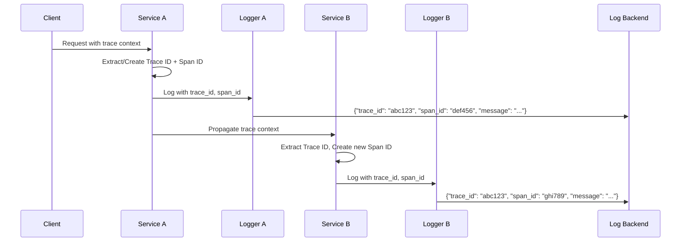
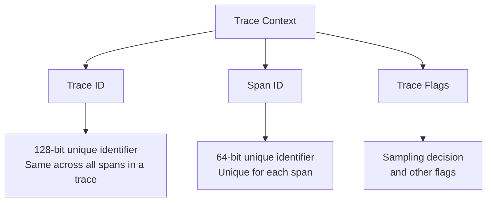
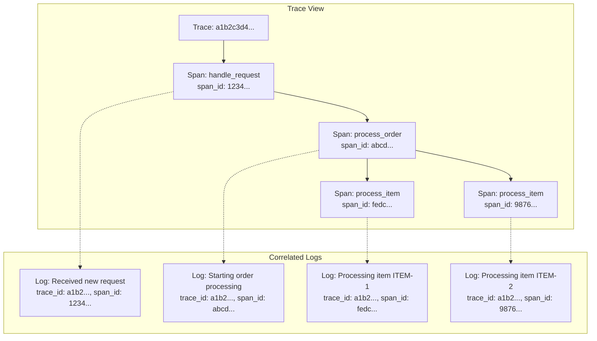
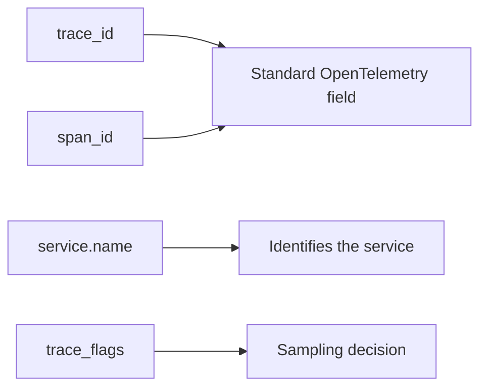

# How to Implement Log-Trace Correlation

Author: [nawazdhandala](https://github.com/nawazdhandala)

Tags: Observability, Tracing, Logging, OpenTelemetry

Description: Learn how to correlate logs with traces using trace IDs and span IDs for unified observability.

---

## Introduction

Modern distributed systems generate massive amounts of logs and traces. Without proper correlation between these two observability signals, debugging issues becomes like finding a needle in a haystack. Log-trace correlation connects your log statements directly to the distributed traces they belong to, enabling you to jump from a trace span to its associated logs and vice versa.

In this guide, you will learn how to implement log-trace correlation using OpenTelemetry and popular logging frameworks.

## Why Log-Trace Correlation Matters

Consider this scenario: A user reports that their checkout request failed. You have millions of log entries and thousands of traces. How do you find the exact logs related to that specific request?

Log-trace correlation solves this by embedding trace context (trace ID and span ID) into every log entry. This enables you to:

- Filter logs by a specific trace ID to see all logs from a single request
- Jump from a trace span to its corresponding logs
- Understand the full context of errors by viewing both trace and log data together

## How Log-Trace Correlation Works

The following diagram illustrates how trace context flows through your application and gets injected into logs:



## The Trace Context Structure

Every trace contains two key identifiers:



- **Trace ID**: A 128-bit identifier that remains constant across all spans in a distributed trace
- **Span ID**: A 64-bit identifier unique to each span within the trace
- **Trace Flags**: Contains the sampling decision and other trace metadata

## Implementation Guide

### Step 1: Set Up OpenTelemetry

First, install the required OpenTelemetry packages for your language.

#### Python

```bash
# Install OpenTelemetry packages
pip install opentelemetry-api opentelemetry-sdk opentelemetry-exporter-otlp
```

#### Node.js

```bash
# Install OpenTelemetry packages
npm install @opentelemetry/api @opentelemetry/sdk-node @opentelemetry/auto-instrumentations-node
```

#### Java

```xml
<!-- Add to your pom.xml -->
<dependency>
    <groupId>io.opentelemetry</groupId>
    <artifactId>opentelemetry-api</artifactId>
    <version>1.34.0</version>
</dependency>
<dependency>
    <groupId>io.opentelemetry</groupId>
    <artifactId>opentelemetry-sdk</artifactId>
    <version>1.34.0</version>
</dependency>
```

### Step 2: Initialize the Tracer

#### Python Example

```python
# tracer_setup.py
from opentelemetry import trace
from opentelemetry.sdk.trace import TracerProvider
from opentelemetry.sdk.trace.export import BatchSpanProcessor
from opentelemetry.exporter.otlp.proto.grpc.trace_exporter import OTLPSpanExporter
from opentelemetry.sdk.resources import Resource

def setup_tracer(service_name: str) -> trace.Tracer:
    """
    Initialize and configure the OpenTelemetry tracer.

    Args:
        service_name: The name of your service for identification in traces

    Returns:
        A configured Tracer instance
    """
    # Create a resource with service information
    resource = Resource.create({
        "service.name": service_name,
        "service.version": "1.0.0",
    })

    # Set up the tracer provider with the resource
    provider = TracerProvider(resource=resource)

    # Configure the OTLP exporter to send traces to your backend
    otlp_exporter = OTLPSpanExporter(
        endpoint="http://localhost:4317",  # Your OTLP endpoint
        insecure=True
    )

    # Use batch processing for better performance
    span_processor = BatchSpanProcessor(otlp_exporter)
    provider.add_span_processor(span_processor)

    # Register the provider globally
    trace.set_tracer_provider(provider)

    # Return a tracer instance for creating spans
    return trace.get_tracer(__name__)
```

#### Node.js Example

```javascript
// tracer-setup.js
const { NodeSDK } = require('@opentelemetry/sdk-node');
const { getNodeAutoInstrumentations } = require('@opentelemetry/auto-instrumentations-node');
const { OTLPTraceExporter } = require('@opentelemetry/exporter-trace-otlp-grpc');
const { Resource } = require('@opentelemetry/resources');
const { SemanticResourceAttributes } = require('@opentelemetry/semantic-conventions');

/**
 * Initialize the OpenTelemetry SDK with auto-instrumentation.
 * This sets up tracing for common libraries automatically.
 *
 * @param {string} serviceName - The name of your service
 */
function setupTracer(serviceName) {
    // Create a resource identifying your service
    const resource = new Resource({
        [SemanticResourceAttributes.SERVICE_NAME]: serviceName,
        [SemanticResourceAttributes.SERVICE_VERSION]: '1.0.0',
    });

    // Configure the OTLP exporter
    const traceExporter = new OTLPTraceExporter({
        url: 'http://localhost:4317', // Your OTLP endpoint
    });

    // Initialize the SDK with auto-instrumentation
    const sdk = new NodeSDK({
        resource: resource,
        traceExporter: traceExporter,
        instrumentations: [getNodeAutoInstrumentations()],
    });

    // Start the SDK
    sdk.start();

    // Gracefully shut down on process exit
    process.on('SIGTERM', () => {
        sdk.shutdown()
            .then(() => console.log('Tracing terminated'))
            .catch((error) => console.error('Error terminating tracing', error))
            .finally(() => process.exit(0));
    });
}

module.exports = { setupTracer };
```

### Step 3: Inject Trace Context into Logs

This is the core of log-trace correlation. You need to extract the current trace context and include it in every log entry.

#### Python with structlog

```python
# logging_setup.py
import structlog
from opentelemetry import trace

def add_trace_context(logger, method_name, event_dict):
    """
    Structlog processor that adds trace context to every log entry.

    This processor extracts the current span from OpenTelemetry context
    and adds trace_id and span_id fields to the log event.

    Args:
        logger: The wrapped logger object
        method_name: The name of the log method called
        event_dict: The event dictionary containing log data

    Returns:
        The event dictionary with trace context added
    """
    # Get the current span from the trace context
    span = trace.get_current_span()

    # Check if we have a valid span with context
    if span and span.get_span_context().is_valid:
        ctx = span.get_span_context()

        # Add trace_id as a 32-character hex string
        event_dict["trace_id"] = format(ctx.trace_id, '032x')

        # Add span_id as a 16-character hex string
        event_dict["span_id"] = format(ctx.span_id, '016x')

        # Optionally add the trace flags for sampling information
        event_dict["trace_flags"] = ctx.trace_flags

    return event_dict

def setup_logging():
    """
    Configure structlog with trace context injection.

    Returns:
        A configured structlog logger
    """
    structlog.configure(
        processors=[
            # Add timestamp to all logs
            structlog.processors.TimeStamper(fmt="iso"),
            # Add log level
            structlog.stdlib.add_log_level,
            # Inject trace context from OpenTelemetry
            add_trace_context,
            # Format as JSON for structured logging
            structlog.processors.JSONRenderer()
        ],
        # Use a dict for the context class
        context_class=dict,
        # Use the standard library logger
        logger_factory=structlog.PrintLoggerFactory(),
        # Cache the logger for performance
        cache_logger_on_first_use=True,
    )

    return structlog.get_logger()

# Example usage
logger = setup_logging()

# When you log within a traced context, trace_id and span_id are automatically included
# logger.info("Processing order", order_id="12345")
# Output: {"timestamp": "2026-01-30T10:00:00Z", "level": "info", "trace_id": "abc123...", "span_id": "def456...", "event": "Processing order", "order_id": "12345"}
```

#### Python with Standard Logging

```python
# standard_logging_setup.py
import logging
import json
from opentelemetry import trace

class TraceContextFilter(logging.Filter):
    """
    A logging filter that adds trace context to log records.

    This filter extracts trace_id and span_id from the current
    OpenTelemetry span and adds them as attributes to the log record.
    """

    def filter(self, record):
        """
        Add trace context to the log record.

        Args:
            record: The LogRecord to modify

        Returns:
            True to allow the record to be logged
        """
        # Get the current active span
        span = trace.get_current_span()

        if span and span.get_span_context().is_valid:
            ctx = span.get_span_context()
            # Format as hex strings matching W3C Trace Context format
            record.trace_id = format(ctx.trace_id, '032x')
            record.span_id = format(ctx.span_id, '016x')
        else:
            # No active span, use placeholder values
            record.trace_id = "00000000000000000000000000000000"
            record.span_id = "0000000000000000"

        return True

class JsonFormatter(logging.Formatter):
    """
    A formatter that outputs log records as JSON with trace context.
    """

    def format(self, record):
        """
        Format the log record as a JSON string.

        Args:
            record: The LogRecord to format

        Returns:
            A JSON string containing the log data
        """
        log_data = {
            "timestamp": self.formatTime(record),
            "level": record.levelname,
            "logger": record.name,
            "message": record.getMessage(),
            "trace_id": getattr(record, 'trace_id', None),
            "span_id": getattr(record, 'span_id', None),
        }

        # Include exception info if present
        if record.exc_info:
            log_data["exception"] = self.formatException(record.exc_info)

        return json.dumps(log_data)

def setup_logging():
    """
    Configure the standard logging module with trace context injection.

    Returns:
        A configured logger instance
    """
    # Create a logger
    logger = logging.getLogger("my_service")
    logger.setLevel(logging.DEBUG)

    # Create a console handler
    handler = logging.StreamHandler()
    handler.setLevel(logging.DEBUG)

    # Add the trace context filter
    handler.addFilter(TraceContextFilter())

    # Set the JSON formatter
    handler.setFormatter(JsonFormatter())

    # Add the handler to the logger
    logger.addHandler(handler)

    return logger
```

#### Node.js with Pino

```javascript
// pino-logging.js
const pino = require('pino');
const { trace, context } = require('@opentelemetry/api');

/**
 * Creates a Pino logger instance with trace context injection.
 *
 * The mixin function automatically adds trace_id and span_id
 * to every log entry from the current OpenTelemetry context.
 *
 * @param {string} serviceName - The name of your service
 * @returns {Object} A configured Pino logger
 */
function createLogger(serviceName) {
    return pino({
        name: serviceName,
        level: 'info',

        // Format output as JSON with timestamp
        timestamp: pino.stdTimeFunctions.isoTime,

        // Mixin function adds trace context to every log
        mixin() {
            // Get the current span from OpenTelemetry context
            const span = trace.getSpan(context.active());

            if (span) {
                const spanContext = span.spanContext();
                return {
                    // Include trace_id for correlation
                    trace_id: spanContext.traceId,
                    // Include span_id for precise location
                    span_id: spanContext.spanId,
                    // Include trace flags for sampling info
                    trace_flags: spanContext.traceFlags,
                };
            }

            // No active span, return empty object
            return {};
        },
    });
}

// Example usage
const logger = createLogger('order-service');

// When used within a traced context:
// logger.info({ orderId: '12345' }, 'Processing order');
// Output: {"level":30,"time":"2026-01-30T10:00:00.000Z","name":"order-service","trace_id":"abc123...","span_id":"def456...","orderId":"12345","msg":"Processing order"}

module.exports = { createLogger };
```

#### Node.js with Winston

```javascript
// winston-logging.js
const winston = require('winston');
const { trace, context } = require('@opentelemetry/api');

/**
 * Custom Winston format that adds OpenTelemetry trace context.
 *
 * This format extracts the current span context and adds
 * trace_id and span_id to the log info object.
 */
const traceContextFormat = winston.format((info) => {
    // Get the current span from OpenTelemetry context
    const span = trace.getSpan(context.active());

    if (span) {
        const spanContext = span.spanContext();
        // Add trace context fields to the log info
        info.trace_id = spanContext.traceId;
        info.span_id = spanContext.spanId;
    }

    return info;
});

/**
 * Creates a Winston logger with trace context injection.
 *
 * @param {string} serviceName - The name of your service
 * @returns {Object} A configured Winston logger
 */
function createLogger(serviceName) {
    return winston.createLogger({
        level: 'info',

        // Default metadata added to all logs
        defaultMeta: { service: serviceName },

        // Combine multiple formats
        format: winston.format.combine(
            // Add timestamp
            winston.format.timestamp({ format: 'YYYY-MM-DDTHH:mm:ss.SSSZ' }),
            // Inject trace context
            traceContextFormat(),
            // Output as JSON
            winston.format.json()
        ),

        // Configure transports
        transports: [
            // Console output for development
            new winston.transports.Console(),
            // File output for production
            new winston.transports.File({
                filename: 'logs/app.log',
                maxsize: 10485760, // 10MB
                maxFiles: 5,
            }),
        ],
    });
}

// Example usage
const logger = createLogger('payment-service');

// logger.info('Payment processed', { paymentId: 'pay_123', amount: 99.99 });
// Output: {"level":"info","message":"Payment processed","service":"payment-service","timestamp":"2026-01-30T10:00:00.000Z","trace_id":"abc123...","span_id":"def456...","paymentId":"pay_123","amount":99.99}

module.exports = { createLogger };
```

#### Java with SLF4J and Logback

```java
// TraceContextFilter.java
package com.example.logging;

import ch.qos.logback.classic.spi.ILoggingEvent;
import ch.qos.logback.core.filter.Filter;
import ch.qos.logback.core.spi.FilterReply;
import io.opentelemetry.api.trace.Span;
import io.opentelemetry.api.trace.SpanContext;
import org.slf4j.MDC;

/**
 * Logback filter that injects OpenTelemetry trace context into MDC.
 *
 * MDC (Mapped Diagnostic Context) allows you to add contextual information
 * to all log messages within a thread. This filter automatically adds
 * trace_id and span_id from the current OpenTelemetry span.
 */
public class TraceContextFilter extends Filter<ILoggingEvent> {

    @Override
    public FilterReply decide(ILoggingEvent event) {
        // Get the current span from OpenTelemetry
        Span currentSpan = Span.current();
        SpanContext spanContext = currentSpan.getSpanContext();

        if (spanContext.isValid()) {
            // Add trace context to MDC for inclusion in logs
            MDC.put("trace_id", spanContext.getTraceId());
            MDC.put("span_id", spanContext.getSpanId());
            MDC.put("trace_flags", String.valueOf(spanContext.getTraceFlags().asHex()));
        } else {
            // Clear MDC if no valid span context
            MDC.remove("trace_id");
            MDC.remove("span_id");
            MDC.remove("trace_flags");
        }

        // Always allow the event to proceed
        return FilterReply.NEUTRAL;
    }
}
```

```xml
<!-- logback.xml -->
<?xml version="1.0" encoding="UTF-8"?>
<configuration>
    <!-- Define the JSON encoder for structured logging -->
    <appender name="CONSOLE" class="ch.qos.logback.core.ConsoleAppender">
        <!-- Add the trace context filter -->
        <filter class="com.example.logging.TraceContextFilter"/>

        <encoder class="net.logstash.logback.encoder.LogstashEncoder">
            <!-- Include MDC fields (trace_id, span_id) in JSON output -->
            <includeMdcKeyName>trace_id</includeMdcKeyName>
            <includeMdcKeyName>span_id</includeMdcKeyName>
            <includeMdcKeyName>trace_flags</includeMdcKeyName>

            <!-- Add custom fields -->
            <customFields>{"service":"my-java-service"}</customFields>
        </encoder>
    </appender>

    <!-- Root logger configuration -->
    <root level="INFO">
        <appender-ref ref="CONSOLE"/>
    </root>
</configuration>
```

#### Go with Zap

```go
// logging.go
package logging

import (
	"context"

	"go.opentelemetry.io/otel/trace"
	"go.uber.org/zap"
	"go.uber.org/zap/zapcore"
)

// Logger wraps zap.Logger with trace context injection
type Logger struct {
	*zap.Logger
}

// NewLogger creates a new Logger instance configured for JSON output
func NewLogger(serviceName string) (*Logger, error) {
	// Configure the encoder for JSON output
	encoderConfig := zapcore.EncoderConfig{
		TimeKey:        "timestamp",
		LevelKey:       "level",
		NameKey:        "logger",
		CallerKey:      "caller",
		MessageKey:     "message",
		StacktraceKey:  "stacktrace",
		LineEnding:     zapcore.DefaultLineEnding,
		EncodeLevel:    zapcore.LowercaseLevelEncoder,
		EncodeTime:     zapcore.ISO8601TimeEncoder,
		EncodeDuration: zapcore.SecondsDurationEncoder,
		EncodeCaller:   zapcore.ShortCallerEncoder,
	}

	// Create the logger configuration
	config := zap.Config{
		Level:            zap.NewAtomicLevelAt(zap.InfoLevel),
		Development:      false,
		Encoding:         "json",
		EncoderConfig:    encoderConfig,
		OutputPaths:      []string{"stdout"},
		ErrorOutputPaths: []string{"stderr"},
		InitialFields: map[string]interface{}{
			"service": serviceName,
		},
	}

	// Build the logger
	logger, err := config.Build()
	if err != nil {
		return nil, err
	}

	return &Logger{Logger: logger}, nil
}

// WithTraceContext returns a logger with trace context fields added.
// Call this method when you have a context with an active span.
//
// Example:
//
//	logger.WithTraceContext(ctx).Info("Processing request",
//	    zap.String("request_id", reqID))
func (l *Logger) WithTraceContext(ctx context.Context) *zap.Logger {
	// Extract the span from the context
	span := trace.SpanFromContext(ctx)
	if span == nil {
		return l.Logger
	}

	spanContext := span.SpanContext()
	if !spanContext.IsValid() {
		return l.Logger
	}

	// Add trace context fields to the logger
	return l.Logger.With(
		zap.String("trace_id", spanContext.TraceID().String()),
		zap.String("span_id", spanContext.SpanID().String()),
		zap.Bool("trace_sampled", spanContext.IsSampled()),
	)
}

// Example usage:
//
// func HandleRequest(ctx context.Context) {
//     logger, _ := NewLogger("order-service")
//
//     // Start a span for this operation
//     ctx, span := tracer.Start(ctx, "handle-request")
//     defer span.End()
//
//     // Log with trace context
//     logger.WithTraceContext(ctx).Info("Processing order",
//         zap.String("order_id", "12345"),
//         zap.Float64("amount", 99.99))
// }
```

### Step 4: Putting It All Together

Here is a complete example showing how log-trace correlation works in practice:

```python
# complete_example.py
from opentelemetry import trace
from opentelemetry.sdk.trace import TracerProvider
from opentelemetry.sdk.trace.export import ConsoleSpanExporter, SimpleSpanProcessor
import structlog
import time

# ============================================
# Step 1: Set up the tracer
# ============================================

provider = TracerProvider()
# Use console exporter for demonstration (use OTLP in production)
processor = SimpleSpanProcessor(ConsoleSpanExporter())
provider.add_span_processor(processor)
trace.set_tracer_provider(provider)
tracer = trace.get_tracer(__name__)

# ============================================
# Step 2: Set up structured logging with trace context
# ============================================

def add_trace_context(logger, method_name, event_dict):
    """Inject trace context into every log entry."""
    span = trace.get_current_span()
    if span and span.get_span_context().is_valid:
        ctx = span.get_span_context()
        event_dict["trace_id"] = format(ctx.trace_id, '032x')
        event_dict["span_id"] = format(ctx.span_id, '016x')
    return event_dict

structlog.configure(
    processors=[
        structlog.processors.TimeStamper(fmt="iso"),
        structlog.stdlib.add_log_level,
        add_trace_context,
        structlog.processors.JSONRenderer()
    ],
    logger_factory=structlog.PrintLoggerFactory(),
)

logger = structlog.get_logger()

# ============================================
# Step 3: Use tracing and logging together
# ============================================

def process_order(order_id: str, items: list):
    """
    Process an order with full trace context in logs.

    This function demonstrates how spans and logs work together.
    Each log entry will include the trace_id and span_id.
    """
    # Start a new span for this operation
    with tracer.start_as_current_span("process_order") as span:
        # Add attributes to the span for tracing
        span.set_attribute("order.id", order_id)
        span.set_attribute("order.item_count", len(items))

        # Log the start of processing (trace context is automatically included)
        logger.info("Starting order processing", order_id=order_id, item_count=len(items))

        # Process each item in a child span
        for item in items:
            with tracer.start_as_current_span("process_item") as item_span:
                item_span.set_attribute("item.id", item["id"])

                # This log will have the same trace_id but different span_id
                logger.info("Processing item", item_id=item["id"], item_name=item["name"])

                # Simulate some processing time
                time.sleep(0.1)

        # Log completion
        logger.info("Order processing complete", order_id=order_id)

def main():
    """
    Main entry point demonstrating the complete flow.
    """
    # Create a root span for the entire request
    with tracer.start_as_current_span("handle_request") as root_span:
        logger.info("Received new request")

        # Process an order
        order = {
            "id": "ORD-12345",
            "items": [
                {"id": "ITEM-1", "name": "Widget A"},
                {"id": "ITEM-2", "name": "Widget B"},
            ]
        }

        process_order(order["id"], order["items"])

        logger.info("Request completed successfully")

if __name__ == "__main__":
    main()
```

Running this example produces logs like:

```json
{"timestamp": "2026-01-30T10:00:00.000Z", "level": "info", "trace_id": "a1b2c3d4e5f6a1b2c3d4e5f6a1b2c3d4", "span_id": "1234567890abcdef", "event": "Received new request"}
{"timestamp": "2026-01-30T10:00:00.001Z", "level": "info", "trace_id": "a1b2c3d4e5f6a1b2c3d4e5f6a1b2c3d4", "span_id": "abcdef1234567890", "event": "Starting order processing", "order_id": "ORD-12345", "item_count": 2}
{"timestamp": "2026-01-30T10:00:00.002Z", "level": "info", "trace_id": "a1b2c3d4e5f6a1b2c3d4e5f6a1b2c3d4", "span_id": "fedcba0987654321", "event": "Processing item", "item_id": "ITEM-1", "item_name": "Widget A"}
```

Notice how all logs share the same `trace_id` but have different `span_id` values corresponding to their specific operation.

## Visualization: Correlated Logs and Traces

The following diagram shows how correlated logs appear in an observability platform:



## Best Practices

### 1. Always Log in Structured Format

Use JSON or another structured format so trace context can be easily parsed:

```python
# Good: Structured logging with trace context
logger.info("Order processed", order_id=order_id, status="success")

# Avoid: Unstructured logging
print(f"Order {order_id} processed successfully")
```

### 2. Include Additional Context

Beyond trace and span IDs, include relevant business context:

```python
logger.info(
    "Payment processed",
    order_id=order_id,
    payment_id=payment_id,
    amount=amount,
    currency=currency,
    payment_method=method
)
```

### 3. Use Consistent Field Names

Standardize on field names across your services:



### 4. Handle Missing Trace Context Gracefully

Not all logs will have trace context (for example, startup logs). Handle this case:

```python
def add_trace_context(logger, method_name, event_dict):
    span = trace.get_current_span()
    if span and span.get_span_context().is_valid:
        ctx = span.get_span_context()
        event_dict["trace_id"] = format(ctx.trace_id, '032x')
        event_dict["span_id"] = format(ctx.span_id, '016x')
    # No else clause needed - logs without trace context are still valid
    return event_dict
```

### 5. Propagate Context Across Service Boundaries

When making HTTP calls to other services, ensure trace context is propagated:

```python
from opentelemetry.propagate import inject

def call_downstream_service(url: str, data: dict):
    """Make an HTTP call with trace context propagation."""
    headers = {}
    # Inject trace context into headers
    inject(headers)

    # The downstream service will extract this context
    response = requests.post(url, json=data, headers=headers)
    return response
```

## Querying Correlated Logs

Once you have log-trace correlation in place, you can query logs by trace ID. Here are examples for popular log backends:

### Elasticsearch/OpenSearch

```json
{
  "query": {
    "term": {
      "trace_id": "a1b2c3d4e5f6a1b2c3d4e5f6a1b2c3d4"
    }
  },
  "sort": [
    { "timestamp": "asc" }
  ]
}
```

### Loki (LogQL)

```logql
{service="order-service"} | json | trace_id="a1b2c3d4e5f6a1b2c3d4e5f6a1b2c3d4"
```

### CloudWatch Logs Insights

```sql
fields @timestamp, @message, trace_id, span_id
| filter trace_id = "a1b2c3d4e5f6a1b2c3d4e5f6a1b2c3d4"
| sort @timestamp asc
```

## Summary

Log-trace correlation is essential for effective observability in distributed systems. By embedding trace context into your logs, you create a powerful connection between two complementary observability signals. The key steps are:

1. **Set up OpenTelemetry tracing** in your application
2. **Configure your logging framework** to inject trace context
3. **Use structured logging** for easy parsing and querying
4. **Propagate context** across service boundaries
5. **Query logs by trace ID** when investigating issues

With log-trace correlation in place, you can quickly navigate from a trace span to its associated logs, giving you complete visibility into what happened during any request in your distributed system.

## Additional Resources

- [OpenTelemetry Documentation](https://opentelemetry.io/docs/)
- [W3C Trace Context Specification](https://www.w3.org/TR/trace-context/)
- [OpenTelemetry Logging Specification](https://opentelemetry.io/docs/specs/otel/logs/)
