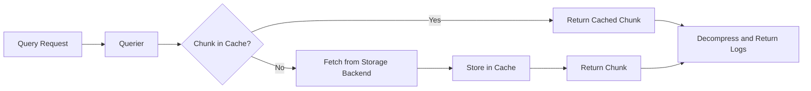

# How to Create Loki Chunk Cache

Author: [nawazdhandala](https://github.com/nawazdhandala)

Tags: Loki, Observability, Caching, Performance

Description: Configure Loki chunk cache with Memcached or Redis to dramatically reduce query latency and storage backend load.

---

Log queries in Grafana Loki can feel sluggish when you are scanning terabytes of compressed chunks from object storage. Every query that touches cold data pays the full round-trip cost to S3, GCS, or your local filesystem. The chunk cache sits between your queriers and the storage backend, keeping recently accessed log chunks in memory so repeated queries return in milliseconds instead of seconds.

This guide walks through chunk cache configuration, backend choices (Memcached vs Redis), sizing strategies, and how to monitor cache effectiveness in production.

## Why Chunk Cache Matters

Loki stores log data in two layers:

1. **Index** - Maps label matchers and time ranges to chunk references.
2. **Chunks** - Compressed blobs of actual log lines.

Without caching, every query fetches chunks from the storage backend. Object stores like S3 have latency measured in tens of milliseconds per request. Multiply that by hundreds of chunks for a single query and you get slow dashboards.

The chunk cache stores decompressed chunk data in memory. When the same time range and labels are queried again, Loki serves results directly from cache.

Benefits:

- Query latency drops from seconds to milliseconds for cached data.
- Storage backend load decreases, reducing egress costs and API rate limit pressure.
- Queriers can handle more concurrent queries with the same resources.

## Cache Hit Flow

Here is how a query moves through Loki when chunk cache is enabled:



The cache lookup happens before any storage backend call. Cache misses still populate the cache, so subsequent queries benefit.

## Choosing a Cache Backend

Loki supports two primary cache backends for chunks:

| Backend | Best For | Strengths | Considerations |
|---------|----------|-----------|----------------|
| **Memcached** | High-throughput production deployments | Simple protocol, battle-tested, excellent for pure key-value lookups | No persistence, no replication (use consistent hashing) |
| **Redis** | Teams already running Redis, need persistence or clustering | Built-in clustering, optional persistence, familiar tooling | Slightly higher latency than Memcached for simple gets |

Both work well. Memcached is the default recommendation for dedicated cache clusters. Redis is a good choice if you already operate Redis and want to consolidate infrastructure.

## Memcached Configuration

Deploy Memcached as a StatefulSet or use a managed service. For production, run at least three replicas with consistent hashing so node failures do not invalidate the entire cache.

### Basic Memcached Loki Configuration

```yaml
# loki-config.yaml
# Chunk cache configuration using Memcached backend

chunk_store_config:
  # Maximum time range to look back when querying
  max_look_back_period: 0s

  # Chunk cache settings
  chunk_cache_config:
    # Use Memcached as the cache backend
    memcached:
      # How long to wait for batch operations
      batch_size: 256
      # Number of parallel fetches
      parallelism: 10

    # Connection settings for Memcached cluster
    memcached_client:
      # Memcached service addresses (use headless service for StatefulSet)
      addresses: dns+memcached.loki.svc.cluster.local:11211
      # Connection timeout
      timeout: 500ms
      # Maximum idle connections per address
      max_idle_conns: 100
      # How long items stay in cache (TTL)
      expiration: 1h
      # Update TTL on read to keep hot items cached
      update_cache_timestamp: true
```

### Memcached StatefulSet Example

```yaml
# memcached-statefulset.yaml
# Memcached cluster for Loki chunk cache

apiVersion: apps/v1
kind: StatefulSet
metadata:
  name: memcached
  namespace: loki
spec:
  serviceName: memcached
  # Run 3 replicas for redundancy with consistent hashing
  replicas: 3
  selector:
    matchLabels:
      app: memcached
  template:
    metadata:
      labels:
        app: memcached
    spec:
      containers:
      - name: memcached
        image: memcached:1.6-alpine
        ports:
        - containerPort: 11211
          name: memcached
        args:
          # Maximum memory usage in megabytes
          - "-m"
          - "4096"
          # Maximum item size (chunks can be several MB)
          - "-I"
          - "5m"
          # Number of threads
          - "-t"
          - "4"
          # Verbose logging for debugging (remove in production)
          # - "-v"
        resources:
          requests:
            memory: "4Gi"
            cpu: "500m"
          limits:
            memory: "5Gi"
            cpu: "2"
---
# Headless service for DNS-based discovery
apiVersion: v1
kind: Service
metadata:
  name: memcached
  namespace: loki
spec:
  clusterIP: None
  ports:
  - port: 11211
    name: memcached
  selector:
    app: memcached
```

## Redis Configuration

Redis works well if you want persistence or already have a Redis cluster. Use Redis Cluster mode for horizontal scaling.

### Basic Redis Loki Configuration

```yaml
# loki-config.yaml
# Chunk cache configuration using Redis backend

chunk_store_config:
  chunk_cache_config:
    # Enable Redis as the cache backend
    redis:
      # Redis endpoint (single instance or cluster)
      endpoint: redis-master.loki.svc.cluster.local:6379
      # Connection timeout
      timeout: 500ms
      # Cache TTL
      expiration: 1h
      # Connection pool size
      pool_size: 100
      # Optional: Redis password from environment variable
      # password: ${REDIS_PASSWORD}
      # Optional: TLS configuration
      # tls_enabled: true
      # Optional: Redis database number (0-15)
      db: 0
```

### Redis Cluster Configuration

For larger deployments, use Redis Cluster mode:

```yaml
# loki-config.yaml
# Chunk cache with Redis Cluster

chunk_store_config:
  chunk_cache_config:
    redis:
      # Use cluster mode for horizontal scaling
      cluster_enabled: true
      # List of cluster seed nodes
      endpoint: redis-cluster.loki.svc.cluster.local:6379
      timeout: 500ms
      expiration: 1h
      pool_size: 100
```

### Redis Deployment Example

```yaml
# redis-deployment.yaml
# Single Redis instance for smaller deployments

apiVersion: apps/v1
kind: Deployment
metadata:
  name: redis-master
  namespace: loki
spec:
  replicas: 1
  selector:
    matchLabels:
      app: redis
  template:
    metadata:
      labels:
        app: redis
    spec:
      containers:
      - name: redis
        image: redis:7-alpine
        ports:
        - containerPort: 6379
        args:
          # Maximum memory limit
          - "--maxmemory"
          - "4gb"
          # Eviction policy when memory is full
          - "--maxmemory-policy"
          - "allkeys-lru"
          # Disable persistence for cache-only use
          - "--save"
          - ""
          - "--appendonly"
          - "no"
        resources:
          requests:
            memory: "4Gi"
            cpu: "500m"
          limits:
            memory: "5Gi"
            cpu: "2"
---
apiVersion: v1
kind: Service
metadata:
  name: redis-master
  namespace: loki
spec:
  ports:
  - port: 6379
  selector:
    app: redis
```

## Cache Size and TTL Configuration

Getting cache sizing right requires understanding your query patterns.

### Sizing Guidelines

| Cluster Size | Recommended Cache Memory | Notes |
|--------------|--------------------------|-------|
| Small (< 100GB/day) | 4-8 GB | Single Memcached/Redis instance |
| Medium (100GB-1TB/day) | 16-32 GB | 3-node Memcached cluster |
| Large (> 1TB/day) | 64+ GB | Dedicated cache tier, consider Redis Cluster |

Formula for rough sizing:

```
Cache Size = (Queries per second) x (Average chunks per query) x (Average chunk size) x (Target cache duration in seconds)
```

For most deployments, start with 4GB per cache node and scale up based on hit rate metrics.

### TTL Configuration

TTL (Time To Live) determines how long chunks stay in cache:

```yaml
# TTL configuration options

chunk_store_config:
  chunk_cache_config:
    memcached_client:
      # Short TTL for high-churn environments
      expiration: 30m

      # Long TTL for stable query patterns
      # expiration: 6h

      # Very long TTL (use with LRU eviction)
      # expiration: 24h
```

TTL recommendations:

- **30 minutes to 1 hour**: Good default for most workloads. Covers repeated queries during incident investigation.
- **6 to 24 hours**: Use when queries often span the same time ranges (dashboards with fixed lookback periods).
- **Match your retention period**: If you retain logs for 7 days, a 24h cache TTL covers a large percentage of queries.

The cache backend handles eviction when memory fills up (LRU in both Memcached and Redis).

## Advanced Configuration Options

### Write-Behind Cache for Ingesters

Ingesters can also benefit from caching recently written chunks:

```yaml
# loki-config.yaml
# Ingester chunk cache (write path)

ingester:
  chunk_encoding: snappy
  chunk_idle_period: 30m
  chunk_retain_period: 1m

# Enable chunk cache for both read and write paths
chunk_store_config:
  chunk_cache_config:
    # Write-back cache settings
    enable_fifocache: true
    fifocache:
      # In-memory cache size
      max_size_bytes: 1073741824  # 1GB
      # Maximum items in cache
      max_size_items: 10000
      # Item TTL
      ttl: 1h

    # External cache (Memcached/Redis) as second layer
    memcached_client:
      addresses: dns+memcached.loki.svc.cluster.local:11211
      expiration: 1h
```

### Background Cache Population

Enable background cache writes to avoid blocking queries:

```yaml
# loki-config.yaml
# Async cache population

chunk_store_config:
  chunk_cache_config:
    memcached_client:
      addresses: dns+memcached.loki.svc.cluster.local:11211
      expiration: 1h

    # Write to cache asynchronously (does not block query response)
    background:
      writeback_goroutines: 10
      writeback_buffer: 10000
```

### Multi-Tier Caching

Combine in-memory FIFO cache with external Memcached for optimal performance:

```yaml
# loki-config.yaml
# Two-tier cache configuration

chunk_store_config:
  chunk_cache_config:
    # First tier: fast in-process cache
    enable_fifocache: true
    fifocache:
      max_size_bytes: 536870912  # 512MB per querier
      ttl: 30m

    # Second tier: shared Memcached cluster
    memcached_client:
      addresses: dns+memcached.loki.svc.cluster.local:11211
      expiration: 2h
```

The querier checks the FIFO cache first, then Memcached, then storage backend.

## Monitoring Cache Hit Rates

Cache effectiveness is meaningless if you cannot measure it. Loki exposes Prometheus metrics for cache operations.

### Key Metrics to Track

```promql
# Cache hit rate (higher is better, aim for > 80%)
sum(rate(loki_cache_hits_total{cache="chunks"}[5m]))
/
sum(rate(loki_cache_fetched_keys_total{cache="chunks"}[5m]))

# Cache miss rate
sum(rate(loki_cache_misses_total{cache="chunks"}[5m]))

# Cache request latency
histogram_quantile(0.99,
  sum(rate(loki_cache_request_duration_seconds_bucket{cache="chunks"}[5m])) by (le)
)

# Bytes fetched from cache vs storage
sum(rate(loki_chunk_fetched_bytes_total{source="cache"}[5m]))
sum(rate(loki_chunk_fetched_bytes_total{source="store"}[5m]))
```

### Grafana Dashboard Panels

Create a dashboard with these panels:

1. **Cache Hit Rate** - Time series showing hit percentage over time.
2. **Cache Latency p99** - Ensure cache lookups stay under 10ms.
3. **Cache Size** - Track memory usage to anticipate scaling needs.
4. **Eviction Rate** - High evictions mean you need more cache memory.

Example dashboard JSON snippet:

```json
{
  "title": "Loki Chunk Cache Hit Rate",
  "type": "stat",
  "targets": [
    {
      "expr": "sum(rate(loki_cache_hits_total{cache=\"chunks\"}[5m])) / sum(rate(loki_cache_fetched_keys_total{cache=\"chunks\"}[5m])) * 100",
      "legendFormat": "Hit Rate %"
    }
  ],
  "fieldConfig": {
    "defaults": {
      "unit": "percent",
      "thresholds": {
        "steps": [
          {"color": "red", "value": 0},
          {"color": "yellow", "value": 60},
          {"color": "green", "value": 80}
        ]
      }
    }
  }
}
```

### Alerting Rules

Set up alerts for cache degradation:

```yaml
# prometheus-rules.yaml
# Cache health alerts

groups:
- name: loki-cache
  rules:
  # Alert when hit rate drops below 50%
  - alert: LokiChunkCacheHitRateLow
    expr: |
      sum(rate(loki_cache_hits_total{cache="chunks"}[15m]))
      /
      sum(rate(loki_cache_fetched_keys_total{cache="chunks"}[15m]))
      < 0.5
    for: 10m
    labels:
      severity: warning
    annotations:
      summary: "Loki chunk cache hit rate is below 50%"
      description: "Cache hit rate is {{ $value | humanizePercentage }}. Consider increasing cache size or TTL."

  # Alert when cache latency spikes
  - alert: LokiChunkCacheLatencyHigh
    expr: |
      histogram_quantile(0.99,
        sum(rate(loki_cache_request_duration_seconds_bucket{cache="chunks"}[5m])) by (le)
      ) > 0.1
    for: 5m
    labels:
      severity: warning
    annotations:
      summary: "Loki chunk cache p99 latency exceeds 100ms"
      description: "Cache latency is {{ $value | humanizeDuration }}. Check network connectivity to cache nodes."
```

## Troubleshooting Common Issues

### Low Hit Rate Despite Large Cache

Symptoms: Cache is not full but hit rate is below 50%.

Causes and fixes:

1. **Short TTL** - Increase expiration time to match query patterns.
2. **High cardinality queries** - Queries with many unique label combinations rarely hit cache. Consider query optimization.
3. **Time range mismatch** - Queries use different time boundaries each time. Align dashboard time ranges to cache-friendly intervals.

### Cache Evictions Spiking

Symptoms: High eviction rate, cache memory constantly full.

Fixes:

1. Add more cache nodes or increase memory per node.
2. Reduce TTL to prioritize recent chunks.
3. Implement query-based cache segmentation (separate caches for different tenants).

### Memcached Connection Errors

Symptoms: `connection refused` or timeout errors in Loki logs.

Fixes:

1. Verify Memcached pods are running: `kubectl get pods -n loki -l app=memcached`
2. Check DNS resolution: `kubectl exec -n loki <querier-pod> -- nslookup memcached`
3. Increase `max_idle_conns` if seeing connection churn.

## Complete Production Configuration

Here is a complete Loki configuration with chunk cache enabled for a medium-sized deployment:

```yaml
# loki-config.yaml
# Production configuration with Memcached chunk cache

auth_enabled: true

server:
  http_listen_port: 3100
  grpc_listen_port: 9096

common:
  path_prefix: /loki
  storage:
    s3:
      endpoint: s3.amazonaws.com
      bucketnames: my-loki-chunks
      region: us-east-1
      access_key_id: ${AWS_ACCESS_KEY_ID}
      secret_access_key: ${AWS_SECRET_ACCESS_KEY}
  replication_factor: 3

schema_config:
  configs:
    - from: 2024-01-01
      store: tsdb
      object_store: s3
      schema: v13
      index:
        prefix: index_
        period: 24h

# Chunk store with caching
chunk_store_config:
  # In-memory first-level cache
  chunk_cache_config:
    enable_fifocache: true
    fifocache:
      max_size_bytes: 536870912  # 512MB
      ttl: 30m

    # Memcached second-level cache
    memcached:
      batch_size: 256
      parallelism: 10
    memcached_client:
      addresses: dns+memcached.loki.svc.cluster.local:11211
      timeout: 500ms
      max_idle_conns: 100
      expiration: 2h
      update_cache_timestamp: true

    # Async cache writes
    background:
      writeback_goroutines: 10
      writeback_buffer: 10000

# Query settings
querier:
  max_concurrent: 10
  query_ingesters_within: 3h

query_range:
  parallelise_shardable_queries: true
  cache_results: true
  results_cache:
    cache:
      memcached_client:
        addresses: dns+memcached.loki.svc.cluster.local:11211
        timeout: 500ms
        expiration: 1h

# Limits
limits_config:
  ingestion_rate_mb: 10
  ingestion_burst_size_mb: 20
  max_query_parallelism: 32
  max_query_series: 10000
```

## Summary

Chunk cache transforms Loki query performance from tolerable to fast. The key decisions are:

1. **Choose your backend** - Memcached for simplicity and throughput, Redis if you need clustering or already run Redis.
2. **Size appropriately** - Start with 4GB per node, scale based on hit rate metrics.
3. **Set TTL to match query patterns** - 1-2 hours covers most incident investigation workflows.
4. **Monitor continuously** - Track hit rate, latency, and eviction rate. Alert when they degrade.

A well-tuned chunk cache can improve query latency by 10x and reduce storage backend costs significantly. The configuration takes an hour to set up and pays dividends every time someone opens a Grafana dashboard.

If you are running Loki at scale, chunk caching is not optional. It is how you make log queries feel instant instead of like waiting for a slow API.
