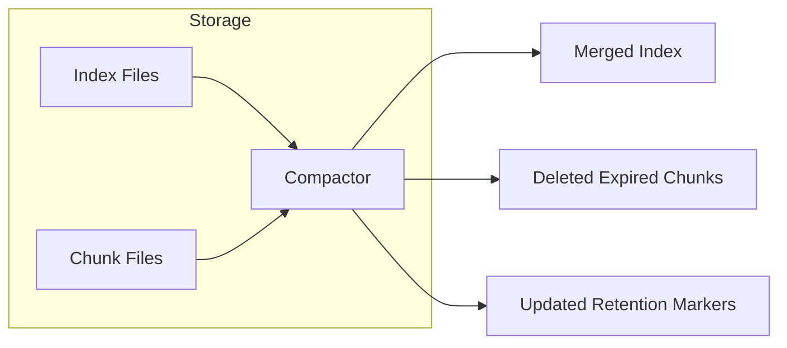
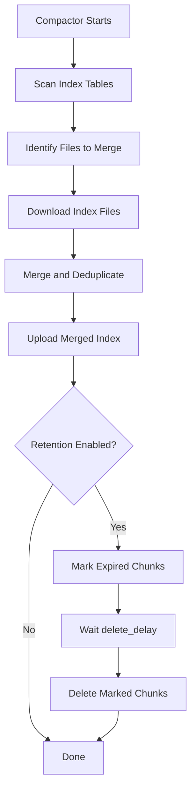
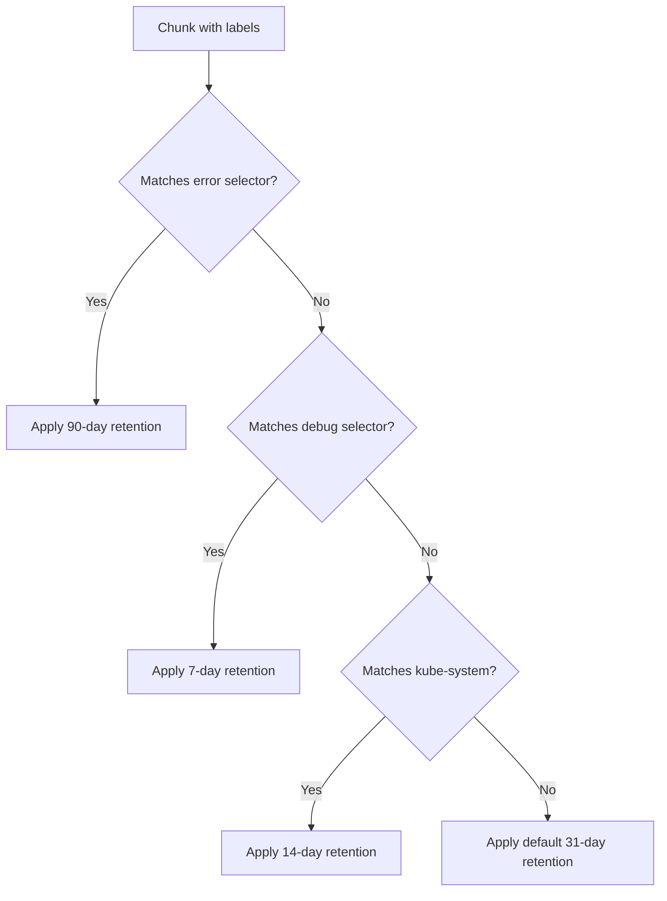

# How to Create Loki Compactor Configuration

Author: [nawazdhandala](https://github.com/nawazdhandala)

Tags: Loki, Observability, Compaction, Performance

Description: A practical guide to configuring Loki's compactor for index compaction, retention enforcement, and chunk deletion to keep your log storage lean and fast.

---

Loki stores logs in two pieces: an index that maps labels to chunk references, and the chunks themselves containing the actual log data. Over time, both accumulate. The compactor is the component that cleans house. It merges index files, enforces retention policies, and deletes expired chunks. Without it, your object storage bill grows forever and query performance degrades.

This post walks through the compactor's configuration options, shows production-ready YAML examples, and explains how each setting affects storage and query behavior.

## What the Compactor Does

The compactor runs as either a dedicated service or embedded inside an all-in-one Loki deployment. It performs three main jobs:

1. **Index Compaction:** Merges small index files into larger ones, reducing the number of files the querier must scan.
2. **Retention Enforcement:** Marks chunks for deletion based on your retention period.
3. **Chunk Deletion:** Removes chunks that have been marked for deletion after a configurable delay.



## Basic Compactor Configuration

The compactor lives under the `compactor` key in your Loki config. Here is a minimal setup:

```yaml
compactor:
  working_directory: /loki/compactor
  compaction_interval: 10m
  retention_enabled: true
  retention_delete_delay: 2h
  retention_delete_worker_count: 150
  delete_request_store: filesystem
```

Let me break down each field:

| Field | Purpose | Recommended Value |
|-------|---------|-------------------|
| `working_directory` | Local path where compactor stores temporary files during processing | Dedicated volume with fast I/O |
| `compaction_interval` | How often the compactor runs its merge cycle | 10m for active clusters, 1h for low-volume |
| `retention_enabled` | Toggle retention enforcement on or off | `true` if you want automatic cleanup |
| `retention_delete_delay` | Grace period before marked chunks are deleted | 2h minimum to allow recovery from mistakes |
| `retention_delete_worker_count` | Parallel workers for deletion | 150 for large clusters, 50 for small |

## Compactor Workflow

Understanding the compactor's workflow helps you tune it properly.



The compactor acquires a lock before starting. In distributed mode, only one compactor instance runs at a time. This prevents duplicate work and index corruption.

## Production Configuration Example

Here is a complete compactor configuration for a production cluster running on Kubernetes with S3-compatible object storage:

```yaml
compactor:
  working_directory: /data/loki/compactor
  compaction_interval: 10m
  retention_enabled: true
  retention_delete_delay: 2h
  retention_delete_worker_count: 150
  delete_request_store: s3
  delete_request_cancel_period: 24h
  max_compaction_parallelism: 4

limits_config:
  retention_period: 744h  # 31 days

storage_config:
  boltdb_shipper:
    active_index_directory: /data/loki/index
    cache_location: /data/loki/index_cache
    shared_store: s3

  aws:
    s3: s3://your-region/your-bucket
    s3forcepathstyle: true
```

### Key Settings Explained

**compaction_interval: 10m**

Running compaction every 10 minutes keeps index fragmentation low. If your cluster ingests logs at a high rate, this frequency prevents the querier from scanning thousands of small files.

**retention_delete_delay: 2h**

The two-hour delay gives you a window to cancel accidental deletions. If someone misconfigures retention and realizes it within two hours, they can still recover.

**retention_delete_worker_count: 150**

Deletion is I/O bound. More workers mean faster cleanup, but too many can overwhelm your object storage rate limits. Start at 150 and adjust based on your provider's limits.

**max_compaction_parallelism: 4**

Controls how many tables the compactor processes in parallel. Higher values speed up compaction but increase memory usage.

## Configuring Retention Per Tenant

Loki supports multi-tenant deployments where each tenant can have different retention periods. Configure this in `limits_config`:

```yaml
limits_config:
  retention_period: 744h  # Default: 31 days

overrides:
  tenant-a:
    retention_period: 2160h  # 90 days
  tenant-b:
    retention_period: 168h   # 7 days
  tenant-c:
    retention_period: 8760h  # 365 days
```

The compactor respects these per-tenant overrides when marking chunks for deletion.

## Stream-Level Retention

Starting with Loki 2.4, you can define retention rules based on label selectors. This lets you keep debug logs for 7 days while retaining error logs for 90 days:

```yaml
limits_config:
  retention_period: 744h  # Default fallback
  retention_stream:
    - selector: '{level="error"}'
      priority: 1
      period: 2160h  # 90 days
    - selector: '{level="debug"}'
      priority: 2
      period: 168h   # 7 days
    - selector: '{namespace="kube-system"}'
      priority: 3
      period: 336h   # 14 days
```

Rules are evaluated in priority order. The first matching rule wins. Chunks that match no rule fall back to `retention_period`.



## Running Compactor in Kubernetes

Deploy the compactor as a StatefulSet with a persistent volume for its working directory:

```yaml
apiVersion: apps/v1
kind: StatefulSet
metadata:
  name: loki-compactor
spec:
  serviceName: loki-compactor
  replicas: 1  # Only one compactor runs at a time
  selector:
    matchLabels:
      app: loki-compactor
  template:
    metadata:
      labels:
        app: loki-compactor
    spec:
      containers:
        - name: compactor
          image: grafana/loki:2.9.0
          args:
            - -config.file=/etc/loki/config.yaml
            - -target=compactor
          volumeMounts:
            - name: config
              mountPath: /etc/loki
            - name: data
              mountPath: /data/loki
          resources:
            requests:
              memory: 2Gi
              cpu: 500m
            limits:
              memory: 4Gi
              cpu: 2
      volumes:
        - name: config
          configMap:
            name: loki-config
  volumeClaimTemplates:
    - metadata:
        name: data
      spec:
        accessModes: ["ReadWriteOnce"]
        resources:
          requests:
            storage: 50Gi
```

The compactor needs enough local disk to download and merge index files. Size the PVC based on your index volume. A good starting point is 2x the size of your largest index table.

## Monitoring the Compactor

The compactor exposes Prometheus metrics. Here are the ones worth alerting on:

| Metric | What It Tells You |
|--------|-------------------|
| `loki_compactor_running` | Whether the compactor is active (1) or idle (0) |
| `loki_compactor_compact_tables_operation_duration_seconds` | Time spent on each compaction cycle |
| `loki_compactor_retention_marks_created_total` | Chunks marked for deletion |
| `loki_compactor_retention_marks_deleted_total` | Chunks actually deleted |
| `loki_compactor_delete_requests_processed_total` | Manual deletion requests processed |

Set up alerts for:

- Compactor not running for more than 2x `compaction_interval`
- Compaction duration exceeding the interval (falling behind)
- Delete requests stuck in pending state

```yaml
groups:
  - name: loki-compactor
    rules:
      - alert: CompactorNotRunning
        expr: loki_compactor_running == 0
        for: 30m
        labels:
          severity: warning
        annotations:
          summary: Loki compactor has not run in 30 minutes

      - alert: CompactionFallingBehind
        expr: |
          rate(loki_compactor_compact_tables_operation_duration_seconds_sum[1h])
          > 600
        for: 1h
        labels:
          severity: critical
        annotations:
          summary: Compaction is taking longer than expected
```

## Troubleshooting Common Issues

### Compactor Stuck on Lock

The compactor uses a distributed lock stored in your object storage. If a previous compactor crashed without releasing the lock, the new instance waits forever.

Fix: Delete the lock file manually from your object storage bucket:

```bash
# For S3
aws s3 rm s3://your-bucket/loki/compactor/lock

# For GCS
gsutil rm gs://your-bucket/loki/compactor/lock
```

### Retention Not Deleting Chunks

Check these common causes:

1. `retention_enabled` is set to `false`
2. `retention_delete_delay` has not elapsed since marking
3. The compactor cannot write to the delete request store
4. Per-tenant overrides are extending retention beyond expected

Enable debug logging on the compactor to see what it is doing:

```yaml
server:
  log_level: debug
```

### High Memory Usage During Compaction

Large index tables require significant memory to merge. Reduce `max_compaction_parallelism` or increase the compactor's memory limit.

Alternatively, run compaction more frequently so each cycle handles smaller batches.

## Best Practices

1. **Run compaction frequently.** Every 10 minutes prevents index bloat and keeps queries fast.

2. **Set a reasonable delete delay.** Two hours is enough time to catch mistakes without delaying cleanup too long.

3. **Use stream-level retention.** Keep important logs longer without paying to store debug noise.

4. **Monitor compactor metrics.** A silent compactor failure leads to unbounded storage growth.

5. **Test retention in staging.** Verify that your selectors match the expected streams before applying to production.

6. **Size the working directory generously.** Running out of local disk during compaction corrupts the operation.

## Putting It Together

Here is a complete Loki configuration with compactor settings tuned for a medium-sized production deployment:

```yaml
auth_enabled: true

server:
  http_listen_port: 3100

common:
  path_prefix: /data/loki
  storage:
    s3:
      s3: s3://us-east-1/loki-chunks
      s3forcepathstyle: true
  replication_factor: 3

schema_config:
  configs:
    - from: 2024-01-01
      store: tsdb
      object_store: s3
      schema: v13
      index:
        prefix: index_
        period: 24h

compactor:
  working_directory: /data/loki/compactor
  compaction_interval: 10m
  retention_enabled: true
  retention_delete_delay: 2h
  retention_delete_worker_count: 150
  max_compaction_parallelism: 4
  delete_request_store: s3

limits_config:
  retention_period: 744h
  retention_stream:
    - selector: '{level="error"}'
      priority: 1
      period: 2160h
    - selector: '{level="debug"}'
      priority: 2
      period: 168h
    - selector: '{env="production"}'
      priority: 3
      period: 1440h
```

The compactor is one of those components you configure once and forget about until your storage bill arrives. Get it right from the start, monitor it properly, and your Loki cluster will stay lean and responsive for years.

## Related Resources

- [Loki Documentation: Compactor](https://grafana.com/docs/loki/latest/operations/storage/compactor/)
- [Grafana Loki Storage Retention](https://grafana.com/docs/loki/latest/operations/storage/retention/)
- [Three Pillars of Observability](https://oneuptime.com/blog/post/2025-08-20-three-pillars-of-observability-logs-metrics-traces/view)
