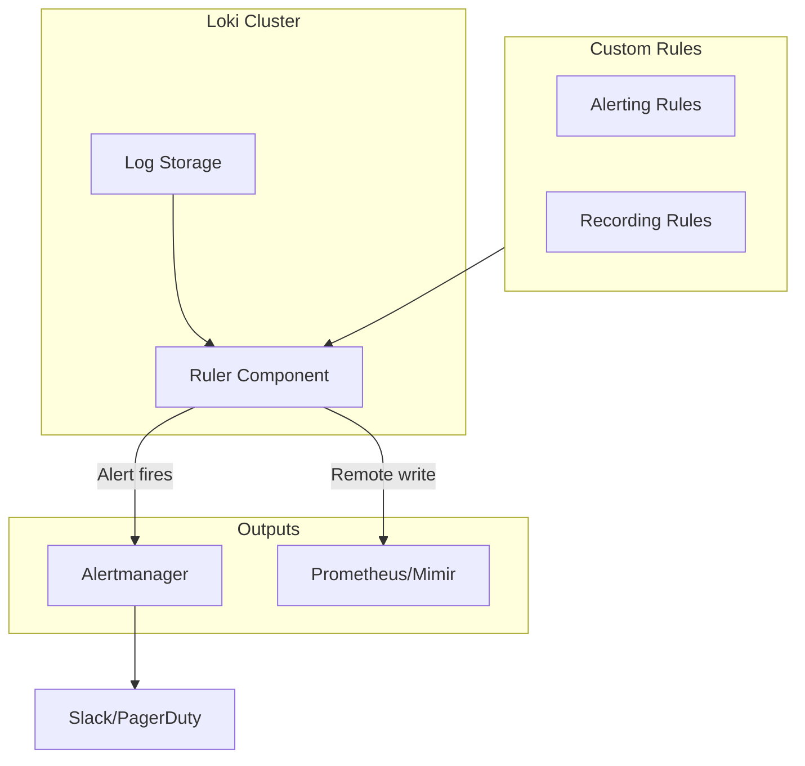

# How to Build Loki Custom Rules

Author: [nawazdhandala](https://www.github.com/nawazdhandala)

Tags: Loki, Logging, Grafana, Alerting, Observability

Description: Create custom Loki alerting and recording rules with LogQL for proactive log-based monitoring and metrics generation.

---

Grafana Loki's ruler component lets you define custom rules that evaluate LogQL queries on a schedule. These rules fall into two categories: alerting rules that fire notifications when conditions are met, and recording rules that pre-compute expensive queries into metrics. This guide walks you through building both types of custom rules for production environments.

## How Loki Rules Work

The Loki ruler is a separate component that periodically evaluates LogQL expressions against your log data. Here is the high-level flow:



When you deploy custom rules, the ruler loads them from storage (local filesystem, S3, or a ConfigMap in Kubernetes). It then evaluates each rule at the configured interval and either fires alerts or writes metrics to a remote time series database.

## Enabling the Ruler

Before creating rules, you need to enable the ruler in your Loki configuration.

The following configuration enables the ruler with local storage and connects it to Alertmanager for notifications:

```yaml
# loki-config.yaml
ruler:
  # Enable the rules API for dynamic rule management
  enable_api: true

  # Where to store rule files
  storage:
    type: local
    local:
      directory: /loki/rules

  # How often to evaluate rules (default: 1m)
  evaluation_interval: 1m

  # Alertmanager endpoint for sending alerts
  alertmanager_url: http://alertmanager:9093

  # Enable remote write for recording rules
  remote_write:
    enabled: true
    client:
      url: http://prometheus:9090/api/v1/write

  # Ring configuration for high availability
  ring:
    kvstore:
      store: inmemory
```

If you are running Prometheus, make sure to start it with the remote write receiver enabled:

```bash
prometheus --enable-feature=remote-write-receiver
```

## Rule File Structure

Loki rules use a YAML format similar to Prometheus. Each rule file contains one or more groups, and each group contains one or more rules.

The directory structure follows this pattern:

```
/loki/rules/
  <tenant_id>/
    alerts.yaml
    recording.yaml
```

For single-tenant deployments, use `fake` as the tenant ID. Here is the basic structure of a rule file:

```yaml
# /loki/rules/fake/my-rules.yaml
groups:
  - name: my_rule_group
    # Evaluation interval for this group (optional, uses global default)
    interval: 1m
    rules:
      # Alerting and recording rules go here
```

## Building Alerting Rules

Alerting rules evaluate a LogQL metric query and fire an alert when the result exceeds a threshold.

### Basic Error Rate Alert

This rule fires when the error rate exceeds 10 errors per second:

```yaml
groups:
  - name: error_alerts
    interval: 1m
    rules:
      - alert: HighErrorRate
        # LogQL metric query that returns a number
        expr: |
          sum(rate(
            {namespace="production", app=~"api.*"} |= "error" [5m]
          )) > 10
        # Wait this long before firing (prevents flapping)
        for: 5m
        # Labels attached to the alert
        labels:
          severity: critical
          team: backend
        # Human-readable information
        annotations:
          summary: "High error rate in production API"
          description: "Error rate is {{ $value | printf \"%.2f\" }} errors/sec"
```

### HTTP Status Code Monitoring

Parse JSON logs to alert on specific HTTP status codes:

```yaml
groups:
  - name: http_alerts
    interval: 1m
    rules:
      # Alert when 5xx errors exceed 1% of total requests
      - alert: High5xxErrorRate
        expr: |
          (
            sum(rate({app="api"} | json | status_code >= 500 [5m]))
            /
            sum(rate({app="api"} | json | status_code > 0 [5m]))
          ) > 0.01
        for: 5m
        labels:
          severity: critical
        annotations:
          summary: "5xx error rate above 1%"
          description: "Current rate: {{ $value | printf \"%.2f%%\" }}"

      # Alert on authentication failures
      - alert: AuthenticationFailures
        expr: |
          sum(rate({app="auth"} | json | status_code = 401 [5m])) > 5
        for: 3m
        labels:
          severity: warning
        annotations:
          summary: "High rate of authentication failures"
```

### Service Health Checks

Detect when services stop producing logs:

```yaml
groups:
  - name: health_checks
    interval: 1m
    rules:
      # Alert if no logs received from a critical service
      - alert: ServiceNotLogging
        expr: |
          absent_over_time(
            {namespace="production", app="payment-service"}[10m]
          )
        for: 5m
        labels:
          severity: critical
        annotations:
          summary: "Payment service has stopped logging"
          description: "No logs received for 10 minutes"

      # Detect crash loops by counting restarts
      - alert: ServiceCrashLoop
        expr: |
          count_over_time(
            {namespace="production"} |= "Starting application" [15m]
          ) by (app) > 5
        for: 1m
        labels:
          severity: warning
        annotations:
          summary: "{{ $labels.app }} is restarting frequently"
```

## Building Recording Rules

Recording rules pre-compute expensive LogQL queries and store the results as time series metrics. This dramatically speeds up dashboards and allows you to create alerts on pre-computed data.

### Converting Logs to Metrics

This example creates metrics from log data for faster dashboard queries:

```yaml
groups:
  - name: log_metrics
    interval: 1m
    rules:
      # Request rate by service
      - record: log:requests:rate5m
        expr: |
          sum by (app) (
            rate({namespace="production"} | json | endpoint != "" [5m])
          )

      # Error rate by service
      - record: log:errors:rate5m
        expr: |
          sum by (app) (
            rate({namespace="production"} | json | level = "error" [5m])
          )

      # Error ratio (errors / total requests)
      - record: log:error_ratio:5m
        expr: |
          (
            sum by (app) (rate({namespace="production"} | json | level = "error" [5m]))
            /
            sum by (app) (rate({namespace="production"} | json [5m]))
          )
```

### Latency Percentiles

Extract latency metrics from logs that contain duration information:

```yaml
groups:
  - name: latency_metrics
    interval: 1m
    rules:
      # P50 latency
      - record: log:latency:p50_5m
        expr: |
          quantile_over_time(0.50,
            {namespace="production"} | json | unwrap duration_ms [5m]
          ) by (app)

      # P95 latency
      - record: log:latency:p95_5m
        expr: |
          quantile_over_time(0.95,
            {namespace="production"} | json | unwrap duration_ms [5m]
          ) by (app)

      # P99 latency
      - record: log:latency:p99_5m
        expr: |
          quantile_over_time(0.99,
            {namespace="production"} | json | unwrap duration_ms [5m]
          ) by (app)
```

## Deploying Rules in Kubernetes

For Kubernetes deployments, store rules in a ConfigMap and mount it to the Loki pod.

Create the ConfigMap with your rule definitions:

```yaml
apiVersion: v1
kind: ConfigMap
metadata:
  name: loki-rules
  namespace: loki
data:
  alerts.yaml: |
    groups:
      - name: production_alerts
        rules:
          - alert: HighErrorRate
            expr: sum(rate({namespace="production"} |= "error" [5m])) > 10
            for: 5m
            labels:
              severity: critical
            annotations:
              summary: "High error rate detected"

  recording.yaml: |
    groups:
      - name: production_metrics
        rules:
          - record: log:error_rate:5m
            expr: sum by (app) (rate({namespace="production"} |= "error" [5m]))
```

Mount the ConfigMap in your Loki deployment:

```yaml
apiVersion: apps/v1
kind: Deployment
metadata:
  name: loki
spec:
  template:
    spec:
      containers:
        - name: loki
          volumeMounts:
            - name: rules
              mountPath: /loki/rules/fake
      volumes:
        - name: rules
          configMap:
            name: loki-rules
```

## Managing Rules via API

If you enabled `enable_api: true`, you can manage rules dynamically through the HTTP API.

List all configured rules:

```bash
curl http://loki:3100/loki/api/v1/rules
```

Create or update a rule group:

```bash
curl -X POST http://loki:3100/loki/api/v1/rules/fake \
  -H "Content-Type: application/yaml" \
  -d '
groups:
  - name: dynamic_alerts
    rules:
      - alert: TestAlert
        expr: sum(rate({app="test"} [5m])) > 0
        labels:
          severity: info
'
```

Delete a rule group:

```bash
curl -X DELETE http://loki:3100/loki/api/v1/rules/fake/dynamic_alerts
```

## Best Practices

When building custom rules, keep these guidelines in mind:

**Choose appropriate intervals.** Use shorter intervals (30s-1m) for alerting rules that need quick detection. Use longer intervals (5m) for recording rules that feed dashboards.

**Avoid high cardinality labels.** Do not use unbounded labels like user_id or request_id in recording rules. This creates too many time series and impacts performance.

**Use meaningful names.** Follow a consistent naming convention like `log:<metric>:<aggregation>` for recording rules. For alerts, use descriptive names like `PaymentServiceHighLatency` rather than generic names.

**Test queries first.** Always test your LogQL queries in Grafana Explore before deploying them as rules. This helps catch syntax errors and verify the query returns expected results.

**Set appropriate `for` durations.** The `for` clause prevents alerts from firing on brief spikes. Use at least 5 minutes for most alerts to reduce noise.

## Conclusion

Loki custom rules transform your log data into actionable alerts and queryable metrics. Alerting rules let you catch issues proactively, while recording rules speed up dashboards and enable long-term metric storage from logs.

Start with a few high-value rules for error rates and service health, then expand based on your observability needs. The combination of alerting and recording rules gives you the best of both worlds: real-time notifications and fast historical queries.
