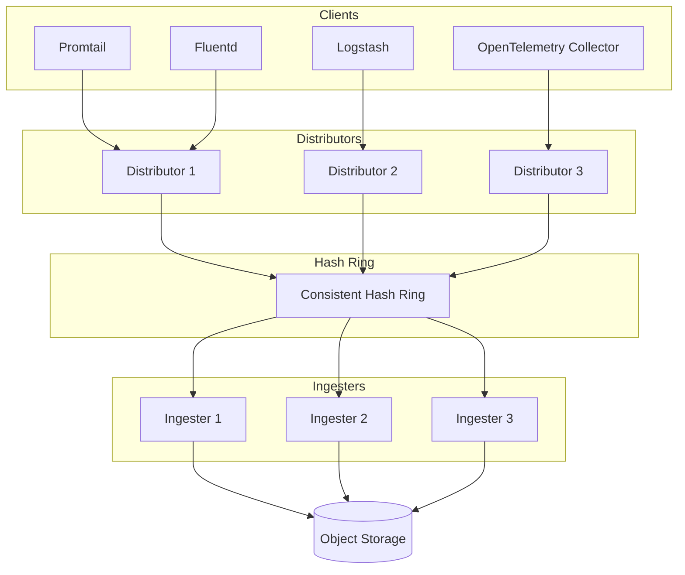
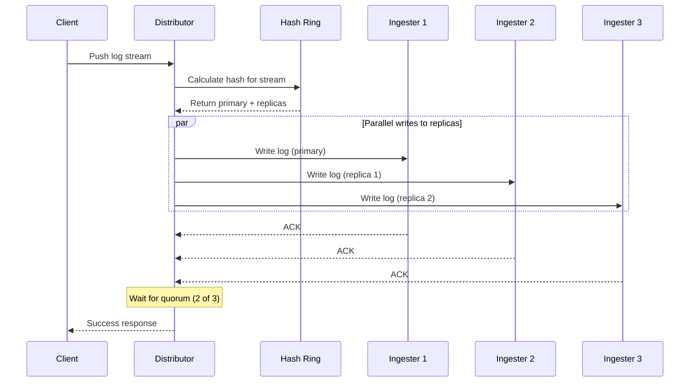
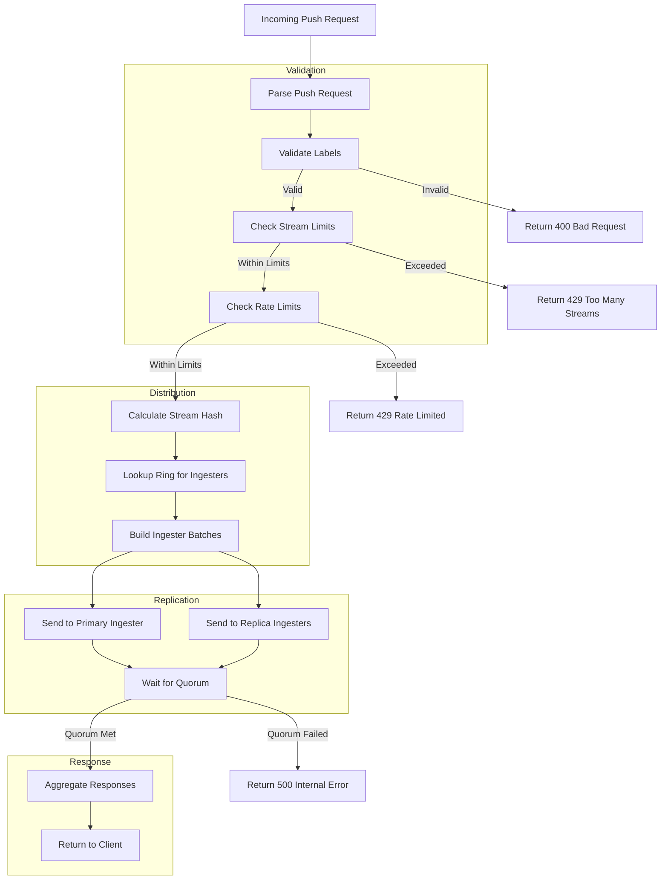

# How to Build Loki Distributor Configuration

Author: [nawazdhandala](https://github.com/nawazdhandala)

Tags: Loki, Observability, Ingestion, Performance

Description: A comprehensive guide to configuring the Loki distributor component for efficient log ingestion, rate limiting, and high availability.

---

The distributor is the first component in the Loki write path that receives incoming log streams from clients. It validates, preprocesses, and forwards logs to the appropriate ingesters based on consistent hashing. Proper configuration of the distributor is essential for achieving reliable and performant log ingestion at scale.

## Understanding the Distributor Architecture

Before diving into configuration, let us understand how the distributor fits into the Loki architecture.



The distributor receives logs via HTTP or gRPC, validates them against configured limits, and uses the hash ring to determine which ingesters should receive each log stream. With replication enabled, logs are sent to multiple ingesters for durability.

## Basic Distributor Configuration

Here is a foundational distributor configuration:

```yaml
# loki-config.yaml
# Basic distributor configuration for log ingestion

distributor:
  # Ring configuration for discovering ingesters
  ring:
    # Key-value store for the hash ring
    kvstore:
      # Store type: consul, etcd, inmemory, or memberlist
      store: memberlist

    # Heartbeat timeout before marking an ingester as unhealthy
    heartbeat_timeout: 1m

  # Maximum number of write requests per distributor
  # Set to 0 for unlimited
  rate_store:
    max_request_parallelism: 200

# Server configuration for receiving logs
server:
  # HTTP port for push API
  http_listen_port: 3100

  # gRPC port for internal communication
  grpc_listen_port: 9095

  # Maximum message size for incoming logs
  grpc_server_max_recv_msg_size: 104857600  # 100MB
  grpc_server_max_send_msg_size: 104857600  # 100MB
```

## Ring Configuration for Ingester Discovery

The ring is crucial for the distributor to discover and communicate with ingesters. Here are different ring backend configurations:

### Memberlist Configuration (Recommended for Kubernetes)

```yaml
# memberlist-ring-config.yaml
# Memberlist provides gossip-based service discovery

distributor:
  ring:
    kvstore:
      store: memberlist

# Memberlist configuration
memberlist:
  # Node name (defaults to hostname)
  node_name: ${HOSTNAME}

  # Bind address for memberlist
  bind_addr:
    - 0.0.0.0

  # Port for memberlist communication
  bind_port: 7946

  # Initial nodes to join
  # In Kubernetes, use headless service DNS
  join_members:
    - loki-memberlist.loki.svc.cluster.local:7946

  # Timeout for establishing connections
  stream_timeout: 10s

  # Number of retries for failed messages
  retransmit_multiplier: 4

  # Interval between gossip messages
  gossip_interval: 1s

  # Number of nodes to gossip with per interval
  gossip_nodes: 3

  # Dead node reclaim time
  dead_node_reclaim_time: 30s

  # Left ingesters timeout before removal
  left_ingesters_timeout: 5m
```

### Consul Backend Configuration

```yaml
# consul-ring-config.yaml
# Consul provides strong consistency for the hash ring

distributor:
  ring:
    kvstore:
      store: consul

      consul:
        # Consul server address
        host: consul.service.consul:8500

        # ACL token for authentication
        acl_token: ${CONSUL_ACL_TOKEN}

        # HTTP client timeout
        http_client_timeout: 20s

        # Consistency mode: default, consistent, or stale
        consistent_reads: true

        # Watch rate limit
        watch_rate_limit: 1
        watch_burst_size: 1
```

### etcd Backend Configuration

```yaml
# etcd-ring-config.yaml
# etcd provides distributed key-value storage for the ring

distributor:
  ring:
    kvstore:
      store: etcd

      etcd:
        # etcd endpoints
        endpoints:
          - etcd-0.etcd.loki.svc.cluster.local:2379
          - etcd-1.etcd.loki.svc.cluster.local:2379
          - etcd-2.etcd.loki.svc.cluster.local:2379

        # Dial timeout
        dial_timeout: 10s

        # Maximum retries
        max_retries: 10

        # TLS configuration
        tls_enabled: true
        tls_cert_path: /etc/loki/certs/etcd-client.crt
        tls_key_path: /etc/loki/certs/etcd-client.key
        tls_ca_path: /etc/loki/certs/etcd-ca.crt
```

## Replication Factor Settings

Replication ensures log durability by writing to multiple ingesters. Configure it carefully based on your availability requirements:

```yaml
# replication-config.yaml
# Replication settings for high availability

ingester:
  # Number of ingesters to replicate each log stream to
  # Minimum recommended value is 3 for production
  lifecycler:
    ring:
      kvstore:
        store: memberlist

      # Replication factor determines write redundancy
      # RF=3 means logs are written to 3 ingesters
      replication_factor: 3

distributor:
  ring:
    kvstore:
      store: memberlist

# Limits configuration for replication behavior
limits_config:
  # Maximum number of replicas that can fail during writes
  # With RF=3, max_global_streams_per_user allows 1 failure
  # Formula: replication_factor - max_failures >= quorum
  # Quorum = floor(replication_factor / 2) + 1

  # For RF=3: quorum = 2, so 1 failure is tolerable
  # For RF=5: quorum = 3, so 2 failures are tolerable

  # Replication tracking
  ingestion_rate_strategy: global
```

Here is a diagram showing how replication works:



## Rate Limiting and Ingestion Limits

Protecting your Loki cluster from overload is critical. Configure these limits based on your capacity:

```yaml
# rate-limiting-config.yaml
# Comprehensive rate limiting configuration

limits_config:
  # Per-tenant ingestion rate limit in MB/s
  # This is the maximum rate at which logs can be ingested
  ingestion_rate_mb: 10

  # Per-tenant burst size in MB
  # Allows temporary spikes above the rate limit
  ingestion_burst_size_mb: 20

  # Maximum number of active streams per tenant
  # Each unique label set creates a stream
  max_streams_per_user: 10000

  # Global limit across all distributors
  # Requires ingestion_rate_strategy: global
  max_global_streams_per_user: 50000

  # Maximum number of label names per stream
  max_label_names_per_series: 30

  # Maximum length of a label name
  max_label_name_length: 1024

  # Maximum length of a label value
  max_label_value_length: 2048

  # Maximum number of entries per push request
  max_entries_limit_per_query: 5000

  # Maximum size of a single log line in bytes
  max_line_size: 262144  # 256KB

  # Strategy for rate limiting
  # local: per-distributor limits
  # global: cluster-wide limits (recommended)
  ingestion_rate_strategy: global

  # Per-stream rate limit in bytes/second
  per_stream_rate_limit: 5MB

  # Per-stream burst size
  per_stream_rate_limit_burst: 15MB

# Distributor-specific limits
distributor:
  # Maximum recv message size
  max_recv_msg_size: 104857600  # 100MB

  # Rate store refresh interval for global limits
  rate_store:
    max_request_parallelism: 200

  # Health check for ingesters
  health_check_ingesters: true
```

## Per-Tenant Overrides

Different tenants may require different limits. Use runtime configuration for per-tenant overrides:

```yaml
# runtime-config.yaml
# Per-tenant limit overrides

overrides:
  # High-volume tenant with relaxed limits
  tenant-production:
    ingestion_rate_mb: 50
    ingestion_burst_size_mb: 100
    max_streams_per_user: 100000
    max_global_streams_per_user: 500000
    per_stream_rate_limit: 10MB
    per_stream_rate_limit_burst: 30MB

  # Development tenant with strict limits
  tenant-development:
    ingestion_rate_mb: 5
    ingestion_burst_size_mb: 10
    max_streams_per_user: 5000
    max_global_streams_per_user: 10000
    per_stream_rate_limit: 2MB
    per_stream_rate_limit_burst: 5MB

  # Default limits for unspecified tenants
  tenant-default:
    ingestion_rate_mb: 10
    ingestion_burst_size_mb: 20
    max_streams_per_user: 10000
```

Reference this file in your main configuration:

```yaml
# loki-config.yaml
# Reference runtime configuration for per-tenant overrides

runtime_config:
  # Path to runtime configuration file
  file: /etc/loki/runtime-config.yaml

  # How often to reload the configuration
  period: 10s
```

## Distributor Write Path Flow

Understanding the write path helps in troubleshooting and optimization:



## High Availability Configuration

For production deployments, configure multiple distributors behind a load balancer:

```yaml
# ha-distributor-config.yaml
# High availability distributor configuration

# Run multiple distributor instances
# Each distributor is stateless and can handle any request

distributor:
  ring:
    kvstore:
      store: memberlist

    # Heartbeat configuration
    heartbeat_period: 5s
    heartbeat_timeout: 1m

# Enable health checks
server:
  http_listen_port: 3100
  grpc_listen_port: 9095

  # Health check endpoints
  # /ready - returns 200 when ready to accept traffic
  # /metrics - Prometheus metrics endpoint

  # Graceful shutdown
  graceful_shutdown_timeout: 30s

# Ingester client configuration
ingester_client:
  # Pool configuration for ingester connections
  pool_config:
    # Health check period
    health_check_ingesters: true

    # Client cleanup period
    client_cleanup_period: 15s

  # gRPC client configuration
  grpc_client_config:
    # Maximum send message size
    max_send_msg_size: 104857600

    # Connection backoff
    backoff_on_ratelimits: true

    # Retry configuration
    max_retries: 5

    # Timeout for individual requests
    rate_limit_burst: 0
```

## Kubernetes Deployment Example

Here is a complete Kubernetes deployment for the distributor:

```yaml
# kubernetes-distributor.yaml
# Kubernetes deployment for Loki distributor

apiVersion: apps/v1
kind: Deployment
metadata:
  name: loki-distributor
  namespace: loki
  labels:
    app: loki
    component: distributor
spec:
  replicas: 3
  selector:
    matchLabels:
      app: loki
      component: distributor
  template:
    metadata:
      labels:
        app: loki
        component: distributor
    spec:
      containers:
        - name: distributor
          image: grafana/loki:2.9.0
          args:
            - -config.file=/etc/loki/config.yaml
            - -target=distributor
          ports:
            - name: http
              containerPort: 3100
            - name: grpc
              containerPort: 9095
            - name: memberlist
              containerPort: 7946
          resources:
            requests:
              cpu: 500m
              memory: 512Mi
            limits:
              cpu: 2000m
              memory: 2Gi
          readinessProbe:
            httpGet:
              path: /ready
              port: http
            initialDelaySeconds: 15
            periodSeconds: 10
          livenessProbe:
            httpGet:
              path: /ready
              port: http
            initialDelaySeconds: 30
            periodSeconds: 30
          volumeMounts:
            - name: config
              mountPath: /etc/loki
      volumes:
        - name: config
          configMap:
            name: loki-config

---
apiVersion: v1
kind: Service
metadata:
  name: loki-distributor
  namespace: loki
spec:
  type: ClusterIP
  ports:
    - name: http
      port: 3100
      targetPort: http
    - name: grpc
      port: 9095
      targetPort: grpc
  selector:
    app: loki
    component: distributor

---
# Headless service for memberlist discovery
apiVersion: v1
kind: Service
metadata:
  name: loki-memberlist
  namespace: loki
spec:
  type: ClusterIP
  clusterIP: None
  ports:
    - name: memberlist
      port: 7946
      targetPort: memberlist
  selector:
    app: loki
```

## Monitoring the Distributor

Monitor these key metrics to ensure healthy ingestion:

```yaml
# prometheus-rules.yaml
# Alerting rules for distributor monitoring

groups:
  - name: loki-distributor
    rules:
      # Alert on high ingestion rate
      - alert: LokiDistributorIngestionRateHigh
        expr: |
          sum(rate(loki_distributor_bytes_received_total[5m]))
          > 100000000  # 100MB/s
        for: 5m
        labels:
          severity: warning
        annotations:
          summary: High ingestion rate detected

      # Alert on rate limiting
      - alert: LokiDistributorRateLimited
        expr: |
          sum(rate(loki_discarded_samples_total{reason="rate_limited"}[5m]))
          > 0
        for: 1m
        labels:
          severity: warning
        annotations:
          summary: Logs being rate limited

      # Alert on ingester failures
      - alert: LokiDistributorIngesterFailures
        expr: |
          sum(rate(loki_distributor_ingester_append_failures_total[5m]))
          > 0
        for: 5m
        labels:
          severity: critical
        annotations:
          summary: Ingester append failures detected
```

## Complete Production Configuration

Here is a complete production-ready distributor configuration:

```yaml
# production-config.yaml
# Complete production configuration for Loki distributor

auth_enabled: true

server:
  http_listen_port: 3100
  grpc_listen_port: 9095
  grpc_server_max_recv_msg_size: 104857600
  grpc_server_max_send_msg_size: 104857600
  graceful_shutdown_timeout: 30s
  http_server_read_timeout: 30s
  http_server_write_timeout: 30s

distributor:
  ring:
    kvstore:
      store: memberlist
    heartbeat_period: 5s
    heartbeat_timeout: 1m

  rate_store:
    max_request_parallelism: 200

ingester:
  lifecycler:
    ring:
      kvstore:
        store: memberlist
      replication_factor: 3
    join_after: 10s
    observe_period: 5s
    final_sleep: 30s

memberlist:
  node_name: ${HOSTNAME}
  bind_port: 7946
  join_members:
    - loki-memberlist.loki.svc.cluster.local:7946
  dead_node_reclaim_time: 30s
  gossip_interval: 1s
  gossip_nodes: 3
  stream_timeout: 10s

limits_config:
  ingestion_rate_strategy: global
  ingestion_rate_mb: 10
  ingestion_burst_size_mb: 20
  max_streams_per_user: 10000
  max_global_streams_per_user: 50000
  max_label_names_per_series: 30
  max_label_name_length: 1024
  max_label_value_length: 2048
  max_line_size: 262144
  per_stream_rate_limit: 5MB
  per_stream_rate_limit_burst: 15MB
  reject_old_samples: true
  reject_old_samples_max_age: 168h
  creation_grace_period: 10m

runtime_config:
  file: /etc/loki/runtime-config.yaml
  period: 10s

ingester_client:
  pool_config:
    health_check_ingesters: true
    client_cleanup_period: 15s
  grpc_client_config:
    max_send_msg_size: 104857600
    max_retries: 5
```

## Troubleshooting Common Issues

### Stream Limit Exceeded

If you see "maximum active stream limit exceeded" errors:

```yaml
# Increase stream limits for affected tenants
limits_config:
  max_streams_per_user: 50000
  max_global_streams_per_user: 200000
```

### Rate Limiting Issues

For "rate limit exceeded" errors:

```yaml
# Adjust rate limits based on your capacity
limits_config:
  ingestion_rate_mb: 20
  ingestion_burst_size_mb: 40
  per_stream_rate_limit: 10MB
  per_stream_rate_limit_burst: 30MB
```

### Ring Membership Problems

If distributors cannot discover ingesters:

```yaml
# Ensure memberlist is configured correctly
memberlist:
  # Increase timeout for slower networks
  stream_timeout: 30s

  # Add explicit join members
  join_members:
    - loki-0.loki-headless.loki.svc.cluster.local:7946
    - loki-1.loki-headless.loki.svc.cluster.local:7946
    - loki-2.loki-headless.loki.svc.cluster.local:7946
```

## Summary

The Loki distributor is a critical component for log ingestion that requires careful configuration. Key takeaways include:

1. Choose the appropriate ring backend based on your infrastructure (memberlist for Kubernetes, Consul or etcd for VM deployments)
2. Configure replication factor of at least 3 for production workloads
3. Set appropriate rate limits to protect your cluster from overload
4. Use per-tenant overrides for different ingestion requirements
5. Monitor distributor metrics to detect issues early
6. Deploy multiple distributor instances for high availability

With proper configuration, the distributor can handle high-volume log ingestion while maintaining reliability and performance across your observability infrastructure.
