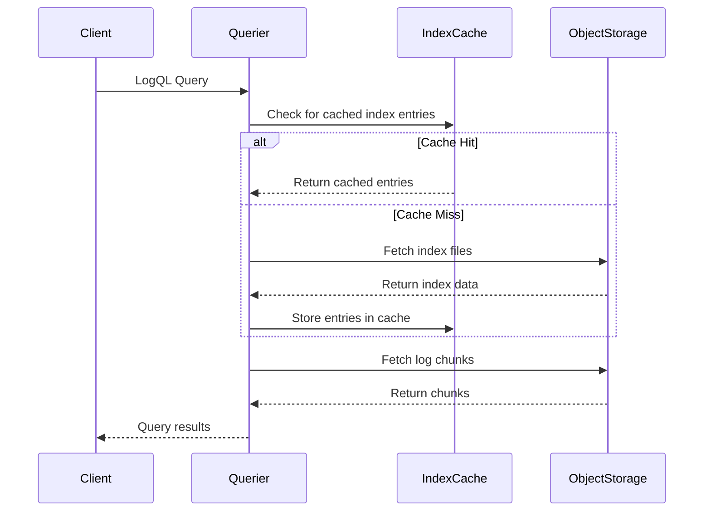
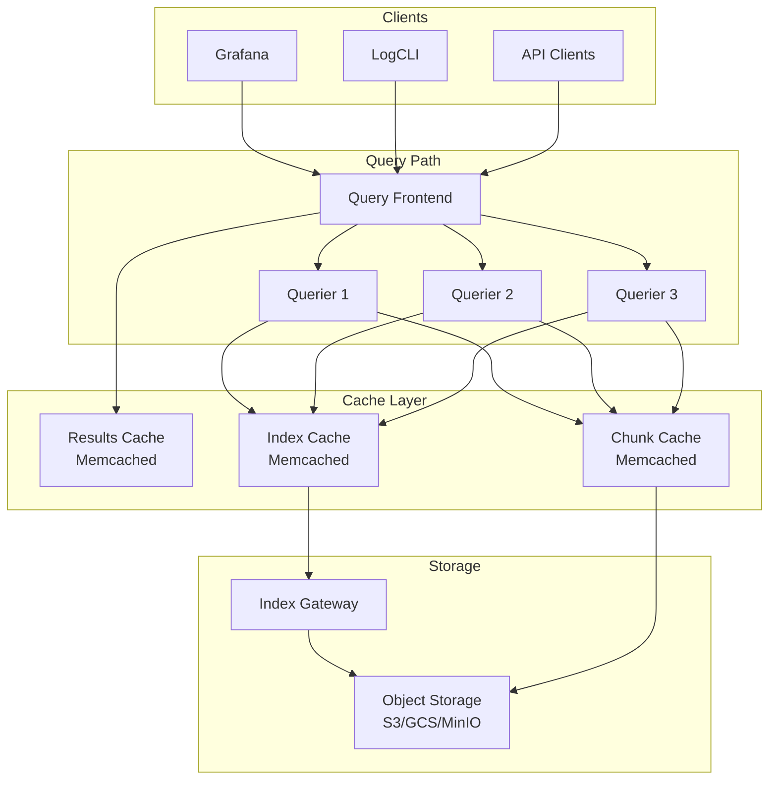

# How to Build Loki Index Cache

Author: [nawazdhandala](https://github.com/nawazdhandala)

Tags: Loki, Observability, Caching, Performance

Description: Configure Loki index caching to accelerate log queries with in-memory and external cache backends.

---

Loki stores logs in object storage but queries them by scanning index files that map labels to chunk locations. Without caching, every query hits storage, making repeated or overlapping queries expensive. An index cache keeps recently accessed index entries in memory or an external store, cutting query latency from seconds to milliseconds.

## Why Index Caching Matters

When you run a LogQL query, Loki:

1. Parses label matchers
2. Looks up matching series in the index
3. Fetches chunk references
4. Downloads and decompresses chunks

Steps 2 and 3 are the bottleneck for large tenants. Index files live in object storage (S3, GCS, MinIO), and each lookup incurs network latency. A cache eliminates repeated trips for the same index ranges.

## Index Lookup Flow



## Cache Backend Options

Loki supports three cache backends for index data:

| Backend | Latency | Capacity | Complexity | Best For |
| --- | --- | --- | --- | --- |
| **In-memory (embedded)** | Sub-millisecond | Limited by pod RAM | None | Single-node or small clusters |
| **Memcached** | ~1ms network | Scales horizontally | Moderate | Production clusters, shared cache |
| **Redis** | ~1ms network | Scales with clustering | Moderate | Teams already running Redis |

## In-Memory Cache Configuration

The simplest option runs inside each querier pod. No external dependencies, but cache is lost on restart and not shared across pods.

```yaml
# loki-config.yaml
# In-memory cache for index queries
# Suitable for development or single-node deployments

storage_config:
  # TSDB index store configuration
  tsdb_shipper:
    active_index_directory: /loki/index
    cache_location: /loki/index_cache
    shared_store: s3

query_range:
  # Enable result caching for repeated queries
  cache_results: true
  results_cache:
    cache:
      # Embedded in-memory cache
      embedded_cache:
        enabled: true
        # Maximum memory for cached results (adjust based on pod limits)
        max_size_mb: 512
        # How long entries stay valid
        ttl: 1h

chunk_store_config:
  chunk_cache_config:
    embedded_cache:
      enabled: true
      max_size_mb: 1024
      ttl: 1h

# Index cache for label lookups
index_queries_cache_config:
  embedded_cache:
    enabled: true
    max_size_mb: 256
    ttl: 24h
```

### Memory Sizing Guidelines

- **Small clusters (under 100 GB/day):** 256 MB for index cache, 512 MB for chunk cache
- **Medium clusters (100 GB to 1 TB/day):** 512 MB index, 2 GB chunk
- **Large clusters (over 1 TB/day):** Use external cache (Memcached/Redis)

## Memcached Configuration

For production deployments, Memcached provides a shared cache layer that survives pod restarts and scales independently.

### Deploy Memcached

```yaml
# memcached-deployment.yaml
# Dedicated Memcached cluster for Loki index caching

apiVersion: apps/v1
kind: StatefulSet
metadata:
  name: loki-memcached-index
  namespace: loki
spec:
  serviceName: loki-memcached-index
  replicas: 3
  selector:
    matchLabels:
      app: loki-memcached-index
  template:
    metadata:
      labels:
        app: loki-memcached-index
    spec:
      containers:
        - name: memcached
          image: memcached:1.6-alpine
          args:
            # Max memory per instance
            - "-m"
            - "2048"
            # Max connections
            - "-c"
            - "4096"
            # Verbose logging for debugging
            - "-v"
          ports:
            - containerPort: 11211
          resources:
            requests:
              memory: "2560Mi"
              cpu: "500m"
            limits:
              memory: "2560Mi"
              cpu: "1000m"
---
apiVersion: v1
kind: Service
metadata:
  name: loki-memcached-index
  namespace: loki
spec:
  clusterIP: None
  ports:
    - port: 11211
      name: memcached
  selector:
    app: loki-memcached-index
```

### Configure Loki to Use Memcached

```yaml
# loki-config.yaml
# Production configuration with Memcached backend

storage_config:
  tsdb_shipper:
    active_index_directory: /loki/index
    cache_location: /loki/index_cache
    shared_store: s3
    # How often to sync index to object storage
    cache_ttl: 24h

    # Index gateway caching
    index_gateway_client:
      server_address: loki-index-gateway:9095

# Memcached for index queries
index_queries_cache_config:
  memcached_client:
    # Memcached service addresses
    addresses: dns+loki-memcached-index.loki.svc.cluster.local:11211
    # Connection timeout
    timeout: 500ms
    # Max idle connections per server
    max_idle_conns: 100
    # Update interval for DNS resolution
    update_interval: 1m
    # Enable consistent hashing for even distribution
    consistent_hash: true

# Separate cache for chunk data
chunk_store_config:
  chunk_cache_config:
    memcached_client:
      addresses: dns+loki-memcached-chunks.loki.svc.cluster.local:11211
      timeout: 500ms
      max_idle_conns: 100
      consistent_hash: true

# Results cache for query responses
query_range:
  cache_results: true
  results_cache:
    cache:
      memcached_client:
        addresses: dns+loki-memcached-results.loki.svc.cluster.local:11211
        timeout: 500ms
        max_idle_conns: 50
```

## Redis Configuration

If your infrastructure already runs Redis, use it instead of adding Memcached.

```yaml
# loki-config.yaml
# Redis backend for index caching

index_queries_cache_config:
  redis:
    # Redis endpoint
    endpoint: loki-redis.loki.svc.cluster.local:6379
    # Connection timeout
    timeout: 500ms
    # Database number (0-15)
    db: 0
    # Optional: authentication
    # password: ${REDIS_PASSWORD}
    # Pool size per endpoint
    pool_size: 100
    # TTL for cached entries
    expiration: 24h

chunk_store_config:
  chunk_cache_config:
    redis:
      endpoint: loki-redis.loki.svc.cluster.local:6379
      timeout: 500ms
      db: 1
      pool_size: 100
      expiration: 1h
```

## Cache Warming Strategies

Cold caches hurt query latency after deployments or restarts. Warm them proactively.

### Strategy 1: Background Query Warmup

Run common queries in the background after Loki starts.

```yaml
# warmup-cronjob.yaml
# Periodic job to warm Loki index cache with common queries

apiVersion: batch/v1
kind: CronJob
metadata:
  name: loki-cache-warmer
  namespace: loki
spec:
  # Run every 6 hours
  schedule: "0 */6 * * *"
  jobTemplate:
    spec:
      template:
        spec:
          containers:
            - name: warmer
              image: grafana/logcli:latest
              env:
                - name: LOKI_ADDR
                  value: "http://loki-gateway.loki.svc.cluster.local:80"
              command:
                - /bin/sh
                - -c
                - |
                  # Warm cache for common label queries
                  # These queries populate the index cache without returning large result sets

                  echo "Warming cache for namespace labels..."
                  logcli series '{namespace=~".+"}' --since=24h

                  echo "Warming cache for app labels..."
                  logcli series '{app=~".+"}' --since=24h

                  echo "Warming cache for container labels..."
                  logcli series '{container=~".+"}' --since=24h

                  echo "Cache warmup complete"
              resources:
                requests:
                  memory: "128Mi"
                  cpu: "100m"
          restartPolicy: OnFailure
```

### Strategy 2: Startup Probe with Warmup

Delay traffic until cache is partially warm.

```yaml
# loki-querier-deployment.yaml (partial)
# Querier with cache warmup before accepting traffic

spec:
  containers:
    - name: querier
      image: grafana/loki:2.9.0
      # Custom entrypoint that warms cache before starting
      command:
        - /bin/sh
        - -c
        - |
          # Start Loki in background
          /usr/bin/loki -config.file=/etc/loki/config.yaml &
          LOKI_PID=$!

          # Wait for Loki to be ready
          until curl -s http://localhost:3100/ready; do
            sleep 1
          done

          # Run warmup queries against localhost
          curl -s "http://localhost:3100/loki/api/v1/series" \
            --data-urlencode 'match[]={namespace=~".+"}' \
            --data-urlencode 'start='$(date -d '24 hours ago' +%s)

          # Bring Loki to foreground
          wait $LOKI_PID
      startupProbe:
        httpGet:
          path: /ready
          port: 3100
        # Allow up to 5 minutes for warmup
        failureThreshold: 30
        periodSeconds: 10
```

## Cache Architecture for Large Deployments



## Memory vs Performance Tradeoffs

### High Memory, Fast Queries

Allocate generous cache sizes when query latency is critical.

```yaml
# High-performance configuration
# Use when: Dashboard refresh times matter, users run ad-hoc queries frequently

index_queries_cache_config:
  memcached_client:
    addresses: dns+loki-memcached-index:11211
    # Larger batch sizes reduce round trips
    batch_size: 4096
    # More parallel requests
    parallelism: 100

# Deploy Memcached with more memory
# 3 replicas x 4GB = 12GB total cache capacity
```

**Pros:**
- Sub-100ms query latency for cached ranges
- Smoother dashboard experience
- Handles query bursts without degradation

**Cons:**
- Higher infrastructure cost
- Memcached pods consume significant cluster resources
- Cache invalidation takes longer

### Low Memory, Acceptable Latency

Minimize cache footprint when cost matters more than speed.

```yaml
# Cost-optimized configuration
# Use when: Batch processing, async alerting, budget constraints

index_queries_cache_config:
  embedded_cache:
    enabled: true
    # Smaller cache, faster eviction
    max_size_mb: 128
    # Shorter TTL forces refresh
    ttl: 30m

chunk_store_config:
  chunk_cache_config:
    embedded_cache:
      enabled: true
      max_size_mb: 256
      ttl: 15m
```

**Pros:**
- Lower memory footprint
- Simpler operations (no external cache)
- Faster cache warmup after restart

**Cons:**
- Higher query latency (200ms to 2s typical)
- More object storage requests (higher egress costs)
- Cache thrashing under load

### Sizing Formula

Estimate cache size based on active index and query patterns:

```
Index Cache Size = (Active Series Count) x (Avg Labels per Series) x 200 bytes x 2
Chunk Cache Size = (Queries per Second) x (Avg Chunks per Query) x (Avg Chunk Size) x (TTL in seconds)
```

**Example calculation:**

- 500,000 active series
- 8 labels per series average
- 10 QPS, 50 chunks per query, 256 KB chunks, 1 hour TTL

```
Index Cache = 500,000 x 8 x 200 x 2 = 1.6 GB
Chunk Cache = 10 x 50 x 256 KB x 3600 = 460 GB (use external cache or reduce TTL)
```

## Monitoring Cache Performance

Track cache hit rates to validate configuration.

```yaml
# prometheus-rules.yaml
# Alerting rules for Loki cache health

groups:
  - name: loki-cache
    rules:
      # Alert when index cache hit rate drops below 80%
      - alert: LokiIndexCacheHitRateLow
        expr: |
          (
            sum(rate(loki_cache_hits_total{cache="index"}[5m]))
            /
            sum(rate(loki_cache_fetched_keys_total{cache="index"}[5m]))
          ) < 0.8
        for: 15m
        labels:
          severity: warning
        annotations:
          summary: "Loki index cache hit rate below 80%"
          description: "Consider increasing cache size or TTL"

      # Alert when chunk cache is overwhelmed
      - alert: LokiChunkCacheEvictionHigh
        expr: |
          rate(loki_cache_evicted_total{cache="chunk"}[5m]) > 1000
        for: 10m
        labels:
          severity: warning
        annotations:
          summary: "High chunk cache eviction rate"
          description: "Cache is too small for workload"
```

### Key Metrics to Watch

| Metric | Target | Action if Missed |
| --- | --- | --- |
| `loki_cache_hits_total / loki_cache_fetched_keys_total` | > 0.8 | Increase cache size or TTL |
| `loki_cache_evicted_total` | < 100/s | Increase cache memory |
| `loki_memcache_request_duration_seconds` | < 10ms p99 | Check network, add replicas |
| `loki_cache_stale_gets_total` | < 1% of gets | Reduce TTL or enable background refresh |

## Complete Production Configuration

```yaml
# loki-config.yaml
# Production-ready configuration with tiered caching

auth_enabled: true

server:
  http_listen_port: 3100
  grpc_listen_port: 9095

common:
  path_prefix: /loki
  storage:
    s3:
      endpoint: s3.amazonaws.com
      bucketnames: loki-chunks
      region: us-east-1
      access_key_id: ${AWS_ACCESS_KEY_ID}
      secret_access_key: ${AWS_SECRET_ACCESS_KEY}

schema_config:
  configs:
    - from: 2024-01-01
      store: tsdb
      object_store: s3
      schema: v13
      index:
        prefix: loki_index_
        period: 24h

storage_config:
  tsdb_shipper:
    active_index_directory: /loki/index
    cache_location: /loki/index_cache
    shared_store: s3
    cache_ttl: 24h

# Three-tier caching strategy
# Tier 1: Results cache - caches full query responses
query_range:
  align_queries_with_step: true
  cache_results: true
  results_cache:
    cache:
      memcached_client:
        addresses: dns+loki-memcached-results.loki.svc.cluster.local:11211
        timeout: 500ms
        max_idle_conns: 50
        consistent_hash: true

# Tier 2: Index cache - caches label to chunk mappings
index_queries_cache_config:
  memcached_client:
    addresses: dns+loki-memcached-index.loki.svc.cluster.local:11211
    timeout: 500ms
    max_idle_conns: 100
    batch_size: 4096
    parallelism: 100
    consistent_hash: true

# Tier 3: Chunk cache - caches decompressed log chunks
chunk_store_config:
  chunk_cache_config:
    memcached_client:
      addresses: dns+loki-memcached-chunks.loki.svc.cluster.local:11211
      timeout: 500ms
      max_idle_conns: 100
      consistent_hash: true
  write_dedupe_cache_config:
    memcached_client:
      addresses: dns+loki-memcached-chunks.loki.svc.cluster.local:11211
      timeout: 500ms

limits_config:
  # Per-tenant limits
  max_cache_freshness_per_query: 10m
  # Split large queries for better cache utilization
  split_queries_by_interval: 30m

frontend:
  # Cache query results at the frontend level
  max_outstanding_per_tenant: 4096
  compress_responses: true
```

## Troubleshooting

### Cache Miss Rate Too High

1. Check TTL settings - if logs are queried hours after ingestion, TTL might expire entries too soon
2. Verify Memcached memory - run `echo stats | nc memcached-host 11211` and check `evictions`
3. Ensure consistent hashing is enabled to prevent cache key collisions

### High Latency Despite Caching

1. Check network between queriers and Memcached - should be under 1ms
2. Look for connection pool exhaustion in `loki_memcache_request_duration_seconds`
3. Verify batch sizes are large enough to reduce round trips

### Cache Warming Takes Too Long

1. Run warmup queries with narrower time ranges
2. Parallelize warmup across multiple label sets
3. Use index gateway to centralize and share index cache

Index caching transforms Loki from "eventually consistent logs" to "interactive log exploration." Start with embedded caches during development, graduate to Memcached for production, and monitor hit rates religiously. The difference between a 5-second query and a 50-millisecond query is often just a few gigabytes of well-placed cache memory.
