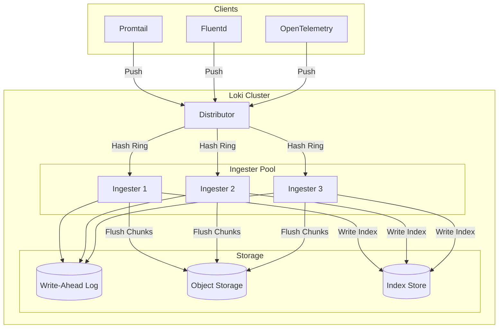
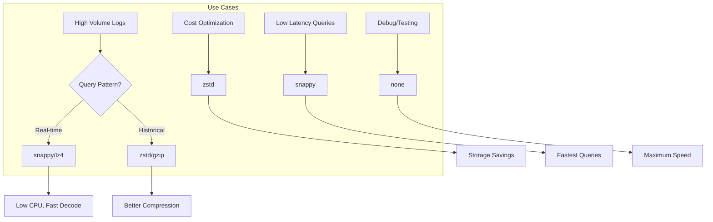
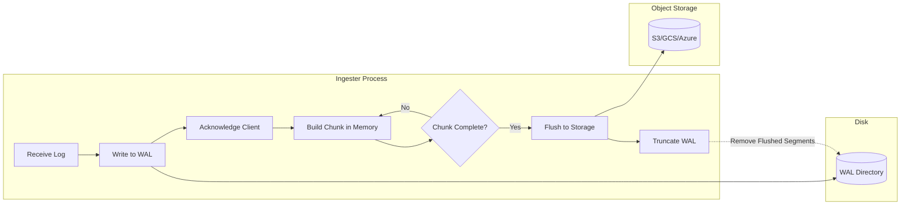
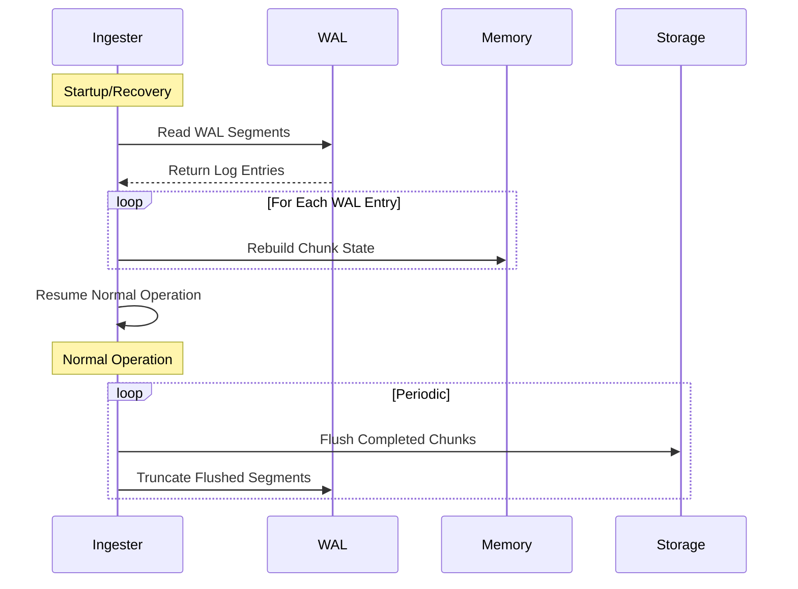
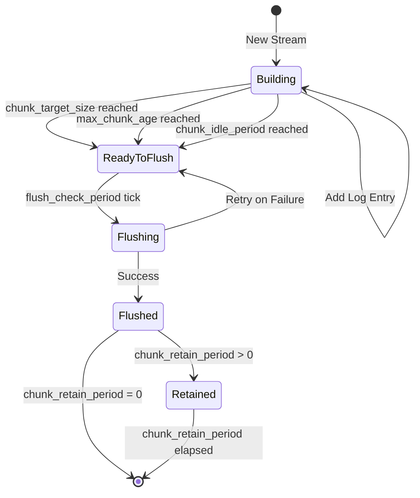

# How to Implement Loki Ingester Configuration

Author: [nawazdhandala](https://github.com/nawazdhandala)

Tags: Loki, Observability, Storage, Performance

Description: A comprehensive guide to configuring Loki ingesters for optimal log storage, chunk encoding, WAL durability, and performance tuning.

---

## Introduction

The Loki ingester is a critical component in the Loki logging stack. It receives log streams from distributors, builds compressed chunks in memory, and flushes them to long-term storage. Proper ingester configuration directly impacts query performance, storage efficiency, and system reliability.

In this guide, we will explore ingester component settings, chunk encoding and compression strategies, Write-Ahead Log (WAL) configuration for durability, and practical tuning recommendations for production deployments.

## Understanding the Ingester Data Flow

Before diving into configuration, let us understand how data flows through the Loki ingester component.



The ingester performs several key operations:

1. **Receiving logs**: Accepts log streams from the distributor via hash ring assignment
2. **Building chunks**: Accumulates log entries in memory-resident chunks
3. **WAL persistence**: Writes to the Write-Ahead Log for crash recovery
4. **Compression**: Compresses chunks using configured encoding
5. **Flushing**: Writes completed chunks to object storage and updates the index

## Basic Ingester Configuration

Here is a foundational ingester configuration with explanatory comments:

```yaml
# loki-config.yaml
ingester:
  # Lifecycle configuration for the ingester ring
  lifecycler:
    # Address to advertise in the ring
    address: 127.0.0.1

    # Ring configuration for distributed coordination
    ring:
      kvstore:
        # Use memberlist for peer discovery (consul/etcd also supported)
        store: memberlist
      # Number of ingesters to replicate chunks to
      replication_factor: 3

    # Time to wait before marking instance as ready
    final_sleep: 0s

  # Number of concurrent flushes to storage
  concurrent_flushes: 32

  # How often to check if chunks should be flushed
  flush_check_period: 30s

  # Timeout for flushing a single chunk
  flush_op_timeout: 10m

  # Maximum size of a chunk before forcing a flush (compressed)
  chunk_block_size: 262144  # 256KB

  # Target size for uncompressed chunk data
  chunk_target_size: 1572864  # 1.5MB

  # Maximum time a chunk can stay in memory without being flushed
  chunk_idle_period: 30m

  # Maximum age of a chunk before forcing a flush
  max_chunk_age: 2h

  # How long to retain chunks in memory after flushing for queries
  chunk_retain_period: 0s

  # Maximum number of streams an ingester can hold
  max_transfer_retries: 0
```

### Configuration Parameters Explained

| Parameter | Description | Recommended Value |
|-----------|-------------|-------------------|
| `chunk_block_size` | Target compressed size per chunk block | 256KB - 512KB |
| `chunk_target_size` | Target uncompressed chunk size | 1MB - 2MB |
| `chunk_idle_period` | Time before idle chunks are flushed | 15m - 1h |
| `max_chunk_age` | Maximum chunk lifetime in memory | 1h - 4h |
| `concurrent_flushes` | Parallel flush operations | 16 - 64 |
| `flush_check_period` | Interval between flush checks | 15s - 60s |

## Chunk Encoding and Compression

Loki supports multiple chunk encoding formats that balance compression ratio, CPU usage, and query performance.

### Available Encodings

```yaml
ingester:
  # Chunk encoding: gzip, lz4, snappy, zstd, or none
  chunk_encoding: snappy
```

### Encoding Comparison

| Encoding | Compression Ratio | Encode Speed | Decode Speed | CPU Usage | Best For |
|----------|-------------------|--------------|--------------|-----------|----------|
| gzip | High (4-6x) | Slow | Medium | High | Cold storage, archival |
| snappy | Medium (2-3x) | Very Fast | Very Fast | Low | Default, balanced workloads |
| lz4 | Medium (2-3x) | Very Fast | Very Fast | Low | High throughput |
| zstd | High (4-5x) | Fast | Fast | Medium | Better compression with good speed |
| none | None (1x) | N/A | N/A | None | Testing, very low latency |

### Compression Strategy by Use Case



### Advanced Compression Configuration

```yaml
ingester:
  # Use snappy for balanced performance
  chunk_encoding: snappy

  # Configure chunk sizing for optimal compression
  chunk_block_size: 262144      # 256KB compressed target
  chunk_target_size: 1572864    # 1.5MB uncompressed target

  # Enable sync writes for durability (impacts performance)
  sync_period: 0s               # 0 = sync on every write, adjust based on durability needs
```

## Write-Ahead Log (WAL) Configuration

The WAL provides durability guarantees by persisting log data before acknowledging writes. This enables recovery after crashes without data loss.

### WAL Data Flow



### Basic WAL Configuration

```yaml
ingester:
  wal:
    # Enable the Write-Ahead Log
    enabled: true

    # Directory to store WAL files
    dir: /var/loki/wal

    # How often to checkpoint the WAL
    checkpoint_duration: 5m

    # Flush WAL on shutdown for clean recovery
    flush_on_shutdown: true

    # Replay timeout for WAL recovery
    replay_memory_ceiling: 4GB
```

### Production WAL Settings

```yaml
ingester:
  wal:
    enabled: true
    dir: /var/loki/wal

    # Checkpointing configuration
    # Lower values = faster recovery but more I/O
    checkpoint_duration: 5m

    # Recovery settings
    replay_memory_ceiling: 4GB

    # Flush on shutdown to minimize recovery time
    flush_on_shutdown: true

  # WAL-aware chunk lifecycle settings
  # Chunks older than this are flushed, allowing WAL truncation
  max_chunk_age: 2h

  # Period to retain chunks after flushing
  # Allows queries to hit memory instead of storage
  chunk_retain_period: 15m
```

### WAL Recovery Process

When an ingester restarts, it replays the WAL to recover in-flight data:



### WAL Sizing Recommendations

| Cluster Size | WAL Directory Size | Checkpoint Duration | Replay Ceiling |
|--------------|-------------------|---------------------|----------------|
| Small (< 10 streams/s) | 10GB | 10m | 2GB |
| Medium (10-100 streams/s) | 50GB | 5m | 4GB |
| Large (100+ streams/s) | 100GB+ | 2m | 8GB+ |

## Flush Intervals and Chunk Sizing

Proper flush configuration balances memory usage, storage efficiency, and query performance.

### Flush Lifecycle



### Optimized Flush Configuration

```yaml
ingester:
  # Chunk building parameters
  # Target uncompressed size before flush consideration
  chunk_target_size: 1572864  # 1.5MB

  # Maximum compressed block size
  chunk_block_size: 262144    # 256KB

  # Time-based flush triggers
  # Flush chunks idle for this long (no new logs)
  chunk_idle_period: 30m

  # Maximum time a chunk can exist before forced flush
  max_chunk_age: 2h

  # Flush operation settings
  # Number of parallel flush operations
  concurrent_flushes: 32

  # How often to check for chunks ready to flush
  flush_check_period: 30s

  # Timeout for a single flush operation
  flush_op_timeout: 10m

  # Keep chunks in memory after flushing for faster queries
  chunk_retain_period: 15m

  # Query settings
  # Maximum concurrent queries per ingester
  max_concurrent: 16

  # Query timeout
  query_timeout: 5m
```

### Chunk Sizing Impact

| Chunk Size | Memory Usage | Flush Frequency | Query Latency | Storage Efficiency |
|------------|--------------|-----------------|---------------|-------------------|
| Small (256KB) | Low | High | Low | Poor |
| Medium (1MB) | Medium | Medium | Medium | Good |
| Large (2MB+) | High | Low | Higher | Excellent |

### Dynamic Chunk Sizing Example

```yaml
ingester:
  # For high-cardinality logs (many unique streams)
  # Use smaller chunks to avoid memory pressure
  chunk_target_size: 524288    # 512KB
  chunk_idle_period: 15m
  max_chunk_age: 1h

  # For low-cardinality logs (few streams, high volume)
  # Use larger chunks for better compression
  # chunk_target_size: 2097152  # 2MB
  # chunk_idle_period: 1h
  # max_chunk_age: 4h
```

## Complete Production Configuration

Here is a comprehensive production-ready configuration:

```yaml
# loki-config.yaml - Production Ingester Configuration

# Authentication and server settings
auth_enabled: true

server:
  http_listen_port: 3100
  grpc_listen_port: 9095

# Distributor configuration
distributor:
  ring:
    kvstore:
      store: memberlist

# Ingester configuration
ingester:
  lifecycler:
    address: 0.0.0.0
    ring:
      kvstore:
        store: memberlist
      replication_factor: 3
    final_sleep: 0s

  # Chunk building configuration
  chunk_encoding: snappy           # Balanced compression
  chunk_block_size: 262144         # 256KB compressed target
  chunk_target_size: 1572864       # 1.5MB uncompressed target
  chunk_idle_period: 30m           # Flush idle chunks
  max_chunk_age: 2h                # Maximum chunk lifetime
  chunk_retain_period: 15m         # Keep in memory after flush

  # Flush configuration
  concurrent_flushes: 32           # Parallel flush operations
  flush_check_period: 30s          # Flush check interval
  flush_op_timeout: 10m            # Flush timeout

  # WAL configuration for durability
  wal:
    enabled: true
    dir: /var/loki/wal
    checkpoint_duration: 5m
    flush_on_shutdown: true
    replay_memory_ceiling: 4GB

  # Resource limits
  max_returned_stream_errors: 10

# Storage configuration
storage_config:
  boltdb_shipper:
    active_index_directory: /var/loki/index
    cache_location: /var/loki/cache
    shared_store: s3

  aws:
    s3: s3://us-east-1/loki-chunks
    bucketnames: loki-chunks
    region: us-east-1
    access_key_id: ${AWS_ACCESS_KEY_ID}
    secret_access_key: ${AWS_SECRET_ACCESS_KEY}

# Schema configuration
schema_config:
  configs:
    - from: 2024-01-01
      store: boltdb-shipper
      object_store: s3
      schema: v12
      index:
        prefix: loki_index_
        period: 24h

# Limits configuration
limits_config:
  # Ingestion limits
  ingestion_rate_mb: 10
  ingestion_burst_size_mb: 20
  max_streams_per_user: 10000
  max_line_size: 256kb

  # Query limits
  max_query_length: 721h
  max_query_parallelism: 32

# Compactor configuration
compactor:
  working_directory: /var/loki/compactor
  shared_store: s3
  compaction_interval: 10m
```

## Monitoring Ingester Health

Monitor these key metrics to ensure healthy ingester operation:

### Critical Metrics

```promql
# Ingester memory usage
loki_ingester_memory_chunks

# Chunks flushed per second
rate(loki_ingester_chunks_flushed_total[5m])

# Flush failures
rate(loki_ingester_chunks_flush_failures_total[5m])

# WAL disk usage
loki_ingester_wal_disk_bytes

# Streams per ingester
loki_ingester_memory_streams

# Chunk encoding duration
histogram_quantile(0.99, rate(loki_ingester_chunk_encode_duration_seconds_bucket[5m]))
```

### Alerting Rules

```yaml
# loki-alerts.yaml
groups:
  - name: loki-ingester
    rules:
      - alert: LokiIngesterFlushFailures
        expr: rate(loki_ingester_chunks_flush_failures_total[5m]) > 0
        for: 5m
        labels:
          severity: critical
        annotations:
          summary: Loki ingester flush failures detected

      - alert: LokiIngesterWALCorruption
        expr: increase(loki_ingester_wal_corruptions_total[1h]) > 0
        for: 0m
        labels:
          severity: critical
        annotations:
          summary: Loki WAL corruption detected

      - alert: LokiIngesterHighMemory
        expr: loki_ingester_memory_chunks > 100000
        for: 15m
        labels:
          severity: warning
        annotations:
          summary: Loki ingester holding too many chunks in memory

      - alert: LokiIngesterNotFlushing
        expr: rate(loki_ingester_chunks_flushed_total[30m]) == 0
        for: 30m
        labels:
          severity: warning
        annotations:
          summary: Loki ingester not flushing chunks
```

## Kubernetes Deployment Example

Deploy Loki ingesters on Kubernetes with proper resource allocation:

```yaml
# loki-ingester-statefulset.yaml
apiVersion: apps/v1
kind: StatefulSet
metadata:
  name: loki-ingester
  namespace: loki
spec:
  serviceName: loki-ingester-headless
  replicas: 3
  selector:
    matchLabels:
      app: loki-ingester
  template:
    metadata:
      labels:
        app: loki-ingester
    spec:
      containers:
        - name: ingester
          image: grafana/loki:2.9.0
          args:
            - -config.file=/etc/loki/config.yaml
            - -target=ingester
          ports:
            - containerPort: 3100
              name: http
            - containerPort: 9095
              name: grpc
          resources:
            requests:
              memory: "4Gi"
              cpu: "2"
            limits:
              memory: "8Gi"
              cpu: "4"
          volumeMounts:
            - name: config
              mountPath: /etc/loki
            - name: wal
              mountPath: /var/loki/wal
            - name: data
              mountPath: /var/loki
          livenessProbe:
            httpGet:
              path: /ready
              port: 3100
            initialDelaySeconds: 45
            periodSeconds: 10
          readinessProbe:
            httpGet:
              path: /ready
              port: 3100
            initialDelaySeconds: 15
            periodSeconds: 10
      volumes:
        - name: config
          configMap:
            name: loki-config
  volumeClaimTemplates:
    - metadata:
        name: wal
      spec:
        accessModes: ["ReadWriteOnce"]
        storageClassName: fast-ssd
        resources:
          requests:
            storage: 50Gi
    - metadata:
        name: data
      spec:
        accessModes: ["ReadWriteOnce"]
        storageClassName: standard
        resources:
          requests:
            storage: 100Gi
---
apiVersion: v1
kind: Service
metadata:
  name: loki-ingester-headless
  namespace: loki
spec:
  clusterIP: None
  selector:
    app: loki-ingester
  ports:
    - port: 3100
      name: http
    - port: 9095
      name: grpc
```

## Troubleshooting Common Issues

### Issue 1: High Memory Usage

**Symptoms**: Ingesters running out of memory, OOM kills

**Solution**: Reduce chunk sizes and increase flush frequency

```yaml
ingester:
  chunk_target_size: 524288    # Reduce to 512KB
  chunk_idle_period: 15m       # Flush idle chunks sooner
  max_chunk_age: 1h            # Reduce maximum chunk age
  chunk_retain_period: 0s      # Do not retain after flush
```

### Issue 2: Slow Flush Performance

**Symptoms**: Chunks backing up in memory, increasing WAL size

**Solution**: Increase concurrent flushes and check storage latency

```yaml
ingester:
  concurrent_flushes: 64       # Increase parallelism
  flush_op_timeout: 15m        # Allow more time for slow storage
  chunk_encoding: lz4          # Use faster compression
```

### Issue 3: WAL Recovery Taking Too Long

**Symptoms**: Ingesters slow to become ready after restart

**Solution**: Tune checkpoint frequency and limit replay memory

```yaml
ingester:
  wal:
    checkpoint_duration: 2m      # More frequent checkpoints
    replay_memory_ceiling: 8GB   # Allow more memory for replay
  max_chunk_age: 1h              # Shorter chunk lifetime
```

### Issue 4: High Storage Costs

**Symptoms**: Object storage costs higher than expected

**Solution**: Increase compression and chunk sizes

```yaml
ingester:
  chunk_encoding: zstd           # Better compression ratio
  chunk_target_size: 2097152     # Larger chunks (2MB)
  max_chunk_age: 4h              # Allow chunks to grow larger
```

## Performance Tuning Summary

| Scenario | chunk_target_size | chunk_encoding | max_chunk_age | concurrent_flushes |
|----------|-------------------|----------------|---------------|-------------------|
| High throughput | 2MB | lz4/snappy | 2h | 64 |
| Cost optimization | 2MB | zstd | 4h | 32 |
| Low latency queries | 512KB | snappy | 1h | 32 |
| High cardinality | 512KB | snappy | 30m | 48 |
| Memory constrained | 256KB | snappy | 30m | 16 |

## Conclusion

Proper Loki ingester configuration is essential for building a reliable and performant logging infrastructure. Key takeaways:

1. **Chunk sizing**: Balance memory usage, storage efficiency, and query performance based on your workload
2. **Compression**: Choose encoding based on your priorities (speed vs. compression ratio)
3. **WAL configuration**: Enable WAL for durability and tune checkpoint frequency for your recovery time objectives
4. **Flush tuning**: Configure flush intervals to match your ingestion rate and storage capabilities
5. **Monitoring**: Track ingester metrics to detect issues before they impact users

By following these guidelines and tuning parameters for your specific use case, you can build a Loki deployment that efficiently handles your log volume while maintaining reliability and query performance.

## Additional Resources

- [Loki Configuration Documentation](https://grafana.com/docs/loki/latest/configuration/)
- [Loki Storage Documentation](https://grafana.com/docs/loki/latest/storage/)
- [Loki Operations Best Practices](https://grafana.com/docs/loki/latest/operations/)
- [Grafana Loki Architecture](https://grafana.com/docs/loki/latest/fundamentals/architecture/)
