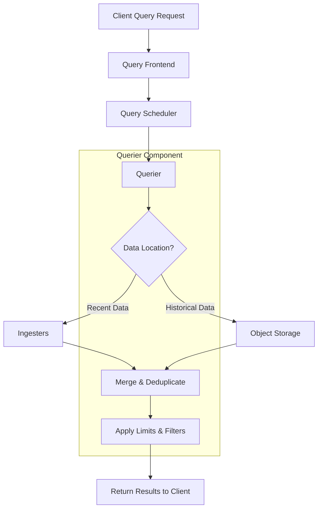
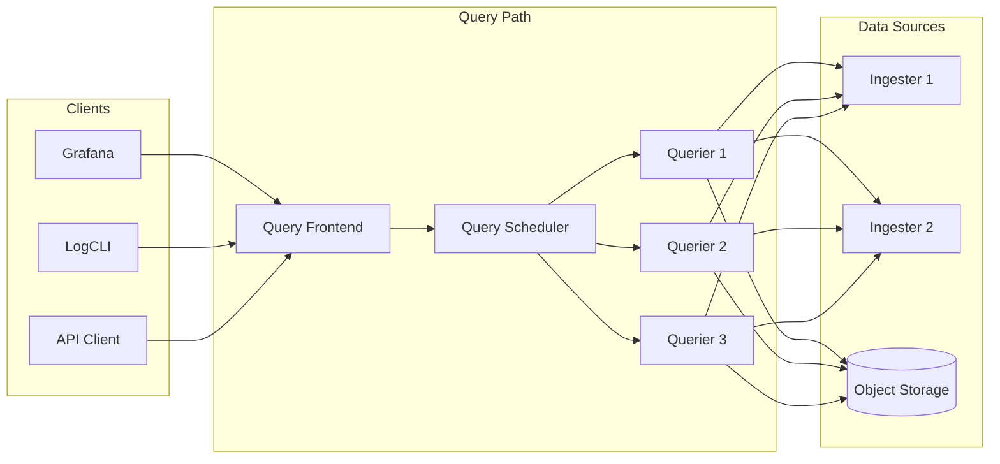

# How to Implement Loki Querier Configuration

Author: [nawazdhandala](https://github.com/nawazdhandala)

Tags: Loki, Observability, Queries, Performance

Description: A comprehensive guide to configuring the Loki querier component for optimal query execution, parallelism, and multi-tenant environments.

---

## Introduction

The Loki querier is a critical component in the Grafana Loki stack responsible for handling LogQL queries. It reads log data from both ingesters (for recent data) and long-term storage (for historical data), then merges and deduplicates results before returning them to the client.

Proper configuration of the querier is essential for achieving optimal query performance, especially in high-volume, multi-tenant environments. This guide covers the key configuration options and best practices for tuning your Loki querier.

## Query Execution Flow

Before diving into configuration, let us understand how queries flow through the Loki querier component.



## Core Querier Configuration

The querier section in your Loki configuration file controls how queries are executed. Here is a comprehensive configuration example with detailed comments.

### Basic Querier Settings

```yaml
# loki-config.yaml
querier:
  # Maximum duration for which the live tailing requests are served
  # Increase this for long-running tail queries
  tail_max_duration: 1h

  # Time to wait before sending a batch of log lines to the client
  # Lower values provide more real-time updates but increase network overhead
  extra_query_delay: 0s

  # Maximum number of concurrent queries that can be processed
  # This is a key setting for controlling resource usage
  max_concurrent: 10

  # Engine configuration for query processing
  engine:
    # Maximum time a query can run before being cancelled
    timeout: 5m

    # Maximum lookback period for queries
    # Queries cannot look back further than this duration
    max_look_back_period: 720h  # 30 days
```

### Parallelism and Concurrency Configuration

Controlling parallelism is crucial for balancing query performance with cluster stability.

```yaml
querier:
  # Number of workers to use for parallel query processing
  # Each worker processes a portion of the query independently
  max_concurrent: 20

  # Query parallelism settings in the query_range section
  query_range:
    # Enable parallelization of queries
    parallelise_shardable_queries: true

    # Number of shards to split queries into
    # Higher values improve parallelism but increase overhead
    max_query_parallelism: 32

# Frontend worker configuration
frontend_worker:
  # Number of simultaneous queries to process per querier
  parallelism: 10

  # Address of the query frontend or scheduler
  frontend_address: "query-frontend:9095"

  # How often to poll for new work
  scheduler_address: ""

  # gRPC client configuration
  grpc_client_config:
    max_recv_msg_size: 104857600  # 100MB
    max_send_msg_size: 104857600  # 100MB
```

### Query Timeout and Performance Limits

Configure timeouts to prevent runaway queries from consuming excessive resources.

```yaml
querier:
  engine:
    # Maximum time for query execution
    timeout: 3m

    # Maximum lookback period
    max_look_back_period: 720h

# Limits configuration for query boundaries
limits_config:
  # Maximum time range for a single query
  max_query_length: 721h

  # Maximum number of unique streams that can be queried
  max_query_series: 500

  # Maximum number of log entries to return
  max_entries_limit_per_query: 10000

  # Query timeout at the limits level
  query_timeout: 5m

  # Maximum number of bytes a query can process
  max_query_bytes_read: 10GB

  # Maximum number of chunks that can be fetched
  max_chunks_per_query: 2000000

  # Split queries by time interval for better distribution
  split_queries_by_interval: 30m
```

## Multi-Tenant Querier Configuration

In multi-tenant deployments, you need to configure per-tenant limits and isolation.

### Per-Tenant Overrides

```yaml
# Enable multi-tenancy
auth_enabled: true

# Default limits for all tenants
limits_config:
  max_query_parallelism: 32
  max_query_series: 500
  max_entries_limit_per_query: 5000
  query_timeout: 2m

# Per-tenant overrides
overrides:
  # High-priority tenant with relaxed limits
  tenant_premium:
    max_query_parallelism: 64
    max_query_series: 2000
    max_entries_limit_per_query: 50000
    query_timeout: 10m
    max_query_bytes_read: 50GB

  # Standard tenant with default limits
  tenant_standard:
    max_query_parallelism: 16
    max_query_series: 200
    max_entries_limit_per_query: 2000
    query_timeout: 1m

  # Development tenant with restricted limits
  tenant_dev:
    max_query_parallelism: 4
    max_query_series: 50
    max_entries_limit_per_query: 500
    query_timeout: 30s
```

### Runtime Configuration for Dynamic Overrides

```yaml
# Enable runtime configuration for dynamic updates
runtime_config:
  # Path to the runtime configuration file
  file: /etc/loki/runtime-config.yaml

  # How often to check for configuration changes
  period: 10s

# Contents of runtime-config.yaml
# This file can be updated without restarting Loki
overrides:
  tenant_a:
    max_query_parallelism: 48
    ingestion_rate_mb: 10
  tenant_b:
    max_query_parallelism: 24
    ingestion_rate_mb: 5
```

## Query Scheduling Architecture

Understanding the query scheduling flow helps in optimizing your configuration.



## Query Frontend Configuration

The query frontend works closely with the querier to optimize query execution.

```yaml
query_frontend:
  # Maximum number of retries for failed queries
  max_retries: 5

  # Address to listen for querier connections
  address: "0.0.0.0:9095"

  # Compression for responses
  compress_responses: true

  # Log queries that are slower than this threshold
  log_queries_longer_than: 10s

# Query scheduling configuration
query_scheduler:
  # Maximum number of outstanding requests per tenant
  max_outstanding_requests_per_tenant: 2048

  # How long to wait for queriers to connect
  querier_forget_delay: 2m

  # gRPC server configuration
  grpc_server_max_recv_msg_size: 104857600
  grpc_server_max_send_msg_size: 104857600
```

## Caching Configuration for Query Performance

Proper caching can dramatically improve query performance.

```yaml
query_range:
  # Enable result caching
  cache_results: true

  # Cache configuration
  results_cache:
    cache:
      # Use embedded cache for small deployments
      embedded_cache:
        enabled: true
        max_size_mb: 500
        ttl: 1h

      # Or use Redis for distributed caching
      # redis:
      #   endpoint: redis:6379
      #   timeout: 500ms
      #   expiration: 1h

# Index cache configuration
storage_config:
  index_cache:
    embedded_cache:
      enabled: true
      max_size_mb: 1000
      ttl: 24h

  # Chunk cache for frequently accessed data
  chunk_cache:
    embedded_cache:
      enabled: true
      max_size_mb: 2000
      ttl: 1h
```

## Complete Production Configuration Example

Here is a complete querier configuration suitable for production environments.

```yaml
# Production Loki Querier Configuration
auth_enabled: true

server:
  http_listen_port: 3100
  grpc_listen_port: 9095
  grpc_server_max_recv_msg_size: 104857600
  grpc_server_max_send_msg_size: 104857600

querier:
  max_concurrent: 20
  tail_max_duration: 1h
  extra_query_delay: 0s

  engine:
    timeout: 5m
    max_look_back_period: 720h

query_range:
  parallelise_shardable_queries: true
  cache_results: true
  results_cache:
    cache:
      embedded_cache:
        enabled: true
        max_size_mb: 500
        ttl: 1h

query_scheduler:
  max_outstanding_requests_per_tenant: 2048
  querier_forget_delay: 2m

frontend_worker:
  parallelism: 10
  frontend_address: "query-frontend:9095"
  grpc_client_config:
    max_recv_msg_size: 104857600
    max_send_msg_size: 104857600

limits_config:
  max_query_length: 721h
  max_query_series: 500
  max_entries_limit_per_query: 10000
  query_timeout: 5m
  max_query_bytes_read: 10GB
  max_chunks_per_query: 2000000
  split_queries_by_interval: 30m
  max_query_parallelism: 32

  # Per-stream rate limits
  per_stream_rate_limit: 3MB
  per_stream_rate_limit_burst: 15MB

# Runtime configuration for dynamic updates
runtime_config:
  file: /etc/loki/runtime-config.yaml
  period: 10s
```

## Performance Tuning Tips

### 1. Optimize Query Parallelism

Adjust `max_query_parallelism` based on your cluster size and query patterns.

```yaml
# For clusters with 10+ queriers
limits_config:
  max_query_parallelism: 64
  split_queries_by_interval: 15m

# For smaller clusters (3-5 queriers)
limits_config:
  max_query_parallelism: 16
  split_queries_by_interval: 1h
```

### 2. Configure Appropriate Timeouts

Set timeouts that match your query complexity and data volume.

```yaml
# For dashboards with simple queries
querier:
  engine:
    timeout: 1m

limits_config:
  query_timeout: 1m

# For ad-hoc exploration with complex queries
querier:
  engine:
    timeout: 10m

limits_config:
  query_timeout: 10m
```

### 3. Memory Management

Control memory usage with chunk and series limits.

```yaml
limits_config:
  # Limit chunks to prevent OOM
  max_chunks_per_query: 1000000

  # Limit concurrent streams
  max_query_series: 1000

  # Limit result size
  max_entries_limit_per_query: 5000
```

## Monitoring Querier Performance

Use these LogQL queries to monitor your querier performance.

```logql
# Query latency distribution
histogram_quantile(0.99,
  sum(rate(loki_request_duration_seconds_bucket{route=~"api_prom_query.*"}[5m])) by (le)
)

# Failed queries rate
sum(rate(loki_request_duration_seconds_count{route=~"api_prom_query.*", status_code!="200"}[5m]))

# Queries per tenant
sum(rate(loki_request_duration_seconds_count{route=~"api_prom_query.*"}[5m])) by (tenant)
```

## Conclusion

Configuring the Loki querier correctly is essential for maintaining a responsive and stable logging infrastructure. Key takeaways include:

1. Set appropriate parallelism limits based on your cluster capacity
2. Configure timeouts that balance user experience with resource protection
3. Use per-tenant overrides in multi-tenant environments
4. Enable caching to improve query performance
5. Monitor querier metrics to identify bottlenecks

By following these configuration patterns and best practices, you can ensure your Loki deployment handles query workloads efficiently while maintaining stability under load.

## References

- [Grafana Loki Documentation](https://grafana.com/docs/loki/latest/)
- [Loki Configuration Reference](https://grafana.com/docs/loki/latest/configuration/)
- [LogQL Query Language](https://grafana.com/docs/loki/latest/logql/)
