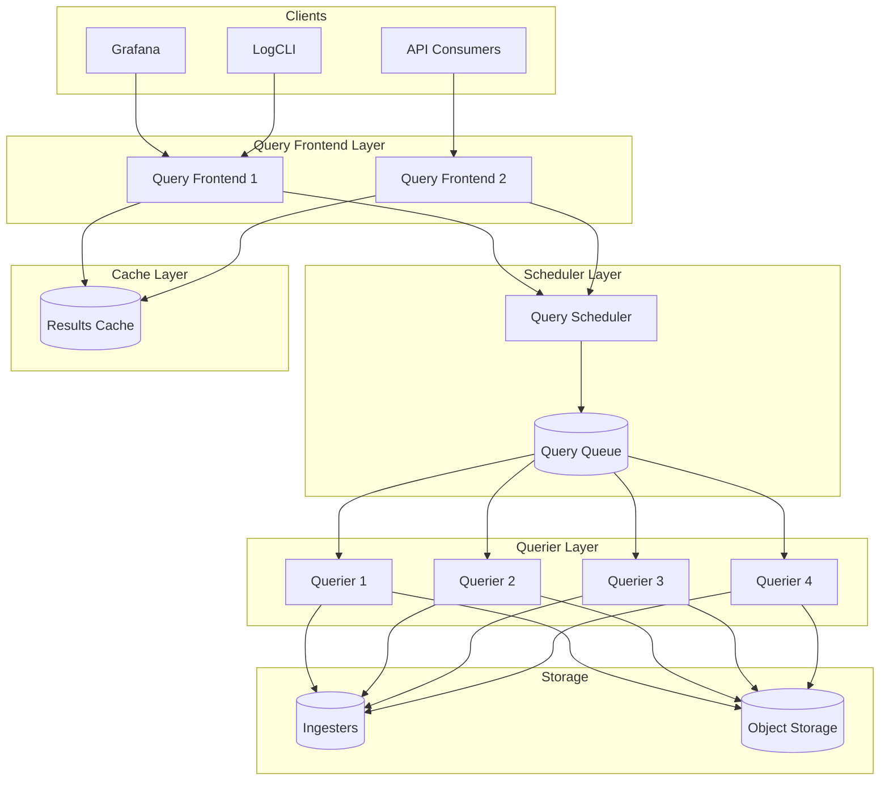
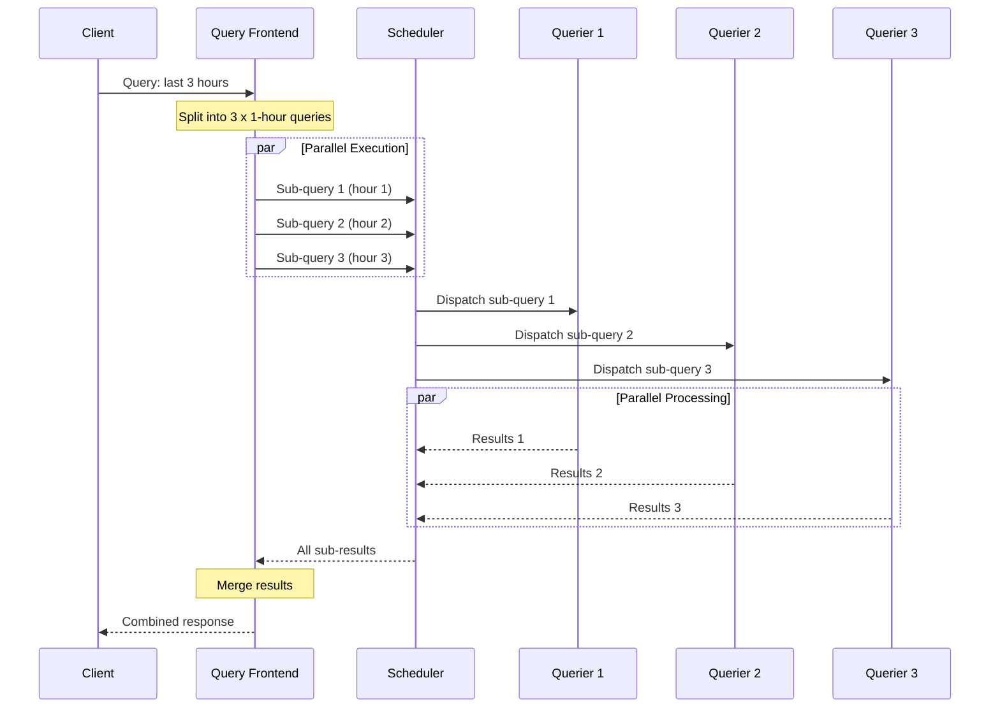
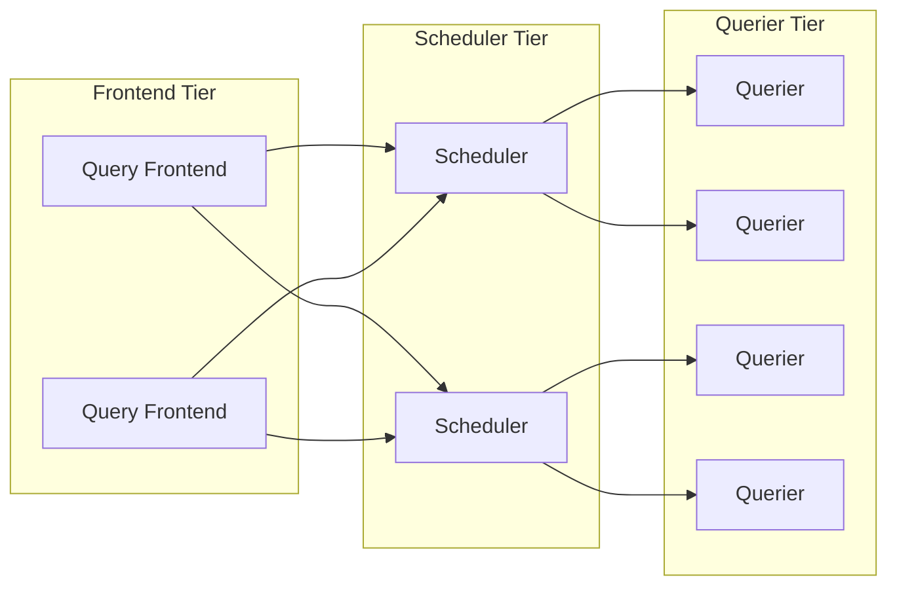

# How to Create Loki Query Frontend

Author: [nawazdhandala](https://github.com/nawazdhandala)

Tags: Loki, Observability, Queries, Performance

Description: Configure Loki Query Frontend for faster log queries through splitting, parallelization, and intelligent caching.

---

Loki is a fantastic log aggregation system, but as your data grows, query latency can become a bottleneck. The Query Frontend is Loki's answer to this problem. It sits between your clients and queriers, transforming single large queries into multiple smaller ones that run in parallel.

This post walks you through configuring the Query Frontend, understanding query splitting, integrating with the scheduler, and managing query queues for optimal performance.

---

## What is the Query Frontend?

The Query Frontend is an optional but highly recommended component in Loki's microservices deployment. It provides:

- **Query Splitting:** Breaks large time-range queries into smaller sub-queries
- **Parallelization:** Runs sub-queries concurrently across multiple queriers
- **Result Caching:** Stores query results to avoid redundant computation
- **Query Deduplication:** Prevents duplicate queries from consuming resources
- **Queue Management:** Controls query scheduling and fairness

Without the Query Frontend, a single query spanning 7 days hits one querier and waits. With it, that query becomes 168 hourly queries running in parallel, returning results dramatically faster.

---

## Architecture Overview



The flow works as follows:

1. Client sends a query to the Query Frontend
2. Frontend checks the cache for existing results
3. If not cached, the query is split into sub-queries
4. Sub-queries are sent to the Scheduler
5. Scheduler places them in the queue with fairness policies
6. Queriers pull work from the queue
7. Results are merged, cached, and returned to the client

---

## Query Frontend Configuration

Here is a production-ready Query Frontend configuration:

```yaml
# loki-config.yaml

# Enable the query frontend target
target: query-frontend

# Server configuration for the frontend
server:
  http_listen_port: 3100
  grpc_listen_port: 9095
  # Increase timeouts for large queries
  http_server_read_timeout: 5m
  http_server_write_timeout: 5m

# Query Frontend specific settings
query_frontend:
  # Maximum number of outstanding requests per tenant
  max_outstanding_per_tenant: 2048

  # Compress responses to save bandwidth
  compress_responses: true

  # Log queries that take longer than this threshold
  log_queries_longer_than: 10s

# Frontend worker configuration
frontend_worker:
  # Address of the query frontend (used by queriers)
  frontend_address: "query-frontend:9095"

  # Number of simultaneous queries each querier handles
  parallelism: 8

  # gRPC client configuration
  grpc_client_config:
    max_recv_msg_size: 104857600  # 100MB
    max_send_msg_size: 104857600

# Query range splitting configuration
query_range:
  # Enable result caching
  cache_results: true

  # Split queries by this interval
  split_queries_by_interval: 1h

  # Maximum number of sub-queries that can run in parallel
  max_parallel: 16

  # Align queries to the split interval for better cache hits
  align_queries_with_step: true

  results_cache:
    cache:
      # Use embedded cache (for single-node setups)
      embedded_cache:
        enabled: true
        max_size_mb: 500
        ttl: 24h

# Limits configuration
limits_config:
  # Maximum query length
  max_query_length: 30d

  # Maximum number of queries per user
  max_queriers_per_user: 0  # 0 means unlimited

  # Query timeout
  query_timeout: 5m

  # Maximum entries returned per query
  max_entries_limit_per_query: 10000
```

---

## Query Splitting and Parallelization

Query splitting is the core optimization strategy. When a query arrives, the frontend examines its time range and divides it into chunks based on `split_queries_by_interval`.

### How Splitting Works



### Configuration for Different Workloads

For high-throughput environments with many small queries:

```yaml
query_range:
  # Smaller split interval means more parallelism
  split_queries_by_interval: 15m

  # Higher parallelism for more concurrent sub-queries
  max_parallel: 32

  # Align to interval boundaries
  align_queries_with_step: true
```

For environments with fewer but larger queries:

```yaml
query_range:
  # Larger interval reduces overhead
  split_queries_by_interval: 2h

  # Moderate parallelism
  max_parallel: 8

  align_queries_with_step: true
```

---

## Scheduler Integration for Distributed Queries

The Query Scheduler decouples the frontend from queriers, enabling better scaling and fairness. In large deployments, you should run the scheduler as a separate component.

### Scheduler Configuration

```yaml
# loki-scheduler-config.yaml

target: query-scheduler

server:
  http_listen_port: 3100
  grpc_listen_port: 9095

query_scheduler:
  # Maximum number of outstanding requests per tenant
  max_outstanding_requests_per_tenant: 2048

  # Use DNS for querier discovery
  querier_forget_delay: 2m

  # gRPC server settings
  grpc_client_config:
    max_recv_msg_size: 104857600
    max_send_msg_size: 104857600

# When using separate scheduler, configure frontend to connect
query_frontend:
  # Point to scheduler instead of direct querier connection
  scheduler_address: "query-scheduler:9095"

  # Scheduler worker configuration
  scheduler_worker_concurrency: 5
```

### Querier Configuration to Connect to Scheduler

```yaml
# loki-querier-config.yaml

target: querier

frontend_worker:
  # Connect to scheduler instead of frontend
  scheduler_address: "query-scheduler:9095"

  # Number of concurrent queries this querier handles
  parallelism: 8

  # Match the address used by the scheduler
  id: "querier-1"

  grpc_client_config:
    max_recv_msg_size: 104857600
```

### Distributed Architecture with Scheduler



---

## Query Queue Management

The query queue ensures fair resource distribution across tenants and prevents any single user from monopolizing queriers.

### Queue Configuration

```yaml
query_scheduler:
  # Maximum outstanding requests per tenant
  max_outstanding_requests_per_tenant: 1024

  # How long to wait before forgetting a disconnected querier
  querier_forget_delay: 2m

limits_config:
  # Maximum queriers a single tenant can use (0 = unlimited)
  max_queriers_per_user: 4

  # Priority-based queue settings
  # Lower number = higher priority
  query_priority:
    enabled: true
    default_priority: 50

  # Per-tenant queue limits
  max_outstanding_requests_per_tenant: 512
```

### Queue Priority Configuration

For multi-tenant environments, you can set different priorities:

```yaml
# runtime-config.yaml (loaded dynamically)

overrides:
  # High-priority tenant (production dashboards)
  tenant-prod:
    max_queriers_per_user: 8
    max_outstanding_requests_per_tenant: 2048
    query_priority: 10  # Higher priority (lower number)

  # Standard tenant
  tenant-dev:
    max_queriers_per_user: 2
    max_outstanding_requests_per_tenant: 256
    query_priority: 100  # Lower priority

  # Batch jobs tenant
  tenant-batch:
    max_queriers_per_user: 1
    max_outstanding_requests_per_tenant: 64
    query_priority: 200  # Lowest priority
```

---

## Results Caching

Caching is essential for dashboard queries that repeat frequently. Loki supports multiple cache backends.

### Embedded Cache (Single Node)

```yaml
query_range:
  cache_results: true
  results_cache:
    cache:
      embedded_cache:
        enabled: true
        max_size_mb: 1000  # 1GB cache
        ttl: 1h
```

### Memcached (Distributed)

```yaml
query_range:
  cache_results: true
  results_cache:
    cache:
      memcached_client:
        addresses: "memcached-1:11211,memcached-2:11211"
        timeout: 500ms
        max_idle_conns: 100
        update_interval: 1m
```

### Redis (Distributed with Persistence)

```yaml
query_range:
  cache_results: true
  results_cache:
    cache:
      redis:
        endpoint: "redis-cluster:6379"
        timeout: 500ms
        expiration: 1h
        pool_size: 100
```

### Cache Efficiency Tips

1. **Align queries to intervals**: Set `align_queries_with_step: true` so queries hit cache boundaries
2. **Use consistent time ranges**: Dashboard queries should use standard intervals (1h, 6h, 24h)
3. **Monitor cache hit rates**: Track `loki_query_frontend_cache_hits_total` and `loki_query_frontend_cache_misses_total`

---

## Complete Kubernetes Deployment

Here is a complete Kubernetes deployment for the Query Frontend:

```yaml
# query-frontend-deployment.yaml
apiVersion: apps/v1
kind: Deployment
metadata:
  name: loki-query-frontend
  namespace: loki
spec:
  replicas: 2
  selector:
    matchLabels:
      app: loki-query-frontend
  template:
    metadata:
      labels:
        app: loki-query-frontend
    spec:
      containers:
        - name: query-frontend
          image: grafana/loki:2.9.0
          args:
            - -config.file=/etc/loki/config.yaml
            - -target=query-frontend
          ports:
            - name: http
              containerPort: 3100
            - name: grpc
              containerPort: 9095
          resources:
            requests:
              cpu: 500m
              memory: 512Mi
            limits:
              cpu: 2000m
              memory: 2Gi
          volumeMounts:
            - name: config
              mountPath: /etc/loki
          readinessProbe:
            httpGet:
              path: /ready
              port: 3100
            initialDelaySeconds: 15
            periodSeconds: 10
          livenessProbe:
            httpGet:
              path: /ready
              port: 3100
            initialDelaySeconds: 30
            periodSeconds: 30
      volumes:
        - name: config
          configMap:
            name: loki-config
---
# Service for Query Frontend
apiVersion: v1
kind: Service
metadata:
  name: loki-query-frontend
  namespace: loki
spec:
  type: ClusterIP
  ports:
    - name: http
      port: 3100
      targetPort: 3100
    - name: grpc
      port: 9095
      targetPort: 9095
  selector:
    app: loki-query-frontend
---
# ConfigMap with Query Frontend configuration
apiVersion: v1
kind: ConfigMap
metadata:
  name: loki-config
  namespace: loki
data:
  config.yaml: |
    auth_enabled: true

    server:
      http_listen_port: 3100
      grpc_listen_port: 9095
      http_server_read_timeout: 5m
      http_server_write_timeout: 5m

    query_frontend:
      max_outstanding_per_tenant: 2048
      compress_responses: true
      log_queries_longer_than: 10s
      scheduler_address: "loki-query-scheduler:9095"

    query_range:
      cache_results: true
      split_queries_by_interval: 1h
      max_parallel: 16
      align_queries_with_step: true
      results_cache:
        cache:
          memcached_client:
            addresses: "memcached:11211"
            timeout: 500ms

    limits_config:
      max_query_length: 30d
      query_timeout: 5m
      max_entries_limit_per_query: 10000
```

---

## Monitoring the Query Frontend

Track these key metrics to ensure your Query Frontend is performing well:

```yaml
# Prometheus alerting rules
groups:
  - name: loki-query-frontend
    rules:
      # Alert on high queue wait time
      - alert: LokiQueryFrontendHighQueueTime
        expr: |
          histogram_quantile(0.99,
            sum(rate(loki_query_frontend_queue_duration_seconds_bucket[5m])) by (le)
          ) > 30
        for: 5m
        labels:
          severity: warning
        annotations:
          summary: "Query queue wait time is high"
          description: "99th percentile queue time is above 30 seconds"

      # Alert on low cache hit rate
      - alert: LokiQueryFrontendLowCacheHitRate
        expr: |
          sum(rate(loki_query_frontend_cache_hits_total[5m])) /
          (sum(rate(loki_query_frontend_cache_hits_total[5m])) +
           sum(rate(loki_query_frontend_cache_misses_total[5m]))) < 0.5
        for: 15m
        labels:
          severity: warning
        annotations:
          summary: "Query cache hit rate is below 50%"

      # Alert on query failures
      - alert: LokiQueryFrontendHighFailureRate
        expr: |
          sum(rate(loki_query_frontend_queries_total{status="failed"}[5m])) /
          sum(rate(loki_query_frontend_queries_total[5m])) > 0.05
        for: 5m
        labels:
          severity: critical
        annotations:
          summary: "More than 5% of queries are failing"
```

### Key Metrics to Watch

| Metric | Description | Target |
|--------|-------------|--------|
| `loki_query_frontend_queue_duration_seconds` | Time queries spend in queue | p99 < 10s |
| `loki_query_frontend_cache_hits_total` | Number of cache hits | > 50% hit rate |
| `loki_query_frontend_queries_total` | Total queries processed | Monitor for trends |
| `loki_query_frontend_retries_total` | Query retries | Should be low |

---

## Performance Tuning Tips

1. **Right-size split intervals**: Start with 1 hour and adjust based on your query patterns. Smaller intervals mean more parallelism but higher overhead.

2. **Scale queriers based on queue depth**: If `loki_query_scheduler_queue_length` consistently grows, add more queriers.

3. **Use query sharding for very large queries**: Enable `query_frontend.shard_queries` for additional parallelism within each sub-query.

4. **Set appropriate timeouts**: Balance between allowing large queries and preventing resource exhaustion.

5. **Monitor memory usage**: The frontend holds query results in memory during merging. Set appropriate limits.

---

## Common Issues and Solutions

**Issue: Queries timing out**
- Increase `query_timeout` in limits_config
- Add more queriers to handle load
- Check if split interval is too large

**Issue: Low cache hit rate**
- Enable `align_queries_with_step`
- Encourage consistent query time ranges in dashboards
- Increase cache TTL for stable data

**Issue: Queue buildup**
- Add more queriers
- Reduce `max_outstanding_per_tenant` to shed load
- Check for runaway queries from specific tenants

**Issue: Memory pressure on frontend**
- Reduce `max_parallel` to limit concurrent sub-queries
- Use external cache (Memcached/Redis) instead of embedded
- Increase memory limits or add more frontend replicas

---

## Final Take

The Loki Query Frontend transforms slow, sequential queries into fast, parallel operations. Combined with intelligent caching and the Query Scheduler, you can scale log queries to handle demanding production workloads.

Start with the basic configuration, monitor the key metrics, and tune based on your specific query patterns. The investment in setting up the Query Frontend pays off quickly as your log volume grows.

---

**Related Reading:**

- [What is OpenTelemetry Collector and Why Use One?](https://oneuptime.com/blog/post/2025-09-18-what-is-opentelemetry-collector-and-why-use-one/view)
- [How to Structure Logs Properly in OpenTelemetry](https://oneuptime.com/blog/post/2025-08-28-how-to-structure-logs-properly-in-opentelemetry/view)
- [Three Pillars of Observability: Logs, Metrics, Traces](https://oneuptime.com/blog/post/2025-08-20-three-pillars-of-observability-logs-metrics-traces/view)
