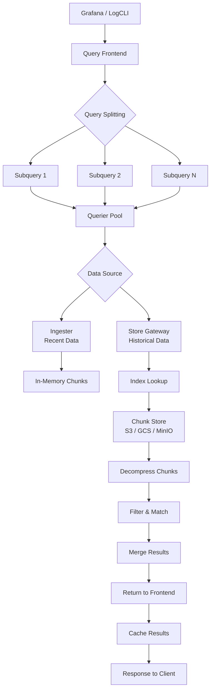
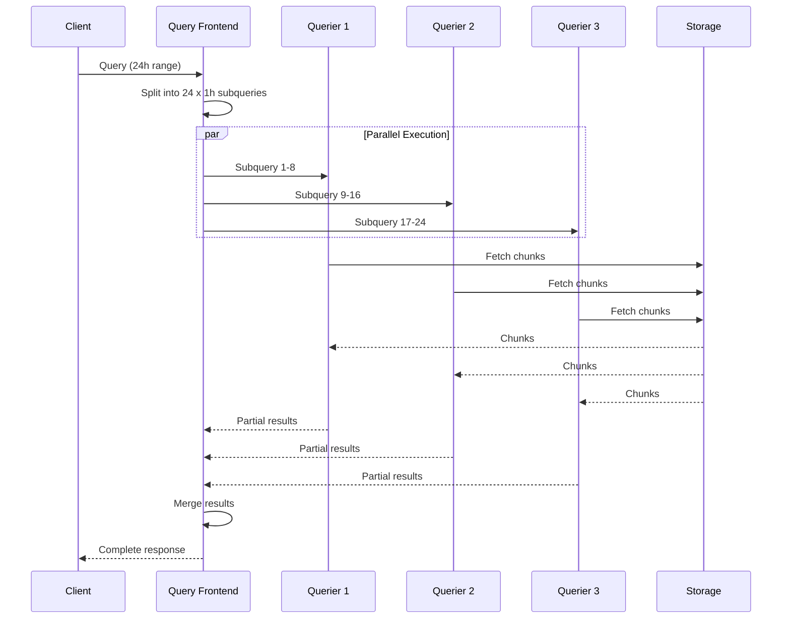
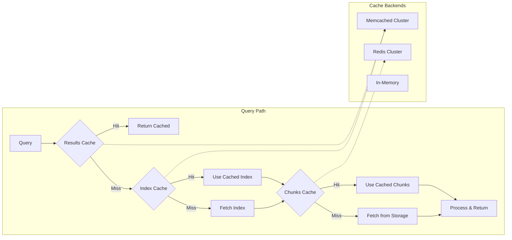
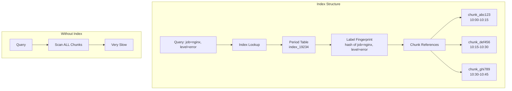

# How to Create Loki Read Path Optimization

Author: [nawazdhandala](https://github.com/nawazdhandala)

Tags: Loki, Observability, Performance, Optimization

Description: A practical guide to optimizing Grafana Loki's read path for faster log queries and better resource utilization.

---

You're debugging a production incident. Logs are critical. You fire off a query in Grafana. Thirty seconds pass. Then sixty. Your Loki cluster is churning through terabytes of compressed chunks while you watch a spinner. Meanwhile, the incident escalates.

This scenario plays out daily in teams running Loki at scale. The good news: Loki's read path is highly tunable. The architecture was designed for horizontal scaling and intelligent query distribution. You just need to understand the levers.

This guide walks you through Loki's read path architecture, query optimization strategies, caching layers, and index tuning. By the end, you'll have a checklist for slashing query latency without throwing more hardware at the problem.

---

## Read Path Architecture Overview

Before optimizing, you need to understand how queries flow through Loki. The read path involves several components working together to fetch, decompress, and filter log data.

### Core Components

**Query Frontend**: The entry point for all queries. It handles query splitting, caching, and result merging. Think of it as the traffic controller.

**Querier**: The worker that actually executes queries. It reads from both ingesters (recent data) and long-term storage (historical data).

**Ingester**: Holds recent log data in memory before flushing to storage. Queriers hit ingesters for the "hot" data window.

**Store Gateway** (optional): Provides efficient access to historical data by maintaining an index of chunks in object storage.

**Index**: Maps label combinations to chunk references. This is where queries start their search.

**Chunks**: Compressed log data stored in object storage (S3, GCS, MinIO, etc.).

### Query Execution Flow



When you submit a query:

1. The query frontend receives the request
2. It checks the results cache for a hit
3. If no cache hit, the query is split into smaller time ranges
4. Subqueries are distributed across available queriers
5. Each querier checks ingesters for recent data and storage for historical data
6. Results are merged, cached, and returned

Understanding this flow reveals optimization opportunities at each step.

---

## Query Parallelization and Splitting

Query splitting is Loki's primary mechanism for parallel execution. The query frontend divides large time ranges into smaller intervals that can be processed concurrently.

### How Splitting Works



### Configuration for Query Splitting

The `split_queries_by_interval` setting controls how queries are divided. Smaller intervals mean more parallelism but also more overhead.

```yaml
# loki-config.yaml

# Query frontend configuration for optimal splitting
query_frontend:
  # Split queries into 15-minute intervals
  # Smaller intervals = more parallelism but more overhead
  # Larger intervals = less parallelism but lower coordination cost
  split_queries_by_interval: 15m

  # Maximum number of subqueries to run in parallel
  # Set based on your querier pool size
  max_outstanding_per_tenant: 2048

  # Compress responses between frontend and queriers
  # Reduces network bandwidth at cost of CPU
  compress_responses: true

  # Queue queries when queriers are busy
  # Prevents overload during traffic spikes
  max_queriers_per_tenant: 0  # 0 = no limit

# Querier concurrency settings
querier:
  # Maximum concurrent queries per querier instance
  max_concurrent: 20

  # Timeout for individual queries
  query_timeout: 5m

  # Number of parallel workers for chunk fetching
  engine:
    max_look_back_period: 0s
```

### Tuning Split Intervals

The optimal split interval depends on your data volume and cluster size:

```yaml
# High-volume clusters (> 1TB/day ingestion)
# Use smaller splits for maximum parallelism
query_frontend:
  split_queries_by_interval: 5m

# Medium-volume clusters (100GB - 1TB/day)
# Balance parallelism with overhead
query_frontend:
  split_queries_by_interval: 15m

# Low-volume clusters (< 100GB/day)
# Larger splits reduce coordination overhead
query_frontend:
  split_queries_by_interval: 30m
```

### Query Sharding for Label Cardinality

For streams with high label cardinality, enable query sharding to parallelize within a single time interval:

```yaml
# Enable query sharding for high-cardinality workloads
query_frontend:
  # Number of shards to split each subquery into
  # Higher values = more parallelism for high-cardinality queries
  max_query_parallelism: 32

  # Shard queries based on label hash
  parallelise_shardable_queries: true

# Limits configuration for sharding
limits_config:
  # Maximum number of shards per query
  max_query_parallelism: 32

  # Enable sharding for metric queries
  query_sharding_target_bytes_per_shard: 100MB
```

---

## Cache Layer Configuration

Caching is the single most impactful optimization for read performance. Loki supports multiple cache layers, each targeting different access patterns.

### Cache Architecture



### Results Cache Configuration

The results cache stores complete query responses. This provides the fastest path for repeated queries.

```yaml
# Results cache using Memcached
query_frontend:
  results_cache:
    cache:
      # Enable results caching
      enable_fifocache: false

      # Memcached backend for distributed caching
      memcached_client:
        # Memcached server addresses
        addresses: "memcached-results.loki.svc:11211"

        # Connection timeout
        timeout: 500ms

        # Maximum idle connections per server
        max_idle_conns: 100

        # Update interval for server list
        update_interval: 1m

        # Enable consistent hashing for better distribution
        consistent_hash: true

    # Cache query results for 24 hours
    # Adjust based on how frequently your data changes
    default_validity: 24h

    # Only cache results for queries longer than 1 hour
    # Short queries are fast enough without caching
    cache_results: true
```

### Index Cache Configuration

The index cache stores label-to-chunk mappings. This dramatically speeds up the initial query planning phase.

```yaml
# Storage configuration with index caching
storage_config:
  # Index cache configuration
  index_cache_validity: 5m

  # BoltDB shipper for index storage
  boltdb_shipper:
    # Directory for local index cache
    cache_location: /loki/boltdb-cache

    # Cache TTL for index entries
    cache_ttl: 24h

    # Resync index files at this interval
    resync_interval: 5m

  # Index queries cache (separate from chunk cache)
  index_queries_cache_config:
    memcached:
      batch_size: 256
      parallelism: 10
    memcached_client:
      addresses: "memcached-index.loki.svc:11211"
      timeout: 500ms
      max_idle_conns: 100
```

### Chunks Cache Configuration

The chunks cache stores decompressed log data. This is the largest cache and provides the most benefit for repeated access to the same time ranges.

```yaml
# Chunk cache configuration
chunk_store_config:
  # Maximum number of chunks to cache in memory
  chunk_cache_config:
    # Use embedded cache for small deployments
    enable_fifocache: true
    fifocache:
      max_size_bytes: 2GB
      validity: 1h

    # Or use Memcached for distributed deployments
    memcached:
      batch_size: 1024
      parallelism: 100
    memcached_client:
      addresses: "memcached-chunks.loki.svc:11211"
      timeout: 1s
      max_idle_conns: 200
      max_async_concurrency: 100
      max_async_buffer_size: 100000
      max_get_multi_concurrency: 100
      max_get_multi_batch_size: 1024

  # Write-dedupe cache prevents duplicate chunk writes
  write_dedupe_cache_config:
    memcached:
      batch_size: 100
      parallelism: 100
    memcached_client:
      addresses: "memcached-dedupe.loki.svc:11211"
```

### Redis as Cache Backend

For teams preferring Redis over Memcached:

```yaml
# Redis cache configuration
query_frontend:
  results_cache:
    cache:
      redis:
        # Redis server endpoint
        endpoint: "redis-master.loki.svc:6379"

        # Connection timeout
        timeout: 500ms

        # Database number (0-15)
        db: 0

        # Connection pool size
        pool_size: 100

        # Password if authentication is required
        # password: ${REDIS_PASSWORD}

        # TLS configuration
        # tls_enabled: true

# Chunk cache using Redis
chunk_store_config:
  chunk_cache_config:
    redis:
      endpoint: "redis-master.loki.svc:6379"
      timeout: 1s
      db: 1
      pool_size: 200
```

---

## Index Optimization Strategies

The index is the foundation of query performance. A well-designed index minimizes the amount of data Loki must scan.

### Index Structure



### Schema Configuration for Optimal Indexing

```yaml
# Schema configuration
schema_config:
  configs:
    # Use the latest schema version for best performance
    - from: 2024-01-01
      store: tsdb
      object_store: s3
      schema: v13
      index:
        # Index table prefix
        prefix: loki_index_

        # Create new index table every 24 hours
        # Shorter periods = faster deletes but more tables
        period: 24h

      # Row shards distribute index entries
      # Higher values = better write distribution
      # But more index lookups during reads
      row_shards: 16

# For high-cardinality workloads, use TSDB index
# TSDB provides better compression and faster lookups
schema_config:
  configs:
    - from: 2024-01-01
      store: tsdb
      object_store: s3
      schema: v13
      index:
        prefix: loki_tsdb_index_
        period: 24h
```

### Compactor Configuration

The compactor merges index files and removes deleted data, keeping the index efficient:

```yaml
# Compactor configuration for index optimization
compactor:
  # Working directory for compaction
  working_directory: /loki/compactor

  # Shared store for compacted indexes
  shared_store: s3

  # Run compaction every 10 minutes
  compaction_interval: 10m

  # Retention settings
  retention_enabled: true
  retention_delete_delay: 2h
  retention_delete_worker_count: 150

  # Delete request handling
  delete_request_cancel_period: 24h

  # Apply retention per tenant
  # Useful for multi-tenant deployments
  retention_table_timeout: 0s
```

### Label Best Practices

Your label design directly impacts index efficiency and query speed:

```yaml
# Good labels - low cardinality, high selectivity
# These create efficient index entries
{job="nginx", env="production", level="error"}

# Bad labels - high cardinality, creates index bloat
# These slow down queries and increase storage
{job="nginx", request_id="abc123", user_id="12345"}
```

Example of label optimization in your application:

```python
# Python logging with structured labels
import logging
import json

# Configure structured logging for Loki
class LokiFormatter(logging.Formatter):
    def format(self, record):
        log_entry = {
            # Static labels - indexed, low cardinality
            "job": "payment-service",
            "env": "production",
            "level": record.levelname.lower(),

            # Dynamic data - not indexed, stored in log line
            "message": record.getMessage(),
            "request_id": getattr(record, 'request_id', None),
            "user_id": getattr(record, 'user_id', None),
            "duration_ms": getattr(record, 'duration_ms', None),
        }
        return json.dumps(log_entry)

# Use structured queries to filter on non-indexed fields
# Query: {job="payment-service"} |= "error" | json | user_id="12345"
```

---

## Practical Query Optimization Examples

Let's look at real query patterns and how to optimize them.

### Filtering Early with Label Matchers

```logql
# Slow - scans all logs, then filters
{job="nginx"} |= "error"

# Faster - uses index to narrow scope first
{job="nginx", level="error"}

# Fastest - combines index filtering with line matching
{job="nginx", level="error"} |= "timeout" | json | status_code >= 500
```

### Using JSON Parsing Efficiently

```logql
# Inefficient - parses JSON for every line
{job="api"} | json | status_code >= 500

# Better - filter first, parse what remains
{job="api"} |= "error" | json | status_code >= 500

# Best - use label filtering before line parsing
{job="api", level="error"} | json | status_code >= 500
```

### Optimizing Metric Queries

```logql
# Slow - counts all error lines across all services
count_over_time({level="error"}[1h])

# Faster - narrow by service first
count_over_time({job="checkout", level="error"}[1h])

# Add rate limiting to avoid overwhelming queriers
# Use shorter ranges when possible
sum(rate({job="checkout", level="error"}[5m]))
```

### Query Performance Comparison

```yaml
# Example query analysis
# Query 1: Broad scan (slow)
# {namespace="production"} |= "error"
# - Scans: ~500GB of chunks
# - Time: 45 seconds
# - Chunks processed: 12,000

# Query 2: Label-filtered (fast)
# {namespace="production", app="api", level="error"}
# - Scans: ~2GB of chunks
# - Time: 1.2 seconds
# - Chunks processed: 150

# Query 3: With caching (fastest for repeat queries)
# Same as Query 2, second execution
# - Scans: 0 (cache hit)
# - Time: 50ms
# - Chunks processed: 0
```

---

## Resource Limits and Tenant Configuration

Proper resource limits prevent runaway queries from impacting cluster stability.

```yaml
# Limits configuration
limits_config:
  # Query limits
  max_query_length: 721h  # Maximum query time range
  max_query_lookback: 90d  # How far back queries can look
  max_entries_limit_per_query: 50000  # Maximum log lines returned

  # Rate limits
  ingestion_rate_mb: 50  # MB/s per tenant
  ingestion_burst_size_mb: 100  # Burst allowance

  # Cardinality limits
  max_label_name_length: 1024
  max_label_value_length: 2048
  max_label_names_per_series: 30

  # Query resource limits
  max_query_parallelism: 32
  max_queriers_per_tenant: 10

  # Cache behavior
  max_cache_freshness_per_query: 10m

  # Split and shard settings
  split_queries_by_interval: 15m
  query_sharding_target_bytes_per_shard: 100MB

# Per-tenant overrides for different workloads
overrides:
  # High-priority tenant with relaxed limits
  tenant-critical:
    max_query_parallelism: 64
    max_entries_limit_per_query: 100000
    max_queriers_per_tenant: 20

  # Cost-conscious tenant with strict limits
  tenant-budget:
    max_query_parallelism: 8
    max_entries_limit_per_query: 10000
    max_queriers_per_tenant: 5
```

---

## Monitoring Query Performance

You can not optimize what you do not measure. Expose Loki metrics to understand query patterns.

```yaml
# Prometheus scrape config for Loki metrics
scrape_configs:
  - job_name: 'loki'
    static_configs:
      - targets:
        - 'loki-query-frontend:3100'
        - 'loki-querier:3100'
        - 'loki-ingester:3100'
```

Key metrics to monitor:

```promql
# Query latency by route
histogram_quantile(0.99,
  sum(rate(loki_request_duration_seconds_bucket{route=~"loki_api_v1_query.*"}[5m]))
  by (le, route)
)

# Cache hit ratio
sum(rate(loki_cache_hits_total[5m])) /
sum(rate(loki_cache_fetched_keys_total[5m]))

# Chunks fetched per query (lower is better)
histogram_quantile(0.95,
  sum(rate(loki_chunk_store_chunks_fetched_bucket[5m]))
  by (le)
)

# Index lookups per query
sum(rate(loki_index_lookups_total[5m])) by (table)

# Query queue time (indicates capacity issues)
histogram_quantile(0.95,
  sum(rate(loki_query_frontend_queue_duration_seconds_bucket[5m]))
  by (le)
)
```

---

## Complete Optimized Configuration Example

Here's a production-ready configuration combining all optimizations:

```yaml
# loki-config.yaml - Optimized for read performance

# Authentication and server settings
auth_enabled: true

server:
  http_listen_port: 3100
  grpc_listen_port: 9095
  grpc_server_max_recv_msg_size: 104857600
  grpc_server_max_send_msg_size: 104857600

# Distributor configuration
distributor:
  ring:
    kvstore:
      store: memberlist

# Ingester configuration
ingester:
  lifecycler:
    ring:
      kvstore:
        store: memberlist
      replication_factor: 3
  chunk_idle_period: 30m
  chunk_block_size: 262144
  chunk_encoding: snappy
  chunk_retain_period: 1m
  max_transfer_retries: 0
  wal:
    enabled: true
    dir: /loki/wal

# Query frontend - optimized for parallelism
query_frontend:
  max_outstanding_per_tenant: 2048
  compress_responses: true

  # Query splitting for parallelism
  split_queries_by_interval: 15m
  parallelise_shardable_queries: true

  # Results cache
  results_cache:
    cache:
      memcached_client:
        addresses: "memcached-results:11211"
        timeout: 500ms
        max_idle_conns: 100
        consistent_hash: true
    default_validity: 12h

# Querier configuration
querier:
  max_concurrent: 20
  query_timeout: 5m
  query_ingesters_within: 3h
  engine:
    timeout: 5m

# Query scheduler for better load distribution
query_scheduler:
  max_outstanding_requests_per_tenant: 2048

# Storage configuration with caching
storage_config:
  boltdb_shipper:
    active_index_directory: /loki/index
    cache_location: /loki/boltdb-cache
    cache_ttl: 24h
    shared_store: s3

  aws:
    s3: s3://your-region/loki-chunks
    s3forcepathstyle: true

  # Index cache
  index_queries_cache_config:
    memcached:
      batch_size: 256
      parallelism: 10
    memcached_client:
      addresses: "memcached-index:11211"
      timeout: 500ms
      max_idle_conns: 100

# Chunk store with caching
chunk_store_config:
  chunk_cache_config:
    memcached:
      batch_size: 1024
      parallelism: 100
    memcached_client:
      addresses: "memcached-chunks:11211"
      timeout: 1s
      max_idle_conns: 200

# Schema - use latest version
schema_config:
  configs:
    - from: 2024-01-01
      store: tsdb
      object_store: s3
      schema: v13
      index:
        prefix: loki_tsdb_
        period: 24h

# Compactor for index optimization
compactor:
  working_directory: /loki/compactor
  shared_store: s3
  compaction_interval: 10m
  retention_enabled: true
  retention_delete_delay: 2h

# Limits configuration
limits_config:
  max_query_length: 721h
  max_query_lookback: 90d
  max_entries_limit_per_query: 50000
  max_query_parallelism: 32
  split_queries_by_interval: 15m
  ingestion_rate_mb: 50
  ingestion_burst_size_mb: 100
  max_label_names_per_series: 30
  query_sharding_target_bytes_per_shard: 100MB
```

---

## Optimization Checklist

Use this checklist to evaluate your Loki read path:

- [ ] Enable query splitting with appropriate intervals (5m-30m based on volume)
- [ ] Configure results cache with Memcached or Redis
- [ ] Set up index cache to speed up label lookups
- [ ] Enable chunks cache for frequently accessed time ranges
- [ ] Use TSDB schema (v13) for better index performance
- [ ] Configure compactor to run regularly
- [ ] Set appropriate query limits per tenant
- [ ] Design labels for low cardinality (avoid request_id, user_id as labels)
- [ ] Monitor cache hit rates and query latencies
- [ ] Use label matchers before line filters in queries
- [ ] Enable query sharding for high-cardinality workloads

---

## Common Pitfalls and Solutions

| Problem | Symptom | Solution |
|---------|---------|----------|
| Slow queries | Queries take > 30s | Enable caching, narrow label scope |
| Cache misses | Low hit ratio (< 50%) | Increase cache size, check TTL settings |
| Query timeouts | 504 errors | Increase timeout, split into smaller ranges |
| Memory pressure | OOM on queriers | Reduce max_concurrent, add querier replicas |
| High chunk scans | Millions of chunks per query | Improve label selectivity, add more labels |
| Index bloat | Slow startups, high memory | Run compactor, reduce label cardinality |

---

## Final Thoughts

Loki's read path optimization is not about finding a single magic setting. It's about understanding the data flow and tuning each layer appropriately. Start with caching (the biggest win), then move to query splitting, and finally tune your schema and labels.

The best optimization is often at the application level: structured logs with thoughtful labels. If your labels have high cardinality, no amount of infrastructure tuning will save you.

Measure everything. Use Loki's own metrics to understand where time is spent. Cache hit ratios below 50% indicate configuration problems. Query times increasing over time suggest index bloat or growing data volumes that need more parallelism.

Keep your queries focused. A query that scans a week of data across all services will always be slow. Design your dashboards and alerts to use narrow, well-indexed queries.

---

**Related Reading:**

- [Three Pillars of Observability: Logs, Metrics, and Traces](https://oneuptime.com/blog/post/2025-08-20-three-pillars-of-observability-logs-metrics-traces/view)
- [How to Structure Logs Properly in OpenTelemetry](https://oneuptime.com/blog/post/2025-08-28-how-to-structure-logs-properly-in-opentelemetry/view)
- [What is OpenTelemetry Collector and Why Use One](https://oneuptime.com/blog/post/2025-09-18-what-is-opentelemetry-collector-and-why-use-one/view)
