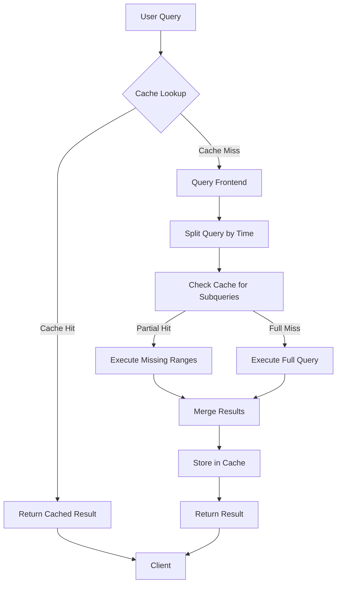
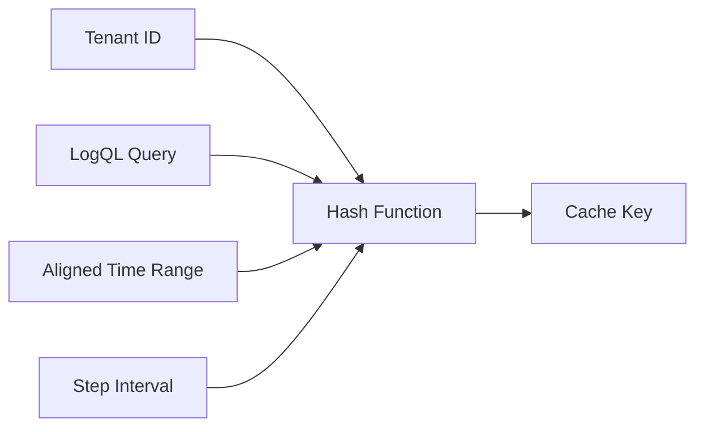
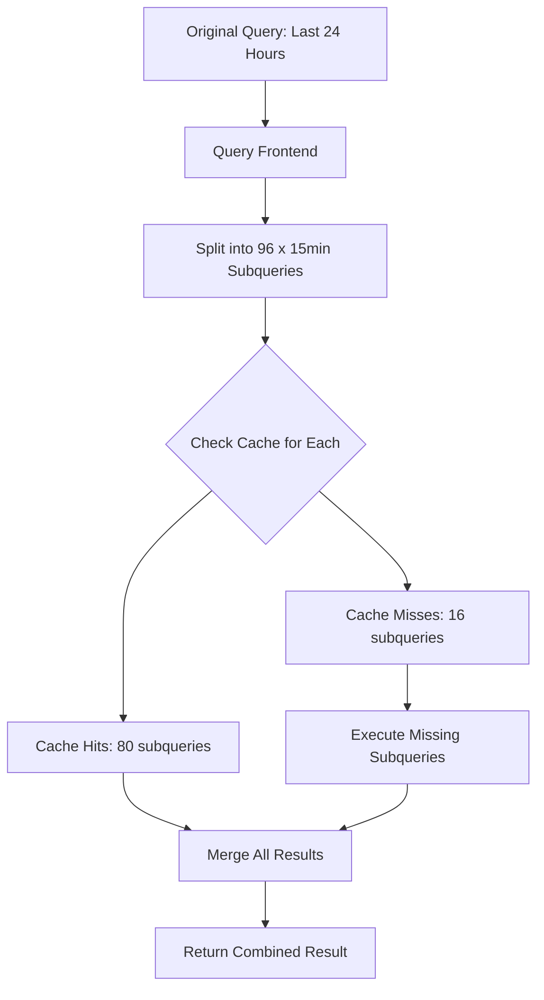

# How to Implement Loki Results Cache

Author: [nawazdhandala](https://github.com/nawazdhandala)

Tags: Loki, Observability, Caching, Performance

Description: A practical guide to implementing Loki results cache for dramatically faster repeated queries and optimized dashboard performance.

---

You open Grafana at 9 AM. Your team dashboard loads in 3 seconds. At 9:15 AM, five engineers refresh the same dashboard. Each refresh hammers Loki with identical queries. By 9:30 AM, your Loki cluster is sweating, and query latency has tripled.

Sound familiar? The fix is simpler than you think: **Loki Results Cache**.

This post walks you through implementing results caching in Loki to eliminate redundant query computation, speed up dashboard loads, and reduce backend pressure. We will cover cache configuration, key generation, query splitting, and practical optimization patterns.

---

## What Is the Results Cache?

The results cache stores the computed output of LogQL queries. When an identical query arrives within the cache TTL, Loki returns the cached result instead of re-executing the query against storage.

Key benefits:

- **Faster repeated queries**: Dashboard refreshes and shared queries return instantly
- **Reduced backend load**: Fewer reads from object storage and index lookups
- **Lower costs**: Less compute and I/O translates to savings at scale
- **Consistent latency**: Cache hits bypass query execution variability

The results cache differs from the chunk cache (which caches raw log data) and the index cache (which caches index lookups). The results cache operates at the query result level, making it the most impactful for user-facing performance.

---

## How the Results Cache Works



The query frontend intercepts incoming queries, generates cache keys, and checks for cached results. For time-range queries, Loki splits the query into aligned intervals and checks the cache for each subquery independently. This allows partial cache hits where some time ranges are served from cache while others are computed fresh.

---

## Configuring the Results Cache

Loki supports multiple cache backends for results caching. Here is a complete configuration example using Memcached:

```yaml
# loki-config.yaml

# Query frontend configuration controls result caching
query_range:
  # Enable result caching
  cache_results: true

  # Maximum number of retries for cache operations
  max_retries: 5

  # Results cache configuration
  results_cache:
    # Cache backend configuration
    cache:
      # Use Memcached as the cache backend
      memcached_client:
        # Memcached server addresses
        addresses: "memcached-0.memcached:11211,memcached-1.memcached:11211"

        # Connection timeout for Memcached
        timeout: 500ms

        # Maximum idle connections per server
        max_idle_conns: 100

        # Update interval for server list (for DNS-based discovery)
        update_interval: 1m

      # Default TTL for cached results
      default_validity: 1h

    # Compression algorithm for cached data
    # Options: snappy, lz4-64k, lz4-256k, lz4-1M, lz4, gzip, none
    compression: snappy

  # Query splitting aligns queries to cache boundaries
  split_queries_by_interval: 15m

  # Align queries to step intervals for better cache hit rates
  align_queries_with_step: true

  # Maximum parallelism for split queries
  parallelism: 32

# Frontend configuration
frontend:
  # Maximum outstanding requests per tenant
  max_outstanding_per_tenant: 2048

  # Compress responses to reduce cache storage
  compress_responses: true

# Query scheduler for distributed query execution
query_scheduler:
  max_outstanding_requests_per_tenant: 2048
```

### Using Redis Instead of Memcached

If you prefer Redis, here is the equivalent configuration:

```yaml
query_range:
  cache_results: true
  results_cache:
    cache:
      redis:
        # Redis server endpoint
        endpoint: "redis-master.redis:6379"

        # Connection timeout
        timeout: 500ms

        # Optional password for authentication
        password: "${REDIS_PASSWORD}"

        # Database number (0-15)
        db: 0

        # Connection pool size
        pool_size: 100

        # TTL for cached entries
        expiration: 1h

      default_validity: 1h
    compression: snappy
```

### In-Memory Cache for Small Deployments

For single-node or development setups, you can use the embedded in-memory cache:

```yaml
query_range:
  cache_results: true
  results_cache:
    cache:
      embedded_cache:
        # Enable the embedded cache
        enabled: true

        # Maximum memory for cache (in bytes)
        max_size_mb: 1024

        # TTL for cached entries
        ttl: 1h
```

---

## Cache Key Generation and Invalidation

Understanding how Loki generates cache keys helps you optimize cache hit rates.

### Cache Key Components

Loki generates cache keys from:

1. **Tenant ID**: Multi-tenant deployments isolate caches per tenant
2. **Query string**: The LogQL expression (normalized)
3. **Time range**: Start and end timestamps (aligned to split interval)
4. **Step**: Query resolution step
5. **Query hash**: A hash combining the above components



### Query Normalization

Before hashing, Loki normalizes queries to maximize cache hits:

```
# These queries produce the same cache key after normalization
{app="nginx"} | json | level="error"
{ app = "nginx" } | json | level = "error"
```

Normalization removes whitespace differences and standardizes formatting.

### Cache Invalidation

Results cache entries are invalidated by:

- **TTL expiration**: Entries expire after the configured validity period
- **Query changes**: Different queries produce different keys
- **Time range changes**: New time ranges miss the cache

There is no automatic invalidation when new logs arrive. This is by design. For most dashboards, slightly stale data is acceptable. Configure your TTL based on your freshness requirements:

```yaml
# Shorter TTL for real-time dashboards (more cache misses, fresher data)
default_validity: 5m

# Longer TTL for historical analysis (better hit rates, acceptable staleness)
default_validity: 1h
```

---

## Query Splitting and Cache Alignment

Query splitting is the secret sauce that makes the results cache effective for time-range queries.

### How Query Splitting Works

When you query a 24-hour range with a 15-minute split interval, Loki breaks it into 96 subqueries:



### Choosing the Split Interval

The split interval balances cache efficiency against query overhead:

```yaml
# Smaller intervals: More cache reuse, more subqueries
split_queries_by_interval: 5m

# Larger intervals: Fewer subqueries, less cache reuse
split_queries_by_interval: 1h

# Recommended starting point for most workloads
split_queries_by_interval: 15m
```

Factors to consider:

- **Dashboard refresh frequency**: Match split interval to typical refresh rates
- **Query cardinality**: More unique queries benefit from smaller splits
- **Cache capacity**: Smaller splits generate more cache entries
- **Query latency**: More splits mean more cache lookups

### Aligning Queries to Step

Enable step alignment to improve cache hits for metric queries:

```yaml
query_range:
  align_queries_with_step: true
```

Without alignment, a query from 10:03:27 to 10:18:27 misses cache entries for 10:00:00 to 10:15:00. With alignment, Loki rounds timestamps to step boundaries.

---

## Dashboard Query Optimization

Your Grafana dashboards can make or break cache effectiveness. Here are practical patterns to maximize cache hits.

### Use Consistent Time Ranges

Inconsistent time ranges defeat caching:

```
# Bad: Custom time ranges produce unique cache keys
{app="api"} | json [now-23h47m:now]

# Good: Standard intervals align with cache boundaries
{app="api"} | json [now-24h:now]
```

Configure Grafana dashboards to use standard intervals (1h, 6h, 12h, 24h, 7d).

### Align Dashboard Refresh to Split Interval

If your split interval is 15 minutes, set dashboard auto-refresh to 15 minutes or a multiple:

```yaml
# Loki configuration
split_queries_by_interval: 15m

# Grafana dashboard settings
# Auto-refresh: 15m, 30m, or 1h (not 10m or 20m)
```

### Template Variables and Caching

Template variables can harm cache efficiency if they produce many unique queries:

```
# Poor cache efficiency: Unique query per user
{app="api", user="$user"} | json

# Better: Use label matchers that align with your query patterns
{app="api", team="$team"} | json
```

If you must use high-cardinality variables, consider pre-aggregating metrics.

### Example Grafana Dashboard Settings

```json
{
  "templating": {
    "list": [
      {
        "name": "app",
        "type": "query",
        "query": "label_values(app)",
        "refresh": 2,
        "multi": false
      }
    ]
  },
  "time": {
    "from": "now-24h",
    "to": "now"
  },
  "refresh": "15m",
  "timepicker": {
    "refresh_intervals": [
      "15m",
      "30m",
      "1h"
    ]
  }
}
```

---

## Monitoring Cache Performance

You cannot optimize what you do not measure. Loki exposes cache metrics that reveal hit rates and performance.

### Key Metrics to Track

```promql
# Cache hit rate (higher is better, target > 80%)
sum(rate(loki_cache_hits_total{cache="results"}[5m])) /
sum(rate(loki_cache_fetched_keys_total{cache="results"}[5m]))

# Cache miss rate
sum(rate(loki_cache_misses_total{cache="results"}[5m]))

# Cache operation latency
histogram_quantile(0.99,
  sum(rate(loki_cache_request_duration_seconds_bucket{cache="results"}[5m])) by (le)
)

# Cached bytes stored
sum(loki_cache_stored_bytes{cache="results"})
```

### Alerting on Cache Degradation

```yaml
# Prometheus alerting rule
groups:
  - name: loki-cache-alerts
    rules:
      - alert: LokiResultsCacheHitRateLow
        expr: |
          sum(rate(loki_cache_hits_total{cache="results"}[15m])) /
          sum(rate(loki_cache_fetched_keys_total{cache="results"}[15m])) < 0.5
        for: 30m
        labels:
          severity: warning
        annotations:
          summary: "Loki results cache hit rate is below 50%"
          description: "Low cache hit rate indicates potential misconfiguration or cache capacity issues."

      - alert: LokiResultsCacheLatencyHigh
        expr: |
          histogram_quantile(0.99,
            sum(rate(loki_cache_request_duration_seconds_bucket{cache="results"}[5m])) by (le)
          ) > 0.1
        for: 10m
        labels:
          severity: warning
        annotations:
          summary: "Loki results cache p99 latency exceeds 100ms"
```

---

## Putting It All Together

Here is a complete configuration combining all the optimization techniques:

```yaml
# Complete Loki configuration with optimized results caching

auth_enabled: true

server:
  http_listen_port: 3100
  grpc_listen_port: 9095

query_range:
  # Enable result caching
  cache_results: true
  max_retries: 5

  results_cache:
    cache:
      memcached_client:
        addresses: "memcached-0.memcached:11211,memcached-1.memcached:11211,memcached-2.memcached:11211"
        timeout: 500ms
        max_idle_conns: 100
        update_interval: 1m

      # 30 minute TTL balances freshness and hit rate
      default_validity: 30m

    # Compress cached results to save memory
    compression: snappy

  # 15 minute splits work well for most dashboard patterns
  split_queries_by_interval: 15m

  # Align to step for metric queries
  align_queries_with_step: true

  # Parallel execution of split queries
  parallelism: 32

  # Cache index stats queries too
  cache_index_stats_results: true
  index_stats_results_cache:
    cache:
      memcached_client:
        addresses: "memcached-0.memcached:11211"
        timeout: 500ms
      default_validity: 5m

frontend:
  max_outstanding_per_tenant: 2048
  compress_responses: true

  # Log queries for debugging cache behavior
  log_queries_longer_than: 10s

query_scheduler:
  max_outstanding_requests_per_tenant: 2048

limits_config:
  # Per-tenant cache TTL override
  results_cache_ttl: 30m

  # Maximum query length (prevents cache pollution from huge queries)
  max_query_length: 721h

  # Query parallelism per tenant
  max_query_parallelism: 32
```

---

## Common Pitfalls and Solutions

| Problem | Symptom | Solution |
|---------|---------|----------|
| Low cache hit rate | Cache hits below 50% | Align dashboard refresh intervals to split interval |
| Cache memory exhaustion | Evictions, slow lookups | Increase cache capacity or reduce TTL |
| Stale results | Users see outdated data | Reduce TTL or add manual refresh option |
| Inconsistent performance | Variable query latency | Check for hot keys, distribute load |
| Cache miss storms | Sudden load spikes | Implement query coalescing, add warmup |

---

## Quick Start Checklist

- [ ] Enable results cache in Loki configuration
- [ ] Deploy Memcached or Redis for production workloads
- [ ] Set split interval based on dashboard refresh patterns
- [ ] Enable query alignment for metric queries
- [ ] Configure Grafana dashboards with standard time ranges
- [ ] Set up monitoring for cache hit rates and latency
- [ ] Create alerts for cache degradation
- [ ] Document TTL choices for your team

---

## Final Thoughts

The results cache is one of the highest-impact optimizations you can make to a Loki deployment. A properly configured cache transforms sluggish dashboard loads into instant refreshes while dramatically reducing backend pressure.

Start with the defaults, measure your hit rates, and tune from there. Most teams see 70-90% cache hit rates on their primary dashboards after implementing the patterns in this guide.

Your Loki cluster will thank you. So will your team at 9 AM when everyone opens the same dashboard.

---

**Related Reading:**

- [Three Pillars of Observability: Logs, Metrics, and Traces](https://oneuptime.com/blog/post/2025-08-20-three-pillars-of-observability-logs-metrics-traces/view)
- [How to Structure Logs Properly in OpenTelemetry](https://oneuptime.com/blog/post/2025-08-28-how-to-structure-logs-properly-in-opentelemetry/view)
- [What Is OpenTelemetry Collector and Why Use One](https://oneuptime.com/blog/post/2025-09-18-what-is-opentelemetry-collector-and-why-use-one/view)
