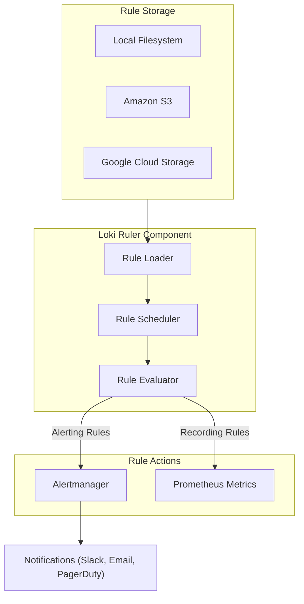

# How to Build Loki Ruler Configuration

Author: [nawazdhandala](https://github.com/nawazdhandala)

Tags: Loki, Observability, Alerting, Rules

Description: Learn how to configure the Loki Ruler component for creating alerting and recording rules to monitor your log data effectively.

---

## Introduction

Grafana Loki is a horizontally scalable, highly available log aggregation system. While Loki excels at storing and querying logs, it also includes a powerful **Ruler** component that enables you to define alerting rules and recording rules based on your log data. This guide walks you through configuring the Loki Ruler for production use.

## What is the Loki Ruler?

The Ruler is a Loki component that evaluates rules at regular intervals. It supports two types of rules:

1. **Alerting Rules** - Trigger alerts when specific conditions are met in your logs
2. **Recording Rules** - Pre-compute frequently used or computationally expensive queries and store the results as new metrics

## Rule Evaluation Flow

Here is how the Loki Ruler processes and evaluates rules:



## Basic Ruler Configuration

The Ruler is configured in the main Loki configuration file. Here is a basic configuration:

```yaml
# loki-config.yaml
# Basic Ruler configuration for Loki

ruler:
  # Directory to store temporary rule files
  storage:
    type: local
    local:
      directory: /loki/rules

  # Path prefix for the ruler API endpoints
  rule_path: /tmp/loki/rules-temp

  # Alertmanager configuration for sending alerts
  alertmanager_url: http://alertmanager:9093

  # How often to evaluate rules
  evaluation_interval: 1m

  # Enable the ruler API for managing rules
  enable_api: true

  # Enable alerting functionality
  enable_alertmanager_v2: true
```

## Configuring Rule Storage Backends

The Ruler supports multiple storage backends for your rule files. Choose based on your deployment needs.

### Local Filesystem Storage

Best for single-node deployments or testing:

```yaml
# Local filesystem storage configuration
ruler:
  storage:
    type: local
    local:
      # Directory containing rule files organized by tenant
      # Structure: /loki/rules/<tenant_id>/<rule_group>.yaml
      directory: /loki/rules
```

### Amazon S3 Storage

Recommended for distributed deployments on AWS:

```yaml
# S3 storage configuration for ruler
ruler:
  storage:
    type: s3
    s3:
      # S3 bucket name
      bucketnames: my-loki-rules-bucket

      # AWS region
      region: us-east-1

      # Access credentials (use IAM roles in production)
      access_key_id: ${AWS_ACCESS_KEY_ID}
      secret_access_key: ${AWS_SECRET_ACCESS_KEY}

      # Optional: Use path-style URLs for S3-compatible storage
      s3forcepathstyle: false

      # Optional: Custom endpoint for S3-compatible storage like MinIO
      # endpoint: http://minio:9000
```

### Google Cloud Storage

Recommended for GCP deployments:

```yaml
# GCS storage configuration for ruler
ruler:
  storage:
    type: gcs
    gcs:
      # GCS bucket name
      bucket_name: my-loki-rules-bucket

      # Path to service account JSON key file
      # Alternatively, use GOOGLE_APPLICATION_CREDENTIALS env var
      service_account: /path/to/service-account.json
```

## Writing Alerting Rules

Alerting rules use LogQL to query logs and trigger alerts when conditions are met.

### Rule File Structure

Create rule files in YAML format:

```yaml
# rules/fake/alert-rules.yaml
# Alerting rules for the 'fake' tenant

groups:
  # Group name - rules in a group are evaluated together
  - name: high-error-rate

    # Evaluation interval for this group (overrides global setting)
    interval: 1m

    rules:
      # Rule 1: Alert on high error rate
      - alert: HighErrorRate

        # LogQL query that returns a value
        # Alert fires when the result is greater than 0
        expr: |
          sum(rate({job="myapp"} |= "error" [5m])) by (instance)
          > 10

        # How long the condition must be true before firing
        for: 5m

        # Labels attached to the alert
        labels:
          severity: critical
          team: backend

        # Additional information for the alert
        annotations:
          summary: "High error rate detected on {{ $labels.instance }}"
          description: "Error rate is {{ $value }} errors per second"
          runbook_url: "https://wiki.example.com/runbooks/high-error-rate"

      # Rule 2: Alert on no logs received
      - alert: NoLogsReceived
        expr: |
          absent_over_time({job="myapp"}[15m])
        for: 15m
        labels:
          severity: warning
          team: platform
        annotations:
          summary: "No logs received from myapp"
          description: "The job myapp has not sent any logs in the last 15 minutes"
```

### Common Alerting Patterns

Here are practical alerting rule examples:

```yaml
# rules/production/application-alerts.yaml
groups:
  - name: application-health
    interval: 30s
    rules:
      # Alert on HTTP 5xx errors
      - alert: HTTP5xxErrors
        expr: |
          sum by (service) (
            rate({job="nginx"} |~ "HTTP/[0-9.]+ 5[0-9]{2}" [5m])
          ) > 5
        for: 2m
        labels:
          severity: critical
        annotations:
          summary: "High rate of HTTP 5xx errors in {{ $labels.service }}"

      # Alert on slow response times mentioned in logs
      - alert: SlowResponses
        expr: |
          sum by (endpoint) (
            rate({job="api"} |~ "response_time_ms=[0-9]{4,}" [5m])
          ) > 1
        for: 5m
        labels:
          severity: warning
        annotations:
          summary: "Slow responses detected for {{ $labels.endpoint }}"

      # Alert on out of memory errors
      - alert: OutOfMemoryErrors
        expr: |
          count_over_time({job=~".*"} |= "OutOfMemoryError" [10m]) > 0
        for: 0m
        labels:
          severity: critical
        annotations:
          summary: "OutOfMemoryError detected in application logs"

      # Alert on authentication failures
      - alert: HighAuthFailureRate
        expr: |
          sum(rate({job="auth-service"} |= "authentication failed" [5m])) > 10
        for: 5m
        labels:
          severity: warning
        annotations:
          summary: "High rate of authentication failures detected"
```

## Writing Recording Rules

Recording rules pre-compute expensive queries and store results as metrics.

```yaml
# rules/fake/recording-rules.yaml
groups:
  - name: log-metrics
    interval: 1m
    rules:
      # Record error rate as a metric
      - record: job:loki_log_errors:rate5m
        expr: |
          sum by (job) (
            rate({job=~".+"} |= "error" [5m])
          )

      # Record total log volume per service
      - record: service:loki_log_bytes:rate5m
        expr: |
          sum by (service) (
            bytes_rate({service=~".+"}[5m])
          )

      # Record count of specific log patterns
      - record: job:loki_exceptions:count1h
        expr: |
          sum by (job) (
            count_over_time({job=~".+"} |~ "Exception|Error|FATAL" [1h])
          )
```

## Alertmanager Integration

Configure how the Ruler connects to Alertmanager:

```yaml
# Complete ruler configuration with Alertmanager integration
ruler:
  storage:
    type: local
    local:
      directory: /loki/rules

  # Alertmanager endpoints (can specify multiple for HA)
  alertmanager_url: http://alertmanager-1:9093,http://alertmanager-2:9093

  # How often to refresh the list of Alertmanager instances
  alertmanager_refresh_interval: 1m

  # Enable Alertmanager API v2 (recommended)
  enable_alertmanager_v2: true

  # External URL for links in alerts
  external_url: https://loki.example.com

  # Ruler instance identification
  ring:
    kvstore:
      store: memberlist

  # Enable sharding for HA ruler deployments
  enable_sharding: true

  # Evaluation and notification settings
  evaluation_interval: 1m
  poll_interval: 1m

  # Remote write configuration for recording rules
  # Sends recorded metrics to Prometheus/Mimir
  remote_write:
    enabled: true
    client:
      url: http://prometheus:9090/api/v1/write
```

## Multi-Tenant Configuration

When running Loki in multi-tenant mode, organize rules by tenant:

```
/loki/rules/
  tenant-a/
    application-alerts.yaml
    recording-rules.yaml
  tenant-b/
    security-alerts.yaml
  tenant-c/
    infrastructure-alerts.yaml
```

Each tenant only sees and evaluates their own rules.

## Complete Production Configuration

Here is a full production-ready configuration:

```yaml
# loki-config.yaml
# Production Loki configuration with Ruler enabled

auth_enabled: true

server:
  http_listen_port: 3100
  grpc_listen_port: 9096

common:
  path_prefix: /loki
  storage:
    filesystem:
      chunks_directory: /loki/chunks
      rules_directory: /loki/rules
  replication_factor: 1
  ring:
    instance_addr: 127.0.0.1
    kvstore:
      store: inmemory

ruler:
  # Storage backend for rules
  storage:
    type: s3
    s3:
      bucketnames: loki-rules
      region: us-east-1
      access_key_id: ${AWS_ACCESS_KEY_ID}
      secret_access_key: ${AWS_SECRET_ACCESS_KEY}

  # Alertmanager configuration
  alertmanager_url: http://alertmanager:9093
  enable_alertmanager_v2: true
  alertmanager_refresh_interval: 1m

  # Ruler API
  enable_api: true

  # Ring configuration for HA
  ring:
    kvstore:
      store: consul
      consul:
        host: consul:8500
    heartbeat_period: 5s
    heartbeat_timeout: 15s

  # Sharding for distributed rule evaluation
  enable_sharding: true
  sharding_strategy: default

  # Evaluation settings
  evaluation_interval: 1m
  poll_interval: 1m

  # Remote write for recording rules
  remote_write:
    enabled: true
    client:
      url: http://mimir:9009/api/v1/push
      headers:
        X-Scope-OrgID: ruler

  # Notification settings
  notification_queue_capacity: 10000
  notification_timeout: 10s

  # External labels added to all alerts
  external_labels:
    cluster: production
    environment: prod

schema_config:
  configs:
    - from: 2024-01-01
      store: tsdb
      object_store: filesystem
      schema: v13
      index:
        prefix: index_
        period: 24h

query_range:
  results_cache:
    cache:
      embedded_cache:
        enabled: true
        max_size_mb: 100
```

## Managing Rules via API

The Ruler API allows dynamic rule management:

```bash
# List all rules for a tenant
curl -H "X-Scope-OrgID: tenant-a" \
  http://localhost:3100/loki/api/v1/rules

# Get rules for a specific namespace
curl -H "X-Scope-OrgID: tenant-a" \
  http://localhost:3100/loki/api/v1/rules/namespace-name

# Create or update rules
curl -X POST -H "X-Scope-OrgID: tenant-a" \
  -H "Content-Type: application/yaml" \
  --data-binary @rules.yaml \
  http://localhost:3100/loki/api/v1/rules/namespace-name

# Delete rules for a namespace
curl -X DELETE -H "X-Scope-OrgID: tenant-a" \
  http://localhost:3100/loki/api/v1/rules/namespace-name

# Delete a specific rule group
curl -X DELETE -H "X-Scope-OrgID: tenant-a" \
  http://localhost:3100/loki/api/v1/rules/namespace-name/group-name
```

## Troubleshooting

### Common Issues and Solutions

1. **Rules not being evaluated**
   - Check that `enable_api: true` is set
   - Verify rule files are in the correct directory structure
   - Check Loki logs for rule loading errors

2. **Alerts not firing**
   - Verify Alertmanager URL is correct and reachable
   - Check that `enable_alertmanager_v2: true` is set
   - Test your LogQL query manually in Grafana

3. **Recording rules not producing metrics**
   - Ensure `remote_write` is configured correctly
   - Verify the remote write endpoint is accessible
   - Check for authentication issues with the metrics backend

### Useful Metrics

Monitor your Ruler with these Prometheus metrics:

```promql
# Rule evaluation duration
histogram_quantile(0.99, sum(rate(loki_ruler_rule_evaluation_duration_seconds_bucket[5m])) by (le))

# Failed rule evaluations
sum(rate(loki_ruler_rule_evaluation_failures_total[5m])) by (rule_group)

# Alerts sent to Alertmanager
sum(rate(loki_ruler_notifications_sent_total[5m])) by (status)
```

## Conclusion

The Loki Ruler is a powerful component that transforms Loki from a log storage system into a complete observability solution. By combining log aggregation with alerting and recording rules, you can build comprehensive monitoring pipelines that catch issues before they impact users.

Key takeaways:
- Use alerting rules to monitor for error patterns in your logs
- Use recording rules to pre-compute expensive queries
- Choose the appropriate storage backend based on your deployment model
- Configure Alertmanager integration for notification routing
- Use the Ruler API for dynamic rule management in automated pipelines

Start with simple alerting rules and gradually build up your rule library as you identify patterns worth monitoring in your application logs.
