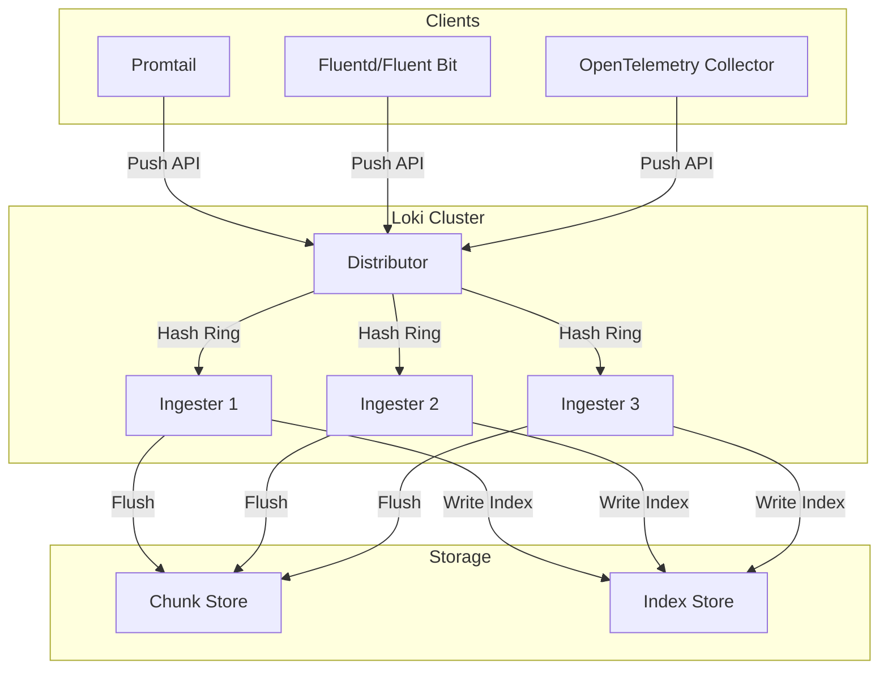
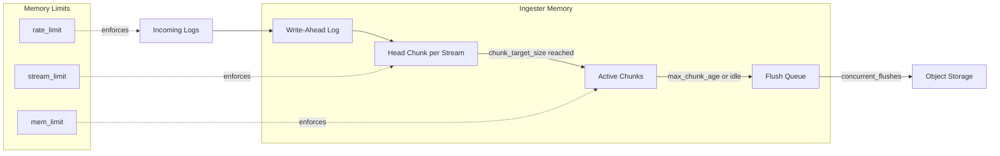
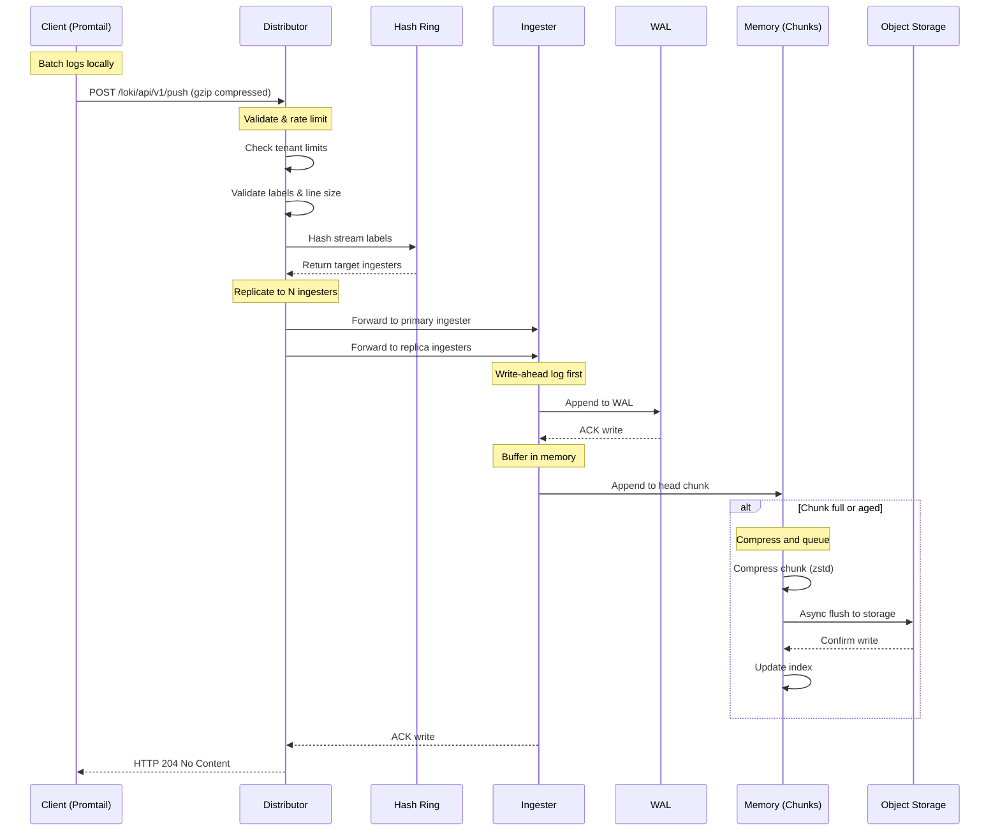

# How to Build Loki Write Path Optimization

Author: [nawazdhandala](https://github.com/nawazdhandala)

Tags: Loki, Observability, Performance, Optimization

Description: A comprehensive guide to optimizing Grafana Loki's write path for high-throughput log ingestion and reduced resource consumption.

---

Grafana Loki has become the go-to log aggregation system for teams running Kubernetes workloads. Its label-based indexing approach keeps storage costs low, but high-throughput environments often hit ingestion bottlenecks before they max out storage. The write path is where most performance issues surface.

This post walks through the architecture of Loki's write path and provides practical optimizations to squeeze maximum throughput from your ingesters while keeping memory usage predictable.

## Write Path Architecture Overview

Before optimizing, you need to understand how logs flow from your application to Loki's storage backend.



The write path consists of these key components:

1. **Clients** send logs to Loki via the Push API (typically `/loki/api/v1/push`)
2. **Distributor** validates incoming data, enforces rate limits, and forwards to ingesters
3. **Ingesters** buffer logs in memory, compress them into chunks, and periodically flush to storage
4. **Chunk Store** holds the compressed log data (typically S3, GCS, or filesystem)
5. **Index Store** maps label combinations to chunk locations (BoltDB, Cassandra, or cloud storage)

The ingester is where most write path optimization happens. It handles compression, chunking, and memory management.

## Batching and Compression Strategies

Efficient batching is the single biggest lever for write path performance. Loki achieves high compression ratios by grouping logs from the same stream before compressing.

### Client-Side Batching

Configure your log shipper to batch aggressively before sending to Loki:

```yaml
# Promtail configuration with optimized batching
clients:
  - url: http://loki:3100/loki/api/v1/push
    # Wait up to 5 seconds to fill a batch
    batchwait: 5s
    # Send when batch reaches 1MB
    batchsize: 1048576
    # Enable HTTP compression on the wire
    external_labels:
      cluster: production
      env: prod
```

```yaml
# Fluent Bit configuration for Loki output
[OUTPUT]
    Name        loki
    Match       *
    Host        loki.monitoring.svc.cluster.local
    Port        3100
    Labels      job=fluentbit, env=production
    # Batch logs before sending
    BatchWait   5
    BatchSize   1048576
    # Use gzip compression
    Compress    gzip
```

### Ingester Chunk Configuration

The ingester's chunk settings determine how logs are grouped and compressed:

```yaml
# Loki configuration - ingester chunk settings
ingester:
  # Target uncompressed chunk size (aim for 1.5MB before compression)
  chunk_target_size: 1572864

  # Maximum time a chunk can stay open
  # Longer = better compression, but higher memory usage
  max_chunk_age: 2h

  # Flush chunks when idle for this duration
  chunk_idle_period: 30m

  # How often to check for chunks to flush
  flush_check_period: 5m

  # Compression algorithm: gzip, lz4, snappy, or zstd
  # zstd offers best compression ratio with good speed
  chunk_encoding: zstd

  # Number of concurrent flushes to storage
  concurrent_flushes: 32

  # Queue size for chunks waiting to be flushed
  flush_op_timeout: 10m
```

### Compression Algorithm Comparison

Choose your compression algorithm based on your priorities:

| Algorithm | Compression Ratio | CPU Cost | Memory | Best For |
|-----------|------------------|----------|--------|----------|
| snappy | Low (2-3x) | Very Low | Low | High throughput, CPU constrained |
| lz4 | Medium (3-4x) | Low | Low | Balanced workloads |
| gzip | High (5-8x) | Medium | Medium | Storage cost sensitive |
| zstd | Very High (6-10x) | Medium | Medium | Best overall for most workloads |

For most production deployments, `zstd` provides the best balance of compression ratio and CPU usage.

## Ingester Memory Management

Ingesters hold chunks in memory until they flush to storage. Poor memory management leads to OOM kills and data loss.



### Memory Limits Configuration

```yaml
# Loki limits configuration for memory management
limits_config:
  # Maximum number of active streams per user
  # Each stream consumes memory for its head chunk
  max_streams_per_user: 10000

  # Maximum line size (reject lines larger than this)
  max_line_size: 256kb

  # Ingestion rate limit (bytes per second per tenant)
  ingestion_rate_mb: 50

  # Burst size for rate limiting
  ingestion_burst_size_mb: 100

  # Maximum label names per series
  max_label_names_per_series: 30

  # Maximum length of a label name
  max_label_name_length: 1024

  # Maximum length of a label value
  max_label_value_length: 2048

  # Per-stream rate limit (bytes/second)
  per_stream_rate_limit: 5MB
  per_stream_rate_limit_burst: 15MB

ingester:
  # Write-ahead log configuration for durability
  wal:
    enabled: true
    dir: /loki/wal
    # Checkpoint interval - balance between recovery time and disk I/O
    checkpoint_duration: 5m
    # Flush WAL before acknowledging writes (set false for higher throughput)
    flush_on_shutdown: true
    # Replay concurrency on startup
    replay_memory_ceiling: 4GB
```

### Calculating Memory Requirements

Use this formula to estimate ingester memory needs:

```
Memory = (active_streams * avg_chunk_size) + (flush_queue_size * avg_chunk_size) + WAL_buffer

Where:
- active_streams = number of unique label combinations
- avg_chunk_size = ~1-2MB uncompressed per chunk
- flush_queue_size = concurrent_flushes * 2
- WAL_buffer = ~20% overhead for write-ahead log
```

For a cluster with 50,000 active streams:

```
Memory = (50000 * 1.5MB) + (64 * 1.5MB) + 20% overhead
       = 75GB + 96MB + 15GB
       = ~90GB across all ingesters
```

## Stream Cardinality Optimization

High cardinality is the silent killer of Loki performance. Every unique label combination creates a new stream, consuming memory and increasing index size.

### Identifying Cardinality Problems

```bash
# Query to find high cardinality labels
# Run this in Grafana against your Loki datasource
sum by (label_name) (count_over_time({job=~".+"}[24h]))
```

```python
#!/usr/bin/env python3
"""
Script to analyze Loki stream cardinality.
Identifies labels contributing most to cardinality explosion.
"""

import requests
import json
from collections import defaultdict

LOKI_URL = "http://loki:3100"

def get_label_values(label_name):
    """Fetch all values for a specific label."""
    response = requests.get(
        f"{LOKI_URL}/loki/api/v1/label/{label_name}/values"
    )
    return response.json().get("data", [])

def get_all_labels():
    """Fetch all label names from Loki."""
    response = requests.get(f"{LOKI_URL}/loki/api/v1/labels")
    return response.json().get("data", [])

def analyze_cardinality():
    """
    Analyze cardinality across all labels.
    Returns sorted list of labels by cardinality.
    """
    labels = get_all_labels()
    cardinality = {}

    for label in labels:
        values = get_label_values(label)
        cardinality[label] = len(values)
        print(f"Label '{label}': {len(values)} unique values")

    # Sort by cardinality descending
    sorted_labels = sorted(
        cardinality.items(),
        key=lambda x: x[1],
        reverse=True
    )

    print("\n--- High Cardinality Labels (potential problems) ---")
    for label, count in sorted_labels[:10]:
        if count > 100:
            print(f"  WARNING: {label} = {count} values")
        else:
            print(f"  OK: {label} = {count} values")

    return sorted_labels

if __name__ == "__main__":
    analyze_cardinality()
```

### Label Best Practices

Good labels (low cardinality):

```yaml
# These labels have bounded, predictable values
labels:
  env: production          # ~3-5 values
  cluster: us-east-1       # ~10-20 values
  namespace: payments      # ~50-100 values
  app: checkout-service    # ~100-500 values
  level: error             # ~5 values (debug, info, warn, error, fatal)
```

Bad labels (high cardinality):

```yaml
# NEVER use these as labels - they explode cardinality
labels:
  request_id: abc-123-def  # Millions of unique values
  user_id: 12345           # Could be millions
  trace_id: xyz-789        # Unique per request
  timestamp: 1706000000    # Infinite values
  ip_address: 10.0.0.1     # Thousands to millions
```

Instead, put high-cardinality data in the log line itself and use structured logging:

```json
{
  "level": "info",
  "message": "Request completed",
  "request_id": "abc-123-def",
  "user_id": "12345",
  "trace_id": "xyz-789",
  "duration_ms": 45
}
```

### Promtail Pipeline for Cardinality Control

```yaml
# Promtail pipeline to extract useful labels while avoiding cardinality explosion
scrape_configs:
  - job_name: kubernetes-pods
    kubernetes_sd_configs:
      - role: pod

    pipeline_stages:
      # Parse JSON logs
      - json:
          expressions:
            level: level
            message: message
            # Extract but do not label these high-cardinality fields
            request_id: request_id
            user_id: user_id

      # Only promote low-cardinality fields to labels
      - labels:
          level:

      # Drop debug logs in production to reduce volume
      - match:
          selector: '{level="debug"}'
          action: drop
          drop_counter_reason: debug_logs

      # Pack high-cardinality fields back into structured log line
      - pack:
          labels:
            - request_id
            - user_id
          ingest_timestamp: false

      # Rate limit per stream to prevent runaway logs
      - limit:
          rate: 100
          burst: 200
          drop: true
```

## Write Path Flow in Detail

Here is the complete write path with all optimization points highlighted:



## Production Configuration Example

Here is a complete Loki configuration optimized for high-throughput ingestion:

```yaml
# loki-config.yaml - Production optimized configuration
auth_enabled: true

server:
  http_listen_port: 3100
  grpc_listen_port: 9096
  # Increase for high throughput
  grpc_server_max_recv_msg_size: 104857600  # 100MB
  grpc_server_max_send_msg_size: 104857600

distributor:
  ring:
    kvstore:
      store: memberlist
  # Accept out-of-order writes within this window
  # Helps with network jitter and client batching
  otlp_config:
    default_resource_attributes_as_index_labels:
      - service.name
      - service.namespace

ingester:
  lifecycler:
    ring:
      kvstore:
        store: memberlist
      replication_factor: 3
    # Time to wait before joining the ring
    join_after: 10s
    # Time to wait before marking as ready
    min_ready_duration: 15s
    final_sleep: 0s

  # Chunk configuration for optimal compression
  chunk_target_size: 1572864      # 1.5MB target
  chunk_encoding: zstd            # Best compression
  max_chunk_age: 2h               # Max time chunk stays open
  chunk_idle_period: 30m          # Flush idle chunks
  chunk_retain_period: 1m         # Keep after flush for queries

  # Flush configuration
  concurrent_flushes: 32          # Parallel storage writes
  flush_check_period: 5m
  flush_op_timeout: 10m

  # WAL for durability
  wal:
    enabled: true
    dir: /loki/wal
    checkpoint_duration: 5m
    flush_on_shutdown: true
    replay_memory_ceiling: 4GB

schema_config:
  configs:
    - from: 2024-01-01
      store: tsdb
      object_store: s3
      schema: v13
      index:
        prefix: loki_index_
        period: 24h

storage_config:
  tsdb_shipper:
    active_index_directory: /loki/index
    cache_location: /loki/cache
    cache_ttl: 24h

  aws:
    s3: s3://region/bucket-name
    s3forcepathstyle: false

limits_config:
  # Ingestion limits
  ingestion_rate_mb: 100
  ingestion_burst_size_mb: 200
  per_stream_rate_limit: 10MB
  per_stream_rate_limit_burst: 30MB

  # Cardinality limits
  max_streams_per_user: 50000
  max_line_size: 256kb
  max_label_names_per_series: 30
  max_label_name_length: 1024
  max_label_value_length: 2048

  # Accept out-of-order writes (within 1 hour)
  unordered_writes: true

  # Query limits (less relevant for write path)
  max_query_parallelism: 32
  max_query_series: 500

# Memberlist for distributed coordination
memberlist:
  join_members:
    - loki-memberlist:7946
  dead_node_reclaim_time: 30s
  gossip_to_dead_nodes_time: 15s
  left_ingesters_timeout: 30s
  bind_addr: ['0.0.0.0']
  bind_port: 7946
```

## Monitoring Write Path Health

Add these Prometheus recording rules to track write path performance:

```yaml
# prometheus-rules.yaml
groups:
  - name: loki-write-path
    interval: 30s
    rules:
      # Ingestion rate per tenant
      - record: loki:ingester:ingestion_rate_bytes
        expr: sum(rate(loki_ingester_bytes_received_total[5m])) by (tenant)

      # Chunk flush latency
      - record: loki:ingester:chunk_flush_duration_p99
        expr: histogram_quantile(0.99, sum(rate(loki_ingester_chunk_age_seconds_bucket[5m])) by (le))

      # Active streams count
      - record: loki:ingester:active_streams
        expr: sum(loki_ingester_memory_streams) by (instance)

      # Memory usage per ingester
      - record: loki:ingester:memory_chunks_bytes
        expr: sum(loki_ingester_memory_chunks_bytes) by (instance)

      # Distributor push latency
      - record: loki:distributor:push_latency_p99
        expr: histogram_quantile(0.99, sum(rate(loki_distributor_push_duration_seconds_bucket[5m])) by (le))

      # Rate limit hits
      - record: loki:distributor:rate_limited_total
        expr: sum(rate(loki_discarded_samples_total{reason="rate_limited"}[5m])) by (tenant)

  - name: loki-write-path-alerts
    rules:
      - alert: LokiIngesterHighMemory
        expr: loki:ingester:memory_chunks_bytes > 10e9
        for: 5m
        labels:
          severity: warning
        annotations:
          summary: "Ingester {{ $labels.instance }} memory usage high"
          description: "Ingester memory usage is {{ $value | humanize1024 }}. Consider scaling or reducing cardinality."

      - alert: LokiHighStreamCardinality
        expr: loki:ingester:active_streams > 100000
        for: 10m
        labels:
          severity: warning
        annotations:
          summary: "High stream cardinality detected"
          description: "Active streams count is {{ $value }}. Review label usage to reduce cardinality."

      - alert: LokiIngestionRateLimited
        expr: loki:distributor:rate_limited_total > 0
        for: 5m
        labels:
          severity: warning
        annotations:
          summary: "Loki is rate limiting ingestion for tenant {{ $labels.tenant }}"
          description: "Ingestion is being rate limited. Increase limits or reduce log volume."
```

## Key Takeaways

1. **Batch aggressively on the client side** - 5 second batchwait and 1MB batch size is a good starting point

2. **Use zstd compression** - Best compression ratio with acceptable CPU cost

3. **Control cardinality ruthlessly** - Every unique label combination creates a stream that consumes memory

4. **Size your ingesters for memory** - Calculate based on expected active streams times chunk size

5. **Enable WAL** - Protects against data loss during ingester restarts

6. **Monitor the write path** - Track ingestion rate, flush latency, and memory usage

7. **Accept out-of-order writes** - Reduces client complexity and handles network jitter

The write path is where Loki either shines or struggles. Get these configurations right, and you can ingest terabytes per day on modest hardware. Get them wrong, and you will spend your time fighting OOMs and dropped logs.

---

**Related Reading:**

- [Three Pillars of Observability: Logs, Metrics, Traces](https://oneuptime.com/blog/post/2025-08-20-three-pillars-of-observability-logs-metrics-traces/view)
- [How to Structure Logs Properly in OpenTelemetry](https://oneuptime.com/blog/post/2025-08-28-how-to-structure-logs-properly-in-opentelemetry/view)
- [What is OpenTelemetry Collector and Why Use One](https://oneuptime.com/blog/post/2025-09-18-what-is-opentelemetry-collector-and-why-use-one/view)
