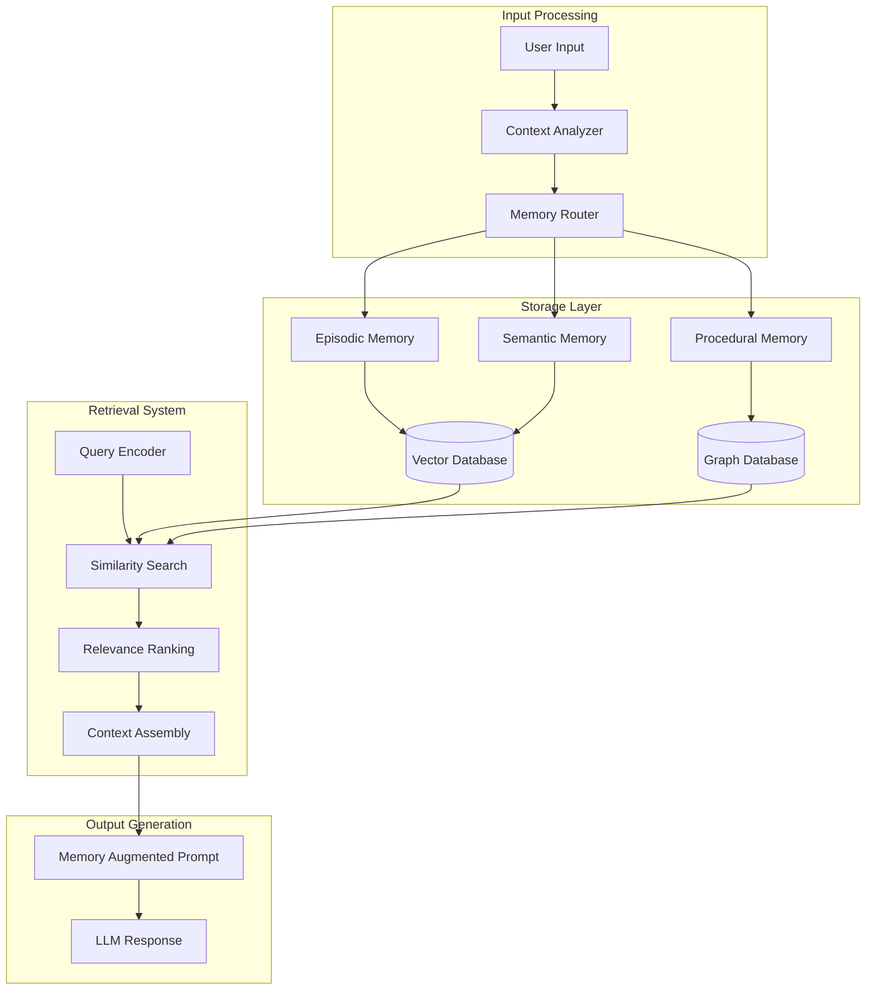
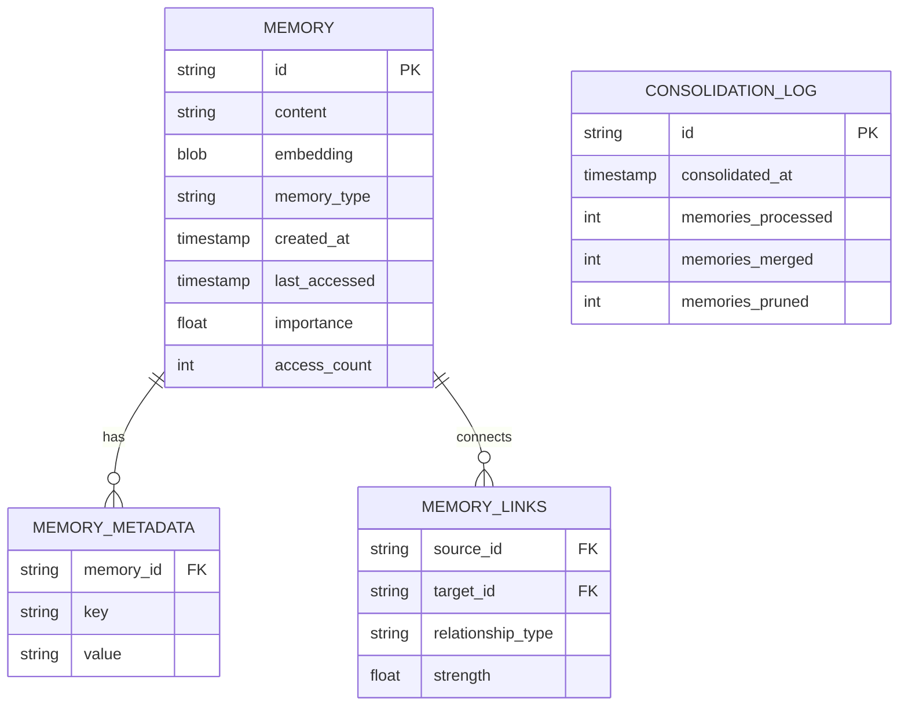
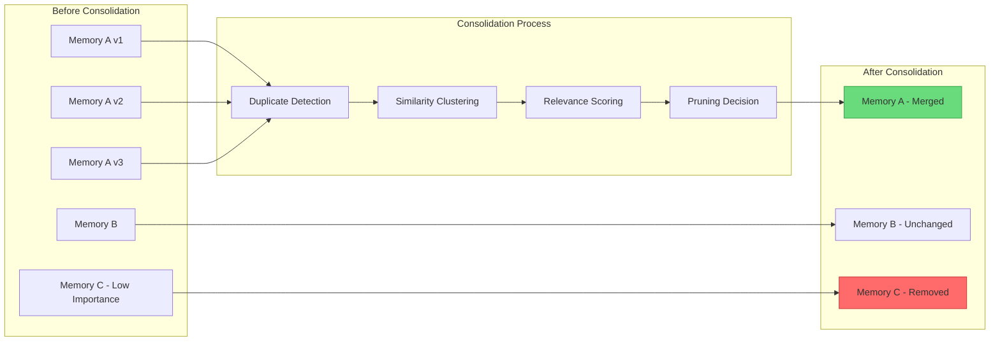
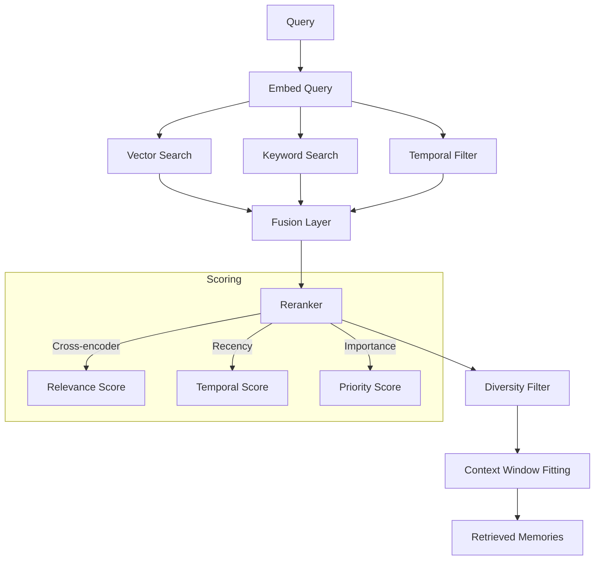
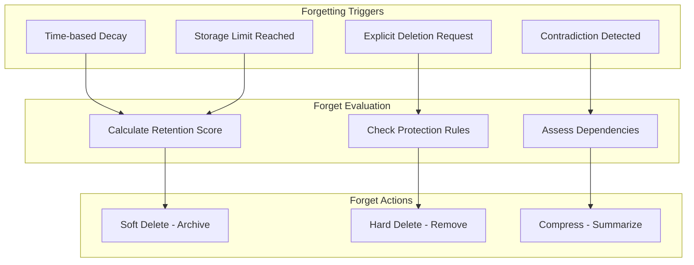

# How to Implement Long-Term Memory

Author: [nawazdhandala](https://github.com/nawazdhandala)

Tags: AI Agents, Memory Systems, Vector Database, Knowledge Management

Description: Learn to implement long-term memory for AI agents with vector storage, knowledge consolidation, and retrieval-augmented recall for persistent knowledge.

---

AI agents are becoming increasingly capable, but without long-term memory, they start every conversation from scratch. Implementing persistent memory allows agents to learn from past interactions, maintain context across sessions, and build knowledge over time. In this post, we will explore how to build a robust long-term memory system for AI agents.

## Why Long-Term Memory Matters

Traditional AI agents operate within a single context window. Once that window is exhausted or the session ends, all learned information is lost. Long-term memory solves this by:

- **Persisting knowledge** across sessions and restarts
- **Scaling beyond context limits** by storing unlimited information externally
- **Enabling personalization** through accumulated user preferences and history
- **Supporting complex reasoning** with access to historical data and decisions

## Memory System Architecture

A well-designed long-term memory system consists of several interconnected components that work together to store, organize, and retrieve information efficiently.



### Memory Types Explained

1. **Episodic Memory**: Stores specific events and interactions with timestamps
2. **Semantic Memory**: Contains facts, concepts, and general knowledge
3. **Procedural Memory**: Holds learned procedures, workflows, and action patterns

## Storage Architecture

The foundation of long-term memory is a robust storage system. Vector databases are ideal because they enable semantic similarity search rather than exact matching.

### Setting Up the Vector Store

```python
from dataclasses import dataclass, field
from datetime import datetime
from typing import Optional
import numpy as np
import hashlib


@dataclass
class MemoryEntry:
    """Represents a single memory unit in the long-term storage."""

    content: str
    embedding: np.ndarray
    memory_type: str  # episodic, semantic, procedural
    timestamp: datetime = field(default_factory=datetime.now)
    importance: float = 0.5
    access_count: int = 0
    last_accessed: Optional[datetime] = None
    metadata: dict = field(default_factory=dict)

    @property
    def memory_id(self) -> str:
        """Generate unique ID based on content hash."""
        return hashlib.sha256(self.content.encode()).hexdigest()[:16]

    def decay_importance(self, decay_rate: float = 0.01) -> None:
        """Apply time-based decay to memory importance."""
        days_since_access = (datetime.now() - (self.last_accessed or self.timestamp)).days
        self.importance *= np.exp(-decay_rate * days_since_access)


class VectorMemoryStore:
    """Vector-based long-term memory storage system."""

    def __init__(self, dimension: int = 1536):
        self.dimension = dimension
        self.memories: dict[str, MemoryEntry] = {}
        self.index = None  # Would be FAISS, Pinecone, or similar

    def add_memory(self, entry: MemoryEntry) -> str:
        """Store a new memory entry."""
        if entry.embedding.shape[0] != self.dimension:
            raise ValueError(f"Embedding dimension mismatch: expected {self.dimension}")

        self.memories[entry.memory_id] = entry
        self._update_index(entry)
        return entry.memory_id

    def _update_index(self, entry: MemoryEntry) -> None:
        """Update the vector index with new entry."""
        # Implementation depends on chosen vector database
        pass

    def search(
        self,
        query_embedding: np.ndarray,
        top_k: int = 10,
        memory_type: Optional[str] = None
    ) -> list[tuple[MemoryEntry, float]]:
        """Find similar memories using vector similarity."""
        results = []

        for memory in self.memories.values():
            if memory_type and memory.memory_type != memory_type:
                continue

            similarity = self._cosine_similarity(query_embedding, memory.embedding)
            results.append((memory, similarity))

        results.sort(key=lambda x: x[1], reverse=True)
        return results[:top_k]

    @staticmethod
    def _cosine_similarity(a: np.ndarray, b: np.ndarray) -> float:
        """Calculate cosine similarity between two vectors."""
        return float(np.dot(a, b) / (np.linalg.norm(a) * np.linalg.norm(b)))
```

### Database Schema Design

For production systems, you will want a proper database schema that supports efficient querying and maintenance.



## Embedding Generation

Embeddings transform text into dense vectors that capture semantic meaning. The quality of your embeddings directly impacts retrieval accuracy.

### Embedding Pipeline

```python
from abc import ABC, abstractmethod
import tiktoken


class EmbeddingProvider(ABC):
    """Abstract base class for embedding providers."""

    @abstractmethod
    def embed(self, text: str) -> np.ndarray:
        """Generate embedding for text."""
        pass

    @abstractmethod
    def embed_batch(self, texts: list[str]) -> list[np.ndarray]:
        """Generate embeddings for multiple texts."""
        pass


class OpenAIEmbeddings(EmbeddingProvider):
    """OpenAI-based embedding generation."""

    def __init__(self, model: str = "text-embedding-3-small"):
        self.model = model
        self.tokenizer = tiktoken.get_encoding("cl100k_base")
        self.max_tokens = 8191

    def embed(self, text: str) -> np.ndarray:
        """Generate embedding using OpenAI API."""
        text = self._truncate_text(text)
        # API call would go here
        # response = openai.embeddings.create(input=text, model=self.model)
        # return np.array(response.data[0].embedding)
        return np.random.randn(1536)  # Placeholder

    def embed_batch(self, texts: list[str]) -> list[np.ndarray]:
        """Batch embedding generation for efficiency."""
        truncated = [self._truncate_text(t) for t in texts]
        # Batch API call
        return [self.embed(t) for t in truncated]

    def _truncate_text(self, text: str) -> str:
        """Truncate text to fit within token limit."""
        tokens = self.tokenizer.encode(text)
        if len(tokens) > self.max_tokens:
            tokens = tokens[:self.max_tokens]
            return self.tokenizer.decode(tokens)
        return text


class ChunkedEmbedder:
    """Handles embedding of long documents through chunking."""

    def __init__(
        self,
        provider: EmbeddingProvider,
        chunk_size: int = 512,
        chunk_overlap: int = 50
    ):
        self.provider = provider
        self.chunk_size = chunk_size
        self.chunk_overlap = chunk_overlap

    def embed_document(self, document: str) -> list[dict]:
        """Split document into chunks and embed each."""
        chunks = self._create_chunks(document)
        embeddings = self.provider.embed_batch(chunks)

        return [
            {
                "chunk_index": i,
                "content": chunk,
                "embedding": emb,
                "start_char": i * (self.chunk_size - self.chunk_overlap)
            }
            for i, (chunk, emb) in enumerate(zip(chunks, embeddings))
        ]

    def _create_chunks(self, text: str) -> list[str]:
        """Split text into overlapping chunks."""
        chunks = []
        start = 0

        while start < len(text):
            end = start + self.chunk_size
            chunk = text[start:end]

            # Try to break at sentence boundary
            if end < len(text):
                last_period = chunk.rfind('. ')
                if last_period > self.chunk_size // 2:
                    chunk = chunk[:last_period + 1]
                    end = start + last_period + 1

            chunks.append(chunk.strip())
            start = end - self.chunk_overlap

        return chunks
```

## Memory Consolidation

Raw memories accumulate rapidly and need periodic consolidation to remain useful. This process mirrors how human memory works during sleep - similar memories are merged, important ones are strengthened, and redundant information is pruned.



### Consolidation Implementation

```python
from collections import defaultdict
from sklearn.cluster import DBSCAN


class MemoryConsolidator:
    """Handles periodic memory consolidation and optimization."""

    def __init__(
        self,
        store: VectorMemoryStore,
        similarity_threshold: float = 0.85,
        importance_threshold: float = 0.1,
        min_cluster_size: int = 2
    ):
        self.store = store
        self.similarity_threshold = similarity_threshold
        self.importance_threshold = importance_threshold
        self.min_cluster_size = min_cluster_size

    def consolidate(self) -> dict:
        """Run full consolidation process."""
        stats = {
            "memories_before": len(self.store.memories),
            "merged": 0,
            "pruned": 0,
            "strengthened": 0
        }

        # Step 1: Apply decay to all memories
        self._apply_decay()

        # Step 2: Cluster similar memories
        clusters = self._find_clusters()

        # Step 3: Merge similar memories within clusters
        for cluster in clusters:
            if len(cluster) >= self.min_cluster_size:
                merged = self._merge_memories(cluster)
                stats["merged"] += len(cluster) - 1

        # Step 4: Prune low-importance memories
        pruned = self._prune_memories()
        stats["pruned"] = pruned

        # Step 5: Strengthen frequently accessed memories
        strengthened = self._strengthen_important()
        stats["strengthened"] = strengthened

        stats["memories_after"] = len(self.store.memories)
        return stats

    def _apply_decay(self) -> None:
        """Apply time-based decay to all memories."""
        for memory in self.store.memories.values():
            memory.decay_importance()

    def _find_clusters(self) -> list[list[MemoryEntry]]:
        """Find clusters of similar memories using DBSCAN."""
        memories = list(self.store.memories.values())
        if len(memories) < 2:
            return []

        embeddings = np.array([m.embedding for m in memories])

        # Use DBSCAN for density-based clustering
        clustering = DBSCAN(
            eps=1 - self.similarity_threshold,
            min_samples=self.min_cluster_size,
            metric="cosine"
        ).fit(embeddings)

        clusters = defaultdict(list)
        for idx, label in enumerate(clustering.labels_):
            if label != -1:  # -1 indicates noise
                clusters[label].append(memories[idx])

        return list(clusters.values())

    def _merge_memories(self, memories: list[MemoryEntry]) -> MemoryEntry:
        """Merge a cluster of similar memories into one."""
        # Sort by importance and recency
        memories.sort(key=lambda m: (m.importance, m.timestamp), reverse=True)

        # Keep the most important memory as base
        primary = memories[0]

        # Aggregate metadata and strengthen importance
        combined_access_count = sum(m.access_count for m in memories)
        max_importance = max(m.importance for m in memories)

        # Create merged content summary
        unique_contents = list(set(m.content for m in memories))
        if len(unique_contents) > 1:
            merged_content = self._summarize_contents(unique_contents)
        else:
            merged_content = primary.content

        # Update primary memory
        primary.content = merged_content
        primary.access_count = combined_access_count
        primary.importance = min(1.0, max_importance * 1.1)  # Boost importance

        # Remove redundant memories
        for memory in memories[1:]:
            del self.store.memories[memory.memory_id]

        return primary

    def _summarize_contents(self, contents: list[str]) -> str:
        """Combine multiple memory contents into summary."""
        # In production, use LLM to create intelligent summary
        return " | ".join(contents[:3])  # Simplified

    def _prune_memories(self) -> int:
        """Remove memories below importance threshold."""
        to_remove = [
            mid for mid, memory in self.store.memories.items()
            if memory.importance < self.importance_threshold
        ]

        for mid in to_remove:
            del self.store.memories[mid]

        return len(to_remove)

    def _strengthen_important(self) -> int:
        """Boost importance of frequently accessed memories."""
        strengthened = 0

        for memory in self.store.memories.values():
            if memory.access_count > 10:
                boost = min(0.1, memory.access_count * 0.005)
                memory.importance = min(1.0, memory.importance + boost)
                strengthened += 1

        return strengthened
```

## Retrieval Strategies

Effective retrieval is crucial for making stored memories useful. A multi-stage retrieval pipeline ensures both relevance and diversity in returned results.



### Hybrid Retrieval Implementation

```python
from enum import Enum
from typing import Callable


class RetrievalStrategy(Enum):
    VECTOR_ONLY = "vector"
    HYBRID = "hybrid"
    TEMPORAL = "temporal"
    IMPORTANCE_WEIGHTED = "importance"


class MemoryRetriever:
    """Multi-strategy memory retrieval system."""

    def __init__(
        self,
        store: VectorMemoryStore,
        embedder: EmbeddingProvider,
        reranker: Optional[Callable] = None
    ):
        self.store = store
        self.embedder = embedder
        self.reranker = reranker

    def retrieve(
        self,
        query: str,
        top_k: int = 10,
        strategy: RetrievalStrategy = RetrievalStrategy.HYBRID,
        memory_types: Optional[list[str]] = None,
        time_window_days: Optional[int] = None
    ) -> list[MemoryEntry]:
        """Retrieve relevant memories using specified strategy."""

        query_embedding = self.embedder.embed(query)

        # Stage 1: Initial retrieval
        if strategy == RetrievalStrategy.VECTOR_ONLY:
            candidates = self._vector_search(query_embedding, top_k * 3)
        elif strategy == RetrievalStrategy.HYBRID:
            candidates = self._hybrid_search(query, query_embedding, top_k * 3)
        elif strategy == RetrievalStrategy.TEMPORAL:
            candidates = self._temporal_search(query_embedding, time_window_days, top_k * 3)
        else:
            candidates = self._importance_weighted_search(query_embedding, top_k * 3)

        # Stage 2: Filter by memory type
        if memory_types:
            candidates = [c for c in candidates if c.memory_type in memory_types]

        # Stage 3: Rerank for relevance
        if self.reranker:
            candidates = self._rerank(query, candidates)

        # Stage 4: Apply diversity filter
        diverse_results = self._diversify(candidates, top_k)

        # Stage 5: Update access metadata
        for memory in diverse_results:
            memory.access_count += 1
            memory.last_accessed = datetime.now()

        return diverse_results

    def _vector_search(
        self,
        query_embedding: np.ndarray,
        limit: int
    ) -> list[MemoryEntry]:
        """Pure vector similarity search."""
        results = self.store.search(query_embedding, top_k=limit)
        return [memory for memory, score in results]

    def _hybrid_search(
        self,
        query: str,
        query_embedding: np.ndarray,
        limit: int
    ) -> list[MemoryEntry]:
        """Combine vector and keyword search."""
        # Vector search results
        vector_results = self.store.search(query_embedding, top_k=limit)

        # Keyword search results
        keywords = self._extract_keywords(query)
        keyword_matches = self._keyword_search(keywords, limit)

        # Reciprocal Rank Fusion
        fused = self._rrf_fusion(
            [r[0] for r in vector_results],
            keyword_matches,
            k=60
        )

        return fused[:limit]

    def _temporal_search(
        self,
        query_embedding: np.ndarray,
        days: Optional[int],
        limit: int
    ) -> list[MemoryEntry]:
        """Search with temporal constraints."""
        results = self.store.search(query_embedding, top_k=limit * 2)

        if days:
            cutoff = datetime.now() - timedelta(days=days)
            results = [
                (m, s) for m, s in results
                if m.timestamp >= cutoff
            ]

        return [m for m, s in results[:limit]]

    def _importance_weighted_search(
        self,
        query_embedding: np.ndarray,
        limit: int
    ) -> list[MemoryEntry]:
        """Weight results by importance score."""
        results = self.store.search(query_embedding, top_k=limit * 2)

        # Combine similarity and importance
        weighted = [
            (memory, score * 0.7 + memory.importance * 0.3)
            for memory, score in results
        ]
        weighted.sort(key=lambda x: x[1], reverse=True)

        return [m for m, s in weighted[:limit]]

    def _extract_keywords(self, query: str) -> list[str]:
        """Extract important keywords from query."""
        # Simple implementation - use NLP library in production
        stopwords = {"the", "a", "an", "is", "are", "was", "were", "how", "what"}
        words = query.lower().split()
        return [w for w in words if w not in stopwords and len(w) > 2]

    def _keyword_search(self, keywords: list[str], limit: int) -> list[MemoryEntry]:
        """Search memories by keyword matching."""
        results = []
        for memory in self.store.memories.values():
            content_lower = memory.content.lower()
            matches = sum(1 for kw in keywords if kw in content_lower)
            if matches > 0:
                results.append((memory, matches))

        results.sort(key=lambda x: x[1], reverse=True)
        return [m for m, s in results[:limit]]

    def _rrf_fusion(
        self,
        list1: list[MemoryEntry],
        list2: list[MemoryEntry],
        k: int = 60
    ) -> list[MemoryEntry]:
        """Reciprocal Rank Fusion of two result lists."""
        scores = defaultdict(float)

        for rank, memory in enumerate(list1):
            scores[memory.memory_id] += 1 / (k + rank + 1)

        for rank, memory in enumerate(list2):
            scores[memory.memory_id] += 1 / (k + rank + 1)

        # Get all unique memories
        all_memories = {m.memory_id: m for m in list1 + list2}

        # Sort by fused score
        sorted_ids = sorted(scores.keys(), key=lambda x: scores[x], reverse=True)
        return [all_memories[mid] for mid in sorted_ids]

    def _rerank(self, query: str, candidates: list[MemoryEntry]) -> list[MemoryEntry]:
        """Rerank candidates using cross-encoder."""
        if not self.reranker:
            return candidates

        scores = self.reranker(query, [c.content for c in candidates])
        ranked = sorted(zip(candidates, scores), key=lambda x: x[1], reverse=True)
        return [c for c, s in ranked]

    def _diversify(
        self,
        candidates: list[MemoryEntry],
        target_count: int
    ) -> list[MemoryEntry]:
        """Ensure diversity in final results using MMR."""
        if len(candidates) <= target_count:
            return candidates

        selected = [candidates[0]]
        remaining = candidates[1:]

        while len(selected) < target_count and remaining:
            # Find candidate most different from already selected
            best_candidate = None
            best_score = -1

            for candidate in remaining:
                min_sim = min(
                    self.store._cosine_similarity(candidate.embedding, s.embedding)
                    for s in selected
                )
                diversity_score = 1 - min_sim

                if diversity_score > best_score:
                    best_score = diversity_score
                    best_candidate = candidate

            if best_candidate:
                selected.append(best_candidate)
                remaining.remove(best_candidate)

        return selected
```

## Forgetting Mechanisms

Effective memory systems must also forget. Without forgetting mechanisms, storage grows unbounded and retrieval quality degrades as irrelevant memories accumulate.



### Implementing Forgetting

```python
class ForgettingMechanism:
    """Manages memory forgetting and retention policies."""

    def __init__(
        self,
        store: VectorMemoryStore,
        max_memories: int = 100000,
        archive_threshold: float = 0.2,
        delete_threshold: float = 0.05
    ):
        self.store = store
        self.max_memories = max_memories
        self.archive_threshold = archive_threshold
        self.delete_threshold = delete_threshold
        self.archived: dict[str, MemoryEntry] = {}
        self.protected_ids: set[str] = set()

    def protect_memory(self, memory_id: str) -> None:
        """Mark a memory as protected from deletion."""
        self.protected_ids.add(memory_id)

    def unprotect_memory(self, memory_id: str) -> None:
        """Remove protection from a memory."""
        self.protected_ids.discard(memory_id)

    def run_forgetting_cycle(self) -> dict:
        """Execute a complete forgetting cycle."""
        stats = {
            "archived": 0,
            "deleted": 0,
            "compressed": 0,
            "retained": 0
        }

        # Check if we need to free up space
        if len(self.store.memories) > self.max_memories:
            excess = len(self.store.memories) - int(self.max_memories * 0.9)
            stats.update(self._free_space(excess))

        # Process memories based on retention score
        for memory_id in list(self.store.memories.keys()):
            if memory_id in self.protected_ids:
                stats["retained"] += 1
                continue

            memory = self.store.memories[memory_id]
            retention_score = self._calculate_retention_score(memory)

            if retention_score < self.delete_threshold:
                del self.store.memories[memory_id]
                stats["deleted"] += 1
            elif retention_score < self.archive_threshold:
                self._archive_memory(memory)
                del self.store.memories[memory_id]
                stats["archived"] += 1
            else:
                stats["retained"] += 1

        return stats

    def _calculate_retention_score(self, memory: MemoryEntry) -> float:
        """Calculate how important it is to retain this memory."""
        # Factors that increase retention
        importance_factor = memory.importance
        access_factor = min(1.0, memory.access_count / 100)

        # Factors that decrease retention
        days_since_access = (datetime.now() - (memory.last_accessed or memory.timestamp)).days
        recency_factor = np.exp(-0.01 * days_since_access)

        # Weighted combination
        retention_score = (
            importance_factor * 0.4 +
            access_factor * 0.3 +
            recency_factor * 0.3
        )

        return retention_score

    def _free_space(self, count: int) -> dict:
        """Free up space by removing lowest-score memories."""
        stats = {"archived": 0, "deleted": 0}

        # Score all unprotected memories
        scored = [
            (mid, self._calculate_retention_score(mem))
            for mid, mem in self.store.memories.items()
            if mid not in self.protected_ids
        ]
        scored.sort(key=lambda x: x[1])

        # Remove lowest-scored memories
        for memory_id, score in scored[:count]:
            memory = self.store.memories[memory_id]

            if score < self.archive_threshold:
                self._archive_memory(memory)
                stats["archived"] += 1
            else:
                stats["deleted"] += 1

            del self.store.memories[memory_id]

        return stats

    def _archive_memory(self, memory: MemoryEntry) -> None:
        """Move memory to archive storage."""
        self.archived[memory.memory_id] = memory

    def restore_from_archive(self, memory_id: str) -> Optional[MemoryEntry]:
        """Restore an archived memory to active storage."""
        if memory_id in self.archived:
            memory = self.archived.pop(memory_id)
            memory.last_accessed = datetime.now()
            self.store.add_memory(memory)
            return memory
        return None

    def handle_contradiction(
        self,
        new_memory: MemoryEntry,
        contradicted_ids: list[str]
    ) -> None:
        """Handle memories that contradict new information."""
        for memory_id in contradicted_ids:
            if memory_id in self.store.memories:
                old_memory = self.store.memories[memory_id]

                # Keep more recent information
                if new_memory.timestamp > old_memory.timestamp:
                    # Archive old memory with contradiction note
                    old_memory.metadata["contradicted_by"] = new_memory.memory_id
                    old_memory.metadata["contradiction_date"] = datetime.now().isoformat()
                    self._archive_memory(old_memory)
                    del self.store.memories[memory_id]
```

## Putting It All Together

Here is how all components work together in a complete memory-augmented agent.

```python
class MemoryAugmentedAgent:
    """AI agent with integrated long-term memory."""

    def __init__(self):
        self.store = VectorMemoryStore(dimension=1536)
        self.embedder = OpenAIEmbeddings()
        self.retriever = MemoryRetriever(self.store, self.embedder)
        self.consolidator = MemoryConsolidator(self.store)
        self.forgetter = ForgettingMechanism(self.store)

        # Track conversation for memory creation
        self.current_session: list[dict] = []

    def process_message(self, user_message: str) -> str:
        """Process a user message with memory augmentation."""

        # Step 1: Retrieve relevant memories
        memories = self.retriever.retrieve(
            query=user_message,
            top_k=5,
            strategy=RetrievalStrategy.HYBRID
        )

        # Step 2: Build memory-augmented context
        memory_context = self._format_memories(memories)

        # Step 3: Generate response (placeholder for LLM call)
        response = self._generate_response(user_message, memory_context)

        # Step 4: Store interaction as new memory
        self._store_interaction(user_message, response)

        return response

    def _format_memories(self, memories: list[MemoryEntry]) -> str:
        """Format memories for inclusion in prompt."""
        if not memories:
            return "No relevant memories found."

        formatted = ["Relevant memories:"]
        for i, memory in enumerate(memories, 1):
            age = (datetime.now() - memory.timestamp).days
            formatted.append(
                f"{i}. [{memory.memory_type}] ({age} days ago): {memory.content}"
            )

        return "\n".join(formatted)

    def _generate_response(self, message: str, memory_context: str) -> str:
        """Generate response using LLM with memory context."""
        # In production, call your LLM here
        prompt = f"""You are a helpful assistant with access to long-term memory.

{memory_context}

User message: {message}

Respond helpfully, using relevant memories when appropriate."""

        return "Response would be generated here"

    def _store_interaction(self, user_message: str, response: str) -> None:
        """Store the interaction as episodic memory."""
        content = f"User asked: {user_message}\nAssistant responded: {response[:200]}..."
        embedding = self.embedder.embed(content)

        memory = MemoryEntry(
            content=content,
            embedding=embedding,
            memory_type="episodic",
            importance=0.5
        )

        self.store.add_memory(memory)

    def add_knowledge(self, content: str, memory_type: str = "semantic") -> str:
        """Explicitly add knowledge to long-term memory."""
        embedding = self.embedder.embed(content)

        memory = MemoryEntry(
            content=content,
            embedding=embedding,
            memory_type=memory_type,
            importance=0.7  # Explicitly added knowledge starts higher
        )

        return self.store.add_memory(memory)

    def run_maintenance(self) -> dict:
        """Run periodic memory maintenance."""
        consolidation_stats = self.consolidator.consolidate()
        forgetting_stats = self.forgetter.run_forgetting_cycle()

        return {
            "consolidation": consolidation_stats,
            "forgetting": forgetting_stats,
            "total_memories": len(self.store.memories)
        }
```

## Best Practices

When implementing long-term memory for AI agents, keep these principles in mind:

### 1. Separate Memory Types
Different types of information have different retention patterns. Episodic memories (specific events) decay faster than semantic memories (facts and knowledge).

### 2. Index Thoughtfully
Choose the right vector index for your scale. For under 100K memories, HNSW indexes work well. For millions, consider distributed solutions like Pinecone or Weaviate.

### 3. Schedule Consolidation
Run consolidation during low-usage periods. A nightly job works well for most applications.

### 4. Monitor Quality
Track retrieval relevance over time. If agents start pulling irrelevant memories, adjust your embedding model or retrieval strategy.

### 5. Respect Privacy
Implement proper data retention policies. Allow users to request memory deletion and ensure compliance with regulations like GDPR.

## Conclusion

Long-term memory transforms AI agents from stateless responders into systems that learn and adapt over time. By combining vector storage for semantic search, consolidation for efficiency, intelligent retrieval for relevance, and forgetting mechanisms for maintenance, you can build agents that truly remember.

The code examples in this post provide a foundation you can extend. Consider adding features like:

- Memory importance learning from user feedback
- Cross-session memory sharing between agents
- Hierarchical memory organization
- Natural language memory queries

Start with a simple implementation and iterate based on your specific use case. The most effective memory systems are those tuned to their application's unique patterns of information access and retention.
