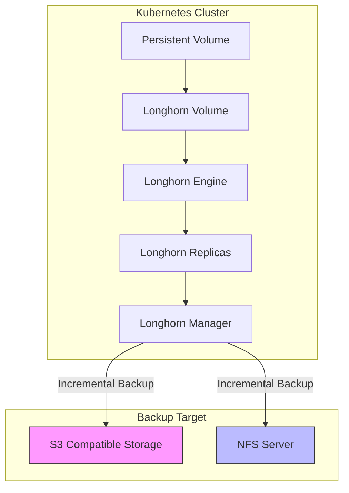
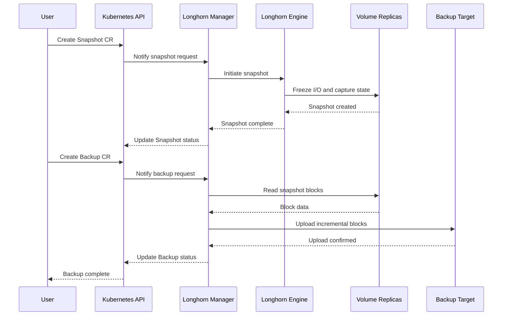
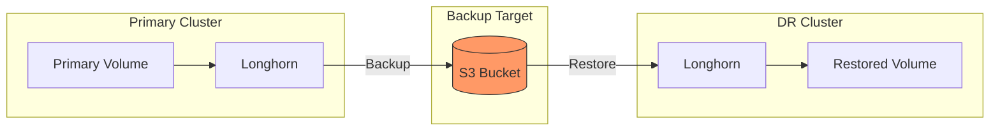

# How to Implement Longhorn Backup Targets

Author: [nawazdhandala](https://github.com/nawazdhandala)

Tags: Longhorn, Kubernetes, Storage, Backup

Description: Learn how to configure Longhorn backup targets for robust disaster recovery, including S3 and NFS backends, scheduled backups, and cross-cluster restore procedures.

---

Longhorn is a lightweight, reliable, and powerful distributed block storage system for Kubernetes. One of its most valuable features is the ability to create backups of your persistent volumes and store them in external backup targets. This capability is essential for disaster recovery, data protection, and cross-cluster migrations.

In this guide, we will walk through configuring backup targets, creating and scheduling backups, and restoring data in disaster recovery scenarios.

## Understanding Longhorn Backup Architecture

Before diving into configuration, let us understand how Longhorn backups work.



Longhorn creates incremental backups by capturing block-level changes. Each backup is stored as a series of blocks in the backup target, making storage efficient and restore operations fast.

## Configuring Backup Targets

Longhorn supports two primary backup target types: S3-compatible object storage and NFS. Let us configure both.

### Option 1: S3 Compatible Storage (AWS, MinIO, etc.)

First, create a Kubernetes secret containing your S3 credentials.

```yaml
# s3-backup-secret.yaml
# This secret stores AWS credentials for S3 backup access
apiVersion: v1
kind: Secret
metadata:
  name: longhorn-backup-target-secret
  namespace: longhorn-system
type: Opaque
stringData:
  # AWS access key ID for S3 bucket access
  AWS_ACCESS_KEY_ID: "your-access-key-id"
  # AWS secret access key (keep this secure)
  AWS_SECRET_ACCESS_KEY: "your-secret-access-key"
  # AWS region where your S3 bucket is located
  AWS_REGION: "us-west-2"
  # Optional: specify custom endpoint for MinIO or other S3-compatible storage
  # AWS_ENDPOINTS: "https://minio.example.com:9000"
```

Apply the secret to your cluster.

```bash
# Apply the S3 credentials secret to the longhorn-system namespace
kubectl apply -f s3-backup-secret.yaml
```

Now configure Longhorn to use S3 as the backup target. You can do this via the Longhorn UI or by editing the Longhorn settings directly.

```yaml
# longhorn-s3-backup-settings.yaml
# Configure Longhorn to use S3 as the backup target
apiVersion: longhorn.io/v1beta2
kind: Setting
metadata:
  name: backup-target
  namespace: longhorn-system
value: "s3://your-bucket-name@us-west-2/"
---
apiVersion: longhorn.io/v1beta2
kind: Setting
metadata:
  name: backup-target-credential-secret
  namespace: longhorn-system
value: "longhorn-backup-target-secret"
```

Apply the backup target configuration.

```bash
# Configure Longhorn to use the S3 backup target
kubectl apply -f longhorn-s3-backup-settings.yaml
```

### Option 2: NFS Backup Target

For NFS-based backups, ensure your NFS server is accessible from all Kubernetes nodes.

```yaml
# longhorn-nfs-backup-settings.yaml
# Configure Longhorn to use NFS as the backup target
apiVersion: longhorn.io/v1beta2
kind: Setting
metadata:
  name: backup-target
  namespace: longhorn-system
# NFS URL format: nfs://server-ip:/exported/path
value: "nfs://192.168.1.100:/backup/longhorn"
---
# NFS typically does not require credentials
apiVersion: longhorn.io/v1beta2
kind: Setting
metadata:
  name: backup-target-credential-secret
  namespace: longhorn-system
value: ""
```

Apply the NFS backup target configuration.

```bash
# Configure Longhorn to use the NFS backup target
kubectl apply -f longhorn-nfs-backup-settings.yaml
```

## Creating Backups

### Manual Backup Creation

You can create backups using kubectl or the Longhorn UI. Here is how to create a backup programmatically.

```yaml
# manual-backup.yaml
# Create a manual backup of a specific Longhorn volume
apiVersion: longhorn.io/v1beta2
kind: Backup
metadata:
  # Unique name for this backup
  name: pvc-database-backup-20260130
  namespace: longhorn-system
  labels:
    # Labels help organize and filter backups
    app: database
    backup-type: manual
spec:
  # Name of the snapshot to backup (create snapshot first)
  snapshotName: database-snapshot-20260130
  # Labels to attach to the backup in the backup target
  labels:
    environment: production
    created-by: kubectl
```

Before creating a backup, you need a snapshot.

```yaml
# create-snapshot.yaml
# Create a snapshot of the volume before backing up
apiVersion: longhorn.io/v1beta2
kind: Snapshot
metadata:
  name: database-snapshot-20260130
  namespace: longhorn-system
spec:
  # The Longhorn volume name (not the PVC name)
  volume: pvc-abc123-def456-ghi789
  labels:
    snapshot-type: pre-backup
```

Create the snapshot and backup.

```bash
# First create the snapshot
kubectl apply -f create-snapshot.yaml

# Wait for snapshot to complete
kubectl wait --for=condition=ready snapshot/database-snapshot-20260130 \
  -n longhorn-system --timeout=300s

# Then create the backup
kubectl apply -f manual-backup.yaml
```

### Scheduled Backups with RecurringJob

Longhorn supports scheduled backups through RecurringJob resources. This is essential for automated disaster recovery.

```yaml
# scheduled-backup-job.yaml
# Configure automated daily backups at 2 AM
apiVersion: longhorn.io/v1beta2
kind: RecurringJob
metadata:
  name: daily-backup
  namespace: longhorn-system
spec:
  # Cron schedule: run at 2:00 AM every day
  cron: "0 2 * * *"
  # Task type: backup (alternatives: snapshot, snapshot-cleanup, backup-cleanup)
  task: backup
  # Keep the last 7 backups
  retain: 7
  # Run on all volumes with matching labels
  groups:
    - default
  # Concurrency limit: how many volumes to backup simultaneously
  concurrency: 2
  # Labels to apply to created backups
  labels:
    backup-schedule: daily
    retention-policy: weekly
```

Apply the recurring backup job.

```bash
# Create the scheduled backup job
kubectl apply -f scheduled-backup-job.yaml
```

Attach the recurring job to specific volumes using labels.

```yaml
# volume-with-backup-label.yaml
# Example PVC with recurring job label for automatic backups
apiVersion: v1
kind: PersistentVolumeClaim
metadata:
  name: database-pvc
  namespace: production
  labels:
    # This label enables the daily-backup recurring job for this volume
    recurring-job.longhorn.io/daily-backup: enabled
    recurring-job-group.longhorn.io/default: enabled
spec:
  accessModes:
    - ReadWriteOnce
  storageClassName: longhorn
  resources:
    requests:
      storage: 50Gi
```

## Backup Flow Diagram

The following diagram illustrates the complete backup workflow.



## Monitoring Backup Status

Check the status of your backups using kubectl.

```bash
# List all backups in the longhorn-system namespace
kubectl get backups -n longhorn-system

# Get detailed information about a specific backup
kubectl describe backup pvc-database-backup-20260130 -n longhorn-system

# List all recurring jobs
kubectl get recurringjobs -n longhorn-system

# Check backup target connectivity
kubectl get settings backup-target -n longhorn-system -o yaml
```

## Restore from Backup

### Restore to the Same Cluster

To restore a backup to the same cluster, create a new volume from the backup.

```yaml
# restore-volume.yaml
# Restore a volume from a backup
apiVersion: longhorn.io/v1beta2
kind: Volume
metadata:
  name: restored-database-volume
  namespace: longhorn-system
spec:
  # Size must match or exceed the original volume size
  size: "53687091200"  # 50Gi in bytes
  # Number of replicas for the restored volume
  numberOfReplicas: 3
  # Specify the backup URL to restore from
  fromBackup: "s3://your-bucket-name@us-west-2/?backup=backup-abc123&volume=pvc-original-volume"
  # Access mode for the volume
  accessMode: rwo
  # Data locality setting
  dataLocality: best-effort
```

Get the backup URL from the backup resource.

```bash
# Get the backup URL for restore operations
kubectl get backup pvc-database-backup-20260130 -n longhorn-system \
  -o jsonpath='{.status.url}'
```

Create the restored volume.

```bash
# Restore the volume from backup
kubectl apply -f restore-volume.yaml

# Wait for restoration to complete
kubectl wait --for=condition=ready volume/restored-database-volume \
  -n longhorn-system --timeout=600s
```

Now create a PV and PVC to use the restored volume.

```yaml
# restored-pvc.yaml
# Create PV and PVC for the restored Longhorn volume
apiVersion: v1
kind: PersistentVolume
metadata:
  name: restored-database-pv
spec:
  capacity:
    storage: 50Gi
  accessModes:
    - ReadWriteOnce
  persistentVolumeReclaimPolicy: Retain
  storageClassName: longhorn
  csi:
    driver: driver.longhorn.io
    fsType: ext4
    # Use the restored volume name
    volumeHandle: restored-database-volume
    volumeAttributes:
      numberOfReplicas: "3"
      staleReplicaTimeout: "2880"
---
apiVersion: v1
kind: PersistentVolumeClaim
metadata:
  name: restored-database-pvc
  namespace: production
spec:
  accessModes:
    - ReadWriteOnce
  storageClassName: longhorn
  volumeName: restored-database-pv
  resources:
    requests:
      storage: 50Gi
```

## Cross-Cluster Disaster Recovery

For true disaster recovery, you need to restore backups to a different Kubernetes cluster.



### Setting Up the DR Cluster

On the disaster recovery cluster, configure the same backup target.

```bash
# On the DR cluster: apply the same backup target configuration
# Ensure the DR cluster has access to the same S3 bucket or NFS share

# Apply S3 credentials
kubectl apply -f s3-backup-secret.yaml

# Configure backup target
kubectl apply -f longhorn-s3-backup-settings.yaml

# Verify backup target connectivity
kubectl get settings backup-target -n longhorn-system
```

### List Available Backups from Backup Target

```bash
# List all backup volumes available in the backup target
kubectl get backupvolumes -n longhorn-system

# Get details of a specific backup volume
kubectl describe backupvolume pvc-original-volume -n longhorn-system

# List all backups for a specific volume
kubectl get backups -n longhorn-system \
  -l longhornvolume=pvc-original-volume
```

### Automated DR Restore Script

Here is a script to automate cross-cluster restore operations.

```bash
#!/bin/bash
# dr-restore.sh
# Automated disaster recovery restore script for Longhorn volumes

set -euo pipefail

# Configuration
BACKUP_URL="${1:?Usage: $0 <backup-url> <new-volume-name> <size-in-bytes>}"
NEW_VOLUME_NAME="${2:?Volume name required}"
VOLUME_SIZE="${3:?Volume size in bytes required}"
NAMESPACE="longhorn-system"
REPLICAS=3

echo "Starting disaster recovery restore..."
echo "Backup URL: ${BACKUP_URL}"
echo "New Volume: ${NEW_VOLUME_NAME}"
echo "Size: ${VOLUME_SIZE} bytes"

# Create the volume manifest
cat <<EOF | kubectl apply -f -
apiVersion: longhorn.io/v1beta2
kind: Volume
metadata:
  name: ${NEW_VOLUME_NAME}
  namespace: ${NAMESPACE}
spec:
  size: "${VOLUME_SIZE}"
  numberOfReplicas: ${REPLICAS}
  fromBackup: "${BACKUP_URL}"
  accessMode: rwo
  dataLocality: best-effort
EOF

echo "Waiting for volume restoration to complete..."

# Wait for the volume to be ready
kubectl wait --for=condition=ready \
  "volume/${NEW_VOLUME_NAME}" \
  -n "${NAMESPACE}" \
  --timeout=1800s

echo "Volume restoration complete!"

# Get volume status
kubectl get volume "${NEW_VOLUME_NAME}" -n "${NAMESPACE}" -o wide
```

Make the script executable and run it.

```bash
# Make the script executable
chmod +x dr-restore.sh

# Run the restore
./dr-restore.sh \
  "s3://bucket@region/?backup=backup-id&volume=vol-name" \
  "dr-restored-volume" \
  "53687091200"
```

## Best Practices for Disaster Recovery

### 1. Regular Backup Verification

Periodically test your backups by restoring to a test namespace.

```yaml
# backup-verification-job.yaml
# CronJob to periodically verify backup integrity
apiVersion: batch/v1
kind: CronJob
metadata:
  name: backup-verification
  namespace: longhorn-system
spec:
  # Run weekly on Sunday at 3 AM
  schedule: "0 3 * * 0"
  jobTemplate:
    spec:
      template:
        spec:
          serviceAccountName: longhorn-service-account
          containers:
          - name: verify-backup
            image: bitnami/kubectl:latest
            command:
            - /bin/bash
            - -c
            - |
              # Get the latest backup URL
              BACKUP_URL=$(kubectl get backups -n longhorn-system \
                --sort-by=.metadata.creationTimestamp \
                -o jsonpath='{.items[-1].status.url}')

              echo "Verifying backup: ${BACKUP_URL}"

              # Create test restore volume
              kubectl apply -f - <<EOF
              apiVersion: longhorn.io/v1beta2
              kind: Volume
              metadata:
                name: backup-verify-test
                namespace: longhorn-system
              spec:
                size: "10737418240"
                numberOfReplicas: 1
                fromBackup: "${BACKUP_URL}"
              EOF

              # Wait and verify
              sleep 300

              # Cleanup test volume
              kubectl delete volume backup-verify-test -n longhorn-system

              echo "Backup verification complete"
          restartPolicy: OnFailure
```

### 2. Implement Backup Retention Policies

Configure cleanup jobs to manage storage costs.

```yaml
# backup-cleanup-job.yaml
# Automatically clean up old backups
apiVersion: longhorn.io/v1beta2
kind: RecurringJob
metadata:
  name: weekly-backup-cleanup
  namespace: longhorn-system
spec:
  # Run cleanup every Sunday at 4 AM
  cron: "0 4 * * 0"
  task: backup-cleanup
  # Keep backups for 30 days
  retain: 30
  groups:
    - default
  concurrency: 1
  labels:
    job-type: cleanup
```

### 3. Monitor Backup Health

Set up alerts for backup failures using Prometheus.

```yaml
# backup-alerts.yaml
# Prometheus alerting rules for Longhorn backups
apiVersion: monitoring.coreos.com/v1
kind: PrometheusRule
metadata:
  name: longhorn-backup-alerts
  namespace: monitoring
spec:
  groups:
  - name: longhorn-backup
    rules:
    - alert: LonghornBackupFailed
      # Alert when backup state is Error
      expr: longhorn_backup_state{state="Error"} > 0
      for: 5m
      labels:
        severity: critical
      annotations:
        summary: "Longhorn backup failed"
        description: "Backup {{ $labels.backup }} for volume {{ $labels.volume }} has failed"

    - alert: LonghornBackupTargetUnavailable
      # Alert when backup target is not available
      expr: longhorn_backup_target_available == 0
      for: 10m
      labels:
        severity: warning
      annotations:
        summary: "Longhorn backup target unavailable"
        description: "The configured backup target is not accessible"
```

## Troubleshooting Common Issues

### Backup Target Connection Failed

```bash
# Check backup target settings
kubectl get settings -n longhorn-system | grep backup

# Verify secret exists and has correct data
kubectl get secret longhorn-backup-target-secret -n longhorn-system -o yaml

# Check Longhorn manager logs for connection errors
kubectl logs -n longhorn-system -l app=longhorn-manager --tail=100 | grep -i backup
```

### Backup Stuck in Progress

```bash
# Check backup status
kubectl get backups -n longhorn-system -o wide

# Get detailed backup information
kubectl describe backup <backup-name> -n longhorn-system

# Check for network issues or storage quota limits
kubectl logs -n longhorn-system deployment/longhorn-driver-deployer
```

### Restore Taking Too Long

```bash
# Check restore progress in volume status
kubectl get volume <volume-name> -n longhorn-system -o yaml | grep -A10 status

# Monitor replica rebuild progress
kubectl get replicas -n longhorn-system | grep <volume-name>

# Check for resource constraints
kubectl top pods -n longhorn-system
```

## Conclusion

Implementing Longhorn backup targets is essential for any production Kubernetes environment. By configuring S3 or NFS backup targets, setting up scheduled backups, and establishing cross-cluster disaster recovery procedures, you can ensure your data remains protected against failures.

Key takeaways:

- Always configure a backup target before relying on Longhorn for production workloads
- Use RecurringJobs for automated, scheduled backups
- Test your restore procedures regularly
- Implement monitoring and alerting for backup health
- Document and practice your disaster recovery procedures

With these practices in place, you can confidently run stateful workloads on Kubernetes knowing your data is protected and recoverable.
