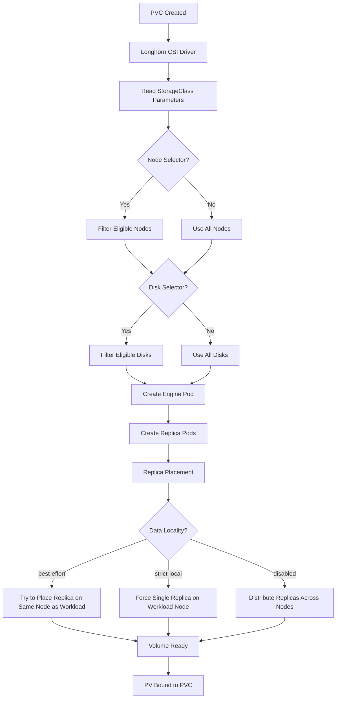
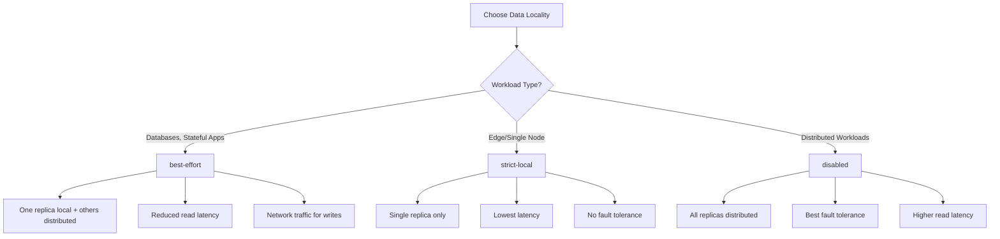
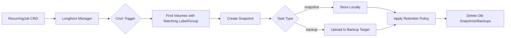

# How to Implement Longhorn Storage Classes

Author: [nawazdhandala](https://github.com/nawazdhandala)

Tags: Longhorn, Kubernetes, Storage, StorageClass

Description: A practical guide to configuring Longhorn StorageClasses for replication, data locality, node and disk selection, and automated backup jobs.

---

Longhorn gives you replicated block storage without the operational burden of running a full Ceph cluster. But the real power comes from its StorageClass parameters. You can control replication factors, pin volumes to specific nodes or disk types, set data locality policies, and wire up recurring backup jobs. This guide walks through every parameter and shows you how to build StorageClasses that match your workloads.

## How Longhorn Provisions Volumes

When you create a PersistentVolumeClaim referencing a Longhorn StorageClass, the CSI driver kicks off a provisioning workflow:



The StorageClass parameters determine how Longhorn selects nodes, disks, replica count, and data placement strategy. Understanding these parameters lets you optimize for performance, availability, or cost.

## Core StorageClass Parameters

Here is a StorageClass with all the essential parameters:

```yaml
# Basic Longhorn StorageClass with commonly used parameters
apiVersion: storage.k8s.io/v1
kind: StorageClass
metadata:
  name: longhorn-standard
  annotations:
    # Set as default StorageClass if desired
    storageclass.kubernetes.io/is-default-class: "false"
provisioner: driver.longhorn.io
allowVolumeExpansion: true  # Allow PVC resize without data loss
reclaimPolicy: Delete       # Delete volume when PVC is deleted
volumeBindingMode: Immediate  # Bind PVC immediately on creation
parameters:
  # Number of replicas for each volume (default: 3)
  numberOfReplicas: "3"

  # Stale replica timeout before rebuild (default: 30 minutes)
  staleReplicaTimeout: "30"

  # Enable/disable revision counter for replica consistency
  revisionCounterDisabled: "false"

  # Filesystem type: ext4 or xfs
  fsType: "ext4"
```

### Explanation of Core Parameters

- **numberOfReplicas**: Controls how many copies of your data exist. Use 3 for production, 2 for development, 1 for ephemeral workloads.
- **staleReplicaTimeout**: Time in minutes before a disconnected replica is marked stale and rebuilt.
- **revisionCounterDisabled**: When true, improves write performance but reduces consistency guarantees during failures.
- **fsType**: The filesystem format. Use ext4 for general workloads, xfs for large files or high throughput.

## Replication Settings

Replication is Longhorn's primary durability mechanism. Each volume maintains multiple replicas across different nodes.

```yaml
# High availability StorageClass with strict replication
apiVersion: storage.k8s.io/v1
kind: StorageClass
metadata:
  name: longhorn-ha
provisioner: driver.longhorn.io
allowVolumeExpansion: true
reclaimPolicy: Delete
parameters:
  # Three replicas ensures survival of two node failures
  numberOfReplicas: "3"

  # Auto-balance replicas when nodes are added/removed
  # Options: disabled, least-effort, best-effort
  replicaAutoBalance: "best-effort"

  # Minimum number of healthy replicas before writes are blocked
  # Prevents data loss during degraded states
  replicaSoftAntiAffinity: "true"

  # Allow scheduling replicas on the same node (not recommended for HA)
  replicaDiskSoftAntiAffinity: "true"

  # Zone-aware replica placement (requires node labels)
  replicaZoneSoftAntiAffinity: "true"
```

### Replica Auto-Balance Modes

```yaml
# Auto-balance disabled: Manual replica management
parameters:
  replicaAutoBalance: "disabled"

# Least-effort: Only balance when new nodes have significantly more space
parameters:
  replicaAutoBalance: "least-effort"

# Best-effort: Actively balance replicas across nodes
parameters:
  replicaAutoBalance: "best-effort"
```

## Data Locality Settings

Data locality controls where Longhorn places replicas relative to the workload consuming the volume.

```yaml
# StorageClass optimized for read-heavy workloads
apiVersion: storage.k8s.io/v1
kind: StorageClass
metadata:
  name: longhorn-local-read
provisioner: driver.longhorn.io
allowVolumeExpansion: true
parameters:
  numberOfReplicas: "3"

  # Data locality options:
  # - disabled: No locality preference (default)
  # - best-effort: Try to keep one replica on workload node
  # - strict-local: Force single replica on workload node only
  dataLocality: "best-effort"
```

### Data Locality Decision Flow



### Strict Local for Edge Deployments

```yaml
# Single-replica StorageClass for edge/single-node clusters
apiVersion: storage.k8s.io/v1
kind: StorageClass
metadata:
  name: longhorn-edge
provisioner: driver.longhorn.io
allowVolumeExpansion: true
parameters:
  # Single replica for edge deployments
  numberOfReplicas: "1"

  # Force local placement
  dataLocality: "strict-local"

  # Faster stale detection for quick recovery
  staleReplicaTimeout: "10"
```

## Node Selector

Node selectors restrict which nodes can host volume replicas. Use labels to target specific hardware or node groups.

```yaml
# StorageClass that targets nodes with SSD storage
apiVersion: storage.k8s.io/v1
kind: StorageClass
metadata:
  name: longhorn-ssd
provisioner: driver.longhorn.io
allowVolumeExpansion: true
parameters:
  numberOfReplicas: "3"

  # Only schedule replicas on nodes with this label
  # Nodes must have: kubectl label node <node> storage-type=ssd
  nodeSelector: "storage-type:ssd"
```

### Multiple Node Labels

```yaml
# Target nodes in a specific zone with NVMe storage
parameters:
  # Multiple labels separated by semicolons
  nodeSelector: "storage-type:nvme;topology.kubernetes.io/zone:us-east-1a"
```

### Setting Up Node Labels

```bash
# Label nodes for storage tiering
kubectl label node worker-01 storage-type=ssd
kubectl label node worker-02 storage-type=ssd
kubectl label node worker-03 storage-type=hdd
kubectl label node worker-04 storage-type=hdd

# Verify labels
kubectl get nodes --show-labels | grep storage-type
```

## Disk Selector

Disk selectors let you target specific disk tags configured in Longhorn. This is useful when nodes have mixed storage types.

```yaml
# StorageClass targeting specific disk tags
apiVersion: storage.k8s.io/v1
kind: StorageClass
metadata:
  name: longhorn-nvme
provisioner: driver.longhorn.io
allowVolumeExpansion: true
parameters:
  numberOfReplicas: "3"

  # Target disks tagged as 'nvme' in Longhorn UI/API
  diskSelector: "nvme"
```

### Configuring Disk Tags

Disk tags are configured per-node in Longhorn. You can set them via the UI or API:

```bash
# Using kubectl to patch node disk tags
kubectl -n longhorn-system patch nodes.longhorn.io worker-01 --type=merge -p '
{
  "spec": {
    "disks": {
      "/dev/nvme0n1": {
        "tags": ["nvme", "fast"]
      },
      "/dev/sda": {
        "tags": ["hdd", "bulk"]
      }
    }
  }
}'
```

### Combining Node and Disk Selectors

```yaml
# StorageClass for database workloads requiring fast storage
apiVersion: storage.k8s.io/v1
kind: StorageClass
metadata:
  name: longhorn-database
provisioner: driver.longhorn.io
allowVolumeExpansion: true
parameters:
  numberOfReplicas: "3"

  # Target database-ready nodes
  nodeSelector: "workload-type:database"

  # Use only NVMe disks on those nodes
  diskSelector: "nvme"

  # Keep one replica local to the database pod
  dataLocality: "best-effort"

  # XFS for better large-file performance
  fsType: "xfs"
```

## Recurring Job Integration

Longhorn supports recurring jobs for snapshots and backups. You can attach these jobs to StorageClasses so every volume created from that class gets automatic data protection.

### Creating Recurring Jobs

First, create the RecurringJob resources:

```yaml
# Hourly snapshot job
apiVersion: longhorn.io/v1beta2
kind: RecurringJob
metadata:
  name: hourly-snapshot
  namespace: longhorn-system
spec:
  # Cron schedule: every hour at minute 0
  cron: "0 * * * *"

  # Job type: snapshot or backup
  task: "snapshot"

  # Number of snapshots to retain
  retain: 24

  # Concurrency limit
  concurrency: 2

  # Labels for targeting volumes
  groups:
    - default
```

```yaml
# Daily backup job to S3
apiVersion: longhorn.io/v1beta2
kind: RecurringJob
metadata:
  name: daily-backup
  namespace: longhorn-system
spec:
  # Daily at 2 AM
  cron: "0 2 * * *"

  # Backup to configured backup target
  task: "backup"

  # Keep 30 daily backups
  retain: 30

  concurrency: 1

  groups:
    - default
    - critical
```

### Attaching Recurring Jobs to StorageClass

```yaml
# StorageClass with automatic snapshot and backup jobs
apiVersion: storage.k8s.io/v1
kind: StorageClass
metadata:
  name: longhorn-protected
provisioner: driver.longhorn.io
allowVolumeExpansion: true
parameters:
  numberOfReplicas: "3"

  # Attach recurring jobs by name (comma-separated)
  recurringJobSelector: '[
    {
      "name": "hourly-snapshot",
      "isGroup": false
    },
    {
      "name": "daily-backup",
      "isGroup": false
    }
  ]'
```

### Group-Based Recurring Jobs

```yaml
# Attach all jobs in the "critical" group
parameters:
  recurringJobSelector: '[
    {
      "name": "critical",
      "isGroup": true
    }
  ]'
```

### Recurring Job Workflow



## Complete Production StorageClass Examples

### General Purpose StorageClass

```yaml
# Balanced StorageClass for most workloads
apiVersion: storage.k8s.io/v1
kind: StorageClass
metadata:
  name: longhorn-general
  annotations:
    storageclass.kubernetes.io/is-default-class: "true"
provisioner: driver.longhorn.io
allowVolumeExpansion: true
reclaimPolicy: Delete
volumeBindingMode: Immediate
parameters:
  numberOfReplicas: "3"
  staleReplicaTimeout: "30"
  replicaAutoBalance: "best-effort"
  dataLocality: "best-effort"
  fsType: "ext4"
  recurringJobSelector: '[{"name":"hourly-snapshot","isGroup":false}]'
```

### High Performance StorageClass

```yaml
# StorageClass for latency-sensitive workloads
apiVersion: storage.k8s.io/v1
kind: StorageClass
metadata:
  name: longhorn-performance
provisioner: driver.longhorn.io
allowVolumeExpansion: true
reclaimPolicy: Delete
volumeBindingMode: WaitForFirstConsumer  # Bind after pod is scheduled
parameters:
  numberOfReplicas: "2"  # Reduced for lower write latency
  staleReplicaTimeout: "15"
  revisionCounterDisabled: "true"  # Improved write performance
  dataLocality: "best-effort"
  nodeSelector: "storage-tier:performance"
  diskSelector: "nvme"
  fsType: "xfs"
```

### Archival StorageClass

```yaml
# StorageClass for infrequently accessed data
apiVersion: storage.k8s.io/v1
kind: StorageClass
metadata:
  name: longhorn-archive
provisioner: driver.longhorn.io
allowVolumeExpansion: true
reclaimPolicy: Retain  # Keep data even after PVC deletion
volumeBindingMode: Immediate
parameters:
  numberOfReplicas: "2"
  staleReplicaTimeout: "60"
  replicaAutoBalance: "least-effort"
  dataLocality: "disabled"
  nodeSelector: "storage-tier:archive"
  diskSelector: "hdd"
  fsType: "ext4"
  recurringJobSelector: '[{"name":"weekly-backup","isGroup":false}]'
```

### Multi-Zone High Availability

```yaml
# StorageClass for multi-zone clusters
apiVersion: storage.k8s.io/v1
kind: StorageClass
metadata:
  name: longhorn-multi-zone
provisioner: driver.longhorn.io
allowVolumeExpansion: true
reclaimPolicy: Delete
volumeBindingMode: WaitForFirstConsumer
parameters:
  numberOfReplicas: "3"
  staleReplicaTimeout: "30"
  replicaAutoBalance: "best-effort"

  # Enable zone-aware placement
  replicaZoneSoftAntiAffinity: "true"

  # Ensure replicas spread across nodes
  replicaSoftAntiAffinity: "true"

  dataLocality: "disabled"  # Let replicas spread across zones
  fsType: "ext4"
```

## Testing Your StorageClass

### Create a Test PVC

```yaml
# Test PVC using the new StorageClass
apiVersion: v1
kind: PersistentVolumeClaim
metadata:
  name: test-longhorn-pvc
spec:
  accessModes:
    - ReadWriteOnce
  storageClassName: longhorn-general
  resources:
    requests:
      storage: 5Gi
```

### Verify Volume Creation

```bash
# Check PVC status
kubectl get pvc test-longhorn-pvc

# Check Longhorn volume details
kubectl -n longhorn-system get volumes.longhorn.io

# Describe volume for replica placement
kubectl -n longhorn-system describe volumes.longhorn.io <volume-name>
```

### Test Pod with Volume

```yaml
# Pod using the test PVC
apiVersion: v1
kind: Pod
metadata:
  name: test-longhorn-pod
spec:
  containers:
    - name: test
      image: busybox
      command: ["sleep", "3600"]
      volumeMounts:
        - name: data
          mountPath: /data
  volumes:
    - name: data
      persistentVolumeClaim:
        claimName: test-longhorn-pvc
```

## Parameter Reference Table

| Parameter | Default | Description |
| --- | --- | --- |
| numberOfReplicas | 3 | Number of data copies |
| staleReplicaTimeout | 30 | Minutes before stale replica rebuild |
| dataLocality | disabled | Replica placement strategy |
| replicaAutoBalance | disabled | Automatic replica redistribution |
| replicaSoftAntiAffinity | true | Allow replicas on same node if needed |
| replicaZoneSoftAntiAffinity | true | Spread replicas across zones |
| nodeSelector | (none) | Node label filter |
| diskSelector | (none) | Disk tag filter |
| fsType | ext4 | Filesystem type |
| revisionCounterDisabled | false | Disable consistency counter |
| recurringJobSelector | (none) | Attached recurring jobs |

---

StorageClasses are the control surface for Longhorn. Get them right and your volumes provision with the exact characteristics your workloads need. Start with a general-purpose class, then create specialized classes as you identify performance tiers, backup requirements, and hardware constraints. Test each class with real workloads before production, and monitor replica distribution to catch placement issues early.
