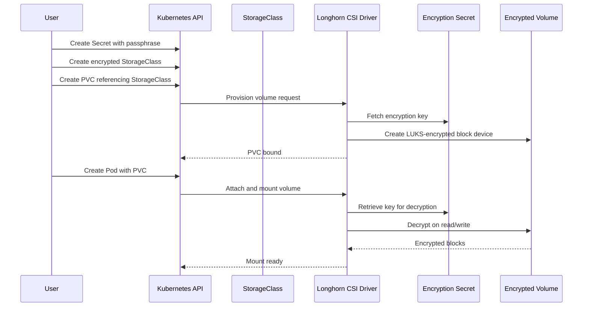
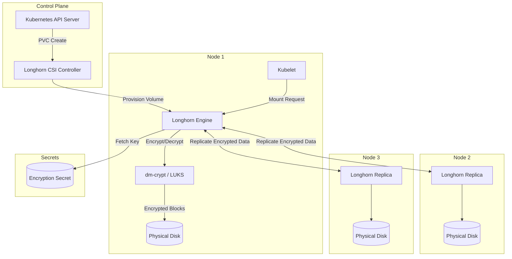
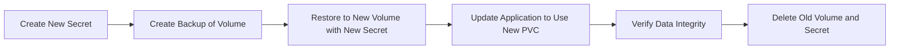

# How to Build Longhorn Volume Encryption

Author: [nawazdhandala](https://github.com/nawazdhandala)

Tags: Longhorn, Kubernetes, Storage, Encryption

Description: A practical guide to encrypting Longhorn volumes with LUKS, managing secrets, and implementing key rotation for data security in Kubernetes.

---

Persistent data in Kubernetes is a liability until it is encrypted. Longhorn makes volume encryption straightforward by integrating with the Linux Unified Key Setup (LUKS) standard. This guide walks through the end-to-end process: creating encryption secrets, configuring StorageClasses, provisioning encrypted volumes, and rotating keys without downtime.

## Why Encrypt Volumes at the Storage Layer

Application-level encryption is valuable, but storage-layer encryption covers cases your code cannot:

- **Data at rest protection:** Even if an attacker pulls a disk from a node, the raw blocks are unreadable without the key.
- **Compliance requirements:** PCI-DSS, HIPAA, and SOC 2 often mandate encryption of all persistent data.
- **Defense in depth:** Combine with network policies and RBAC so a single misconfiguration does not expose everything.

Longhorn uses dm-crypt (LUKS2) under the hood. Each encrypted volume gets its own key, stored in a Kubernetes Secret. The Longhorn engine decrypts blocks on-the-fly when pods read or write.

## Encryption Flow Overview



## Step 1: Create the Encryption Secret

Longhorn expects a Secret containing a `CRYPTO_KEY_VALUE` field with a passphrase. This passphrase unlocks the LUKS volume.

```yaml
# encryption-secret.yaml
# This Secret stores the passphrase for LUKS encryption.
# The passphrase must be base64-encoded when using stringData.
apiVersion: v1
kind: Secret
metadata:
  name: longhorn-crypto-secret
  namespace: longhorn-system
stringData:
  # Passphrase for LUKS encryption (use a strong, random value)
  CRYPTO_KEY_VALUE: "your-strong-passphrase-here-min-20-chars"
  # Provider tells Longhorn to use the built-in secret backend
  CRYPTO_KEY_PROVIDER: "secret"
  # Cipher defaults to aes-xts-plain64; override if needed
  CRYPTO_KEY_CIPHER: "aes-xts-plain64"
  # Key size in bits (256 recommended for AES-XTS)
  CRYPTO_KEY_HASH: "sha256"
  CRYPTO_KEY_SIZE: "256"
  # PBKDF iterations (higher is slower but more secure)
  CRYPTO_PBKDF: "argon2i"
```

Apply the secret:

```bash
# Create the secret in the longhorn-system namespace
kubectl apply -f encryption-secret.yaml

# Verify the secret exists (do not output data)
kubectl get secret longhorn-crypto-secret -n longhorn-system
```

### Generating a Strong Passphrase

Never use predictable passphrases. Generate one with OpenSSL:

```bash
# Generate a 32-byte random passphrase encoded as base64
openssl rand -base64 32
# Example output: Kx7mZ9qL2wN8vB3cF6hJ1tR4yU0pA5sD7gE2iO9rM=
```

Store this passphrase in a secrets manager (Vault, AWS Secrets Manager, or similar) and inject it into Kubernetes at deploy time.

## Step 2: Create an Encrypted StorageClass

The StorageClass tells Longhorn to encrypt all volumes provisioned through it. The `csi.storage.k8s.io/node-stage-secret-*` parameters point to the Secret created above.

```yaml
# encrypted-storageclass.yaml
apiVersion: storage.k8s.io/v1
kind: StorageClass
metadata:
  name: longhorn-encrypted
provisioner: driver.longhorn.io
allowVolumeExpansion: true
reclaimPolicy: Delete
volumeBindingMode: Immediate
parameters:
  # Number of replicas for high availability
  numberOfReplicas: "3"
  # Enable encryption
  encrypted: "true"
  # Data locality setting (best-effort places replicas on the same node)
  dataLocality: "best-effort"
  # Reference the encryption secret for staging (node operations)
  csi.storage.k8s.io/node-stage-secret-name: "longhorn-crypto-secret"
  csi.storage.k8s.io/node-stage-secret-namespace: "longhorn-system"
  # Reference the encryption secret for publishing (pod mount operations)
  csi.storage.k8s.io/node-publish-secret-name: "longhorn-crypto-secret"
  csi.storage.k8s.io/node-publish-secret-namespace: "longhorn-system"
```

Apply the StorageClass:

```bash
# Create the encrypted StorageClass
kubectl apply -f encrypted-storageclass.yaml

# Verify it appears in the cluster
kubectl get storageclass longhorn-encrypted
```

## Step 3: Provision an Encrypted Volume

With the StorageClass in place, any PVC that references it will automatically provision an encrypted volume.

```yaml
# encrypted-pvc.yaml
apiVersion: v1
kind: PersistentVolumeClaim
metadata:
  name: encrypted-data
  namespace: default
spec:
  accessModes:
    - ReadWriteOnce
  storageClassName: longhorn-encrypted
  resources:
    requests:
      # Request 10Gi of encrypted storage
      storage: 10Gi
```

Apply and verify:

```bash
# Create the PVC
kubectl apply -f encrypted-pvc.yaml

# Watch until the PVC is bound
kubectl get pvc encrypted-data -w
# NAME             STATUS   VOLUME                                     CAPACITY   ACCESS MODES   STORAGECLASS         AGE
# encrypted-data   Bound    pvc-a1b2c3d4-e5f6-7890-abcd-ef1234567890   10Gi       RWO            longhorn-encrypted   5s
```

## Step 4: Use the Encrypted Volume in a Pod

Mount the encrypted PVC like any other volume. Longhorn handles decryption transparently.

```yaml
# app-with-encrypted-volume.yaml
apiVersion: v1
kind: Pod
metadata:
  name: secure-app
  namespace: default
spec:
  containers:
    - name: app
      image: busybox:1.36
      command: ["sh", "-c", "echo 'Encrypted storage works!' > /data/test.txt && sleep 3600"]
      volumeMounts:
        - name: secure-storage
          mountPath: /data
  volumes:
    - name: secure-storage
      persistentVolumeClaim:
        claimName: encrypted-data
```

Deploy and verify:

```bash
# Create the pod
kubectl apply -f app-with-encrypted-volume.yaml

# Check pod status
kubectl get pod secure-app

# Verify the file was written
kubectl exec secure-app -- cat /data/test.txt
# Output: Encrypted storage works!
```

## Architecture: How Encryption Flows Through Longhorn



Key points:
- **Encryption happens at the engine level.** The Longhorn engine encrypts data before writing to replicas.
- **Replicas store encrypted blocks.** Even if you access replica disks directly, data is unreadable.
- **Secrets stay in Kubernetes.** The passphrase never leaves the cluster (unless you export it).

## Key Rotation Strategies

Rotating encryption keys is essential for long-term security. Longhorn supports key rotation through a backup-and-restore workflow.

### Option 1: Rotate by Creating a New Volume

This approach provisions a new volume with a new key and migrates data.

```bash
# 1. Create a new secret with a fresh passphrase
kubectl create secret generic longhorn-crypto-secret-v2 \
  --from-literal=CRYPTO_KEY_VALUE="$(openssl rand -base64 32)" \
  --from-literal=CRYPTO_KEY_PROVIDER="secret" \
  --from-literal=CRYPTO_KEY_CIPHER="aes-xts-plain64" \
  --from-literal=CRYPTO_KEY_HASH="sha256" \
  --from-literal=CRYPTO_KEY_SIZE="256" \
  --from-literal=CRYPTO_PBKDF="argon2i" \
  -n longhorn-system

# 2. Create a new StorageClass pointing to the new secret
# (modify the secret name references in encrypted-storageclass.yaml)

# 3. Create a new PVC with the new StorageClass

# 4. Copy data from the old volume to the new volume using a migration pod
```

### Option 2: Rotate via Backup and Restore

Longhorn backups are encrypted with the volume's key. You can restore to a new volume with a different key.

```yaml
# backup-and-restore-rotation.yaml
# Step 1: Trigger a backup of the existing volume
apiVersion: longhorn.io/v1beta2
kind: Backup
metadata:
  name: encrypted-data-backup
  namespace: longhorn-system
spec:
  snapshotName: encrypted-data-snapshot
  labels:
    rotation: "pre-key-change"
---
# Step 2: Restore to a new volume with the new encryption secret
apiVersion: longhorn.io/v1beta2
kind: Volume
metadata:
  name: encrypted-data-v2
  namespace: longhorn-system
spec:
  size: "10Gi"
  numberOfReplicas: 3
  encrypted: true
  # Reference the new secret
  dataSource:
    kind: Backup
    name: encrypted-data-backup
```

### Key Rotation Workflow



### Automated Key Rotation Script

```bash
#!/bin/bash
# rotate-longhorn-key.sh
# Automates key rotation for a Longhorn encrypted volume

set -euo pipefail

NAMESPACE="longhorn-system"
OLD_SECRET="longhorn-crypto-secret"
NEW_SECRET="longhorn-crypto-secret-$(date +%Y%m%d)"
VOLUME_NAME="encrypted-data"

echo "Generating new encryption key..."
NEW_KEY=$(openssl rand -base64 32)

echo "Creating new secret: ${NEW_SECRET}"
kubectl create secret generic "${NEW_SECRET}" \
  --from-literal=CRYPTO_KEY_VALUE="${NEW_KEY}" \
  --from-literal=CRYPTO_KEY_PROVIDER="secret" \
  --from-literal=CRYPTO_KEY_CIPHER="aes-xts-plain64" \
  --from-literal=CRYPTO_KEY_HASH="sha256" \
  --from-literal=CRYPTO_KEY_SIZE="256" \
  --from-literal=CRYPTO_PBKDF="argon2i" \
  -n "${NAMESPACE}"

echo "Creating backup of volume: ${VOLUME_NAME}"
kubectl exec -n "${NAMESPACE}" deploy/longhorn-driver-deployer -- \
  longhorn-manager snapshot backup create "${VOLUME_NAME}"

echo "Key rotation prepared. Next steps:"
echo "1. Restore the backup to a new volume with the new secret"
echo "2. Update your application to use the new PVC"
echo "3. Verify data and delete the old volume"
echo ""
echo "New secret name: ${NEW_SECRET}"
echo "Store the key securely: ${NEW_KEY}"
```

## Best Practices for Encryption Key Management

### 1. Use External Secret Stores

Avoid storing raw passphrases in Git. Use tools like:

- **HashiCorp Vault** with the Kubernetes auth method
- **AWS Secrets Manager** with External Secrets Operator
- **Azure Key Vault** with the CSI secrets driver

Example with External Secrets Operator:

```yaml
# external-secret.yaml
apiVersion: external-secrets.io/v1beta1
kind: ExternalSecret
metadata:
  name: longhorn-crypto-external
  namespace: longhorn-system
spec:
  refreshInterval: 1h
  secretStoreRef:
    name: vault-backend
    kind: ClusterSecretStore
  target:
    name: longhorn-crypto-secret
    creationPolicy: Owner
  data:
    - secretKey: CRYPTO_KEY_VALUE
      remoteRef:
        key: secret/data/longhorn/encryption
        property: passphrase
```

### 2. Limit Secret Access with RBAC

Restrict which service accounts can read encryption secrets:

```yaml
# encryption-secret-rbac.yaml
apiVersion: rbac.authorization.k8s.io/v1
kind: Role
metadata:
  name: longhorn-crypto-reader
  namespace: longhorn-system
rules:
  - apiGroups: [""]
    resources: ["secrets"]
    resourceNames: ["longhorn-crypto-secret"]
    verbs: ["get"]
---
apiVersion: rbac.authorization.k8s.io/v1
kind: RoleBinding
metadata:
  name: longhorn-crypto-reader-binding
  namespace: longhorn-system
subjects:
  - kind: ServiceAccount
    name: longhorn-service-account
    namespace: longhorn-system
roleRef:
  kind: Role
  name: longhorn-crypto-reader
  apiGroup: rbac.authorization.k8s.io
```

### 3. Audit Secret Access

Enable Kubernetes audit logging to track who accesses encryption secrets:

```yaml
# audit-policy.yaml (snippet)
apiVersion: audit.k8s.io/v1
kind: Policy
rules:
  - level: RequestResponse
    resources:
      - group: ""
        resources: ["secrets"]
    namespaces: ["longhorn-system"]
```

### 4. Backup Keys Separately

Your encrypted volume backups are useless without the key. Store keys in a geographically separate location from volume backups.

## Verifying Encryption

Confirm that a volume is encrypted by inspecting it in the Longhorn UI or via kubectl:

```bash
# Check volume encryption status
kubectl get volume -n longhorn-system -o jsonpath='{range .items[*]}{.metadata.name}{"\t"}{.spec.encrypted}{"\n"}{end}'

# Example output:
# pvc-a1b2c3d4-e5f6-7890-abcd-ef1234567890   true
# pvc-unencrypted-volume                      false
```

You can also verify at the node level by checking for dm-crypt devices:

```bash
# SSH into a node and list dm-crypt devices
sudo dmsetup ls --target crypt
# Output shows LUKS-encrypted volumes
```

## Troubleshooting Common Issues

### Volume Stuck in Attaching State

**Cause:** The encryption secret is missing or has incorrect keys.

**Fix:**

```bash
# Verify the secret exists and has the required keys
kubectl get secret longhorn-crypto-secret -n longhorn-system -o jsonpath='{.data}' | jq 'keys'
# Should include: CRYPTO_KEY_VALUE, CRYPTO_KEY_PROVIDER

# Check Longhorn engine logs for errors
kubectl logs -n longhorn-system -l app=longhorn-manager --tail=100 | grep -i crypt
```

### Permission Denied on Secret

**Cause:** The Longhorn service account lacks permissions to read the secret.

**Fix:** Apply the RBAC configuration shown above and restart the Longhorn manager:

```bash
kubectl rollout restart deployment longhorn-driver-deployer -n longhorn-system
```

### Performance Degradation

**Cause:** Encryption adds CPU overhead. AES-NI hardware acceleration may be disabled.

**Fix:** Verify AES-NI support on nodes:

```bash
# Check for AES-NI instruction set
grep -o aes /proc/cpuinfo | head -1
# Should output: aes
```

If AES-NI is available but not used, ensure the kernel module is loaded:

```bash
sudo modprobe aesni_intel
```

## Summary

Longhorn volume encryption provides transparent, LUKS-based protection for persistent data in Kubernetes. The setup involves three components:

1. **Encryption Secret:** Stores the passphrase that unlocks volumes.
2. **Encrypted StorageClass:** References the secret and enables encryption for all provisioned PVCs.
3. **Key Rotation Strategy:** Either backup-restore or volume migration to safely change keys.

Pair encryption with external secret management, RBAC restrictions, and audit logging to build a defense-in-depth posture for your cluster's persistent data.
