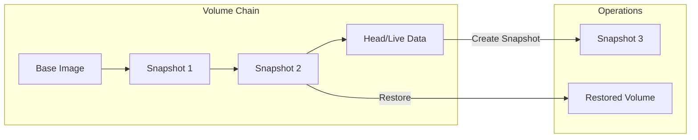
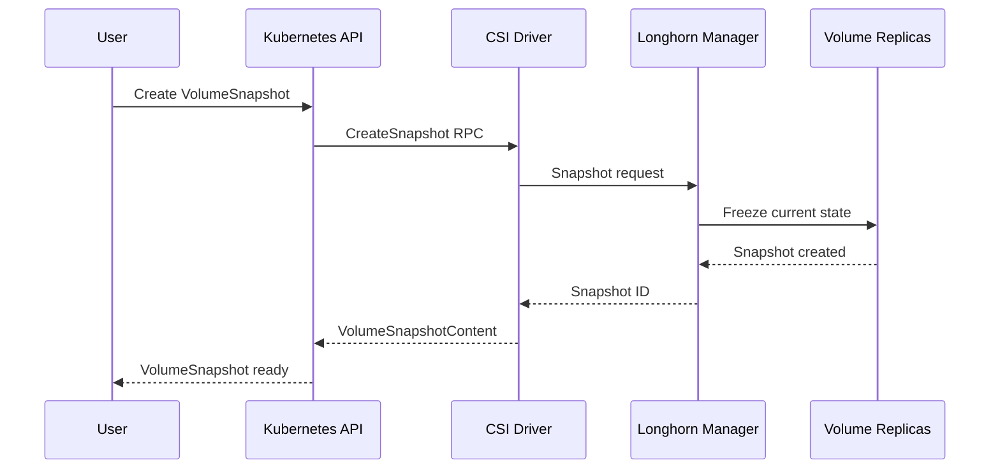
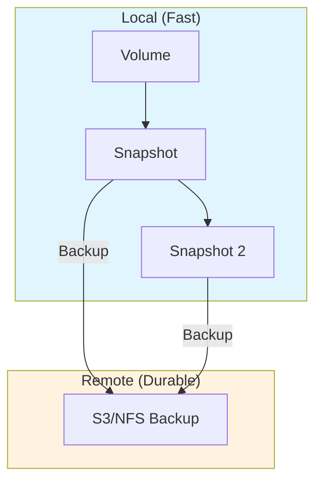

# How to Build Longhorn Volume Snapshots

Author: [nawazdhandala](https://github.com/nawazdhandala)

Tags: Longhorn, Kubernetes, Storage, Snapshots

Description: A practical guide to creating, managing, and restoring Longhorn volume snapshots in Kubernetes using kubectl, the Longhorn UI, and VolumeSnapshot CRDs.

---

Longhorn makes persistent storage on Kubernetes straightforward, but the real value shows up when you need to roll back a database, clone a volume for testing, or recover from accidental data loss. Snapshots are how you get there. This guide walks through creating snapshots manually, automating them on a schedule, and restoring volumes when things go wrong.

## How Longhorn Snapshots Work

Longhorn stores each volume as a chain of differencing images. When you create a snapshot, Longhorn freezes the current state and starts writing new changes to a fresh layer. This approach is fast because it does not copy data during snapshot creation.



Each replica maintains its own snapshot chain. When you restore, Longhorn rebuilds the volume state from the base image plus the snapshot layers up to your chosen point.

## Prerequisites

Before working with snapshots, verify your Longhorn installation:

```bash
# Check Longhorn pods are running
kubectl get pods -n longhorn-system

# Verify the Longhorn StorageClass exists
kubectl get storageclass | grep longhorn

# Check Longhorn manager is healthy
kubectl get daemonset -n longhorn-system longhorn-manager
```

You should see all Longhorn components running. If not, check the Longhorn documentation for installation steps.

## Creating Snapshots via the Longhorn UI

The Longhorn UI provides the fastest path to manual snapshots.

1. Access the Longhorn dashboard at `http://<longhorn-frontend-service>/`
2. Navigate to **Volume** in the left menu
3. Click on the volume you want to snapshot
4. Click **Take Snapshot** in the operations bar
5. Enter a name (e.g., `pre-migration-2026-01-30`)
6. Click **OK**

The snapshot appears in the volume's snapshot list within seconds. You can create multiple snapshots and Longhorn will track the chain automatically.

## Creating Snapshots with kubectl

For scripting and automation, use Longhorn's custom resources directly.

### List Existing Volumes

```bash
# Get all Longhorn volumes
kubectl get volumes.longhorn.io -n longhorn-system

# Get detailed info about a specific volume
kubectl get volumes.longhorn.io <volume-name> -n longhorn-system -o yaml
```

### Create a Snapshot Using the Longhorn API

Longhorn does not have a dedicated Snapshot CRD for creation. Instead, you interact with the Longhorn API. The simplest method is through the `longhorn-manager` pod:

```bash
# Find a longhorn-manager pod
MANAGER_POD=$(kubectl get pods -n longhorn-system -l app=longhorn-manager -o jsonpath='{.items[0].metadata.name}')

# Create a snapshot via the API
kubectl exec -n longhorn-system $MANAGER_POD -- \
  curl -s -X POST \
  "http://localhost:9500/v1/volumes/<volume-name>?action=snapshotCreate" \
  -H "Content-Type: application/json" \
  -d '{"name": "manual-snapshot-2026-01-30"}'
```

### List Snapshots for a Volume

```bash
kubectl exec -n longhorn-system $MANAGER_POD -- \
  curl -s "http://localhost:9500/v1/volumes/<volume-name>/snapshots" | jq '.data[] | {name, created}'
```

## Using Kubernetes VolumeSnapshot CRD

Longhorn supports the CSI VolumeSnapshot interface, which provides a Kubernetes-native way to manage snapshots.

### Install the Snapshot Controller

If your cluster does not have the snapshot controller installed:

```bash
# Install snapshot CRDs
kubectl apply -f https://raw.githubusercontent.com/kubernetes-csi/external-snapshotter/master/client/config/crd/snapshot.storage.k8s.io_volumesnapshotclasses.yaml
kubectl apply -f https://raw.githubusercontent.com/kubernetes-csi/external-snapshotter/master/client/config/crd/snapshot.storage.k8s.io_volumesnapshotcontents.yaml
kubectl apply -f https://raw.githubusercontent.com/kubernetes-csi/external-snapshotter/master/client/config/crd/snapshot.storage.k8s.io_volumesnapshots.yaml

# Install snapshot controller
kubectl apply -f https://raw.githubusercontent.com/kubernetes-csi/external-snapshotter/master/deploy/kubernetes/snapshot-controller/rbac-snapshot-controller.yaml
kubectl apply -f https://raw.githubusercontent.com/kubernetes-csi/external-snapshotter/master/deploy/kubernetes/snapshot-controller/setup-snapshot-controller.yaml
```

### Create a VolumeSnapshotClass

```yaml
apiVersion: snapshot.storage.k8s.io/v1
kind: VolumeSnapshotClass
metadata:
  name: longhorn-snapshot-class
driver: driver.longhorn.io
deletionPolicy: Delete
parameters:
  type: snap
```

Apply it:

```bash
kubectl apply -f volumesnapshotclass.yaml
```

### Create a VolumeSnapshot

```yaml
apiVersion: snapshot.storage.k8s.io/v1
kind: VolumeSnapshot
metadata:
  name: postgres-data-snapshot
  namespace: production
spec:
  volumeSnapshotClassName: longhorn-snapshot-class
  source:
    persistentVolumeClaimName: postgres-data-pvc
```

Apply and verify:

```bash
kubectl apply -f volumesnapshot.yaml

# Check snapshot status
kubectl get volumesnapshot postgres-data-snapshot -n production

# Get detailed status
kubectl describe volumesnapshot postgres-data-snapshot -n production
```

The snapshot is ready when `READYTOUSE` shows `true`.

## Snapshot Workflow Diagram



## Scheduling Recurring Snapshots

Longhorn has built-in support for recurring snapshots. You can configure them per-volume or as a default for all volumes.

### Configure via Longhorn UI

1. Go to **Volume** and select your volume
2. Click **Recurring Jobs** tab
3. Click **Add Recurring Job**
4. Set the schedule (cron format), retention count, and job type (snapshot or backup)
5. Save the configuration

### Configure via kubectl

Create a RecurringJob resource:

```yaml
apiVersion: longhorn.io/v1beta2
kind: RecurringJob
metadata:
  name: hourly-snapshot
  namespace: longhorn-system
spec:
  name: hourly-snapshot
  groups:
    - default
  task: snapshot
  cron: "0 * * * *"
  retain: 24
  concurrency: 1
  labels:
    type: scheduled
```

Apply and attach to volumes:

```bash
kubectl apply -f recurring-job.yaml
```

To attach this job to a specific volume, add a label:

```bash
kubectl label volume.longhorn.io/<volume-name> -n longhorn-system recurring-job.longhorn.io/hourly-snapshot=enabled
```

### Default Recurring Jobs

Set default recurring jobs for all new volumes in the Longhorn settings:

```bash
kubectl edit settings.longhorn.io default-recurring-job-groups -n longhorn-system
```

Or use the UI: **Setting** > **General** > **Default Recurring Job Groups**

## Restoring from a Snapshot

### Restore to a New Volume via UI

1. Navigate to the volume containing your snapshot
2. Go to the **Snapshots** tab
3. Find the snapshot you want to restore
4. Click the **Restore** icon
5. Enter a name for the new volume
6. Click **OK**

Longhorn creates a new volume from the snapshot. You can then create a PVC pointing to this new volume.

### Restore via kubectl

Create a new PVC from a VolumeSnapshot:

```yaml
apiVersion: v1
kind: PersistentVolumeClaim
metadata:
  name: postgres-data-restored
  namespace: production
spec:
  storageClassName: longhorn
  dataSource:
    name: postgres-data-snapshot
    kind: VolumeSnapshot
    apiGroup: snapshot.storage.k8s.io
  accessModes:
    - ReadWriteOnce
  resources:
    requests:
      storage: 20Gi
```

Apply it:

```bash
kubectl apply -f restored-pvc.yaml

# Watch the PVC until it's bound
kubectl get pvc postgres-data-restored -n production -w
```

### Revert a Volume to a Snapshot (In-Place)

To revert an existing volume to a previous snapshot (destructive operation):

1. Scale down or delete any pods using the volume
2. In the Longhorn UI, go to the volume's **Snapshots** tab
3. Click **Revert** on the desired snapshot
4. Confirm the operation
5. Restart your pods

Via API:

```bash
kubectl exec -n longhorn-system $MANAGER_POD -- \
  curl -s -X POST \
  "http://localhost:9500/v1/volumes/<volume-name>?action=snapshotRevert" \
  -H "Content-Type: application/json" \
  -d '{"name": "<snapshot-name>"}'
```

## Backup vs Snapshot

Snapshots and backups serve different purposes:



| Feature | Snapshot | Backup |
|---------|----------|--------|
| Speed | Instant | Minutes to hours |
| Location | Local disk | Remote storage (S3, NFS) |
| Survives node failure | No | Yes |
| Use case | Quick rollback, cloning | Disaster recovery |

For production workloads, use snapshots for quick recovery and backups for disaster recovery. Schedule both.

## Managing Snapshot Retention

Snapshots consume disk space. Configure retention policies to keep storage usage under control.

### Via Recurring Job

Set the `retain` field in your RecurringJob:

```yaml
spec:
  retain: 24  # Keep last 24 snapshots
```

### Manual Cleanup

Delete old snapshots via the UI or API:

```bash
# Delete a snapshot
kubectl exec -n longhorn-system $MANAGER_POD -- \
  curl -s -X POST \
  "http://localhost:9500/v1/volumes/<volume-name>?action=snapshotDelete" \
  -H "Content-Type: application/json" \
  -d '{"name": "<snapshot-name>"}'
```

### Delete VolumeSnapshots

```bash
kubectl delete volumesnapshot <snapshot-name> -n <namespace>
```

The underlying Longhorn snapshot is deleted based on your VolumeSnapshotClass `deletionPolicy`.

## Monitoring Snapshots

### Check Snapshot Space Usage

```bash
# Get volume details including snapshot count
kubectl get volumes.longhorn.io -n longhorn-system -o custom-columns=\
NAME:.metadata.name,\
SIZE:.spec.size,\
SNAPSHOTS:.status.actualSize
```

### Prometheus Metrics

Longhorn exposes metrics for monitoring. Key snapshot-related metrics:

- `longhorn_volume_actual_size_bytes`: Actual space used including snapshots
- `longhorn_snapshot_count`: Number of snapshots per volume

Add alerting for volumes approaching capacity:

```yaml
groups:
  - name: longhorn
    rules:
      - alert: LonghornVolumeSpaceHigh
        expr: |
          longhorn_volume_actual_size_bytes / longhorn_volume_capacity_bytes > 0.85
        for: 10m
        labels:
          severity: warning
        annotations:
          summary: "Longhorn volume {{ $labels.volume }} is above 85% capacity"
```

## Troubleshooting

### Snapshot Creation Fails

Check the Longhorn manager logs:

```bash
kubectl logs -n longhorn-system -l app=longhorn-manager --tail=100 | grep -i snapshot
```

Common causes:
- Volume is detached (attach it first)
- Replica is in error state (check replica health)
- Insufficient disk space on nodes

### VolumeSnapshot Stuck in Pending

```bash
kubectl describe volumesnapshot <name> -n <namespace>
```

Look for events indicating:
- Missing VolumeSnapshotClass
- CSI driver not ready
- Source PVC not found

### Restore Takes Too Long

Large volumes with many snapshots take time to restore. Check progress:

```bash
kubectl get volumes.longhorn.io <volume-name> -n longhorn-system -o jsonpath='{.status.robustness}'
```

## Best Practices

1. **Name snapshots meaningfully**: Include dates and context (e.g., `pre-upgrade-2026-01-30`)
2. **Test restores regularly**: A snapshot you cannot restore is worthless
3. **Combine with backups**: Snapshots protect against mistakes; backups protect against disasters
4. **Set retention policies**: Unbounded snapshot growth will fill your disks
5. **Monitor actual size**: The volume's actual size includes all snapshot data
6. **Document your snapshot strategy**: Make sure the team knows the retention policy and restore procedures

Snapshots are your safety net for day-to-day operations. Set them up once, automate the schedule, and verify restores periodically. When something breaks at 2 AM, you will be glad the rollback is one click away.
