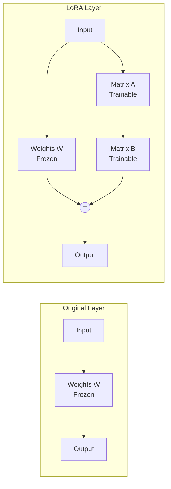
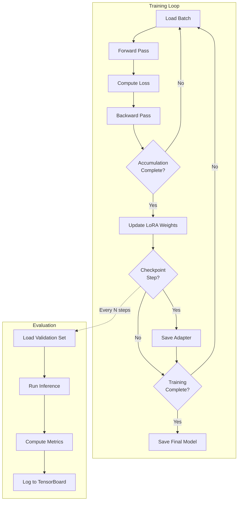
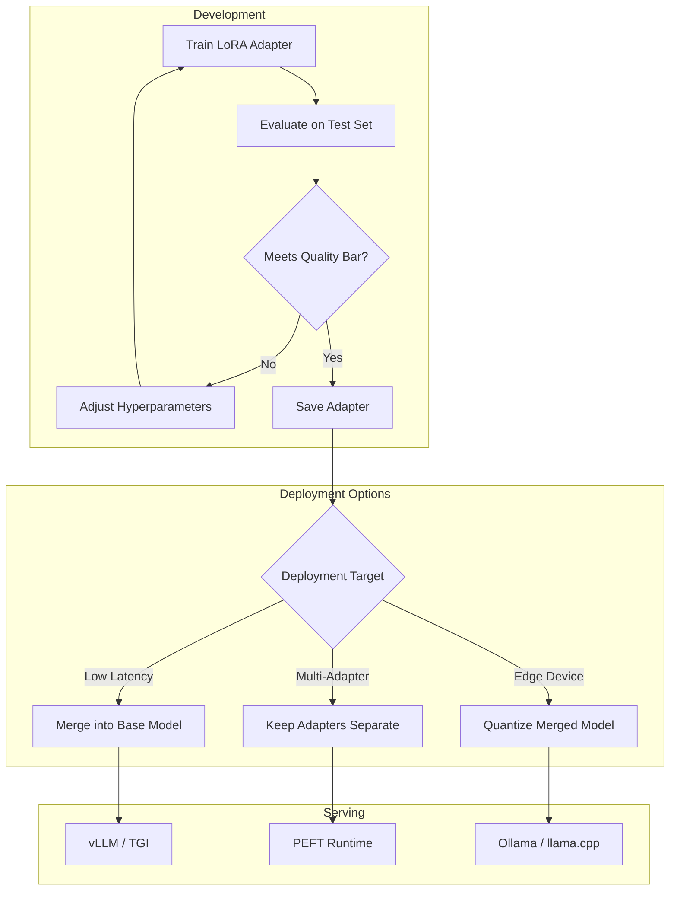

# How to Create LoRA Fine-Tuning

Author: [nawazdhandala](https://github.com/nawazdhandala)

Tags: LLM, Fine-Tuning, MLOps, AI

Description: A practical guide to fine-tuning large language models using LoRA (Low-Rank Adaptation), covering dataset preparation, training configuration, and deployment.

---

Fine-tuning large language models traditionally required massive GPU resources. A 7B parameter model needs around 56GB of VRAM just to store gradients and optimizer states during full fine-tuning. LoRA (Low-Rank Adaptation) changes this by training only small adapter matrices while keeping the base model frozen. You can fine-tune a 7B model on a single 24GB GPU.

## How LoRA Works

Instead of updating all model weights during training, LoRA injects small trainable matrices into specific layers. These matrices decompose weight updates into low-rank representations, dramatically reducing the number of trainable parameters.



The key insight: weight updates during fine-tuning often have low intrinsic rank. A matrix decomposition `W + BA` where `B` has shape `(d, r)` and `A` has shape `(r, k)` with small rank `r` (typically 8-64) captures most of the adaptation while using far fewer parameters.

| Approach | Trainable Params (7B Model) | VRAM Required |
|----------|----------------------------|---------------|
| Full Fine-Tuning | 7 billion | 56GB+ |
| LoRA (r=8) | ~4 million | 16GB |
| LoRA (r=16) | ~8 million | 18GB |
| LoRA (r=64) | ~33 million | 24GB |

## Setting Up Your Environment

Install the required libraries. The PEFT library from Hugging Face provides the LoRA implementation, while bitsandbytes enables quantization for further memory savings.

```bash
# Create a virtual environment for isolation
python -m venv lora-env
source lora-env/bin/activate

# Install core dependencies
pip install torch torchvision torchaudio --index-url https://download.pytorch.org/whl/cu121

# Install Hugging Face libraries
pip install transformers datasets accelerate peft

# Install bitsandbytes for quantization (reduces memory further)
pip install bitsandbytes

# Install evaluation and monitoring tools
pip install evaluate tensorboard wandb
```

Verify your GPU setup before proceeding.

```python
import torch

# Check CUDA availability and GPU properties
print(f"CUDA available: {torch.cuda.is_available()}")
print(f"GPU count: {torch.cuda.device_count()}")

if torch.cuda.is_available():
    print(f"GPU name: {torch.cuda.get_device_name(0)}")
    print(f"VRAM: {torch.cuda.get_device_properties(0).total_memory / 1e9:.1f} GB")
```

## Preparing Your Dataset

Your training data format depends on the task. For instruction-following, use a format with clear instruction and response pairs. The dataset structure directly impacts model quality.

```python
from datasets import Dataset, load_dataset

def create_instruction_dataset():
    """
    Create a dataset for instruction fine-tuning.
    Each example needs an instruction, optional input context, and expected output.
    """

    # Example: Customer support fine-tuning data
    data = [
        {
            "instruction": "Respond to this customer complaint about shipping delays.",
            "input": "My order #12345 was supposed to arrive 5 days ago but tracking shows it's still in transit.",
            "output": "I sincerely apologize for the delay with your order #12345. I've checked the tracking and can see it's been held at a distribution center. I'm escalating this to our logistics team for immediate attention and will update you within 24 hours. As compensation for this inconvenience, I'm adding a 15% discount to your account for your next order."
        },
        {
            "instruction": "Explain the return policy to a customer.",
            "input": "Can I return an item I bought 45 days ago?",
            "output": "Our standard return policy covers items within 30 days of purchase. Since your purchase was 45 days ago, it falls outside our regular window. However, I can offer you store credit for the item's current value, or if the item is defective, we can process an exception. Would either of these options work for you?"
        },
        # Add more examples...
    ]

    return Dataset.from_list(data)


def format_for_training(example):
    """
    Format each example into the prompt template expected by the model.
    This template structure matters - use the same format during inference.
    """

    # Alpaca-style format works well for instruction-following
    if example.get("input"):
        text = f"""### Instruction:
{example['instruction']}

### Input:
{example['input']}

### Response:
{example['output']}"""
    else:
        text = f"""### Instruction:
{example['instruction']}

### Response:
{example['output']}"""

    return {"text": text}


# Load and process dataset
dataset = create_instruction_dataset()
dataset = dataset.map(format_for_training)

# Split into train and validation sets
dataset = dataset.train_test_split(test_size=0.1, seed=42)
print(f"Training examples: {len(dataset['train'])}")
print(f"Validation examples: {len(dataset['test'])}")
```

For larger datasets, load from files or Hugging Face Hub.

```python
# Load from JSON file
dataset = load_dataset("json", data_files="training_data.json")

# Load from Hugging Face Hub
dataset = load_dataset("databricks/databricks-dolly-15k")

# Load from CSV
dataset = load_dataset("csv", data_files="data.csv")
```

## Loading the Base Model with Quantization

Load the model in 4-bit quantization to fit larger models on consumer GPUs. The QLoRA technique combines quantization with LoRA for maximum memory efficiency.

```python
from transformers import AutoModelForCausalLM, AutoTokenizer, BitsAndBytesConfig
import torch

def load_model_for_training(model_name: str):
    """
    Load a model with 4-bit quantization for memory-efficient fine-tuning.
    QLoRA = Quantized base model + LoRA adapters = best of both worlds.
    """

    # Configure 4-bit quantization
    # NF4 (Normal Float 4) provides better quality than standard int4
    bnb_config = BitsAndBytesConfig(
        load_in_4bit=True,                    # Enable 4-bit quantization
        bnb_4bit_quant_type="nf4",            # Use NF4 quantization type
        bnb_4bit_compute_dtype=torch.bfloat16, # Compute in bfloat16 for stability
        bnb_4bit_use_double_quant=True,       # Nested quantization for extra savings
    )

    # Load tokenizer first
    tokenizer = AutoTokenizer.from_pretrained(model_name)

    # Set padding token if not defined (common issue with Llama models)
    if tokenizer.pad_token is None:
        tokenizer.pad_token = tokenizer.eos_token
        tokenizer.pad_token_id = tokenizer.eos_token_id

    # Load model with quantization config
    model = AutoModelForCausalLM.from_pretrained(
        model_name,
        quantization_config=bnb_config,
        device_map="auto",           # Automatically distribute across GPUs
        trust_remote_code=True,      # Required for some models
        torch_dtype=torch.bfloat16,  # Use bfloat16 for non-quantized parts
    )

    # Disable caching for training (saves memory)
    model.config.use_cache = False

    # Enable gradient checkpointing for additional memory savings
    # Trades compute for memory by recomputing activations during backward pass
    model.gradient_checkpointing_enable()

    return model, tokenizer


# Load Llama 3.2 3B as the base model
model, tokenizer = load_model_for_training("meta-llama/Llama-3.2-3B-Instruct")

print(f"Model loaded with {model.num_parameters():,} parameters")
```

## Configuring LoRA Adapters

The LoRA configuration determines which layers to adapt and the capacity of the adaptation. Higher rank means more expressiveness but also more memory and risk of overfitting.

```python
from peft import LoraConfig, get_peft_model, prepare_model_for_kbit_training, TaskType

def configure_lora(model,
                   rank: int = 16,
                   alpha: int = 32,
                   dropout: float = 0.05):
    """
    Configure LoRA adapters for the model.

    Key parameters:
    - rank (r): Dimension of the low-rank matrices. Higher = more capacity.
    - alpha: Scaling factor. Usually set to 2x rank.
    - dropout: Regularization to prevent overfitting.
    - target_modules: Which layers to add LoRA to.
    """

    # Prepare model for k-bit training (required for QLoRA)
    # This handles gradient computation for quantized weights
    model = prepare_model_for_kbit_training(model)

    # Define LoRA configuration
    lora_config = LoraConfig(
        r=rank,                              # Rank of update matrices
        lora_alpha=alpha,                    # Scaling factor (alpha/r applied to updates)
        target_modules=[                     # Layers to apply LoRA to
            "q_proj",                        # Query projection in attention
            "k_proj",                        # Key projection in attention
            "v_proj",                        # Value projection in attention
            "o_proj",                        # Output projection in attention
            "gate_proj",                     # MLP gate projection
            "up_proj",                       # MLP up projection
            "down_proj",                     # MLP down projection
        ],
        lora_dropout=dropout,                # Dropout for regularization
        bias="none",                         # Don't train bias terms
        task_type=TaskType.CAUSAL_LM,        # Task type for this model
    )

    # Wrap model with LoRA adapters
    model = get_peft_model(model, lora_config)

    # Print trainable parameter count
    model.print_trainable_parameters()

    return model


# Apply LoRA configuration
model = configure_lora(model, rank=16, alpha=32, dropout=0.05)
```

The output shows the dramatic reduction in trainable parameters.

```
trainable params: 8,388,608 || all params: 3,212,749,824 || trainable%: 0.2611
```

## Setting Up the Training Loop

Use the Hugging Face Trainer with SFTTrainer from the trl library for a streamlined fine-tuning experience.

```python
from transformers import TrainingArguments
from trl import SFTTrainer, DataCollatorForCompletionOnlyLM

def create_trainer(model, tokenizer, train_dataset, eval_dataset, output_dir: str):
    """
    Create a trainer configured for LoRA fine-tuning.

    SFTTrainer (Supervised Fine-Tuning Trainer) handles the complexity of
    causal language model training with proper loss masking.
    """

    # Training arguments control the training loop behavior
    training_args = TrainingArguments(
        output_dir=output_dir,

        # Batch size settings
        per_device_train_batch_size=4,       # Samples per GPU per step
        per_device_eval_batch_size=4,
        gradient_accumulation_steps=4,        # Effective batch = 4 * 4 = 16

        # Learning rate and schedule
        learning_rate=2e-4,                   # LoRA can use higher LR than full fine-tuning
        lr_scheduler_type="cosine",           # Cosine decay works well
        warmup_ratio=0.03,                    # Warm up for 3% of training

        # Training duration
        num_train_epochs=3,                   # Number of passes through data
        max_steps=-1,                         # Set to positive int to limit steps

        # Logging and checkpointing
        logging_steps=10,                     # Log every 10 steps
        save_steps=100,                       # Save checkpoint every 100 steps
        save_total_limit=3,                   # Keep only last 3 checkpoints
        evaluation_strategy="steps",
        eval_steps=100,                       # Evaluate every 100 steps

        # Optimization settings
        optim="paged_adamw_32bit",            # Memory-efficient optimizer
        weight_decay=0.01,                    # L2 regularization
        max_grad_norm=0.3,                    # Gradient clipping

        # Mixed precision
        fp16=False,                           # Disable fp16
        bf16=True,                            # Use bf16 instead (more stable)

        # Misc
        group_by_length=True,                 # Group similar length samples for efficiency
        report_to="tensorboard",              # Log to TensorBoard
        run_name="lora-fine-tune",
    )

    # Data collator handles padding and creates attention masks
    # response_template tells it where the model's response starts
    # This ensures loss is only computed on the response, not the prompt
    response_template = "### Response:"
    collator = DataCollatorForCompletionOnlyLM(
        response_template=response_template,
        tokenizer=tokenizer,
    )

    # Create the trainer
    trainer = SFTTrainer(
        model=model,
        args=training_args,
        train_dataset=train_dataset,
        eval_dataset=eval_dataset,
        tokenizer=tokenizer,
        data_collator=collator,
        dataset_text_field="text",            # Field containing formatted examples
        max_seq_length=2048,                  # Maximum sequence length
        packing=False,                        # Don't pack multiple examples per sequence
    )

    return trainer


# Create trainer
trainer = create_trainer(
    model=model,
    tokenizer=tokenizer,
    train_dataset=dataset["train"],
    eval_dataset=dataset["test"],
    output_dir="./lora-output"
)
```

## Running the Training

Start training and monitor the loss curves.

```python
import torch

def train_with_monitoring(trainer):
    """
    Run training with proper error handling and monitoring.
    """

    # Clear GPU cache before training
    torch.cuda.empty_cache()

    print("Starting training...")
    print(f"  Total examples: {len(trainer.train_dataset)}")
    print(f"  Batch size: {trainer.args.per_device_train_batch_size}")
    print(f"  Gradient accumulation: {trainer.args.gradient_accumulation_steps}")
    print(f"  Total optimization steps: {trainer.args.max_steps if trainer.args.max_steps > 0 else 'auto'}")

    try:
        # Run training
        train_result = trainer.train()

        # Print final metrics
        print("\nTraining completed!")
        print(f"  Training loss: {train_result.training_loss:.4f}")
        print(f"  Training time: {train_result.metrics['train_runtime']:.1f}s")

        # Save the final model
        trainer.save_model()

        return train_result

    except torch.cuda.OutOfMemoryError:
        print("Out of memory! Try:")
        print("  - Reducing batch size")
        print("  - Reducing max_seq_length")
        print("  - Enabling gradient checkpointing")
        print("  - Using a smaller LoRA rank")
        raise
    except Exception as e:
        print(f"Training failed: {e}")
        raise


# Train the model
result = train_with_monitoring(trainer)
```

Monitor training progress with TensorBoard.

```bash
# In a separate terminal, launch TensorBoard
tensorboard --logdir ./lora-output/runs
```

## Training Progress Visualization



## Saving and Loading LoRA Adapters

LoRA adapters are small (typically 10-50MB) and can be saved separately from the base model. This enables easy versioning and sharing.

```python
def save_lora_adapter(model, output_path: str):
    """
    Save only the LoRA adapter weights.
    The base model is not saved, saving significant storage.
    """

    # Save adapter weights and config
    model.save_pretrained(output_path)

    print(f"Adapter saved to {output_path}")

    # Check adapter size
    import os
    adapter_size = sum(
        os.path.getsize(os.path.join(output_path, f))
        for f in os.listdir(output_path)
        if os.path.isfile(os.path.join(output_path, f))
    )
    print(f"Adapter size: {adapter_size / 1e6:.1f} MB")


def load_lora_adapter(base_model_name: str, adapter_path: str):
    """
    Load a base model and apply a saved LoRA adapter.
    """
    from peft import PeftModel

    # Load base model (can use quantization for inference too)
    base_model = AutoModelForCausalLM.from_pretrained(
        base_model_name,
        torch_dtype=torch.bfloat16,
        device_map="auto",
    )

    # Load and apply LoRA adapter
    model = PeftModel.from_pretrained(base_model, adapter_path)

    # Load tokenizer
    tokenizer = AutoTokenizer.from_pretrained(base_model_name)

    return model, tokenizer


# Save adapter after training
save_lora_adapter(model, "./customer-support-adapter")

# Later, load for inference
model, tokenizer = load_lora_adapter(
    "meta-llama/Llama-3.2-3B-Instruct",
    "./customer-support-adapter"
)
```

## Merging LoRA Weights into Base Model

For deployment, you can merge LoRA weights into the base model. This eliminates the adapter overhead during inference but creates a larger model file.

```python
def merge_and_save(model, tokenizer, output_path: str):
    """
    Merge LoRA weights into base model and save as a standalone model.

    After merging:
    - No adapter overhead during inference
    - Model can be used with any inference engine
    - File size equals full model size
    """

    # Merge LoRA weights into base model
    merged_model = model.merge_and_unload()

    # Save merged model
    merged_model.save_pretrained(output_path)
    tokenizer.save_pretrained(output_path)

    print(f"Merged model saved to {output_path}")


# Merge and save for deployment
merge_and_save(model, tokenizer, "./customer-support-merged")
```

## Running Inference with Fine-Tuned Model

Use your fine-tuned model for inference.

```python
def generate_response(model, tokenizer, instruction: str, input_text: str = None):
    """
    Generate a response using the fine-tuned model.
    Use the same prompt format as training.
    """

    # Format prompt the same way as training data
    if input_text:
        prompt = f"""### Instruction:
{instruction}

### Input:
{input_text}

### Response:
"""
    else:
        prompt = f"""### Instruction:
{instruction}

### Response:
"""

    # Tokenize input
    inputs = tokenizer(prompt, return_tensors="pt").to(model.device)

    # Generate response
    with torch.no_grad():
        outputs = model.generate(
            **inputs,
            max_new_tokens=256,
            temperature=0.7,
            top_p=0.9,
            do_sample=True,
            pad_token_id=tokenizer.pad_token_id,
            eos_token_id=tokenizer.eos_token_id,
        )

    # Decode and extract response
    full_response = tokenizer.decode(outputs[0], skip_special_tokens=True)

    # Extract only the generated response (after "### Response:")
    response = full_response.split("### Response:")[-1].strip()

    return response


# Test the fine-tuned model
response = generate_response(
    model,
    tokenizer,
    instruction="Respond to this customer complaint about shipping delays.",
    input_text="My order has been stuck in transit for 10 days and customer service hasn't helped."
)

print(response)
```

## Hyperparameter Tuning Guide

Different tasks require different LoRA configurations. Use this table as a starting point.

| Parameter | Small Dataset (<1k) | Medium Dataset (1k-10k) | Large Dataset (>10k) |
|-----------|---------------------|-------------------------|----------------------|
| Rank (r) | 8 | 16-32 | 32-64 |
| Alpha | 16 | 32-64 | 64-128 |
| Dropout | 0.1 | 0.05 | 0.05 |
| Learning Rate | 1e-4 | 2e-4 | 3e-4 |
| Epochs | 5-10 | 3-5 | 1-3 |
| Batch Size | 4-8 | 8-16 | 16-32 |

## Common Issues and Solutions

```python
def diagnose_training_issues(trainer, model):
    """
    Diagnostic functions for common LoRA training problems.
    """

    # Issue 1: Loss not decreasing
    # Check if LoRA layers are actually being trained
    trainable_params = sum(p.numel() for p in model.parameters() if p.requires_grad)
    total_params = sum(p.numel() for p in model.parameters())
    print(f"Trainable: {trainable_params:,} / {total_params:,} ({100*trainable_params/total_params:.2f}%)")

    if trainable_params == 0:
        print("ERROR: No trainable parameters! Check LoRA configuration.")

    # Issue 2: Check learning rate
    print(f"Learning rate: {trainer.args.learning_rate}")
    if trainer.args.learning_rate > 1e-3:
        print("WARNING: Learning rate may be too high for LoRA")

    # Issue 3: Check gradient norms
    total_norm = 0
    for p in model.parameters():
        if p.grad is not None:
            total_norm += p.grad.data.norm(2).item() ** 2
    total_norm = total_norm ** 0.5
    print(f"Gradient norm: {total_norm:.4f}")

    if total_norm > 10:
        print("WARNING: Large gradients detected. Consider gradient clipping.")
    if total_norm < 1e-6:
        print("WARNING: Vanishing gradients. Check data and model configuration.")

    # Issue 4: Memory usage
    if torch.cuda.is_available():
        allocated = torch.cuda.memory_allocated() / 1e9
        reserved = torch.cuda.memory_reserved() / 1e9
        print(f"GPU Memory: {allocated:.1f}GB allocated, {reserved:.1f}GB reserved")


# Run diagnostics during training
diagnose_training_issues(trainer, model)
```

| Issue | Symptom | Solution |
|-------|---------|----------|
| Loss plateaus immediately | Loss stays at ~2.5 | Check prompt formatting matches training data |
| Out of memory | CUDA OOM error | Reduce batch size, enable gradient checkpointing, lower rank |
| Slow training | Low GPU utilization | Increase batch size, enable packing |
| Overfitting | Val loss increases | Add dropout, reduce epochs, use more data |
| Poor generation quality | Repetitive or off-topic output | Check prompt template, adjust temperature |

## Production Deployment Considerations



For production deployments, consider:

1. **Merged models** for single-purpose deployments where latency matters
2. **Separate adapters** when serving multiple fine-tuned variants from one base model
3. **Quantization** for edge deployment or cost reduction

Convert your merged model to GGUF format for Ollama deployment.

```bash
# Clone llama.cpp for conversion
git clone https://github.com/ggerganov/llama.cpp
cd llama.cpp

# Install requirements
pip install -r requirements.txt

# Convert merged model to GGUF
python convert_hf_to_gguf.py ../customer-support-merged --outfile customer-support.gguf

# Quantize for smaller size (optional)
./llama-quantize customer-support.gguf customer-support-q4_k_m.gguf Q4_K_M

# Create Ollama model
ollama create customer-support -f Modelfile
```

---

LoRA makes fine-tuning accessible without expensive infrastructure. Start with a small dataset and low rank to validate your approach, then scale up as needed. The key is matching your prompt format between training and inference, and choosing hyperparameters appropriate for your dataset size. With QLoRA, you can fine-tune models up to 70B parameters on consumer hardware, opening up powerful customization possibilities for your specific use case.
