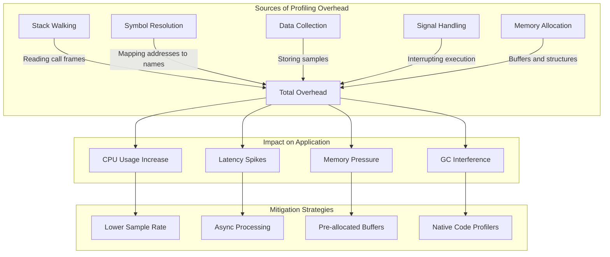
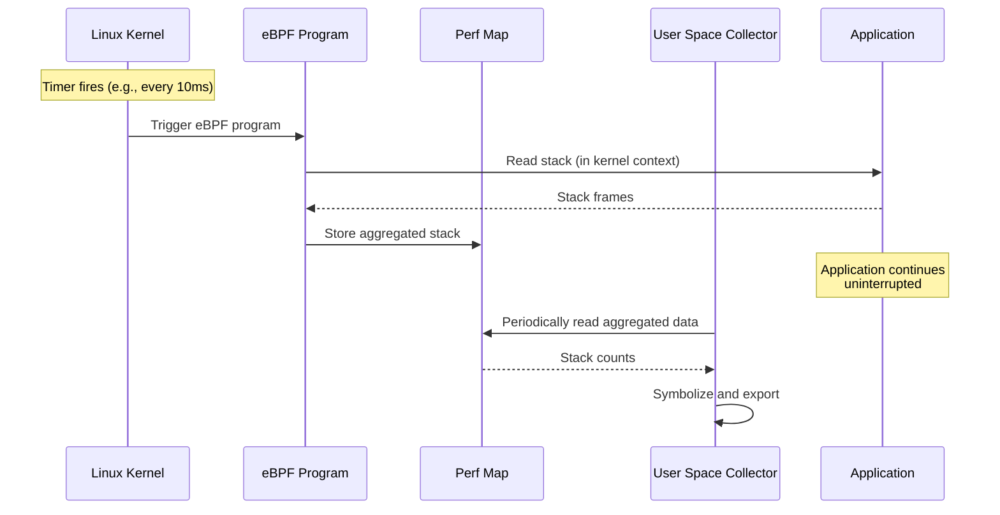
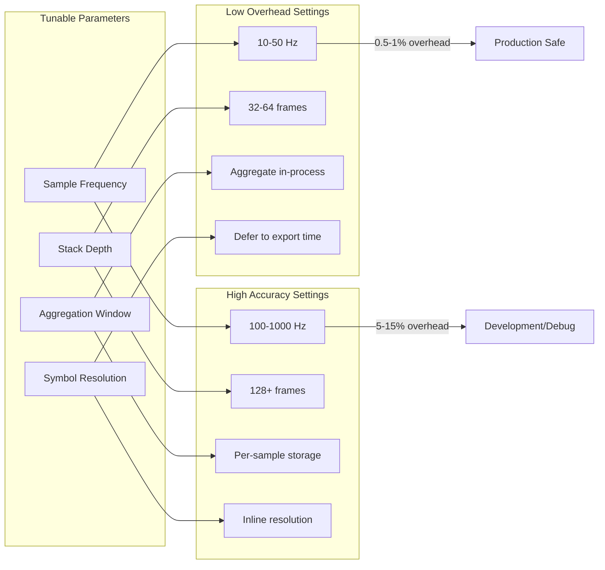

# How to Create Low-Overhead Profiling

Author: [nawazdhandala](https://github.com/nawazdhandala)

Tags: Performance, Profiling, Optimization, Production

Description: A practical guide to implementing production-safe profiling with minimal CPU and memory impact using modern techniques like eBPF and async-profiler.

---

> "You can not fix what you can not see. But you also can not fix anything if your observability tools are the bottleneck."

Profiling in production has traditionally been avoided because it slows things down. A naive profiler can add 10-50% overhead, making it unusable for live systems. But modern low-overhead profiling techniques change the game. With the right approach, you can profile continuously with less than 1% overhead.

This guide covers practical techniques for implementing profiling that you can safely run 24/7 in production.

---

## Why Overhead Matters

When profiling overhead is too high, teams avoid running it in production. This creates a blind spot: you only profile in development or staging, missing the real-world patterns that cause issues.

| Profiling Approach | Typical Overhead | Production Safe? | Data Quality |
|-------------------|------------------|------------------|--------------|
| Instrumentation-based | 10-50% | No | High (exact counts) |
| Sampling (high frequency) | 5-15% | Sometimes | Good |
| Sampling (low frequency) | 1-5% | Yes | Moderate |
| eBPF-based | 0.5-2% | Yes | Good |
| Async-profiler | 0.5-1% | Yes | Good |

The goal is to find the sweet spot: enough data to identify problems without affecting the system you are measuring.

---

## Understanding Profiling Overhead

Profiling overhead comes from several sources. Understanding them helps you minimize impact.



### Key Overhead Contributors

**Stack Walking**: Every sample requires reading the current call stack. Deep stacks (common in frameworks) cost more to capture. Some profilers walk native stacks only, others handle mixed native/managed stacks.

**Symbol Resolution**: Converting memory addresses to function names. Smart profilers defer this to post-processing or use symbol caches.

**Data Storage**: Samples need to be stored somewhere. Efficient profilers use ring buffers and aggregate on-the-fly rather than storing every raw sample.

**Signal Interrupts**: Traditional profilers use signals (SIGPROF) to interrupt execution. This is intrusive. Modern approaches use hardware performance counters or kernel-based sampling.

---

## eBPF-Based Profiling

eBPF (extended Berkeley Packet Filter) runs sandboxed programs in the Linux kernel. For profiling, it enables sampling without context switches or signals to the application.

### How eBPF Profiling Works



### eBPF Profiler Setup Example

```bash
# Install bcc tools (provides profile command)
# On Ubuntu/Debian:
sudo apt-get install bpfcc-tools linux-headers-$(uname -r)

# Profile all CPUs at 99 Hz for 30 seconds
# 99 Hz avoids lock-step with other periodic events
sudo profile-bpfcc -F 99 30

# Profile a specific process
sudo profile-bpfcc -F 99 -p $(pgrep my-app) 30

# Output as folded stacks (for flame graph generation)
sudo profile-bpfcc -F 99 -f 30 > stacks.folded
```

### eBPF Configuration for Minimal Overhead

```python
# Example: Custom eBPF profiler configuration
# using the bcc Python library

from bcc import BPF

# BPF program that samples stacks with minimal overhead
bpf_program = """
#include <uapi/linux/ptrace.h>
#include <linux/sched.h>

// Use a BPF map to aggregate stacks in-kernel
// This avoids sending every sample to user space
BPF_STACK_TRACE(stack_traces, 16384);  // Stack trace storage
BPF_HASH(counts, u64, u64);            // Aggregation map

// Sampling function called by perf event
int do_sample(struct bpf_perf_event_data *ctx) {
    u64 pid_tgid = bpf_get_current_pid_tgid();
    u32 pid = pid_tgid >> 32;

    // Optional: Filter to specific process
    // if (pid != TARGET_PID) return 0;

    // Get kernel and user stack traces
    // SKIP frames in the profiler itself
    int kernel_stack_id = stack_traces.get_stackid(
        ctx,
        BPF_F_FAST_STACK_CMP  // Use frame pointer for speed
    );
    int user_stack_id = stack_traces.get_stackid(
        ctx,
        BPF_F_FAST_STACK_CMP | BPF_F_USER_STACK
    );

    // Create composite key from both stack IDs
    u64 key = (u64)kernel_stack_id << 32 | (u32)user_stack_id;

    // Increment count for this stack combination
    u64 *val = counts.lookup(&key);
    if (val) {
        (*val)++;
    } else {
        u64 one = 1;
        counts.insert(&key, &one);
    }

    return 0;
}
"""

# Load and attach the BPF program
b = BPF(text=bpf_program)

# Attach to perf event with 99 Hz sampling
# Lower frequency = lower overhead
b.attach_perf_event(
    ev_type=BPF.PERF_TYPE_SOFTWARE,
    ev_config=BPF.PERF_COUNT_SW_CPU_CLOCK,
    fn_name="do_sample",
    sample_freq=99  # 99 Hz is standard for low overhead
)
```

### Why 99 Hz?

The sampling frequency of 99 Hz (not 100 Hz) is intentional. Using a prime-ish number avoids synchronization with other periodic system events that often run at round numbers (100 Hz, 1000 Hz). This prevents sampling bias where you always catch the same phase of periodic work.

---

## Async-Profiler for JVM Applications

Async-profiler is a low-overhead sampling profiler for Java that avoids the safe-point bias problem of traditional JVM profilers.

### Safe-Point Bias Problem

Traditional JVM profilers can only sample at safe-points, moments when the JVM is in a known state. This creates bias because:

- Hot loops without calls might never hit safe-points
- You miss the actual CPU-heavy work
- Samples cluster around method calls and allocations

Async-profiler uses AsyncGetCallTrace (when available) and native stack walking to sample anywhere.

### Async-Profiler Configuration

```bash
# Download async-profiler
# https://github.com/async-profiler/async-profiler/releases

# Basic CPU profiling with minimal overhead
# -e cpu: sample on CPU cycles
# -i 10ms: 10ms sampling interval (100 Hz)
# -f output.jfr: output as JFR format
./profiler.sh -e cpu -i 10ms -f profile.jfr -d 60 <pid>

# For production with even lower overhead
# -i 20ms reduces to 50 Hz
# --all-user avoids kernel stacks (less data)
./profiler.sh -e cpu -i 20ms --all-user -f profile.jfr -d 60 <pid>
```

### Programmatic Configuration in Java

```java
// Build-time: Add async-profiler agent to JVM args
// -agentpath:/path/to/libasyncProfiler.so=start,event=cpu,interval=10ms,file=profile.jfr

// Runtime control via the async-profiler API
import one.profiler.AsyncProfiler;

public class ProfilerConfig {

    private static final AsyncProfiler profiler = AsyncProfiler.getInstance();

    /**
     * Configure profiler for production use with minimal overhead.
     * Call this during application startup.
     */
    public static void configureForProduction() {
        // Set sampling interval: 10ms = 100 Hz
        // Higher interval = lower overhead but less precision
        String interval = "10ms";

        // Use CPU event (most common)
        // Alternatives: wall (includes sleeping), alloc (memory)
        String event = "cpu";

        // Limit stack depth to reduce overhead
        // Most useful info is in top 64 frames anyway
        int maxStackDepth = 64;

        // Start profiling with these settings
        try {
            profiler.execute(String.format(
                "start,event=%s,interval=%s,jstackdepth=%d",
                event, interval, maxStackDepth
            ));
        } catch (Exception e) {
            System.err.println("Failed to start profiler: " + e.getMessage());
        }
    }

    /**
     * Alternative: Wall-clock profiling for I/O bound applications.
     * Captures time spent waiting, not just CPU time.
     */
    public static void configureWallClock() {
        try {
            // Wall profiling with 20ms interval
            // Good for finding blocking I/O, lock contention
            profiler.execute("start,event=wall,interval=20ms,jstackdepth=64");
        } catch (Exception e) {
            System.err.println("Failed to start wall profiler: " + e.getMessage());
        }
    }

    /**
     * Stop profiling and write results.
     * Call periodically to export data without stopping collection.
     */
    public static void dumpProfile(String filename) {
        try {
            // Dump without stopping (continuous profiling)
            profiler.execute("dump,file=" + filename);
        } catch (Exception e) {
            System.err.println("Failed to dump profile: " + e.getMessage());
        }
    }
}
```

### Memory Allocation Profiling

Allocation profiling has different overhead characteristics. Each allocation is a potential sample point, so high-allocation code pays more.

```java
// Allocation profiling configuration
// Samples every N bytes allocated (not every allocation)

public static void configureAllocationProfiling() {
    try {
        // Sample every 512KB of allocations
        // Higher value = lower overhead, coarser data
        // Lower value = higher overhead, finer data
        String allocInterval = "524288";  // 512 * 1024 bytes

        profiler.execute(String.format(
            "start,event=alloc,alloc=%s,jstackdepth=64",
            allocInterval
        ));
    } catch (Exception e) {
        System.err.println("Failed to start alloc profiler: " + e.getMessage());
    }
}
```

---

## Overhead vs Accuracy Trade-offs

Every profiling decision involves trade-offs. Here is how different parameters affect overhead and data quality.



### Sample Frequency Trade-offs

| Frequency | Overhead | Use Case | Statistical Accuracy |
|-----------|----------|----------|---------------------|
| 10 Hz | Very Low (~0.1%) | Always-on baseline | Low (need longer collection) |
| 50 Hz | Low (~0.5%) | Production continuous | Moderate |
| 99 Hz | Low (~1%) | Production standard | Good |
| 500 Hz | Moderate (~3%) | Incident investigation | Very Good |
| 1000 Hz | High (~5-10%) | Short-term debugging | Excellent |

### Stack Depth Trade-offs

Deeper stacks cost more to capture but provide more context. Modern frameworks often have deep call stacks (50+ frames), but the actionable information is usually in the top portion.

```python
# Python example: Configuring py-spy for production

import subprocess

def start_profiler_low_overhead(pid: int, output_file: str):
    """
    Start py-spy with production-safe settings.

    Args:
        pid: Process ID to profile
        output_file: Path for output SVG flame graph
    """
    subprocess.Popen([
        "py-spy", "record",
        "--pid", str(pid),
        "--output", output_file,
        "--rate", "50",      # 50 Hz sampling (low overhead)
        "--duration", "60",   # 60 seconds
        "--native",           # Include native frames
        "--subprocesses",     # Include child processes
        "--idle",             # Include idle time (wall clock)
    ])

def start_profiler_high_accuracy(pid: int, output_file: str):
    """
    Start py-spy with higher accuracy for debugging.
    Only use for short periods during investigation.
    """
    subprocess.Popen([
        "py-spy", "record",
        "--pid", str(pid),
        "--output", output_file,
        "--rate", "500",      # 500 Hz (higher overhead)
        "--duration", "30",   # Keep it short
        "--native",
    ])
```

---

## Node.js Low-Overhead Profiling

Node.js applications need special consideration because of the single-threaded event loop.

### V8 CPU Profiler Configuration

```javascript
// Low-overhead V8 profiler configuration
// Uses the built-in inspector protocol

const inspector = require('inspector');
const fs = require('fs');

class LowOverheadProfiler {
    constructor() {
        this.session = new inspector.Session();
        this.session.connect();
    }

    /**
     * Start CPU profiling with production-safe settings.
     *
     * The V8 profiler uses sampling internally. The key to low overhead
     * is the sampling interval - higher interval = lower overhead.
     */
    startCpuProfile(intervalMicros = 10000) {
        // 10000 microseconds = 10ms = 100 Hz
        // For lower overhead, use 20000 (50 Hz)

        return new Promise((resolve, reject) => {
            // Set sampling interval before starting
            this.session.post('Profiler.setSamplingInterval', {
                interval: intervalMicros
            }, (err) => {
                if (err) return reject(err);

                this.session.post('Profiler.enable', {}, (err) => {
                    if (err) return reject(err);

                    this.session.post('Profiler.start', {}, (err) => {
                        if (err) return reject(err);
                        resolve();
                    });
                });
            });
        });
    }

    /**
     * Stop profiling and return the profile data.
     */
    stopCpuProfile() {
        return new Promise((resolve, reject) => {
            this.session.post('Profiler.stop', (err, { profile }) => {
                if (err) return reject(err);

                this.session.post('Profiler.disable', () => {
                    resolve(profile);
                });
            });
        });
    }

    /**
     * Save profile in a format compatible with Chrome DevTools.
     */
    async saveProfile(filename) {
        const profile = await this.stopCpuProfile();
        fs.writeFileSync(filename, JSON.stringify(profile));
    }
}

// Usage example for continuous profiling
async function continuousProfile() {
    const profiler = new LowOverheadProfiler();

    // Start with 50 Hz sampling for very low overhead
    await profiler.startCpuProfile(20000);

    // Dump profile every 5 minutes
    setInterval(async () => {
        const timestamp = Date.now();
        await profiler.saveProfile(`profile-${timestamp}.cpuprofile`);

        // Restart profiling (profiles are single-shot in V8)
        await profiler.startCpuProfile(20000);
    }, 5 * 60 * 1000);
}
```

### 0x: Production-Ready Node.js Profiling

```bash
# 0x is a flame graph tool for Node.js with low overhead

# Install globally
npm install -g 0x

# Profile with default settings (reasonable overhead)
0x my-app.js

# Lower overhead with reduced sample rate
0x --collect-only --output-dir ./profiles my-app.js

# For already running process, use the kernel profiler
# This has even lower overhead than V8 profiler
0x --kernel-tracing -p <pid>
```

---

## Go Low-Overhead Profiling

Go has excellent built-in profiling support through pprof with naturally low overhead.

```go
package main

import (
    "log"
    "net/http"
    _ "net/http/pprof" // Register pprof handlers
    "runtime"
    "runtime/pprof"
    "os"
    "time"
)

func main() {
    // Configure CPU profiling rate
    // Default is 100 Hz, which is already production-safe
    // For even lower overhead, reduce to 50 Hz
    runtime.SetCPUProfileRate(50)

    // Configure memory profiling rate
    // Default samples every 512KB of allocations
    // Increase for lower overhead (e.g., every 1MB)
    runtime.MemProfileRate = 1024 * 1024

    // Start pprof HTTP server on a separate port
    // This allows on-demand profiling without always-on overhead
    go func() {
        log.Println("pprof server starting on :6060")
        log.Println(http.ListenAndServe("localhost:6060", nil))
    }()

    // Your application code here
    runApplication()
}

// ContinuousProfiler collects profiles periodically
// and writes them to disk for later analysis
type ContinuousProfiler struct {
    outputDir string
    interval  time.Duration
    duration  time.Duration
}

func NewContinuousProfiler(outputDir string) *ContinuousProfiler {
    return &ContinuousProfiler{
        outputDir: outputDir,
        interval:  5 * time.Minute,  // Collect every 5 minutes
        duration:  30 * time.Second, // Each profile is 30 seconds
    }
}

func (p *ContinuousProfiler) Start() {
    go func() {
        for {
            p.collectCPUProfile()
            time.Sleep(p.interval - p.duration)
        }
    }()

    // Memory profiles are snapshots, less overhead
    go func() {
        for {
            p.collectMemoryProfile()
            time.Sleep(p.interval)
        }
    }()
}

func (p *ContinuousProfiler) collectCPUProfile() {
    filename := fmt.Sprintf("%s/cpu-%d.pprof",
        p.outputDir, time.Now().Unix())

    f, err := os.Create(filename)
    if err != nil {
        log.Printf("Could not create CPU profile: %v", err)
        return
    }
    defer f.Close()

    if err := pprof.StartCPUProfile(f); err != nil {
        log.Printf("Could not start CPU profile: %v", err)
        return
    }

    time.Sleep(p.duration)
    pprof.StopCPUProfile()
}

func (p *ContinuousProfiler) collectMemoryProfile() {
    filename := fmt.Sprintf("%s/mem-%d.pprof",
        p.outputDir, time.Now().Unix())

    f, err := os.Create(filename)
    if err != nil {
        log.Printf("Could not create memory profile: %v", err)
        return
    }
    defer f.Close()

    // Force GC before taking heap snapshot
    // This gives a cleaner view of live objects
    runtime.GC()

    if err := pprof.WriteHeapProfile(f); err != nil {
        log.Printf("Could not write memory profile: %v", err)
    }
}
```

---

## Measuring Profiler Overhead

Do not trust documentation. Measure the actual overhead in your environment.

```python
#!/usr/bin/env python3
"""
Benchmark script to measure profiler overhead.
Run your workload with and without profiling, compare results.
"""

import time
import statistics
import subprocess
import sys

def run_benchmark(command: list, iterations: int = 5) -> dict:
    """
    Run a command multiple times and collect timing statistics.

    Args:
        command: Command to run as list of strings
        iterations: Number of runs for statistical significance

    Returns:
        Dictionary with mean, stddev, min, max times
    """
    times = []

    for i in range(iterations):
        start = time.perf_counter()
        result = subprocess.run(command, capture_output=True)
        end = time.perf_counter()

        if result.returncode != 0:
            print(f"Warning: Run {i} failed with code {result.returncode}")
            continue

        times.append(end - start)

    if not times:
        return {"error": "All runs failed"}

    return {
        "mean": statistics.mean(times),
        "stddev": statistics.stdev(times) if len(times) > 1 else 0,
        "min": min(times),
        "max": max(times),
        "samples": len(times)
    }

def measure_overhead():
    """
    Compare execution time with and without profiling.
    """
    # Your benchmark command (replace with your actual workload)
    base_command = ["python", "your_benchmark.py"]

    # Run without profiling
    print("Running baseline (no profiling)...")
    baseline = run_benchmark(base_command)
    print(f"  Mean: {baseline['mean']:.3f}s")

    # Run with py-spy at different frequencies
    for freq in [10, 50, 100, 500]:
        print(f"\nRunning with py-spy at {freq} Hz...")

        # Start py-spy in background, then run benchmark
        # In real usage, you would attach to an already-running process
        profiled_command = [
            "py-spy", "record",
            "--rate", str(freq),
            "--output", f"/dev/null",
            "--",
        ] + base_command

        result = run_benchmark(profiled_command)

        overhead_pct = ((result['mean'] - baseline['mean'])
                       / baseline['mean'] * 100)

        print(f"  Mean: {result['mean']:.3f}s")
        print(f"  Overhead: {overhead_pct:.1f}%")

if __name__ == "__main__":
    measure_overhead()
```

---

## Production Deployment Checklist

Before enabling profiling in production, verify these items:

### Pre-Deployment

- [ ] Measure overhead in staging with production-like load
- [ ] Verify profiler does not interfere with application signals
- [ ] Test graceful degradation if profiler fails
- [ ] Ensure profile data storage does not fill disk
- [ ] Set up retention policy for profile files

### Configuration

- [ ] Use sampling frequency of 100 Hz or lower (10ms+ interval)
- [ ] Limit stack depth to 64 frames unless deeper needed
- [ ] Aggregate data in-process when possible
- [ ] Defer symbol resolution to export/analysis time
- [ ] Use ring buffers to bound memory usage

### Monitoring

- [ ] Track profiler-induced CPU overhead (should be under 1%)
- [ ] Monitor profiler memory usage
- [ ] Alert if profiler crashes or stops collecting
- [ ] Verify profiles are being exported successfully

---

## Summary

Low-overhead profiling is achievable with modern tools and careful configuration. The key principles are:

1. **Use sampling, not instrumentation**: Sampling at 100 Hz or lower adds minimal overhead
2. **Prefer kernel-based approaches**: eBPF avoids context switches and signal handling overhead
3. **Aggregate early**: Combine samples in the profiler rather than storing every raw sample
4. **Defer expensive work**: Symbol resolution and flame graph generation can happen offline
5. **Measure, do not assume**: Benchmark profiler overhead in your specific environment

With these techniques, continuous profiling becomes practical for production systems, giving you visibility into performance without compromising it.

---

**Related Reading:**
- [Basics of Profiling: Turning CPU and Memory Hotspots into Action](https://oneuptime.com/blog/post/2025-09-09-basics-of-profiling/view)
- [Node.js Profiling with V8 Inspector and Chrome DevTools](https://oneuptime.com/blog/post/2026-01-06-nodejs-profiling-v8-inspector-chrome-devtools/view)
- [Node.js Memory Optimization: Prevent Leaks](https://oneuptime.com/blog/post/2026-01-06-nodejs-memory-optimization-prevent-leaks/view)

---

*Need to correlate profiles with traces, metrics, and logs? OneUptime provides unified observability that helps you understand not just where problems occur, but why.*
