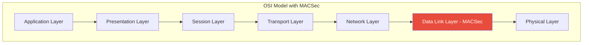
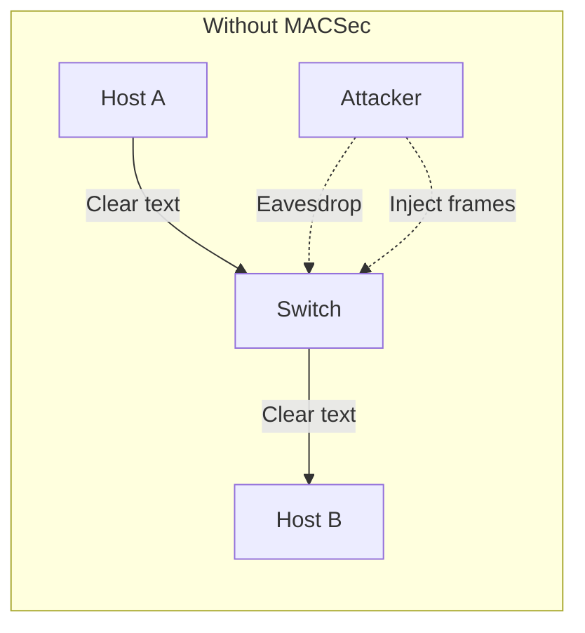
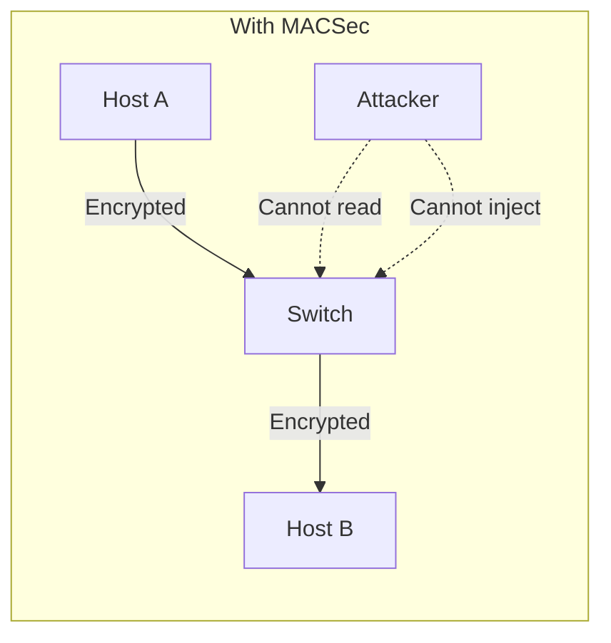
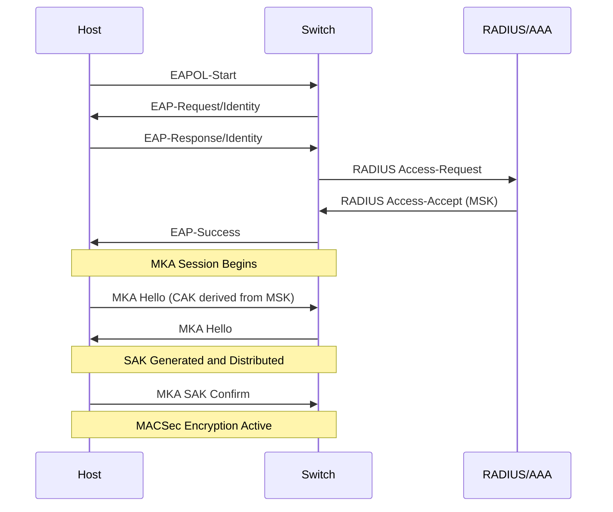
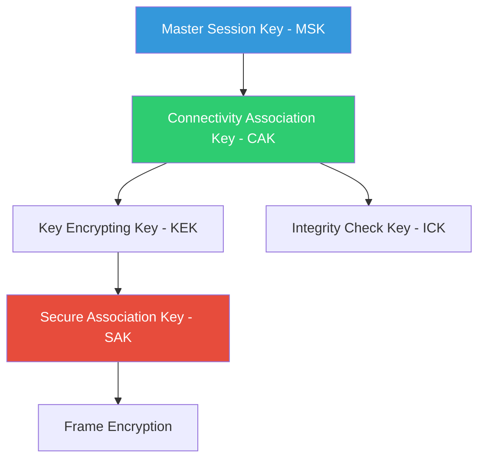
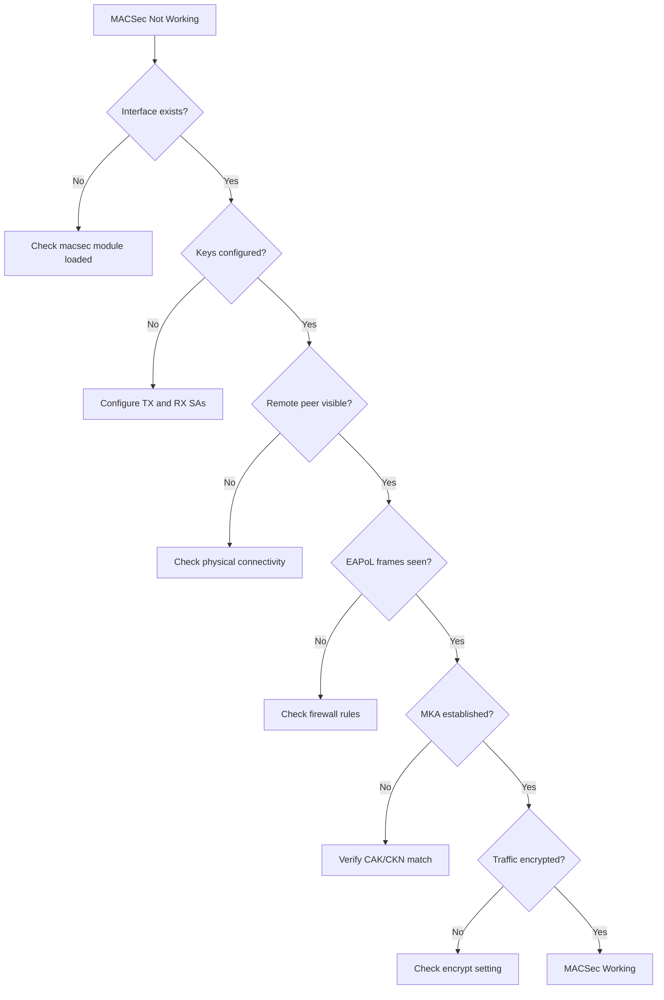

# How to Create MACSec Encryption

Author: [nawazdhandala](https://github.com/nawazdhandala)

Tags: MACSec, Networking, Security, Encryption

Description: A comprehensive guide to implementing MACSec (Media Access Control Security) encryption for Layer 2 network protection. Learn how to configure MACSec on Linux systems, network switches, and understand the protocol mechanics with practical examples.

---

Network security often focuses on Layer 3 and above, but what about the traffic moving between your switches before it ever hits an IP stack? MACSec (Media Access Control Security) fills this gap by encrypting Ethernet frames at Layer 2, providing hop-by-hop encryption that protects data from the moment it leaves a network interface until it reaches the next device.

This guide walks through what MACSec is, why you need it, and exactly how to implement it on Linux systems and network infrastructure.

---

## Table of Contents

1. What is MACSec
2. Why MACSec Matters
3. MACSec vs Other Encryption Methods
4. How MACSec Works
5. Prerequisites and Requirements
6. Configuring MACSec on Linux
7. MACSec with wpa_supplicant and MKA
8. Configuring MACSec on Cisco Switches
9. Configuring MACSec on Juniper Devices
10. Testing and Verification
11. Troubleshooting Common Issues
12. Performance Considerations
13. Best Practices

---

## 1. What is MACSec

MACSec, defined in IEEE 802.1AE, is a Layer 2 security standard that provides:

- **Confidentiality**: Encrypts the payload of Ethernet frames
- **Integrity**: Ensures frames have not been tampered with
- **Replay protection**: Prevents attackers from capturing and replaying frames
- **Origin authentication**: Verifies the frame came from a legitimate source

Unlike IPsec or TLS, MACSec operates at the data link layer, encrypting everything above the Ethernet header.



### MACSec Frame Structure

A MACSec-protected frame includes additional headers and a trailer:

| Component | Size | Purpose |
|-----------|------|---------|
| Destination MAC | 6 bytes | Destination address (unencrypted) |
| Source MAC | 6 bytes | Source address (unencrypted) |
| SecTAG | 8-16 bytes | Security tag with key identifiers |
| Encrypted Data | Variable | Original payload (encrypted) |
| ICV | 8-16 bytes | Integrity Check Value |

---

## 2. Why MACSec Matters

### Threats MACSec Addresses





**Key scenarios where MACSec is essential:**

1. **Data center interconnects**: Protect traffic between switches and servers
2. **Campus networks**: Secure connections from endpoints to access switches
3. **Colocation facilities**: Encrypt traffic on shared infrastructure
4. **Financial institutions**: Meet regulatory requirements for data-in-transit encryption
5. **Healthcare networks**: Protect PHI at the network layer

### Compliance Considerations

Many security frameworks now recommend or require Layer 2 encryption:

- PCI DSS 4.0 encourages encryption of cardholder data at all layers
- HIPAA requires appropriate safeguards for PHI in transit
- Zero Trust architectures assume the network is hostile

---

## 3. MACSec vs Other Encryption Methods

| Feature | MACSec | IPsec | TLS/SSL |
|---------|--------|-------|---------|
| OSI Layer | 2 | 3 | 4-7 |
| Encrypts | Ethernet frames | IP packets | Application data |
| Scope | Hop-by-hop | End-to-end | End-to-end |
| Protocol agnostic | Yes | IP only | TCP only |
| Hardware offload | Common | Some | Some |
| Key management | MKA/802.1X | IKE | PKI/Certificates |

### When to Use MACSec

**Choose MACSec when:**
- You need to protect all Layer 2 traffic (ARP, DHCP, etc.)
- Hardware acceleration is available
- You control both endpoints of each link
- Compliance requires network-layer encryption

**Consider alternatives when:**
- You need end-to-end encryption across multiple hops
- Endpoints do not support MACSec
- Traffic crosses untrusted Layer 3 boundaries

---

## 4. How MACSec Works

### Key Agreement with MKA

MACSec Key Agreement (MKA) protocol, defined in IEEE 802.1X-2010, handles:

1. Peer discovery and authentication
2. Key derivation and distribution
3. Cipher suite negotiation
4. Key rotation



### Key Hierarchy



**Key descriptions:**

- **MSK (Master Session Key)**: Generated during 802.1X authentication
- **CAK (Connectivity Association Key)**: Derived from MSK, shared between MKA peers
- **KEK (Key Encrypting Key)**: Protects SAK distribution
- **ICK (Integrity Check Key)**: Authenticates MKA messages
- **SAK (Secure Association Key)**: Actually encrypts the data frames

---

## 5. Prerequisites and Requirements

### Hardware Requirements

MACSec requires hardware support for reasonable performance. Check your hardware:

```bash
# Check if your NIC supports MACSec offload
ethtool -k eth0 | grep macsec
```

Common NICs with MACSec support:
- Intel X710/XL710 series
- Intel E810 series
- Mellanox ConnectX-5 and later
- Broadcom BCM57xxx series

### Software Requirements

For Linux systems:

```bash
# Check kernel version (4.6+ required for MACSec)
uname -r

# Install required packages (Debian/Ubuntu)
sudo apt-get update
sudo apt-get install iproute2 wpasupplicant

# Install required packages (RHEL/CentOS)
sudo dnf install iproute wpa_supplicant
```

### Network Requirements

- All devices in the MACSec path must support it
- MTU consideration: MACSec adds 32 bytes overhead
- Time synchronization recommended for replay protection

---

## 6. Configuring MACSec on Linux

### Method 1: Using ip macsec (Static Keys)

This approach uses pre-shared keys without MKA. Useful for testing or simple point-to-point links.

#### Step 1: Create the MACSec Interface

```bash
# On Host A (192.168.1.10)
# Create MACSec interface on top of eth0
sudo ip link add link eth0 macsec0 type macsec sci 1 encrypt on

# View the created interface
ip link show macsec0
```

#### Step 2: Add Transmit and Receive Keys

```bash
# Generate a 128-bit key (32 hex characters)
# In production, use a secure random generator
KEY="0123456789abcdef0123456789abcdef"

# On Host A: Configure transmit secure association
sudo ip macsec add macsec0 tx sa 0 pn 1 on key 00 $KEY

# On Host A: Configure receive secure channel and association
# SCI format: MAC address (12 hex) + port (4 hex)
sudo ip macsec add macsec0 rx sci 001122334456 port 1
sudo ip macsec add macsec0 rx sci 001122334456 port 1 sa 0 pn 1 on key 00 $KEY
```

#### Step 3: Bring Up the Interface and Assign IP

```bash
# Bring up the MACSec interface
sudo ip link set macsec0 up

# Assign IP address
sudo ip addr add 10.0.0.1/24 dev macsec0
```

#### Step 4: Repeat on Host B with Swapped SCIs

```bash
# On Host B (192.168.1.20)
sudo ip link add link eth0 macsec0 type macsec sci 2 encrypt on

# Same key as Host A
KEY="0123456789abcdef0123456789abcdef"

# Transmit SA
sudo ip macsec add macsec0 tx sa 0 pn 1 on key 00 $KEY

# Receive SA (with Host A's SCI)
sudo ip macsec add macsec0 rx sci 001122334455 port 1
sudo ip macsec add macsec0 rx sci 001122334455 port 1 sa 0 pn 1 on key 00 $KEY

# Bring up and assign IP
sudo ip link set macsec0 up
sudo ip addr add 10.0.0.2/24 dev macsec0
```

### Complete Setup Script

Here is a reusable script for setting up MACSec:

```bash
#!/bin/bash
# macsec_setup.sh - Configure MACSec between two Linux hosts

set -e

# Configuration
PHYSICAL_IF="${1:-eth0}"
MACSEC_IF="macsec0"
LOCAL_SCI="${2}"
REMOTE_SCI="${3}"
LOCAL_IP="${4}"
REMOTE_MAC="${5}"
PSK="${6:-0123456789abcdef0123456789abcdef}"

# Validate inputs
if [ -z "$LOCAL_SCI" ] || [ -z "$REMOTE_SCI" ] || [ -z "$LOCAL_IP" ]; then
    echo "Usage: $0 <physical_if> <local_sci> <remote_sci> <local_ip> <remote_mac> [psk]"
    echo "Example: $0 eth0 1 2 10.0.0.1/24 00:11:22:33:44:56 mykey123..."
    exit 1
fi

echo "Setting up MACSec on $PHYSICAL_IF..."

# Remove existing MACSec interface if present
ip link show $MACSEC_IF &>/dev/null && sudo ip link del $MACSEC_IF

# Create MACSec interface
sudo ip link add link $PHYSICAL_IF $MACSEC_IF type macsec sci $LOCAL_SCI encrypt on

# Configure transmit secure association
sudo ip macsec add $MACSEC_IF tx sa 0 pn 1 on key 00 $PSK

# Configure receive secure channel and association
sudo ip macsec add $MACSEC_IF rx sci $REMOTE_MAC port 1
sudo ip macsec add $MACSEC_IF rx sci $REMOTE_MAC port 1 sa 0 pn 1 on key 00 $PSK

# Bring up interface
sudo ip link set $MACSEC_IF up
sudo ip addr add $LOCAL_IP dev $MACSEC_IF

echo "MACSec interface $MACSEC_IF is up with IP $LOCAL_IP"
echo "Verify with: ip macsec show"
```

### Viewing MACSec Status

```bash
# Show MACSec configuration
ip macsec show

# Example output:
# 8: macsec0: protect on validate strict sc off sa off encrypt on send_sci on
#     cipher suite: GCM-AES-128, using ICV length 16
#     TXSC: 001122334455001 on SA 0
#         0: PN 1234, state on, key 0123456789abcdef0123456789abcdef
#     RXSC: 001122334456001, state on
#         0: PN 1234, state on, key 0123456789abcdef0123456789abcdef

# Show interface statistics
ip -s link show macsec0
```

---

## 7. MACSec with wpa_supplicant and MKA

For production environments, use MKA (MACSec Key Agreement) with wpa_supplicant for dynamic key management.

### Configuration File

Create `/etc/wpa_supplicant/wpa_supplicant-macsec.conf`:

```conf
# wpa_supplicant configuration for MACSec with MKA
ctrl_interface=/var/run/wpa_supplicant
ctrl_interface_group=wheel
eapol_version=3

network={
    key_mgmt=IEEE8021X
    eap=TLS

    # Identity for 802.1X authentication
    identity="host@example.com"

    # Certificate-based authentication
    ca_cert="/etc/pki/tls/certs/ca-bundle.crt"
    client_cert="/etc/pki/tls/certs/client.crt"
    private_key="/etc/pki/tls/private/client.key"
    private_key_passwd="your_key_password"

    # Enable MACSec
    macsec_policy=1

    # MKA configuration
    # 0 = MKA not required, 1 = MKA required
    macsec_integ_only=0

    # Cipher suite: 0 = GCM-AES-128, 1 = GCM-AES-256
    macsec_ciphersuite=0

    # Port for MKA
    macsec_port=1

    # Replay protection window
    macsec_replay_protect=1
    macsec_replay_window=0
}
```

### Starting wpa_supplicant

```bash
# Start wpa_supplicant for MACSec
sudo wpa_supplicant -i eth0 -c /etc/wpa_supplicant/wpa_supplicant-macsec.conf -D macsec_linux -B

# Monitor MKA status
sudo wpa_cli -i eth0 status
```

### Pre-Shared Key (PSK) Mode

For environments without 802.1X infrastructure:

```conf
# wpa_supplicant configuration for MACSec with PSK
ctrl_interface=/var/run/wpa_supplicant
eapol_version=3

network={
    key_mgmt=NONE

    # Enable MACSec with PSK
    macsec_policy=1

    # CAK (Connectivity Association Key) - 32 hex characters for 128-bit
    mka_cak=0123456789abcdef0123456789abcdef

    # CKN (Connectivity Association Key Name) - 1-32 hex characters
    mka_ckn=0011223344556677

    # Priority (0-255, lower is higher priority)
    mka_priority=16

    # Cipher suite
    macsec_ciphersuite=0
    macsec_integ_only=0
}
```

### Systemd Service for MACSec

Create `/etc/systemd/system/macsec@.service`:

```ini
[Unit]
Description=MACSec on %i
After=network.target
Wants=network.target

[Service]
Type=simple
ExecStart=/usr/sbin/wpa_supplicant -i %i -c /etc/wpa_supplicant/wpa_supplicant-macsec-%i.conf -D macsec_linux
ExecReload=/bin/kill -HUP $MAINPID
Restart=on-failure
RestartSec=5

[Install]
WantedBy=multi-user.target
```

Enable and start:

```bash
# Enable MACSec on eth0
sudo systemctl enable macsec@eth0
sudo systemctl start macsec@eth0

# Check status
sudo systemctl status macsec@eth0
```

---

## 8. Configuring MACSec on Cisco Switches

### Cisco IOS-XE Configuration

MACSec on Cisco switches can operate in two modes: switch-to-switch (uplink) and switch-to-host (downlink).

#### Switch-to-Switch MACSec

```
! Enable MACSec globally
macsec network-link

! Configure MKA policy
mka policy MACSEC-POLICY
 macsec-cipher-suite gcm-aes-256
 key-server priority 10
 sak-rekey-interval 86400
 confidentiality-offset 0

! Configure key chain for PSK
key chain MACSEC-KEYCHAIN macsec
 key 1
  cryptographic-algorithm aes-256-cmac
  key-string 7 <encrypted-key-string>
  lifetime local 00:00:00 Jan 1 2024 infinite

! Apply to interface
interface TenGigabitEthernet1/0/1
 description MACSec Uplink to Core Switch
 macsec network-link
 mka policy MACSEC-POLICY
 mka pre-shared-key key-chain MACSEC-KEYCHAIN
 no shutdown
```

#### Switch-to-Host MACSec with 802.1X

```
! Enable 802.1X globally
dot1x system-auth-control
aaa new-model
aaa authentication dot1x default group radius

! Configure RADIUS server
radius server ISE-PRIMARY
 address ipv4 192.168.100.10 auth-port 1812 acct-port 1813
 key SecureRadiusKey

! Configure MKA policy for hosts
mka policy HOST-MACSEC
 macsec-cipher-suite gcm-aes-128
 confidentiality-offset 0
 sak-rekey-interval 3600

! Apply to access port
interface GigabitEthernet1/0/10
 description MACSec Host Port
 switchport mode access
 switchport access vlan 100
 authentication port-control auto
 dot1x pae authenticator
 mka policy HOST-MACSEC
 macsec
```

### Verification Commands

```
! Show MACSec status
show macsec summary
show macsec interface TenGigabitEthernet1/0/1

! Show MKA sessions
show mka sessions
show mka sessions interface TenGigabitEthernet1/0/1 detail

! Show statistics
show macsec statistics interface TenGigabitEthernet1/0/1
```

---

## 9. Configuring MACSec on Juniper Devices

### Junos Configuration

Juniper supports MACSec on MX, QFX, and EX series devices.

#### Static CAK/CKN Mode

```
# Configure connectivity association
set security macsec connectivity-association CA-UPLINK
set security macsec connectivity-association CA-UPLINK cipher-suite gcm-aes-256
set security macsec connectivity-association CA-UPLINK security-mode static-cak
set security macsec connectivity-association CA-UPLINK mka transmit-interval 2000
set security macsec connectivity-association CA-UPLINK mka key-server-priority 16

# Configure pre-shared key
set security macsec connectivity-association CA-UPLINK pre-shared-key ckn 0011223344556677
set security macsec connectivity-association CA-UPLINK pre-shared-key cak "$9$<encrypted-cak>"

# Apply to interface
set interfaces xe-0/0/0 unit 0 family ethernet-switching interface-mode trunk
set interfaces xe-0/0/0 ether-options 802.1ae connectivity-association CA-UPLINK
```

#### MACSec with 802.1X

```
# Configure 802.1X authentication
set protocols dot1x authenticator interface ge-0/0/10
set protocols dot1x authenticator interface ge-0/0/10 mac-radius
set protocols dot1x authenticator interface ge-0/0/10 supplicant multiple
set protocols dot1x authenticator interface ge-0/0/10 server-timeout 30
set protocols dot1x authenticator interface ge-0/0/10 transmit-period 30
set protocols dot1x authenticator interface ge-0/0/10 retries 3

# Enable MACSec on the 802.1X port
set protocols dot1x authenticator interface ge-0/0/10 eapol-block
set security macsec interfaces ge-0/0/10

# Configure RADIUS server
set access radius-server 192.168.100.10 secret "<secret>"
set access profile DOT1X-PROFILE authentication-order radius
set access profile DOT1X-PROFILE radius authentication-server 192.168.100.10
```

### Verification Commands

```
# Show MACSec connections
show security macsec connections

# Show MACSec statistics
show security macsec statistics

# Show MKA sessions
show security mka sessions

# Show interface MACSec status
show interfaces xe-0/0/0 extensive | match macsec
```

---

## 10. Testing and Verification

### Connectivity Test

```bash
# Ping over MACSec interface
ping -I macsec0 10.0.0.2

# Test throughput
iperf3 -s  # On server
iperf3 -c 10.0.0.2 -B 10.0.0.1  # On client
```

### Packet Capture Verification

Capture packets to verify encryption:

```bash
# Capture on physical interface - should see encrypted frames
sudo tcpdump -i eth0 -nn -X ether proto 0x88e5

# Example output shows encrypted payload:
# 0x0000:  001122334455 001122334456 88e5 2c00
# 0x0010:  0001 0000 0001 [encrypted data...]
# 0x0060:  [ICV...]
```

The EtherType 0x88E5 indicates MACSec frames. The payload after the SecTAG should be unintelligible encrypted data.

### MKA Session Verification

```bash
# Check wpa_supplicant status
sudo wpa_cli -i eth0 status

# Expected output:
# macsec_enabled=TRUE
# macsec_protect=TRUE
# macsec_encrypt=TRUE
# mka_secured=TRUE
```

### Linux MACSec Statistics

```bash
# View detailed MACSec statistics
ip -s macsec show

# Output includes:
# - InPktsOK: Successfully received and decrypted
# - InPktsInvalid: Failed integrity check
# - InPktsNotValid: Decryption failed
# - InPktsLate: Outside replay window
# - OutPktsProtected: Successfully encrypted and sent
```

---

## 11. Troubleshooting Common Issues

### Issue: MACSec Interface Not Coming Up

```bash
# Check kernel module
lsmod | grep macsec

# Load if missing
sudo modprobe macsec

# Verify interface creation
ip link show type macsec
```

### Issue: Packets Not Being Encrypted

```bash
# Verify encryption is enabled
ip macsec show | grep encrypt

# Should show: encrypt on

# Check that SA is active
ip macsec show | grep "state on"
```

### Issue: MKA Session Not Establishing

Check these common causes:

1. **Key mismatch**: Verify CAK and CKN match on both ends
2. **Clock skew**: MKA is time-sensitive; ensure NTP is running
3. **Interface issues**: Check physical connectivity
4. **Firewall**: Ensure EAPoL frames (0x888E) are not blocked

```bash
# Debug MKA
sudo wpa_supplicant -i eth0 -c /etc/wpa_supplicant/wpa_supplicant-macsec.conf -D macsec_linux -d

# Check for EAPoL frames
sudo tcpdump -i eth0 ether proto 0x888e
```

### Issue: Performance Degradation

```bash
# Check if hardware offload is active
ethtool -k eth0 | grep -i macsec

# If showing off, performance will be lower due to software encryption
# Verify NIC firmware supports MACSec
ethtool -i eth0
```

### Troubleshooting Flowchart



---

## 12. Performance Considerations

### Throughput Impact

MACSec encryption adds computational overhead. The impact depends on:

| Factor | Impact |
|--------|--------|
| Hardware offload | Minimal (line rate possible) |
| Software encryption | 20-50% throughput reduction |
| Frame size | Larger frames = better efficiency |
| Cipher suite | AES-256 slightly slower than AES-128 |

### MTU Considerations

MACSec adds 32 bytes of overhead:

- 8-16 bytes for SecTAG
- 16 bytes for ICV (Integrity Check Value)

```bash
# Calculate required MTU
# If you need 1500-byte payloads, set physical MTU to 1532

# Set physical interface MTU
sudo ip link set eth0 mtu 1532

# MACSec interface can now support standard 1500-byte frames
sudo ip link set macsec0 mtu 1500
```

### Key Rotation Impact

SAK rotation causes brief (sub-millisecond) interruptions. Configure rotation intervals based on:

- Security requirements (more frequent = more secure)
- Traffic volume (high volume = more frequent rotation recommended)
- Application sensitivity (stateless apps tolerate rotation better)

```bash
# View current packet numbers to estimate rotation needs
ip macsec show | grep PN
```

---

## 13. Best Practices

### Security Best Practices

1. **Use strong keys**: Generate CAKs with cryptographically secure random generators

```bash
# Generate a secure 256-bit key
openssl rand -hex 32
```

2. **Enable replay protection**: Always configure replay windows

```bash
# Set replay protection (0 = strict, no window)
sudo ip link add link eth0 macsec0 type macsec replay on window 32
```

3. **Use GCM-AES-256 when possible**: Stronger cipher with minimal performance impact if hardware supports it

4. **Implement monitoring**: Alert on MACSec failures

```bash
# Monitor for MACSec errors
watch -n 5 'ip -s macsec show | grep -E "(InPkts|OutPkts)"'
```

### Operational Best Practices

1. **Document your deployment**:
   - Record all CAK/CKN values securely
   - Map which devices connect to which
   - Note cipher suites in use

2. **Test failover scenarios**:
   - What happens when MACSec fails?
   - Do you have bypass procedures?

3. **Plan for upgrades**:
   - Key rotation procedures
   - Hardware replacement impacts
   - Firmware update requirements

4. **Use consistent configuration**:
   - Same cipher suite across all devices
   - Standardized key naming conventions
   - Automated configuration deployment

### Deployment Checklist

```markdown
## MACSec Deployment Checklist

### Pre-deployment
- [ ] Verify hardware MACSec support on all devices
- [ ] Document network topology and MACSec boundaries
- [ ] Generate and securely store all CAK/CKN pairs
- [ ] Update MTU settings to accommodate MACSec overhead
- [ ] Configure NTP on all MACSec-enabled devices

### Deployment
- [ ] Deploy MACSec configuration to all devices
- [ ] Verify MKA sessions establish successfully
- [ ] Confirm traffic is being encrypted (packet capture)
- [ ] Test connectivity and measure performance
- [ ] Document any observed issues

### Post-deployment
- [ ] Configure monitoring and alerting
- [ ] Schedule key rotation
- [ ] Train operations team on troubleshooting
- [ ] Update change management procedures
- [ ] Review and update documentation
```

---

## Summary

MACSec provides robust Layer 2 encryption that protects network traffic from the moment it leaves a host until it reaches the next hop. Key takeaways:

1. **MACSec encrypts at Layer 2**, protecting all higher-layer protocols including ARP and DHCP
2. **MKA handles key management**, providing automatic key derivation and rotation
3. **Hardware support is essential** for production deployments requiring line-rate performance
4. **Configuration varies by platform**, but the concepts remain consistent across Linux, Cisco, and Juniper
5. **Testing and monitoring** are critical for maintaining secure operations

Whether you are securing data center interconnects, protecting sensitive endpoint communications, or meeting compliance requirements, MACSec provides a foundational layer of network security that complements higher-layer encryption mechanisms.

---

*Need to monitor your MACSec-enabled infrastructure? [OneUptime](https://oneuptime.com) provides comprehensive network monitoring with alerting capabilities to ensure your encrypted links stay operational.*

---

### Related Reading

- [Why Software Engineers Don't Understand Networking](https://oneuptime.com/blog/post/2025-12-12-why-software-engineers-dont-understand-networking/view)
- [Kubernetes and Ceph Break the Cloud Cartel](https://oneuptime.com/blog/post/2025-11-03-kubernetes-and-ceph-break-the-cloud-cartel/view)
- [The Internet Must Decentralize](https://oneuptime.com/blog/post/2025-10-21-the-internet-must-decentralize/view)
