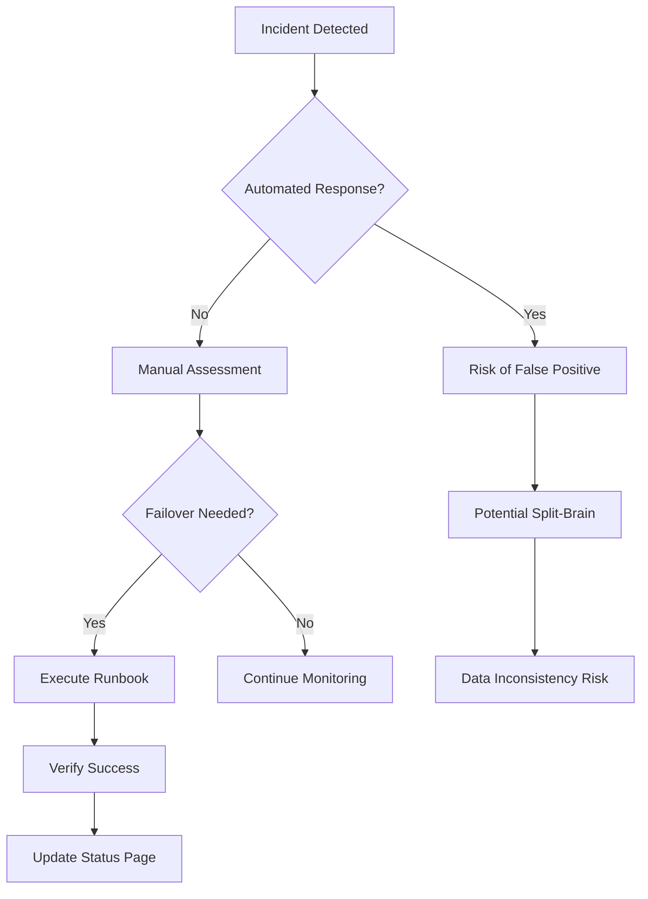
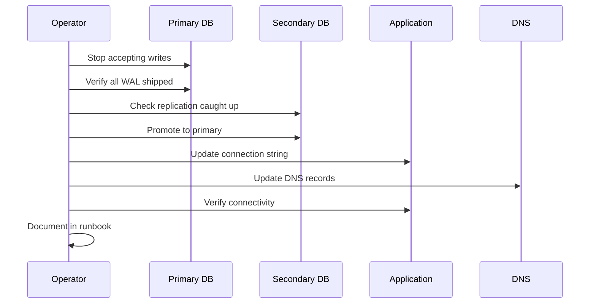
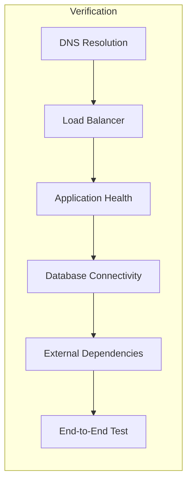
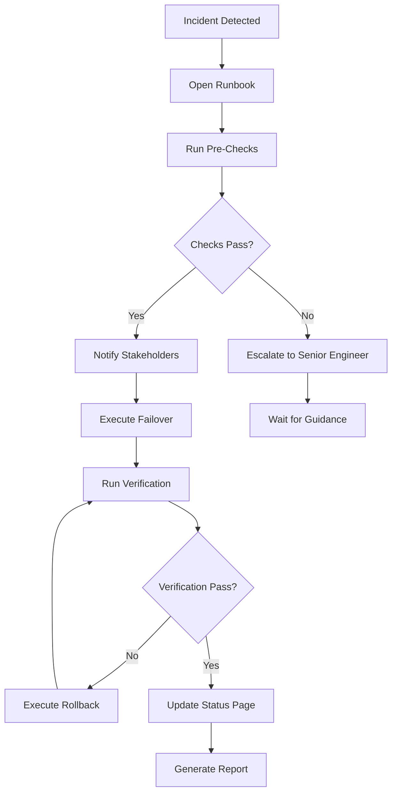

# How to Implement Manual Failover

Author: [nawazdhandala](https://github.com/nawazdhandala)

Tags: High Availability, Failover, Operations, SRE

Description: Learn how to implement safe manual failover procedures.

---

Automated failover sounds great until it triggers at 3 AM because of a network blip. Manual failover gives you control, predictability, and the confidence that a human has verified the situation before flipping the switch. This guide covers when manual failover makes sense and how to execute it safely.

## When Manual Failover Makes Sense

Manual failover is the right choice when:

- **False positives are costly** - Automatic failover during a brief network partition can cause split-brain scenarios
- **Data integrity is paramount** - You need human verification that replication is caught up
- **Regulatory requirements** - Some industries require human approval for infrastructure changes
- **Complex dependencies** - When failover affects multiple systems that need coordinated switching
- **Cost control** - Running hot standbys in active-active is expensive; manual failover to cold standbys saves money



## Pre-Failover Checks

Before initiating any failover, run through this checklist. Never skip these steps, even during an incident.

### 1. Verify the Problem

```bash
#!/bin/bash
# pre-failover-checks.sh - Run before any failover

set -e

PRIMARY_HOST="primary.example.com"
SECONDARY_HOST="secondary.example.com"

echo "=== Pre-Failover Verification ==="

# Check if primary is actually down
echo "[1/5] Checking primary health..."
PRIMARY_STATUS=$(curl -s -o /dev/null -w "%{http_code}" \
  --max-time 10 "https://${PRIMARY_HOST}/healthz" || echo "000")

if [ "$PRIMARY_STATUS" = "200" ]; then
  echo "WARNING: Primary appears healthy (HTTP $PRIMARY_STATUS)"
  echo "Are you sure failover is needed?"
  read -p "Continue anyway? (yes/no): " CONFIRM
  [ "$CONFIRM" != "yes" ] && exit 1
else
  echo "Primary is unhealthy (HTTP $PRIMARY_STATUS)"
fi

# Check secondary health
echo "[2/5] Checking secondary health..."
SECONDARY_STATUS=$(curl -s -o /dev/null -w "%{http_code}" \
  --max-time 10 "https://${SECONDARY_HOST}/healthz" || echo "000")

if [ "$SECONDARY_STATUS" != "200" ]; then
  echo "ERROR: Secondary is not healthy (HTTP $SECONDARY_STATUS)"
  echo "Cannot failover to unhealthy secondary"
  exit 1
fi
echo "Secondary is healthy"

# Check replication lag
echo "[3/5] Checking replication lag..."
LAG_SECONDS=$(psql -h "$SECONDARY_HOST" -U replicator -d postgres -t -c \
  "SELECT EXTRACT(EPOCH FROM (now() - pg_last_xact_replay_timestamp()))::int;")

if [ "$LAG_SECONDS" -gt 60 ]; then
  echo "WARNING: Replication lag is ${LAG_SECONDS}s"
  echo "Data loss of up to ${LAG_SECONDS} seconds is possible"
  read -p "Accept data loss? (yes/no): " CONFIRM
  [ "$CONFIRM" != "yes" ] && exit 1
else
  echo "Replication lag: ${LAG_SECONDS}s (acceptable)"
fi

# Check disk space on secondary
echo "[4/5] Checking secondary disk space..."
DISK_USAGE=$(ssh "$SECONDARY_HOST" "df -h /data | tail -1 | awk '{print \$5}' | tr -d '%'")

if [ "$DISK_USAGE" -gt 80 ]; then
  echo "WARNING: Secondary disk usage is ${DISK_USAGE}%"
fi

# Verify DNS TTL
echo "[5/5] Checking DNS TTL..."
TTL=$(dig +noall +answer "$PRIMARY_HOST" | awk '{print $2}')
echo "Current DNS TTL: ${TTL}s"
echo "Traffic will take up to ${TTL}s to shift after DNS change"

echo ""
echo "=== Pre-flight checks complete ==="
echo "Ready to proceed with failover"
```

### 2. Notify Stakeholders

Before making changes, ensure the right people know:

```bash
#!/bin/bash
# notify-failover.sh - Send notifications before failover

SLACK_WEBHOOK="https://hooks.slack.com/services/XXX/YYY/ZZZ"
PAGERDUTY_KEY="your-integration-key"

# Notify Slack
curl -X POST "$SLACK_WEBHOOK" \
  -H "Content-Type: application/json" \
  -d '{
    "channel": "#incidents",
    "username": "Failover Bot",
    "text": ":warning: MANUAL FAILOVER INITIATED",
    "attachments": [{
      "color": "warning",
      "fields": [
        {"title": "Operator", "value": "'"$(whoami)"'", "short": true},
        {"title": "Time", "value": "'"$(date -u +%Y-%m-%dT%H:%M:%SZ)"'", "short": true},
        {"title": "From", "value": "primary.example.com", "short": true},
        {"title": "To", "value": "secondary.example.com", "short": true}
      ]
    }]
  }'

# Create PagerDuty incident
curl -X POST "https://events.pagerduty.com/v2/enqueue" \
  -H "Content-Type: application/json" \
  -d '{
    "routing_key": "'"$PAGERDUTY_KEY"'",
    "event_action": "trigger",
    "payload": {
      "summary": "Manual failover initiated by '"$(whoami)"'",
      "severity": "warning",
      "source": "failover-script"
    }
  }'
```

## Step-by-Step Failover Procedures

### Database Failover (PostgreSQL)



```bash
#!/bin/bash
# database-failover.sh - PostgreSQL failover procedure

set -e

PRIMARY_HOST="pg-primary.example.com"
SECONDARY_HOST="pg-secondary.example.com"
APP_CONFIG_PATH="/etc/myapp/database.yml"

echo "=== PostgreSQL Failover Procedure ==="
echo "Timestamp: $(date -u +%Y-%m-%dT%H:%M:%SZ)"
echo "Operator: $(whoami)"
echo ""

# Step 1: Stop accepting new connections on primary
echo "[Step 1/7] Stopping new connections on primary..."
psql -h "$PRIMARY_HOST" -U postgres -c \
  "ALTER SYSTEM SET max_connections = 0;"
psql -h "$PRIMARY_HOST" -U postgres -c \
  "SELECT pg_reload_conf();"

# Step 2: Wait for active transactions to complete
echo "[Step 2/7] Waiting for active transactions..."
ACTIVE_CONNECTIONS=1
TIMEOUT=60
ELAPSED=0

while [ "$ACTIVE_CONNECTIONS" -gt 0 ] && [ "$ELAPSED" -lt "$TIMEOUT" ]; do
  ACTIVE_CONNECTIONS=$(psql -h "$PRIMARY_HOST" -U postgres -t -c \
    "SELECT count(*) FROM pg_stat_activity WHERE state = 'active' AND pid <> pg_backend_pid();")
  echo "Active connections: $ACTIVE_CONNECTIONS"
  sleep 5
  ELAPSED=$((ELAPSED + 5))
done

if [ "$ACTIVE_CONNECTIONS" -gt 0 ]; then
  echo "WARNING: $ACTIVE_CONNECTIONS connections still active after ${TIMEOUT}s"
  read -p "Force disconnect? (yes/no): " CONFIRM
  if [ "$CONFIRM" = "yes" ]; then
    psql -h "$PRIMARY_HOST" -U postgres -c \
      "SELECT pg_terminate_backend(pid) FROM pg_stat_activity WHERE pid <> pg_backend_pid();"
  fi
fi

# Step 3: Verify all WAL has been shipped
echo "[Step 3/7] Verifying WAL replication..."
PRIMARY_LSN=$(psql -h "$PRIMARY_HOST" -U postgres -t -c "SELECT pg_current_wal_lsn();")
SECONDARY_LSN=$(psql -h "$SECONDARY_HOST" -U postgres -t -c "SELECT pg_last_wal_replay_lsn();")

echo "Primary LSN:   $PRIMARY_LSN"
echo "Secondary LSN: $SECONDARY_LSN"

if [ "$PRIMARY_LSN" != "$SECONDARY_LSN" ]; then
  echo "Waiting for secondary to catch up..."
  sleep 10
  SECONDARY_LSN=$(psql -h "$SECONDARY_HOST" -U postgres -t -c "SELECT pg_last_wal_replay_lsn();")

  if [ "$PRIMARY_LSN" != "$SECONDARY_LSN" ]; then
    echo "ERROR: Secondary has not caught up"
    echo "Primary:   $PRIMARY_LSN"
    echo "Secondary: $SECONDARY_LSN"
    read -p "Proceed with potential data loss? (yes/no): " CONFIRM
    [ "$CONFIRM" != "yes" ] && exit 1
  fi
fi

# Step 4: Promote secondary
echo "[Step 4/7] Promoting secondary to primary..."
psql -h "$SECONDARY_HOST" -U postgres -c "SELECT pg_promote();"

# Verify promotion
sleep 5
IS_RECOVERY=$(psql -h "$SECONDARY_HOST" -U postgres -t -c "SELECT pg_is_in_recovery();")
if [ "$(echo $IS_RECOVERY | tr -d ' ')" = "f" ]; then
  echo "Secondary successfully promoted"
else
  echo "ERROR: Promotion failed - still in recovery mode"
  exit 1
fi

# Step 5: Update application configuration
echo "[Step 5/7] Updating application configuration..."
sed -i "s/host: $PRIMARY_HOST/host: $SECONDARY_HOST/g" "$APP_CONFIG_PATH"

# Step 6: Restart application services
echo "[Step 6/7] Restarting application services..."
systemctl restart myapp

# Step 7: Verify connectivity
echo "[Step 7/7] Verifying application connectivity..."
sleep 10
APP_STATUS=$(curl -s -o /dev/null -w "%{http_code}" "http://localhost:8080/healthz")

if [ "$APP_STATUS" = "200" ]; then
  echo "SUCCESS: Application is healthy"
else
  echo "ERROR: Application health check failed (HTTP $APP_STATUS)"
  exit 1
fi

echo ""
echo "=== Failover Complete ==="
echo "New primary: $SECONDARY_HOST"
echo "Remember to:"
echo "  1. Update DNS if needed"
echo "  2. Update monitoring"
echo "  3. Plan for rebuilding old primary as new secondary"
```

### Kubernetes Workload Failover

For Kubernetes deployments across clusters:

```yaml
# failover-job.yaml - Kubernetes failover job
apiVersion: batch/v1
kind: Job
metadata:
  name: manual-failover
  namespace: operations
spec:
  ttlSecondsAfterFinished: 3600
  template:
    spec:
      serviceAccountName: failover-operator
      containers:
        - name: failover
          image: bitnami/kubectl:latest
          env:
            - name: PRIMARY_CONTEXT
              value: "cluster-east"
            - name: SECONDARY_CONTEXT
              value: "cluster-west"
            - name: NAMESPACE
              value: "production"
          command:
            - /bin/bash
            - -c
            - |
              set -e

              echo "=== Kubernetes Failover ==="

              # Scale down primary
              echo "Scaling down primary cluster..."
              kubectl --context=$PRIMARY_CONTEXT -n $NAMESPACE \
                scale deployment --all --replicas=0

              # Scale up secondary
              echo "Scaling up secondary cluster..."
              kubectl --context=$SECONDARY_CONTEXT -n $NAMESPACE \
                scale deployment --all --replicas=3

              # Wait for rollout
              echo "Waiting for secondary rollout..."
              kubectl --context=$SECONDARY_CONTEXT -n $NAMESPACE \
                rollout status deployment --timeout=300s

              # Verify pods are running
              echo "Verifying pods..."
              kubectl --context=$SECONDARY_CONTEXT -n $NAMESPACE \
                get pods -o wide

              echo "Failover complete"
      restartPolicy: Never
  backoffLimit: 0
```

### DNS Failover

```bash
#!/bin/bash
# dns-failover.sh - Update DNS records for failover

set -e

# Configuration
CLOUDFLARE_TOKEN="${CLOUDFLARE_API_TOKEN}"
ZONE_ID="your-zone-id"
RECORD_NAME="app.example.com"
NEW_IP="203.0.113.50"  # Secondary cluster IP

echo "=== DNS Failover ==="

# Get current record
RECORD_INFO=$(curl -s -X GET \
  "https://api.cloudflare.com/client/v4/zones/${ZONE_ID}/dns_records?name=${RECORD_NAME}" \
  -H "Authorization: Bearer ${CLOUDFLARE_TOKEN}" \
  -H "Content-Type: application/json")

RECORD_ID=$(echo "$RECORD_INFO" | jq -r '.result[0].id')
CURRENT_IP=$(echo "$RECORD_INFO" | jq -r '.result[0].content')
CURRENT_TTL=$(echo "$RECORD_INFO" | jq -r '.result[0].ttl')

echo "Current record:"
echo "  IP:  $CURRENT_IP"
echo "  TTL: $CURRENT_TTL"
echo ""
echo "New IP: $NEW_IP"

read -p "Proceed with DNS update? (yes/no): " CONFIRM
[ "$CONFIRM" != "yes" ] && exit 0

# Update DNS record
echo "Updating DNS record..."
UPDATE_RESULT=$(curl -s -X PATCH \
  "https://api.cloudflare.com/client/v4/zones/${ZONE_ID}/dns_records/${RECORD_ID}" \
  -H "Authorization: Bearer ${CLOUDFLARE_TOKEN}" \
  -H "Content-Type: application/json" \
  --data '{
    "content": "'"$NEW_IP"'",
    "ttl": 60
  }')

SUCCESS=$(echo "$UPDATE_RESULT" | jq -r '.success')

if [ "$SUCCESS" = "true" ]; then
  echo "DNS record updated successfully"
  echo "New IP: $NEW_IP"
  echo "TTL set to 60 seconds"
  echo ""
  echo "Traffic will shift within ${CURRENT_TTL} seconds (previous TTL)"
else
  echo "ERROR: DNS update failed"
  echo "$UPDATE_RESULT" | jq '.errors'
  exit 1
fi

# Purge Cloudflare cache
echo "Purging Cloudflare cache..."
curl -s -X POST \
  "https://api.cloudflare.com/client/v4/zones/${ZONE_ID}/purge_cache" \
  -H "Authorization: Bearer ${CLOUDFLARE_TOKEN}" \
  -H "Content-Type: application/json" \
  --data '{"purge_everything":true}'

echo "Cache purged"
```

## Verification Checkpoints

After failover, verify each layer of the stack:



```bash
#!/bin/bash
# verify-failover.sh - Post-failover verification

set -e

APP_DOMAIN="app.example.com"
EXPECTED_IP="203.0.113.50"

echo "=== Post-Failover Verification ==="
echo ""

# 1. DNS Resolution
echo "[1/6] Verifying DNS resolution..."
RESOLVED_IP=$(dig +short "$APP_DOMAIN" | head -1)
if [ "$RESOLVED_IP" = "$EXPECTED_IP" ]; then
  echo "PASS: DNS resolves to $RESOLVED_IP"
else
  echo "FAIL: DNS resolves to $RESOLVED_IP (expected $EXPECTED_IP)"
  echo "  DNS propagation may still be in progress"
fi

# 2. Load Balancer Health
echo ""
echo "[2/6] Checking load balancer..."
LB_STATUS=$(curl -s -o /dev/null -w "%{http_code}" \
  --resolve "$APP_DOMAIN:443:$EXPECTED_IP" \
  "https://$APP_DOMAIN/healthz" --max-time 10)

if [ "$LB_STATUS" = "200" ]; then
  echo "PASS: Load balancer responding (HTTP $LB_STATUS)"
else
  echo "FAIL: Load balancer returned HTTP $LB_STATUS"
fi

# 3. Application Health
echo ""
echo "[3/6] Checking application health..."
HEALTH_RESPONSE=$(curl -s "https://$APP_DOMAIN/healthz")
APP_HEALTHY=$(echo "$HEALTH_RESPONSE" | jq -r '.status // "unknown"')

if [ "$APP_HEALTHY" = "healthy" ]; then
  echo "PASS: Application reports healthy"
else
  echo "FAIL: Application status: $APP_HEALTHY"
  echo "$HEALTH_RESPONSE" | jq .
fi

# 4. Database Connectivity
echo ""
echo "[4/6] Checking database from application..."
DB_CHECK=$(curl -s "https://$APP_DOMAIN/healthz/db")
DB_STATUS=$(echo "$DB_CHECK" | jq -r '.database // "unknown"')

if [ "$DB_STATUS" = "connected" ]; then
  echo "PASS: Database connectivity OK"
else
  echo "FAIL: Database status: $DB_STATUS"
fi

# 5. External Dependencies
echo ""
echo "[5/6] Checking external dependencies..."
DEPS_CHECK=$(curl -s "https://$APP_DOMAIN/healthz/dependencies")
DEPS_OK=$(echo "$DEPS_CHECK" | jq -r '.all_healthy // false')

if [ "$DEPS_OK" = "true" ]; then
  echo "PASS: All external dependencies healthy"
else
  echo "WARN: Some dependencies may be unhealthy"
  echo "$DEPS_CHECK" | jq '.services'
fi

# 6. End-to-End Test
echo ""
echo "[6/6] Running end-to-end test..."
E2E_RESULT=$(curl -s -X POST "https://$APP_DOMAIN/api/test/smoke" \
  -H "Content-Type: application/json" \
  -d '{"test": "failover-verification"}')
E2E_PASS=$(echo "$E2E_RESULT" | jq -r '.success // false')

if [ "$E2E_PASS" = "true" ]; then
  echo "PASS: End-to-end test successful"
else
  echo "FAIL: End-to-end test failed"
  echo "$E2E_RESULT" | jq .
fi

echo ""
echo "=== Verification Complete ==="
```

## Rollback Procedures

Sometimes failover makes things worse. Always have a rollback plan:

```bash
#!/bin/bash
# rollback-failover.sh - Revert to original primary

set -e

ORIGINAL_PRIMARY="pg-primary.example.com"
CURRENT_PRIMARY="pg-secondary.example.com"  # Was secondary, now primary

echo "=== Failover Rollback ==="
echo "WARNING: This will revert traffic to the original primary"
echo ""

# Check if original primary is healthy
echo "Checking original primary health..."
ORIGINAL_STATUS=$(curl -s -o /dev/null -w "%{http_code}" \
  "https://${ORIGINAL_PRIMARY}/healthz" --max-time 10 || echo "000")

if [ "$ORIGINAL_STATUS" != "200" ]; then
  echo "ERROR: Original primary is not healthy (HTTP $ORIGINAL_STATUS)"
  echo "Cannot rollback to unhealthy server"
  exit 1
fi

echo "Original primary is healthy"

# For database: Check if we need to resync
echo ""
echo "Checking data synchronization..."
CURRENT_LSN=$(psql -h "$CURRENT_PRIMARY" -U postgres -t -c \
  "SELECT pg_current_wal_lsn();")
echo "Current primary LSN: $CURRENT_LSN"

echo ""
echo "WARNING: Any writes made since failover will be on the current primary"
echo "You may need to:"
echo "  1. Stop writes to current primary"
echo "  2. Resync data to original primary"
echo "  3. Then switch traffic"
echo ""

read -p "Proceed with rollback? (yes/no): " CONFIRM
[ "$CONFIRM" != "yes" ] && exit 0

# Execute rollback steps
echo ""
echo "[Step 1/4] Updating DNS to original primary..."
./dns-failover.sh --target "$ORIGINAL_PRIMARY"

echo ""
echo "[Step 2/4] Updating application configuration..."
sed -i "s/host: $CURRENT_PRIMARY/host: $ORIGINAL_PRIMARY/g" /etc/myapp/database.yml

echo ""
echo "[Step 3/4] Restarting application..."
systemctl restart myapp

echo ""
echo "[Step 4/4] Verifying rollback..."
sleep 10
./verify-failover.sh

echo ""
echo "=== Rollback Complete ==="
echo "Traffic is now going to: $ORIGINAL_PRIMARY"
```

## Documentation Requirements

Every failover should be documented. Use this template:

```markdown
# Failover Report

## Summary
- **Date/Time**: 2026-01-30 14:35 UTC
- **Duration**: 12 minutes
- **Operator**: @nawazdhandala
- **Type**: Manual Database Failover

## Timeline
| Time (UTC) | Action |
|------------|--------|
| 14:30 | Primary database alerts firing |
| 14:32 | Operator acknowledged alert |
| 14:33 | Pre-failover checks started |
| 14:35 | Failover initiated |
| 14:42 | Secondary promoted |
| 14:45 | Application reconnected |
| 14:47 | Verification complete |

## Pre-Failover State
- Primary: pg-primary.example.com (unhealthy - connection timeout)
- Secondary: pg-secondary.example.com (healthy)
- Replication lag: 3 seconds
- Active connections: 145

## Actions Taken
1. Ran pre-failover checks
2. Notified #incidents channel
3. Stopped new connections on primary
4. Waited for transactions to drain (45 seconds)
5. Promoted secondary to primary
6. Updated application configuration
7. Restarted application services
8. Verified connectivity

## Post-Failover State
- New Primary: pg-secondary.example.com (healthy)
- Application: Healthy
- Data Loss: None (replication caught up before promotion)

## Follow-up Actions
- [ ] Investigate root cause of primary failure
- [ ] Rebuild old primary as new secondary
- [ ] Update monitoring thresholds
- [ ] Schedule post-incident review

## Lessons Learned
- Pre-generated failover scripts saved significant time
- Need to automate application config update
```

### Automated Documentation

```bash
#!/bin/bash
# generate-failover-report.sh - Create failover documentation

REPORT_DIR="/var/log/failover-reports"
TIMESTAMP=$(date -u +%Y%m%d-%H%M%S)
REPORT_FILE="${REPORT_DIR}/failover-${TIMESTAMP}.md"

mkdir -p "$REPORT_DIR"

cat > "$REPORT_FILE" << EOF
# Failover Report

## Summary
- **Date/Time**: $(date -u +%Y-%m-%d\ %H:%M\ UTC)
- **Operator**: $(whoami)
- **Hostname**: $(hostname)

## Pre-Failover State
\`\`\`
$(cat /tmp/pre-failover-state.json 2>/dev/null || echo "No pre-state captured")
\`\`\`

## Actions Log
\`\`\`
$(cat /tmp/failover-actions.log 2>/dev/null || echo "No actions logged")
\`\`\`

## Post-Failover Verification
\`\`\`
$(./verify-failover.sh 2>&1)
\`\`\`

## Follow-up Actions
- [ ] Investigate root cause
- [ ] Rebuild standby
- [ ] Update runbooks if needed
- [ ] Schedule post-incident review

EOF

echo "Report generated: $REPORT_FILE"

# Also post to incident channel
curl -X POST "$SLACK_WEBHOOK" \
  -H "Content-Type: application/json" \
  -d '{
    "text": "Failover report generated",
    "attachments": [{
      "text": "'"$(cat $REPORT_FILE)"'"
    }]
  }'
```

## Failover Runbook Template

Keep a runbook that anyone can follow:



### Quick Reference Card

Print this and keep it near the on-call station:

```
============================================
       MANUAL FAILOVER QUICK REFERENCE
============================================

1. PRE-CHECKS (5 min)
   ./pre-failover-checks.sh

2. NOTIFY
   ./notify-failover.sh

3. EXECUTE
   Database:    ./database-failover.sh
   Kubernetes:  kubectl apply -f failover-job.yaml
   DNS:         ./dns-failover.sh

4. VERIFY
   ./verify-failover.sh

5. DOCUMENT
   ./generate-failover-report.sh

ROLLBACK IF NEEDED:
   ./rollback-failover.sh

ESCALATION:
   Primary:   @sre-lead (555-0100)
   Secondary: @platform-team (555-0200)

============================================
```

---

Manual failover is not about distrust in automation. It is about having control when you need it most. The best failover is one you have practiced, documented, and can execute confidently at 3 AM. Build your runbooks, test them quarterly, and when the time comes, you will be ready.
