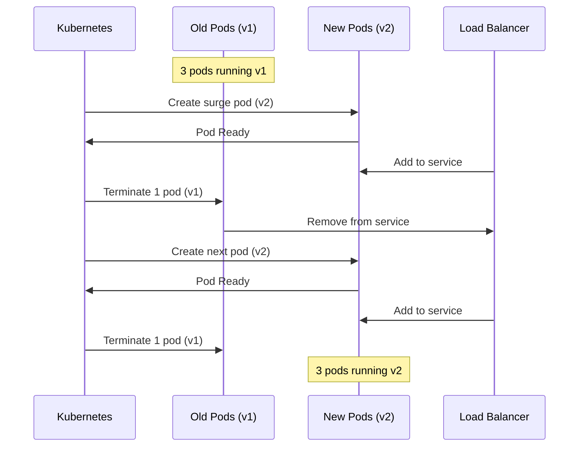

# How to Create Max Surge Configuration

Author: [nawazdhandala](https://github.com/nawazdhandala)

Tags: Kubernetes, Deployments, Max Surge, Rolling Updates

Description: Learn to create max surge configuration for controlling deployment rollout speed.

---

When you deploy a new version of your application in Kubernetes, the old pods do not all shut down at once. Instead, Kubernetes performs a rolling update, gradually replacing old pods with new ones. The `maxSurge` setting controls how many extra pods can exist during this transition.

Getting maxSurge right means faster deployments without overwhelming your cluster. Set it too low and deployments crawl. Set it too high and you risk resource exhaustion or overloading downstream services.

This guide covers how maxSurge works, how to configure it for different scenarios, and what happens under the hood during a rolling update.

---

## How Rolling Updates Work

Before configuring maxSurge, understand the mechanics. Kubernetes uses two settings together to control rolling updates:

| Setting | Purpose | Default |
|---------|---------|---------|
| maxSurge | Extra pods allowed above desired count during rollout | 25% |
| maxUnavailable | Pods that can be unavailable during rollout | 25% |

These settings determine the pace and safety of your deployments. The following diagram shows the pod lifecycle during a rolling update.



The surge pod comes up first, gets added to the load balancer, and only then does Kubernetes terminate an old pod. This maintains capacity throughout the rollout.

---

## Basic MaxSurge Configuration

The maxSurge setting lives in the Deployment spec under the `strategy` block. You can specify it as an absolute number or a percentage.

This configuration allows one extra pod during rollouts while keeping all existing pods running until replacements are ready.

```yaml
apiVersion: apps/v1
kind: Deployment
metadata:
  name: api-server
  namespace: production
spec:
  replicas: 3
  strategy:
    type: RollingUpdate
    rollingUpdate:
      # Allow 1 extra pod during rollout
      maxSurge: 1
      # Never terminate pods until replacement is Ready
      maxUnavailable: 0
  selector:
    matchLabels:
      app: api-server
  template:
    metadata:
      labels:
        app: api-server
    spec:
      containers:
        - name: api
          image: myapp/api:v2.0.0
          ports:
            - containerPort: 8080
          # Probes are required for safe rolling updates
          readinessProbe:
            httpGet:
              path: /health
              port: 8080
            initialDelaySeconds: 5
            periodSeconds: 5
          livenessProbe:
            httpGet:
              path: /health
              port: 8080
            initialDelaySeconds: 15
            periodSeconds: 10
```

The readiness probe is essential. Kubernetes waits for new pods to pass readiness checks before considering them part of the rollout.

---

## Percentage vs Absolute Values

You can express maxSurge as either a percentage or an absolute number. Each has trade-offs.

```yaml
# Absolute value: always allows exactly 2 extra pods
spec:
  strategy:
    rollingUpdate:
      maxSurge: 2
      maxUnavailable: 0
```

```yaml
# Percentage: scales with replica count
spec:
  strategy:
    rollingUpdate:
      maxSurge: 25%
      maxUnavailable: 0
```

The following table shows how these behave with different replica counts.

| Replicas | maxSurge: 2 | maxSurge: 25% | maxSurge: 50% |
|----------|-------------|---------------|---------------|
| 4 | 2 extra pods | 1 extra pod | 2 extra pods |
| 10 | 2 extra pods | 3 extra pods (rounded up) | 5 extra pods |
| 20 | 2 extra pods | 5 extra pods | 10 extra pods |

Percentages round up. A 25% surge with 4 replicas means 1 extra pod, not zero.

---

## Common Configuration Patterns

Different workloads need different surge configurations. Here are patterns that work well in production.

### Pattern 1: Zero-Downtime Web Service

For user-facing services where availability matters most. This configuration keeps all existing pods running while new pods come up one at a time.

```yaml
apiVersion: apps/v1
kind: Deployment
metadata:
  name: web-frontend
spec:
  replicas: 5
  strategy:
    type: RollingUpdate
    rollingUpdate:
      # Gradual rollout: one pod at a time
      maxSurge: 1
      # Never reduce capacity below desired count
      maxUnavailable: 0
  template:
    spec:
      containers:
        - name: frontend
          image: myapp/frontend:v3.0.0
          resources:
            requests:
              cpu: 200m
              memory: 256Mi
            limits:
              cpu: 500m
              memory: 512Mi
```

### Pattern 2: Fast Rollout for Large Deployments

When you have many replicas and want faster deployments. This allows more pods to roll simultaneously.

```yaml
apiVersion: apps/v1
kind: Deployment
metadata:
  name: worker-pool
spec:
  replicas: 20
  strategy:
    type: RollingUpdate
    rollingUpdate:
      # Aggressive surge for faster rollout
      maxSurge: 50%
      # Allow some pods to be unavailable
      maxUnavailable: 25%
  template:
    spec:
      containers:
        - name: worker
          image: myapp/worker:v2.5.0
```

With 20 replicas, this allows 10 extra pods (50% surge) and 5 pods to be down (25% unavailable). The rollout completes much faster.

### Pattern 3: Resource-Constrained Clusters

When cluster resources are tight, limit the surge to avoid hitting resource quotas.

```yaml
apiVersion: apps/v1
kind: Deployment
metadata:
  name: api-gateway
spec:
  replicas: 8
  strategy:
    type: RollingUpdate
    rollingUpdate:
      # Minimal surge to conserve resources
      maxSurge: 1
      # Allow 1 pod unavailable to speed up rollout
      maxUnavailable: 1
  template:
    spec:
      containers:
        - name: gateway
          image: myapp/gateway:v1.2.0
```

---

## How Pod Counts Change During Rollout

The following diagram shows pod counts during a rollout with 4 replicas, maxSurge: 1, and maxUnavailable: 0.

```mermaid
graph LR
    subgraph Start
        A1[v1 Pod]
        A2[v1 Pod]
        A3[v1 Pod]
        A4[v1 Pod]
    end

    subgraph "Step 1: Surge"
        B1[v1 Pod]
        B2[v1 Pod]
        B3[v1 Pod]
        B4[v1 Pod]
        B5[v2 Pod]
    end

    subgraph "Step 2: Replace"
        C1[v1 Pod]
        C2[v1 Pod]
        C3[v1 Pod]
        C5[v2 Pod]
    end

    subgraph "Step 3: Continue"
        D1[v1 Pod]
        D2[v1 Pod]
        D3[v2 Pod]
        D5[v2 Pod]
    end

    subgraph End
        E1[v2 Pod]
        E2[v2 Pod]
        E3[v2 Pod]
        E4[v2 Pod]
    end

    Start --> |Create v2| "Step 1: Surge"
    "Step 1: Surge" --> |Remove v1| "Step 2: Replace"
    "Step 2: Replace" --> |Repeat| "Step 3: Continue"
    "Step 3: Continue" --> |Complete| End
```

At no point does the pod count drop below 4 (the desired count). The surge pod provides the buffer needed for safe replacement.

---

## Combining with Pod Disruption Budgets

MaxSurge controls voluntary updates you trigger. Pod Disruption Budgets (PDBs) control involuntary disruptions like node drains. Use them together for complete protection.

```yaml
# Deployment with rolling update strategy
apiVersion: apps/v1
kind: Deployment
metadata:
  name: critical-service
  namespace: production
spec:
  replicas: 4
  strategy:
    type: RollingUpdate
    rollingUpdate:
      maxSurge: 1
      maxUnavailable: 0
  selector:
    matchLabels:
      app: critical-service
  template:
    metadata:
      labels:
        app: critical-service
    spec:
      containers:
        - name: app
          image: myapp/critical:v1.0.0
---
# PDB ensures minimum availability during node operations
apiVersion: policy/v1
kind: PodDisruptionBudget
metadata:
  name: critical-service-pdb
  namespace: production
spec:
  minAvailable: 3
  selector:
    matchLabels:
      app: critical-service
```

The PDB ensures at least 3 pods stay running during node drains, cluster upgrades, or autoscaler scale-downs.

---

## Monitoring Rollout Progress

Watch your rollouts to verify maxSurge behaves as expected.

```bash
# Watch rollout status in real-time
kubectl rollout status deployment/api-server -n production --watch

# Check current pod counts during rollout
kubectl get pods -l app=api-server -n production

# View rollout history
kubectl rollout history deployment/api-server -n production

# Get detailed deployment status
kubectl describe deployment api-server -n production | grep -A 5 "Replicas:"
```

The output shows current, updated, ready, and available pod counts during the rollout.

---

## Troubleshooting Common Issues

### Rollout Stuck with Pending Pods

If surge pods stay Pending, your cluster likely lacks resources.

```bash
# Check why pods are Pending
kubectl describe pod <pending-pod-name> -n production

# Look for resource issues
kubectl get events -n production --sort-by='.lastTimestamp'
```

Solutions include reducing maxSurge, adding cluster capacity, or adjusting resource requests.

### Rollout Takes Too Long

With maxSurge: 1 and many replicas, rollouts can be slow. Increase surge for faster deployments.

```yaml
strategy:
  rollingUpdate:
    maxSurge: 25%    # Up from 1
    maxUnavailable: 0
```

### New Pods Failing Readiness

If new pods fail readiness probes, the rollout stalls. Check application logs and probe configuration.

```bash
# Check pod events
kubectl describe pod <pod-name> -n production

# View application logs
kubectl logs <pod-name> -n production
```

---

## Summary

MaxSurge controls how aggressively Kubernetes rolls out new versions. The right setting depends on your availability requirements, resource constraints, and deployment frequency.

Start with these guidelines:

- Use maxSurge: 1 with maxUnavailable: 0 for critical services that need zero downtime
- Use maxSurge: 25% with maxUnavailable: 25% for faster rollouts when brief capacity dips are acceptable
- Always include readiness probes so Kubernetes knows when new pods are ready
- Combine with Pod Disruption Budgets for complete availability protection

Test your configuration in staging before production. The right balance between speed and safety varies by workload.

---

**Related Reading:**

- [How to Roll Out a Change, Watch Health Checks, and Undo a Bad Deploy](https://oneuptime.com/blog/post/2025-11-27-rollouts-health-undo/view)
- [How to Implement Pod Disruption Budgets for Zero-Downtime Updates](https://oneuptime.com/blog/post/2026-01-06-kubernetes-pod-disruption-budgets/view)
