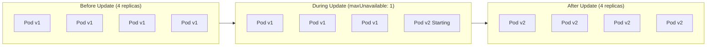
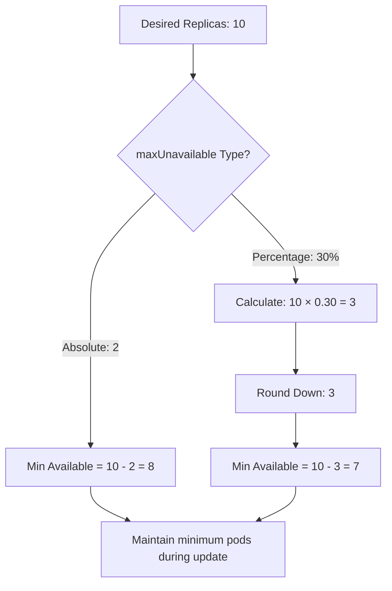
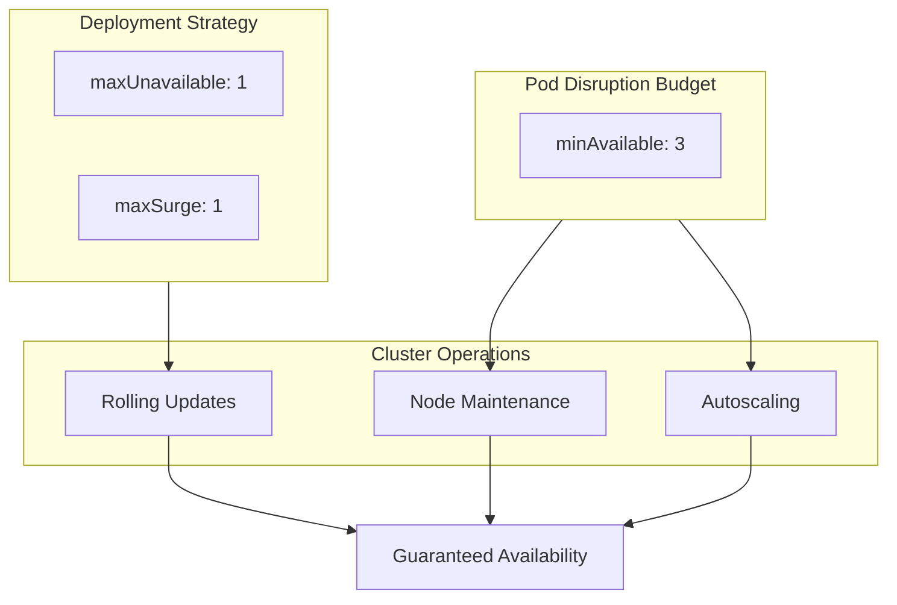

# How to Build Max Unavailable Configuration

Author: [nawazdhandala](https://github.com/nawazdhandala)

Tags: Kubernetes, Deployments, Max Unavailable, Availability

Description: Learn to build max unavailable configuration for maintaining service availability during updates.

---

When you deploy updates to your Kubernetes applications, the platform needs to know how to transition from the old version to the new one. The `maxUnavailable` setting is one of the most important parameters that controls this behavior. It determines how many pods can be taken offline during a rolling update, directly affecting your application's availability.

This guide walks you through building effective max unavailable configurations for different scenarios, from high availability production systems to resource constrained development environments.

## Understanding Max Unavailable

The `maxUnavailable` field specifies the maximum number of pods that can be unavailable during the update process. You can set this value as an absolute number or as a percentage of the desired replica count.

Here is a visual representation of how max unavailable works during a rolling update:



## Basic Max Unavailable Configuration

The following deployment configuration sets up a basic rolling update strategy with max unavailable. This example uses an absolute value of 1, meaning only one pod can be down at any time during updates.

```yaml
# Basic deployment with maxUnavailable configuration
apiVersion: apps/v1
kind: Deployment
metadata:
  name: web-application
  labels:
    app: web-application
spec:
  # Total number of pod replicas to maintain
  replicas: 4
  selector:
    matchLabels:
      app: web-application
  # Rolling update strategy configuration
  strategy:
    type: RollingUpdate
    rollingUpdate:
      # Maximum pods unavailable during update (absolute number)
      maxUnavailable: 1
      # Maximum extra pods during update
      maxSurge: 1
  template:
    metadata:
      labels:
        app: web-application
    spec:
      containers:
      - name: web
        image: nginx:1.21
        ports:
        - containerPort: 80
```

## Percentage Based Configuration

For deployments where the replica count changes frequently or varies across environments, using percentages provides more flexibility. The following configuration ensures at least 75% of pods remain available during updates.

```yaml
# Deployment using percentage-based maxUnavailable
apiVersion: apps/v1
kind: Deployment
metadata:
  name: api-service
  labels:
    app: api-service
spec:
  replicas: 8
  selector:
    matchLabels:
      app: api-service
  strategy:
    type: RollingUpdate
    rollingUpdate:
      # Allow up to 25% of pods to be unavailable
      # With 8 replicas, this means 2 pods can be down
      maxUnavailable: 25%
      # Allow 25% additional pods during update
      maxSurge: 25%
  template:
    metadata:
      labels:
        app: api-service
    spec:
      containers:
      - name: api
        image: api-service:v2.0.0
        ports:
        - containerPort: 8080
        # Readiness probe ensures traffic only goes to healthy pods
        readinessProbe:
          httpGet:
            path: /health
            port: 8080
          initialDelaySeconds: 5
          periodSeconds: 10
```

## How Kubernetes Calculates Available Pods

Understanding the math behind max unavailable helps you plan your deployments better. The following diagram shows the calculation process:



When using percentages, Kubernetes rounds down the calculated value. This means with 10 replicas and 25% max unavailable, the result is 2 pods (10 × 0.25 = 2.5, rounded down to 2).

## High Availability Configuration

Production systems often require strict availability guarantees. This configuration prioritizes availability by limiting unavailability to a single pod while allowing extra pods during the transition.

```yaml
# High availability deployment configuration
apiVersion: apps/v1
kind: Deployment
metadata:
  name: payment-service
  labels:
    app: payment-service
    tier: critical
spec:
  # Higher replica count for redundancy
  replicas: 6
  selector:
    matchLabels:
      app: payment-service
  strategy:
    type: RollingUpdate
    rollingUpdate:
      # Only 1 pod unavailable at a time for maximum availability
      maxUnavailable: 1
      # Allow 2 extra pods to speed up the rollout
      maxSurge: 2
  template:
    metadata:
      labels:
        app: payment-service
    spec:
      # Spread pods across nodes for fault tolerance
      affinity:
        podAntiAffinity:
          preferredDuringSchedulingIgnoredDuringExecution:
          - weight: 100
            podAffinityTerm:
              labelSelector:
                matchLabels:
                  app: payment-service
              topologyKey: kubernetes.io/hostname
      containers:
      - name: payment
        image: payment-service:v3.1.0
        ports:
        - containerPort: 8443
        resources:
          requests:
            memory: "256Mi"
            cpu: "250m"
          limits:
            memory: "512Mi"
            cpu: "500m"
        # Liveness probe restarts unhealthy pods
        livenessProbe:
          httpGet:
            path: /healthz
            port: 8443
          initialDelaySeconds: 30
          periodSeconds: 15
        # Readiness probe controls traffic routing
        readinessProbe:
          httpGet:
            path: /ready
            port: 8443
          initialDelaySeconds: 10
          periodSeconds: 5
```

## Fast Rollout Configuration

When you need to deploy updates quickly and can tolerate brief periods of reduced capacity, increase the max unavailable value. This approach works well for stateless services with good load balancing.

```yaml
# Fast rollout configuration for non-critical services
apiVersion: apps/v1
kind: Deployment
metadata:
  name: cache-warmer
  labels:
    app: cache-warmer
spec:
  replicas: 10
  selector:
    matchLabels:
      app: cache-warmer
  strategy:
    type: RollingUpdate
    rollingUpdate:
      # Allow 50% unavailable for faster updates
      maxUnavailable: 50%
      # No surge to conserve cluster resources
      maxSurge: 0
  template:
    metadata:
      labels:
        app: cache-warmer
    spec:
      containers:
      - name: warmer
        image: cache-warmer:latest
        resources:
          requests:
            memory: "128Mi"
            cpu: "100m"
```

## Combining Max Unavailable with Pod Disruption Budgets

For additional protection during both voluntary and involuntary disruptions, combine your deployment strategy with a Pod Disruption Budget. The PDB ensures a minimum number of pods remain available even during cluster maintenance.

```yaml
# Pod Disruption Budget for additional availability guarantees
apiVersion: policy/v1
kind: PodDisruptionBudget
metadata:
  name: web-application-pdb
spec:
  # Minimum pods that must remain available
  minAvailable: 3
  selector:
    matchLabels:
      app: web-application
---
# Corresponding deployment
apiVersion: apps/v1
kind: Deployment
metadata:
  name: web-application
spec:
  replicas: 4
  selector:
    matchLabels:
      app: web-application
  strategy:
    type: RollingUpdate
    rollingUpdate:
      # Aligns with PDB: 4 replicas - 1 unavailable = 3 available
      maxUnavailable: 1
      maxSurge: 1
  template:
    metadata:
      labels:
        app: web-application
    spec:
      containers:
      - name: web
        image: nginx:1.22
```

The relationship between deployments, PDBs, and cluster operations works as follows:



## Choosing the Right Values

Selecting appropriate max unavailable values depends on your specific requirements:

| Scenario | maxUnavailable | maxSurge | Reasoning |
|----------|---------------|----------|-----------|
| Critical production | 0 or 1 | 1-2 | Prioritize availability over speed |
| Standard production | 25% | 25% | Balance between availability and speed |
| Development/staging | 50% | 0 | Fast updates, limited resources |
| Batch processing | 50% | 50% | Speed matters, brief downtime acceptable |

## Monitoring Your Rollouts

After configuring max unavailable, monitor your deployments to verify they behave as expected. Use kubectl to watch the rollout progress.

```bash
# Watch deployment rollout status
kubectl rollout status deployment/web-application

# View rollout history
kubectl rollout history deployment/web-application

# Check current replica status
kubectl get deployment web-application -o wide
```

## Conclusion

The max unavailable configuration gives you precise control over how Kubernetes handles rolling updates. Start with conservative values for production workloads and adjust based on your observations. Remember that max unavailable works alongside max surge and pod disruption budgets to provide comprehensive availability management.

For critical services, pair low max unavailable values with proper health checks and pod anti-affinity rules. This combination ensures your applications remain available even during updates and cluster maintenance events.

**Related Reading:**

- [How to configure MetalLB with Kubernetes (Microk8s)](https://oneuptime.com/blog/post/2023-11-06-configure-metallb-with-kubernetes-microk8s/view)
- [Understanding SLI, SLA, and SLO](https://oneuptime.com/blog/post/2023-06-12-sli-sla-slo/view)
- [How moving from AWS to Bare-Metal saved us $230,000 /yr.](https://oneuptime.com/blog/post/2023-10-30-moving-from-aws-to-bare-metal/view)
