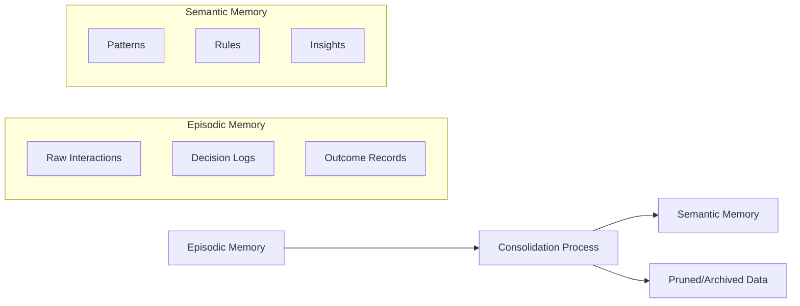
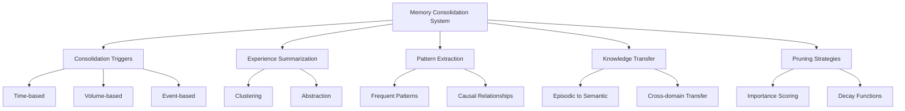
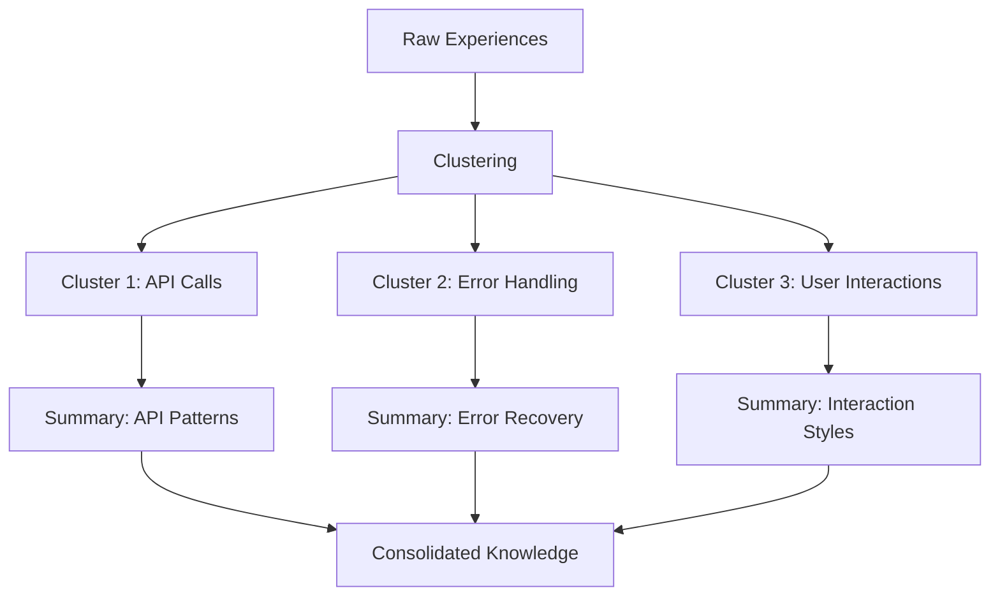
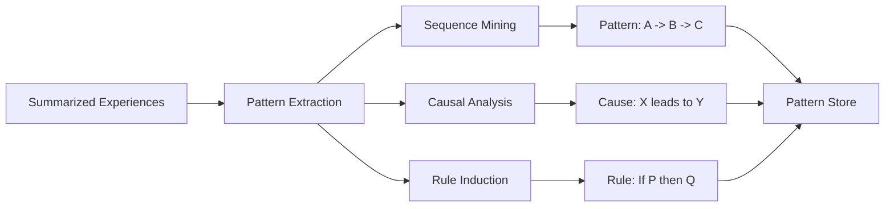
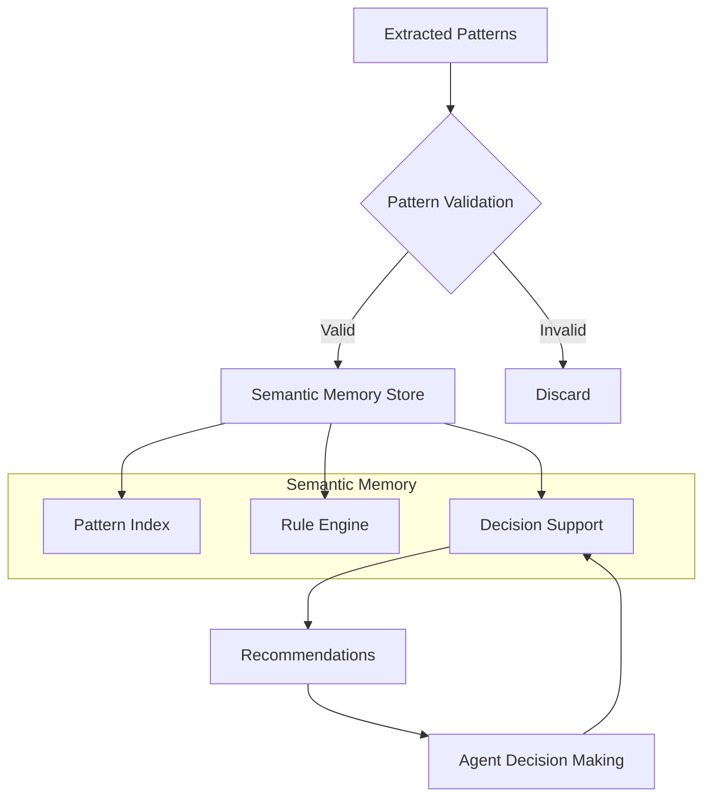
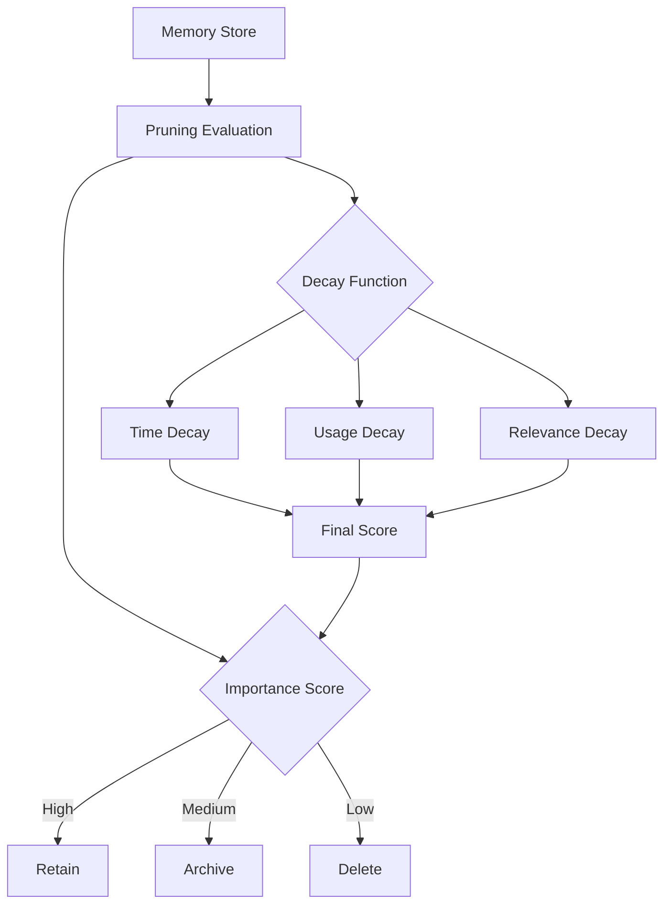

# How to Build Memory Consolidation

Author: [nawazdhandala](https://github.com/nawazdhandala)

Tags: AI Agents, Memory Consolidation, Knowledge Management, Learning

Description: Learn to implement memory consolidation for AI agents with experience summarization, pattern extraction, and knowledge transfer from episodic to semantic memory.

---

Memory consolidation is one of the most critical capabilities for AI agents that need to learn and improve over time. Just as humans consolidate experiences during sleep - transforming short-term memories into long-term knowledge - AI agents need mechanisms to distill their operational experiences into reusable insights. This post explores how to build a robust memory consolidation system for your AI agents.

## What is Memory Consolidation?

Memory consolidation is the process of transforming raw experiences (episodic memory) into generalized knowledge (semantic memory). For AI agents, this means taking the detailed logs of interactions, decisions, and outcomes and converting them into patterns, rules, and insights that improve future performance.



## Core Components of Memory Consolidation

Before diving into implementation, let us understand the key components:



## 1. Consolidation Triggers

Consolidation should not run continuously - it needs to be triggered at appropriate times. Here are the three main trigger types:

### Time-based Triggers

Run consolidation at regular intervals, similar to how humans consolidate during sleep cycles.

```python
import asyncio
from datetime import datetime, timedelta
from typing import Callable, Optional

class TimeBasedTrigger:
    """Trigger consolidation based on time intervals."""

    def __init__(
        self,
        interval_hours: float = 24.0,
        consolidation_callback: Optional[Callable] = None
    ):
        self.interval = timedelta(hours=interval_hours)
        self.last_consolidation = datetime.now()
        self.callback = consolidation_callback
        self._running = False

    async def start(self):
        """Start the time-based trigger loop."""
        self._running = True
        while self._running:
            await asyncio.sleep(60)  # Check every minute
            if self._should_trigger():
                await self._execute_consolidation()

    def _should_trigger(self) -> bool:
        """Check if enough time has passed since last consolidation."""
        return datetime.now() - self.last_consolidation >= self.interval

    async def _execute_consolidation(self):
        """Execute the consolidation process."""
        if self.callback:
            await self.callback()
        self.last_consolidation = datetime.now()
        print(f"Consolidation completed at {self.last_consolidation}")

    def stop(self):
        """Stop the trigger loop."""
        self._running = False
```

### Volume-based Triggers

Trigger consolidation when the episodic memory reaches a certain size.

```python
from dataclasses import dataclass
from typing import List, Any

@dataclass
class MemoryEntry:
    """Represents a single memory entry."""
    id: str
    content: Any
    timestamp: datetime
    importance: float = 0.5

class VolumeBasedTrigger:
    """Trigger consolidation when memory volume exceeds threshold."""

    def __init__(
        self,
        max_entries: int = 1000,
        max_size_mb: float = 100.0
    ):
        self.max_entries = max_entries
        self.max_size_mb = max_size_mb
        self.entries: List[MemoryEntry] = []

    def add_entry(self, entry: MemoryEntry) -> bool:
        """Add entry and check if consolidation is needed."""
        self.entries.append(entry)
        return self._should_trigger()

    def _should_trigger(self) -> bool:
        """Check if volume thresholds are exceeded."""
        if len(self.entries) >= self.max_entries:
            return True

        # Estimate memory size (simplified)
        estimated_size = len(self.entries) * 0.001  # Rough estimate in MB
        return estimated_size >= self.max_size_mb

    def get_entries_for_consolidation(self) -> List[MemoryEntry]:
        """Return entries that should be consolidated."""
        # Keep most recent entries, consolidate older ones
        cutoff = len(self.entries) // 2
        to_consolidate = self.entries[:cutoff]
        self.entries = self.entries[cutoff:]
        return to_consolidate
```

### Event-based Triggers

Trigger consolidation after significant events like task completion or error recovery.

```python
from enum import Enum
from typing import Dict, Set

class EventType(Enum):
    TASK_COMPLETED = "task_completed"
    ERROR_RECOVERED = "error_recovered"
    GOAL_ACHIEVED = "goal_achieved"
    SESSION_END = "session_end"
    FEEDBACK_RECEIVED = "feedback_received"

class EventBasedTrigger:
    """Trigger consolidation based on specific events."""

    def __init__(self):
        self.trigger_events: Set[EventType] = {
            EventType.SESSION_END,
            EventType.GOAL_ACHIEVED,
            EventType.FEEDBACK_RECEIVED
        }
        self.event_counts: Dict[EventType, int] = {}
        self.batch_thresholds: Dict[EventType, int] = {
            EventType.TASK_COMPLETED: 10,  # After every 10 tasks
            EventType.ERROR_RECOVERED: 5,   # After every 5 recoveries
        }

    def record_event(self, event: EventType) -> bool:
        """Record an event and check if consolidation should trigger."""
        # Immediate triggers
        if event in self.trigger_events:
            return True

        # Batch triggers
        self.event_counts[event] = self.event_counts.get(event, 0) + 1
        if event in self.batch_thresholds:
            if self.event_counts[event] >= self.batch_thresholds[event]:
                self.event_counts[event] = 0
                return True

        return False
```

## 2. Experience Summarization

Once triggered, the consolidation process must summarize experiences. This involves clustering similar experiences and creating abstractions.



### Implementing Experience Summarization

```python
import numpy as np
from typing import List, Dict, Tuple
from dataclasses import dataclass, field
from sklearn.cluster import KMeans
from collections import defaultdict

@dataclass
class Experience:
    """Represents a single agent experience."""
    id: str
    action: str
    context: Dict[str, Any]
    outcome: str
    success: bool
    embedding: List[float] = field(default_factory=list)
    timestamp: datetime = field(default_factory=datetime.now)

@dataclass
class ExperienceSummary:
    """Summarized experience cluster."""
    cluster_id: int
    action_type: str
    common_contexts: Dict[str, Any]
    success_rate: float
    typical_outcomes: List[str]
    experience_count: int
    representative_examples: List[str]

class ExperienceSummarizer:
    """Summarize experiences through clustering and abstraction."""

    def __init__(self, n_clusters: int = 10):
        self.n_clusters = n_clusters
        self.clusterer = KMeans(n_clusters=n_clusters, random_state=42)

    def summarize(
        self,
        experiences: List[Experience]
    ) -> List[ExperienceSummary]:
        """Cluster and summarize a list of experiences."""
        if len(experiences) < self.n_clusters:
            # Not enough experiences to cluster meaningfully
            return self._create_single_summary(experiences)

        # Extract embeddings for clustering
        embeddings = np.array([exp.embedding for exp in experiences])

        # Perform clustering
        cluster_labels = self.clusterer.fit_predict(embeddings)

        # Group experiences by cluster
        clusters: Dict[int, List[Experience]] = defaultdict(list)
        for exp, label in zip(experiences, cluster_labels):
            clusters[label].append(exp)

        # Create summaries for each cluster
        summaries = []
        for cluster_id, cluster_experiences in clusters.items():
            summary = self._summarize_cluster(cluster_id, cluster_experiences)
            summaries.append(summary)

        return summaries

    def _summarize_cluster(
        self,
        cluster_id: int,
        experiences: List[Experience]
    ) -> ExperienceSummary:
        """Create a summary for a single cluster."""
        # Find most common action
        action_counts = defaultdict(int)
        for exp in experiences:
            action_counts[exp.action] += 1
        dominant_action = max(action_counts, key=action_counts.get)

        # Calculate success rate
        success_count = sum(1 for exp in experiences if exp.success)
        success_rate = success_count / len(experiences)

        # Find common context patterns
        common_contexts = self._extract_common_contexts(experiences)

        # Get typical outcomes
        outcome_counts = defaultdict(int)
        for exp in experiences:
            outcome_counts[exp.outcome] += 1
        typical_outcomes = sorted(
            outcome_counts.keys(),
            key=lambda x: outcome_counts[x],
            reverse=True
        )[:3]

        # Select representative examples
        representative_ids = self._select_representatives(experiences)

        return ExperienceSummary(
            cluster_id=cluster_id,
            action_type=dominant_action,
            common_contexts=common_contexts,
            success_rate=success_rate,
            typical_outcomes=typical_outcomes,
            experience_count=len(experiences),
            representative_examples=representative_ids
        )

    def _extract_common_contexts(
        self,
        experiences: List[Experience]
    ) -> Dict[str, Any]:
        """Extract context patterns that appear frequently."""
        context_values: Dict[str, Dict[Any, int]] = defaultdict(
            lambda: defaultdict(int)
        )

        for exp in experiences:
            for key, value in exp.context.items():
                # Convert to hashable type if needed
                hashable_value = str(value) if isinstance(value, (dict, list)) else value
                context_values[key][hashable_value] += 1

        # Keep values that appear in more than 50% of experiences
        threshold = len(experiences) * 0.5
        common = {}
        for key, value_counts in context_values.items():
            for value, count in value_counts.items():
                if count >= threshold:
                    common[key] = value
                    break

        return common

    def _select_representatives(
        self,
        experiences: List[Experience],
        n: int = 3
    ) -> List[str]:
        """Select representative experience IDs from cluster."""
        # Simple selection: one success, one failure, one random
        successes = [e for e in experiences if e.success]
        failures = [e for e in experiences if not e.success]

        representatives = []
        if successes:
            representatives.append(successes[0].id)
        if failures:
            representatives.append(failures[0].id)

        # Fill remaining slots
        for exp in experiences:
            if len(representatives) >= n:
                break
            if exp.id not in representatives:
                representatives.append(exp.id)

        return representatives

    def _create_single_summary(
        self,
        experiences: List[Experience]
    ) -> List[ExperienceSummary]:
        """Create a single summary when clustering is not possible."""
        if not experiences:
            return []
        return [self._summarize_cluster(0, experiences)]
```

## 3. Pattern Extraction

Pattern extraction identifies recurring sequences, causal relationships, and decision rules from experiences.



### Implementing Pattern Extraction

```python
from typing import List, Dict, Tuple, Optional, Set
from dataclasses import dataclass
from collections import defaultdict
import itertools

@dataclass
class Pattern:
    """Represents an extracted pattern."""
    pattern_type: str  # "sequence", "causal", "rule"
    description: str
    confidence: float
    support: int  # Number of experiences supporting this pattern
    elements: List[str]
    conditions: Optional[Dict[str, Any]] = None

class PatternExtractor:
    """Extract patterns from summarized experiences."""

    def __init__(
        self,
        min_support: int = 3,
        min_confidence: float = 0.7
    ):
        self.min_support = min_support
        self.min_confidence = min_confidence

    def extract_patterns(
        self,
        experiences: List[Experience]
    ) -> List[Pattern]:
        """Extract all pattern types from experiences."""
        patterns = []

        # Extract sequence patterns
        sequences = self._extract_sequences(experiences)
        patterns.extend(sequences)

        # Extract causal patterns
        causal = self._extract_causal_patterns(experiences)
        patterns.extend(causal)

        # Extract decision rules
        rules = self._extract_rules(experiences)
        patterns.extend(rules)

        return patterns

    def _extract_sequences(
        self,
        experiences: List[Experience]
    ) -> List[Pattern]:
        """Find frequent action sequences."""
        # Group experiences by session/task
        sessions = self._group_by_session(experiences)

        # Count action sequences
        sequence_counts: Dict[Tuple[str, ...], int] = defaultdict(int)

        for session_experiences in sessions.values():
            # Sort by timestamp
            sorted_exp = sorted(session_experiences, key=lambda x: x.timestamp)
            actions = [exp.action for exp in sorted_exp]

            # Extract subsequences of length 2-4
            for length in range(2, min(5, len(actions) + 1)):
                for i in range(len(actions) - length + 1):
                    seq = tuple(actions[i:i + length])
                    sequence_counts[seq] += 1

        # Filter by minimum support
        patterns = []
        for seq, count in sequence_counts.items():
            if count >= self.min_support:
                patterns.append(Pattern(
                    pattern_type="sequence",
                    description=f"Action sequence: {' -> '.join(seq)}",
                    confidence=count / len(sessions),
                    support=count,
                    elements=list(seq)
                ))

        return patterns

    def _extract_causal_patterns(
        self,
        experiences: List[Experience]
    ) -> List[Pattern]:
        """Find action-outcome causal relationships."""
        # Track action-outcome pairs
        action_outcomes: Dict[str, Dict[str, int]] = defaultdict(
            lambda: defaultdict(int)
        )
        action_counts: Dict[str, int] = defaultdict(int)

        for exp in experiences:
            action_outcomes[exp.action][exp.outcome] += 1
            action_counts[exp.action] += 1

        patterns = []
        for action, outcomes in action_outcomes.items():
            total = action_counts[action]
            if total < self.min_support:
                continue

            for outcome, count in outcomes.items():
                confidence = count / total
                if confidence >= self.min_confidence:
                    patterns.append(Pattern(
                        pattern_type="causal",
                        description=f"Action '{action}' leads to '{outcome}'",
                        confidence=confidence,
                        support=count,
                        elements=[action, outcome]
                    ))

        return patterns

    def _extract_rules(
        self,
        experiences: List[Experience]
    ) -> List[Pattern]:
        """Extract if-then rules from context-action-outcome triples."""
        # Group by context patterns
        context_patterns: Dict[str, List[Experience]] = defaultdict(list)

        for exp in experiences:
            # Create context signature
            context_sig = self._context_signature(exp.context)
            context_patterns[context_sig].append(exp)

        patterns = []
        for context_sig, exps in context_patterns.items():
            if len(exps) < self.min_support:
                continue

            # Find dominant successful action
            success_actions: Dict[str, int] = defaultdict(int)
            for exp in exps:
                if exp.success:
                    success_actions[exp.action] += 1

            if not success_actions:
                continue

            best_action = max(success_actions, key=success_actions.get)
            success_count = success_actions[best_action]
            confidence = success_count / len(exps)

            if confidence >= self.min_confidence:
                patterns.append(Pattern(
                    pattern_type="rule",
                    description=f"When {context_sig}, do '{best_action}'",
                    confidence=confidence,
                    support=success_count,
                    elements=[context_sig, best_action],
                    conditions=self._parse_context_signature(context_sig)
                ))

        return patterns

    def _group_by_session(
        self,
        experiences: List[Experience]
    ) -> Dict[str, List[Experience]]:
        """Group experiences by session ID from context."""
        sessions: Dict[str, List[Experience]] = defaultdict(list)
        for exp in experiences:
            session_id = exp.context.get("session_id", "default")
            sessions[session_id].append(exp)
        return sessions

    def _context_signature(self, context: Dict[str, Any]) -> str:
        """Create a hashable signature from context."""
        # Select key context features
        key_features = ["task_type", "user_intent", "environment"]
        sig_parts = []
        for key in key_features:
            if key in context:
                sig_parts.append(f"{key}={context[key]}")
        return "; ".join(sorted(sig_parts)) if sig_parts else "default"

    def _parse_context_signature(self, sig: str) -> Dict[str, Any]:
        """Parse context signature back to dictionary."""
        if sig == "default":
            return {}
        conditions = {}
        for part in sig.split("; "):
            if "=" in part:
                key, value = part.split("=", 1)
                conditions[key] = value
        return conditions
```

## 4. Knowledge Transfer

Knowledge transfer moves consolidated patterns from episodic memory to semantic memory, making them available for future decision-making.



### Implementing Knowledge Transfer

```python
from typing import List, Dict, Optional, Any
from dataclasses import dataclass, field
from datetime import datetime
import json
import hashlib

@dataclass
class SemanticKnowledge:
    """Knowledge stored in semantic memory."""
    id: str
    knowledge_type: str
    content: Dict[str, Any]
    confidence: float
    usage_count: int = 0
    last_used: Optional[datetime] = None
    created_at: datetime = field(default_factory=datetime.now)
    source_patterns: List[str] = field(default_factory=list)

class SemanticMemory:
    """Long-term semantic memory store."""

    def __init__(self):
        self.knowledge: Dict[str, SemanticKnowledge] = {}
        self.index: Dict[str, Set[str]] = defaultdict(set)  # keyword -> knowledge_ids

    def store(self, knowledge: SemanticKnowledge) -> str:
        """Store knowledge in semantic memory."""
        self.knowledge[knowledge.id] = knowledge
        self._update_index(knowledge)
        return knowledge.id

    def query(
        self,
        keywords: List[str],
        knowledge_type: Optional[str] = None
    ) -> List[SemanticKnowledge]:
        """Query semantic memory for relevant knowledge."""
        # Find knowledge matching keywords
        candidate_ids: Set[str] = set()
        for keyword in keywords:
            candidate_ids.update(self.index.get(keyword.lower(), set()))

        # Filter and rank results
        results = []
        for kid in candidate_ids:
            knowledge = self.knowledge.get(kid)
            if knowledge and (knowledge_type is None or knowledge.knowledge_type == knowledge_type):
                results.append(knowledge)

        # Sort by confidence and usage
        results.sort(key=lambda k: (k.confidence, k.usage_count), reverse=True)
        return results

    def update_usage(self, knowledge_id: str):
        """Update usage statistics for knowledge."""
        if knowledge_id in self.knowledge:
            self.knowledge[knowledge_id].usage_count += 1
            self.knowledge[knowledge_id].last_used = datetime.now()

    def _update_index(self, knowledge: SemanticKnowledge):
        """Update the keyword index."""
        # Extract keywords from content
        keywords = self._extract_keywords(knowledge.content)
        for keyword in keywords:
            self.index[keyword.lower()].add(knowledge.id)

    def _extract_keywords(self, content: Dict[str, Any]) -> Set[str]:
        """Extract indexable keywords from content."""
        keywords = set()
        for key, value in content.items():
            keywords.add(key)
            if isinstance(value, str):
                keywords.update(value.lower().split())
            elif isinstance(value, list):
                for item in value:
                    if isinstance(item, str):
                        keywords.update(item.lower().split())
        return keywords

class KnowledgeTransfer:
    """Transfer patterns from episodic to semantic memory."""

    def __init__(
        self,
        semantic_memory: SemanticMemory,
        validation_threshold: float = 0.75
    ):
        self.semantic_memory = semantic_memory
        self.validation_threshold = validation_threshold

    def transfer(self, patterns: List[Pattern]) -> List[str]:
        """Transfer validated patterns to semantic memory."""
        transferred_ids = []

        for pattern in patterns:
            if self._validate_pattern(pattern):
                knowledge = self._convert_to_knowledge(pattern)

                # Check for existing similar knowledge
                existing = self._find_similar(knowledge)
                if existing:
                    # Merge with existing knowledge
                    self._merge_knowledge(existing, knowledge)
                    transferred_ids.append(existing.id)
                else:
                    # Store as new knowledge
                    kid = self.semantic_memory.store(knowledge)
                    transferred_ids.append(kid)

        return transferred_ids

    def _validate_pattern(self, pattern: Pattern) -> bool:
        """Validate pattern meets quality thresholds."""
        # Check confidence threshold
        if pattern.confidence < self.validation_threshold:
            return False

        # Check minimum support
        if pattern.support < 3:
            return False

        # Additional validation logic can be added here
        return True

    def _convert_to_knowledge(self, pattern: Pattern) -> SemanticKnowledge:
        """Convert pattern to semantic knowledge."""
        # Generate unique ID
        content_hash = hashlib.md5(
            json.dumps(pattern.elements, sort_keys=True).encode()
        ).hexdigest()[:12]

        knowledge_id = f"{pattern.pattern_type}_{content_hash}"

        content = {
            "pattern_type": pattern.pattern_type,
            "description": pattern.description,
            "elements": pattern.elements,
        }

        if pattern.conditions:
            content["conditions"] = pattern.conditions

        return SemanticKnowledge(
            id=knowledge_id,
            knowledge_type=pattern.pattern_type,
            content=content,
            confidence=pattern.confidence,
            source_patterns=[f"pattern_{content_hash}"]
        )

    def _find_similar(
        self,
        knowledge: SemanticKnowledge
    ) -> Optional[SemanticKnowledge]:
        """Find existing similar knowledge."""
        # Query by keywords from content
        keywords = list(knowledge.content.get("elements", []))
        existing = self.semantic_memory.query(
            keywords,
            knowledge_type=knowledge.knowledge_type
        )

        for existing_k in existing:
            if self._is_similar(knowledge, existing_k):
                return existing_k

        return None

    def _is_similar(
        self,
        k1: SemanticKnowledge,
        k2: SemanticKnowledge
    ) -> bool:
        """Check if two knowledge items are similar enough to merge."""
        if k1.knowledge_type != k2.knowledge_type:
            return False

        # Compare elements
        e1 = set(k1.content.get("elements", []))
        e2 = set(k2.content.get("elements", []))

        if not e1 or not e2:
            return False

        # Jaccard similarity
        similarity = len(e1 & e2) / len(e1 | e2)
        return similarity > 0.8

    def _merge_knowledge(
        self,
        existing: SemanticKnowledge,
        new: SemanticKnowledge
    ):
        """Merge new knowledge into existing."""
        # Update confidence with weighted average
        total_weight = existing.usage_count + 1
        existing.confidence = (
            existing.confidence * existing.usage_count + new.confidence
        ) / (total_weight + 1)

        # Add source patterns
        existing.source_patterns.extend(new.source_patterns)

        # Update timestamp
        existing.last_used = datetime.now()
```

## 5. Pruning Strategies

As memory grows, pruning becomes essential. Effective pruning keeps valuable knowledge while discarding outdated or redundant information.



### Implementing Pruning Strategies

```python
from typing import List, Dict, Tuple, Callable
from dataclasses import dataclass
from datetime import datetime, timedelta
from enum import Enum
import math

class PruningAction(Enum):
    RETAIN = "retain"
    ARCHIVE = "archive"
    DELETE = "delete"

@dataclass
class PruningResult:
    """Result of pruning evaluation."""
    knowledge_id: str
    action: PruningAction
    score: float
    reason: str

class ImportanceScorer:
    """Calculate importance scores for knowledge items."""

    def __init__(
        self,
        recency_weight: float = 0.3,
        usage_weight: float = 0.4,
        confidence_weight: float = 0.3
    ):
        self.recency_weight = recency_weight
        self.usage_weight = usage_weight
        self.confidence_weight = confidence_weight

    def score(
        self,
        knowledge: SemanticKnowledge,
        current_time: Optional[datetime] = None
    ) -> float:
        """Calculate composite importance score."""
        current_time = current_time or datetime.now()

        # Recency score (0-1)
        recency = self._recency_score(knowledge, current_time)

        # Usage score (0-1)
        usage = self._usage_score(knowledge)

        # Confidence score (already 0-1)
        confidence = knowledge.confidence

        # Weighted combination
        return (
            self.recency_weight * recency +
            self.usage_weight * usage +
            self.confidence_weight * confidence
        )

    def _recency_score(
        self,
        knowledge: SemanticKnowledge,
        current_time: datetime
    ) -> float:
        """Calculate recency-based score with exponential decay."""
        last_used = knowledge.last_used or knowledge.created_at
        days_since_use = (current_time - last_used).days

        # Exponential decay with half-life of 30 days
        half_life = 30
        return math.exp(-math.log(2) * days_since_use / half_life)

    def _usage_score(self, knowledge: SemanticKnowledge) -> float:
        """Calculate usage-based score."""
        # Logarithmic scaling to prevent extreme values
        if knowledge.usage_count == 0:
            return 0.1
        return min(1.0, math.log10(knowledge.usage_count + 1) / 2)

class DecayFunction:
    """Apply decay functions to knowledge scores."""

    def __init__(self, decay_rate: float = 0.01):
        self.decay_rate = decay_rate

    def apply_time_decay(
        self,
        score: float,
        age_days: int
    ) -> float:
        """Apply time-based decay."""
        return score * math.exp(-self.decay_rate * age_days)

    def apply_relevance_decay(
        self,
        score: float,
        relevance_factor: float
    ) -> float:
        """Apply relevance-based decay."""
        # relevance_factor: 0 = irrelevant, 1 = highly relevant
        return score * (0.5 + 0.5 * relevance_factor)

class MemoryPruner:
    """Prune memory based on importance and decay."""

    def __init__(
        self,
        scorer: ImportanceScorer,
        decay: DecayFunction,
        retain_threshold: float = 0.6,
        archive_threshold: float = 0.3
    ):
        self.scorer = scorer
        self.decay = decay
        self.retain_threshold = retain_threshold
        self.archive_threshold = archive_threshold

    def evaluate(
        self,
        knowledge_items: List[SemanticKnowledge],
        context: Optional[Dict[str, Any]] = None
    ) -> List[PruningResult]:
        """Evaluate all knowledge items for pruning."""
        current_time = datetime.now()
        results = []

        for knowledge in knowledge_items:
            # Calculate base importance score
            base_score = self.scorer.score(knowledge, current_time)

            # Apply decay functions
            age_days = (current_time - knowledge.created_at).days
            decayed_score = self.decay.apply_time_decay(base_score, age_days)

            # Apply relevance decay if context provided
            if context:
                relevance = self._calculate_relevance(knowledge, context)
                decayed_score = self.decay.apply_relevance_decay(
                    decayed_score, relevance
                )

            # Determine action
            action, reason = self._determine_action(decayed_score, knowledge)

            results.append(PruningResult(
                knowledge_id=knowledge.id,
                action=action,
                score=decayed_score,
                reason=reason
            ))

        return results

    def _calculate_relevance(
        self,
        knowledge: SemanticKnowledge,
        context: Dict[str, Any]
    ) -> float:
        """Calculate how relevant knowledge is to current context."""
        # Simple keyword overlap relevance
        knowledge_keywords = set()
        for element in knowledge.content.get("elements", []):
            if isinstance(element, str):
                knowledge_keywords.update(element.lower().split())

        context_keywords = set()
        for value in context.values():
            if isinstance(value, str):
                context_keywords.update(value.lower().split())

        if not knowledge_keywords or not context_keywords:
            return 0.5  # Neutral relevance

        overlap = len(knowledge_keywords & context_keywords)
        return min(1.0, overlap / len(knowledge_keywords))

    def _determine_action(
        self,
        score: float,
        knowledge: SemanticKnowledge
    ) -> Tuple[PruningAction, str]:
        """Determine pruning action based on score."""
        if score >= self.retain_threshold:
            return PruningAction.RETAIN, f"Score {score:.2f} above retain threshold"

        if score >= self.archive_threshold:
            return PruningAction.ARCHIVE, f"Score {score:.2f} in archive range"

        # Additional protection for high-usage items
        if knowledge.usage_count > 10:
            return PruningAction.ARCHIVE, f"High usage ({knowledge.usage_count}) - archiving instead"

        return PruningAction.DELETE, f"Score {score:.2f} below archive threshold"

    def execute_pruning(
        self,
        semantic_memory: SemanticMemory,
        results: List[PruningResult],
        archive_callback: Optional[Callable] = None
    ) -> Dict[str, int]:
        """Execute pruning actions on memory."""
        stats = {"retained": 0, "archived": 0, "deleted": 0}

        for result in results:
            if result.action == PruningAction.RETAIN:
                stats["retained"] += 1

            elif result.action == PruningAction.ARCHIVE:
                knowledge = semantic_memory.knowledge.get(result.knowledge_id)
                if knowledge and archive_callback:
                    archive_callback(knowledge)
                del semantic_memory.knowledge[result.knowledge_id]
                stats["archived"] += 1

            elif result.action == PruningAction.DELETE:
                if result.knowledge_id in semantic_memory.knowledge:
                    del semantic_memory.knowledge[result.knowledge_id]
                stats["deleted"] += 1

        return stats
```

## Putting It All Together

Here is a complete memory consolidation system that integrates all components:

```python
from typing import Optional, Callable
import asyncio

class MemoryConsolidationSystem:
    """Complete memory consolidation system for AI agents."""

    def __init__(
        self,
        time_interval_hours: float = 24.0,
        max_episodic_entries: int = 1000,
        n_clusters: int = 10
    ):
        # Initialize components
        self.semantic_memory = SemanticMemory()
        self.summarizer = ExperienceSummarizer(n_clusters=n_clusters)
        self.pattern_extractor = PatternExtractor()
        self.knowledge_transfer = KnowledgeTransfer(self.semantic_memory)

        # Initialize pruning
        self.scorer = ImportanceScorer()
        self.decay = DecayFunction()
        self.pruner = MemoryPruner(self.scorer, self.decay)

        # Initialize triggers
        self.time_trigger = TimeBasedTrigger(
            interval_hours=time_interval_hours,
            consolidation_callback=self._consolidate
        )
        self.volume_trigger = VolumeBasedTrigger(max_entries=max_episodic_entries)
        self.event_trigger = EventBasedTrigger()

        # Episodic memory buffer
        self.episodic_buffer: List[Experience] = []

    async def start(self):
        """Start the consolidation system."""
        await self.time_trigger.start()

    def stop(self):
        """Stop the consolidation system."""
        self.time_trigger.stop()

    def record_experience(self, experience: Experience):
        """Record a new experience."""
        self.episodic_buffer.append(experience)

        # Check volume trigger
        entry = MemoryEntry(
            id=experience.id,
            content=experience,
            timestamp=experience.timestamp
        )
        if self.volume_trigger.add_entry(entry):
            asyncio.create_task(self._consolidate())

    def record_event(self, event: EventType):
        """Record an event that might trigger consolidation."""
        if self.event_trigger.record_event(event):
            asyncio.create_task(self._consolidate())

    async def _consolidate(self):
        """Execute the full consolidation pipeline."""
        if not self.episodic_buffer:
            return

        print(f"Starting consolidation of {len(self.episodic_buffer)} experiences...")

        # Step 1: Summarize experiences
        summaries = self.summarizer.summarize(self.episodic_buffer)
        print(f"Created {len(summaries)} experience summaries")

        # Step 2: Extract patterns
        patterns = self.pattern_extractor.extract_patterns(self.episodic_buffer)
        print(f"Extracted {len(patterns)} patterns")

        # Step 3: Transfer to semantic memory
        transferred = self.knowledge_transfer.transfer(patterns)
        print(f"Transferred {len(transferred)} knowledge items")

        # Step 4: Prune semantic memory
        all_knowledge = list(self.semantic_memory.knowledge.values())
        pruning_results = self.pruner.evaluate(all_knowledge)
        stats = self.pruner.execute_pruning(
            self.semantic_memory,
            pruning_results,
            archive_callback=self._archive_knowledge
        )
        print(f"Pruning complete: {stats}")

        # Clear consolidated experiences
        self.episodic_buffer = []

    def _archive_knowledge(self, knowledge: SemanticKnowledge):
        """Archive knowledge to persistent storage."""
        # Implementation depends on your storage backend
        print(f"Archiving knowledge: {knowledge.id}")

    def query_knowledge(
        self,
        keywords: List[str],
        knowledge_type: Optional[str] = None
    ) -> List[SemanticKnowledge]:
        """Query consolidated knowledge."""
        results = self.semantic_memory.query(keywords, knowledge_type)

        # Update usage stats for accessed knowledge
        for knowledge in results:
            self.semantic_memory.update_usage(knowledge.id)

        return results
```

## Best Practices

When implementing memory consolidation for your AI agents, keep these best practices in mind:

1. **Balance consolidation frequency**: Too frequent consolidation wastes resources, too infrequent loses valuable patterns. Start with daily consolidation and adjust based on your use case.

2. **Preserve critical experiences**: Some experiences should never be pruned - error recoveries, edge cases, and explicit user feedback. Mark these as protected.

3. **Monitor consolidation quality**: Track metrics like pattern utility (how often extracted patterns are used) and memory efficiency (knowledge items per experience).

4. **Use graduated decay**: Not all knowledge decays at the same rate. Core operational knowledge should decay slowly, while context-specific knowledge can decay faster.

5. **Enable manual intervention**: Allow operators to manually protect, promote, or remove knowledge items when automated scoring fails.

## Conclusion

Memory consolidation transforms AI agents from systems that merely execute to systems that learn and improve. By implementing proper consolidation triggers, summarization, pattern extraction, knowledge transfer, and pruning, you create agents that become more effective over time.

The key is finding the right balance - consolidating frequently enough to capture valuable patterns but not so aggressively that you lose important nuances. Start with the basic implementation, measure your results, and iterate based on your specific use case.

Remember that memory consolidation is not just about storage efficiency - it is about creating knowledge that improves decision-making. The ultimate measure of success is whether your agent makes better decisions after consolidation than before.
