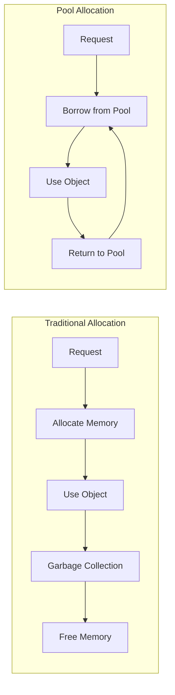
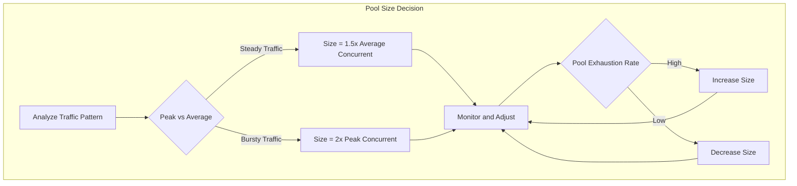
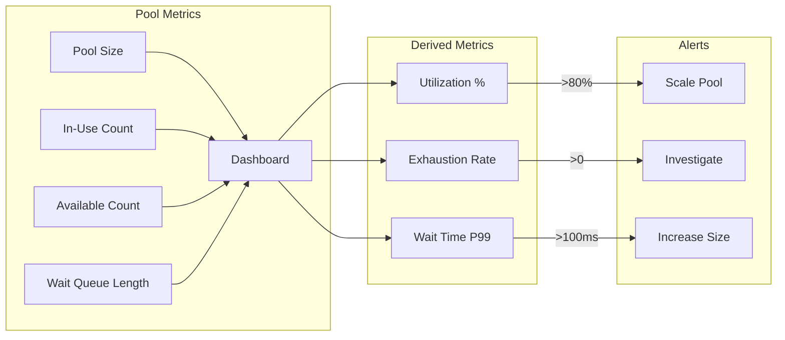

# How to Build Memory Pool Optimization

Author: [nawazdhandala](https://github.com/nawazdhandala)

Tags: Performance, Memory, Optimization, Resources

Description: Learn how to implement memory pools to reduce allocation overhead, prevent fragmentation, and achieve predictable performance in resource-intensive applications.

---

Memory allocation is one of the most expensive operations in any application. Every time you create an object, the runtime must find suitable memory, initialize it, and eventually garbage collect it. For high-throughput systems handling thousands of requests per second, this overhead adds up quickly. Memory pools solve this by pre-allocating objects and reusing them, turning expensive allocations into simple pointer operations.

## What is a Memory Pool?

A memory pool (also called an object pool) is a pre-allocated collection of reusable objects. Instead of creating new objects when needed and destroying them when done, you borrow objects from the pool and return them when finished.



| Approach | Allocation Cost | Memory Fragmentation | GC Pressure | Predictability |
|----------|-----------------|----------------------|-------------|----------------|
| **Traditional** | High per object | Grows over time | High | Unpredictable pauses |
| **Memory Pool** | One-time upfront | Minimal | Low | Consistent latency |

## Why Memory Pools Matter

### The Cost of Allocation

Consider a web server processing 10,000 requests per second, each creating a 4KB buffer:

```javascript
// Without pooling: 10,000 allocations per second
function handleRequest(data) {
  const buffer = Buffer.alloc(4096); // Allocation happens here
  // Process data
  return result;
  // Buffer becomes garbage, GC must clean it
}
```

This creates:
- 10,000 allocations per second
- 40MB of garbage per second
- Frequent GC pauses causing latency spikes

### Benefits of Memory Pools

1. **Reduced allocation overhead**: Borrowing from a pool is a simple array pop operation
2. **Eliminated fragmentation**: Fixed-size blocks prevent memory from becoming scattered
3. **Lower GC pressure**: Objects stay alive, so garbage collector has less work
4. **Predictable latency**: No surprise GC pauses during critical operations

## Basic Memory Pool Implementation

Here is a simple but effective memory pool implementation:

```javascript
// Generic object pool that works with any factory function
class ObjectPool {
  constructor(options) {
    // Factory function to create new objects
    this.factory = options.factory;

    // Function to reset objects before reuse
    this.reset = options.reset || ((obj) => obj);

    // Maximum pool size to prevent unbounded growth
    this.maxSize = options.maxSize || 100;

    // Pre-allocated objects ready for use
    this.available = [];

    // Track objects currently in use (for debugging)
    this.inUse = new Set();

    // Pre-warm the pool if initial size specified
    if (options.initialSize) {
      this.prewarm(options.initialSize);
    }
  }

  // Pre-allocate objects to avoid cold-start latency
  prewarm(count) {
    for (let i = 0; i < count; i++) {
      this.available.push(this.factory());
    }
  }

  // Borrow an object from the pool
  acquire() {
    let obj;

    if (this.available.length > 0) {
      // Reuse existing object
      obj = this.available.pop();
    } else {
      // Pool exhausted, create new object
      obj = this.factory();
    }

    this.inUse.add(obj);
    return obj;
  }

  // Return an object to the pool
  release(obj) {
    if (!this.inUse.has(obj)) {
      throw new Error('Object was not acquired from this pool');
    }

    this.inUse.delete(obj);

    // Reset object state for next use
    this.reset(obj);

    // Only keep object if pool is not at max capacity
    if (this.available.length < this.maxSize) {
      this.available.push(obj);
    }
    // Otherwise, let it be garbage collected
  }

  // Get pool statistics
  stats() {
    return {
      available: this.available.length,
      inUse: this.inUse.size,
      maxSize: this.maxSize,
    };
  }
}
```

## Pool Sizing Strategies

Choosing the right pool size is critical. Too small and you lose the benefits. Too large and you waste memory.



### Strategy 1: Static Sizing

Pre-allocate a fixed number of objects based on expected load:

```javascript
// Calculate pool size based on expected concurrency
function calculatePoolSize(config) {
  const {
    requestsPerSecond,
    avgProcessingTimeMs,
    safetyMultiplier = 1.5
  } = config;

  // Average concurrent requests = RPS * processing time in seconds
  const avgConcurrent = requestsPerSecond * (avgProcessingTimeMs / 1000);

  // Add safety margin for traffic spikes
  return Math.ceil(avgConcurrent * safetyMultiplier);
}

// Example: 1000 RPS, 50ms processing time
const poolSize = calculatePoolSize({
  requestsPerSecond: 1000,
  avgProcessingTimeMs: 50,
  safetyMultiplier: 1.5,
});
// Result: 75 objects in pool

const bufferPool = new ObjectPool({
  factory: () => Buffer.alloc(4096),
  reset: (buf) => buf.fill(0),
  initialSize: poolSize,
  maxSize: poolSize * 2, // Allow growth for spikes
});
```

### Strategy 2: Dynamic Sizing

Adjust pool size based on observed usage:

```javascript
class DynamicPool extends ObjectPool {
  constructor(options) {
    super(options);

    // Track high water mark
    this.peakUsage = 0;

    // Adjustment parameters
    this.growthFactor = options.growthFactor || 1.5;
    this.shrinkThreshold = options.shrinkThreshold || 0.3;
    this.minSize = options.minSize || 10;

    // Periodically adjust pool size
    this.adjustmentInterval = setInterval(
      () => this.adjustSize(),
      options.adjustIntervalMs || 60000
    );
  }

  acquire() {
    const obj = super.acquire();

    // Track peak usage
    if (this.inUse.size > this.peakUsage) {
      this.peakUsage = this.inUse.size;
    }

    return obj;
  }

  adjustSize() {
    const currentMax = this.maxSize;
    const utilization = this.peakUsage / currentMax;

    if (utilization > 0.8) {
      // Pool is heavily used, grow it
      this.maxSize = Math.ceil(currentMax * this.growthFactor);
      console.log(`Pool grew: ${currentMax} -> ${this.maxSize}`);
    } else if (utilization < this.shrinkThreshold && this.maxSize > this.minSize) {
      // Pool is underutilized, shrink it
      const newSize = Math.max(
        this.minSize,
        Math.ceil(this.peakUsage * this.growthFactor)
      );
      this.maxSize = newSize;

      // Trim excess available objects
      while (this.available.length > this.maxSize) {
        this.available.pop();
      }

      console.log(`Pool shrank: ${currentMax} -> ${this.maxSize}`);
    }

    // Reset peak usage for next period
    this.peakUsage = this.inUse.size;
  }

  destroy() {
    clearInterval(this.adjustmentInterval);
  }
}
```

### Strategy 3: Tiered Pools

Use multiple pools for different object sizes:

```javascript
// Tiered buffer pool for varying request sizes
class TieredBufferPool {
  constructor() {
    // Define size tiers
    this.tiers = [
      { size: 1024, pool: this.createPool(1024) },    // 1KB
      { size: 4096, pool: this.createPool(4096) },    // 4KB
      { size: 16384, pool: this.createPool(16384) },  // 16KB
      { size: 65536, pool: this.createPool(65536) },  // 64KB
    ];
  }

  createPool(size) {
    return new ObjectPool({
      factory: () => Buffer.alloc(size),
      reset: (buf) => buf.fill(0),
      initialSize: 20,
      maxSize: 100,
    });
  }

  // Find smallest tier that fits the requested size
  acquire(requestedSize) {
    for (const tier of this.tiers) {
      if (tier.size >= requestedSize) {
        return {
          buffer: tier.pool.acquire(),
          tier: tier,
        };
      }
    }

    // Size too large for any tier, allocate directly
    return {
      buffer: Buffer.alloc(requestedSize),
      tier: null,
    };
  }

  release(handle) {
    if (handle.tier) {
      handle.tier.pool.release(handle.buffer);
    }
    // Non-pooled buffers are garbage collected
  }
}
```

## Object Reuse Patterns

### Pattern 1: Request Context Pool

Pool request context objects in web servers:

```javascript
// Pooled request context
class RequestContext {
  constructor() {
    this.requestId = null;
    this.startTime = 0;
    this.user = null;
    this.params = {};
    this.response = null;
  }

  // Reset for reuse
  reset() {
    this.requestId = null;
    this.startTime = 0;
    this.user = null;

    // Clear params object without reallocating
    for (const key in this.params) {
      delete this.params[key];
    }

    this.response = null;
  }
}

const contextPool = new ObjectPool({
  factory: () => new RequestContext(),
  reset: (ctx) => ctx.reset(),
  initialSize: 100,
  maxSize: 500,
});

// Express middleware using pooled contexts
function pooledContextMiddleware(req, res, next) {
  const ctx = contextPool.acquire();

  ctx.requestId = generateId();
  ctx.startTime = Date.now();

  req.ctx = ctx;

  // Return context to pool when response finishes
  res.on('finish', () => {
    contextPool.release(ctx);
  });

  next();
}
```

### Pattern 2: Connection Pool

Database connections are expensive to create. Pool them:

```javascript
// Simplified connection pool
class ConnectionPool {
  constructor(options) {
    this.createConnection = options.createConnection;
    this.maxConnections = options.maxConnections || 10;
    this.idleTimeoutMs = options.idleTimeoutMs || 30000;

    this.connections = [];
    this.waiting = [];
  }

  async acquire() {
    // Check for available idle connection
    const idle = this.connections.find(c => !c.inUse);

    if (idle) {
      idle.inUse = true;
      idle.lastUsed = Date.now();
      return idle.connection;
    }

    // Create new connection if under limit
    if (this.connections.length < this.maxConnections) {
      const connection = await this.createConnection();
      const wrapper = {
        connection,
        inUse: true,
        lastUsed: Date.now(),
      };
      this.connections.push(wrapper);
      return connection;
    }

    // Wait for a connection to become available
    return new Promise((resolve) => {
      this.waiting.push(resolve);
    });
  }

  release(connection) {
    const wrapper = this.connections.find(c => c.connection === connection);

    if (!wrapper) {
      throw new Error('Connection not from this pool');
    }

    wrapper.inUse = false;
    wrapper.lastUsed = Date.now();

    // If someone is waiting, give them this connection
    if (this.waiting.length > 0) {
      const resolve = this.waiting.shift();
      wrapper.inUse = true;
      resolve(wrapper.connection);
    }
  }

  // Periodic cleanup of idle connections
  cleanup() {
    const now = Date.now();

    this.connections = this.connections.filter(wrapper => {
      if (!wrapper.inUse && now - wrapper.lastUsed > this.idleTimeoutMs) {
        wrapper.connection.close();
        return false;
      }
      return true;
    });
  }
}
```

### Pattern 3: Buffer Ring

Circular buffer for high-frequency, fixed-size allocations:

```javascript
// Ring buffer for streaming data
class BufferRing {
  constructor(bufferCount, bufferSize) {
    this.buffers = [];
    this.readIndex = 0;
    this.writeIndex = 0;
    this.count = bufferCount;

    // Pre-allocate all buffers
    for (let i = 0; i < bufferCount; i++) {
      this.buffers.push(Buffer.alloc(bufferSize));
    }
  }

  // Get next buffer for writing
  getWriteBuffer() {
    const buffer = this.buffers[this.writeIndex];
    this.writeIndex = (this.writeIndex + 1) % this.count;
    return buffer;
  }

  // Get next buffer for reading
  getReadBuffer() {
    const buffer = this.buffers[this.readIndex];
    this.readIndex = (this.readIndex + 1) % this.count;
    return buffer;
  }

  // Check if ring is full
  isFull() {
    return (this.writeIndex + 1) % this.count === this.readIndex;
  }

  // Check if ring is empty
  isEmpty() {
    return this.writeIndex === this.readIndex;
  }
}

// Usage for network packet processing
const packetRing = new BufferRing(64, 1500); // 64 MTU-sized buffers

socket.on('data', (data) => {
  if (!packetRing.isFull()) {
    const buffer = packetRing.getWriteBuffer();
    data.copy(buffer);
    processPacket(buffer);
  } else {
    // Ring full, drop packet or apply backpressure
    console.warn('Buffer ring full, dropping packet');
  }
});
```

## Monitoring Pool Utilization

Effective monitoring tells you if your pool is sized correctly:



### Comprehensive Pool Metrics

```javascript
class MonitoredPool extends ObjectPool {
  constructor(options) {
    super(options);

    this.metrics = {
      acquireCount: 0,
      releaseCount: 0,
      exhaustionCount: 0,
      waitTimeTotal: 0,
      waitCount: 0,
      peakInUse: 0,
    };

    this.waiting = [];
  }

  acquire() {
    this.metrics.acquireCount++;

    if (this.available.length === 0) {
      this.metrics.exhaustionCount++;

      // If pool has max limit and is exhausted, wait
      if (this.inUse.size >= this.maxSize) {
        const startWait = Date.now();

        return new Promise((resolve) => {
          this.waiting.push(() => {
            const waitTime = Date.now() - startWait;
            this.metrics.waitTimeTotal += waitTime;
            this.metrics.waitCount++;

            resolve(super.acquire());
          });
        });
      }
    }

    const obj = super.acquire();

    if (this.inUse.size > this.metrics.peakInUse) {
      this.metrics.peakInUse = this.inUse.size;
    }

    return obj;
  }

  release(obj) {
    super.release(obj);
    this.metrics.releaseCount++;

    // Wake up waiting acquirers
    if (this.waiting.length > 0) {
      const callback = this.waiting.shift();
      callback();
    }
  }

  getMetrics() {
    const avgWaitTime = this.metrics.waitCount > 0
      ? this.metrics.waitTimeTotal / this.metrics.waitCount
      : 0;

    return {
      // Current state
      available: this.available.length,
      inUse: this.inUse.size,
      waiting: this.waiting.length,
      maxSize: this.maxSize,

      // Utilization
      utilizationPercent: (this.inUse.size / this.maxSize) * 100,
      peakUtilizationPercent: (this.metrics.peakInUse / this.maxSize) * 100,

      // Throughput
      totalAcquires: this.metrics.acquireCount,
      totalReleases: this.metrics.releaseCount,

      // Health indicators
      exhaustionCount: this.metrics.exhaustionCount,
      exhaustionRate: this.metrics.exhaustionCount / this.metrics.acquireCount,
      avgWaitTimeMs: avgWaitTime,
    };
  }
}
```

### Prometheus Metrics Integration

```javascript
const prometheus = require('prom-client');

function instrumentPool(pool, poolName) {
  // Gauge for current pool state
  const poolSizeGauge = new prometheus.Gauge({
    name: 'pool_size_total',
    help: 'Total pool capacity',
    labelNames: ['pool'],
  });

  const poolAvailableGauge = new prometheus.Gauge({
    name: 'pool_available',
    help: 'Available objects in pool',
    labelNames: ['pool'],
  });

  const poolInUseGauge = new prometheus.Gauge({
    name: 'pool_in_use',
    help: 'Objects currently borrowed from pool',
    labelNames: ['pool'],
  });

  const poolWaitingGauge = new prometheus.Gauge({
    name: 'pool_waiting',
    help: 'Requests waiting for pool objects',
    labelNames: ['pool'],
  });

  // Counter for pool events
  const poolExhaustionCounter = new prometheus.Counter({
    name: 'pool_exhaustions_total',
    help: 'Number of times pool was exhausted',
    labelNames: ['pool'],
  });

  // Histogram for wait times
  const poolWaitHistogram = new prometheus.Histogram({
    name: 'pool_wait_seconds',
    help: 'Time spent waiting for pool object',
    labelNames: ['pool'],
    buckets: [0.001, 0.005, 0.01, 0.05, 0.1, 0.5, 1],
  });

  // Update metrics periodically
  setInterval(() => {
    const metrics = pool.getMetrics();

    poolSizeGauge.set({ pool: poolName }, metrics.maxSize);
    poolAvailableGauge.set({ pool: poolName }, metrics.available);
    poolInUseGauge.set({ pool: poolName }, metrics.inUse);
    poolWaitingGauge.set({ pool: poolName }, metrics.waiting);
  }, 5000);

  // Wrap acquire to track exhaustions and wait times
  const originalAcquire = pool.acquire.bind(pool);
  pool.acquire = async function() {
    const wasExhausted = pool.available.length === 0;
    const startTime = Date.now();

    const result = await originalAcquire();

    if (wasExhausted) {
      poolExhaustionCounter.inc({ pool: poolName });
      const waitTime = (Date.now() - startTime) / 1000;
      poolWaitHistogram.observe({ pool: poolName }, waitTime);
    }

    return result;
  };

  return pool;
}

// Usage
const bufferPool = instrumentPool(
  new MonitoredPool({
    factory: () => Buffer.alloc(4096),
    reset: (buf) => buf.fill(0),
    initialSize: 50,
    maxSize: 100,
  }),
  'buffer_pool'
);
```

## Common Pitfalls and Solutions

### Pitfall 1: Forgetting to Release

```javascript
// BAD: Object never returned to pool
async function processRequest(data) {
  const buffer = pool.acquire();

  if (!data.valid) {
    return { error: 'Invalid data' }; // Buffer leaked!
  }

  // Use buffer
  pool.release(buffer);
  return result;
}

// GOOD: Use try/finally to guarantee release
async function processRequest(data) {
  const buffer = pool.acquire();

  try {
    if (!data.valid) {
      return { error: 'Invalid data' };
    }

    // Use buffer
    return result;
  } finally {
    pool.release(buffer);
  }
}

// BETTER: Create a wrapper for automatic release
async function withPooledBuffer(fn) {
  const buffer = pool.acquire();

  try {
    return await fn(buffer);
  } finally {
    pool.release(buffer);
  }
}

// Usage
const result = await withPooledBuffer(async (buffer) => {
  // Use buffer safely
  return processData(buffer);
});
```

### Pitfall 2: Incomplete Reset

```javascript
// BAD: Sensitive data persists
const contextPool = new ObjectPool({
  factory: () => ({ user: null, token: null, data: {} }),
  reset: (ctx) => {
    ctx.user = null;
    // token and data are NOT reset!
  },
});

// GOOD: Complete reset
const contextPool = new ObjectPool({
  factory: () => ({ user: null, token: null, data: {} }),
  reset: (ctx) => {
    ctx.user = null;
    ctx.token = null;

    // Clear all properties from data object
    for (const key in ctx.data) {
      delete ctx.data[key];
    }

    return ctx;
  },
});
```

### Pitfall 3: Pool Starvation

```javascript
// BAD: Long-running operations can starve the pool
async function processLargeFile(path) {
  const buffer = pool.acquire();

  // This could take minutes
  await streamFile(path, buffer);

  pool.release(buffer);
}

// GOOD: Use timeout and dedicated pool for long operations
const quickPool = new ObjectPool({ maxSize: 100, /* ... */ });
const longRunningPool = new ObjectPool({ maxSize: 10, /* ... */ });

async function processRequest(req) {
  if (req.isLongRunning) {
    // Use dedicated pool with its own limits
    return withPool(longRunningPool, processLargeFile);
  }

  // Use regular pool for quick operations
  return withPool(quickPool, processQuickly);
}
```

## Summary: Memory Pool Best Practices

| Practice | Description |
|----------|-------------|
| **Right-size your pool** | Base initial size on expected concurrency, allow room to grow |
| **Always release objects** | Use try/finally or wrapper functions to prevent leaks |
| **Reset completely** | Clear all state, especially sensitive data |
| **Monitor utilization** | Track exhaustion rate, wait times, and peak usage |
| **Use tiered pools** | Different pools for different object sizes |
| **Set timeouts** | Prevent pool starvation from long-running operations |
| **Pre-warm pools** | Allocate objects at startup to avoid cold-start latency |
| **Implement backpressure** | Limit waiting queue size to prevent memory exhaustion |

Memory pools are one of the most effective optimization techniques for high-throughput systems. By eliminating per-request allocation overhead and reducing garbage collection pressure, pools enable consistent, predictable performance even under heavy load. Start with simple static pools, measure their effectiveness, and evolve to dynamic sizing as your understanding of traffic patterns grows.
