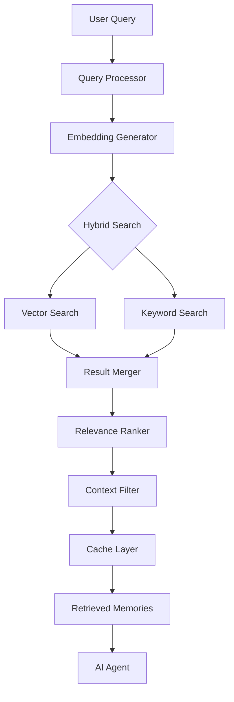
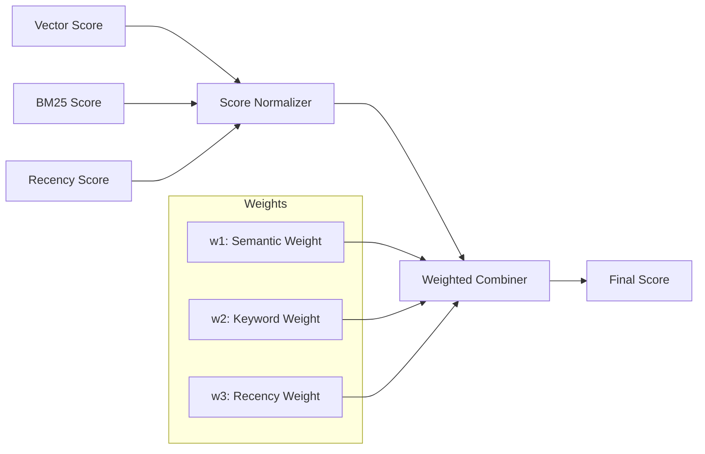
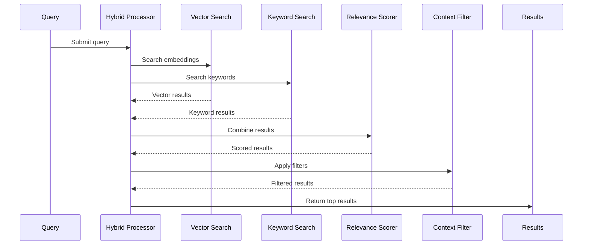
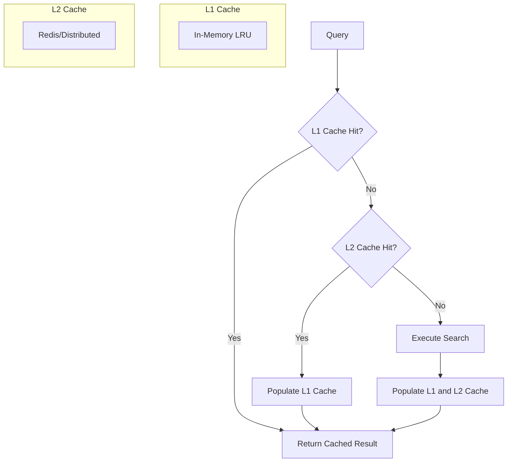

# How to Create Memory Retrieval

Author: [nawazdhandala](https://github.com/nawazdhandala)

Tags: AI Agents, Memory Retrieval, Vector Search, RAG

Description: Learn to implement memory retrieval for AI agents with hybrid search, relevance ranking, and context-aware filtering for accurate knowledge recall.

---

Memory retrieval is the backbone of intelligent AI agents. Without the ability to recall relevant information from past interactions, documents, or knowledge bases, agents become stateless responders rather than contextual assistants. In this guide, we will explore how to build a robust memory retrieval system that enables your AI agents to access the right information at the right time.

## Understanding Memory Retrieval Architecture

Before diving into implementation, let us understand the components of a memory retrieval system.



The architecture consists of several key stages:

1. **Query Processing** - Transforming the user query into searchable formats
2. **Hybrid Search** - Combining vector and keyword search for comprehensive results
3. **Relevance Ranking** - Scoring and ordering results by relevance
4. **Context Filtering** - Applying business rules and context constraints
5. **Caching** - Optimizing repeated queries for performance

## Retrieval Algorithms

### Vector Search with Embeddings

Vector search converts text into high-dimensional vectors and finds similar memories based on semantic meaning. This approach excels at understanding intent rather than matching exact words.

```python
import numpy as np
from typing import List, Tuple
from dataclasses import dataclass

@dataclass
class Memory:
    id: str
    content: str
    embedding: np.ndarray
    metadata: dict
    timestamp: float

class VectorSearchEngine:
    def __init__(self, embedding_model):
        self.embedding_model = embedding_model
        self.memories: List[Memory] = []
        self.index = None

    def add_memory(self, memory: Memory):
        """Add a memory to the search index."""
        self.memories.append(memory)
        self._rebuild_index()

    def _rebuild_index(self):
        """Rebuild the vector index for efficient search."""
        if not self.memories:
            return

        # Stack all embeddings into a matrix
        embeddings = np.stack([m.embedding for m in self.memories])

        # Normalize for cosine similarity
        norms = np.linalg.norm(embeddings, axis=1, keepdims=True)
        self.index = embeddings / norms

    def search(self, query: str, top_k: int = 10) -> List[Tuple[Memory, float]]:
        """Search for memories similar to the query."""
        # Generate query embedding
        query_embedding = self.embedding_model.encode(query)
        query_embedding = query_embedding / np.linalg.norm(query_embedding)

        # Compute cosine similarities
        similarities = np.dot(self.index, query_embedding)

        # Get top-k indices
        top_indices = np.argsort(similarities)[::-1][:top_k]

        # Return memories with scores
        results = []
        for idx in top_indices:
            results.append((self.memories[idx], float(similarities[idx])))

        return results
```

This implementation uses cosine similarity to measure how close two vectors are in the embedding space. The closer the vectors, the more semantically similar the content.

### BM25 Keyword Search

While vector search captures semantic meaning, keyword search ensures exact term matches are not missed. BM25 (Best Matching 25) is a probabilistic ranking function that considers term frequency and document length.

```python
import math
from collections import Counter
from typing import List, Dict

class BM25SearchEngine:
    def __init__(self, k1: float = 1.5, b: float = 0.75):
        self.k1 = k1  # Term frequency saturation parameter
        self.b = b    # Length normalization parameter
        self.documents: List[Dict] = []
        self.doc_lengths: List[int] = []
        self.avg_doc_length: float = 0
        self.idf_scores: Dict[str, float] = {}
        self.term_frequencies: List[Counter] = []

    def _tokenize(self, text: str) -> List[str]:
        """Simple tokenization - split and lowercase."""
        return text.lower().split()

    def add_documents(self, documents: List[Dict]):
        """Index documents for BM25 search."""
        self.documents = documents

        # Calculate term frequencies for each document
        for doc in documents:
            tokens = self._tokenize(doc['content'])
            self.term_frequencies.append(Counter(tokens))
            self.doc_lengths.append(len(tokens))

        self.avg_doc_length = sum(self.doc_lengths) / len(self.doc_lengths)

        # Calculate IDF scores
        self._calculate_idf()

    def _calculate_idf(self):
        """Calculate inverse document frequency for all terms."""
        N = len(self.documents)
        all_terms = set()

        for tf in self.term_frequencies:
            all_terms.update(tf.keys())

        for term in all_terms:
            # Count documents containing the term
            doc_count = sum(1 for tf in self.term_frequencies if term in tf)
            # IDF formula with smoothing
            self.idf_scores[term] = math.log((N - doc_count + 0.5) / (doc_count + 0.5) + 1)

    def search(self, query: str, top_k: int = 10) -> List[Tuple[Dict, float]]:
        """Search documents using BM25 scoring."""
        query_terms = self._tokenize(query)
        scores = []

        for idx, doc in enumerate(self.documents):
            score = 0
            doc_length = self.doc_lengths[idx]
            tf = self.term_frequencies[idx]

            for term in query_terms:
                if term not in self.idf_scores:
                    continue

                term_freq = tf.get(term, 0)
                idf = self.idf_scores[term]

                # BM25 scoring formula
                numerator = term_freq * (self.k1 + 1)
                denominator = term_freq + self.k1 * (1 - self.b + self.b * (doc_length / self.avg_doc_length))
                score += idf * (numerator / denominator)

            scores.append((doc, score))

        # Sort by score descending
        scores.sort(key=lambda x: x[1], reverse=True)
        return scores[:top_k]
```

BM25 handles scenarios where users search for specific terms, product names, or technical identifiers that might not be captured well by semantic embeddings alone.

## Relevance Scoring

Combining multiple retrieval methods requires a unified scoring system. Here is how to implement a relevance scorer that weighs different signals.



```python
import time
from typing import List, Tuple, Optional
from dataclasses import dataclass

@dataclass
class ScoredResult:
    memory_id: str
    content: str
    vector_score: float
    keyword_score: float
    recency_score: float
    final_score: float
    metadata: dict

class RelevanceScorer:
    def __init__(
        self,
        semantic_weight: float = 0.5,
        keyword_weight: float = 0.3,
        recency_weight: float = 0.2,
        recency_decay_hours: float = 168  # 1 week
    ):
        self.semantic_weight = semantic_weight
        self.keyword_weight = keyword_weight
        self.recency_weight = recency_weight
        self.recency_decay_hours = recency_decay_hours

    def _normalize_scores(self, scores: List[float]) -> List[float]:
        """Normalize scores to 0-1 range using min-max normalization."""
        if not scores:
            return []

        min_score = min(scores)
        max_score = max(scores)

        if max_score == min_score:
            return [1.0] * len(scores)

        return [(s - min_score) / (max_score - min_score) for s in scores]

    def _calculate_recency_score(self, timestamp: float) -> float:
        """Calculate recency score with exponential decay."""
        current_time = time.time()
        hours_ago = (current_time - timestamp) / 3600

        # Exponential decay formula
        decay_rate = 0.693 / self.recency_decay_hours  # ln(2) / half-life
        return math.exp(-decay_rate * hours_ago)

    def score_results(
        self,
        vector_results: List[Tuple[Memory, float]],
        keyword_results: List[Tuple[Dict, float]]
    ) -> List[ScoredResult]:
        """Combine and score results from multiple retrieval methods."""

        # Create a unified result set
        all_ids = set()
        results_map = {}

        # Process vector search results
        for memory, score in vector_results:
            all_ids.add(memory.id)
            results_map[memory.id] = {
                'content': memory.content,
                'vector_score': score,
                'keyword_score': 0.0,
                'timestamp': memory.timestamp,
                'metadata': memory.metadata
            }

        # Merge keyword search results
        for doc, score in keyword_results:
            doc_id = doc['id']
            if doc_id in results_map:
                results_map[doc_id]['keyword_score'] = score
            else:
                all_ids.add(doc_id)
                results_map[doc_id] = {
                    'content': doc['content'],
                    'vector_score': 0.0,
                    'keyword_score': score,
                    'timestamp': doc.get('timestamp', time.time()),
                    'metadata': doc.get('metadata', {})
                }

        # Normalize scores
        vector_scores = [results_map[id]['vector_score'] for id in all_ids]
        keyword_scores = [results_map[id]['keyword_score'] for id in all_ids]

        norm_vector = dict(zip(all_ids, self._normalize_scores(vector_scores)))
        norm_keyword = dict(zip(all_ids, self._normalize_scores(keyword_scores)))

        # Calculate final scores
        scored_results = []
        for memory_id in all_ids:
            data = results_map[memory_id]
            recency_score = self._calculate_recency_score(data['timestamp'])

            final_score = (
                self.semantic_weight * norm_vector[memory_id] +
                self.keyword_weight * norm_keyword[memory_id] +
                self.recency_weight * recency_score
            )

            scored_results.append(ScoredResult(
                memory_id=memory_id,
                content=data['content'],
                vector_score=norm_vector[memory_id],
                keyword_score=norm_keyword[memory_id],
                recency_score=recency_score,
                final_score=final_score,
                metadata=data['metadata']
            ))

        # Sort by final score
        scored_results.sort(key=lambda x: x.final_score, reverse=True)
        return scored_results
```

The relevance scorer allows you to tune the balance between semantic understanding, exact matching, and temporal relevance based on your application needs.

## Hybrid Search Implementation

Now let us bring everything together into a unified hybrid search system.



```python
from typing import List, Optional, Callable
from enum import Enum

class SearchMode(Enum):
    VECTOR_ONLY = "vector"
    KEYWORD_ONLY = "keyword"
    HYBRID = "hybrid"

class HybridSearchEngine:
    def __init__(
        self,
        vector_engine: VectorSearchEngine,
        keyword_engine: BM25SearchEngine,
        relevance_scorer: RelevanceScorer
    ):
        self.vector_engine = vector_engine
        self.keyword_engine = keyword_engine
        self.relevance_scorer = relevance_scorer
        self.filters: List[Callable] = []

    def add_filter(self, filter_func: Callable[[ScoredResult], bool]):
        """Add a context filter to the search pipeline."""
        self.filters.append(filter_func)

    def search(
        self,
        query: str,
        mode: SearchMode = SearchMode.HYBRID,
        top_k: int = 10,
        vector_candidates: int = 50,
        keyword_candidates: int = 50
    ) -> List[ScoredResult]:
        """
        Perform hybrid search combining vector and keyword retrieval.

        Args:
            query: The search query
            mode: Search mode - vector only, keyword only, or hybrid
            top_k: Number of final results to return
            vector_candidates: Number of candidates from vector search
            keyword_candidates: Number of candidates from keyword search

        Returns:
            List of scored and filtered results
        """
        vector_results = []
        keyword_results = []

        # Perform searches based on mode
        if mode in [SearchMode.VECTOR_ONLY, SearchMode.HYBRID]:
            vector_results = self.vector_engine.search(query, vector_candidates)

        if mode in [SearchMode.KEYWORD_ONLY, SearchMode.HYBRID]:
            keyword_results = self.keyword_engine.search(query, keyword_candidates)

        # Score and combine results
        scored_results = self.relevance_scorer.score_results(
            vector_results, keyword_results
        )

        # Apply context filters
        filtered_results = self._apply_filters(scored_results)

        return filtered_results[:top_k]

    def _apply_filters(self, results: List[ScoredResult]) -> List[ScoredResult]:
        """Apply all registered filters to the results."""
        filtered = results

        for filter_func in self.filters:
            filtered = [r for r in filtered if filter_func(r)]

        return filtered
```

## Context-Aware Filtering

Context filtering ensures that retrieved memories are appropriate for the current situation. This includes user permissions, time constraints, and relevance boundaries.

```python
from datetime import datetime, timedelta
from typing import Set, Optional

class ContextFilter:
    """Filter results based on contextual constraints."""

    @staticmethod
    def by_user_access(allowed_users: Set[str]):
        """Filter memories to those accessible by specific users."""
        def filter_func(result: ScoredResult) -> bool:
            owner = result.metadata.get('owner')
            shared_with = set(result.metadata.get('shared_with', []))
            is_public = result.metadata.get('is_public', False)

            if is_public:
                return True

            return owner in allowed_users or bool(allowed_users & shared_with)

        return filter_func

    @staticmethod
    def by_time_range(
        start_time: Optional[datetime] = None,
        end_time: Optional[datetime] = None
    ):
        """Filter memories within a specific time range."""
        def filter_func(result: ScoredResult) -> bool:
            timestamp = result.metadata.get('created_at')
            if not timestamp:
                return True

            if isinstance(timestamp, (int, float)):
                memory_time = datetime.fromtimestamp(timestamp)
            else:
                memory_time = timestamp

            if start_time and memory_time < start_time:
                return False
            if end_time and memory_time > end_time:
                return False

            return True

        return filter_func

    @staticmethod
    def by_category(categories: Set[str]):
        """Filter memories by category tags."""
        def filter_func(result: ScoredResult) -> bool:
            memory_categories = set(result.metadata.get('categories', []))
            return bool(categories & memory_categories)

        return filter_func

    @staticmethod
    def by_minimum_score(min_score: float):
        """Filter out results below a relevance threshold."""
        def filter_func(result: ScoredResult) -> bool:
            return result.final_score >= min_score

        return filter_func

    @staticmethod
    def by_content_type(content_types: Set[str]):
        """Filter by content type - text, code, image description, etc."""
        def filter_func(result: ScoredResult) -> bool:
            content_type = result.metadata.get('content_type', 'text')
            return content_type in content_types

        return filter_func

# Usage example
search_engine = HybridSearchEngine(vector_engine, keyword_engine, scorer)

# Add context-aware filters
search_engine.add_filter(ContextFilter.by_user_access({'user_123', 'admin'}))
search_engine.add_filter(ContextFilter.by_time_range(
    start_time=datetime.now() - timedelta(days=30)
))
search_engine.add_filter(ContextFilter.by_minimum_score(0.3))
```

## Caching for Performance

Caching dramatically improves performance for repeated or similar queries. Here is a multi-layer caching strategy.



```python
import hashlib
import json
import time
from typing import Optional, Any
from collections import OrderedDict
from functools import wraps

class LRUCache:
    """Simple LRU cache implementation for L1 caching."""

    def __init__(self, max_size: int = 1000, ttl_seconds: int = 300):
        self.cache: OrderedDict = OrderedDict()
        self.max_size = max_size
        self.ttl_seconds = ttl_seconds

    def _make_key(self, query: str, filters: dict) -> str:
        """Create a cache key from query and filters."""
        key_data = json.dumps({'query': query, 'filters': filters}, sort_keys=True)
        return hashlib.sha256(key_data.encode()).hexdigest()

    def get(self, query: str, filters: dict) -> Optional[Any]:
        """Retrieve a cached result if it exists and is not expired."""
        key = self._make_key(query, filters)

        if key not in self.cache:
            return None

        entry = self.cache[key]

        # Check if expired
        if time.time() - entry['timestamp'] > self.ttl_seconds:
            del self.cache[key]
            return None

        # Move to end (most recently used)
        self.cache.move_to_end(key)
        return entry['value']

    def set(self, query: str, filters: dict, value: Any):
        """Store a result in the cache."""
        key = self._make_key(query, filters)

        # Remove oldest entry if at capacity
        if len(self.cache) >= self.max_size:
            self.cache.popitem(last=False)

        self.cache[key] = {
            'value': value,
            'timestamp': time.time()
        }

class CachedSearchEngine:
    """Wrapper that adds caching to any search engine."""

    def __init__(
        self,
        search_engine: HybridSearchEngine,
        l1_cache: Optional[LRUCache] = None,
        l2_cache = None  # Redis client or similar
    ):
        self.search_engine = search_engine
        self.l1_cache = l1_cache or LRUCache()
        self.l2_cache = l2_cache

        # Metrics
        self.hits = 0
        self.misses = 0

    def _serialize_filters(self) -> dict:
        """Serialize current filter configuration for cache key."""
        return {'filter_count': len(self.search_engine.filters)}

    def search(
        self,
        query: str,
        mode: SearchMode = SearchMode.HYBRID,
        top_k: int = 10,
        bypass_cache: bool = False
    ) -> List[ScoredResult]:
        """Search with caching support."""

        filters = self._serialize_filters()

        if not bypass_cache:
            # Try L1 cache first
            cached = self.l1_cache.get(query, filters)
            if cached is not None:
                self.hits += 1
                return cached

            # Try L2 cache if available
            if self.l2_cache:
                l2_cached = self._get_from_l2(query, filters)
                if l2_cached is not None:
                    self.hits += 1
                    self.l1_cache.set(query, filters, l2_cached)
                    return l2_cached

        # Cache miss - execute search
        self.misses += 1
        results = self.search_engine.search(query, mode, top_k)

        # Populate caches
        self.l1_cache.set(query, filters, results)
        if self.l2_cache:
            self._set_to_l2(query, filters, results)

        return results

    def _get_from_l2(self, query: str, filters: dict) -> Optional[List[ScoredResult]]:
        """Retrieve from L2 cache (implementation depends on cache backend)."""
        # Example with Redis
        # key = self._make_l2_key(query, filters)
        # data = self.l2_cache.get(key)
        # return json.loads(data) if data else None
        pass

    def _set_to_l2(self, query: str, filters: dict, results: List[ScoredResult]):
        """Store in L2 cache (implementation depends on cache backend)."""
        # Example with Redis
        # key = self._make_l2_key(query, filters)
        # self.l2_cache.setex(key, 3600, json.dumps(results))
        pass

    def get_cache_stats(self) -> dict:
        """Return cache performance statistics."""
        total = self.hits + self.misses
        hit_rate = self.hits / total if total > 0 else 0

        return {
            'hits': self.hits,
            'misses': self.misses,
            'hit_rate': hit_rate,
            'l1_size': len(self.l1_cache.cache)
        }

    def invalidate_cache(self):
        """Clear all cached results."""
        self.l1_cache.cache.clear()
        if self.l2_cache:
            # Implement L2 cache invalidation based on backend
            pass
```

## Putting It All Together

Here is a complete example showing how to build and use a memory retrieval system for an AI agent.

```python
from sentence_transformers import SentenceTransformer
import uuid

# Initialize components
embedding_model = SentenceTransformer('all-MiniLM-L6-v2')

# Create search engines
vector_engine = VectorSearchEngine(embedding_model)
keyword_engine = BM25SearchEngine()

# Create relevance scorer with custom weights
scorer = RelevanceScorer(
    semantic_weight=0.5,
    keyword_weight=0.3,
    recency_weight=0.2
)

# Create hybrid search engine
hybrid_engine = HybridSearchEngine(vector_engine, keyword_engine, scorer)

# Add context filters
hybrid_engine.add_filter(ContextFilter.by_minimum_score(0.25))

# Wrap with caching
cached_engine = CachedSearchEngine(hybrid_engine)

# Store some memories
memories_data = [
    {
        'content': 'The user prefers dark mode in all applications.',
        'categories': ['preferences'],
        'owner': 'user_123'
    },
    {
        'content': 'Meeting scheduled with engineering team on Monday at 2 PM.',
        'categories': ['calendar', 'meetings'],
        'owner': 'user_123'
    },
    {
        'content': 'The project deadline for Q1 release is March 15th.',
        'categories': ['projects', 'deadlines'],
        'owner': 'user_123'
    }
]

for data in memories_data:
    memory = Memory(
        id=str(uuid.uuid4()),
        content=data['content'],
        embedding=embedding_model.encode(data['content']),
        metadata={
            'categories': data['categories'],
            'owner': data['owner'],
            'created_at': time.time()
        },
        timestamp=time.time()
    )
    vector_engine.add_memory(memory)

# Add to keyword engine
keyword_engine.add_documents([
    {'id': m.id, 'content': m.content, **m.metadata}
    for m in vector_engine.memories
])

# Search for relevant memories
query = "What are the upcoming deadlines?"
results = cached_engine.search(query, top_k=5)

for result in results:
    print(f"Score: {result.final_score:.3f}")
    print(f"Content: {result.content}")
    print(f"Vector: {result.vector_score:.3f}, Keyword: {result.keyword_score:.3f}")
    print("---")
```

## Best Practices

When implementing memory retrieval for AI agents, keep these principles in mind:

1. **Start with hybrid search** - Pure vector search misses exact matches, while pure keyword search misses semantic similarities. Combine both for best results.

2. **Tune weights empirically** - The optimal balance between semantic, keyword, and recency weights depends on your use case. Test with real queries and adjust.

3. **Set appropriate thresholds** - Filter out low-relevance results to avoid polluting the agent context with noise.

4. **Cache aggressively** - Many queries are repeated or similar. Caching dramatically reduces latency and compute costs.

5. **Monitor and iterate** - Track which memories are retrieved and whether they help the agent. Use this feedback to improve your system.

6. **Consider memory decay** - Not all memories are equally valuable over time. Recent interactions may be more relevant than old ones.

7. **Implement graceful degradation** - If vector search fails, fall back to keyword search. Always have a backup path.

## Conclusion

Building effective memory retrieval for AI agents requires combining multiple techniques - vector search for semantic understanding, keyword search for exact matches, relevance scoring for prioritization, and caching for performance. By implementing these patterns, you can create agents that intelligently recall relevant information from vast knowledge bases, leading to more contextual and helpful interactions.

The code examples in this guide provide a foundation you can adapt to your specific needs. Start simple, measure performance, and iterate based on real usage patterns. Memory retrieval is not a solved problem - it requires continuous tuning and improvement as your agent learns and grows.
