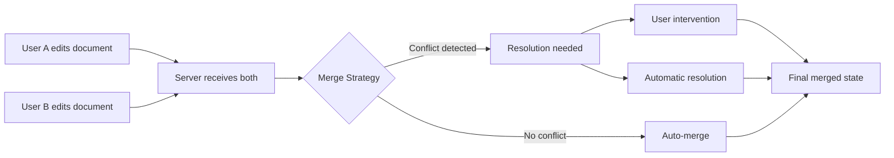
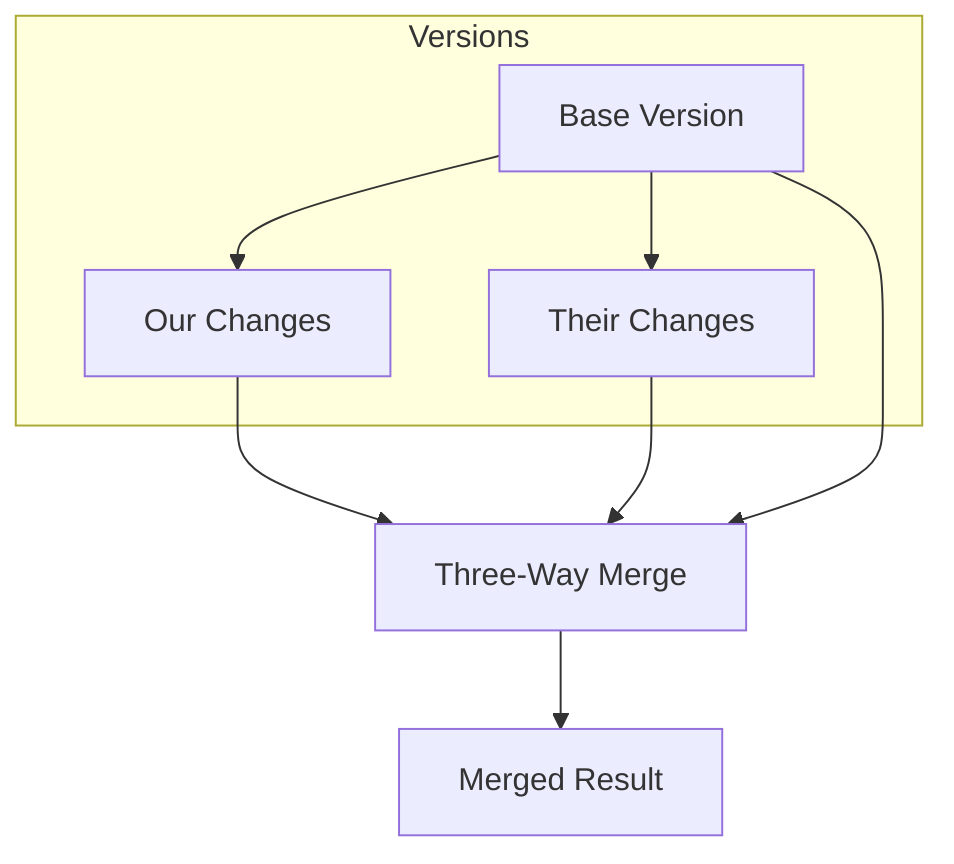
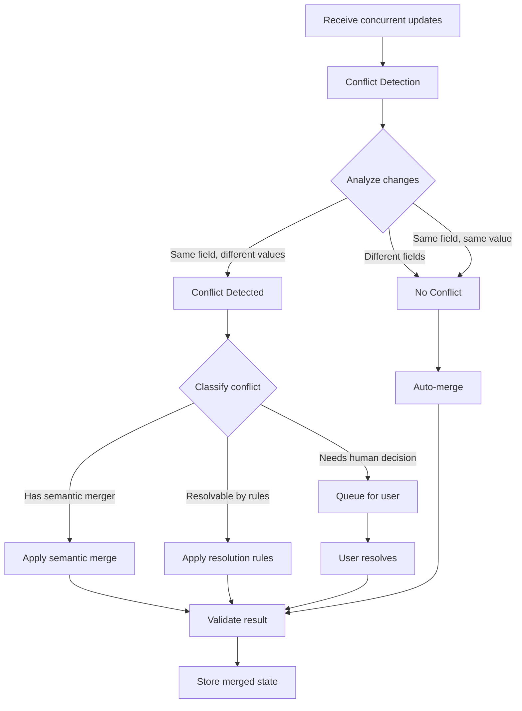
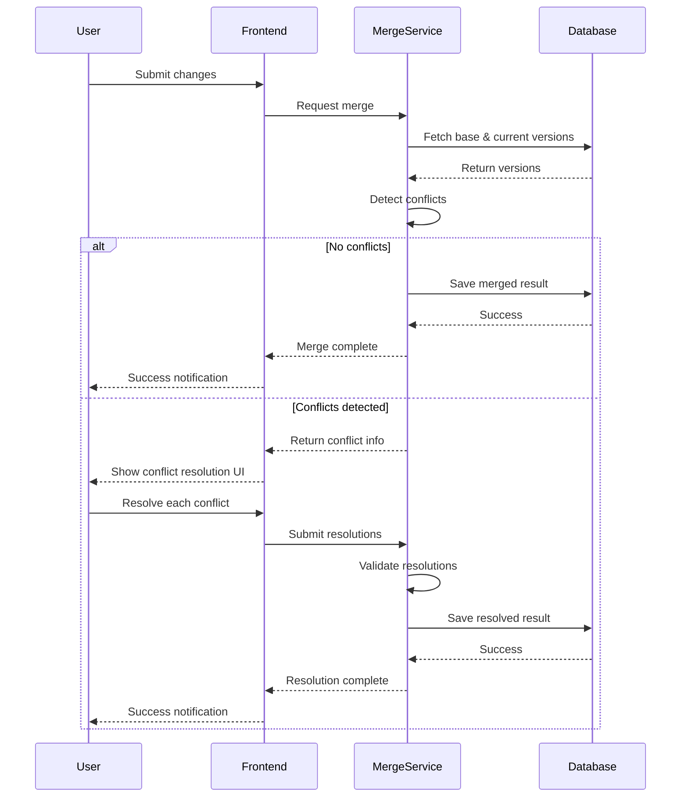

# How to Create Merge Strategies

Author: [nawazdhandala](https://github.com/nawazdhandala)

Tags: Distributed Systems, Conflict Resolution, Version Control, Database

Description: Learn how to implement merge strategies for handling concurrent updates.

---

In distributed systems and collaborative applications, concurrent updates are inevitable. When two or more actors modify the same data simultaneously, you need a deterministic way to reconcile those changes. This guide walks through the theory and implementation of merge strategies, from classic three-way merges to custom semantic merging, conflict detection, and user intervention workflows.

---

## Table of Contents

1. Why Merge Strategies Matter
2. Three-Way Merge
3. Semantic Merging
4. Custom Merge Functions
5. Conflict Detection
6. User Intervention Workflows
7. Merge Validation
8. Putting It All Together
9. Best Practices

---

## 1. Why Merge Strategies Matter

When multiple users or processes modify the same resource concurrently, you face three choices:

1. **Last-write-wins (LWW)**: Simple but lossy. Data from earlier writes is silently discarded.
2. **Pessimistic locking**: Safe but slow. Users wait for locks, reducing throughput and UX.
3. **Merge strategies**: Best of both worlds. Accept concurrent writes and intelligently combine them.

Modern systems like Git, Google Docs, CRDTs, and database replication all rely on merge strategies. Understanding how to build them gives you fine-grained control over data consistency in your applications.



---

## 2. Three-Way Merge

The three-way merge is the foundation of most merge algorithms. It compares three versions:

- **Base**: The common ancestor (the version both changes branched from)
- **Ours**: Our local changes
- **Theirs**: The remote/other changes

### How It Works



The algorithm:
1. Find differences between Base and Ours (our delta)
2. Find differences between Base and Theirs (their delta)
3. If deltas touch different regions, apply both
4. If deltas touch the same region, mark as conflict

### Implementation

```typescript
interface MergeResult<T> {
  success: boolean;
  result?: T;
  conflicts?: Conflict[];
}

interface Conflict {
  path: string;
  base: any;
  ours: any;
  theirs: any;
}

function threeWayMerge<T extends Record<string, any>>(
  base: T,
  ours: T,
  theirs: T
): MergeResult<T> {
  const conflicts: Conflict[] = [];
  const result: Record<string, any> = { ...base };

  // Get all keys from all three versions
  const allKeys = new Set([
    ...Object.keys(base),
    ...Object.keys(ours),
    ...Object.keys(theirs),
  ]);

  for (const key of allKeys) {
    const baseVal = base[key];
    const oursVal = ours[key];
    const theirsVal = theirs[key];

    const oursChanged = !deepEqual(baseVal, oursVal);
    const theirsChanged = !deepEqual(baseVal, theirsVal);

    if (!oursChanged && !theirsChanged) {
      // No changes - keep base
      result[key] = baseVal;
    } else if (oursChanged && !theirsChanged) {
      // Only we changed - take ours
      result[key] = oursVal;
    } else if (!oursChanged && theirsChanged) {
      // Only they changed - take theirs
      result[key] = theirsVal;
    } else if (deepEqual(oursVal, theirsVal)) {
      // Both changed to same value - no conflict
      result[key] = oursVal;
    } else {
      // Both changed to different values - conflict!
      conflicts.push({
        path: key,
        base: baseVal,
        ours: oursVal,
        theirs: theirsVal,
      });
    }
  }

  if (conflicts.length > 0) {
    return { success: false, conflicts };
  }

  return { success: true, result: result as T };
}

function deepEqual(a: any, b: any): boolean {
  if (a === b) return true;
  if (typeof a !== typeof b) return false;
  if (typeof a !== 'object' || a === null) return false;

  const keysA = Object.keys(a);
  const keysB = Object.keys(b);
  if (keysA.length !== keysB.length) return false;

  return keysA.every(key => deepEqual(a[key], b[key]));
}
```

### Example Usage

```typescript
const base = { title: "Hello", count: 5, status: "draft" };
const ours = { title: "Hello World", count: 5, status: "draft" };
const theirs = { title: "Hello", count: 10, status: "published" };

const result = threeWayMerge(base, ours, theirs);
// Result: { success: true, result: { title: "Hello World", count: 10, status: "published" } }
// No conflicts because changes were to different fields
```

---

## 3. Semantic Merging

Three-way merge works at the structural level, but sometimes you need domain-aware merging. Semantic merging understands the meaning of your data and can make intelligent decisions.

### Common Semantic Merge Strategies

| Strategy | Use Case | Example |
|----------|----------|---------|
| Sum | Counters, quantities | Inventory adjustments |
| Union | Sets, tags, permissions | User roles |
| Max/Min | Timestamps, versions | Last-modified tracking |
| Concatenate | Lists, logs | Event histories |
| Priority | Status fields | Workflow states |

### Implementation

```typescript
type SemanticMerger<T> = (base: T, ours: T, theirs: T) => T;

interface FieldMergers {
  [key: string]: SemanticMerger<any>;
}

function semanticMerge<T extends Record<string, any>>(
  base: T,
  ours: T,
  theirs: T,
  mergers: FieldMergers
): T {
  const result: Record<string, any> = {};

  const allKeys = new Set([
    ...Object.keys(base),
    ...Object.keys(ours),
    ...Object.keys(theirs),
  ]);

  for (const key of allKeys) {
    if (mergers[key]) {
      // Use custom semantic merger for this field
      result[key] = mergers[key](base[key], ours[key], theirs[key]);
    } else {
      // Fall back to last-write-wins for unspecified fields
      result[key] = theirs[key] ?? ours[key] ?? base[key];
    }
  }

  return result as T;
}

// Built-in semantic mergers
const sumMerger: SemanticMerger<number> = (base, ours, theirs) => {
  const oursDelta = (ours ?? 0) - (base ?? 0);
  const theirsDelta = (theirs ?? 0) - (base ?? 0);
  return (base ?? 0) + oursDelta + theirsDelta;
};

const unionMerger: SemanticMerger<string[]> = (base, ours, theirs) => {
  const baseSet = new Set(base ?? []);
  const oursSet = new Set(ours ?? []);
  const theirsSet = new Set(theirs ?? []);

  // Items added by either side
  const added = new Set([
    ...[...oursSet].filter(x => !baseSet.has(x)),
    ...[...theirsSet].filter(x => !baseSet.has(x)),
  ]);

  // Items removed by both sides only
  const removedByOurs = [...baseSet].filter(x => !oursSet.has(x));
  const removedByTheirs = [...baseSet].filter(x => !theirsSet.has(x));
  const removed = new Set(removedByOurs.filter(x => removedByTheirs.includes(x)));

  // Final: base + added - removed
  return [...baseSet, ...added].filter(x => !removed.has(x));
};

const maxMerger: SemanticMerger<number> = (base, ours, theirs) => {
  return Math.max(base ?? 0, ours ?? 0, theirs ?? 0);
};

const priorityMerger = (priorities: string[]): SemanticMerger<string> => {
  return (base, ours, theirs) => {
    const oursPriority = priorities.indexOf(ours);
    const theirsPriority = priorities.indexOf(theirs);

    // Higher index = higher priority
    if (oursPriority >= theirsPriority) return ours;
    return theirs;
  };
};
```

### Example: Inventory System

```typescript
interface InventoryItem {
  sku: string;
  quantity: number;
  reservedQuantity: number;
  tags: string[];
  lastUpdated: number;
  status: 'active' | 'low_stock' | 'out_of_stock';
}

const inventoryMergers: FieldMergers = {
  quantity: sumMerger,
  reservedQuantity: sumMerger,
  tags: unionMerger,
  lastUpdated: maxMerger,
  status: priorityMerger(['active', 'low_stock', 'out_of_stock']),
};

// Warehouse A decrements by 5, Warehouse B decrements by 3
const base: InventoryItem = {
  sku: 'WIDGET-001',
  quantity: 100,
  reservedQuantity: 10,
  tags: ['electronics', 'popular'],
  lastUpdated: 1706600000000,
  status: 'active',
};

const warehouseA: InventoryItem = {
  sku: 'WIDGET-001',
  quantity: 95,  // -5
  reservedQuantity: 15,  // +5 reserved
  tags: ['electronics', 'popular', 'sale'],  // added 'sale'
  lastUpdated: 1706600001000,
  status: 'active',
};

const warehouseB: InventoryItem = {
  sku: 'WIDGET-001',
  quantity: 97,  // -3
  reservedQuantity: 8,  // -2 released
  tags: ['electronics', 'popular', 'warehouse-b'],  // added 'warehouse-b'
  lastUpdated: 1706600002000,
  status: 'low_stock',
};

const merged = semanticMerge(base, warehouseA, warehouseB, inventoryMergers);
// Result:
// {
//   sku: 'WIDGET-001',
//   quantity: 92,  // 100 - 5 - 3 = 92
//   reservedQuantity: 13,  // 10 + 5 - 2 = 13
//   tags: ['electronics', 'popular', 'sale', 'warehouse-b'],
//   lastUpdated: 1706600002000,  // max timestamp
//   status: 'low_stock',  // higher priority status wins
// }
```

---

## 4. Custom Merge Functions

For complex domain logic, you need fully custom merge functions. These give you complete control over how conflicts are resolved.

### Pattern: Strategy Registry

```typescript
type MergeStrategy<T> = {
  name: string;
  canMerge: (base: T, ours: T, theirs: T) => boolean;
  merge: (base: T, ours: T, theirs: T) => MergeResult<T>;
};

class MergeStrategyRegistry<T> {
  private strategies: MergeStrategy<T>[] = [];
  private fallback: MergeStrategy<T>;

  constructor(fallback: MergeStrategy<T>) {
    this.fallback = fallback;
  }

  register(strategy: MergeStrategy<T>): void {
    this.strategies.push(strategy);
  }

  merge(base: T, ours: T, theirs: T): MergeResult<T> {
    for (const strategy of this.strategies) {
      if (strategy.canMerge(base, ours, theirs)) {
        console.log(`Using strategy: ${strategy.name}`);
        return strategy.merge(base, ours, theirs);
      }
    }

    console.log(`Using fallback strategy: ${this.fallback.name}`);
    return this.fallback.merge(base, ours, theirs);
  }
}
```

### Example: Document Merge Strategies

```typescript
interface Document {
  id: string;
  title: string;
  content: string;
  sections: Section[];
  metadata: {
    author: string;
    lastModified: number;
    version: number;
  };
}

interface Section {
  id: string;
  title: string;
  body: string;
  order: number;
}

// Strategy 1: Section-level merge (non-overlapping section edits)
const sectionMergeStrategy: MergeStrategy<Document> = {
  name: 'section-merge',

  canMerge: (base, ours, theirs) => {
    const oursEditedSections = getEditedSectionIds(base, ours);
    const theirsEditedSections = getEditedSectionIds(base, theirs);

    // Can merge if no overlapping section edits
    const overlap = oursEditedSections.filter(id =>
      theirsEditedSections.includes(id)
    );
    return overlap.length === 0;
  },

  merge: (base, ours, theirs) => {
    const oursEditedIds = new Set(getEditedSectionIds(base, ours));
    const theirsEditedIds = new Set(getEditedSectionIds(base, theirs));

    const mergedSections = base.sections.map(baseSection => {
      if (oursEditedIds.has(baseSection.id)) {
        return ours.sections.find(s => s.id === baseSection.id)!;
      }
      if (theirsEditedIds.has(baseSection.id)) {
        return theirs.sections.find(s => s.id === baseSection.id)!;
      }
      return baseSection;
    });

    // Handle new sections
    const baseIds = new Set(base.sections.map(s => s.id));
    const oursNew = ours.sections.filter(s => !baseIds.has(s.id));
    const theirsNew = theirs.sections.filter(s => !baseIds.has(s.id));

    return {
      success: true,
      result: {
        ...base,
        sections: [...mergedSections, ...oursNew, ...theirsNew],
        metadata: {
          ...base.metadata,
          lastModified: Math.max(
            ours.metadata.lastModified,
            theirs.metadata.lastModified
          ),
          version: base.metadata.version + 1,
        },
      },
    };
  },
};

// Strategy 2: Operational transformation for text
const operationalTransformStrategy: MergeStrategy<Document> = {
  name: 'operational-transform',

  canMerge: (base, ours, theirs) => {
    // Only for simple text content changes
    return base.sections.length === ours.sections.length &&
           base.sections.length === theirs.sections.length;
  },

  merge: (base, ours, theirs) => {
    const mergedSections = base.sections.map((baseSection, i) => {
      const oursSection = ours.sections[i];
      const theirsSection = theirs.sections[i];

      return {
        ...baseSection,
        body: transformText(baseSection.body, oursSection.body, theirsSection.body),
      };
    });

    return {
      success: true,
      result: {
        ...base,
        sections: mergedSections,
        metadata: {
          ...base.metadata,
          lastModified: Date.now(),
          version: base.metadata.version + 1,
        },
      },
    };
  },
};

function getEditedSectionIds(base: Document, modified: Document): string[] {
  return modified.sections
    .filter(modSection => {
      const baseSection = base.sections.find(s => s.id === modSection.id);
      return !baseSection || !deepEqual(baseSection, modSection);
    })
    .map(s => s.id);
}

function transformText(base: string, ours: string, theirs: string): string {
  // Simplified OT - real implementation would use a proper OT library
  if (ours === base) return theirs;
  if (theirs === base) return ours;
  if (ours === theirs) return ours;

  // Conflict marker for manual resolution
  return `<<<<<<< OURS\n${ours}\n=======\n${theirs}\n>>>>>>> THEIRS`;
}
```

---

## 5. Conflict Detection

Before merging, you need to detect whether conflicts exist. This allows you to choose between automatic merging and user intervention.



### Implementation

```typescript
interface ConflictInfo {
  field: string;
  type: 'value' | 'structural' | 'semantic';
  severity: 'low' | 'medium' | 'high';
  base: any;
  ours: any;
  theirs: any;
  suggestedResolution?: any;
}

interface ConflictDetectionResult {
  hasConflicts: boolean;
  conflicts: ConflictInfo[];
  autoResolvable: ConflictInfo[];
  requiresIntervention: ConflictInfo[];
}

function detectConflicts<T extends Record<string, any>>(
  base: T,
  ours: T,
  theirs: T,
  config: ConflictConfig
): ConflictDetectionResult {
  const conflicts: ConflictInfo[] = [];

  const allKeys = new Set([
    ...Object.keys(base),
    ...Object.keys(ours),
    ...Object.keys(theirs),
  ]);

  for (const key of allKeys) {
    const baseVal = base[key];
    const oursVal = ours[key];
    const theirsVal = theirs[key];

    const oursChanged = !deepEqual(baseVal, oursVal);
    const theirsChanged = !deepEqual(baseVal, theirsVal);

    if (oursChanged && theirsChanged && !deepEqual(oursVal, theirsVal)) {
      const conflict = analyzeConflict(key, baseVal, oursVal, theirsVal, config);
      conflicts.push(conflict);
    }
  }

  const autoResolvable = conflicts.filter(c => c.suggestedResolution !== undefined);
  const requiresIntervention = conflicts.filter(c => c.suggestedResolution === undefined);

  return {
    hasConflicts: conflicts.length > 0,
    conflicts,
    autoResolvable,
    requiresIntervention,
  };
}

interface ConflictConfig {
  fieldRules: Record<string, {
    severity: 'low' | 'medium' | 'high';
    resolver?: (base: any, ours: any, theirs: any) => any;
  }>;
}

function analyzeConflict(
  field: string,
  base: any,
  ours: any,
  theirs: any,
  config: ConflictConfig
): ConflictInfo {
  const rule = config.fieldRules[field];
  const severity = rule?.severity ?? 'medium';

  let type: ConflictInfo['type'] = 'value';
  if (Array.isArray(base) || Array.isArray(ours) || Array.isArray(theirs)) {
    type = 'structural';
  }

  let suggestedResolution: any;
  if (rule?.resolver) {
    try {
      suggestedResolution = rule.resolver(base, ours, theirs);
    } catch {
      // Resolver failed, needs manual intervention
    }
  }

  return {
    field,
    type,
    severity,
    base,
    ours,
    theirs,
    suggestedResolution,
  };
}
```

### Example: Conflict Detection in Action

```typescript
const conflictConfig: ConflictConfig = {
  fieldRules: {
    priority: {
      severity: 'low',
      resolver: (base, ours, theirs) => Math.max(ours, theirs),  // Higher priority wins
    },
    status: {
      severity: 'medium',
      resolver: priorityMerger(['open', 'in_progress', 'review', 'done']),
    },
    assignee: {
      severity: 'high',
      // No resolver - requires human decision
    },
    description: {
      severity: 'medium',
      // No resolver - text conflicts need review
    },
  },
};

const base = { priority: 1, status: 'open', assignee: 'alice', description: 'Fix bug' };
const ours = { priority: 2, status: 'in_progress', assignee: 'bob', description: 'Fix critical bug' };
const theirs = { priority: 3, status: 'review', assignee: 'charlie', description: 'Fix bug in auth' };

const detection = detectConflicts(base, ours, theirs, conflictConfig);

console.log(detection);
// {
//   hasConflicts: true,
//   conflicts: [
//     { field: 'priority', severity: 'low', suggestedResolution: 3, ... },
//     { field: 'status', severity: 'medium', suggestedResolution: 'review', ... },
//     { field: 'assignee', severity: 'high', suggestedResolution: undefined, ... },
//     { field: 'description', severity: 'medium', suggestedResolution: undefined, ... },
//   ],
//   autoResolvable: [priority, status],
//   requiresIntervention: [assignee, description],
// }
```

---

## 6. User Intervention Workflows

When automatic resolution fails, you need a clean workflow for human intervention.



### Implementation

```typescript
interface ConflictResolution {
  field: string;
  resolution: 'ours' | 'theirs' | 'custom';
  customValue?: any;
}

interface MergeRequest<T> {
  resourceId: string;
  baseVersion: number;
  ours: T;
}

interface MergeResponse<T> {
  status: 'merged' | 'conflicts' | 'error';
  result?: T;
  newVersion?: number;
  conflicts?: ConflictInfo[];
  mergeSessionId?: string;
}

interface ResolutionRequest {
  mergeSessionId: string;
  resolutions: ConflictResolution[];
}

class MergeService<T extends Record<string, any>> {
  private pendingSessions: Map<string, {
    base: T;
    ours: T;
    theirs: T;
    conflicts: ConflictInfo[];
    expiresAt: number;
  }> = new Map();

  constructor(
    private storage: Storage<T>,
    private config: ConflictConfig,
    private mergers: FieldMergers
  ) {}

  async requestMerge(request: MergeRequest<T>): Promise<MergeResponse<T>> {
    // Fetch current state
    const current = await this.storage.get(request.resourceId);
    if (!current) {
      return { status: 'error' };
    }

    // Check for concurrent modification
    if (current.version === request.baseVersion) {
      // No concurrent changes, direct save
      const newVersion = current.version + 1;
      await this.storage.save(request.resourceId, request.ours, newVersion);
      return { status: 'merged', result: request.ours, newVersion };
    }

    // Fetch base version for three-way merge
    const base = await this.storage.getVersion(request.resourceId, request.baseVersion);
    if (!base) {
      return { status: 'error' };
    }

    // Detect conflicts
    const detection = detectConflicts(base.data, request.ours, current.data, this.config);

    if (!detection.hasConflicts) {
      // Auto-merge
      const merged = semanticMerge(base.data, request.ours, current.data, this.mergers);
      const newVersion = current.version + 1;
      await this.storage.save(request.resourceId, merged, newVersion);
      return { status: 'merged', result: merged, newVersion };
    }

    if (detection.requiresIntervention.length === 0) {
      // All conflicts auto-resolvable
      const merged = this.applyAutoResolutions(base.data, request.ours, current.data, detection);
      const newVersion = current.version + 1;
      await this.storage.save(request.resourceId, merged, newVersion);
      return { status: 'merged', result: merged, newVersion };
    }

    // Needs user intervention
    const sessionId = crypto.randomUUID();
    this.pendingSessions.set(sessionId, {
      base: base.data,
      ours: request.ours,
      theirs: current.data,
      conflicts: detection.conflicts,
      expiresAt: Date.now() + 30 * 60 * 1000,  // 30 min timeout
    });

    return {
      status: 'conflicts',
      conflicts: detection.requiresIntervention,
      mergeSessionId: sessionId,
    };
  }

  async resolveConflicts(request: ResolutionRequest): Promise<MergeResponse<T>> {
    const session = this.pendingSessions.get(request.mergeSessionId);
    if (!session || session.expiresAt < Date.now()) {
      return { status: 'error' };
    }

    const resolved = this.applyResolutions(
      session.base,
      session.ours,
      session.theirs,
      request.resolutions
    );

    // Clean up session
    this.pendingSessions.delete(request.mergeSessionId);

    // Save - but re-check for new concurrent changes
    // In production, you'd loop back to conflict detection here
    return { status: 'merged', result: resolved };
  }

  private applyAutoResolutions(
    base: T,
    ours: T,
    theirs: T,
    detection: ConflictDetectionResult
  ): T {
    const result: Record<string, any> = { ...base };

    // Apply non-conflicting changes
    for (const key of Object.keys(ours)) {
      if (!detection.conflicts.find(c => c.field === key)) {
        const oursChanged = !deepEqual(base[key], ours[key]);
        const theirsChanged = !deepEqual(base[key], theirs[key]);

        if (oursChanged && !theirsChanged) result[key] = ours[key];
        else if (!oursChanged && theirsChanged) result[key] = theirs[key];
        else result[key] = theirs[key];  // Both same or neither changed
      }
    }

    // Apply auto-resolutions
    for (const conflict of detection.autoResolvable) {
      result[conflict.field] = conflict.suggestedResolution;
    }

    return result as T;
  }

  private applyResolutions(
    base: T,
    ours: T,
    theirs: T,
    resolutions: ConflictResolution[]
  ): T {
    const result: Record<string, any> = { ...theirs };

    for (const resolution of resolutions) {
      switch (resolution.resolution) {
        case 'ours':
          result[resolution.field] = ours[resolution.field];
          break;
        case 'theirs':
          result[resolution.field] = theirs[resolution.field];
          break;
        case 'custom':
          result[resolution.field] = resolution.customValue;
          break;
      }
    }

    return result as T;
  }
}
```

### Frontend Integration

```typescript
// React hook for merge workflow
function useMerge<T>(resourceId: string) {
  const [conflicts, setConflicts] = useState<ConflictInfo[] | null>(null);
  const [sessionId, setSessionId] = useState<string | null>(null);
  const [isResolving, setIsResolving] = useState(false);

  const submitChanges = async (data: T, baseVersion: number) => {
    const response = await api.post('/merge', {
      resourceId,
      baseVersion,
      ours: data,
    });

    if (response.status === 'merged') {
      return { success: true, data: response.result };
    }

    if (response.status === 'conflicts') {
      setConflicts(response.conflicts);
      setSessionId(response.mergeSessionId);
      return { success: false, needsResolution: true };
    }

    return { success: false, error: true };
  };

  const resolveConflicts = async (resolutions: ConflictResolution[]) => {
    if (!sessionId) return;

    setIsResolving(true);
    try {
      const response = await api.post('/merge/resolve', {
        mergeSessionId: sessionId,
        resolutions,
      });

      setConflicts(null);
      setSessionId(null);
      return { success: true, data: response.result };
    } finally {
      setIsResolving(false);
    }
  };

  return {
    conflicts,
    isResolving,
    submitChanges,
    resolveConflicts,
  };
}
```

---

## 7. Merge Validation

After merging, validate that the result is consistent and meets business rules.

```typescript
type ValidationRule<T> = {
  name: string;
  validate: (merged: T, context: MergeContext<T>) => ValidationResult;
};

interface MergeContext<T> {
  base: T;
  ours: T;
  theirs: T;
  resolutions?: ConflictResolution[];
}

interface ValidationResult {
  valid: boolean;
  errors?: string[];
  warnings?: string[];
}

class MergeValidator<T> {
  private rules: ValidationRule<T>[] = [];

  addRule(rule: ValidationRule<T>): void {
    this.rules.push(rule);
  }

  validate(merged: T, context: MergeContext<T>): ValidationResult {
    const errors: string[] = [];
    const warnings: string[] = [];

    for (const rule of this.rules) {
      const result = rule.validate(merged, context);
      if (result.errors) errors.push(...result.errors);
      if (result.warnings) warnings.push(...result.warnings);
    }

    return {
      valid: errors.length === 0,
      errors: errors.length > 0 ? errors : undefined,
      warnings: warnings.length > 0 ? warnings : undefined,
    };
  }
}

// Example validation rules
const inventoryValidator = new MergeValidator<InventoryItem>();

inventoryValidator.addRule({
  name: 'non-negative-quantity',
  validate: (merged) => ({
    valid: merged.quantity >= 0,
    errors: merged.quantity < 0
      ? [`Quantity cannot be negative: ${merged.quantity}`]
      : undefined,
  }),
});

inventoryValidator.addRule({
  name: 'reserved-not-exceeds-quantity',
  validate: (merged) => ({
    valid: merged.reservedQuantity <= merged.quantity,
    errors: merged.reservedQuantity > merged.quantity
      ? [`Reserved (${merged.reservedQuantity}) exceeds available (${merged.quantity})`]
      : undefined,
  }),
});

inventoryValidator.addRule({
  name: 'status-consistency',
  validate: (merged) => {
    const warnings: string[] = [];

    if (merged.quantity === 0 && merged.status !== 'out_of_stock') {
      warnings.push('Quantity is 0 but status is not out_of_stock');
    }
    if (merged.quantity > 0 && merged.status === 'out_of_stock') {
      warnings.push('Quantity > 0 but status is out_of_stock');
    }

    return { valid: true, warnings };
  },
});

inventoryValidator.addRule({
  name: 'data-loss-check',
  validate: (merged, context) => {
    const warnings: string[] = [];

    // Check if any non-null values became null
    for (const key of Object.keys(context.base)) {
      if (context.base[key] !== null && merged[key] === null) {
        warnings.push(`Field '${key}' was set to null (was: ${context.base[key]})`);
      }
    }

    return { valid: true, warnings };
  },
});
```

---

## 8. Putting It All Together

Here is a complete merge pipeline that combines all the strategies.

```typescript
interface MergePipelineConfig<T> {
  conflictConfig: ConflictConfig;
  fieldMergers: FieldMergers;
  validator: MergeValidator<T>;
  strategies: MergeStrategy<T>[];
}

class MergePipeline<T extends Record<string, any>> {
  constructor(private config: MergePipelineConfig<T>) {}

  async merge(
    base: T,
    ours: T,
    theirs: T
  ): Promise<{
    success: boolean;
    result?: T;
    conflicts?: ConflictInfo[];
    validationErrors?: string[];
  }> {
    // Step 1: Try custom strategies first
    for (const strategy of this.config.strategies) {
      if (strategy.canMerge(base, ours, theirs)) {
        const result = strategy.merge(base, ours, theirs);
        if (result.success && result.result) {
          const validation = this.config.validator.validate(result.result, {
            base, ours, theirs
          });
          if (validation.valid) {
            return { success: true, result: result.result };
          }
          return { success: false, validationErrors: validation.errors };
        }
      }
    }

    // Step 2: Detect conflicts
    const detection = detectConflicts(base, ours, theirs, this.config.conflictConfig);

    // Step 3: If no conflicts, use semantic merge
    if (!detection.hasConflicts) {
      const merged = semanticMerge(base, ours, theirs, this.config.fieldMergers);
      const validation = this.config.validator.validate(merged, { base, ours, theirs });

      if (validation.valid) {
        return { success: true, result: merged };
      }
      return { success: false, validationErrors: validation.errors };
    }

    // Step 4: Auto-resolve what we can
    if (detection.requiresIntervention.length === 0) {
      const result: Record<string, any> = {};

      for (const key of Object.keys(base)) {
        const conflict = detection.conflicts.find(c => c.field === key);
        if (conflict?.suggestedResolution !== undefined) {
          result[key] = conflict.suggestedResolution;
        } else {
          result[key] = this.config.fieldMergers[key]
            ? this.config.fieldMergers[key](base[key], ours[key], theirs[key])
            : theirs[key];
        }
      }

      const merged = result as T;
      const validation = this.config.validator.validate(merged, { base, ours, theirs });

      if (validation.valid) {
        return { success: true, result: merged };
      }
      return { success: false, validationErrors: validation.errors };
    }

    // Step 5: Return conflicts for user resolution
    return {
      success: false,
      conflicts: detection.requiresIntervention,
    };
  }
}
```

### Full Example

```typescript
// Configure the pipeline
const pipeline = new MergePipeline<InventoryItem>({
  conflictConfig: {
    fieldRules: {
      sku: { severity: 'high' },  // SKU changes always need review
      quantity: { severity: 'low', resolver: sumMerger },
      reservedQuantity: { severity: 'low', resolver: sumMerger },
      tags: { severity: 'low', resolver: unionMerger },
      lastUpdated: { severity: 'low', resolver: maxMerger },
      status: {
        severity: 'medium',
        resolver: priorityMerger(['active', 'low_stock', 'out_of_stock'])
      },
    },
  },
  fieldMergers: {
    quantity: sumMerger,
    reservedQuantity: sumMerger,
    tags: unionMerger,
    lastUpdated: maxMerger,
    status: priorityMerger(['active', 'low_stock', 'out_of_stock']),
  },
  validator: inventoryValidator,
  strategies: [sectionMergeStrategy],  // Add domain-specific strategies
});

// Use the pipeline
async function handleInventoryUpdate() {
  const base: InventoryItem = {
    sku: 'WIDGET-001',
    quantity: 100,
    reservedQuantity: 10,
    tags: ['electronics'],
    lastUpdated: 1706600000000,
    status: 'active',
  };

  const warehouseA: InventoryItem = {
    sku: 'WIDGET-001',
    quantity: 95,
    reservedQuantity: 15,
    tags: ['electronics', 'sale'],
    lastUpdated: 1706600001000,
    status: 'active',
  };

  const warehouseB: InventoryItem = {
    sku: 'WIDGET-001',
    quantity: 97,
    reservedQuantity: 8,
    tags: ['electronics', 'priority'],
    lastUpdated: 1706600002000,
    status: 'low_stock',
  };

  const result = await pipeline.merge(base, warehouseA, warehouseB);

  if (result.success) {
    console.log('Merged successfully:', result.result);
    // {
    //   sku: 'WIDGET-001',
    //   quantity: 92,
    //   reservedQuantity: 13,
    //   tags: ['electronics', 'sale', 'priority'],
    //   lastUpdated: 1706600002000,
    //   status: 'low_stock',
    // }
  } else if (result.conflicts) {
    console.log('Needs user resolution:', result.conflicts);
  } else if (result.validationErrors) {
    console.log('Validation failed:', result.validationErrors);
  }
}
```

---

## 9. Best Practices

### Design Principles

1. **Prefer semantic merging over last-write-wins**: Understand your domain and encode merge logic that preserves intent.

2. **Make conflicts explicit**: Never silently discard data. If you cannot auto-resolve, surface it to the user.

3. **Validate after every merge**: Business rules can be violated even by "successful" merges.

4. **Keep merge sessions short-lived**: Long-running conflict resolution leads to stale data and user frustration.

5. **Log merge decisions**: For audit trails and debugging, record what was merged and how.

### Performance Considerations

| Concern | Solution |
|---------|----------|
| Large documents | Merge at section/chunk level, not entire document |
| High concurrency | Use optimistic locking with retry |
| Complex validation | Cache validation results, validate incrementally |
| Merge session timeout | Auto-expire sessions, notify users |

### Testing Merge Strategies

```typescript
describe('InventoryMerger', () => {
  it('should sum quantity changes from both sides', () => {
    const base = { quantity: 100 };
    const ours = { quantity: 95 };  // -5
    const theirs = { quantity: 97 };  // -3

    const merged = semanticMerge(base, ours, theirs, { quantity: sumMerger });

    expect(merged.quantity).toBe(92);  // 100 - 5 - 3
  });

  it('should detect conflict when same field has different values', () => {
    const base = { assignee: 'alice' };
    const ours = { assignee: 'bob' };
    const theirs = { assignee: 'charlie' };

    const detection = detectConflicts(base, ours, theirs, conflictConfig);

    expect(detection.hasConflicts).toBe(true);
    expect(detection.conflicts[0].field).toBe('assignee');
  });

  it('should fail validation when reserved exceeds quantity', () => {
    const merged = { quantity: 5, reservedQuantity: 10, status: 'active', tags: [], lastUpdated: 0, sku: 'X' };

    const validation = inventoryValidator.validate(merged, { base: merged, ours: merged, theirs: merged });

    expect(validation.valid).toBe(false);
    expect(validation.errors).toContain(expect.stringContaining('exceeds'));
  });
});
```

---

## Summary

| Component | Purpose |
|-----------|---------|
| Three-way merge | Foundation algorithm comparing base, ours, theirs |
| Semantic merging | Domain-aware field-level merge functions |
| Custom strategies | Full control for complex merge scenarios |
| Conflict detection | Identify what can be auto-resolved vs needs user input |
| User intervention | Workflow for humans to resolve conflicts |
| Merge validation | Ensure merged state meets business rules |

Merge strategies are essential for any system that allows concurrent updates. Start with three-way merge for structural changes, layer on semantic mergers for domain logic, and always validate the result. When conflicts arise, provide a clear path for user resolution rather than silently losing data.

---

*Building a distributed system that needs conflict resolution? [OneUptime](https://oneuptime.com) provides observability for your entire stack, helping you monitor and debug merge operations across services.*
